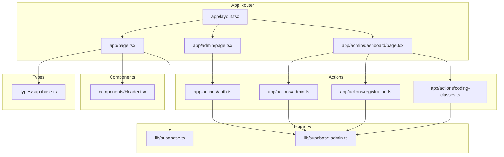
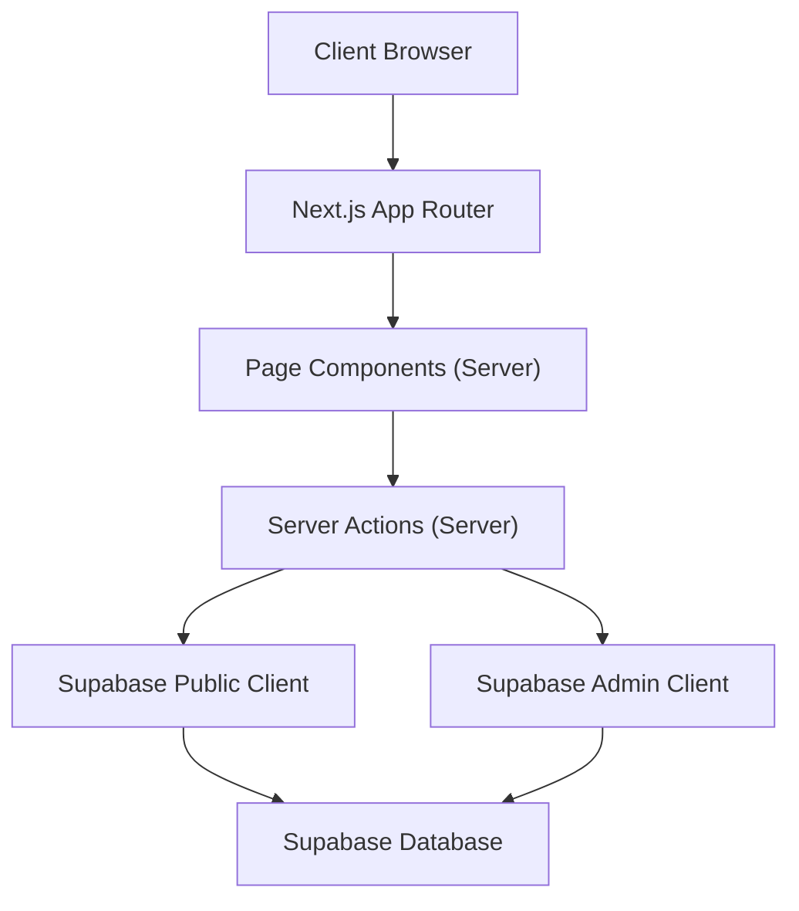
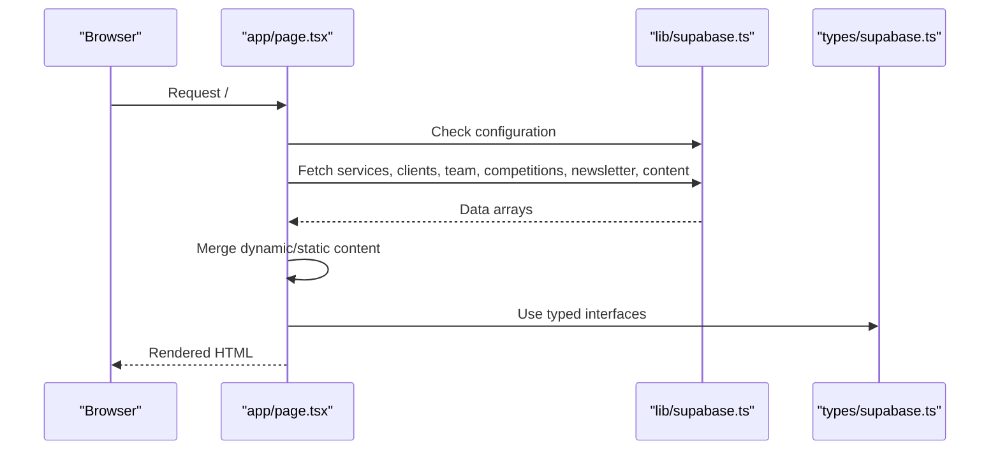
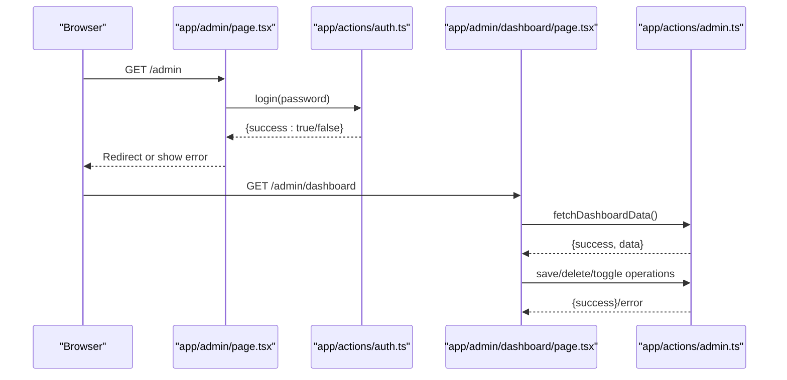
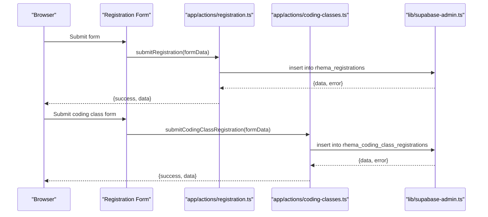
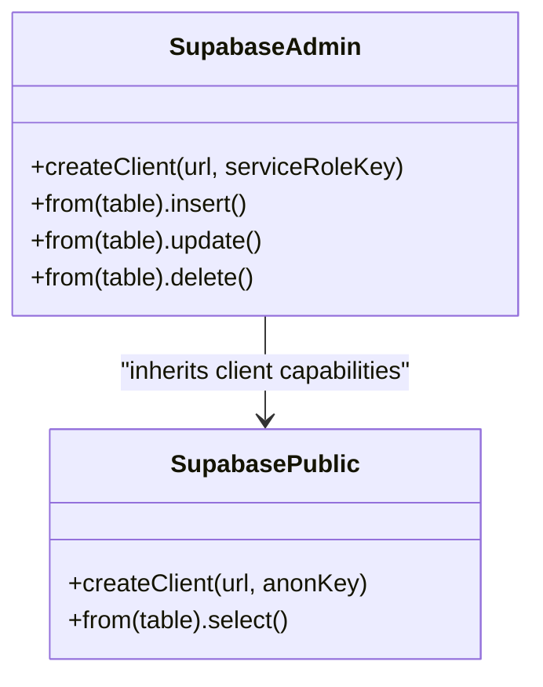
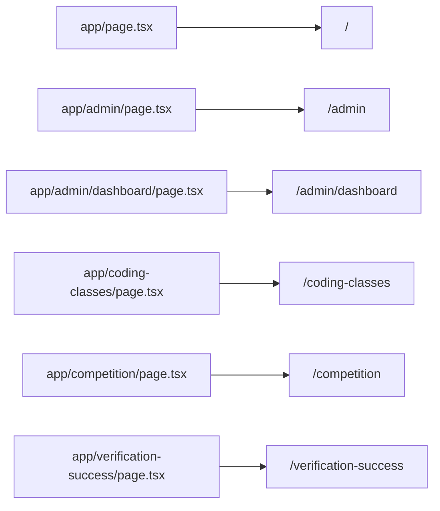
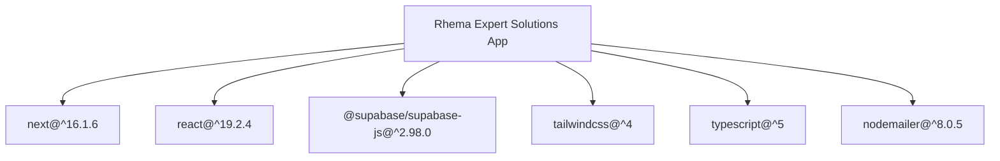

# Application Architecture

<cite>
**Referenced Files in This Document**
- [app/layout.tsx](file://app/layout.tsx)
- [app/page.tsx](file://app/page.tsx)
- [lib/supabase.ts](file://lib/supabase.ts)
- [lib/supabase-admin.ts](file://lib/supabase-admin.ts)
- [app/actions/auth.ts](file://app/actions/auth.ts)
- [app/actions/admin.ts](file://app/actions/admin.ts)
- [app/actions/registration.ts](file://app/actions/registration.ts)
- [app/actions/coding-classes.ts](file://app/actions/coding-classes.ts)
- [app/admin/dashboard/page.tsx](file://app/admin/dashboard/page.tsx)
- [app/admin/page.tsx](file://app/admin/page.tsx)
- [components/Header.tsx](file://components/Header.tsx)
- [types/supabase.ts](file://types/supabase.ts)
- [package.json](file://package.json)
- [tsconfig.json](file://tsconfig.json)
- [next.config.ts](file://next.config.ts)
</cite>

## Table of Contents
1. [Introduction](#introduction)
2. [Project Structure](#project-structure)
3. [Core Components](#core-components)
4. [Architecture Overview](#architecture-overview)
5. [Detailed Component Analysis](#detailed-component-analysis)
6. [Dependency Analysis](#dependency-analysis)
7. [Performance Considerations](#performance-considerations)
8. [Troubleshooting Guide](#troubleshooting-guide)
9. [Conclusion](#conclusion)

## Introduction
This document describes the architectural design of the Rhema Expert Solutions application built with Next.js 14+ App Router. It explains the file-based routing system, component hierarchy, separation of concerns between client and server components, server actions implementation, and data flow patterns. It also documents the integration with Supabase for authentication and database operations, including client initialization and configuration. Finally, it outlines system boundaries, component interactions, data persistence layers, and technical decisions around TypeScript, Tailwind CSS styling, and responsive design patterns.

## Project Structure
The application follows Next.js 14+ App Router conventions with a strict file-based routing model under the `/app` directory. The structure separates pages, layouts, and shared resources:

- app/: Contains routes, layouts, and page components
- app/actions/: Server actions for authentication, admin operations, and registrations
- app/admin/: Protected administrative area (login and dashboard)
- components/: Reusable UI components
- lib/: Supabase client initialization and admin client
- types/: TypeScript type definitions for Supabase tables
- public/: Static assets (images, ads)
- next.config.ts, tsconfig.json: Build and TypeScript configuration

**Diagram sources**
- [app/layout.tsx:24-42](file://app/layout.tsx#L24-L42)
- [app/page.tsx:1-20](file://app/page.tsx#L1-L20)
- [app/admin/page.tsx:1-25](file://app/admin/page.tsx#L1-L25)
- [app/admin/dashboard/page.tsx:1-15](file://app/admin/dashboard/page.tsx#L1-L15)
- [app/actions/auth.ts:1-10](file://app/actions/auth.ts#L1-L10)
- [app/actions/admin.ts:1-10](file://app/actions/admin.ts#L1-L10)
- [app/actions/registration.ts:1-10](file://app/actions/registration.ts#L1-L10)
- [app/actions/coding-classes.ts:1-10](file://app/actions/coding-classes.ts#L1-L10)
- [lib/supabase.ts:1-25](file://lib/supabase.ts#L1-L25)
- [lib/supabase-admin.ts:1-19](file://lib/supabase-admin.ts#L1-L19)
- [components/Header.tsx:1-20](file://components/Header.tsx#L1-L20)
- [types/supabase.ts:1-20](file://types/supabase.ts#L1-L20)

**Section sources**
- [app/layout.tsx:1-43](file://app/layout.tsx#L1-L43)
- [app/page.tsx:1-20](file://app/page.tsx#L1-L20)
- [app/admin/page.tsx:1-25](file://app/admin/page.tsx#L1-L25)
- [app/admin/dashboard/page.tsx:1-15](file://app/admin/dashboard/page.tsx#L1-L15)
- [lib/supabase.ts:1-25](file://lib/supabase.ts#L1-L25)
- [lib/supabase-admin.ts:1-19](file://lib/supabase-admin.ts#L1-L19)
- [components/Header.tsx:1-20](file://components/Header.tsx#L1-L20)
- [types/supabase.ts:1-20](file://types/supabase.ts#L1-L20)

## Core Components
- Root Layout: Defines global metadata, fonts, and body classes for the entire application.
- Home Page: Orchestrates dynamic content fetching from Supabase, merges with static fallbacks, and renders the marketing site sections.
- Header Component: Provides responsive navigation with desktop and mobile views.
- Supabase Clients: Public client for read operations and admin client with service role key for protected writes.
- Server Actions: Encapsulate authentication, admin CRUD operations, and registration submissions.
- Types: Strongly typed interfaces for Supabase tables.

Key architectural decisions:
- Separation of concerns: UI rendering in pages/components, data access in lib/, and business logic in actions/.
- Client/server boundary: Pages/components are rendered on the server; server actions execute on the server and are invoked from client components.
- Supabase integration: Uses a public client for frontend reads and an admin client with service role key for protected writes.

**Section sources**
- [app/layout.tsx:16-42](file://app/layout.tsx#L16-L42)
- [app/page.tsx:12-42](file://app/page.tsx#L12-L42)
- [components/Header.tsx:7-20](file://components/Header.tsx#L7-L20)
- [lib/supabase.ts:7-24](file://lib/supabase.ts#L7-L24)
- [lib/supabase-admin.ts:4-18](file://lib/supabase-admin.ts#L4-L18)
- [types/supabase.ts:5-98](file://types/supabase.ts#L5-L98)

## Architecture Overview
The application employs a layered architecture:
- Presentation Layer: Next.js App Router pages and client components
- Domain Layer: Server actions encapsulating business logic
- Persistence Layer: Supabase client libraries and database tables
- Shared Layer: Types, utilities, and reusable components

**Diagram sources**
- [app/page.tsx:8-20](file://app/page.tsx#L8-L20)
- [app/actions/auth.ts:7-43](file://app/actions/auth.ts#L7-L43)
- [app/actions/admin.ts:21-36](file://app/actions/admin.ts#L21-L36)
- [lib/supabase.ts:16-19](file://lib/supabase.ts#L16-L19)
- [lib/supabase-admin.ts:14-18](file://lib/supabase-admin.ts#L14-L18)

## Detailed Component Analysis

### Home Page Component
The home page performs concurrent data fetching from multiple Supabase tables, merges dynamic content with static fallbacks, and renders marketing sections. It conditionally renders newsletter updates and uses a content lookup helper to pull dynamic text from the content table.

**Diagram sources**
- [app/page.tsx:21-42](file://app/page.tsx#L21-L42)
- [lib/supabase.ts:22-24](file://lib/supabase.ts#L22-L24)
- [types/supabase.ts:13-54](file://types/supabase.ts#L13-L54)

**Section sources**
- [app/page.tsx:12-42](file://app/page.tsx#L12-L42)
- [lib/supabase.ts:22-24](file://lib/supabase.ts#L22-L24)
- [types/supabase.ts:13-54](file://types/supabase.ts#L13-L54)

### Authentication and Admin Dashboard
The admin area uses server actions for secure authentication and session management. The dashboard page is a client component that invokes server actions to manage content and registrations.

**Diagram sources**
- [app/admin/page.tsx:12-23](file://app/admin/page.tsx#L12-L23)
- [app/actions/auth.ts:7-43](file://app/actions/auth.ts#L7-L43)
- [app/admin/dashboard/page.tsx:54-102](file://app/admin/dashboard/page.tsx#L54-L102)
- [app/actions/admin.ts:38-98](file://app/actions/admin.ts#L38-L98)

**Section sources**
- [app/admin/page.tsx:7-23](file://app/admin/page.tsx#L7-L23)
- [app/actions/auth.ts:7-43](file://app/actions/auth.ts#L7-L43)
- [app/admin/dashboard/page.tsx:54-102](file://app/admin/dashboard/page.tsx#L54-L102)
- [app/actions/admin.ts:38-98](file://app/actions/admin.ts#L38-L98)

### Registration Workflows
Two registration flows are supported: competition registration and coding class registration. Both use server actions to insert records and notify administrators via email.

**Diagram sources**
- [app/actions/registration.ts:22-84](file://app/actions/registration.ts#L22-L84)
- [app/actions/coding-classes.ts:20-76](file://app/actions/coding-classes.ts#L20-L76)
- [lib/supabase-admin.ts:14-18](file://lib/supabase-admin.ts#L14-L18)

**Section sources**
- [app/actions/registration.ts:22-84](file://app/actions/registration.ts#L22-L84)
- [app/actions/coding-classes.ts:20-76](file://app/actions/coding-classes.ts#L20-L76)
- [lib/supabase-admin.ts:14-18](file://lib/supabase-admin.ts#L14-L18)

### Supabase Integration
The application initializes two clients:
- Public client for read-only operations based on Row Level Security (RLS)
- Admin client using a service role key for privileged write operations

**Diagram sources**
- [lib/supabase.ts:16-19](file://lib/supabase.ts#L16-L19)
- [lib/supabase-admin.ts:14-18](file://lib/supabase-admin.ts#L14-L18)

**Section sources**
- [lib/supabase.ts:7-24](file://lib/supabase.ts#L7-L24)
- [lib/supabase-admin.ts:4-18](file://lib/supabase-admin.ts#L4-L18)

### Component Hierarchy and Routing
The routing strategy leverages Next.js file-based routing:
- app/page.tsx serves as the root route (/)
- app/admin/page.tsx serves as the admin login route (/admin)
- app/admin/dashboard/page.tsx serves the admin dashboard (/admin/dashboard)
- app/coding-classes/page.tsx serves the coding classes route (/coding-classes)
- app/competition/page.tsx serves the competition route (/competition)
- app/verification-success/page.tsx serves the verification success route (/verification-success)

**Diagram sources**
- [app/page.tsx:1-10](file://app/page.tsx#L1-L10)
- [app/admin/page.tsx:1-10](file://app/admin/page.tsx#L1-L10)
- [app/admin/dashboard/page.tsx:1-10](file://app/admin/dashboard/page.tsx#L1-L10)
- [app/coding-classes/page.tsx:1-10](file://app/coding-classes/page.tsx#L1-L10)
- [app/competition/page.tsx:1-10](file://app/competition/page.tsx#L1-L10)
- [app/verification-success/page.tsx:1-10](file://app/verification-success/page.tsx#L1-L10)

**Section sources**
- [app/page.tsx:1-10](file://app/page.tsx#L1-L10)
- [app/admin/page.tsx:1-10](file://app/admin/page.tsx#L1-L10)
- [app/admin/dashboard/page.tsx:1-10](file://app/admin/dashboard/page.tsx#L1-L10)
- [app/coding-classes/page.tsx:1-10](file://app/coding-classes/page.tsx#L1-L10)
- [app/competition/page.tsx:1-10](file://app/competition/page.tsx#L1-L10)
- [app/verification-success/page.tsx:1-10](file://app/verification-success/page.tsx#L1-L10)

## Dependency Analysis
The application relies on Next.js 14+, TypeScript, Tailwind CSS, and Supabase. Dependencies are declared in package.json and configured in tsconfig.json.

**Diagram sources**
- [package.json:11-30](file://package.json#L11-L30)

**Section sources**
- [package.json:11-30](file://package.json#L11-L30)
- [tsconfig.json:2-24](file://tsconfig.json#L2-L24)

## Performance Considerations
- Concurrent data fetching: The home page uses Promise.all to fetch multiple datasets efficiently.
- Conditional rendering: Dynamic content is only rendered when available; otherwise, static fallbacks are used.
- Client/server boundary: Server actions minimize client-server round trips for admin operations.
- Responsive design: Tailwind utilities enable efficient responsive layouts without heavy CSS overrides.

[No sources needed since this section provides general guidance]

## Troubleshooting Guide
Common issues and resolutions:
- Supabase environment variables missing: The public client logs a warning and disables dynamic content loading. Ensure NEXT_PUBLIC_SUPABASE_URL and NEXT_PUBLIC_SUPABASE_ANON_KEY are configured.
- Admin service role key missing: The admin client warns if SUPABASE_SERVICE_ROLE_KEY is missing. Writes may fail if RLS is enabled without a service role key.
- Authentication failures: Verify the admin password stored in the content table or environment variables. Server actions set a session cookie upon successful login.
- Admin dashboard unauthorized errors: Ensure the admin cookie is present and valid before invoking admin actions.

**Section sources**
- [lib/supabase.ts:10-13](file://lib/supabase.ts#L10-L13)
- [lib/supabase-admin.ts:7-9](file://lib/supabase-admin.ts#L7-L9)
- [app/actions/auth.ts:31-42](file://app/actions/auth.ts#L31-L42)
- [app/actions/admin.ts:14-19](file://app/actions/admin.ts#L14-L19)

## Conclusion
The Rhema Expert Solutions application demonstrates a clean, scalable architecture using Next.js 14+ App Router. It separates client and server concerns effectively, encapsulates business logic in server actions, and integrates tightly with Supabase for authentication and data persistence. The design supports dynamic content management, responsive UI, and robust administrative workflows, providing a solid foundation for future enhancements.