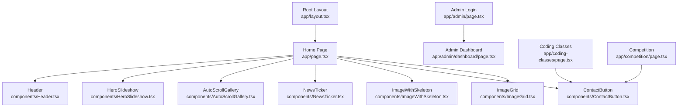
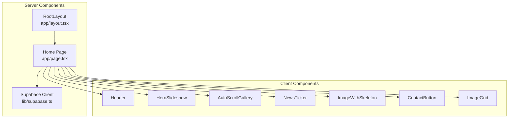
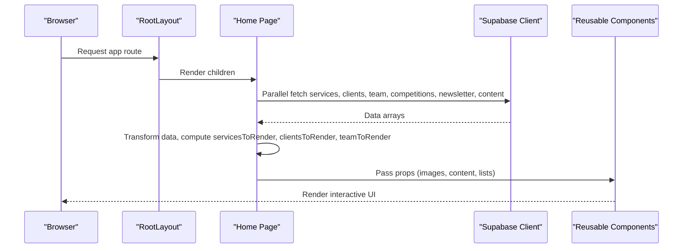
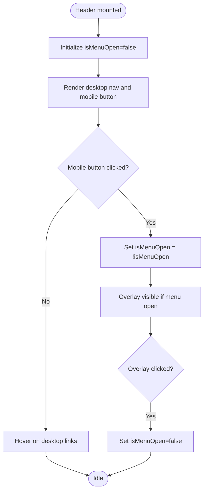
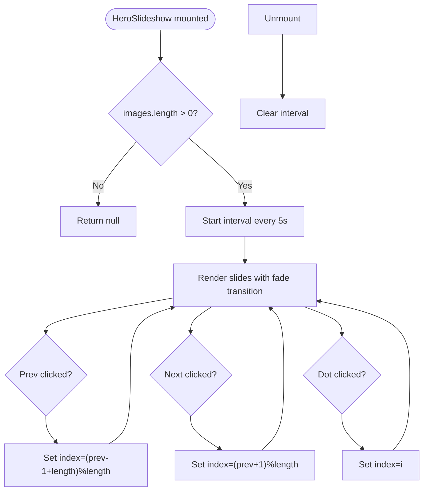
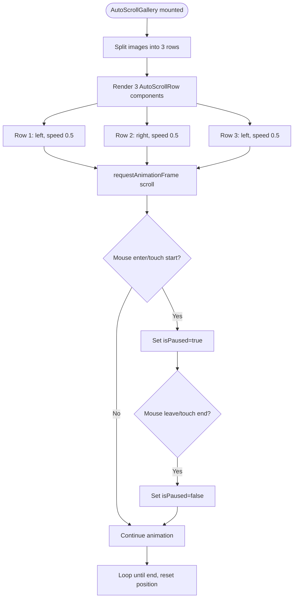
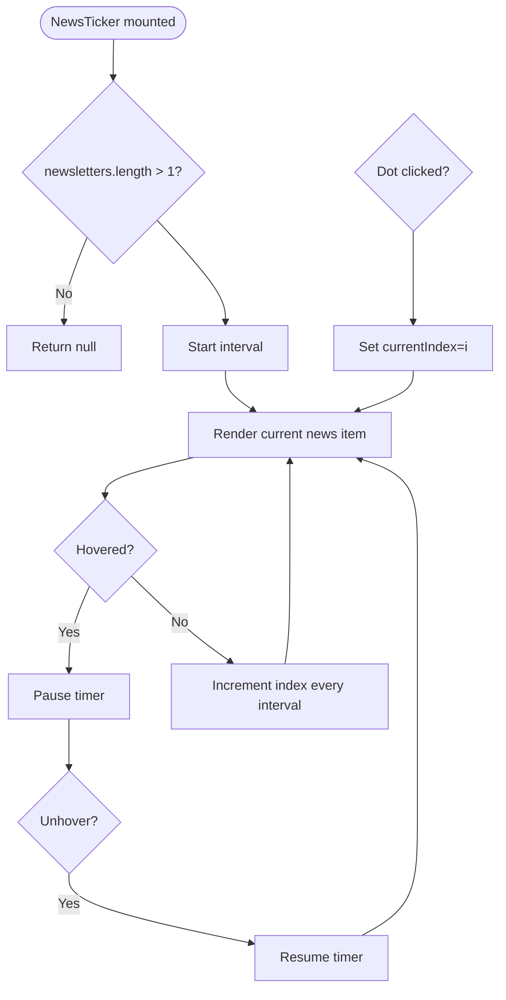
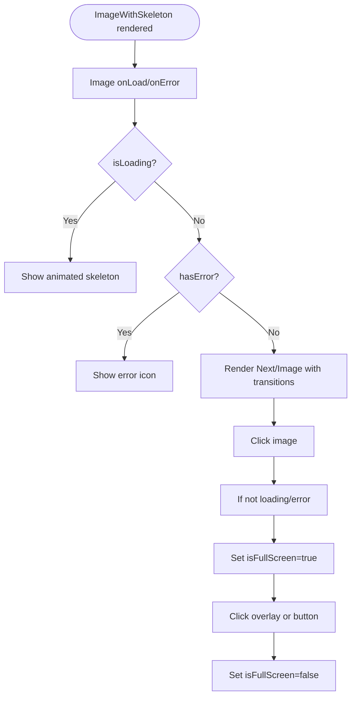
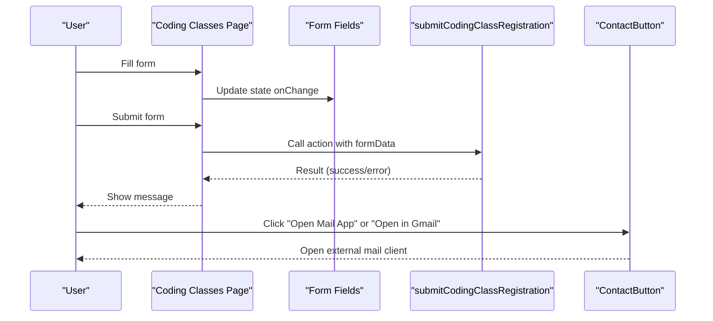
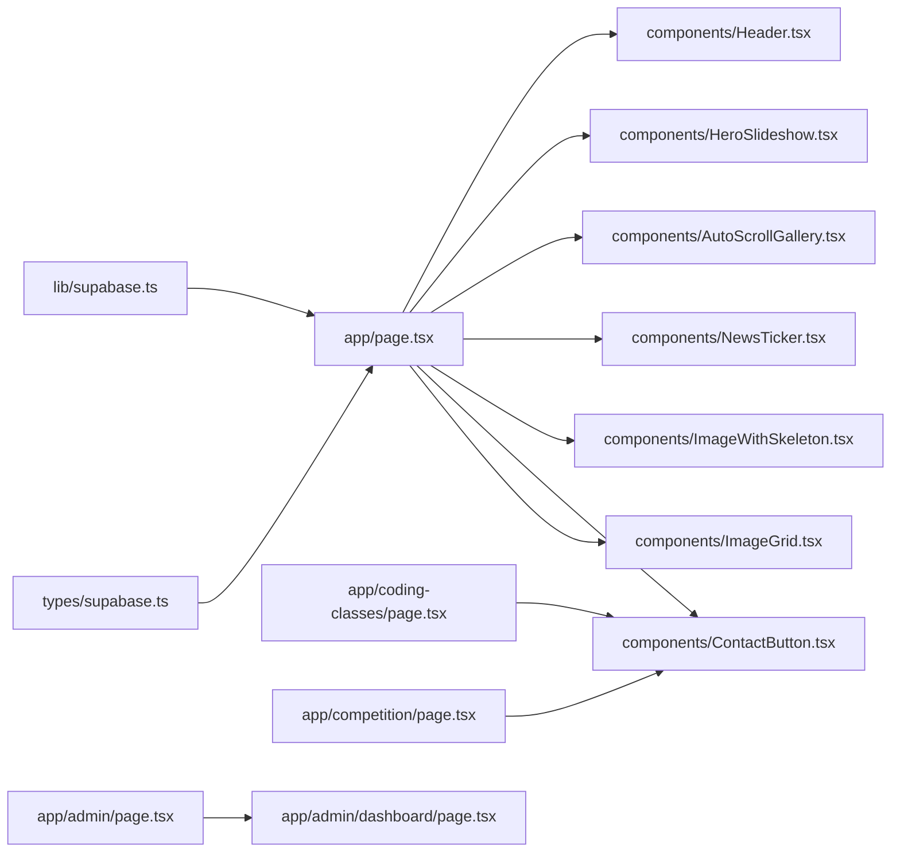

# Component Hierarchy

<cite>
**Referenced Files in This Document**
- [app/layout.tsx](file://app/layout.tsx)
- [app/page.tsx](file://app/page.tsx)
- [components/Header.tsx](file://components/Header.tsx)
- [components/HeroSlideshow.tsx](file://components/HeroSlideshow.tsx)
- [components/AutoScrollGallery.tsx](file://components/AutoScrollGallery.tsx)
- [components/NewsTicker.tsx](file://components/NewsTicker.tsx)
- [components/ImageWithSkeleton.tsx](file://components/ImageWithSkeleton.tsx)
- [components/ContactButton.tsx](file://components/ContactButton.tsx)
- [components/ImageGrid.tsx](file://components/ImageGrid.tsx)
- [lib/supabase.ts](file://lib/supabase.ts)
- [types/supabase.ts](file://types/supabase.ts)
- [app/admin/page.tsx](file://app/admin/page.tsx)
- [app/admin/dashboard/page.tsx](file://app/admin/dashboard/page.tsx)
- [app/coding-classes/page.tsx](file://app/coding-classes/page.tsx)
- [app/competition/page.tsx](file://app/competition/page.tsx)
</cite>

## Table of Contents
1. [Introduction](#introduction)
2. [Project Structure](#project-structure)
3. [Core Components](#core-components)
4. [Architecture Overview](#architecture-overview)
5. [Detailed Component Analysis](#detailed-component-analysis)
6. [Dependency Analysis](#dependency-analysis)
7. [Performance Considerations](#performance-considerations)
8. [Troubleshooting Guide](#troubleshooting-guide)
9. [Conclusion](#conclusion)

## Introduction
This document explains the component hierarchy and architectural patterns used in Rhema Expert Solutions. It focuses on how the root layout composes page-level components, how reusable UI components are composed, and how props and state are managed across the Next.js rendering pipeline. It also covers client versus server component boundaries, composition strategies, and performance considerations such as component splitting and lazy loading.

## Project Structure
The application follows a Next.js App Router structure with:
- A root layout that wraps all pages and injects global styles and fonts.
- A home page that orchestrates multiple reusable components.
- A set of shared UI components under components/.
- Admin and feature pages under app/.

**Diagram sources**
- [app/layout.tsx:1-43](file://app/layout.tsx#L1-L43)
- [app/page.tsx:1-788](file://app/page.tsx#L1-L788)
- [components/Header.tsx:1-138](file://components/Header.tsx#L1-L138)
- [components/HeroSlideshow.tsx:1-96](file://components/HeroSlideshow.tsx#L1-L96)
- [components/AutoScrollGallery.tsx:1-101](file://components/AutoScrollGallery.tsx#L1-L101)
- [components/NewsTicker.tsx:1-92](file://components/NewsTicker.tsx#L1-L92)
- [components/ImageWithSkeleton.tsx:1-121](file://components/ImageWithSkeleton.tsx#L1-L121)
- [components/ContactButton.tsx:1-58](file://components/ContactButton.tsx#L1-L58)
- [components/ImageGrid.tsx:1-64](file://components/ImageGrid.tsx#L1-L64)
- [app/admin/page.tsx:1-52](file://app/admin/page.tsx#L1-L52)
- [app/admin/dashboard/page.tsx:1-800](file://app/admin/dashboard/page.tsx#L1-L800)
- [app/coding-classes/page.tsx:1-390](file://app/coding-classes/page.tsx#L1-L390)
- [app/competition/page.tsx:1-316](file://app/competition/page.tsx#L1-L316)

**Section sources**
- [app/layout.tsx:1-43](file://app/layout.tsx#L1-L43)
- [app/page.tsx:1-788](file://app/page.tsx#L1-L788)

## Core Components
- Root Layout: Provides global metadata, fonts, and wraps page content with a minimal shell.
- Home Page: Orchestrates dynamic content fetching, transforms data, and composes reusable components.
- Reusable UI Components:
  - Header: Client-side navigation with responsive drawer and social links.
  - HeroSlideshow: Client-side image carousel with manual controls and auto-rotation.
  - AutoScrollGallery: Client-side gallery with three synchronized rows and hover pause.
  - NewsTicker: Client-side ticker with auto-rotation and manual navigation.
  - ImageWithSkeleton: Client-side image with skeleton loader and lightbox.
  - ContactButton: Client-side action buttons for email workflows.
  - ImageGrid: Client-side grid with modal lightbox.

These components are composed in the Home Page and reused across feature pages such as Coding Classes and Competition.

**Section sources**
- [app/layout.tsx:16-42](file://app/layout.tsx#L16-L42)
- [app/page.tsx:12-787](file://app/page.tsx#L12-L787)
- [components/Header.tsx:7-138](file://components/Header.tsx#L7-L138)
- [components/HeroSlideshow.tsx:11-96](file://components/HeroSlideshow.tsx#L11-L96)
- [components/AutoScrollGallery.tsx:86-101](file://components/AutoScrollGallery.tsx#L86-L101)
- [components/NewsTicker.tsx:11-92](file://components/NewsTicker.tsx#L11-L92)
- [components/ImageWithSkeleton.tsx:10-121](file://components/ImageWithSkeleton.tsx#L10-L121)
- [components/ContactButton.tsx:5-58](file://components/ContactButton.tsx#L5-L58)
- [components/ImageGrid.tsx:13-64](file://components/ImageGrid.tsx#L13-L64)

## Architecture Overview
The architecture leverages Next.js App Router with a clear separation between server-rendered pages and client-side interactive components:
- Server components:
  - Root layout and home page orchestrate data fetching and pass props to client components.
  - Feature pages (Coding Classes, Competition) are client components with local state and form submissions.
- Client components:
  - Interactive widgets (Header, HeroSlideshow, AutoScrollGallery, NewsTicker, ImageWithSkeleton, ContactButton) manage internal state and DOM events.
- Data layer:
  - Supabase client is configured for read-only access and used in server components to fetch dynamic content.
  - Types define shapes for database records.

**Diagram sources**
- [app/layout.tsx:24-42](file://app/layout.tsx#L24-L42)
- [app/page.tsx:12-787](file://app/page.tsx#L12-L787)
- [lib/supabase.ts:16-24](file://lib/supabase.ts#L16-L24)
- [components/Header.tsx:1-138](file://components/Header.tsx#L1-L138)
- [components/HeroSlideshow.tsx:1-96](file://components/HeroSlideshow.tsx#L1-L96)
- [components/AutoScrollGallery.tsx:1-101](file://components/AutoScrollGallery.tsx#L1-L101)
- [components/NewsTicker.tsx:1-92](file://components/NewsTicker.tsx#L1-L92)
- [components/ImageWithSkeleton.tsx:1-121](file://components/ImageWithSkeleton.tsx#L1-L121)
- [components/ContactButton.tsx:1-58](file://components/ContactButton.tsx#L1-L58)
- [components/ImageGrid.tsx:1-64](file://components/ImageGrid.tsx#L1-L64)

## Detailed Component Analysis

### Root Layout and Page Composition
- Root Layout sets metadata, fonts, and global styles. It receives children from page components and renders them inside html/body.
- Home Page performs parallel data fetching from Supabase, merges dynamic and static content, computes derived props, and passes them to child components. It also defines helper functions to resolve content keys and fallbacks.

**Diagram sources**
- [app/layout.tsx:24-42](file://app/layout.tsx#L24-L42)
- [app/page.tsx:21-42](file://app/page.tsx#L21-L42)
- [app/page.tsx:125-138](file://app/page.tsx#L125-L138)
- [app/page.tsx:141-167](file://app/page.tsx#L141-L167)
- [app/page.tsx:197-222](file://app/page.tsx#L197-L222)
- [lib/supabase.ts:16-24](file://lib/supabase.ts#L16-L24)

**Section sources**
- [app/layout.tsx:24-42](file://app/layout.tsx#L24-L42)
- [app/page.tsx:12-787](file://app/page.tsx#L12-L787)
- [lib/supabase.ts:16-24](file://lib/supabase.ts#L16-L24)

### Header Component
- Purpose: Responsive navigation with logo, desktop menu, and mobile sidebar drawer.
- Props: None (self-contained).
- State: Local state toggles drawer visibility.
- Interactions: Click handlers for toggling and closing the drawer; external links open in new tabs.

**Diagram sources**
- [components/Header.tsx:7-138](file://components/Header.tsx#L7-L138)

**Section sources**
- [components/Header.tsx:7-138](file://components/Header.tsx#L7-L138)

### HeroSlideshow Component
- Purpose: Auto-rotating hero image carousel with manual controls and navigation dots.
- Props: images (string[]).
- State: currentImageIndex with lifecycle cleanup.
- Interactions: Interval updates, prev/next buttons, dot navigation; priority image for initial render.

**Diagram sources**
- [components/HeroSlideshow.tsx:11-96](file://components/HeroSlideshow.tsx#L11-L96)

**Section sources**
- [components/HeroSlideshow.tsx:11-96](file://components/HeroSlideshow.tsx#L11-L96)

### AutoScrollGallery Component
- Purpose: Three synchronized horizontal scrolling rows with hover pause and seamless looping.
- Props: images (string[]), direction ('left'|'right'), speed (number).
- State: isPaused, offset, scroll container ref.
- Interactions: requestAnimationFrame-driven scroll; duplicates images to ensure continuity; pauses on hover/touch.

**Diagram sources**
- [components/AutoScrollGallery.tsx:86-101](file://components/AutoScrollGallery.tsx#L86-L101)
- [components/AutoScrollGallery.tsx:12-84](file://components/AutoScrollGallery.tsx#L12-L84)

**Section sources**
- [components/AutoScrollGallery.tsx:86-101](file://components/AutoScrollGallery.tsx#L86-L101)
- [components/AutoScrollGallery.tsx:12-84](file://components/AutoScrollGallery.tsx#L12-L84)

### NewsTicker Component
- Purpose: Rotating news feed with manual navigation and hover pause.
- Props: newsletters (RhemaNewsletter[]), interval (number).
- State: currentIndex, isHovered.
- Interactions: interval updates; hover pauses; dot navigation; displays title/content/date.

**Diagram sources**
- [components/NewsTicker.tsx:11-92](file://components/NewsTicker.tsx#L11-L92)

**Section sources**
- [components/NewsTicker.tsx:11-92](file://components/NewsTicker.tsx#L11-L92)

### ImageWithSkeleton Component
- Purpose: Optimistic image loading with skeleton and error placeholders; supports full-screen lightbox.
- Props: Inherits Next.js Image props plus containerClassName; manages loading/error states.
- State: isLoading, hasError, isFullScreen.
- Interactions: click to open/close lightbox; handles onLoad/onError; applies transitions.

**Diagram sources**
- [components/ImageWithSkeleton.tsx:10-121](file://components/ImageWithSkeleton.tsx#L10-L121)

**Section sources**
- [components/ImageWithSkeleton.tsx:10-121](file://components/ImageWithSkeleton.tsx#L10-L121)

### ContactButton Component
- Purpose: Provides quick actions to open mail client or Gmail web, or copy email.
- Props: None.
- State: None.
- Interactions: Opens external URLs in new tabs; copies text to clipboard.

**Section sources**
- [components/ContactButton.tsx:5-58](file://components/ContactButton.tsx#L5-L58)

### ImageGrid Component
- Purpose: Grid of images with modal lightbox and optional title/description.
- Props: images (string[]), title?, description?.
- State: selectedImage.
- Interactions: click to open modal; click modal to close.

**Section sources**
- [components/ImageGrid.tsx:13-64](file://components/ImageGrid.tsx#L13-L64)

### Feature Pages and Composition Patterns
- Coding Classes Page: Client component with form state, course selection, and payment plan selection. Uses ContactButton for email actions.
- Competition Page: Client component with form state and submission flow. Uses ContactButton for email actions.
- Both pages demonstrate:
  - Local state management for forms.
  - Prop drilling of callbacks and state up to parent components (in this case, the pages themselves).
  - Composition of shared components (ContactButton) for consistent UX.

**Diagram sources**
- [app/coding-classes/page.tsx:26-86](file://app/coding-classes/page.tsx#L26-L86)
- [components/ContactButton.tsx:5-58](file://components/ContactButton.tsx#L5-L58)

**Section sources**
- [app/coding-classes/page.tsx:26-86](file://app/coding-classes/page.tsx#L26-L86)
- [app/competition/page.tsx:32-64](file://app/competition/page.tsx#L32-L64)
- [components/ContactButton.tsx:5-58](file://components/ContactButton.tsx#L5-L58)

## Dependency Analysis
- Data dependencies:
  - Home Page depends on Supabase client to fetch dynamic content and merges it with static fallbacks.
  - Types define the shape of database records used across components.
- Component dependencies:
  - Home Page composes Header, HeroSlideshow, AutoScrollGallery, NewsTicker, ImageWithSkeleton, ContactButton, and ImageGrid.
  - Feature pages (Coding Classes, Competition) depend on ContactButton and form actions.
- Admin pages:
  - Admin Login and Dashboard are client components that rely on server actions for authentication and data management.

**Diagram sources**
- [lib/supabase.ts:16-24](file://lib/supabase.ts#L16-L24)
- [types/supabase.ts:5-113](file://types/supabase.ts#L5-L113)
- [app/page.tsx:12-787](file://app/page.tsx#L12-L787)
- [components/Header.tsx:1-138](file://components/Header.tsx#L1-L138)
- [components/HeroSlideshow.tsx:1-96](file://components/HeroSlideshow.tsx#L1-L96)
- [components/AutoScrollGallery.tsx:1-101](file://components/AutoScrollGallery.tsx#L1-L101)
- [components/NewsTicker.tsx:1-92](file://components/NewsTicker.tsx#L1-L92)
- [components/ImageWithSkeleton.tsx:1-121](file://components/ImageWithSkeleton.tsx#L1-L121)
- [components/ContactButton.tsx:1-58](file://components/ContactButton.tsx#L1-L58)
- [components/ImageGrid.tsx:1-64](file://components/ImageGrid.tsx#L1-L64)
- [app/coding-classes/page.tsx:1-390](file://app/coding-classes/page.tsx#L1-L390)
- [app/competition/page.tsx:1-316](file://app/competition/page.tsx#L1-L316)
- [app/admin/page.tsx:1-52](file://app/admin/page.tsx#L1-L52)
- [app/admin/dashboard/page.tsx:1-800](file://app/admin/dashboard/page.tsx#L1-L800)

**Section sources**
- [lib/supabase.ts:16-24](file://lib/supabase.ts#L16-L24)
- [types/supabase.ts:5-113](file://types/supabase.ts#L5-L113)
- [app/page.tsx:12-787](file://app/page.tsx#L12-L787)

## Performance Considerations
- Component splitting and lazy loading:
  - Use client directives on interactive components to keep server rendering lean.
  - Defer heavy computations to the client or split into smaller components.
- Image optimization:
  - Prefer Next/Image with appropriate sizes and fill for responsive layouts.
  - Use ImageWithSkeleton to reduce layout shift and improve perceived performance.
- Data fetching:
  - Use Promise.all for concurrent reads to Supabase to minimize latency.
  - Implement fallbacks to static content when dynamic data is unavailable.
- Animations:
  - requestAnimationFrame-based scrolling avoids layout thrashing.
  - CSS transitions and controlled opacity reduce jank during image swaps.
- Rendering:
  - Keep props shallow and memoize derived data to avoid unnecessary re-renders.
  - Avoid deep prop drilling by grouping related props into smaller component slices.

## Troubleshooting Guide
- Supabase configuration warnings:
  - If environment variables are missing, dynamic content will not load. Confirm NEXT_PUBLIC_SUPABASE_URL and NEXT_PUBLIC_SUPABASE_ANON_KEY are set.
- Dynamic content fallback:
  - When dynamicServices is null, static services are shown. When empty array, nothing is rendered. Adjust logic to match desired UX.
- Client component hydration:
  - Ensure client components are marked with 'use client' to enable state and effects.
- Form submission errors:
  - Feature pages display messages based on action results. Inspect action responses and adjust UI feedback accordingly.

**Section sources**
- [lib/supabase.ts:10-24](file://lib/supabase.ts#L10-L24)
- [app/page.tsx:125-138](file://app/page.tsx#L125-L138)
- [app/coding-classes/page.tsx:56-86](file://app/coding-classes/page.tsx#L56-L86)
- [app/competition/page.tsx:32-64](file://app/competition/page.tsx#L32-L64)

## Conclusion
Rhema Expert Solutions employs a clean component hierarchy with a server-rendered root layout and home page orchestrating reusable client components. Props-based composition and controlled state management deliver a responsive, accessible UI. Client-server boundaries are respected: server components fetch and prepare data, while client components handle interactivity. Following the composition patterns and performance recommendations outlined here ensures maintainable and scalable UI development.