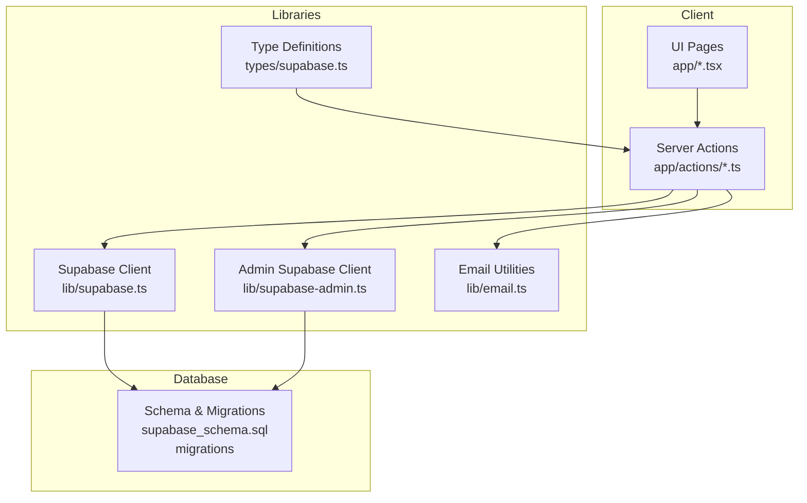
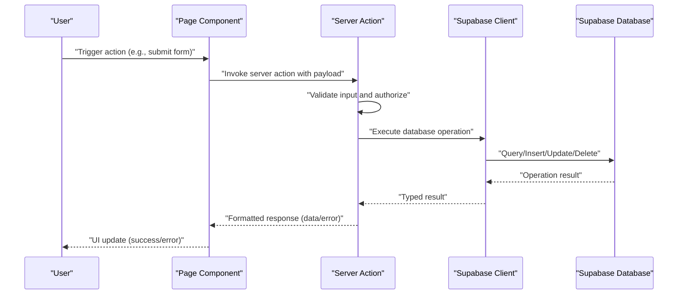
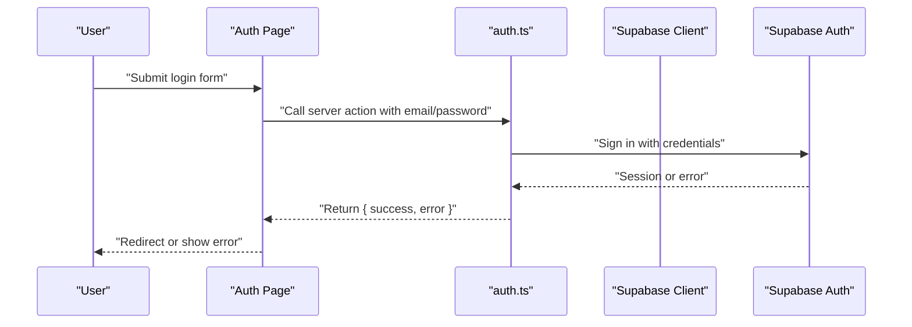
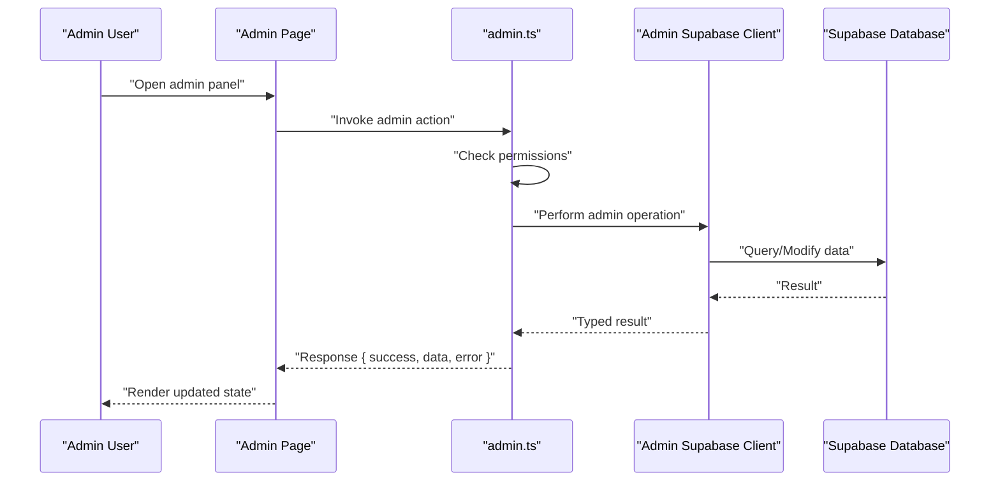
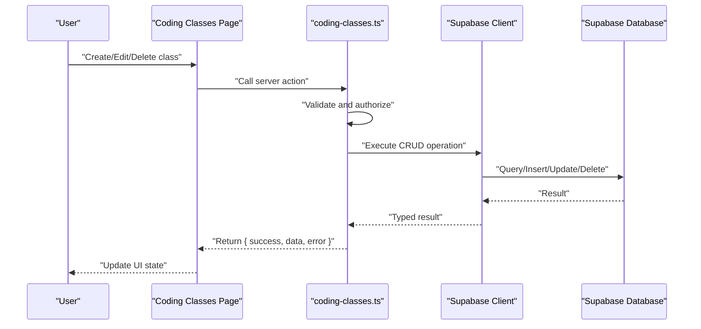
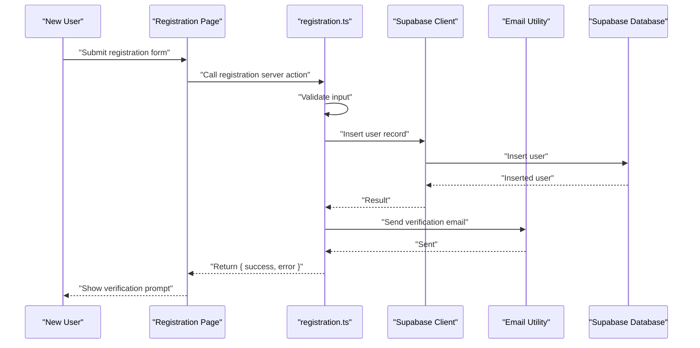
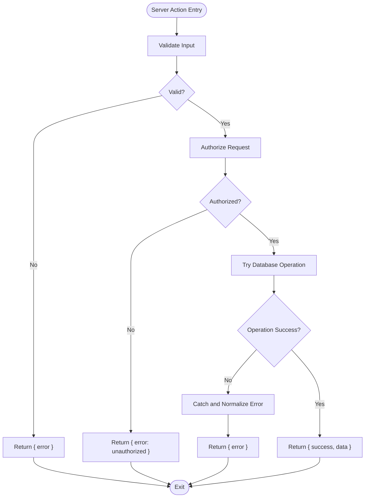
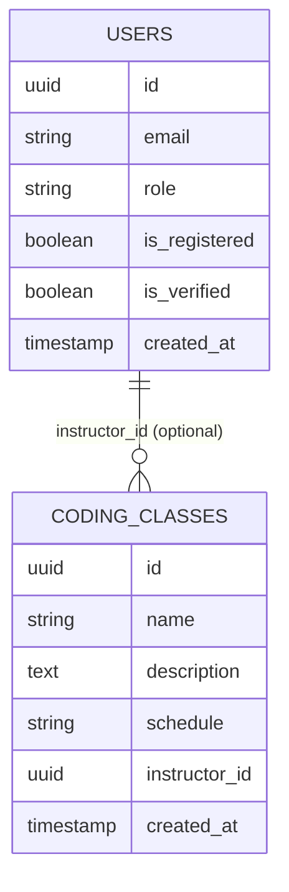
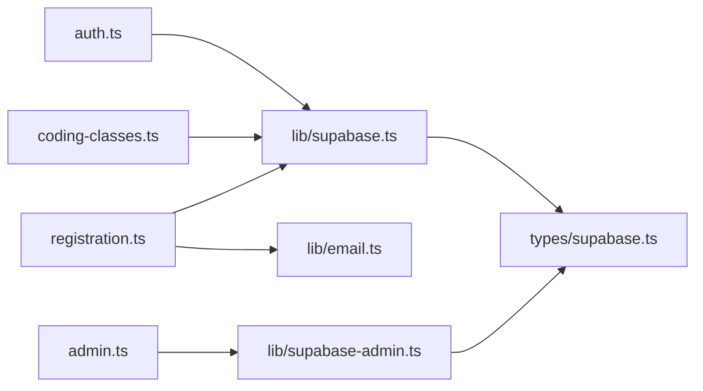

# Data Flow Patterns

<cite>
**Referenced Files in This Document**
- [README.md](file://README.md)
- [app/actions/auth.ts](file://app/actions/auth.ts)
- [app/actions/admin.ts](file://app/actions/admin.ts)
- [app/actions/coding-classes.ts](file://app/actions/coding-classes.ts)
- [app/actions/registration.ts](file://app/actions/registration.ts)
- [lib/supabase.ts](file://lib/supabase.ts)
- [lib/supabase-admin.ts](file://lib/supabase-admin.ts)
- [lib/email.ts](file://lib/email.ts)
- [types/supabase.ts](file://types/supabase.ts)
- [supabase_schema.sql](file://supabase_schema.sql)
- [supabase_migration_add_coding_classes.sql](file://supabase_migration_add_coding_classes.sql)
- [supabase_migration_add_school_phone.sql](file://supabase_migration_add_school_phone.sql)
</cite>

## Table of Contents
1. [Introduction](#introduction)
2. [Project Structure](#project-structure)
3. [Core Components](#core-components)
4. [Architecture Overview](#architecture-overview)
5. [Detailed Component Analysis](#detailed-component-analysis)
6. [Dependency Analysis](#dependency-analysis)
7. [Performance Considerations](#performance-considerations)
8. [Security Considerations](#security-considerations)
9. [Troubleshooting Guide](#troubleshooting-guide)
10. [Conclusion](#conclusion)

## Introduction
This document explains the data flow patterns across the Rhema Expert Solutions application. It focuses on how user interactions propagate through client components, server actions, and Supabase database operations. It documents the server action pattern, including validation, error handling, and response formatting, and illustrates CRUD operations, real-time updates, and state synchronization. Security considerations such as authentication checks and authorization patterns are also addressed.

## Project Structure
The application follows a Next.js app directory layout with a dedicated actions folder for server-side logic, a lib folder for Supabase clients and utilities, and a types folder for type definitions. Supabase schema and migration scripts define the database model and initial data structures.

**Diagram sources**
- [app/actions/auth.ts](file://app/actions/auth.ts)
- [app/actions/admin.ts](file://app/actions/admin.ts)
- [app/actions/coding-classes.ts](file://app/actions/coding-classes.ts)
- [app/actions/registration.ts](file://app/actions/registration.ts)
- [lib/supabase.ts](file://lib/supabase.ts)
- [lib/supabase-admin.ts](file://lib/supabase-admin.ts)
- [lib/email.ts](file://lib/email.ts)
- [types/supabase.ts](file://types/supabase.ts)
- [supabase_schema.sql](file://supabase_schema.sql)
- [supabase_migration_add_coding_classes.sql](file://supabase_migration_add_coding_classes.sql)
- [supabase_migration_add_school_phone.sql](file://supabase_migration_add_school_phone.sql)

**Section sources**
- [README.md](file://README.md)
- [app/actions/auth.ts](file://app/actions/auth.ts)
- [app/actions/admin.ts](file://app/actions/admin.ts)
- [app/actions/coding-classes.ts](file://app/actions/coding-classes.ts)
- [app/actions/registration.ts](file://app/actions/registration.ts)
- [lib/supabase.ts](file://lib/supabase.ts)
- [lib/supabase-admin.ts](file://lib/supabase-admin.ts)
- [lib/email.ts](file://lib/email.ts)
- [types/supabase.ts](file://types/supabase.ts)
- [supabase_schema.sql](file://supabase_schema.sql)
- [supabase_migration_add_coding_classes.sql](file://supabase_migration_add_coding_classes.sql)
- [supabase_migration_add_school_phone.sql](file://supabase_migration_add_school_phone.sql)

## Core Components
- Supabase Client: Provides authenticated database operations for the application.
- Admin Supabase Client: Offers administrative privileges for privileged operations.
- Email Utilities: Encapsulates email-related logic used during user registration and verification.
- Type Definitions: Define database row types and helper types for type-safe operations.
- Server Actions: Implement server-side logic for authentication, admin tasks, coding classes, and registration.

Key responsibilities:
- Authentication actions manage sign-in/sign-out and session state.
- Admin actions enforce authorization and perform administrative tasks.
- Coding classes actions handle class-related CRUD operations.
- Registration actions process user registration and verification flows.
- Supabase clients abstract database access and provide typed queries.

**Section sources**
- [lib/supabase.ts](file://lib/supabase.ts)
- [lib/supabase-admin.ts](file://lib/supabase-admin.ts)
- [lib/email.ts](file://lib/email.ts)
- [types/supabase.ts](file://types/supabase.ts)
- [app/actions/auth.ts](file://app/actions/auth.ts)
- [app/actions/admin.ts](file://app/actions/admin.ts)
- [app/actions/coding-classes.ts](file://app/actions/coding-classes.ts)
- [app/actions/registration.ts](file://app/actions/registration.ts)

## Architecture Overview
The data flow follows a predictable pattern:
- Client pages trigger user interactions.
- Server actions encapsulate business logic and validation.
- Supabase clients execute database operations.
- Responses are returned to the client for UI updates.
- Real-time capabilities can be integrated via Supabase subscriptions.

**Diagram sources**
- [app/actions/auth.ts](file://app/actions/auth.ts)
- [app/actions/admin.ts](file://app/actions/admin.ts)
- [app/actions/coding-classes.ts](file://app/actions/coding-classes.ts)
- [app/actions/registration.ts](file://app/actions/registration.ts)
- [lib/supabase.ts](file://lib/supabase.ts)
- [lib/supabase-admin.ts](file://lib/supabase-admin.ts)

## Detailed Component Analysis

### Authentication Flow
The authentication server action manages user sign-in and session state. Typical steps include:
- Validate credentials and input shape.
- Authenticate against Supabase auth service.
- Return structured success/failure response.
- On success, synchronize session state on the client.

**Diagram sources**
- [app/actions/auth.ts](file://app/actions/auth.ts)
- [lib/supabase.ts](file://lib/supabase.ts)

**Section sources**
- [app/actions/auth.ts](file://app/actions/auth.ts)
- [lib/supabase.ts](file://lib/supabase.ts)

### Admin Operations Flow
Admin actions enforce authorization and perform privileged operations. Typical steps include:
- Verify user role/permission.
- Validate request payload.
- Execute database operations via admin client.
- Return formatted response.

**Diagram sources**
- [app/actions/admin.ts](file://app/actions/admin.ts)
- [lib/supabase-admin.ts](file://lib/supabase-admin.ts)

**Section sources**
- [app/actions/admin.ts](file://app/actions/admin.ts)
- [lib/supabase-admin.ts](file://lib/supabase-admin.ts)

### Coding Classes CRUD Flow
Coding classes actions implement CRUD operations for classes. Typical steps include:
- Validate input (e.g., class name, schedule).
- Authorize access (e.g., admin or instructor).
- Perform insert/update/delete/select.
- Return normalized response.

**Diagram sources**
- [app/actions/coding-classes.ts](file://app/actions/coding-classes.ts)
- [lib/supabase.ts](file://lib/supabase.ts)

**Section sources**
- [app/actions/coding-classes.ts](file://app/actions/coding-classes.ts)
- [lib/supabase.ts](file://lib/supabase.ts)

### Registration and Verification Flow
Registration actions coordinate user creation and verification. Typical steps include:
- Validate registration payload.
- Insert new user record.
- Send verification email via email utilities.
- Handle verification callback and finalize account.

**Diagram sources**
- [app/actions/registration.ts](file://app/actions/registration.ts)
- [lib/supabase.ts](file://lib/supabase.ts)
- [lib/email.ts](file://lib/email.ts)

**Section sources**
- [app/actions/registration.ts](file://app/actions/registration.ts)
- [lib/supabase.ts](file://lib/supabase.ts)
- [lib/email.ts](file://lib/email.ts)

### Data Validation and Error Handling Pattern
Server actions implement a consistent validation and error handling pattern:
- Input validation using typed schemas.
- Authorization checks before database operations.
- Try/catch blocks around database calls.
- Structured response format: { success, data?, error? }.
- Client-side handling to render appropriate UI feedback.

**Diagram sources**
- [app/actions/auth.ts](file://app/actions/auth.ts)
- [app/actions/admin.ts](file://app/actions/admin.ts)
- [app/actions/coding-classes.ts](file://app/actions/coding-classes.ts)
- [app/actions/registration.ts](file://app/actions/registration.ts)

**Section sources**
- [app/actions/auth.ts](file://app/actions/auth.ts)
- [app/actions/admin.ts](file://app/actions/admin.ts)
- [app/actions/coding-classes.ts](file://app/actions/coding-classes.ts)
- [app/actions/registration.ts](file://app/actions/registration.ts)

### Real-Time Updates and State Synchronization
Real-time updates can be achieved by:
- Subscribing to Supabase tables in client components.
- Reacting to INSERT/UPDATE/DELETE events to refresh local state.
- Using server actions to mutate data and trigger re-fetches.
- Maintaining optimistic updates with rollback on errors.

[No sources needed since this section provides general guidance]

### Database Model Overview
The database model is defined by the schema and migrations. Key entities include users and coding classes. Migrations add tables and columns for classes and school contact information.

**Diagram sources**
- [supabase_schema.sql](file://supabase_schema.sql)
- [supabase_migration_add_coding_classes.sql](file://supabase_migration_add_coding_classes.sql)
- [supabase_migration_add_school_phone.sql](file://supabase_migration_add_school_phone.sql)

**Section sources**
- [supabase_schema.sql](file://supabase_schema.sql)
- [supabase_migration_add_coding_classes.sql](file://supabase_migration_add_coding_classes.sql)
- [supabase_migration_add_school_phone.sql](file://supabase_migration_add_school_phone.sql)

## Dependency Analysis
The following diagram shows dependencies among server actions and supporting libraries.

**Diagram sources**
- [app/actions/auth.ts](file://app/actions/auth.ts)
- [app/actions/admin.ts](file://app/actions/admin.ts)
- [app/actions/coding-classes.ts](file://app/actions/coding-classes.ts)
- [app/actions/registration.ts](file://app/actions/registration.ts)
- [lib/supabase.ts](file://lib/supabase.ts)
- [lib/supabase-admin.ts](file://lib/supabase-admin.ts)
- [lib/email.ts](file://lib/email.ts)
- [types/supabase.ts](file://types/supabase.ts)

**Section sources**
- [app/actions/auth.ts](file://app/actions/auth.ts)
- [app/actions/admin.ts](file://app/actions/admin.ts)
- [app/actions/coding-classes.ts](file://app/actions/coding-classes.ts)
- [app/actions/registration.ts](file://app/actions/registration.ts)
- [lib/supabase.ts](file://lib/supabase.ts)
- [lib/supabase-admin.ts](file://lib/supabase-admin.ts)
- [lib/email.ts](file://lib/email.ts)
- [types/supabase.ts](file://types/supabase.ts)

## Performance Considerations
- Minimize round-trips by batching related operations in a single server action.
- Use typed queries to avoid unnecessary data fetching.
- Leverage Supabase filters and limits to reduce payload sizes.
- Cache frequently accessed data on the client and invalidate on mutations.
- Use optimistic updates for immediate feedback, with rollback on failure.

[No sources needed since this section provides general guidance]

## Security Considerations
- Authentication checks: Ensure every sensitive action verifies active session and required roles.
- Authorization patterns: Enforce role-based access control (RBAC) before executing admin or instructor operations.
- Input validation: Validate and sanitize all inputs to prevent injection and malformed data.
- Error handling: Avoid leaking internal errors; return generic messages while logging details securely.
- Session management: Use secure cookies and proper CSRF protection if integrating forms directly with server actions.

**Section sources**
- [app/actions/auth.ts](file://app/actions/auth.ts)
- [app/actions/admin.ts](file://app/actions/admin.ts)
- [app/actions/coding-classes.ts](file://app/actions/coding-classes.ts)
- [app/actions/registration.ts](file://app/actions/registration.ts)

## Troubleshooting Guide
Common issues and resolutions:
- Authentication failures: Verify credentials and session state; check server action response format.
- Authorization errors: Confirm user role and permissions; ensure admin client is used for privileged operations.
- Database errors: Inspect typed query results and normalize errors; confirm schema matches migrations.
- Email delivery: Validate email utility configuration and logs; confirm verification links and tokens.
- Real-time sync: Ensure subscriptions are established after data mutation; handle reconnection gracefully.

**Section sources**
- [app/actions/auth.ts](file://app/actions/auth.ts)
- [app/actions/admin.ts](file://app/actions/admin.ts)
- [app/actions/coding-classes.ts](file://app/actions/coding-classes.ts)
- [app/actions/registration.ts](file://app/actions/registration.ts)
- [lib/email.ts](file://lib/email.ts)

## Conclusion
The Rhema Expert Solutions application implements a clear data flow pattern centered on server actions, typed Supabase clients, and robust validation and error handling. By enforcing authentication and authorization, structuring CRUD operations consistently, and leveraging real-time capabilities, the system ensures reliable state synchronization and a secure user experience.