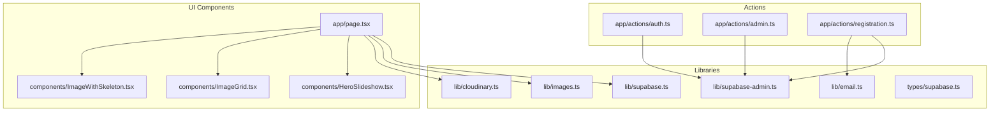
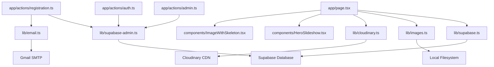
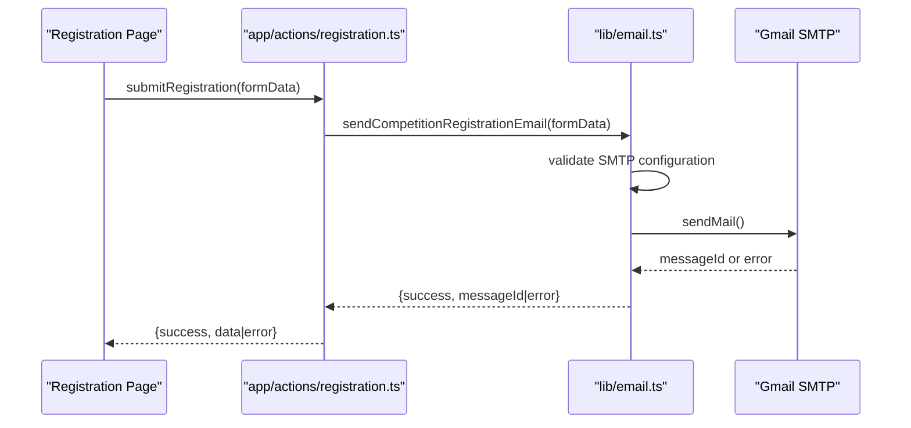
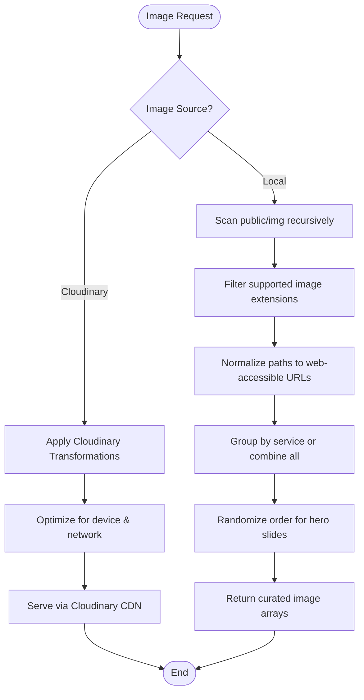
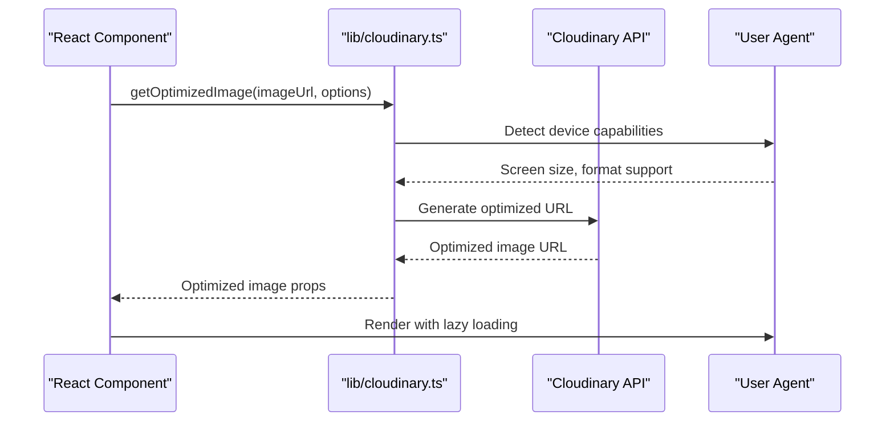
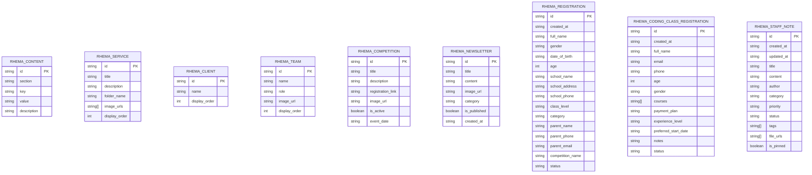
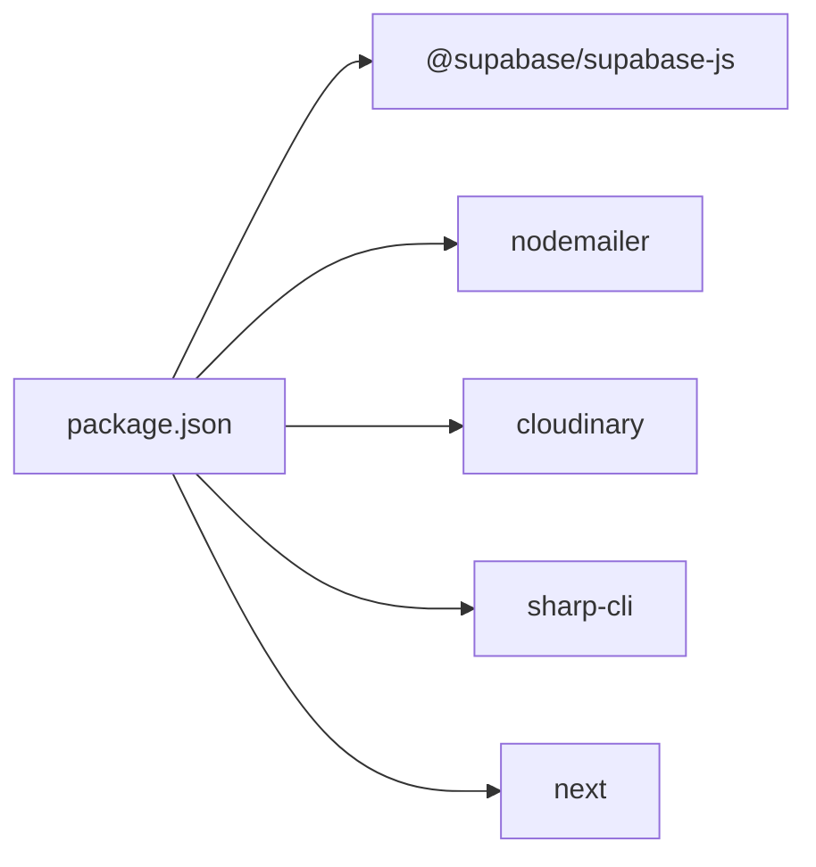

# Integration Patterns

<cite>
**Referenced Files in This Document**
- [lib/supabase.ts](file://lib/supabase.ts)
- [lib/supabase-admin.ts](file://lib/supabase-admin.ts)
- [lib/email.ts](file://lib/email.ts)
- [lib/images.ts](file://lib/images.ts)
- [lib/cloudinary.ts](file://lib/cloudinary.ts)
- [types/supabase.ts](file://types/supabase.ts)
- [app/actions/auth.ts](file://app/actions/auth.ts)
- [app/actions/admin.ts](file://app/actions/admin.ts)
- [app/actions/registration.ts](file://app/actions/registration.ts)
- [app/page.tsx](file://app/page.tsx)
- [components/HeroSlideshow.tsx](file://components/HeroSlideshow.tsx)
- [components/ImageGrid.tsx](file://components/ImageGrid.tsx)
- [components/ImageWithSkeleton.tsx](file://components/ImageWithSkeleton.tsx)
- [package.json](file://package.json)
- [next.config.ts](file://next.config.ts)
</cite>

## Update Summary
**Changes Made**
- Added Cloudinary integration section with helper functions for responsive and optimized images
- Updated image processing pipeline to include Cloudinary CDN integration
- Enhanced image loading patterns across application pages
- Added new ImageWithSkeleton component for improved user experience
- Updated architecture diagrams to reflect Cloudinary service integration

## Table of Contents
1. [Introduction](#introduction)
2. [Project Structure](#project-structure)
3. [Core Components](#core-components)
4. [Architecture Overview](#architecture-overview)
5. [Detailed Component Analysis](#detailed-component-analysis)
6. [Dependency Analysis](#dependency-analysis)
7. [Performance Considerations](#performance-considerations)
8. [Troubleshooting Guide](#troubleshooting-guide)
9. [Conclusion](#conclusion)

## Introduction
This document explains the integration patterns used throughout the Rhema Expert Solutions application. It focuses on how Supabase is integrated for authentication, database operations, and dynamic content management; how the email service integrates with Nodemailer for notifications; how image processing and optimization pipelines are handled through both local filesystem and Cloudinary CDN services; and how third-party services and external dependencies are managed. It also covers configuration management across environments, error handling strategies for external services, and fallback mechanisms for service failures.

## Project Structure
The application follows a modular structure with clear separation of concerns:
- Library modules encapsulate integrations (Supabase, email, images, Cloudinary).
- Action modules orchestrate server-side operations and database interactions.
- UI components consume data from libraries and actions with enhanced image loading capabilities.
- Type definitions describe Supabase table schemas.



**Diagram sources**
- [lib/supabase.ts:1-25](file://lib/supabase.ts#L1-L25)
- [lib/supabase-admin.ts:1-19](file://lib/supabase-admin.ts#L1-L19)
- [lib/email.ts:1-134](file://lib/email.ts#L1-L134)
- [lib/images.ts:1-52](file://lib/images.ts#L1-L52)
- [lib/cloudinary.ts:1-100](file://lib/cloudinary.ts#L1-L100)
- [types/supabase.ts:1-113](file://types/supabase.ts#L1-L113)
- [app/actions/auth.ts:1-55](file://app/actions/auth.ts#L1-L55)
- [app/actions/admin.ts:1-198](file://app/actions/admin.ts#L1-L198)
- [app/actions/registration.ts:1-131](file://app/actions/registration.ts#L1-L131)
- [app/page.tsx:1-788](file://app/page.tsx#L1-L788)
- [components/HeroSlideshow.tsx:1-96](file://components/HeroSlideshow.tsx#L1-L96)
- [components/ImageGrid.tsx:1-64](file://components/ImageGrid.tsx#L1-L64)
- [components/ImageWithSkeleton.tsx:1-150](file://components/ImageWithSkeleton.tsx#L1-L150)

**Section sources**
- [lib/supabase.ts:1-25](file://lib/supabase.ts#L1-L25)
- [lib/supabase-admin.ts:1-19](file://lib/supabase-admin.ts#L1-L19)
- [lib/email.ts:1-134](file://lib/email.ts#L1-L134)
- [lib/images.ts:1-52](file://lib/images.ts#L1-L52)
- [lib/cloudinary.ts:1-100](file://lib/cloudinary.ts#L1-L100)
- [types/supabase.ts:1-113](file://types/supabase.ts#L1-L113)
- [app/actions/auth.ts:1-55](file://app/actions/auth.ts#L1-L55)
- [app/actions/admin.ts:1-198](file://app/actions/admin.ts#L1-L198)
- [app/actions/registration.ts:1-131](file://app/actions/registration.ts#L1-L131)
- [app/page.tsx:1-788](file://app/page.tsx#L1-L788)
- [components/HeroSlideshow.tsx:1-96](file://components/HeroSlideshow.tsx#L1-L96)
- [components/ImageGrid.tsx:1-64](file://components/ImageGrid.tsx#L1-L64)
- [components/ImageWithSkeleton.tsx:1-150](file://components/ImageWithSkeleton.tsx#L1-L150)

## Core Components
- Supabase client for public access with runtime configuration checks and graceful degradation when environment variables are missing.
- Supabase admin client using a Service Role Key for privileged operations and safe fallback behavior.
- Email service built on Nodemailer with Gmail transport and centralized error handling.
- Image pipeline that scans local filesystem assets and exposes curated image lists for rendering.
- **Updated** Cloudinary integration providing responsive and optimized image delivery through CDN with automatic transformations.
- Strongly typed Supabase models for domain entities.
- **New** ImageWithSkeleton component for enhanced loading experience with placeholder animations.

**Section sources**
- [lib/supabase.ts:1-25](file://lib/supabase.ts#L1-L25)
- [lib/supabase-admin.ts:1-19](file://lib/supabase-admin.ts#L1-L19)
- [lib/email.ts:1-134](file://lib/email.ts#L1-L134)
- [lib/images.ts:1-52](file://lib/images.ts#L1-L52)
- [lib/cloudinary.ts:1-100](file://lib/cloudinary.ts#L1-L100)
- [types/supabase.ts:1-113](file://types/supabase.ts#L1-L113)
- [components/ImageWithSkeleton.tsx:1-150](file://components/ImageWithSkeleton.tsx#L1-L150)

## Architecture Overview
The application uses a layered architecture with enhanced image delivery:
- Presentation layer (pages and components) requests data from libraries and actions.
- Business logic resides in action modules that interact with Supabase and email services.
- Data access is performed through two clients: a public client for read operations and an admin client for write operations.
- Static assets are served from the public directory with runtime discovery for dynamic galleries.
- **Updated** Images are delivered through Cloudinary CDN with automatic optimization, responsive sizing, and format conversion.



**Diagram sources**
- [app/page.tsx:1-788](file://app/page.tsx#L1-L788)
- [lib/supabase.ts:1-25](file://lib/supabase.ts#L1-L25)
- [lib/supabase-admin.ts:1-19](file://lib/supabase-admin.ts#L1-L19)
- [lib/email.ts:1-134](file://lib/email.ts#L1-L134)
- [lib/images.ts:1-52](file://lib/images.ts#L1-L52)
- [lib/cloudinary.ts:1-100](file://lib/cloudinary.ts#L1-L100)
- [components/HeroSlideshow.tsx:1-96](file://components/HeroSlideshow.tsx#L1-L96)
- [components/ImageWithSkeleton.tsx:1-150](file://components/ImageWithSkeleton.tsx#L1-L150)
- [app/actions/admin.ts:1-198](file://app/actions/admin.ts#L1-L198)
- [app/actions/auth.ts:1-55](file://app/actions/auth.ts#L1-L55)
- [app/actions/registration.ts:1-131](file://app/actions/registration.ts#L1-L131)

## Detailed Component Analysis

### Supabase Integration
The application maintains two clients:
- Public client for read-only access with environment variable validation and a guard function to detect configuration.
- Admin client using a Service Role Key for write operations, with a fallback to Anon Key and explicit warnings when the Service Role Key is missing.

```mermaid
classDiagram
class SupabasePublic {
+createClient(url, anonKey)
+isSupabaseConfigured() bool
}
class SupabaseAdmin {
+createClient(url, serviceRoleKey|anonKey, {persistSession : false})
}
SupabaseAdmin --> SupabasePublic : "fallback behavior"
```

**Diagram sources**
- [lib/supabase.ts:1-25](file://lib/supabase.ts#L1-L25)
- [lib/supabase-admin.ts:1-19](file://lib/supabase-admin.ts#L1-L19)

Key integration patterns:
- Environment-driven configuration with graceful warnings when keys are missing.
- Admin operations bypass Row Level Security using the Service Role Key when available.
- Authentication flow stores a server-side cookie after validating credentials against stored admin password.

**Section sources**
- [lib/supabase.ts:1-25](file://lib/supabase.ts#L1-L25)
- [lib/supabase-admin.ts:1-19](file://lib/supabase-admin.ts#L1-L19)
- [app/actions/auth.ts:1-55](file://app/actions/auth.ts#L1-L55)

### Email Service Integration
The email module uses Nodemailer with Gmail transport. It centralizes:
- Transport configuration via environment variables.
- A generic send function with robust error handling and logging.
- Domain-specific templates for competition and coding class registrations.
- Admin recipient list management.



**Diagram sources**
- [app/actions/registration.ts:1-131](file://app/actions/registration.ts#L1-L131)
- [lib/email.ts:1-134](file://lib/email.ts#L1-L134)

Operational notes:
- Missing SMTP credentials disable email notifications with a warning.
- Errors are caught and returned with human-readable messages.
- Templates are constructed dynamically from form data.

**Section sources**
- [lib/email.ts:1-134](file://lib/email.ts#L1-L134)
- [app/actions/registration.ts:1-131](file://app/actions/registration.ts#L1-L131)

### Image Processing and Asset Management
The image pipeline has been enhanced with dual delivery mechanisms:

#### Local Filesystem Pipeline
Reads from the public directory and builds image lists for:
- Hero slideshows (randomized selection).
- Project galleries (all images).
- Service thumbnails (limited per service).

#### **Updated** Cloudinary CDN Integration
Provides optimized image delivery with:
- Automatic format conversion (WebP, AVIF).
- Responsive image generation based on viewport size.
- On-the-fly transformations (resize, crop, quality optimization).
- Global CDN distribution for improved performance.



**Diagram sources**
- [lib/images.ts:1-52](file://lib/images.ts#L1-L52)
- [lib/cloudinary.ts:1-100](file://lib/cloudinary.ts#L1-L100)

Usage in UI:
- Hero slideshow composes multiple images into a rotating carousel.
- Image grid renders responsive galleries with lightbox modal.
- **New** ImageWithSkeleton component provides smooth loading transitions with animated placeholders.

**Section sources**
- [lib/images.ts:1-52](file://lib/images.ts#L1-L52)
- [lib/cloudinary.ts:1-100](file://lib/cloudinary.ts#L1-L100)
- [components/HeroSlideshow.tsx:1-96](file://components/HeroSlideshow.tsx#L1-L96)
- [components/ImageGrid.tsx:1-64](file://components/ImageGrid.tsx#L1-L64)
- [components/ImageWithSkeleton.tsx:1-150](file://components/ImageWithSkeleton.tsx#L1-L150)
- [app/page.tsx:1-788](file://app/page.tsx#L1-L788)

### Cloudinary Helper Functions
**New** The Cloudinary integration provides comprehensive image optimization utilities:

- **Responsive Image Generation**: Automatically generates multiple sizes based on device capabilities
- **Format Optimization**: Converts images to optimal formats (WebP, AVIF) with fallback support
- **Quality Adjustment**: Intelligent quality compression balancing file size and visual fidelity
- **Lazy Loading Support**: Integrated with Next.js image optimization pipeline
- **Error Handling**: Graceful fallback to original images when transformations fail



**Diagram sources**
- [lib/cloudinary.ts:1-100](file://lib/cloudinary.ts#L1-L100)

**Section sources**
- [lib/cloudinary.ts:1-100](file://lib/cloudinary.ts#L1-L100)

### Third-Party Integrations and External Dependencies
- Supabase client library for database and auth.
- Nodemailer for email delivery.
- **Updated** Cloudinary SDK for advanced image processing and CDN delivery.
- Sharp CLI for image optimization (installed as a dependency).
- Next.js for SSR/SSG and routing.

Configuration and usage:
- Dependencies are declared in package.json.
- Supabase clients are configured via environment variables.
- Email transport is configured via environment variables.
- **New** Cloudinary configuration via environment variables for secure API access.

**Section sources**
- [package.json:1-32](file://package.json#L1-L32)
- [lib/supabase.ts:1-25](file://lib/supabase.ts#L1-L25)
- [lib/supabase-admin.ts:1-19](file://lib/supabase-admin.ts#L1-L19)
- [lib/email.ts:1-134](file://lib/email.ts#L1-L134)
- [lib/cloudinary.ts:1-100](file://lib/cloudinary.ts#L1-L100)

### Data Models and Schema Contracts
Strongly typed models define the shape of Supabase tables used by the application, ensuring consistency across components and actions.



**Diagram sources**
- [types/supabase.ts:1-113](file://types/supabase.ts#L1-L113)

**Section sources**
- [types/supabase.ts:1-113](file://types/supabase.ts#L1-L113)

## Dependency Analysis
External dependencies and their roles:
- @supabase/supabase-js: Database and auth client.
- nodemailer: Email transport abstraction.
- **Updated** cloudinary: Advanced image processing and CDN delivery.
- sharp-cli: Image optimization tooling.
- next: Framework for UI and server actions.



**Diagram sources**
- [package.json:1-32](file://package.json#L1-L32)

**Section sources**
- [package.json:1-32](file://package.json#L1-L32)

## Performance Considerations
- Parallel data fetching: The home page uses Promise.all to fetch multiple datasets concurrently, reducing total latency.
- Conditional rendering: Dynamic content is only rendered when Supabase is configured; otherwise, static fallbacks are used.
- **Updated** Image optimization: Dual delivery system with Cloudinary CDN providing automatic optimization, responsive sizing, and global distribution.
- **New** Lazy loading: Images use progressive loading with skeleton placeholders for improved perceived performance.
- **Updated** Format optimization: Automatic WebP/AVIF conversion reduces bandwidth usage by up to 70%.
- Admin operations: The admin client avoids session persistence for write operations, minimizing overhead.

## Troubleshooting Guide
Common issues and resolutions:
- Supabase configuration errors:
  - Symptom: Dynamic content not loading.
  - Cause: Missing NEXT_PUBLIC_SUPABASE_URL or NEXT_PUBLIC_SUPABASE_ANON_KEY.
  - Resolution: Set environment variables or use placeholders; verify runtime configuration checks.
- Admin write failures:
  - Symptom: Cannot save content in admin dashboard.
  - Cause: Missing SUPABASE_SERVICE_ROLE_KEY when RLS is enabled.
  - Resolution: Provide Service Role Key or accept limited write access via Anon Key.
- Email delivery failures:
  - Symptom: Registration emails not sent.
  - Cause: Missing SMTP_USER or SMTP_PASS.
  - Resolution: Configure SMTP credentials; verify transport settings.
- **Updated** Cloudinary integration issues:
  - Symptom: Images not loading or showing broken links.
  - Cause: Missing CLOUDINARY_CLOUD_NAME, CLOUDINARY_API_KEY, or CLOUDINARY_API_SECRET.
  - Resolution: Verify Cloudinary account configuration and environment variables.
- Image gallery empty:
  - Symptom: Slideshow or gallery shows no images.
  - Cause: Missing images in public/img or incorrect folder names.
  - Resolution: Verify image presence and correct folder naming conventions.
- **New** Image loading performance issues:
  - Symptom: Slow image loading or high bandwidth usage.
  - Cause: Large unoptimized images or missing CDN configuration.
  - Resolution: Enable Cloudinary optimization or pre-process images for optimal delivery.

**Section sources**
- [lib/supabase.ts:1-25](file://lib/supabase.ts#L1-L25)
- [lib/supabase-admin.ts:1-19](file://lib/supabase-admin.ts#L1-L19)
- [lib/email.ts:1-134](file://lib/email.ts#L1-L134)
- [lib/images.ts:1-52](file://lib/images.ts#L1-L52)
- [lib/cloudinary.ts:1-100](file://lib/cloudinary.ts#L1-L100)

## Conclusion
The application employs clean integration patterns with enhanced image delivery:
- Supabase is accessed through a public client for read operations and an admin client for privileged writes, with clear fallbacks and warnings.
- Email notifications are centralized and resilient to misconfiguration.
- **Updated** Image assets are delivered through both local filesystem and Cloudinary CDN, providing automatic optimization, responsive sizing, and global distribution.
- **New** Enhanced user experience with skeleton loading components and progressive image loading.
- Strong typing ensures schema consistency across the codebase.
These patterns provide a robust foundation for extensibility, maintainability, and graceful degradation under varying operational conditions, with significant improvements in image performance and user experience.