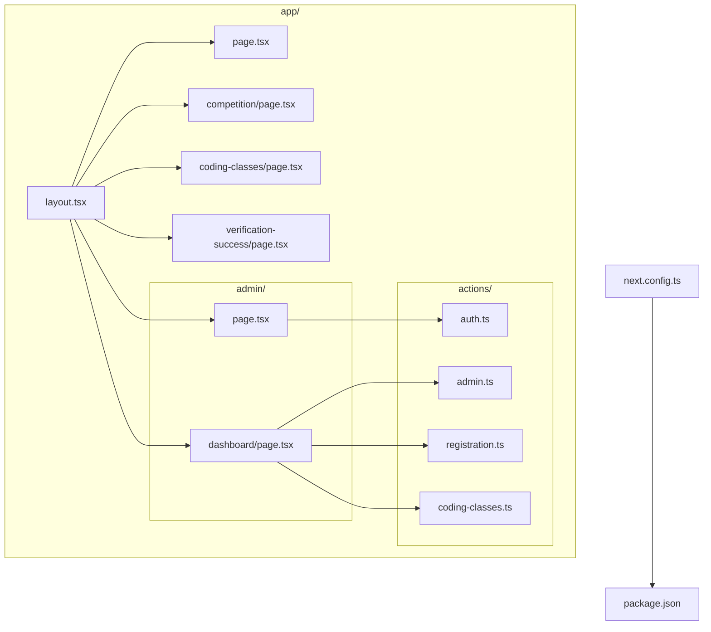
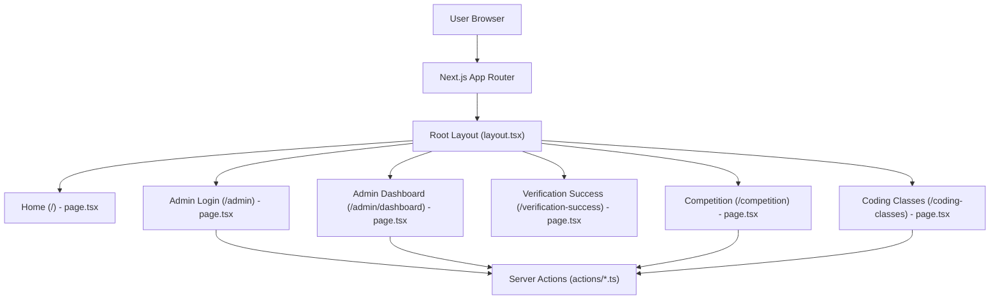
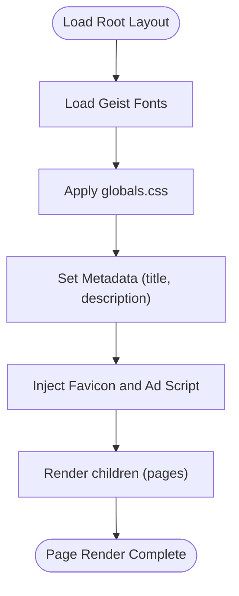
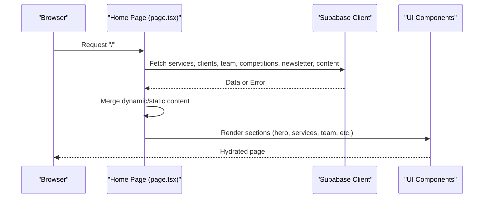
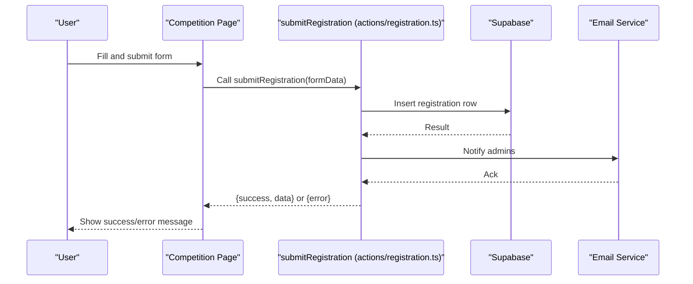
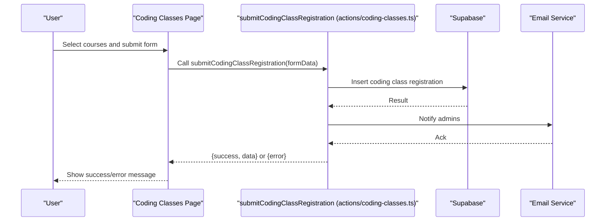
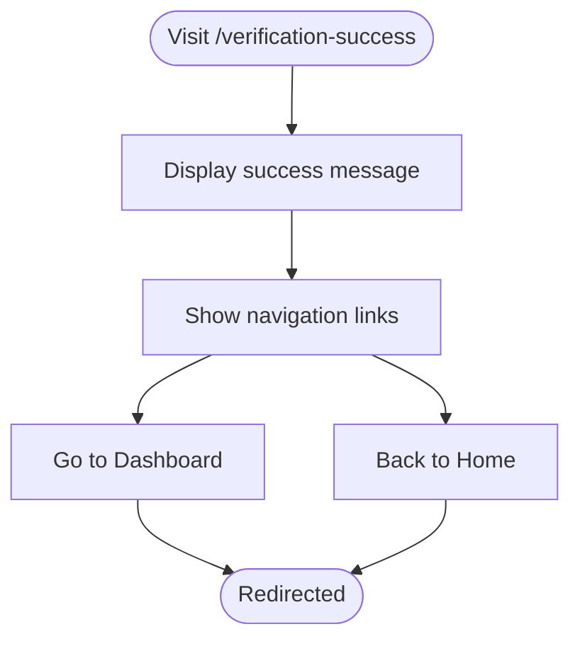
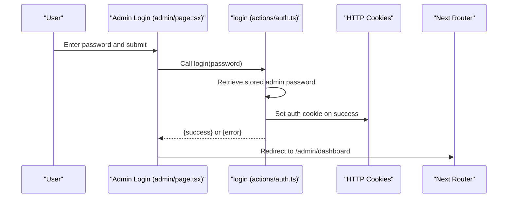
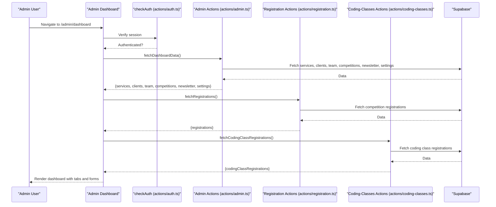
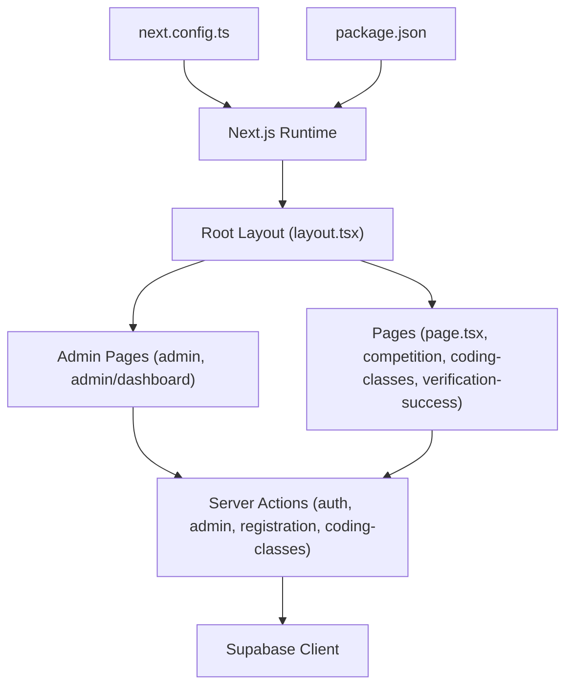

# Routing System

<cite>
**Referenced Files in This Document**
- [layout.tsx](file://app/layout.tsx)
- [page.tsx](file://app/page.tsx)
- [next.config.ts](file://next.config.ts)
- [package.json](file://package.json)
- [admin/page.tsx](file://app/admin/page.tsx)
- [admin/dashboard/page.tsx](file://app/admin/dashboard/page.tsx)
- [actions/auth.ts](file://app/actions/auth.ts)
- [actions/admin.ts](file://app/actions/admin.ts)
- [actions/registration.ts](file://app/actions/registration.ts)
- [actions/coding-classes.ts](file://app/actions/coding-classes.ts)
- [competition/page.tsx](file://app/competition/page.tsx)
- [coding-classes/page.tsx](file://app/coding-classes/page.tsx)
- [verification-success/page.tsx](file://app/verification-success/page.tsx)
</cite>

## Table of Contents
1. [Introduction](#introduction)
2. [Project Structure](#project-structure)
3. [Core Components](#core-components)
4. [Architecture Overview](#architecture-overview)
5. [Detailed Component Analysis](#detailed-component-analysis)
6. [Dependency Analysis](#dependency-analysis)
7. [Performance Considerations](#performance-considerations)
8. [Troubleshooting Guide](#troubleshooting-guide)
9. [Conclusion](#conclusion)

## Introduction
This document explains the Next.js 14+ file-based routing system used in Rhema Expert Solutions. It covers the app directory structure, route groups, dynamic routing patterns, and how pages are organized under app/. It also documents the root layout configuration, metadata handling, and the routing hierarchy for public pages, user-facing pages, and administrative routes. Examples of route parameters, catch-all routes, and middleware integration are included, along with how the system supports both static and dynamic content delivery and the relationship between file naming conventions and URL structures.

## Project Structure
The application follows Next.js 14+ conventions with the app/ directory as the primary entry point. Key routing files and directories include:
- Root layout and metadata in app/layout.tsx
- Home page in app/page.tsx
- Public functional areas:
  - Competition registration page in app/competition/page.tsx
  - Coding classes registration page in app/coding-classes/page.tsx
  - Verification success page in app/verification-success/page.tsx
- Administrative area:
  - Admin login page in app/admin/page.tsx
  - Admin dashboard in app/admin/dashboard/page.tsx
- Server actions for authentication and admin operations in app/actions/
- Next.js configuration in next.config.ts and package.json

**Diagram sources**
- [layout.tsx:1-43](file://app/layout.tsx#L1-L43)
- [page.tsx:1-788](file://app/page.tsx#L1-L788)
- [competition/page.tsx:1-316](file://app/competition/page.tsx#L1-L316)
- [coding-classes/page.tsx:1-390](file://app/coding-classes/page.tsx#L1-L390)
- [verification-success/page.tsx:1-80](file://app/verification-success/page.tsx#L1-L80)
- [admin/page.tsx:1-52](file://app/admin/page.tsx#L1-L52)
- [admin/dashboard/page.tsx:1-1055](file://app/admin/dashboard/page.tsx#L1-L1055)
- [actions/auth.ts:1-55](file://app/actions/auth.ts#L1-L55)
- [actions/admin.ts:1-198](file://app/actions/admin.ts#L1-L198)
- [actions/registration.ts:1-131](file://app/actions/registration.ts#L1-L131)
- [actions/coding-classes.ts:1-157](file://app/actions/coding-classes.ts#L1-L157)
- [next.config.ts:1-8](file://next.config.ts#L1-L8)
- [package.json:1-32](file://package.json#L1-L32)

**Section sources**
- [layout.tsx:1-43](file://app/layout.tsx#L1-L43)
- [page.tsx:1-788](file://app/page.tsx#L1-L788)
- [next.config.ts:1-8](file://next.config.ts#L1-L8)
- [package.json:1-32](file://package.json#L1-L32)

## Core Components
- Root Layout and Metadata
  - Defines global fonts, CSS, favicon, and site metadata.
  - Provides the HTML wrapper and body class configuration.
- Home Page
  - Renders dynamic content from Supabase with fallback to static content.
  - Implements content sections for hero, training, competitions, about, services, projects, clients, team, and contact.
- Public Pages
  - Competition registration page with form submission to server action.
  - Coding classes registration page with course selection and payment plan options.
  - Verification success page for user feedback after verification.
- Admin Pages
  - Admin login page with password validation via server action.
  - Admin dashboard with tabs for managing services, clients, team, competitions, newsletter, settings, registrations, and coding-class registrations.
- Server Actions
  - Authentication actions (login, logout, checkAuth).
  - Admin actions (save/delete items, toggle competition, fetch dashboard data).
  - Registration actions (submit, fetch, update/delete competition registrations).
  - Coding class registration actions (submit, fetch/update/delete registrations).

**Section sources**
- [layout.tsx:1-43](file://app/layout.tsx#L1-L43)
- [page.tsx:1-788](file://app/page.tsx#L1-L788)
- [admin/page.tsx:1-52](file://app/admin/page.tsx#L1-L52)
- [admin/dashboard/page.tsx:1-1055](file://app/admin/dashboard/page.tsx#L1-L1055)
- [actions/auth.ts:1-55](file://app/actions/auth.ts#L1-L55)
- [actions/admin.ts:1-198](file://app/actions/admin.ts#L1-L198)
- [actions/registration.ts:1-131](file://app/actions/registration.ts#L1-L131)
- [actions/coding-classes.ts:1-157](file://app/actions/coding-classes.ts#L1-L157)
- [competition/page.tsx:1-316](file://app/competition/page.tsx#L1-L316)
- [coding-classes/page.tsx:1-390](file://app/coding-classes/page.tsx#L1-L390)
- [verification-success/page.tsx:1-80](file://app/verification-success/page.tsx#L1-L80)

## Architecture Overview
The routing system leverages Next.js file-based routing:
- app/page.tsx is the root page rendered under "/".
- app/competition/page.tsx renders "/competition".
- app/coding-classes/page.tsx renders "/coding-classes".
- app/verification-success/page.tsx renders "/verification-success".
- app/admin/page.tsx renders "/admin".
- app/admin/dashboard/page.tsx renders "/admin/dashboard".

Server actions encapsulate backend logic and state management for admin operations and user registrations, enabling secure and efficient data mutations.

**Diagram sources**
- [layout.tsx:1-43](file://app/layout.tsx#L1-L43)
- [page.tsx:1-788](file://app/page.tsx#L1-L788)
- [competition/page.tsx:1-316](file://app/competition/page.tsx#L1-L316)
- [coding-classes/page.tsx:1-390](file://app/coding-classes/page.tsx#L1-L390)
- [verification-success/page.tsx:1-80](file://app/verification-success/page.tsx#L1-L80)
- [admin/page.tsx:1-52](file://app/admin/page.tsx#L1-L52)
- [admin/dashboard/page.tsx:1-1055](file://app/admin/dashboard/page.tsx#L1-L1055)
- [actions/auth.ts:1-55](file://app/actions/auth.ts#L1-L55)
- [actions/admin.ts:1-198](file://app/actions/admin.ts#L1-L198)
- [actions/registration.ts:1-131](file://app/actions/registration.ts#L1-L131)
- [actions/coding-classes.ts:1-157](file://app/actions/coding-classes.ts#L1-L157)

## Detailed Component Analysis

### Root Layout and Metadata
- Global fonts and CSS are imported and applied to the root HTML element.
- Site metadata is defined centrally for SEO and social sharing.
- Favicon and ad script tags are injected in the head.

**Diagram sources**
- [layout.tsx:1-43](file://app/layout.tsx#L1-L43)

**Section sources**
- [layout.tsx:1-43](file://app/layout.tsx#L1-L43)

### Home Page (Dynamic Content Delivery)
- Fetches dynamic content from Supabase concurrently for services, clients, team, competitions, newsletter, and general content.
- Falls back to static content when Supabase is unavailable or returns empty arrays.
- Renders sections for hero, training, competitions, about, services, projects, clients, team, and contact.

**Diagram sources**
- [page.tsx:1-788](file://app/page.tsx#L1-L788)

**Section sources**
- [page.tsx:1-788](file://app/page.tsx#L1-L788)

### Public Pages

#### Competition Registration Page
- Client-side form collects student and parent/guardian information.
- Submits to server action for validation and persistence.
- Displays success/error messages and resets form upon successful submission.

**Diagram sources**
- [competition/page.tsx:1-316](file://app/competition/page.tsx#L1-L316)
- [actions/registration.ts:1-131](file://app/actions/registration.ts#L1-L131)

**Section sources**
- [competition/page.tsx:1-316](file://app/competition/page.tsx#L1-L316)
- [actions/registration.ts:1-131](file://app/actions/registration.ts#L1-L131)

#### Coding Classes Registration Page
- Client-side form collects personal info, course selections, and payment plan.
- Submits to server action for validation and persistence.
- Displays success/error messages and resets form upon successful submission.

**Diagram sources**
- [coding-classes/page.tsx:1-390](file://app/coding-classes/page.tsx#L1-L390)
- [actions/coding-classes.ts:1-157](file://app/actions/coding-classes.ts#L1-L157)

**Section sources**
- [coding-classes/page.tsx:1-390](file://app/coding-classes/page.tsx#L1-L390)
- [actions/coding-classes.ts:1-157](file://app/actions/coding-classes.ts#L1-L157)

#### Verification Success Page
- Static client-rendered page confirming account verification.
- Provides navigation links to dashboard and home.

**Diagram sources**
- [verification-success/page.tsx:1-80](file://app/verification-success/page.tsx#L1-L80)

**Section sources**
- [verification-success/page.tsx:1-80](file://app/verification-success/page.tsx#L1-L80)

### Admin Pages

#### Admin Login
- Client-side form submits password to server action.
- On success, sets an authentication cookie and redirects to admin dashboard.
- On failure, displays an error message.

**Diagram sources**
- [admin/page.tsx:1-52](file://app/admin/page.tsx#L1-L52)
- [actions/auth.ts:1-55](file://app/actions/auth.ts#L1-L55)

**Section sources**
- [admin/page.tsx:1-52](file://app/admin/page.tsx#L1-L52)
- [actions/auth.ts:1-55](file://app/actions/auth.ts#L1-L55)

#### Admin Dashboard
- Client-side dashboard with tabs for managing content and registrations.
- Uses server actions to fetch data, save edits, delete items, and toggle competitions.
- Handles separate flows for competition and coding-class registrations.

**Diagram sources**
- [admin/dashboard/page.tsx:1-1055](file://app/admin/dashboard/page.tsx#L1-L1055)
- [actions/auth.ts:1-55](file://app/actions/auth.ts#L1-L55)
- [actions/admin.ts:1-198](file://app/actions/admin.ts#L1-L198)
- [actions/registration.ts:1-131](file://app/actions/registration.ts#L1-L131)
- [actions/coding-classes.ts:1-157](file://app/actions/coding-classes.ts#L1-L157)

**Section sources**
- [admin/dashboard/page.tsx:1-1055](file://app/admin/dashboard/page.tsx#L1-L1055)
- [actions/auth.ts:1-55](file://app/actions/auth.ts#L1-L55)
- [actions/admin.ts:1-198](file://app/actions/admin.ts#L1-L198)
- [actions/registration.ts:1-131](file://app/actions/registration.ts#L1-L131)
- [actions/coding-classes.ts:1-157](file://app/actions/coding-classes.ts#L1-L157)

### Route Groups and Dynamic Segments
- Route groups are not explicitly used in the current structure.
- Dynamic segments are not present in the provided pages; URLs are static per file naming convention.
- Catch-all routes are not implemented in the current codebase.

### Middleware Integration
- No custom middleware file was found in the repository snapshot.
- Authentication relies on server actions and HTTP-only cookies set during login.

**Section sources**
- [admin/page.tsx:1-52](file://app/admin/page.tsx#L1-L52)
- [actions/auth.ts:1-55](file://app/actions/auth.ts#L1-L55)

## Dependency Analysis
The routing system depends on:
- Next.js runtime for file-based routing and rendering.
- Server actions for secure data mutations and authentication.
- Supabase client for database operations.
- Tailwind CSS for styling.

**Diagram sources**
- [layout.tsx:1-43](file://app/layout.tsx#L1-L43)
- [page.tsx:1-788](file://app/page.tsx#L1-L788)
- [competition/page.tsx:1-316](file://app/competition/page.tsx#L1-L316)
- [coding-classes/page.tsx:1-390](file://app/coding-classes/page.tsx#L1-L390)
- [verification-success/page.tsx:1-80](file://app/verification-success/page.tsx#L1-L80)
- [admin/page.tsx:1-52](file://app/admin/page.tsx#L1-L52)
- [admin/dashboard/page.tsx:1-1055](file://app/admin/dashboard/page.tsx#L1-L1055)
- [actions/auth.ts:1-55](file://app/actions/auth.ts#L1-L55)
- [actions/admin.ts:1-198](file://app/actions/admin.ts#L1-L198)
- [actions/registration.ts:1-131](file://app/actions/registration.ts#L1-L131)
- [actions/coding-classes.ts:1-157](file://app/actions/coding-classes.ts#L1-L157)
- [next.config.ts:1-8](file://next.config.ts#L1-L8)
- [package.json:1-32](file://package.json#L1-L32)

**Section sources**
- [next.config.ts:1-8](file://next.config.ts#L1-L8)
- [package.json:1-32](file://package.json#L1-L32)

## Performance Considerations
- Concurrent data fetching on the home page reduces total load time.
- Server actions centralize validation and reduce client-side logic.
- Using HTTP-only cookies for admin authentication improves security.
- Consider implementing caching strategies for frequently accessed content and optimizing image loading.

## Troubleshooting Guide
- Authentication failures
  - Ensure the admin password is correctly stored in Supabase or environment variables.
  - Confirm the auth cookie is being set and readable by the server.
- Registration submissions
  - Validate required fields in the client forms before submission.
  - Check server action responses for errors and surface user-friendly messages.
- Dashboard data loading
  - Verify Supabase credentials and table permissions.
  - Confirm server actions are reachable and returning data.

**Section sources**
- [actions/auth.ts:1-55](file://app/actions/auth.ts#L1-L55)
- [actions/registration.ts:1-131](file://app/actions/registration.ts#L1-L131)
- [actions/coding-classes.ts:1-157](file://app/actions/coding-classes.ts#L1-L157)
- [admin/dashboard/page.tsx:1-1055](file://app/admin/dashboard/page.tsx#L1-L1055)

## Conclusion
Rhema Expert Solutions leverages Next.js 14+ file-based routing to organize public and administrative content effectively. The root layout centralizes metadata and styling, while server actions manage authentication and data operations securely. The current routing structure uses static file naming conventions mapped to predictable URLs, with clear separation between public pages and admin functionality. Future enhancements could include route groups for shared layouts, dynamic segments for parameterized pages, and custom middleware for broader access control.