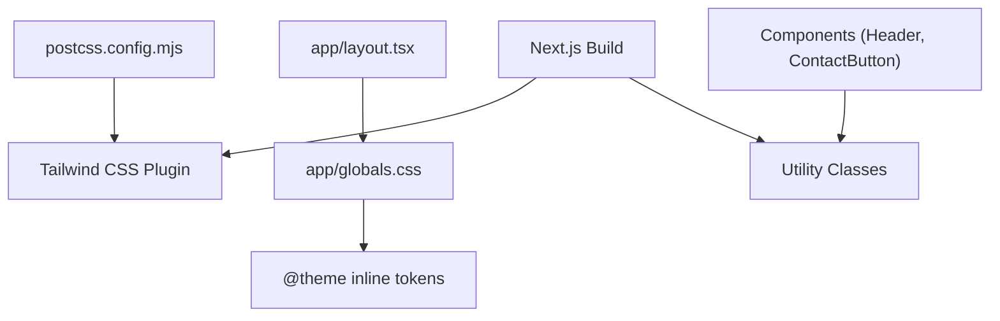
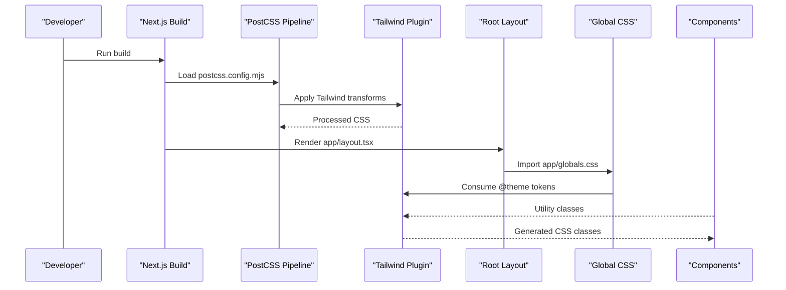
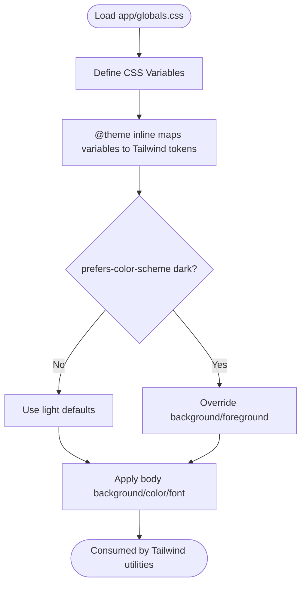
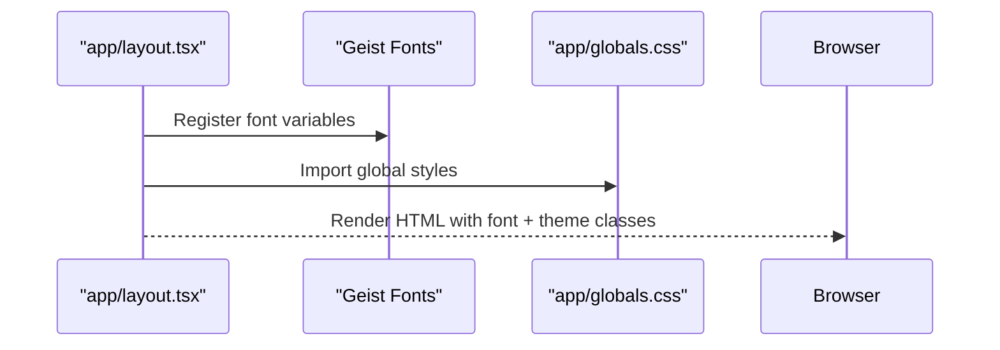
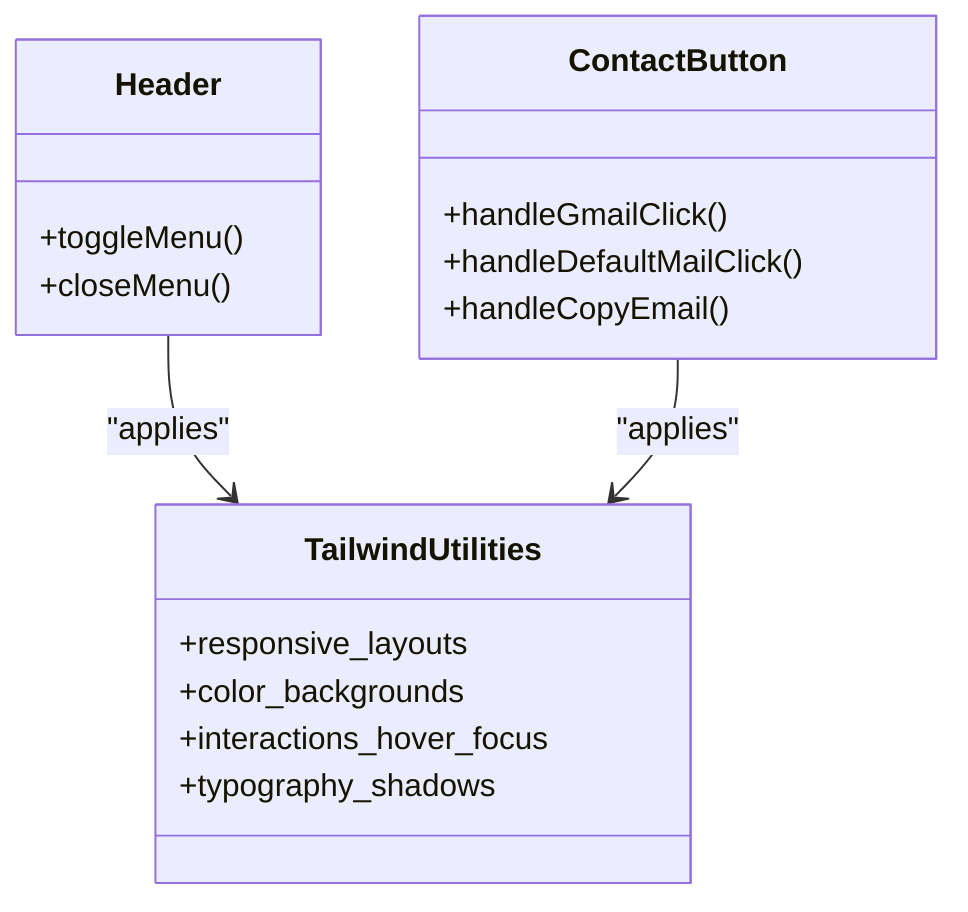
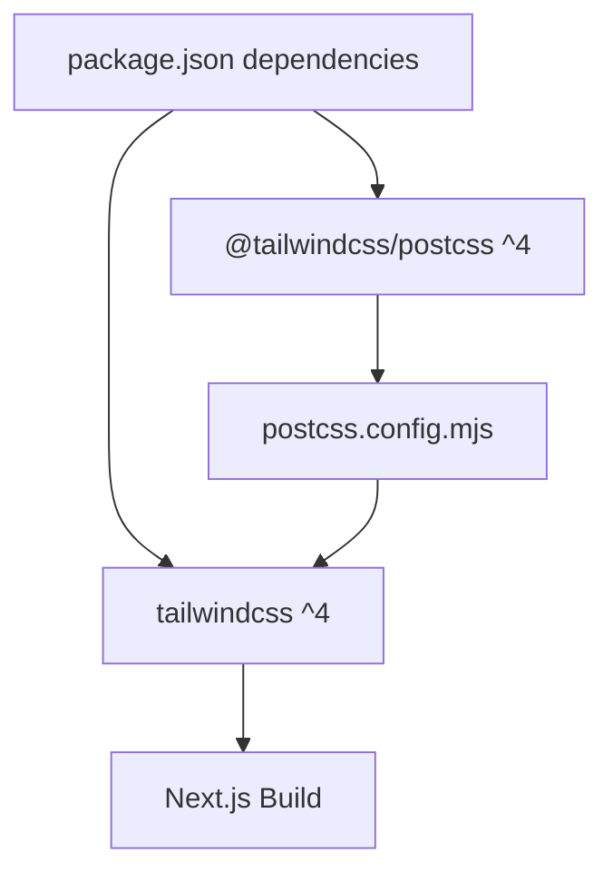

# CSS and Styling Configuration

<cite>
**Referenced Files in This Document**
- [postcss.config.mjs](file://postcss.config.mjs)
- [globals.css](file://app/globals.css)
- [layout.tsx](file://app/layout.tsx)
- [page.tsx](file://app/page.tsx)
- [Header.tsx](file://components/Header.tsx)
- [ContactButton.tsx](file://components/ContactButton.tsx)
- [package.json](file://package.json)
- [next.config.ts](file://next.config.ts)
</cite>

## Table of Contents
1. [Introduction](#introduction)
2. [Project Structure](#project-structure)
3. [Core Components](#core-components)
4. [Architecture Overview](#architecture-overview)
5. [Detailed Component Analysis](#detailed-component-analysis)
6. [Dependency Analysis](#dependency-analysis)
7. [Performance Considerations](#performance-considerations)
8. [Troubleshooting Guide](#troubleshooting-guide)
9. [Conclusion](#conclusion)

## Introduction
This document explains the CSS and styling configuration for Rhema Expert Solutions. It covers the PostCSS setup with Tailwind CSS integration, the global CSS architecture, theme configuration, component styling approaches, and performance optimization strategies. It also provides guidance on maintaining cross-browser compatibility, accessibility, and resolving common styling issues.

## Project Structure
The styling system centers around:
- Global styles imported in the root layout
- Tailwind CSS configured via PostCSS
- Component-level styling using Tailwind utility classes
- Theme tokens defined in CSS variables and consumed by Tailwind

**Diagram sources**
- [postcss.config.mjs:1-8](file://postcss.config.mjs#L1-L8)
- [layout.tsx:1-43](file://app/layout.tsx#L1-L43)
- [globals.css:1-31](file://app/globals.css#L1-L31)

**Section sources**
- [postcss.config.mjs:1-8](file://postcss.config.mjs#L1-L8)
- [layout.tsx:1-43](file://app/layout.tsx#L1-L43)
- [globals.css:1-31](file://app/globals.css#L1-L31)

## Core Components
- PostCSS configuration enables Tailwind CSS processing during the Next.js build pipeline.
- Global CSS defines theme tokens and applies them to Tailwind’s design system.
- Root layout imports global CSS and fonts, ensuring consistent typography and base styles.
- Components apply Tailwind utility classes for responsive layouts, spacing, colors, and interactive states.

Key implementation references:
- PostCSS plugin setup: [postcss.config.mjs:1-8](file://postcss.config.mjs#L1-L8)
- Global theme tokens and dark mode: [globals.css:1-31](file://app/globals.css#L1-L31)
- Root layout imports and font variables: [layout.tsx:1-43](file://app/layout.tsx#L1-L43)
- Component usage of Tailwind utilities: [Header.tsx:1-138](file://components/Header.tsx#L1-L138), [ContactButton.tsx:1-58](file://components/ContactButton.tsx#L1-L58)

**Section sources**
- [postcss.config.mjs:1-8](file://postcss.config.mjs#L1-L8)
- [globals.css:1-31](file://app/globals.css#L1-L31)
- [layout.tsx:1-43](file://app/layout.tsx#L1-L43)
- [Header.tsx:1-138](file://components/Header.tsx#L1-L138)
- [ContactButton.tsx:1-58](file://components/ContactButton.tsx#L1-L58)

## Architecture Overview
The styling architecture integrates Tailwind CSS through PostCSS and exposes design tokens to components via CSS variables and Tailwind’s theme system.

**Diagram sources**
- [postcss.config.mjs:1-8](file://postcss.config.mjs#L1-L8)
- [layout.tsx:1-43](file://app/layout.tsx#L1-L43)
- [globals.css:1-31](file://app/globals.css#L1-L31)

## Detailed Component Analysis

### Global CSS and Theme Tokens
The global stylesheet defines:
- CSS variables for background, foreground, primary, and secondary colors
- A dark mode variant using prefers-color-scheme media queries
- Tailwind theme tokens mapped to CSS variables for consistent design system usage
- Base body styles and font family assignments

**Diagram sources**
- [globals.css:1-31](file://app/globals.css#L1-L31)

**Section sources**
- [globals.css:1-31](file://app/globals.css#L1-L31)

### Root Layout Integration
The root layout imports global CSS and fonts, exposing font variables to the design system and enabling anti-aliasing for improved text rendering.

**Diagram sources**
- [layout.tsx:1-43](file://app/layout.tsx#L1-L43)
- [globals.css:1-31](file://app/globals.css#L1-L31)

**Section sources**
- [layout.tsx:1-43](file://app/layout.tsx#L1-L43)
- [globals.css:1-31](file://app/globals.css#L1-L31)

### Component Styling Patterns
Components rely on Tailwind utility classes for:
- Responsive layouts (flex, grid, spacing)
- Color and background utilities
- Interactive states (hover, focus, active)
- Typography and shadows
- Animations (pulse, scale, transitions)

Examples:
- Header navigation and mobile drawer styling: [Header.tsx:1-138](file://components/Header.tsx#L1-L138)
- Contact button variants and hover effects: [ContactButton.tsx:1-58](file://components/ContactButton.tsx#L1-L58)
- Page-level sections using Tailwind utilities: [page.tsx:1-788](file://app/page.tsx#L1-L788)

**Diagram sources**
- [Header.tsx:1-138](file://components/Header.tsx#L1-L138)
- [ContactButton.tsx:1-58](file://components/ContactButton.tsx#L1-L58)

**Section sources**
- [Header.tsx:1-138](file://components/Header.tsx#L1-L138)
- [ContactButton.tsx:1-58](file://components/ContactButton.tsx#L1-L58)
- [page.tsx:1-788](file://app/page.tsx#L1-L788)

## Dependency Analysis
The project depends on Tailwind CSS and PostCSS for CSS processing. The build pipeline consumes the PostCSS configuration and Tailwind plugin to generate optimized CSS.

**Diagram sources**
- [package.json:11-31](file://package.json#L11-L31)
- [postcss.config.mjs:1-8](file://postcss.config.mjs#L1-L8)

**Section sources**
- [package.json:11-31](file://package.json#L11-L31)
- [postcss.config.mjs:1-8](file://postcss.config.mjs#L1-L8)

## Performance Considerations
- Minification: Tailwind CSS generates utility classes; ensure production builds leverage Next.js minification and bundling.
- Critical CSS: Consider extracting critical styles for above-the-fold content to improve First Contentful Paint.
- Asset optimization: Use Next.js image optimization and appropriate image formats to reduce payload.
- Tree shaking: Tailwind’s JIT mode removes unused utilities; keep purge content globs up to date to avoid shipping unused CSS.
- Font loading: The project uses Google Fonts via Next.js; ensure font preloading and subset strategies are considered for performance.

[No sources needed since this section provides general guidance]

## Troubleshooting Guide
Common issues and resolutions:
- Tailwind classes not applying
  - Verify PostCSS plugin is present and enabled: [postcss.config.mjs:1-8](file://postcss.config.mjs#L1-L8)
  - Confirm global CSS is imported in the root layout: [layout.tsx:1-43](file://app/layout.tsx#L1-L43)
- Theme tokens not reflected
  - Ensure CSS variables are defined and mapped in @theme: [globals.css:1-31](file://app/globals.css#L1-L31)
- Dark mode not switching
  - Check prefers-color-scheme media query usage: [globals.css:19-24](file://app/globals.css#L19-L24)
- Conflicts with global resets
  - Review base styles applied to body and ensure they align with Tailwind’s design intent: [globals.css:26-30](file://app/globals.css#L26-L30)
- Build errors or missing utilities
  - Confirm Tailwind and PostCSS versions match project dependencies: [package.json:11-31](file://package.json#L11-L31)
  - Validate Next.js configuration does not override CSS handling unintentionally: [next.config.ts:1-8](file://next.config.ts#L1-L8)

**Section sources**
- [postcss.config.mjs:1-8](file://postcss.config.mjs#L1-L8)
- [layout.tsx:1-43](file://app/layout.tsx#L1-L43)
- [globals.css:1-31](file://app/globals.css#L1-L31)
- [next.config.ts:1-8](file://next.config.ts#L1-L8)
- [package.json:11-31](file://package.json#L11-L31)

## Conclusion
Rhema Expert Solutions employs a clean, maintainable styling architecture centered on Tailwind CSS and PostCSS. Global theme tokens unify design language, while component-level utilities ensure consistent, responsive UIs. Following the outlined configuration, performance strategies, and troubleshooting steps will help sustain a scalable and efficient styling system.