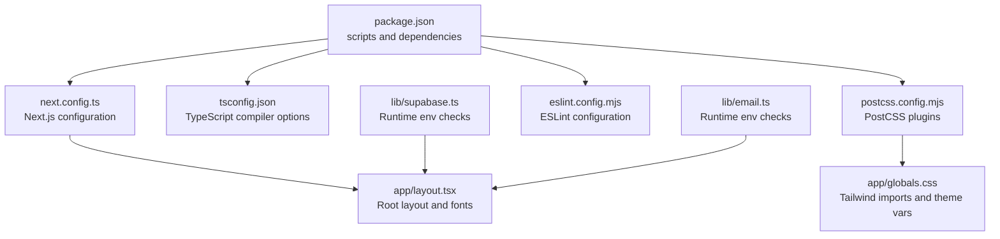
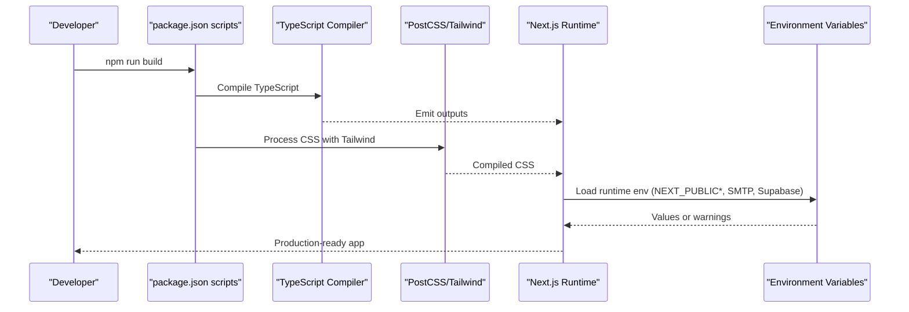
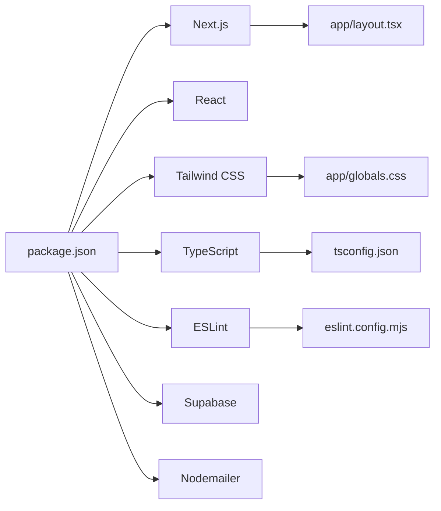

# Configuration and Build

<cite>
**Referenced Files in This Document**
- [next.config.ts](file://next.config.ts)
- [package.json](file://package.json)
- [tsconfig.json](file://tsconfig.json)
- [postcss.config.mjs](file://postcss.config.mjs)
- [eslint.config.mjs](file://eslint.config.mjs)
- [app/layout.tsx](file://app/layout.tsx)
- [app/globals.css](file://app/globals.css)
- [lib/supabase.ts](file://lib/supabase.ts)
- [lib/email.ts](file://lib/email.ts)
- [README.md](file://README.md)
</cite>

## Table of Contents
1. [Introduction](#introduction)
2. [Project Structure](#project-structure)
3. [Core Components](#core-components)
4. [Architecture Overview](#architecture-overview)
5. [Detailed Component Analysis](#detailed-component-analysis)
6. [Dependency Analysis](#dependency-analysis)
7. [Performance Considerations](#performance-considerations)
8. [Troubleshooting Guide](#troubleshooting-guide)
9. [Conclusion](#conclusion)
10. [Appendices](#appendices)

## Introduction
This document explains the configuration and build processes for Rhema Expert Solutions. It covers Next.js configuration, TypeScript compilation, PostCSS and Tailwind CSS integration, ESLint setup, environment variable management, scripts, and production optimization strategies. It also provides guidance for customizing configurations, adding new tools, and maintaining consistency across environments.

## Project Structure
The project follows a Next.js App Router structure with a minimal Next.js configuration, centralized TypeScript configuration, PostCSS with Tailwind integration, and ESLint configuration using the Next.js recommended setup. Environment variables are consumed via runtime checks and Next.js public/runtime prefixes.

**Diagram sources**
- [package.json:1-32](file://package.json#L1-L32)
- [next.config.ts:1-8](file://next.config.ts#L1-L8)
- [tsconfig.json:1-35](file://tsconfig.json#L1-L35)
- [postcss.config.mjs:1-8](file://postcss.config.mjs#L1-L8)
- [eslint.config.mjs:1-19](file://eslint.config.mjs#L1-L19)
- [app/layout.tsx:1-43](file://app/layout.tsx#L1-L43)
- [app/globals.css:1-31](file://app/globals.css#L1-L31)
- [lib/supabase.ts:1-25](file://lib/supabase.ts#L1-L25)
- [lib/email.ts:1-134](file://lib/email.ts#L1-L134)

**Section sources**
- [README.md:1-37](file://README.md#L1-L37)
- [package.json:1-32](file://package.json#L1-L32)

## Core Components
- Next.js configuration: Minimal configuration file present; currently leaves defaults.
- TypeScript configuration: Strict mode enabled, ES module resolution, JSX transform, path aliases, and incremental compilation.
- PostCSS and Tailwind CSS: Tailwind plugin configured via PostCSS; Tailwind directives imported in global CSS.
- ESLint: Next.js recommended configuration extended with core-web-vitals and TypeScript rules; ignores build artifacts and generated types.
- Scripts and dependencies: Dev, build, start, and lint scripts; Next.js 16, React 19, Tailwind 4, TypeScript 5, ESLint 9, and related tooling.

**Section sources**
- [next.config.ts:1-8](file://next.config.ts#L1-L8)
- [tsconfig.json:1-35](file://tsconfig.json#L1-L35)
- [postcss.config.mjs:1-8](file://postcss.config.mjs#L1-L8)
- [eslint.config.mjs:1-19](file://eslint.config.mjs#L1-L19)
- [package.json:1-32](file://package.json#L1-L32)

## Architecture Overview
The build pipeline integrates TypeScript compilation, PostCSS/Tailwind processing, and Next.js runtime. Environment variables are validated at runtime, and linting is enforced via ESLint.

**Diagram sources**
- [package.json:5-10](file://package.json#L5-L10)
- [tsconfig.json:2-24](file://tsconfig.json#L2-L24)
- [postcss.config.mjs:1-8](file://postcss.config.mjs#L1-L8)
- [lib/supabase.ts:7-24](file://lib/supabase.ts#L7-L24)
- [lib/email.ts:3-12](file://lib/email.ts#L3-L12)

## Detailed Component Analysis

### Next.js Configuration
- Purpose: Central place to configure Next.js behavior.
- Current state: Empty configuration object; defaults apply.
- Recommendations:
  - Add output tracing, appDir strictness, and experimental flags if needed.
  - Configure redirects, rewrites, headers, and compression for production.
  - Enable SWC minification and Turbopack for faster builds if desired.

**Section sources**
- [next.config.ts:1-8](file://next.config.ts#L1-L8)

### TypeScript Configuration
- Compiler options:
  - Target and libs aligned with modern browsers.
  - Strict type checking, no emit for faster dev builds.
  - ES module resolution with bundler strategy.
  - JSX transform set to React for Next.js.
  - Path aliases mapped via baseUrl.
  - Incremental compilation enabled.
- Includes: Next.js env types and generated types for dev/build.
- Excludes: node_modules globally.

Optimization tips:
- Keep noEmit true for dev; enable emit for CI type checks.
- Consider module: "ES2022" and moduleResolution: "bundler" for future-proofing.
- Add isolatedModules for large codebases to improve editor performance.

**Section sources**
- [tsconfig.json:1-35](file://tsconfig.json#L1-L35)

### PostCSS and Tailwind CSS Integration
- PostCSS configuration:
  - Plugin: Tailwind PostCSS package.
- Global CSS:
  - Imports Tailwind directives.
  - Defines CSS variables for theme tokens.
  - Uses @theme inline directive and media queries for dark mode.
- Layout:
  - Loads fonts from Next/font and applies CSS variables to html/body.

Optimization tips:
- Use purge/content configuration to remove unused styles in production.
- Split Tailwind directives into separate files for maintainability.
- Consider using JIT mode if not already enabled by Tailwind 4.

**Section sources**
- [postcss.config.mjs:1-8](file://postcss.config.mjs#L1-L8)
- [app/globals.css:1-31](file://app/globals.css#L1-L31)
- [app/layout.tsx:1-43](file://app/layout.tsx#L1-L43)

### ESLint Configuration
- Extends:
  - Next.js core-web-vitals and TypeScript rules.
- Ignores:
  - Next build folders, output, build, and next-env.d.ts by default.
- Overrides:
  - Explicitly overrides default ignores to include necessary paths.

Workflow automation:
- Run lint during pre-commit hooks and CI.
- Fix autofixable issues automatically; enforce severity for critical rules.

**Section sources**
- [eslint.config.mjs:1-19](file://eslint.config.mjs#L1-L19)

### Environment Variable Management
- Supabase:
  - NEXT_PUBLIC_SUPABASE_URL and NEXT_PUBLIC_SUPABASE_ANON_KEY.
  - Runtime checks warn if missing; placeholder fallbacks used.
- Email:
  - SMTP_USER and SMTP_PASS for Gmail transport.
  - Warns and aborts if credentials are missing.
- Recommendations:
  - Store secrets in platform-managed secret stores (e.g., Vercel, CI).
  - Use NEXT_PUBLIC_ only for frontend-visible data.
  - Add schema validation and typed env accessors.

**Section sources**
- [lib/supabase.ts:7-24](file://lib/supabase.ts#L7-L24)
- [lib/email.ts:3-12](file://lib/email.ts#L3-L12)

### Scripts and Package Management
- Scripts:
  - dev, build, start, lint.
- Dependencies:
  - Next.js 16, React 19, Tailwind 4, TypeScript 5, ESLint 9, Supabase JS, Nodemailer, sharp-cli.
- Recommendations:
  - Pin patch versions for stability; use lockfiles.
  - Prefer Yarn/PNPM for reproducible installs.
  - Add lint-staged and husky for pre-commit enforcement.

**Section sources**
- [package.json:1-32](file://package.json#L1-L32)

### Build Artifacts and Production Optimization
- Build artifacts:
  - Next.js output under .next; Tailwind CSS compiled into static assets.
- Optimization strategies:
  - Enable SWC minification and tree shaking via Next.js defaults.
  - Use next/font for optimized font loading.
  - Lazy-load images with next/image and optimize assets with sharp-cli.
  - Split chunks and route-based code splitting via App Router.
  - Add caching headers and compression in hosting provider settings.

**Section sources**
- [README.md:32-37](file://README.md#L32-L37)
- [package.json:11-18](file://package.json#L11-L18)

### Performance Monitoring and Bundle Analysis
- Recommended tools:
  - next-bundle-analyzer or similar for bundle insights.
  - Lighthouse and Pagespeed Insights for runtime metrics.
  - Application performance monitoring (APM) for production observability.
- Actions:
  - Track Largest Contentful Paint (LCP), First Input Delay (FID), and Cumulative Layout Shift (CLS).
  - Monitor slow routes and heavy components.

[No sources needed since this section provides general guidance]

### Customization Guidelines
- Adding a new tool:
  - Install dependency and update scripts.
  - Configure tool-specific files (e.g., .stylelintrc, jest.config.mjs).
  - Add linting and pre-commit hooks.
- Maintaining consistency:
  - Share ESLint and Prettier configs across teams.
  - Use commit-msg templates and PR templates.
  - Document environment variable requirements and secrets rotation.

[No sources needed since this section provides general guidance]

## Dependency Analysis
The project’s build relies on Next.js, React, Tailwind CSS, TypeScript, and ESLint. Runtime dependencies include Supabase and Nodemailer. The configuration files coordinate these tools with minimal overrides.

**Diagram sources**
- [package.json:1-32](file://package.json#L1-L32)
- [app/layout.tsx:1-43](file://app/layout.tsx#L1-L43)
- [app/globals.css:1-31](file://app/globals.css#L1-L31)
- [tsconfig.json:1-35](file://tsconfig.json#L1-L35)
- [eslint.config.mjs:1-19](file://eslint.config.mjs#L1-L19)

**Section sources**
- [package.json:1-32](file://package.json#L1-L32)

## Performance Considerations
- Build-time:
  - Keep TypeScript noEmit true for dev; enable emit in CI for type checks.
  - Use incremental compilation and fast refresh.
- Runtime:
  - Optimize images with next/image and pre-process with sharp-cli.
  - Minimize CSS by purging unused styles.
  - Prefer lightweight components and lazy-load non-critical features.
- Observability:
  - Measure and track Core Web Vitals; address regressions proactively.

[No sources needed since this section provides general guidance]

## Troubleshooting Guide
- Next.js build fails:
  - Verify TypeScript compilation passes locally.
  - Check PostCSS/Tailwind plugin availability.
- Missing environment variables:
  - Confirm NEXT_PUBLIC_SUPABASE_URL and NEXT_PUBLIC_SUPABASE_ANON_KEY are set for frontend.
  - Ensure SMTP_USER and SMTP_PASS are configured for email notifications.
- Lint errors:
  - Run ESLint with autofix; resolve critical issues flagged by core-web-vitals and TypeScript rules.
- Fonts not loading:
  - Ensure next/font is properly imported and variables applied in layout.

**Section sources**
- [lib/supabase.ts:10-13](file://lib/supabase.ts#L10-L13)
- [lib/email.ts:24-27](file://lib/email.ts#L24-L27)
- [eslint.config.mjs:5-16](file://eslint.config.mjs#L5-L16)

## Conclusion
The project’s configuration is intentionally minimal and aligned with Next.js defaults, enabling rapid iteration while supporting Tailwind CSS, TypeScript, and ESLint. For production, augment Next.js configuration, enable asset optimization, and enforce environment variable hygiene. Extend tooling gradually and maintain shared standards across the team.

[No sources needed since this section summarizes without analyzing specific files]

## Appendices

### Appendix A: Next.js Configuration Options Checklist
- Output tracing and experimental flags
- Redirects, rewrites, headers
- Compression and static export (if applicable)
- SWC minification and Turbopack (optional)

**Section sources**
- [next.config.ts:3-5](file://next.config.ts#L3-L5)

### Appendix B: TypeScript Compiler Options Reference
- Target and libs
- Strict mode and noEmit
- Module resolution and JSX transform
- Path aliases and include/exclude patterns

**Section sources**
- [tsconfig.json:2-24](file://tsconfig.json#L2-L24)

### Appendix C: PostCSS and Tailwind Integration Notes
- Tailwind plugin in PostCSS
- Import directives and CSS variables
- Theme tokens and dark mode

**Section sources**
- [postcss.config.mjs:1-8](file://postcss.config.mjs#L1-L8)
- [app/globals.css:1-31](file://app/globals.css#L1-L31)

### Appendix D: ESLint Configuration Highlights
- Next.js core-web-vitals and TypeScript presets
- Default ignores overridden
- Customization points for rules and ignores

**Section sources**
- [eslint.config.mjs:1-19](file://eslint.config.mjs#L1-L19)