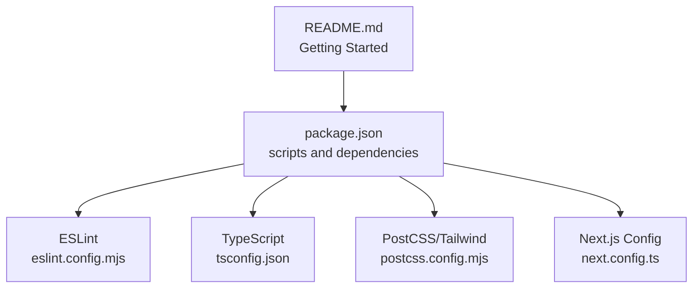
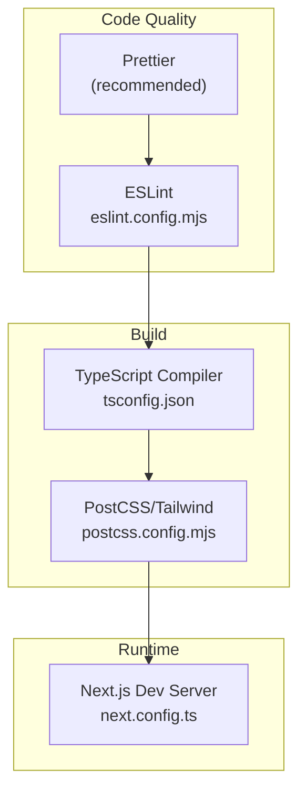
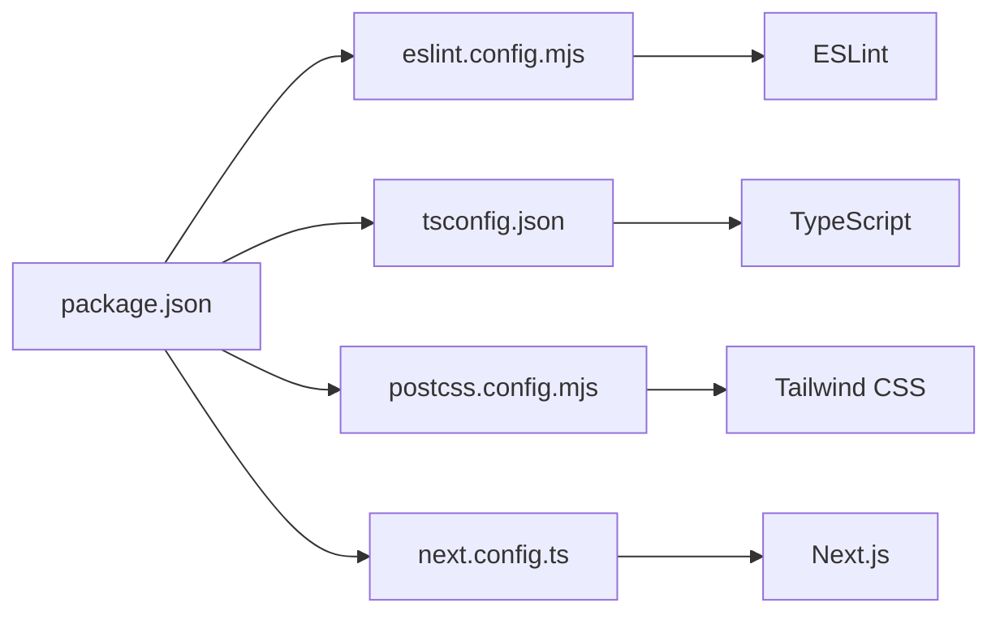

# Development Tools and Quality Assurance

<cite>
**Referenced Files in This Document**
- [package.json](file://package.json)
- [eslint.config.mjs](file://eslint.config.mjs)
- [next.config.ts](file://next.config.ts)
- [postcss.config.mjs](file://postcss.config.mjs)
- [tsconfig.json](file://tsconfig.json)
- [README.md](file://README.md)
</cite>

## Table of Contents
1. [Introduction](#introduction)
2. [Project Structure](#project-structure)
3. [Core Components](#core-components)
4. [Architecture Overview](#architecture-overview)
5. [Detailed Component Analysis](#detailed-component-analysis)
6. [Dependency Analysis](#dependency-analysis)
7. [Performance Considerations](#performance-considerations)
8. [Troubleshooting Guide](#troubleshooting-guide)
9. [Conclusion](#conclusion)

## Introduction
This document describes the development tools and quality assurance setup for Rhema Expert Solutions. It focuses on linting with ESLint, formatting integration, development server configuration, TypeScript compilation, and Tailwind CSS integration. It also provides guidance for extending the setup with Prettier, Husky, and CI pipelines, along with best practices for team collaboration and code quality.

## Project Structure
The project is a Next.js application configured with modern tooling:
- Package scripts orchestrate development, building, and linting
- ESLint is configured via a flat config file
- TypeScript is enabled with strict mode and Next-specific compiler options
- Tailwind CSS is integrated through PostCSS

**Diagram sources**
- [package.json:1-32](file://package.json#L1-L32)
- [eslint.config.mjs:1-19](file://eslint.config.mjs#L1-L19)
- [tsconfig.json:1-35](file://tsconfig.json#L1-L35)
- [postcss.config.mjs:1-8](file://postcss.config.mjs#L1-L8)
- [next.config.ts:1-8](file://next.config.ts#L1-L8)
- [README.md:1-37](file://README.md#L1-L37)

**Section sources**
- [package.json:1-32](file://package.json#L1-L32)
- [README.md:1-37](file://README.md#L1-L37)

## Core Components
- ESLint configuration: Uses a flat config combining Next.js web vitals and TypeScript presets, with explicit overrides for global ignores.
- TypeScript configuration: Strict compilation, JSX transform, bundler module resolution, and path aliases.
- PostCSS/Tailwind integration: Tailwind plugin wired through PostCSS.
- Next.js configuration: Placeholder for future Next.js-specific options.
- Package scripts: Dev server, build, production start, and lint commands.

**Section sources**
- [eslint.config.mjs:1-19](file://eslint.config.mjs#L1-L19)
- [tsconfig.json:1-35](file://tsconfig.json#L1-L35)
- [postcss.config.mjs:1-8](file://postcss.config.mjs#L1-L8)
- [next.config.ts:1-8](file://next.config.ts#L1-L8)
- [package.json:5-10](file://package.json#L5-L10)

## Architecture Overview
The development toolchain integrates the following flows:
- Linting: ESLint reads the flat configuration and applies Next.js and TypeScript rules while overriding default ignores.
- Formatting: Recommended to integrate Prettier alongside ESLint for consistent formatting.
- Build pipeline: TypeScript compiles TS/TSX under strict settings; PostCSS transforms Tailwind classes.
- Development server: Next.js dev server runs the app locally with hot reloading.

**Diagram sources**
- [eslint.config.mjs:1-19](file://eslint.config.mjs#L1-L19)
- [tsconfig.json:1-35](file://tsconfig.json#L1-L35)
- [postcss.config.mjs:1-8](file://postcss.config.mjs#L1-L8)
- [next.config.ts:1-8](file://next.config.ts#L1-L8)

## Detailed Component Analysis

### ESLint Configuration
- Presets: Combines Next.js web vitals and TypeScript configurations.
- Ignores override: Explicitly adjusts default ignores to include or exclude specific paths.
- Extensibility: New rules or plugins can be added to the exported array.

Recommended additions:
- Add a Prettier plugin for ESLint to enforce formatting parity.
- Configure plugin rules for React hooks, import sorting, or custom project rules.

**Section sources**
- [eslint.config.mjs:1-19](file://eslint.config.mjs#L1-L19)

### TypeScript Configuration
- Strictness: Enabled strict type checking and no emit for development.
- Module resolution: Bundler resolution aligns with Next.js runtime.
- JSX transform: Uses Next-specific JSX transform.
- Path aliases: Root alias mapped for convenient imports.
- Includes/excludes: Targets TS/TSX files and Next type generation folders.

Optimization tips:
- Keep incremental builds enabled for faster rebuilds during development.
- Consider enabling isolated declarations for stricter component contracts.

**Section sources**
- [tsconfig.json:1-35](file://tsconfig.json#L1-L35)

### PostCSS and Tailwind Integration
- Plugin: Tailwind PostCSS plugin is declared in the PostCSS configuration.
- Build flow: Tailwind directives are processed during the build pipeline.

Recommendations:
- Pin Tailwind and PostCSS versions to match the project’s ecosystem.
- Consider Purge/Content configuration to remove unused styles in production builds.

**Section sources**
- [postcss.config.mjs:1-8](file://postcss.config.mjs#L1-L8)

### Next.js Configuration
- Current state: Empty configuration object for future customization.
- Extension points: Add performance budgets, redirects, headers, or experimental features as needed.

**Section sources**
- [next.config.ts:1-8](file://next.config.ts#L1-L8)

### Package Scripts and Workflows
- Development: Starts the Next.js dev server with hot reloading.
- Build: Produces an optimized production build.
- Start: Runs the compiled production server.
- Lint: Executes ESLint across the project.

Extending workflows:
- Add a test script if Jest or similar is introduced.
- Add a pre-commit hook runner to automate linting and formatting before commits.

**Section sources**
- [package.json:5-10](file://package.json#L5-L10)

### Formatting with Prettier (Recommended)
While not currently configured, integrating Prettier complements ESLint:
- Install Prettier and a compatible ESLint plugin.
- Configure a shared formatter settings file.
- Run formatting as part of pre-commit hooks and CI checks.

Impact:
- Reduces bikeshedding around style choices.
- Ensures consistent formatting across contributors.

[No sources needed since this section provides recommended configuration without analyzing specific files]

### Git Hooks with Husky (Recommended)
- Install Husky and configure pre-commit hooks to run linting and formatting.
- Optionally run tests on staged files to prevent broken commits.

Benefits:
- Enforces quality gates at commit time.
- Keeps the repository clean and consistent.

[No sources needed since this section provides recommended configuration without analyzing specific files]

### Continuous Integration Pipelines (Recommended)
- Lint stage: Run ESLint to catch style and correctness issues.
- Type check stage: Run TypeScript compiler in check-only mode.
- Test stage: Execute unit and integration tests.
- Build stage: Produce the Next.js build artifacts for deployment.

[No sources needed since this section provides general CI guidance]

### Debugging Tools and Development Server
- Next.js dev server: Provides fast refresh and error overlay.
- TypeScript diagnostics: Strict TS configuration surfaces type errors early.
- Browser devtools: Inspect network requests, performance, and rendering.

Optimization tips:
- Use selective logging and environment variables to reduce noise in development.
- Leverage React DevTools for component inspection and performance profiling.

**Section sources**
- [next.config.ts:1-8](file://next.config.ts#L1-L8)
- [tsconfig.json:7-8](file://tsconfig.json#L7-L8)

### Hot Reload Optimization
- Next.js Fast Refresh: Enables fast component updates without losing state.
- Incremental TS builds: Keep incremental compilation enabled to speed up rebuilds.
- Tailwind purge: Configure purging appropriately to avoid bloating CSS in development.

**Section sources**
- [tsconfig.json:15](file://tsconfig.json#L15)
- [next.config.ts:3-5](file://next.config.ts#L3-L5)

### Team Collaboration and Code Review Processes
- Shared ESLint and TS configs: Ensure all contributors use identical rules.
- Commit message conventions: Adopt a standard for meaningful commits.
- Pull request templates: Include checklist items for linting, types, tests, and accessibility.
- Code review guidelines: Focus on correctness, readability, maintainability, and adherence to project conventions.

[No sources needed since this section provides general collaboration guidance]

## Dependency Analysis
The project relies on Next.js, TypeScript, and Tailwind CSS. ESLint is configured via a flat config that composes Next-specific presets. There are no explicit dependencies for Prettier or Husky in the current manifest.

**Diagram sources**
- [package.json:1-32](file://package.json#L1-L32)
- [eslint.config.mjs:1-19](file://eslint.config.mjs#L1-L19)
- [tsconfig.json:1-35](file://tsconfig.json#L1-L35)
- [postcss.config.mjs:1-8](file://postcss.config.mjs#L1-L8)
- [next.config.ts:1-8](file://next.config.ts#L1-L8)

**Section sources**
- [package.json:11-30](file://package.json#L11-L30)
- [eslint.config.mjs:1-19](file://eslint.config.mjs#L1-L19)
- [tsconfig.json:1-35](file://tsconfig.json#L1-L35)
- [postcss.config.mjs:1-8](file://postcss.config.mjs#L1-L8)
- [next.config.ts:1-8](file://next.config.ts#L1-L8)

## Performance Considerations
- Keep TypeScript strict mode enabled for correctness without sacrificing DX.
- Enable incremental builds to speed up repeated compilations.
- Use Tailwind’s purge/content configuration to minimize CSS payload in production.
- Prefer lightweight lint rules in development; enable stricter rules in CI.

[No sources needed since this section provides general guidance]

## Troubleshooting Guide
- Lint failures: Run the lint script to identify issues surfaced by ESLint. Review the flat config for rule conflicts or missing plugins.
- Type errors: Use strict TS settings to surface issues early; fix declarations or suppress selectively with justified comments.
- Build errors: Verify PostCSS/Tailwind plugin configuration and ensure Tailwind directives are present in source files.
- Dev server issues: Confirm Next.js configuration is valid and environment variables are set correctly.

**Section sources**
- [package.json:5-10](file://package.json#L5-L10)
- [eslint.config.mjs:1-19](file://eslint.config.mjs#L1-L19)
- [tsconfig.json:7](file://tsconfig.json#L7)
- [postcss.config.mjs:1-8](file://postcss.config.mjs#L1-L8)
- [next.config.ts:3-5](file://next.config.ts#L3-L5)

## Conclusion
Rhema Expert Solutions uses a solid foundation of Next.js, TypeScript, and Tailwind CSS with a modern ESLint flat configuration. To further strengthen quality assurance, integrate Prettier for formatting, Husky for pre-commit checks, and CI stages for linting, type-checking, testing, and building. These steps will improve consistency, reliability, and developer experience across the team.