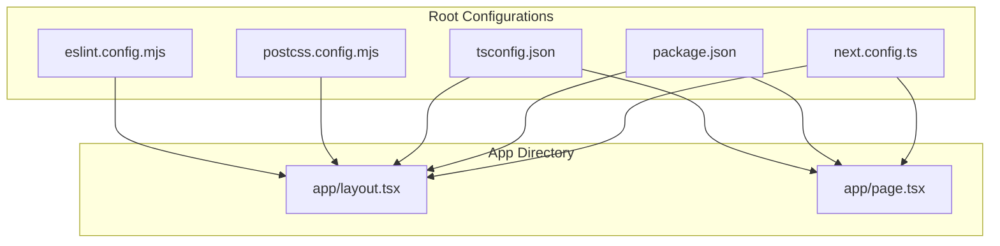
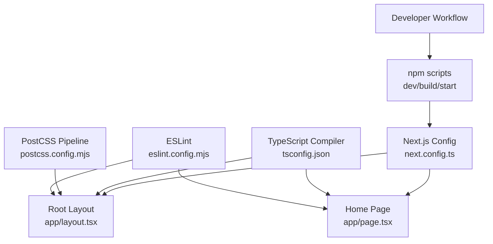
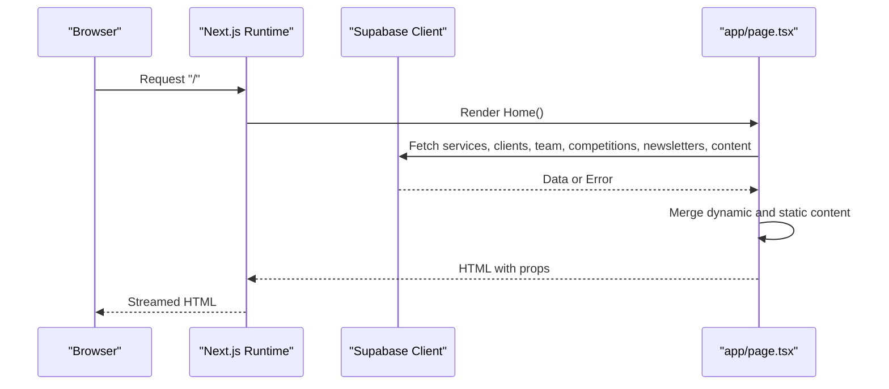
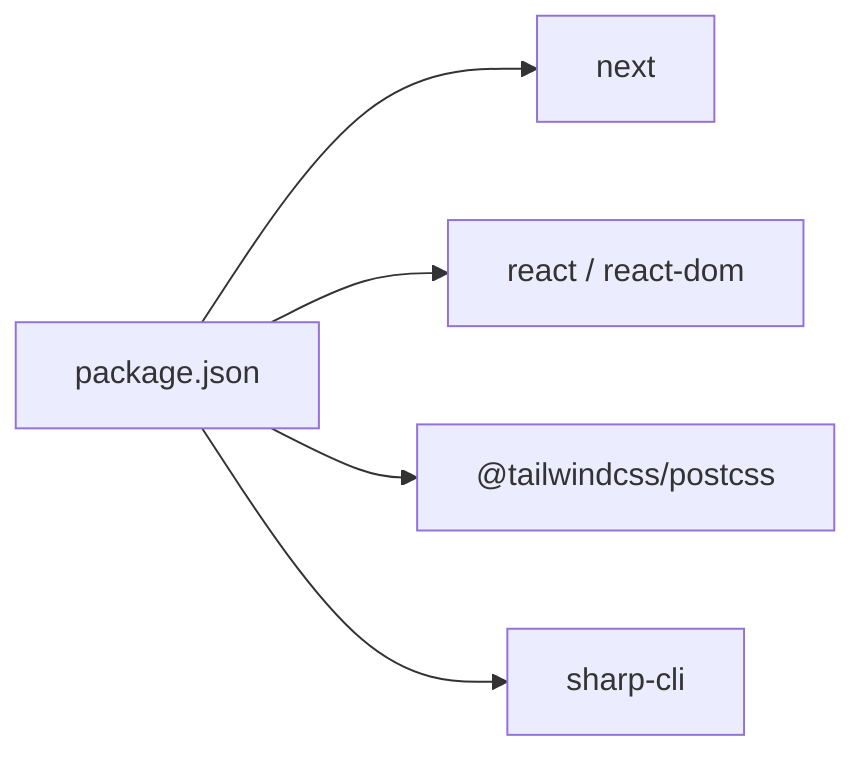

# Next.js Configuration

<cite>
**Referenced Files in This Document**
- [next.config.ts](file://next.config.ts)
- [package.json](file://package.json)
- [tsconfig.json](file://tsconfig.json)
- [postcss.config.mjs](file://postcss.config.mjs)
- [eslint.config.mjs](file://eslint.config.mjs)
- [app/layout.tsx](file://app/layout.tsx)
- [app/page.tsx](file://app/page.tsx)
</cite>

## Table of Contents
1. [Introduction](#introduction)
2. [Project Structure](#project-structure)
3. [Core Components](#core-components)
4. [Architecture Overview](#architecture-overview)
5. [Detailed Component Analysis](#detailed-component-analysis)
6. [Dependency Analysis](#dependency-analysis)
7. [Performance Considerations](#performance-considerations)
8. [Troubleshooting Guide](#troubleshooting-guide)
9. [Conclusion](#conclusion)
10. [Appendices](#appendices)

## Introduction
This document explains the Next.js configuration for Rhema Expert Solutions, focusing on application settings, build optimization, deployment targets, and runtime behavior. It covers static generation, server-side rendering, client-side routing, environment variable handling, build artifact optimization, performance monitoring setup, customization of Next.js behavior, plugin configuration, experimental features, deployment strategies, and production environment setup. Guidance is provided for maintaining configuration consistency across environments and resolving common build issues.

## Project Structure
The project follows Next.js App Router conventions with an app directory containing pages, layouts, and shared resources. Key configuration files reside at the repository root and influence build-time and runtime behavior.

**Diagram sources**
- [next.config.ts](file://next.config.ts)
- [package.json](file://package.json)
- [tsconfig.json](file://tsconfig.json)
- [postcss.config.mjs](file://postcss.config.mjs)
- [eslint.config.mjs](file://eslint.config.mjs)
- [app/layout.tsx](file://app/layout.tsx)
- [app/page.tsx](file://app/page.tsx)

**Section sources**
- [next.config.ts](file://next.config.ts)
- [package.json](file://package.json)
- [tsconfig.json](file://tsconfig.json)
- [postcss.config.mjs](file://postcss.config.mjs)
- [eslint.config.mjs](file://eslint.config.mjs)
- [app/layout.tsx](file://app/layout.tsx)
- [app/page.tsx](file://app/page.tsx)

## Core Components
- Next.js configuration entry point defines application-wide settings. The current configuration file is minimal and ready for extension.
- Package scripts orchestrate development, build, and production start commands.
- TypeScript compiler options enable strictness, module resolution, JSX transforms, and Next.js plugin integration.
- PostCSS/Tailwind pipeline integrates Tailwind v4 via a dedicated PostCSS plugin.
- ESLint configuration extends Next.js recommended rulesets for core web vitals and TypeScript.

Key configuration areas:
- Build and runtime behavior: next.config.ts
- Scripts and dependencies: package.json
- Type checking and module resolution: tsconfig.json
- Styling pipeline: postcss.config.mjs
- Code quality: eslint.config.mjs
- Application shell and metadata: app/layout.tsx
- Home page rendering and data fetching: app/page.tsx

**Section sources**
- [next.config.ts](file://next.config.ts)
- [package.json](file://package.json)
- [tsconfig.json](file://tsconfig.json)
- [postcss.config.mjs](file://postcss.config.mjs)
- [eslint.config.mjs](file://eslint.config.mjs)
- [app/layout.tsx](file://app/layout.tsx)
- [app/page.tsx](file://app/page.tsx)

## Architecture Overview
The application uses App Router with a root layout and a home page implementing server-side rendering for dynamic content retrieval. The configuration supports modern tooling and performance-oriented defaults.

**Diagram sources**
- [next.config.ts](file://next.config.ts)
- [package.json](file://package.json)
- [tsconfig.json](file://tsconfig.json)
- [postcss.config.mjs](file://postcss.config.mjs)
- [eslint.config.mjs](file://eslint.config.mjs)
- [app/layout.tsx](file://app/layout.tsx)
- [app/page.tsx](file://app/page.tsx)

## Detailed Component Analysis

### Next.js Configuration (next.config.ts)
- Purpose: Central place to configure Next.js behavior, build outputs, and runtime options.
- Current state: Minimal configuration placeholder; ready for extensions such as output tracing, experimental features, redirects, headers, and performance-related settings.
- Recommended additions:
  - Output tracing for smaller serverless deployments.
  - Base path and asset prefix for CDN or subpath hosting.
  - Experimental flags aligned with project needs.
  - Performance budgets and analyzer integration for builds.
  - Environment-specific overrides via process.env.

**Section sources**
- [next.config.ts](file://next.config.ts)

### TypeScript Configuration (tsconfig.json)
- Strict type checking enabled with isolated modules and bundler module resolution.
- Next.js plugin integrated for framework-aware type generation.
- Path aliases configured for clean imports.
- Incremental compilation enabled for faster rebuilds.

**Section sources**
- [tsconfig.json](file://tsconfig.json)

### Styling Pipeline (postcss.config.mjs)
- Tailwind v4 plugin configured via PostCSS.
- Ensures consistent CSS generation and optimization through the build pipeline.

**Section sources**
- [postcss.config.mjs](file://postcss.config.mjs)

### Code Quality (eslint.config.mjs)
- Extends Next.js core web vitals and TypeScript configurations.
- Overrides default ignores to include project-specific paths and exclude generated folders.

**Section sources**
- [eslint.config.mjs](file://eslint.config.mjs)

### Root Layout (app/layout.tsx)
- Defines metadata, fonts, favicon, and global styles.
- Implements Google AdSense account metadata.
- Provides the HTML wrapper and body classes for typography and anti-aliasing.

Rendering model:
- Static generation by default for the root layout.
- Dynamic content can be injected via page-level components.

**Section sources**
- [app/layout.tsx](file://app/layout.tsx)

### Home Page (app/page.tsx)
- Implements server-side rendering to fetch dynamic content from Supabase.
- Uses concurrent data fetching for multiple datasets.
- Falls back to static content when dynamic data is unavailable.
- Integrates components for galleries, hero slides, newsletter ticker, and contact actions.

Rendering model:
- Server-rendered with dynamic data hydration.
- Client-side interactivity handled by components.

**Diagram sources**
- [app/page.tsx](file://app/page.tsx)

**Section sources**
- [app/page.tsx](file://app/page.tsx)

### Environment Variables and Secrets
- No explicit environment variable files were found in the repository snapshot.
- Recommended pattern:
  - Define environment variables per environment (development, preview, production).
  - Use Next.js built-in environment variable exposure for client-side access prefixed appropriately.
  - Store secrets in platform-managed secret stores or CI/CD secret management.

[No sources needed since this section provides general guidance]

### Build Artifact Optimization
- Enable output tracing in next.config.ts for reduced serverless bundle sizes.
- Leverage incremental builds via TypeScript configuration.
- Optimize images using Next.js Image component and pre-processing where applicable.
- Minimize CSS via Tailwind purging and PostCSS optimization.

[No sources needed since this section provides general guidance]

### Performance Monitoring Setup
- Integrate Core Web Vitals reporting via Next.js instrumentation and analytics providers.
- Monitor build sizes and bundle composition using Next.js analyzer or external tools.
- Track runtime performance with browser performance APIs and server metrics.

[No sources needed since this section provides general guidance]

### Customizing Next.js Behavior
- Add plugins and middleware via next.config.ts and app/middleware.ts.
- Configure redirects, rewrites, headers, and security policies.
- Extend experimental features cautiously and test thoroughly.

[No sources needed since this section provides general guidance]

### Deployment Strategies
- Build output: Use the build script to generate optimized artifacts.
- Production start: Use the start script to serve the application.
- Platform-specific guidance:
  - For serverless platforms, enable output tracing and minimize dependencies.
  - For static export, evaluate routes and data requirements carefully.

**Section sources**
- [package.json](file://package.json)

### Production Environment Setup
- Ensure environment variables are set per environment.
- Validate build artifacts and runtime logs.
- Set up health checks and observability.

[No sources needed since this section provides general guidance]

## Dependency Analysis
The project relies on Next.js 16, React 19, and Tailwind v4 via PostCSS. Dependencies are declared in package.json and influence build-time behavior and runtime performance.

**Diagram sources**
- [package.json](file://package.json)

**Section sources**
- [package.json](file://package.json)

## Performance Considerations
- Prefer server-side rendering for dynamic content to improve initial load performance.
- Use concurrent data fetching to reduce time-to-first-byte.
- Optimize images and assets with Next.js Image and compression.
- Keep TypeScript strict mode enabled for earlier error detection.
- Use incremental builds and efficient module resolution.

[No sources needed since this section provides general guidance]

## Troubleshooting Guide
Common issues and resolutions:
- Build failures due to missing environment variables:
  - Ensure all required environment variables are present in the deployment environment.
- Type errors after updates:
  - Run type checks locally and resolve errors before committing.
- Styling inconsistencies:
  - Verify Tailwind plugin configuration and PostCSS pipeline.
- Slow builds:
  - Enable incremental builds and avoid unnecessary transpilation.
- Runtime errors on serverless:
  - Reduce bundle size using output tracing and remove unused dependencies.

**Section sources**
- [eslint.config.mjs](file://eslint.config.mjs)
- [tsconfig.json](file://tsconfig.json)
- [postcss.config.mjs](file://postcss.config.mjs)
- [package.json](file://package.json)

## Conclusion
Rhema Expert Solutions leverages Next.js App Router with server-side rendering for dynamic content and a modern build pipeline with TypeScript, Tailwind, and ESLint. The configuration is minimal and extensible, enabling performance optimizations, robust deployment strategies, and consistent developer experience across environments.

[No sources needed since this section summarizes without analyzing specific files]

## Appendices

### Appendix A: Next.js Rendering Modes in This Project
- Root layout: Static generation by default.
- Home page: Server-side rendering with dynamic data fetching.
- Client-side routing: Automatic via App Router.

**Section sources**
- [app/layout.tsx](file://app/layout.tsx)
- [app/page.tsx](file://app/page.tsx)

### Appendix B: Recommended next.config.ts Extensions
- Output tracing for serverless deployments.
- Base path and asset prefix for CDN/subpath hosting.
- Experimental flags aligned with project needs.
- Performance budgets and analyzer integration.

**Section sources**
- [next.config.ts](file://next.config.ts)