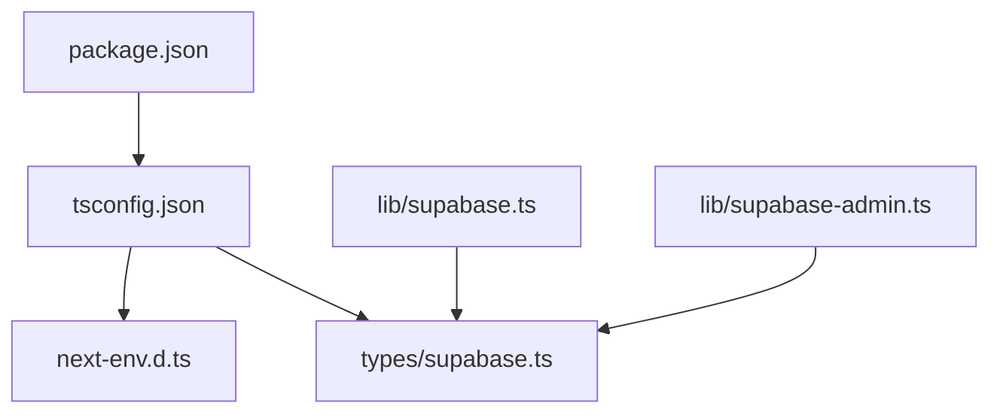
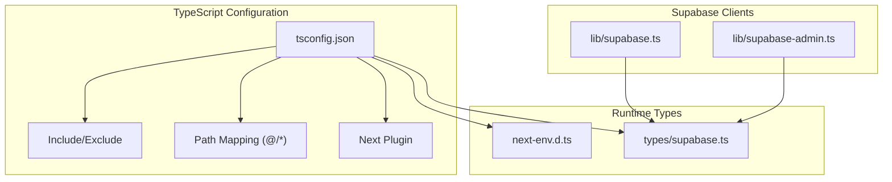
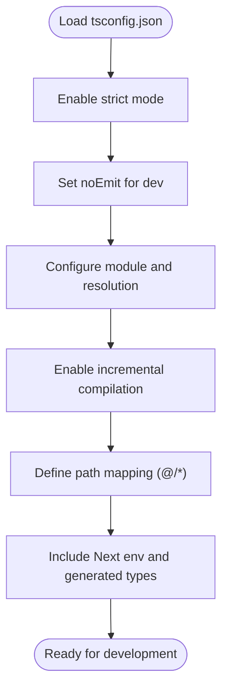
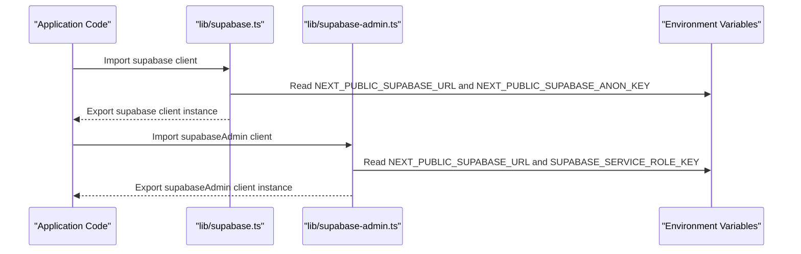
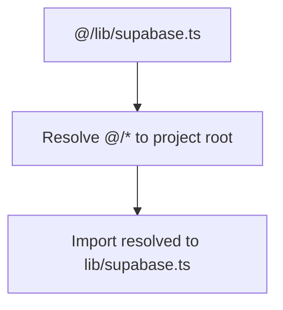
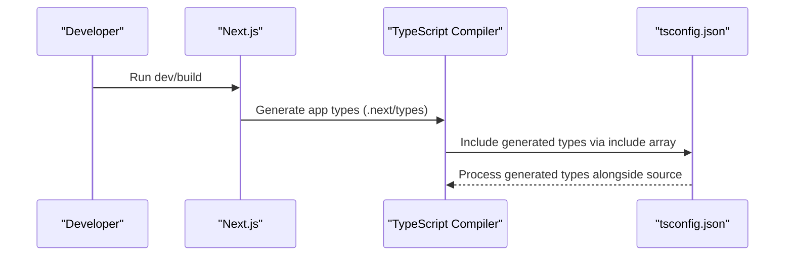
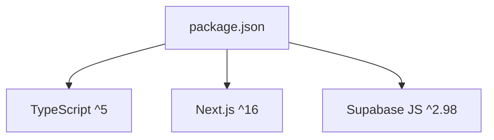

# TypeScript Configuration

<cite>
**Referenced Files in This Document**
- [tsconfig.json](file://tsconfig.json)
- [types/supabase.ts](file://types/supabase.ts)
- [lib/supabase.ts](file://lib/supabase.ts)
- [lib/supabase-admin.ts](file://lib/supabase-admin.ts)
- [package.json](file://package.json)
- [next-env.d.ts](file://next-env.d.ts)
</cite>

## Table of Contents
1. [Introduction](#introduction)
2. [Project Structure](#project-structure)
3. [Core Components](#core-components)
4. [Architecture Overview](#architecture-overview)
5. [Detailed Component Analysis](#detailed-component-analysis)
6. [Dependency Analysis](#dependency-analysis)
7. [Performance Considerations](#performance-considerations)
8. [Troubleshooting Guide](#troubleshooting-guide)
9. [Conclusion](#conclusion)

## Introduction
This document provides comprehensive guidance for TypeScript configuration in Rhema Expert Solutions. It explains the current tsconfig.json compiler options, strict type checking strategies, module resolution settings, path mapping, and declaration file generation. It also covers integration with Supabase type definitions, custom type interfaces, environment-specific configuration extension, and best practices for maintaining type safety across the codebase. Guidance is included for incremental compilation, common compilation issues, and migration strategies for TypeScript updates.

## Project Structure
The project follows a Next.js application layout with a dedicated types directory for custom type definitions and library modules for Supabase client initialization. The TypeScript configuration is centralized in tsconfig.json, while Next.js-generated type files are included via the include array.

**Diagram sources**
- [tsconfig.json](file://tsconfig.json)
- [next-env.d.ts](file://next-env.d.ts)
- [types/supabase.ts](file://types/supabase.ts)
- [lib/supabase.ts](file://lib/supabase.ts)
- [lib/supabase-admin.ts](file://lib/supabase-admin.ts)
- [package.json](file://package.json)

**Section sources**
- [tsconfig.json](file://tsconfig.json)
- [package.json](file://package.json)

## Core Components
This section documents the primary TypeScript configuration elements and their roles in the project.

- Compiler Options
  - Target and Library: Targets ES2017 with DOM, iterable, and ESNext libraries to support modern browser APIs and async iteration.
  - Strict Mode: Enabled to enforce rigorous type checking across the codebase.
  - No Emit: Prevents TypeScript from emitting compiled JavaScript during development, relying on Next.js transpilation.
  - Module Resolution: Uses bundler resolution for compatibility with Next.js and modern bundlers.
  - JSX: Configured for React JSX transform.
  - Incremental Compilation: Enabled to improve build performance by caching compilation state.
  - Plugins: Includes the Next plugin for framework-specific type generation and diagnostics.
  - Paths: Path mapping set to @/* resolves to project root for clean imports.

- Include and Exclude
  - Include: Ensures Next.js environment types, all TypeScript/TSX files, and Next-generated type files are processed.
  - Exclude: Excludes node_modules globally for performance and correctness.

- Supabase Type Definitions
  - Custom Interfaces: A dedicated file defines interfaces for domain entities (content, services, clients, teams, competitions, newsletter, registrations, projects, coding class registrations, staff notes).
  - Integration: These interfaces are consumed by Supabase client modules to provide strong typing for database operations.

**Section sources**
- [tsconfig.json](file://tsconfig.json)
- [types/supabase.ts](file://types/supabase.ts)

## Architecture Overview
The TypeScript configuration integrates with Next.js and Supabase to deliver a strongly typed development experience. The Supabase client modules initialize the client with environment variables and expose helpers to check configuration status. The custom type definitions provide explicit shapes for database records, enabling accurate type inference in application code.

**Diagram sources**
- [tsconfig.json](file://tsconfig.json)
- [next-env.d.ts](file://next-env.d.ts)
- [types/supabase.ts](file://types/supabase.ts)
- [lib/supabase.ts](file://lib/supabase.ts)
- [lib/supabase-admin.ts](file://lib/supabase-admin.ts)

## Detailed Component Analysis

### tsconfig.json Analysis
The configuration emphasizes strictness, modern JS features, and Next.js compatibility. Notable aspects:
- Strict mode ensures comprehensive type checks.
- No emit aligns with Next.js’s transpilation pipeline.
- Bundler module resolution supports modern bundlers and tree-shaking.
- Incremental compilation improves developer productivity.
- Path mapping simplifies imports across the project.
- Next plugin enables framework-specific type generation.

**Diagram sources**
- [tsconfig.json](file://tsconfig.json)

**Section sources**
- [tsconfig.json](file://tsconfig.json)

### Supabase Type Definitions
Custom interfaces define the structure of domain entities. They are designed to be explicit and nullable where appropriate, reflecting optional database fields. These interfaces integrate with Supabase client usage to provide accurate typing for queries and mutations.

```mermaid
classDiagram
class RhemaContent {
+string id
+string section
+string key
+string value
+string description?
}
class RhemaService {
+string id
+string title
+string description
+string folder_name?
+string[] image_urls?
+number display_order?
}
class RhemaClient {
+string id
+string name
+number display_order?
}
class RhemaTeam {
+string id
+string name
+string role
+string image_url?
+number display_order?
}
class RhemaCompetition {
+string id
+string title
+string description
+string registration_link?
+string image_url?
+boolean is_active?
+string event_date?
}
class RhemaNewsletter {
+string id
+string title
+string content
+string image_url?
+string category?
+boolean is_published?
+string created_at?
}
class RhemaRegistration {
+string id
+string created_at
+string full_name
+string gender
+string date_of_birth
+number age
+string school_name
+string school_address?
+string school_phone?
+string class_level
+string category
+string parent_name
+string parent_phone
+string parent_email?
+string competition_name
+string status
}
class RhemaProject {
+string id
+string title?
+string image_url
+string description?
+number display_order?
}
class RhemaCodingClassRegistration {
+string id
+string created_at
+string full_name
+string email?
+string phone
+number age?
+string gender?
+string[] courses
+string payment_plan
+string experience_level?
+string preferred_start_date?
+string notes?
+string status
}
class RhemaStaffNote {
+string id
+string created_at
+string updated_at?
+string title
+string content
+string author
+string category?
+string priority?
+string status?
+string[] tags?
+string[] file_urls?
+boolean is_pinned?
}
```

**Diagram sources**
- [types/supabase.ts](file://types/supabase.ts)

**Section sources**
- [types/supabase.ts](file://types/supabase.ts)

### Supabase Client Integration
The Supabase client modules initialize the client using environment variables and export helpers to verify configuration. The admin client uses a service role key for privileged operations, with fallback behavior documented in code comments.

**Diagram sources**
- [lib/supabase.ts](file://lib/supabase.ts)
- [lib/supabase-admin.ts](file://lib/supabase-admin.ts)

**Section sources**
- [lib/supabase.ts](file://lib/supabase.ts)
- [lib/supabase-admin.ts](file://lib/supabase-admin.ts)

### Path Mapping and Module Resolution
Path mapping is configured to resolve @/* to the project root, simplifying imports across the application. Module resolution uses bundler to align with Next.js and modern bundlers.

**Diagram sources**
- [tsconfig.json](file://tsconfig.json)

**Section sources**
- [tsconfig.json](file://tsconfig.json)

### Declaration File Generation
Next.js generates type declarations for the app during development and build. The include array in tsconfig.json ensures these generated types are considered by the TypeScript compiler.

**Diagram sources**
- [tsconfig.json](file://tsconfig.json)
- [next-env.d.ts](file://next-env.d.ts)

**Section sources**
- [tsconfig.json](file://tsconfig.json)
- [next-env.d.ts](file://next-env.d.ts)

## Dependency Analysis
The project’s TypeScript configuration relies on Next.js and Supabase. The package.json specifies TypeScript and Next.js versions, ensuring compatibility with the tsconfig.json settings.

**Diagram sources**
- [package.json](file://package.json)

**Section sources**
- [package.json](file://package.json)

## Performance Considerations
- Incremental Compilation: Enabled in tsconfig.json to speed up builds by reusing cached information.
- No Emit in Development: Reduces unnecessary work by delegating transpilation to Next.js.
- Strict Mode: Helps catch issues early, reducing runtime errors and improving long-term maintainability.
- Module Resolution: Using bundler resolution supports efficient bundling and tree-shaking.

[No sources needed since this section provides general guidance]

## Troubleshooting Guide
Common issues and resolutions:
- Missing Environment Variables
  - Symptom: Console warnings about missing Supabase environment variables.
  - Resolution: Ensure NEXT_PUBLIC_SUPABASE_URL and NEXT_PUBLIC_SUPABASE_ANON_KEY are set in the environment. For admin operations, set SUPABASE_SERVICE_ROLE_KEY.
  - Related code paths:
    - [lib/supabase.ts](file://lib/supabase.ts)
    - [lib/supabase-admin.ts](file://lib/supabase-admin.ts)

- Path Mapping Issues
  - Symptom: Import errors for @/* paths.
  - Resolution: Verify tsconfig.json path mapping and ensure imports use the @ alias consistently.
  - Related code paths:
    - [tsconfig.json](file://tsconfig.json)

- Generated Types Not Picked Up
  - Symptom: Type errors for Next.js app types.
  - Resolution: Confirm that the include array in tsconfig.json covers Next-generated types and that Next is running in development mode to regenerate types.
  - Related code paths:
    - [tsconfig.json](file://tsconfig.json)
    - [next-env.d.ts](file://next-env.d.ts)

- Strict Mode Errors
  - Symptom: Compilation failures due to strict type checking.
  - Resolution: Add explicit types or nullish checks to satisfy strict mode requirements.
  - Related code paths:
    - [tsconfig.json](file://tsconfig.json)

**Section sources**
- [lib/supabase.ts](file://lib/supabase.ts)
- [lib/supabase-admin.ts](file://lib/supabase-admin.ts)
- [tsconfig.json](file://tsconfig.json)
- [next-env.d.ts](file://next-env.d.ts)

## Conclusion
Rhema Expert Solutions employs a robust TypeScript configuration aligned with Next.js and Supabase. The setup leverages strict type checking, path mapping, incremental compilation, and Next-generated types to maintain type safety and developer productivity. By following the best practices outlined here—explicit typing, careful environment variable management, and disciplined path mapping—you can sustain a high-quality type system as the project evolves.