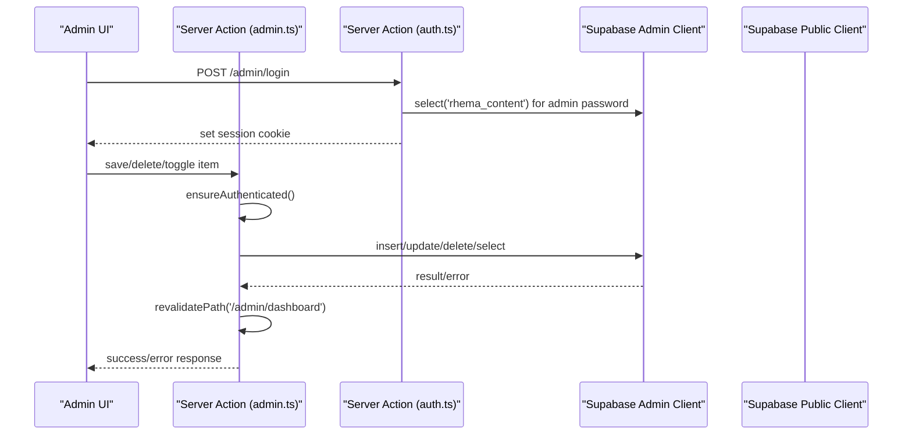
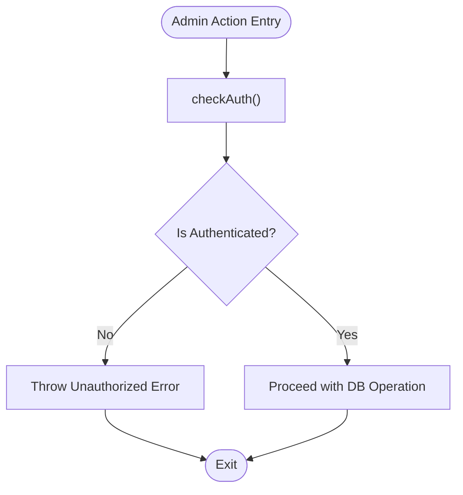
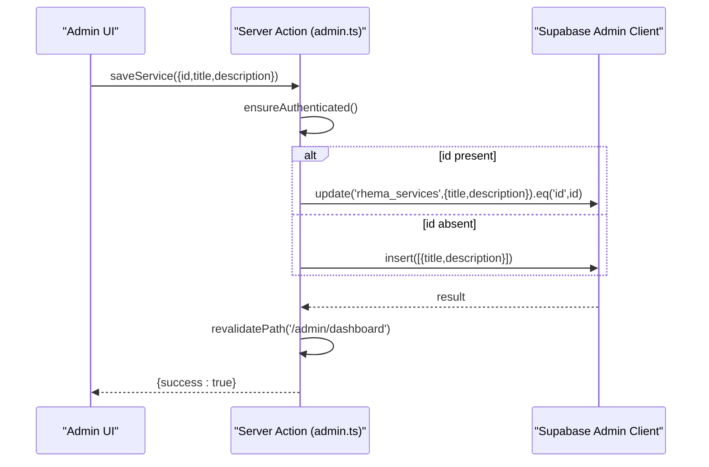
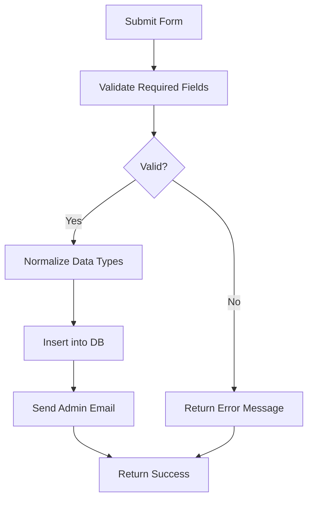
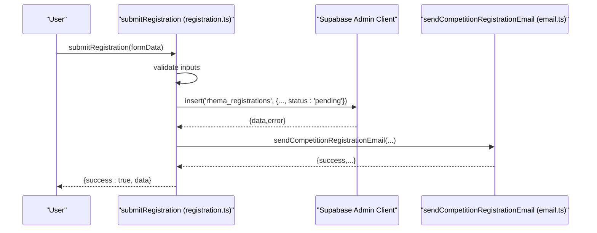
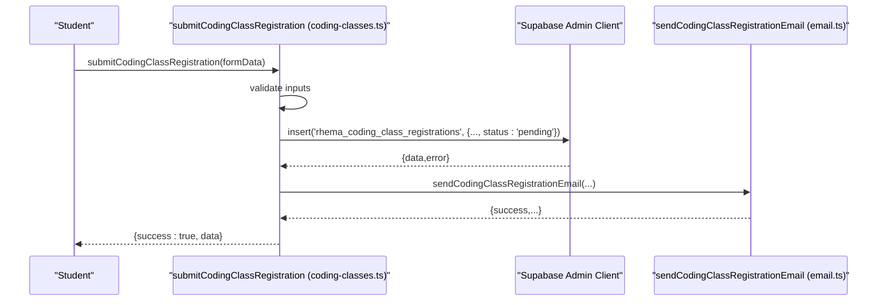
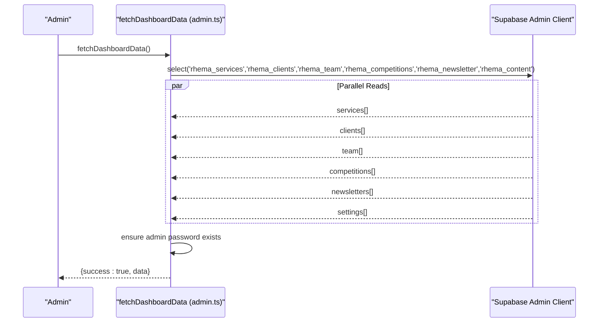
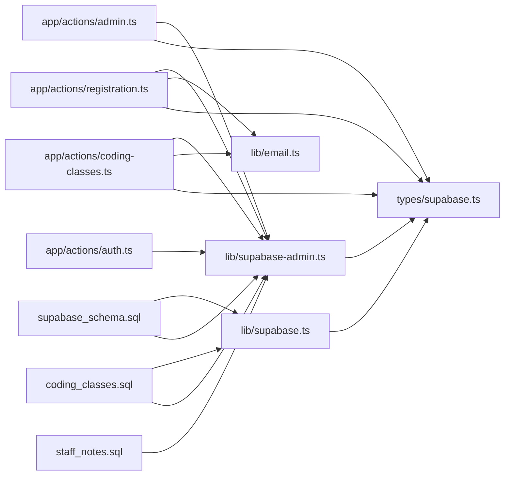

# Data Operations and Queries

<cite>
**Referenced Files in This Document**
- [supabase.ts](file://lib/supabase.ts)
- [supabase-admin.ts](file://lib/supabase-admin.ts)
- [auth.ts](file://app/actions/auth.ts)
- [admin.ts](file://app/actions/admin.ts)
- [registration.ts](file://app/actions/registration.ts)
- [coding-classes.ts](file://app/actions/coding-classes.ts)
- [email.ts](file://lib/email.ts)
- [supabase.ts (types)](file://types/supabase.ts)
- [schema.sql](file://supabase_schema.sql)
- [coding_classes.sql](file://supabase_migration_add_coding_classes.sql)
- [school_phone.sql](file://supabase_migration_add_school_phone.sql)
- [staff_notes.sql](file://supabase_migration_add_staff_notes.sql)
</cite>

## Table of Contents
1. [Introduction](#introduction)
2. [Project Structure](#project-structure)
3. [Core Components](#core-components)
4. [Architecture Overview](#architecture-overview)
5. [Detailed Component Analysis](#detailed-component-analysis)
6. [Dependency Analysis](#dependency-analysis)
7. [Performance Considerations](#performance-considerations)
8. [Troubleshooting Guide](#troubleshooting-guide)
9. [Conclusion](#conclusion)
10. [Appendices](#appendices)

## Introduction
This document explains how data operations and database queries are implemented in Rhema Expert Solutions. It covers CRUD operations, query patterns, authentication and authorization, integration between server actions and database operations, query optimization, pagination strategies, error handling, transactions, and security considerations including Row Level Security (RLS). Practical examples illustrate user registration, course enrollment, and administrative tasks.

## Project Structure
The data layer is centered around Supabase clients configured for public and admin access, server action modules orchestrating database operations, and TypeScript type definitions describing table schemas. Administrative and public-facing features rely on separate server actions that encapsulate data manipulation and enforce authorization.

```mermaid
graph TB
subgraph "Libraries"
SPublic["lib/supabase.ts<br/>Public client"]
SAdmin["lib/supabase-admin.ts<br/>Admin client"]
end
subgraph "Server Actions"
AuthAct["app/actions/auth.ts<br/>login/logout/checkAuth"]
AdminAct["app/actions/admin.ts<br/>save/delete/toggle"]
RegAct["app/actions/registration.ts<br/>submit/fetch/update/delete"]
CodingAct["app/actions/coding-classes.ts<br/>submit/fetch/update/delete"]
end
subgraph "Types"
Types["types/supabase.ts<br/>Table interfaces"]
end
subgraph "Database"
Schema["supabase_schema.sql<br/>rhema_registrations"]
CodingSchema["coding_classes.sql<br/>rhema_coding_class_registrations"]
StaffNotesSchema["staff_notes.sql<br/>rhema_staff_notes"]
end
subgraph "Utilities"
Email["lib/email.ts<br/>sendEmail helpers"]
end
SPublic --> AuthAct
SAdmin --> AdminAct
SAdmin --> RegAct
SAdmin --> CodingAct
AuthAct --> SAdmin
AdminAct --> SAdmin
RegAct --> SAdmin
CodingAct --> SAdmin
Types --> AdminAct
Types --> RegAct
Types --> CodingAct
Email --> RegAct
Email --> CodingAct
Schema --> SPublic
Schema --> SAdmin
CodingSchema --> SPublic
CodingSchema --> SAdmin
StaffNotesSchema --> SAdmin
```

**Diagram sources**
- [supabase.ts:1-25](file://lib/supabase.ts#L1-L25)
- [supabase-admin.ts:1-19](file://lib/supabase-admin.ts#L1-L19)
- [auth.ts:1-55](file://app/actions/auth.ts#L1-L55)
- [admin.ts:1-198](file://app/actions/admin.ts#L1-L198)
- [registration.ts:1-131](file://app/actions/registration.ts#L1-L131)
- [coding-classes.ts:1-157](file://app/actions/coding-classes.ts#L1-L157)
- [email.ts:1-134](file://lib/email.ts#L1-L134)
- [supabase.ts (types):1-113](file://types/supabase.ts#L1-L113)
- [schema.sql:1-33](file://supabase_schema.sql#L1-L33)
- [coding_classes.sql:1-30](file://supabase_migration_add_coding_classes.sql#L1-L30)
- [staff_notes.sql:1-44](file://supabase_migration_add_staff_notes.sql#L1-L44)

**Section sources**
- [supabase.ts:1-25](file://lib/supabase.ts#L1-L25)
- [supabase-admin.ts:1-19](file://lib/supabase-admin.ts#L1-L19)
- [auth.ts:1-55](file://app/actions/auth.ts#L1-L55)
- [admin.ts:1-198](file://app/actions/admin.ts#L1-L198)
- [registration.ts:1-131](file://app/actions/registration.ts#L1-L131)
- [coding-classes.ts:1-157](file://app/actions/coding-classes.ts#L1-L157)
- [email.ts:1-134](file://lib/email.ts#L1-L134)
- [supabase.ts (types):1-113](file://types/supabase.ts#L1-L113)
- [schema.sql:1-33](file://supabase_schema.sql#L1-L33)
- [coding_classes.sql:1-30](file://supabase_migration_add_coding_classes.sql#L1-L30)
- [staff_notes.sql:1-44](file://supabase_migration_add_staff_notes.sql#L1-L44)

## Core Components
- Supabase Public Client: Provides read access for most tables under Row Level Security (RLS). Used primarily for public-facing queries and read-only operations.
- Supabase Admin Client: Uses a Service Role Key to bypass RLS for administrative write operations. Used by server actions for inserts, updates, deletes, and bulk reads.
- Server Actions: Encapsulate CRUD operations, authentication checks, and revalidation of cached routes after writes.
- Type Definitions: Strongly typed interfaces for all managed tables, ensuring compile-time safety for data shapes.
- Email Utilities: Send notifications upon successful registrations.

Key responsibilities:
- Authentication and Authorization: Admin login sets a session cookie; subsequent admin actions check the cookie before proceeding.
- Data Manipulation: Insert, update, delete, and select operations against Supabase tables.
- Error Handling: Centralized error propagation from Supabase responses and generic catch blocks.
- Revalidation: After write operations, Next.js cache is invalidated to reflect updated data.

**Section sources**
- [supabase.ts:1-25](file://lib/supabase.ts#L1-L25)
- [supabase-admin.ts:1-19](file://lib/supabase-admin.ts#L1-L19)
- [auth.ts:1-55](file://app/actions/auth.ts#L1-L55)
- [admin.ts:1-198](file://app/actions/admin.ts#L1-L198)
- [registration.ts:1-131](file://app/actions/registration.ts#L1-L131)
- [coding-classes.ts:1-157](file://app/actions/coding-classes.ts#L1-L157)
- [email.ts:1-134](file://lib/email.ts#L1-L134)
- [supabase.ts (types):1-113](file://types/supabase.ts#L1-L113)

## Architecture Overview
The system follows a server-actions-driven architecture:
- Frontend triggers server actions via forms and buttons.
- Server actions validate inputs, enforce authorization, and perform database operations using the Supabase Admin client.
- For public-facing reads, the Supabase Public client is used with RLS policies.
- After writes, Next.js revalidation refreshes cached data.



**Diagram sources**
- [auth.ts:1-55](file://app/actions/auth.ts#L1-L55)
- [admin.ts:1-198](file://app/actions/admin.ts#L1-L198)
- [supabase-admin.ts:1-19](file://lib/supabase-admin.ts#L1-L19)
- [supabase.ts:1-25](file://lib/supabase.ts#L1-L25)

## Detailed Component Analysis

### Authentication and Authorization
- Login: Retrieves admin password from the content table, persists a session cookie on success, and supports dynamic creation of the password record if missing.
- Logout: Deletes the session cookie and redirects to the admin landing page.
- Check: Verifies presence of the session cookie for protected routes.

Authorization pattern:
- Admin actions wrap all write operations with an authentication guard that throws if unauthorized.
- The admin client bypasses RLS using a Service Role Key, enabling privileged operations.



**Diagram sources**
- [auth.ts:50-54](file://app/actions/auth.ts#L50-L54)
- [admin.ts:14-19](file://app/actions/admin.ts#L14-L19)

**Section sources**
- [auth.ts:1-55](file://app/actions/auth.ts#L1-L55)
- [admin.ts:14-19](file://app/actions/admin.ts#L14-L19)

### CRUD Operations and Query Patterns
Common patterns across server actions:
- Select: Fetch lists with ordering and optional filtering.
- Insert: Upsert-like behavior using ID presence to decide update vs insert.
- Update: Partial updates with equality filters.
- Delete: Equality filter by ID.
- Bulk reads: Parallel execution of multiple selects for dashboard data.

Examples by module:
- Services, Clients, Team, Competitions, Newsletter, Settings: Save and delete operations with revalidation.
- Registrations (Competition): Submit registration, fetch all, update status, delete.
- Coding Class Registrations: Submit registration, fetch all, update status, delete.



**Diagram sources**
- [admin.ts:21-36](file://app/actions/admin.ts#L21-L36)
- [supabase-admin.ts:1-19](file://lib/supabase-admin.ts#L1-L19)

**Section sources**
- [admin.ts:21-198](file://app/actions/admin.ts#L21-L198)
- [registration.ts:22-131](file://app/actions/registration.ts#L22-L131)
- [coding-classes.ts:20-157](file://app/actions/coding-classes.ts#L20-L157)

### Data Manipulation Strategies
- Validation: Inputs are validated before database operations to prevent malformed records.
- Normalization: Fields like age are normalized to integers; optional fields are handled with null defaults.
- Status Tracking: Status fields support workflow transitions (e.g., pending, approved, rejected; pending, contacted, enrolled, cancelled).
- Notifications: On successful submissions, admin emails are sent asynchronously.



**Diagram sources**
- [registration.ts:40-84](file://app/actions/registration.ts#L40-L84)
- [coding-classes.ts:35-76](file://app/actions/coding-classes.ts#L35-L76)
- [email.ts:46-133](file://lib/email.ts#L46-L133)

**Section sources**
- [registration.ts:40-84](file://app/actions/registration.ts#L40-L84)
- [coding-classes.ts:35-76](file://app/actions/coding-classes.ts#L35-L76)
- [email.ts:46-133](file://lib/email.ts#L46-L133)

### Integration Between Server Actions and Database Operations
- Admin operations: Use the admin client to bypass RLS for privileged writes and reads.
- Public operations: Use the public client for read-only queries constrained by RLS policies.
- Route invalidation: After writes, revalidate paths to keep UI in sync with database changes.

**Section sources**
- [admin.ts:38-98](file://app/actions/admin.ts#L38-L98)
- [supabase-admin.ts:1-19](file://lib/supabase-admin.ts#L1-L19)
- [supabase.ts:1-25](file://lib/supabase.ts#L1-L25)

### Query Optimization Techniques and Pagination
Current patterns:
- Ordering: Lists are ordered by timestamps or display order to ensure consistent presentation.
- Filtering: Equality filters by ID for targeted updates/deletes.
- Bulk reads: Parallel selects for dashboard data reduce round-trips.

Optimization recommendations:
- Indexes: Ensure appropriate indexes exist for frequently filtered columns (e.g., created_at, status, category).
- Limit and Offset: For large datasets, implement limit/offset pagination in server actions.
- Selectivity: Prefer selective queries with equality filters; avoid wildcard selects where possible.
- Denormalization: For frequently joined data, consider denormalized columns to reduce joins.

**Section sources**
- [admin.ts:49-56](file://app/actions/admin.ts#L49-L56)
- [registration.ts:86-100](file://app/actions/registration.ts#L86-L100)
- [coding-classes.ts:78-96](file://app/actions/coding-classes.ts#L78-L96)
- [staff_notes.sql:17-22](file://supabase_migration_add_staff_notes.sql#L17-L22)

### Transaction Management and Data Consistency
- Atomicity: Supabase operations return errors per-call; batch operations are not atomic across multiple calls.
- Consistency: Use a single server action to orchestrate related writes; propagate errors uniformly.
- Idempotency: For repeated submissions, consider deduplication strategies (e.g., unique constraints or upsert logic).

**Section sources**
- [admin.ts:33-35](file://app/actions/admin.ts#L33-L35)
- [registration.ts:67-70](file://app/actions/registration.ts#L67-L70)
- [coding-classes.ts:59-62](file://app/actions/coding-classes.ts#L59-L62)

### Security Considerations and Access Controls
- Row Level Security (RLS):
  - Public registrations: Allow insert for anonymous users; admin client bypasses RLS for privileged operations.
  - Coding class registrations: Allow insert for anonymous users; select by ID for self-view.
  - Staff notes: Service role can perform all operations; storage policies restrict bucket access.
- Admin Access Control:
  - Session cookie-based authentication for admin endpoints.
  - Guarded server actions enforce authentication before any write operation.
- Environment Variables:
  - Service Role Key is required for admin operations; absence warns and may cause write failures when RLS is enabled.

**Section sources**
- [schema.sql:20-32](file://supabase_schema.sql#L20-L32)
- [coding_classes.sql:18-29](file://supabase_migration_add_coding_classes.sql#L18-L29)
- [staff_notes.sql:23-43](file://supabase_migration_add_staff_notes.sql#L23-L43)
- [supabase-admin.ts:7-9](file://lib/supabase-admin.ts#L7-L9)
- [auth.ts:50-54](file://app/actions/auth.ts#L50-L54)
- [admin.ts:14-19](file://app/actions/admin.ts#L14-L19)

### Practical Examples

#### User Registration (Competition)
- Input validation ensures required fields are present.
- Insert a new registration with normalized age and default status.
- Send an email notification to administrators.



**Diagram sources**
- [registration.ts:22-84](file://app/actions/registration.ts#L22-L84)
- [email.ts:46-86](file://lib/email.ts#L46-L86)

**Section sources**
- [registration.ts:22-84](file://app/actions/registration.ts#L22-L84)
- [email.ts:46-86](file://lib/email.ts#L46-L86)

#### Course Enrollment (Coding Classes)
- Validates required fields and selected courses.
- Inserts a new coding class registration with default status.
- Sends an email notification to administrators.



**Diagram sources**
- [coding-classes.ts:20-76](file://app/actions/coding-classes.ts#L20-L76)
- [email.ts:88-133](file://lib/email.ts#L88-L133)

**Section sources**
- [coding-classes.ts:20-76](file://app/actions/coding-classes.ts#L20-L76)
- [email.ts:88-133](file://lib/email.ts#L88-L133)

#### Administrative Tasks (Dashboard)
- Fetches multiple resource collections concurrently.
- Ensures admin password exists in settings; creates default if missing.
- Returns structured data for rendering the dashboard.



**Diagram sources**
- [admin.ts:38-98](file://app/actions/admin.ts#L38-L98)
- [supabase-admin.ts:1-19](file://lib/supabase-admin.ts#L1-L19)

**Section sources**
- [admin.ts:38-98](file://app/actions/admin.ts#L38-L98)

## Dependency Analysis
- Server actions depend on Supabase clients and type definitions.
- Admin actions depend on authentication checks and revalidation utilities.
- Email utilities depend on environment variables for SMTP configuration.
- Database schemas define RLS policies and indexes that constrain access and optimize queries.



**Diagram sources**
- [auth.ts:1-55](file://app/actions/auth.ts#L1-L55)
- [admin.ts:1-198](file://app/actions/admin.ts#L1-L198)
- [registration.ts:1-131](file://app/actions/registration.ts#L1-L131)
- [coding-classes.ts:1-157](file://app/actions/coding-classes.ts#L1-L157)
- [email.ts:1-134](file://lib/email.ts#L1-L134)
- [supabase.ts:1-25](file://lib/supabase.ts#L1-L25)
- [supabase-admin.ts:1-19](file://lib/supabase-admin.ts#L1-L19)
- [supabase.ts (types):1-113](file://types/supabase.ts#L1-L113)
- [schema.sql:1-33](file://supabase_schema.sql#L1-L33)
- [coding_classes.sql:1-30](file://supabase_migration_add_coding_classes.sql#L1-L30)
- [staff_notes.sql:1-44](file://supabase_migration_add_staff_notes.sql#L1-L44)

**Section sources**
- [auth.ts:1-55](file://app/actions/auth.ts#L1-L55)
- [admin.ts:1-198](file://app/actions/admin.ts#L1-L198)
- [registration.ts:1-131](file://app/actions/registration.ts#L1-L131)
- [coding-classes.ts:1-157](file://app/actions/coding-classes.ts#L1-L157)
- [email.ts:1-134](file://lib/email.ts#L1-L134)
- [supabase.ts:1-25](file://lib/supabase.ts#L1-L25)
- [supabase-admin.ts:1-19](file://lib/supabase-admin.ts#L1-L19)
- [supabase.ts (types):1-113](file://types/supabase.ts#L1-L113)
- [schema.sql:1-33](file://supabase_schema.sql#L1-L33)
- [coding_classes.sql:1-30](file://supabase_migration_add_coding_classes.sql#L1-L30)
- [staff_notes.sql:1-44](file://supabase_migration_add_staff_notes.sql#L1-L44)

## Performance Considerations
- Minimize round-trips: Use parallel selects for dashboard data.
- Use indexes: Ensure indexes on frequently queried columns (e.g., created_at, status, category).
- Prefer selective queries: Filter early with equality conditions; avoid wildcard selects.
- Pagination: Implement limit/offset for large datasets to reduce payload sizes.
- Caching: Leverage Next.js revalidation to keep UI fresh without stale data.

[No sources needed since this section provides general guidance]

## Troubleshooting Guide
Common issues and resolutions:
- Missing Service Role Key: Admin writes may fail when RLS is enabled; configure the key or fall back to anon key for reads only.
- Missing Environment Variables: Email notifications require SMTP credentials; absence disables notifications.
- Unauthorized Access: Admin actions throw errors if session cookie is missing; ensure login succeeds and cookie is set.
- Database Errors: Propagate Supabase errors and log them for debugging; return user-friendly messages.

**Section sources**
- [supabase-admin.ts:7-9](file://lib/supabase-admin.ts#L7-L9)
- [email.ts:24-27](file://lib/email.ts#L24-L27)
- [auth.ts:50-54](file://app/actions/auth.ts#L50-L54)
- [admin.ts:16-18](file://app/actions/admin.ts#L16-L18)

## Conclusion
Rhema Expert Solutions employs a clean separation of concerns: server actions encapsulate business logic and data operations, Supabase clients provide secure access with RLS, and strong typing ensures data integrity. By following the patterns documented here—authentication guards, parallel reads, normalization, and revalidation—you can extend the system reliably while maintaining performance and security.

[No sources needed since this section summarizes without analyzing specific files]

## Appendices

### Database Schema Overview
- rhema_registrations: Competition registration entries with RLS allowing public insert and admin access.
- rhema_coding_class_registrations: Online coding class registration entries with RLS allowing public insert and select by ID.
- rhema_staff_notes: Staff notes with RLS allowing service role access and storage policies for attachments.

**Section sources**
- [schema.sql:1-33](file://supabase_schema.sql#L1-L33)
- [coding_classes.sql:1-30](file://supabase_migration_add_coding_classes.sql#L1-L30)
- [staff_notes.sql:1-44](file://supabase_migration_add_staff_notes.sql#L1-L44)

### Data Model Interfaces
TypeScript interfaces define the shape of each table, enabling compile-time validation and IDE support.

**Section sources**
- [supabase.ts (types):5-113](file://types/supabase.ts#L5-L113)