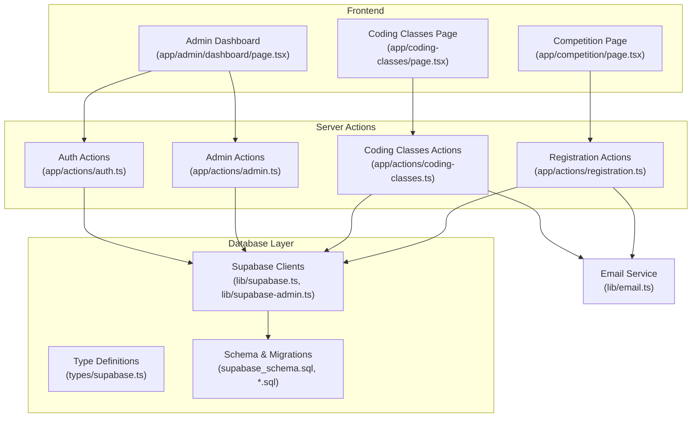
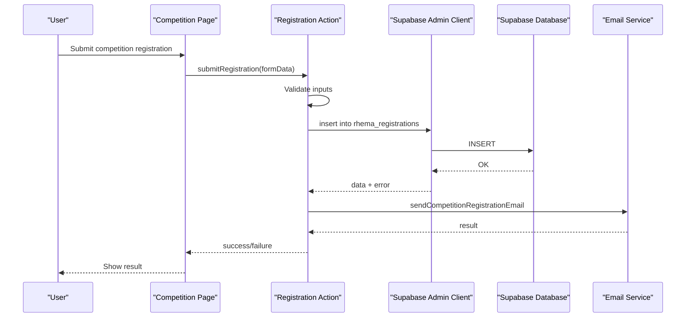
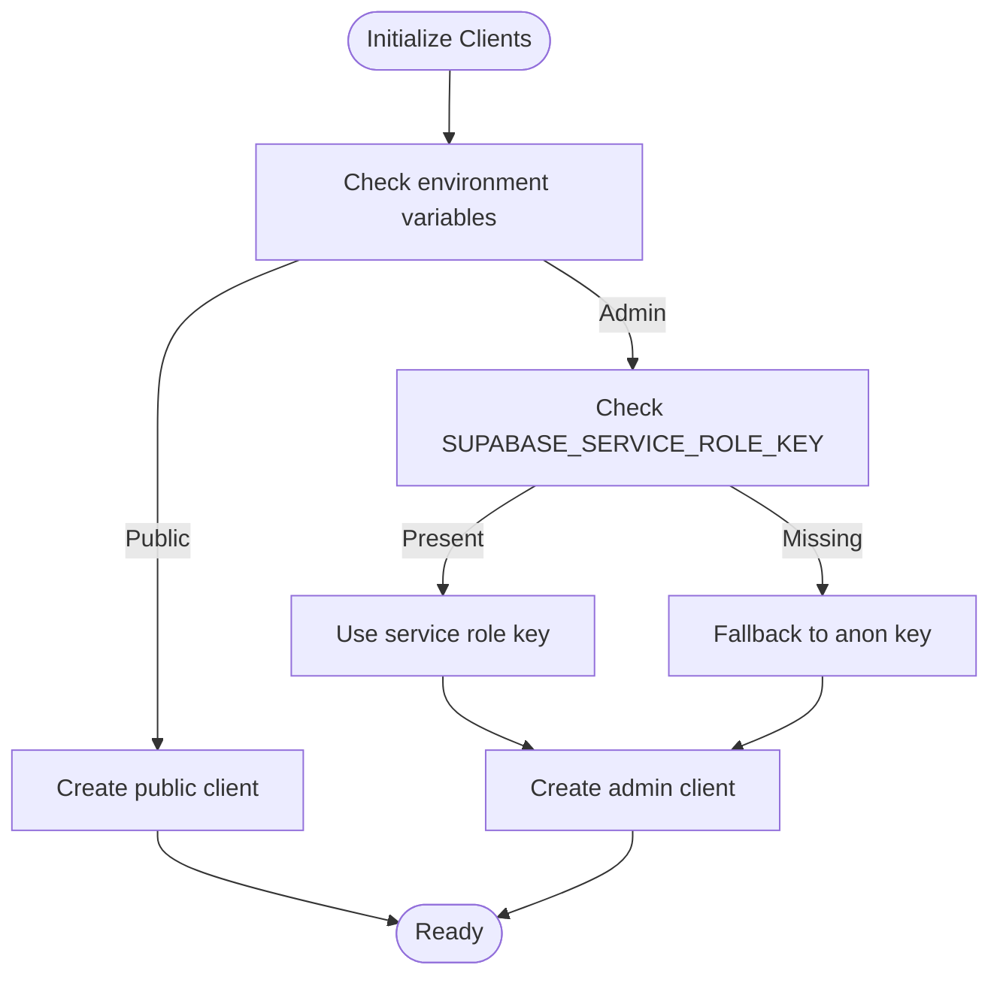
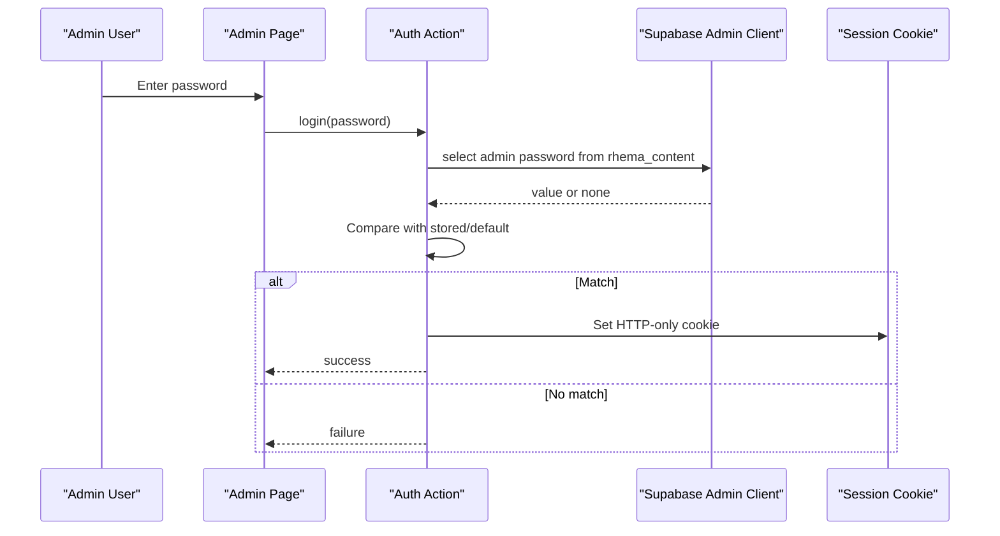
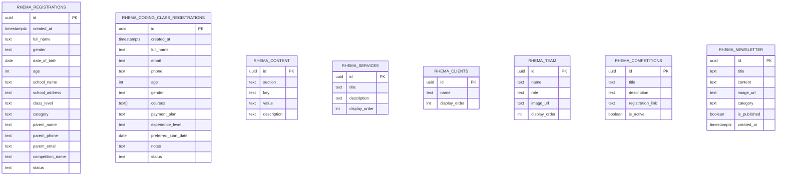
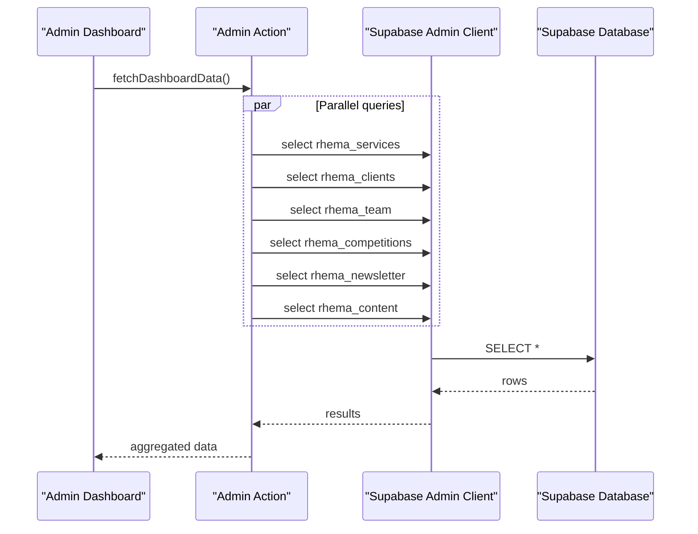
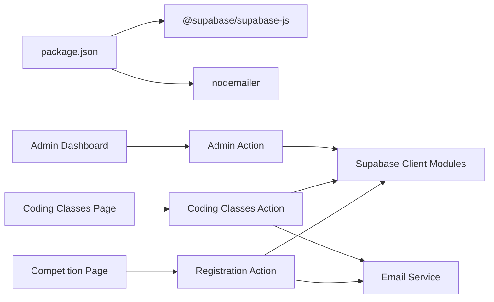

# Database Integration

<cite>
**Referenced Files in This Document**
- [supabase.ts](file://lib/supabase.ts)
- [supabase-admin.ts](file://lib/supabase-admin.ts)
- [supabase.ts](file://types/supabase.ts)
- [supabase_schema.sql](file://supabase_schema.sql)
- [supabase_migration_add_coding_classes.sql](file://supabase_migration_add_coding_classes.sql)
- [supabase_migration_add_school_phone.sql](file://supabase_migration_add_school_phone.sql)
- [registration.ts](file://app/actions/registration.ts)
- [coding-classes.ts](file://app/actions/coding-classes.ts)
- [admin.ts](file://app/actions/admin.ts)
- [auth.ts](file://app/actions/auth.ts)
- [email.ts](file://lib/email.ts)
- [page.tsx](file://app/admin/dashboard/page.tsx)
- [page.tsx](file://app/competition/page.tsx)
- [page.tsx](file://app/coding-classes/page.tsx)
- [package.json](file://package.json)
</cite>

## Table of Contents
1. [Introduction](#introduction)
2. [Project Structure](#project-structure)
3. [Core Components](#core-components)
4. [Architecture Overview](#architecture-overview)
5. [Detailed Component Analysis](#detailed-component-analysis)
6. [Dependency Analysis](#dependency-analysis)
7. [Performance Considerations](#performance-considerations)
8. [Troubleshooting Guide](#troubleshooting-guide)
9. [Conclusion](#conclusion)
10. [Appendices](#appendices)

## Introduction
This document explains how the application integrates with Supabase for database operations. It covers client initialization, authentication, schema design, migrations, type safety, data access patterns, and operational practices. The system supports:
- Public-facing registration forms for competitions and online coding classes
- Administrative dashboards for managing content, teams, competitions, newsletters, and registrations
- Secure admin authentication backed by Supabase content storage
- Automated email notifications for new registrations

## Project Structure
The database integration is centered around:
- Supabase client libraries and environment configuration
- Action modules that encapsulate server-side database operations
- Type definitions for database entities
- SQL migration scripts for schema evolution
- Frontend pages that trigger actions and render data

**Diagram sources**
- [page.tsx:1-316](file://app/competition/page.tsx#L1-L316)
- [page.tsx:1-390](file://app/coding-classes/page.tsx#L1-L390)
- [page.tsx:1-1055](file://app/admin/dashboard/page.tsx#L1-L1055)
- [registration.ts:1-131](file://app/actions/registration.ts#L1-L131)
- [coding-classes.ts:1-157](file://app/actions/coding-classes.ts#L1-L157)
- [admin.ts:1-198](file://app/actions/admin.ts#L1-L198)
- [auth.ts:1-55](file://app/actions/auth.ts#L1-L55)
- [supabase.ts:1-25](file://lib/supabase.ts#L1-L25)
- [supabase-admin.ts:1-19](file://lib/supabase-admin.ts#L1-L19)
- [supabase.ts:1-98](file://types/supabase.ts#L1-L98)
- [supabase_schema.sql:1-33](file://supabase_schema.sql#L1-L33)
- [supabase_migration_add_coding_classes.sql:1-30](file://supabase_migration_add_coding_classes.sql#L1-L30)
- [supabase_migration_add_school_phone.sql:1-4](file://supabase_migration_add_school_phone.sql#L1-L4)
- [email.ts:1-134](file://lib/email.ts#L1-L134)

**Section sources**
- [supabase.ts:1-25](file://lib/supabase.ts#L1-L25)
- [supabase-admin.ts:1-19](file://lib/supabase-admin.ts#L1-L19)
- [supabase.ts:1-98](file://types/supabase.ts#L1-L98)
- [supabase_schema.sql:1-33](file://supabase_schema.sql#L1-L33)
- [supabase_migration_add_coding_classes.sql:1-30](file://supabase_migration_add_coding_classes.sql#L1-L30)
- [supabase_migration_add_school_phone.sql:1-4](file://supabase_migration_add_school_phone.sql#L1-L4)
- [registration.ts:1-131](file://app/actions/registration.ts#L1-L131)
- [coding-classes.ts:1-157](file://app/actions/coding-classes.ts#L1-L157)
- [admin.ts:1-198](file://app/actions/admin.ts#L1-L198)
- [auth.ts:1-55](file://app/actions/auth.ts#L1-L55)
- [email.ts:1-134](file://lib/email.ts#L1-L134)
- [page.tsx:1-1055](file://app/admin/dashboard/page.tsx#L1-L1055)
- [page.tsx:1-316](file://app/competition/page.tsx#L1-L316)
- [page.tsx:1-390](file://app/coding-classes/page.tsx#L1-L390)

## Core Components
- Supabase Client Initialization
  - Public client for read/write operations where permitted by Row Level Security (RLS)
  - Admin client using a Service Role Key to bypass RLS for privileged operations
- Authentication
  - Admin password stored in Supabase content table and validated via server actions
  - Session maintained via HTTP-only cookies
- Data Access Actions
  - Encapsulate CRUD operations for registrations, coding class registrations, and admin-managed content
- Type Safety
  - TypeScript interfaces define shapes for database entities
- Email Notifications
  - Automated emails on new registrations

**Section sources**
- [supabase.ts:1-25](file://lib/supabase.ts#L1-L25)
- [supabase-admin.ts:1-19](file://lib/supabase-admin.ts#L1-L19)
- [auth.ts:1-55](file://app/actions/auth.ts#L1-L55)
- [registration.ts:1-131](file://app/actions/registration.ts#L1-L131)
- [coding-classes.ts:1-157](file://app/actions/coding-classes.ts#L1-L157)
- [admin.ts:1-198](file://app/actions/admin.ts#L1-L198)
- [supabase.ts:1-98](file://types/supabase.ts#L1-L98)
- [email.ts:1-134](file://lib/email.ts#L1-L134)

## Architecture Overview
The system follows a layered pattern:
- UI triggers actions on the server
- Actions validate inputs, enforce authorization, and call Supabase
- Supabase enforces RLS policies; admin actions use the Service Role Key to bypass RLS
- Results are returned to the UI for rendering

**Diagram sources**
- [page.tsx:1-316](file://app/competition/page.tsx#L1-L316)
- [registration.ts:1-131](file://app/actions/registration.ts#L1-L131)
- [supabase-admin.ts:1-19](file://lib/supabase-admin.ts#L1-L19)
- [email.ts:1-134](file://lib/email.ts#L1-L134)

## Detailed Component Analysis

### Supabase Client Initialization
- Public client
  - Reads NEXT_PUBLIC_SUPABASE_URL and NEXT_PUBLIC_SUPABASE_ANON_KEY
  - Provides read-mostly access constrained by RLS
- Admin client
  - Uses SUPABASE_SERVICE_ROLE_KEY when available
  - Falls back to anon key if service role key is missing (writes will fail under RLS)
  - Disables session persistence for server-side operations

**Diagram sources**
- [supabase.ts:1-25](file://lib/supabase.ts#L1-L25)
- [supabase-admin.ts:1-19](file://lib/supabase-admin.ts#L1-L19)

**Section sources**
- [supabase.ts:1-25](file://lib/supabase.ts#L1-L25)
- [supabase-admin.ts:1-19](file://lib/supabase-admin.ts#L1-L19)

### Authentication and Authorization
- Admin login retrieves the stored password from the content table
- If not present, falls back to environment variable or default and persists it
- Sets an HTTP-only cookie to maintain session
- Admin actions wrap privileged operations and revalidate auth

**Diagram sources**
- [auth.ts:1-55](file://app/actions/auth.ts#L1-L55)
- [supabase-admin.ts:1-19](file://lib/supabase-admin.ts#L1-L19)

**Section sources**
- [auth.ts:1-55](file://app/actions/auth.ts#L1-L55)
- [admin.ts:1-198](file://app/actions/admin.ts#L1-L198)

### Database Schema and Migrations
- Base schema
  - Table: rhema_registrations with UUID primary key, timestamps, personal and academic fields, and status
  - RLS enabled; public insert policy; comments note service role policy for admin reads/writes
- Coding classes extension
  - Table: rhema_coding_class_registrations with UUID primary key, arrays for courses, and status
  - RLS enabled; public insert and selective read-by-id policies
- Additional column
  - Adds school_phone to rhema_registrations

**Diagram sources**
- [supabase_schema.sql:1-33](file://supabase_schema.sql#L1-L33)
- [supabase_migration_add_coding_classes.sql:1-30](file://supabase_migration_add_coding_classes.sql#L1-L30)
- [supabase_migration_add_school_phone.sql:1-4](file://supabase_migration_add_school_phone.sql#L1-L4)

**Section sources**
- [supabase_schema.sql:1-33](file://supabase_schema.sql#L1-L33)
- [supabase_migration_add_coding_classes.sql:1-30](file://supabase_migration_add_coding_classes.sql#L1-L30)
- [supabase_migration_add_school_phone.sql:1-4](file://supabase_migration_add_school_phone.sql#L1-L4)

### Type Definitions and Interfaces
- TypeScript interfaces model database entities for compile-time safety
- Includes content, services, clients, team, competitions, newsletter, registrations, and coding class registrations

**Section sources**
- [supabase.ts:1-98](file://types/supabase.ts#L1-L98)

### Data Access Patterns and Queries
- Registration actions
  - Insert new competition registrations and return inserted data
  - Fetch all registrations ordered by creation time
  - Update and delete registrations
- Coding class actions
  - Insert new coding class registrations
  - Fetch and update statuses with admin authentication checks
  - Delete registrations after auth verification
- Admin actions
  - CRUD for services, clients, team, competitions, newsletter, and general settings
  - Parallel fetches for dashboard data
  - Toggle competition activity flag

**Diagram sources**
- [admin.ts:1-198](file://app/actions/admin.ts#L1-L198)
- [supabase-admin.ts:1-19](file://lib/supabase-admin.ts#L1-L19)

**Section sources**
- [registration.ts:1-131](file://app/actions/registration.ts#L1-L131)
- [coding-classes.ts:1-157](file://app/actions/coding-classes.ts#L1-L157)
- [admin.ts:1-198](file://app/actions/admin.ts#L1-L198)

### Frontend Integration Examples
- Competition registration page
  - Collects form data and invokes submitRegistration
  - Displays success/error messages
- Coding classes registration page
  - Handles course selection, payment plan, and experience level
  - Submits via submitCodingClassRegistration
- Admin dashboard
  - Loads dashboard data and manages registrations
  - Edits and deletes items with confirmation dialogs

**Section sources**
- [page.tsx:1-316](file://app/competition/page.tsx#L1-L316)
- [page.tsx:1-390](file://app/coding-classes/page.tsx#L1-L390)
- [page.tsx:1-1055](file://app/admin/dashboard/page.tsx#L1-L1055)

## Dependency Analysis
- Runtime dependencies include @supabase/supabase-js and nodemailer
- Supabase client libraries are initialized in dedicated modules
- Actions depend on Supabase clients and email service
- Frontend pages depend on actions for data mutations and queries

**Diagram sources**
- [package.json:1-32](file://package.json#L1-L32)
- [supabase.ts:1-25](file://lib/supabase.ts#L1-L25)
- [supabase-admin.ts:1-19](file://lib/supabase-admin.ts#L1-L19)
- [registration.ts:1-131](file://app/actions/registration.ts#L1-L131)
- [coding-classes.ts:1-157](file://app/actions/coding-classes.ts#L1-L157)
- [admin.ts:1-198](file://app/actions/admin.ts#L1-L198)
- [email.ts:1-134](file://lib/email.ts#L1-L134)

**Section sources**
- [package.json:1-32](file://package.json#L1-L32)

## Performance Considerations
- Indexing strategies
  - Consider adding indexes on frequently filtered columns such as created_at, status, and category
  - Composite indexes for common query patterns (e.g., status + created_at)
- Query optimization
  - Use targeted selects (e.g., select only required columns) to reduce payload size
  - Paginate large lists in admin views to limit response sizes
- Caching
  - Revalidation via Next.js cache invalidation is used after admin edits
- Network efficiency
  - Batch operations where feasible (e.g., parallel fetches in dashboard)
- RLS overhead
  - Admin operations bypass RLS via service role key; public operations rely on RLS policies

[No sources needed since this section provides general guidance]

## Troubleshooting Guide
- Missing environment variables
  - If NEXT_PUBLIC_SUPABASE_URL or NEXT_PUBLIC_SUPABASE_ANON_KEY are missing, the public client logs a warning
  - If SUPABASE_SERVICE_ROLE_KEY is missing, admin write operations may fail under RLS
- Authentication failures
  - Verify admin password exists in rhema_content or environment variables
  - Confirm HTTP-only cookie is set and not expired
- Email notifications
  - Ensure SMTP_USER and SMTP_PASS are configured; otherwise, email notifications are disabled
- Database errors
  - Inspect action error handling for specific messages
  - Check RLS policies if public inserts or admin updates unexpectedly fail

**Section sources**
- [supabase.ts:1-25](file://lib/supabase.ts#L1-L25)
- [supabase-admin.ts:1-19](file://lib/supabase-admin.ts#L1-L19)
- [auth.ts:1-55](file://app/actions/auth.ts#L1-L55)
- [email.ts:1-134](file://lib/email.ts#L1-L134)

## Conclusion
The application leverages Supabase for robust, secure, and scalable data operations. Supabase clients are configured for both public and admin contexts, with RLS policies governing access. TypeScript interfaces provide strong typing, while server actions encapsulate business logic and error handling. The admin dashboard enables efficient content and registration management, and email notifications streamline communication workflows.

[No sources needed since this section summarizes without analyzing specific files]

## Appendices

### Practical Operation Examples
- Submit a competition registration
  - Triggered by the competition page form
  - Action inserts into rhema_registrations and sends an email notification
- Manage coding class registrations
  - Admin toggles status via dropdown; action updates status and revalidates cache
- Admin login and dashboard
  - Login compares against stored admin password; sets session cookie
  - Dashboard loads multiple datasets concurrently and supports CRUD operations

**Section sources**
- [page.tsx:1-316](file://app/competition/page.tsx#L1-L316)
- [page.tsx:1-390](file://app/coding-classes/page.tsx#L1-L390)
- [page.tsx:1-1055](file://app/admin/dashboard/page.tsx#L1-L1055)
- [registration.ts:1-131](file://app/actions/registration.ts#L1-L131)
- [coding-classes.ts:1-157](file://app/actions/coding-classes.ts#L1-L157)
- [admin.ts:1-198](file://app/actions/admin.ts#L1-L198)
- [auth.ts:1-55](file://app/actions/auth.ts#L1-L55)