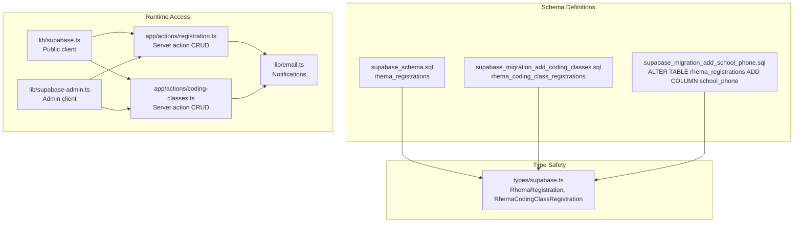
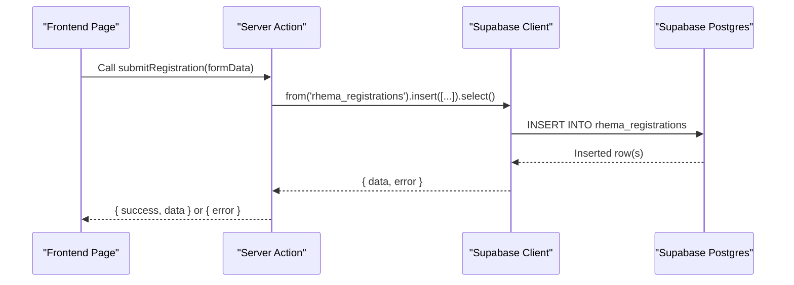
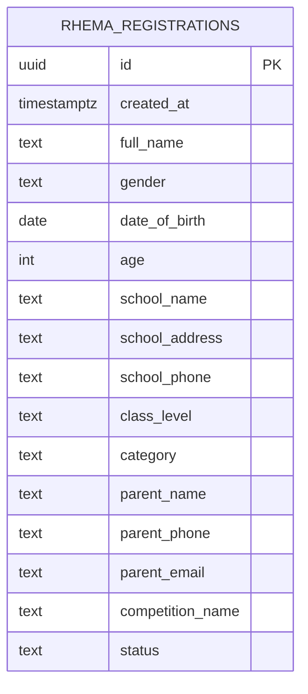
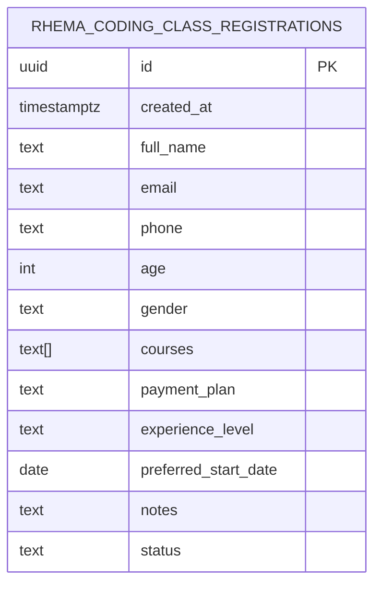
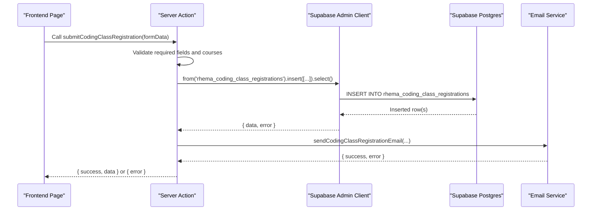
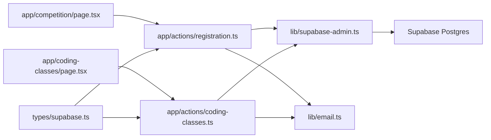

# Database Schema

<cite>
**Referenced Files in This Document**
- [supabase_schema.sql](file://supabase_schema.sql)
- [supabase_migration_add_coding_classes.sql](file://supabase_migration_add_coding_classes.sql)
- [supabase_migration_add_school_phone.sql](file://supabase_migration_add_school_phone.sql)
- [types/supabase.ts](file://types/supabase.ts)
- [lib/supabase.ts](file://lib/supabase.ts)
- [lib/supabase-admin.ts](file://lib/supabase-admin.ts)
- [app/actions/registration.ts](file://app/actions/registration.ts)
- [app/actions/coding-classes.ts](file://app/actions/coding-classes.ts)
- [lib/email.ts](file://lib/email.ts)
- [app/competition/page.tsx](file://app/competition/page.tsx)
- [app/coding-classes/page.tsx](file://app/coding-classes/page.tsx)
</cite>

## Table of Contents
1. [Introduction](#introduction)
2. [Project Structure](#project-structure)
3. [Core Components](#core-components)
4. [Architecture Overview](#architecture-overview)
5. [Detailed Component Analysis](#detailed-component-analysis)
6. [Dependency Analysis](#dependency-analysis)
7. [Performance Considerations](#performance-considerations)
8. [Troubleshooting Guide](#troubleshooting-guide)
9. [Conclusion](#conclusion)

## Introduction
This document describes the database schema design for Rhema Expert Solutions, focusing on the competition registration and online coding class registration tables. It documents table structures, data types, defaults, constraints, and Row Level Security (RLS) policies. It also explains the migration files that define and evolve the schema, and how the frontend and backend interact with the database via Supabase clients and server actions.

## Project Structure
The schema is defined and evolved through SQL migration files and consumed by TypeScript interfaces and Next.js server actions. The Supabase client configuration supports both public and admin access modes.

**Diagram sources**
- [supabase_schema.sql:1-33](file://supabase_schema.sql#L1-L33)
- [supabase_migration_add_coding_classes.sql:1-30](file://supabase_migration_add_coding_classes.sql#L1-L30)
- [supabase_migration_add_school_phone.sql:1-4](file://supabase_migration_add_school_phone.sql#L1-L4)
- [types/supabase.ts:56-97](file://types/supabase.ts#L56-L97)
- [lib/supabase.ts:1-25](file://lib/supabase.ts#L1-L25)
- [lib/supabase-admin.ts:1-19](file://lib/supabase-admin.ts#L1-L19)
- [app/actions/registration.ts:22-84](file://app/actions/registration.ts#L22-L84)
- [app/actions/coding-classes.ts:20-76](file://app/actions/coding-classes.ts#L20-L76)
- [lib/email.ts:46-86](file://lib/email.ts#L46-L86)

**Section sources**
- [supabase_schema.sql:1-33](file://supabase_schema.sql#L1-L33)
- [supabase_migration_add_coding_classes.sql:1-30](file://supabase_migration_add_coding_classes.sql#L1-L30)
- [supabase_migration_add_school_phone.sql:1-4](file://supabase_migration_add_school_phone.sql#L1-L4)
- [types/supabase.ts:56-97](file://types/supabase.ts#L56-L97)
- [lib/supabase.ts:1-25](file://lib/supabase.ts#L1-L25)
- [lib/supabase-admin.ts:1-19](file://lib/supabase-admin.ts#L1-L19)

## Core Components
- rhema_registrations: Stores competition registration records with school and parent/guardian contact details, plus optional school phone.
- rhema_coding_class_registrations: Stores online coding class registration records with course selections, payment plan, and status.
- Types: TypeScript interfaces mirror the schema for compile-time safety and IDE support.
- Clients: Public client for read/write via RLS; Admin client for bypassing RLS using a service role key.
- Actions: Server actions encapsulate inserts, updates, and deletes for both registration tables.

**Section sources**
- [supabase_schema.sql:1-33](file://supabase_schema.sql#L1-L33)
- [supabase_migration_add_coding_classes.sql:1-30](file://supabase_migration_add_coding_classes.sql#L1-L30)
- [types/supabase.ts:56-97](file://types/supabase.ts#L56-L97)
- [lib/supabase.ts:1-25](file://lib/supabase.ts#L1-L25)
- [lib/supabase-admin.ts:1-19](file://lib/supabase-admin.ts#L1-L19)
- [app/actions/registration.ts:22-84](file://app/actions/registration.ts#L22-L84)
- [app/actions/coding-classes.ts:20-76](file://app/actions/coding-classes.ts#L20-L76)

## Architecture Overview
The system uses Supabase as the database and authentication provider. Two clients are used:
- Public client (NEXT_PUBLIC_SUPABASE_URL + NEXT_PUBLIC_SUPABASE_ANON_KEY): Used by frontend for read/write operations governed by RLS policies.
- Admin client (NEXT_PUBLIC_SUPABASE_URL + SUPABASE_SERVICE_ROLE_KEY): Used by server actions to bypass RLS for administrative tasks.

**Diagram sources**
- [app/competition/page.tsx:32-64](file://app/competition/page.tsx#L32-L64)
- [app/actions/registration.ts:22-84](file://app/actions/registration.ts#L22-L84)
- [lib/supabase.ts:16-19](file://lib/supabase.ts#L16-L19)

## Detailed Component Analysis

### Table: rhema_registrations
- Purpose: Capture competition registration entries with student, school, and parent/guardian details.
- Primary key: id (UUID, default gen_random_uuid)
- Timestamps: created_at (timestamptz, default now())
- Required fields: full_name, gender, age, school_name, class_level, category, parent_name, parent_phone
- Optional fields: date_of_birth, school_address, school_phone, parent_email, competition_name (default), status (default)
- RLS: Enabled; public insert policy; admin access via service role key
- Indexes/constraints: Primary key index; no explicit indexes defined in migration

Data types and defaults
- id: UUID, default gen_random_uuid(), PK
- created_at: timestamptz, default now()
- full_name: text, not null
- gender: text, not null
- date_of_birth: date
- age: int, not null
- school_name: text, not null
- school_address: text
- school_phone: text
- class_level: text, not null
- category: text, not null
- parent_name: text, not null
- parent_phone: text, not null
- parent_email: text
- competition_name: text, default
- status: text, default

Constraints and validation
- Not-null constraints enforced at insert
- Default values applied for timestamps and enumerations
- RLS policies restrict reads/writes based on roles

**Diagram sources**
- [supabase_schema.sql:2-18](file://supabase_schema.sql#L2-L18)
- [types/supabase.ts:56-73](file://types/supabase.ts#L56-L73)

**Section sources**
- [supabase_schema.sql:1-33](file://supabase_schema.sql#L1-L33)
- [supabase_migration_add_school_phone.sql:1-4](file://supabase_migration_add_school_phone.sql#L1-L4)
- [types/supabase.ts:56-73](file://types/supabase.ts#L56-L73)

### Table: rhema_coding_class_registrations
- Purpose: Capture online coding class registration entries with course preferences, payment plan, and status.
- Primary key: id (UUID, default gen_random_uuid)
- Timestamps: created_at (timestamptz, default now())
- Required fields: full_name, phone, courses (array), payment_plan
- Optional fields: email, age, gender, experience_level (default), preferred_start_date, notes
- RLS: Enabled; public insert and select by id policies; admin access via service role key

Data types and defaults
- id: UUID, default gen_random_uuid(), PK
- created_at: timestamptz, default now()
- full_name: text, not null
- email: text
- phone: text, not null
- age: int
- gender: text
- courses: text[], not null, default empty array
- payment_plan: text, not null
- experience_level: text, default "beginner"
- preferred_start_date: date
- notes: text
- status: text, default "pending"

Constraints and validation
- Not-null constraints enforced at insert
- Default values applied for arrays and enumerations
- RLS policies restrict reads/writes based on roles

**Diagram sources**
- [supabase_migration_add_coding_classes.sql:2-16](file://supabase_migration_add_coding_classes.sql#L2-L16)
- [types/supabase.ts:83-97](file://types/supabase.ts#L83-L97)

**Section sources**
- [supabase_migration_add_coding_classes.sql:1-30](file://supabase_migration_add_coding_classes.sql#L1-L30)
- [types/supabase.ts:83-97](file://types/supabase.ts#L83-L97)

### Type Mappings
TypeScript interfaces mirror the schema for runtime safety and autocomplete.

- RhemaRegistration: Maps to rhema_registrations
- RhemaCodingClassRegistration: Maps to rhema_coding_class_registrations

**Section sources**
- [types/supabase.ts:56-97](file://types/supabase.ts#L56-L97)

### Client Configuration
- Public client: Uses NEXT_PUBLIC_SUPABASE_URL and NEXT_PUBLIC_SUPABASE_ANON_KEY; suitable for frontend operations under RLS.
- Admin client: Uses NEXT_PUBLIC_SUPABASE_URL and SUPABASE_SERVICE_ROLE_KEY; bypasses RLS for server actions.

**Section sources**
- [lib/supabase.ts:1-25](file://lib/supabase.ts#L1-L25)
- [lib/supabase-admin.ts:1-19](file://lib/supabase-admin.ts#L1-L19)

### Server Actions and Data Access Patterns
- Competition registration:
  - Validation of required fields
  - Insert into rhema_registrations
  - Optional email notification to administrators
- Coding class registration:
  - Validation of required fields and course selection
  - Insert into rhema_coding_class_registrations
  - Optional email notification to administrators

**Diagram sources**
- [app/coding-classes/page.tsx:56-86](file://app/coding-classes/page.tsx#L56-L86)
- [app/actions/coding-classes.ts:20-76](file://app/actions/coding-classes.ts#L20-L76)
- [lib/email.ts:88-133](file://lib/email.ts#L88-L133)

**Section sources**
- [app/actions/registration.ts:22-84](file://app/actions/registration.ts#L22-L84)
- [app/actions/coding-classes.ts:20-76](file://app/actions/coding-classes.ts#L20-L76)
- [lib/email.ts:46-86](file://lib/email.ts#L46-L86)

## Dependency Analysis
- Frontend pages depend on server actions for data mutations.
- Server actions depend on Supabase admin client for database operations.
- Email notifications are triggered after successful inserts.
- Type interfaces ensure consistent field names and types across the stack.

**Diagram sources**
- [app/competition/page.tsx:32-64](file://app/competition/page.tsx#L32-L64)
- [app/coding-classes/page.tsx:56-86](file://app/coding-classes/page.tsx#L56-L86)
- [app/actions/registration.ts:22-84](file://app/actions/registration.ts#L22-L84)
- [app/actions/coding-classes.ts:20-76](file://app/actions/coding-classes.ts#L20-L76)
- [lib/supabase-admin.ts:1-19](file://lib/supabase-admin.ts#L1-L19)
- [lib/email.ts:46-86](file://lib/email.ts#L46-L86)
- [types/supabase.ts:56-97](file://types/supabase.ts#L56-L97)

**Section sources**
- [app/competition/page.tsx:32-64](file://app/competition/page.tsx#L32-L64)
- [app/coding-classes/page.tsx:56-86](file://app/coding-classes/page.tsx#L56-L86)
- [app/actions/registration.ts:22-84](file://app/actions/registration.ts#L22-L84)
- [app/actions/coding-classes.ts:20-76](file://app/actions/coding-classes.ts#L20-L76)
- [lib/supabase-admin.ts:1-19](file://lib/supabase-admin.ts#L1-L19)
- [lib/email.ts:46-86](file://lib/email.ts#L46-L86)
- [types/supabase.ts:56-97](file://types/supabase.ts#L56-L97)

## Performance Considerations
- Indexes: No explicit indexes are defined in the migrations. Consider adding indexes on frequently filtered/sorted columns:
  - rhema_registrations: status, created_at, school_name, class_level, category
  - rhema_coding_class_registrations: status, created_at, payment_plan, experience_level
- RLS overhead: RLS adds minimal overhead; ensure policies remain simple to avoid query slowdowns.
- Data volume: For high-volume inserts, batch operations where feasible and monitor replication lag.
- Network latency: Server actions reduce client-side logic and minimize repeated round-trips.

[No sources needed since this section provides general guidance]

## Troubleshooting Guide
Common issues and resolutions:
- Missing environment variables:
  - NEXT_PUBLIC_SUPABASE_URL or NEXT_PUBLIC_SUPABASE_ANON_KEY: Public client initialization logs a warning; dynamic content may not load.
  - SUPABASE_SERVICE_ROLE_KEY: Admin client warns if missing; write operations may fail if RLS is enabled.
- Authentication failures:
  - Admin dashboard requires a valid admin password stored in rhema_content; if not found, the system creates a default password and stores it.
- RLS policy errors:
  - Public client cannot bypass policies; use admin client for server-side operations requiring admin privileges.
- Email notifications:
  - SMTP_USER or SMTP_PASS missing disables email notifications; verify environment variables and transport configuration.

**Section sources**
- [lib/supabase.ts:10-13](file://lib/supabase.ts#L10-L13)
- [lib/supabase-admin.ts:7-9](file://lib/supabase-admin.ts#L7-L9)
- [app/actions/auth.ts:8-29](file://app/actions/auth.ts#L8-L29)
- [lib/email.ts:24-27](file://lib/email.ts#L24-L27)

## Conclusion
The database schema for Rhema Expert Solutions consists of two focused tables supporting competition and coding class registrations. The design emphasizes simplicity, clear defaults, and RLS for controlled access. Migrations define the evolving schema, while server actions and typed interfaces ensure robust, type-safe data access. For production, consider adding targeted indexes and monitoring RLS performance as data grows.