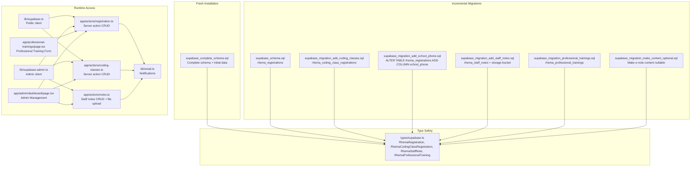
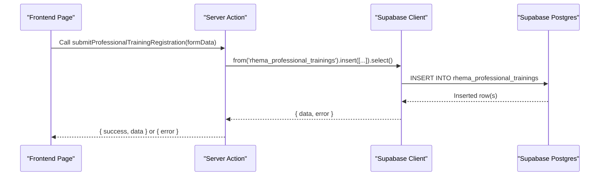
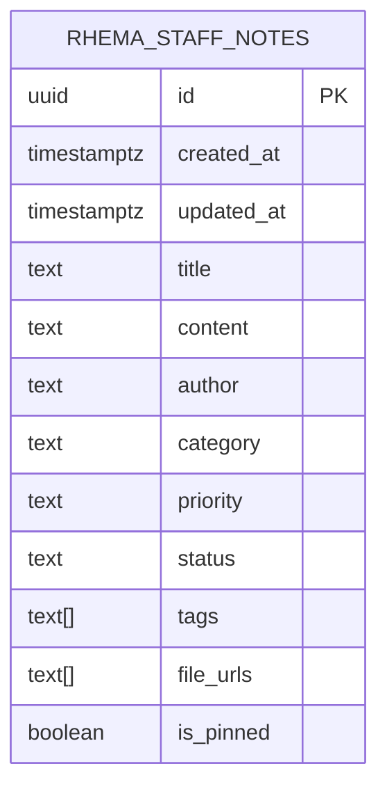
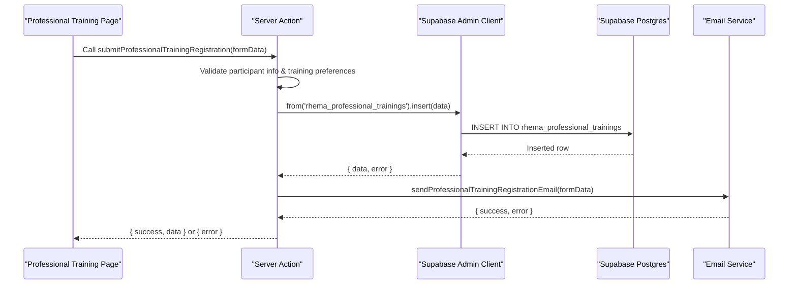
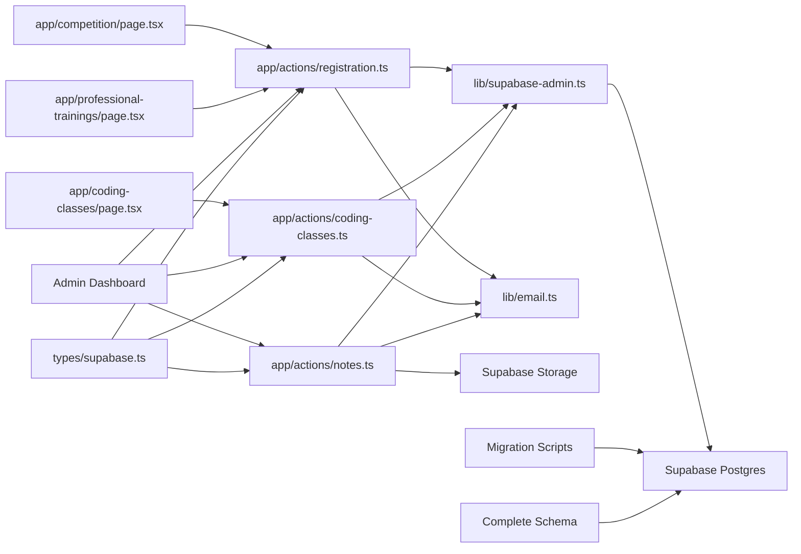

# Database Schema

<cite>
**Referenced Files in This Document**
- [supabase_complete_schema.sql](file://supabase_complete_schema.sql)
- [supabase_schema.sql](file://supabase_schema.sql)
- [supabase_migration_add_coding_classes.sql](file://supabase_migration_add_coding_classes.sql)
- [supabase_migration_add_school_phone.sql](file://supabase_migration_add_school_phone.sql)
- [supabase_migration_add_staff_notes.sql](file://supabase_migration_add_staff_notes.sql)
- [supabase_migration_make_content_optional.sql](file://supabase_migration_make_content_optional.sql)
- [supabase_migration_professional_trainings.sql](file://supabase_migration_professional_trainings.sql)
- [types/supabase.ts](file://types/supabase.ts)
- [lib/supabase.ts](file://lib/supabase.ts)
- [lib/supabase-admin.ts](file://lib/supabase-admin.ts)
- [app/actions/registration.ts](file://app/actions/registration.ts)
- [app/actions/coding-classes.ts](file://app/actions/coding-classes.ts)
- [app/actions/notes.ts](file://app/actions/notes.ts)
- [lib/email.ts](file://lib/email.ts)
- [app/competition/page.tsx](file://app/competition/page.tsx)
- [app/coding-classes/page.tsx](file://app/coding-classes/page.tsx)
- [app/professional-trainings/page.tsx](file://app/professional-trainings/page.tsx)
- [app/admin/dashboard/page.tsx](file://app/admin/dashboard/page.tsx)
</cite>

## Update Summary
**Changes Made**
- Added comprehensive database schema file (`supabase_complete_schema.sql`) for fresh installations providing complete table definitions and initial data setup
- Added migration script (`supabase_migration_make_content_optional.sql`) for making e-note content fields nullable to support flexible note creation workflows
- Updated installation procedures to include both fresh installation and migration-based upgrade paths
- Enhanced documentation for schema evolution strategies and deployment options

## Table of Contents
1. [Introduction](#introduction)
2. [Project Structure](#project-structure)
3. [Core Components](#core-components)
4. [Architecture Overview](#architecture-overview)
5. [Detailed Component Analysis](#detailed-component-analysis)
6. [Schema Evolution and Migration Strategy](#schema-evolution-and-migration-strategy)
7. [Dependency Analysis](#dependency-analysis)
8. [Performance Considerations](#performance-considerations)
9. [Troubleshooting Guide](#troubleshooting-guide)
10. [Conclusion](#conclusion)

## Introduction
This document describes the database schema design for Rhema Expert Solutions, focusing on competition registration, online coding class registration, professional training registration, and staff e-note management tables. It documents table structures, data types, defaults, constraints, and Row Level Security (RLS) policies. The system now provides two deployment approaches: a comprehensive schema file for fresh installations and incremental migration scripts for existing deployments. It also explains how the frontend and backend interact with the database via Supabase clients and server actions.

## Project Structure
The schema is defined through multiple SQL files supporting different deployment scenarios. A comprehensive schema file enables quick fresh installations, while individual migration files support incremental upgrades. TypeScript interfaces ensure type safety across the application stack.

**Diagram sources**
- [supabase_complete_schema.sql](file://supabase_complete_schema.sql)
- [supabase_schema.sql](file://supabase_schema.sql)
- [supabase_migration_add_coding_classes.sql](file://supabase_migration_add_coding_classes.sql)
- [supabase_migration_add_school_phone.sql](file://supabase_migration_add_school_phone.sql)
- [supabase_migration_add_staff_notes.sql](file://supabase_migration_add_staff_notes.sql)
- [supabase_migration_make_content_optional.sql](file://supabase_migration_make_content_optional.sql)
- [supabase_migration_professional_trainings.sql](file://supabase_migration_professional_trainings.sql)
- [types/supabase.ts](file://types/supabase.ts)
- [lib/supabase.ts](file://lib/supabase.ts)
- [lib/supabase-admin.ts](file://lib/supabase-admin.ts)
- [app/actions/registration.ts](file://app/actions/registration.ts)
- [app/actions/coding-classes.ts](file://app/actions/coding-classes.ts)
- [app/actions/notes.ts](file://app/actions/notes.ts)
- [lib/email.ts](file://lib/email.ts)
- [app/professional-trainings/page.tsx](file://app/professional-trainings/page.tsx)
- [app/admin/dashboard/page.tsx](file://app/admin/dashboard/page.tsx)

## Core Components
- **Comprehensive Schema**: Complete database definition for fresh installations including all tables, indexes, RLS policies, and initial data
- **Incremental Migrations**: Individual migration scripts for upgrading existing deployments without data loss
- **Flexible E-Notes**: Staff e-notes system with optional content fields supporting various note creation patterns
- **Registration Systems**: Competition, coding class, and professional training registration with comprehensive participant information
- **Type Safety**: TypeScript interfaces mirroring schema for compile-time safety and IDE support
- **Client Architecture**: Public client for read/write via RLS; Admin client for bypassing RLS using service role key
- **Server Actions**: Encapsulated inserts, updates, and deletes for all registration and note tables

## Architecture Overview
The system uses Supabase as the database and authentication provider with dual deployment strategies. Fresh installations use the comprehensive schema file, while existing deployments apply incremental migrations. Two clients are used:
- Public client (NEXT_PUBLIC_SUPABASE_URL + NEXT_PUBLIC_SUPABASE_ANON_KEY): Used by frontend for read/write operations governed by RLS policies.
- Admin client (NEXT_PUBLIC_SUPABASE_URL + SUPABASE_SERVICE_ROLE_KEY): Used by server actions to bypass RLS for administrative tasks.

**Diagram sources**
- [app/professional-trainings/page.tsx](file://app/professional-trainings/page.tsx)
- [app/actions/registration.ts](file://app/actions/registration.ts)
- [lib/supabase.ts](file://lib/supabase.ts)

## Detailed Component Analysis

### Comprehensive Schema File
The `supabase_complete_schema.sql` file provides a complete database definition for fresh installations, including:
- All table definitions with proper data types and constraints
- Indexes for optimal query performance
- Row Level Security (RLS) policies for access control
- Initial seed data where applicable
- Storage bucket configurations for file attachments

This approach ensures consistent database setup across different environments and simplifies development and testing workflows.

### Flexible E-Notes System
The e-notes system has been enhanced to support flexible note creation patterns through nullable content fields:

**Updated** The `rhema_staff_notes` table now supports optional content fields, allowing staff to create notes with minimal information initially and add details later.

Key features:
- Optional content field supporting partial note creation
- Title-only notes for quick announcements
- Full notes with detailed content for comprehensive documentation
- Integration with Supabase Storage for file attachments
- Pinned notes prioritized in query results
- Category and priority-based filtering

Data types and defaults
- id: UUID, default gen_random_uuid(), PK
- created_at: timestamptz, default now()
- updated_at: timestamptz, default now()
- title: text, not null
- content: text (nullable - allows empty notes)
- author: text, not null
- category: text, default 'general' (general, student, admin, urgent, announcement)
- priority: text, default 'normal' (low, normal, high, urgent)
- status: text, default 'active' (active, archived)
- tags: text[], default '{}'
- file_urls: text[], default '{}'
- is_pinned: boolean, default false

Indexes and performance optimization
- idx_staff_notes_created_at: Optimizes time-based queries and sorting
- idx_staff_notes_status: Optimizes filtering by status
- idx_staff_notes_category: Optimizes category-based filtering
- idx_staff_notes_priority: Optimizes priority-based filtering

Storage integration
- Dedicated storage bucket 'staff-notes' for e-note attachments
- Public read access for uploaded files
- Authenticated write access for file uploads

**Diagram sources**
- [supabase_migration_add_staff_notes.sql](file://supabase_migration_add_staff_notes.sql)
- [supabase_migration_make_content_optional.sql](file://supabase_migration_make_content_optional.sql)
- [types/supabase.ts](file://types/supabase.ts)

### Registration Tables
The system includes three main registration tables:

#### rhema_registrations
- Purpose: Capture competition registration entries with student, school, and parent/guardian details
- Primary key: id (UUID, default gen_random_uuid)
- Timestamps: created_at (timestamptz, default now())
- Required fields: full_name, gender, age, school_name, class_level, category, parent_name, parent_phone
- Optional fields: date_of_birth, school_address, school_phone, parent_email, competition_name (default), status (default)

#### rhema_coding_class_registrations
- Purpose: Capture online coding class registration entries with course preferences, payment plan, and status
- Primary key: id (UUID, default gen_random_uuid)
- Timestamps: created_at (timestamptz, default now())
- Required fields: full_name, phone, courses (array), payment_plan
- Optional fields: email, age, gender, experience_level (default), preferred_start_date, notes

#### rhema_professional_trainings
- Purpose: Capture professional training registration entries with comprehensive participant details, program preferences, and enrollment status
- Primary key: id (UUID, default gen_random_uuid)
- Timestamps: created_at, updated_at (both timestamptz, default now())
- Required fields: full_name, email, phone, gender, training_program, preferred_schedule, experience_level, payment_preference
- Optional fields: date_of_birth, organization, job_title, additional_info, status (default 'pending')

### Type Mappings
TypeScript interfaces mirror the schema for runtime safety and autocomplete:
- RhemaRegistration: Maps to rhema_registrations
- RhemaCodingClassRegistration: Maps to rhema_coding_class_registrations
- RhemaStaffNote: Maps to rhema_staff_notes with enhanced file URL support
- RhemaProfessionalTraining: Maps to rhema_professional_trainings with comprehensive participant information

### Client Configuration
- Public client: Uses NEXT_PUBLIC_SUPABASE_URL and NEXT_PUBLIC_SUPABASE_ANON_KEY; suitable for frontend operations under RLS
- Admin client: Uses NEXT_PUBLIC_SUPABASE_URL and SUPABASE_SERVICE_ROLE_KEY; bypasses RLS for server actions

### Server Actions and Data Access Patterns
- Competition registration: Validation of required fields, insert into rhema_registrations, optional email notification
- Coding class registration: Validation of required fields and course selection, insert into rhema_coding_class_registrations, optional email notification
- Professional training registration: Comprehensive validation of participant information and training preferences, insert into rhema_professional_trainings with status tracking, email notification with detailed participant information
- Staff notes management: Authentication check before any operation, CRUD operations with pagination and search capabilities, file upload/download with dedicated storage bucket, email notifications for new e-notes, pinned notes prioritized in query results

**Diagram sources**
- [app/professional-trainings/page.tsx](file://app/professional-trainings/page.tsx)
- [app/actions/registration.ts](file://app/actions/registration.ts)
- [lib/email.ts](file://lib/email.ts)

## Schema Evolution and Migration Strategy

### Deployment Approaches
The system supports two primary deployment strategies:

#### Fresh Installation Approach
For new deployments, use the comprehensive schema file which provides:
- Complete table definitions with all constraints and indexes
- Initial seed data and configuration
- Pre-configured RLS policies
- Storage bucket setup
- Consistent environment setup across development, staging, and production

#### Incremental Migration Approach
For existing deployments, apply migration scripts in order:
1. Base schema migrations (registrations, coding classes)
2. Feature additions (school phone, staff notes, professional trainings)
3. Content flexibility updates (nullable content fields)
4. Performance optimizations (indexes, constraints)

### Migration Script: Make Content Optional
The `supabase_migration_make_content_optional.sql` script enhances the e-notes system by making content fields nullable:

Purpose: Allow staff to create notes with minimal information initially and add details later

Key changes:
- Makes content field nullable in rhema_staff_notes table
- Supports title-only notes for quick announcements
- Enables progressive note creation workflow
- Maintains backward compatibility with existing notes

Benefits:
- Improved user experience for quick note creation
- Reduced friction in daily communication workflows
- Support for various note types (announcements, reminders, detailed documentation)
- Enhanced flexibility in information sharing patterns

### Schema Versioning Strategy
- Each migration script represents a discrete change to the database schema
- Scripts are designed to be idempotent where possible
- Backward compatibility is maintained during transitions
- Rollback procedures are documented for each migration

## Dependency Analysis
- Frontend pages depend on server actions for data mutations
- Server actions depend on Supabase admin client for database operations
- Email notifications are triggered after successful inserts
- Type interfaces ensure consistent field names and types across the stack
- Staff notes system integrates with Supabase Storage for file attachments
- Professional training system includes comprehensive admin dashboard integration for management and reporting
- Migration scripts maintain dependency ordering for safe schema evolution

**Diagram sources**
- [app/competition/page.tsx](file://app/competition/page.tsx)
- [app/coding-classes/page.tsx](file://app/coding-classes/page.tsx)
- [app/professional-trainings/page.tsx](file://app/professional-trainings/page.tsx)
- [app/actions/registration.ts](file://app/actions/registration.ts)
- [app/actions/coding-classes.ts](file://app/actions/coding-classes.ts)
- [app/actions/notes.ts](file://app/actions/notes.ts)
- [lib/supabase-admin.ts](file://lib/supabase-admin.ts)
- [lib/email.ts](file://lib/email.ts)
- [types/supabase.ts](file://types/supabase.ts)

## Performance Considerations
- **Indexes**: Strategic indexing implemented across all tables for optimal query performance:
  - rhema_registrations: No explicit indexes (simple queries)
  - rhema_coding_class_registrations: No explicit indexes (simple queries)
  - rhema_staff_notes: Created indexes on created_at, status, category, and priority for efficient filtering and sorting
  - rhema_professional_trainings: Created indexes on created_at, status, training_program, and email for comprehensive query optimization
- **RLS overhead**: RLS adds minimal overhead; ensure policies remain simple to avoid query slowdowns
- **Data volume**: For high-volume inserts, batch operations where feasible and monitor replication lag
- **Network latency**: Server actions reduce client-side logic and minimize repeated round-trips
- **Storage optimization**: Staff notes use dedicated storage bucket with appropriate access policies
- **Professional training optimization**: Email lookups and program-based queries are optimized through dedicated indexes for better admin dashboard performance
- **Nullable fields**: Optional content fields improve query performance by reducing constraint checking overhead

## Troubleshooting Guide
Common issues and resolutions:
- Missing environment variables:
  - NEXT_PUBLIC_SUPABASE_URL or NEXT_PUBLIC_SUPABASE_ANON_KEY: Public client initialization logs a warning; dynamic content may not load
  - SUPABASE_SERVICE_ROLE_KEY: Admin client warns if missing; write operations may fail if RLS is enabled
- Authentication failures:
  - Admin dashboard requires a valid admin password stored in rhema_content; if not found, the system creates a default password and stores it
- RLS policy errors:
  - Public client cannot bypass policies; use admin client for server-side operations requiring admin privileges
- Email notifications:
  - SMTP_USER or SMTP_PASS missing disables email notifications; verify environment variables and transport configuration
- Staff notes specific issues:
  - File upload failures: Check storage bucket permissions and file size limits
  - Search functionality: Ensure full-text search patterns are properly escaped
  - Pinning functionality: Verify boolean field handling in frontend components
  - Empty content notes: Ensure frontend handles null content values gracefully
- Professional training specific issues:
  - Registration form validation: Ensure all required fields (full_name, email, phone, gender, training_program, preferred_schedule, experience_level, payment_preference) are properly validated
  - Program dropdown options: Verify training programs list matches database expectations
  - Status updates: Confirm admin dashboard status changes persist correctly in database
- Migration issues:
  - Migration conflicts: Apply migrations in correct order and verify database state
  - Schema inconsistencies: Use comprehensive schema file for fresh installations to avoid drift
  - Rollback procedures: Document rollback steps for each migration script

## Conclusion
The database schema for Rhema Expert Solutions consists of four comprehensive tables supporting competition registrations, coding class registrations, professional training registrations, and staff e-note management. The design emphasizes simplicity, clear defaults, and RLS for controlled access. The system now provides two deployment approaches: a comprehensive schema file for fresh installations and incremental migration scripts for existing deployments.

The newly added professional training system provides comprehensive participant information management with detailed program preferences, experience level tracking, and payment option handling. The e-notes system has been enhanced with flexible content fields supporting various note creation patterns, from quick announcements to detailed documentation.

The migration strategy ensures smooth schema evolution while maintaining data integrity and backward compatibility. The modular architecture supports future scalability and maintains consistency with existing registration systems while providing specialized functionality for professional development programs.

For production, the comprehensive schema file ensures consistent deployments, while incremental migrations support gradual feature rollouts. The strategic indexing provides good query performance across all tables, and the comprehensive type safety ensures reliable data operations throughout the application stack. The flexible e-notes system improves user experience by supporting various communication patterns while maintaining data consistency and performance.