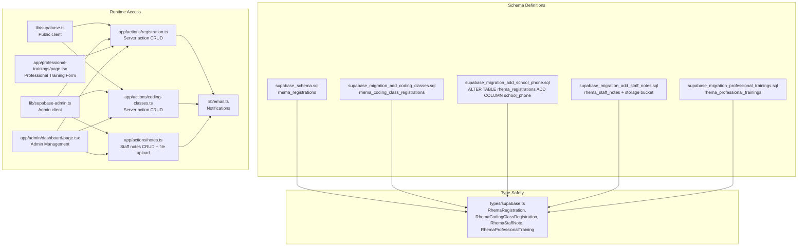
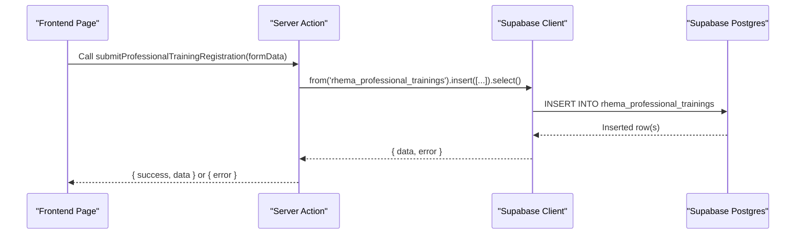
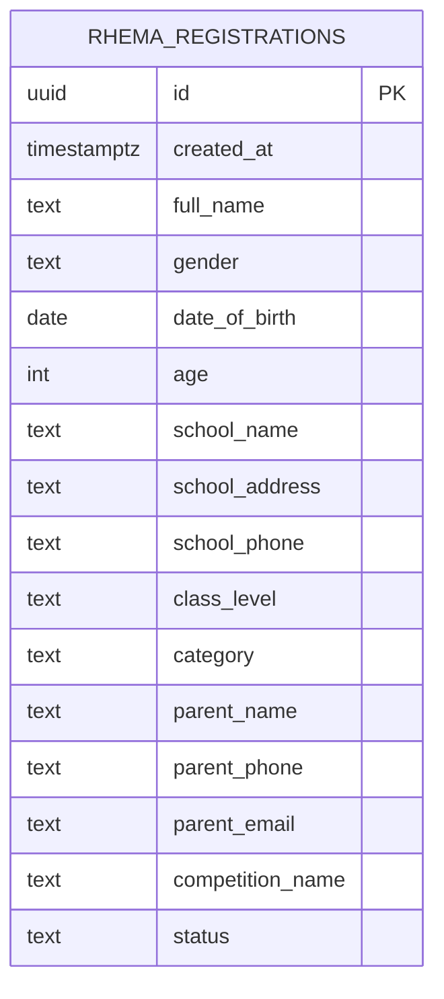
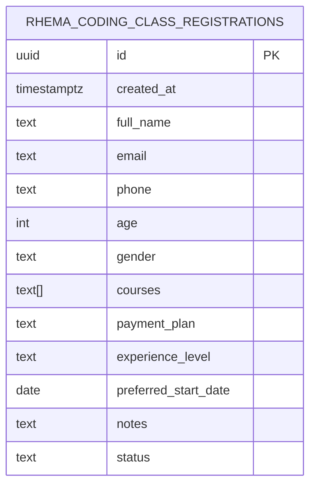
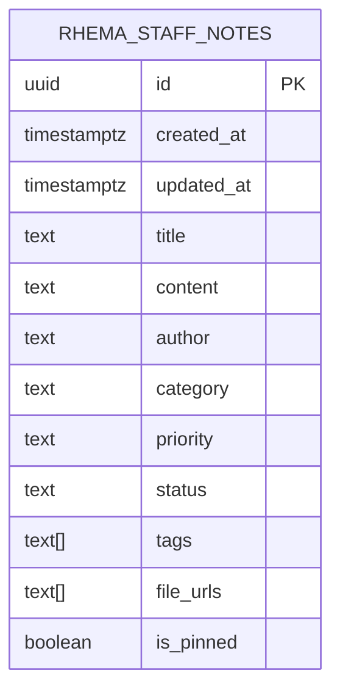
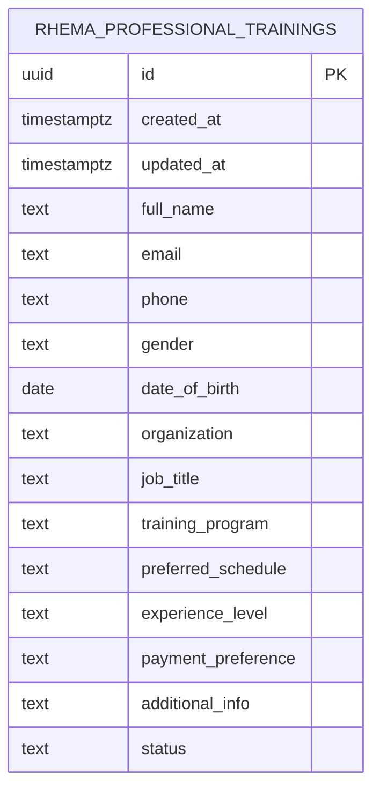
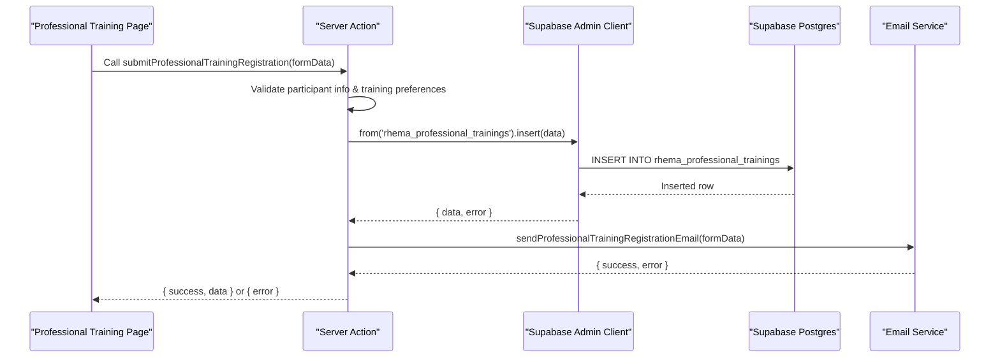
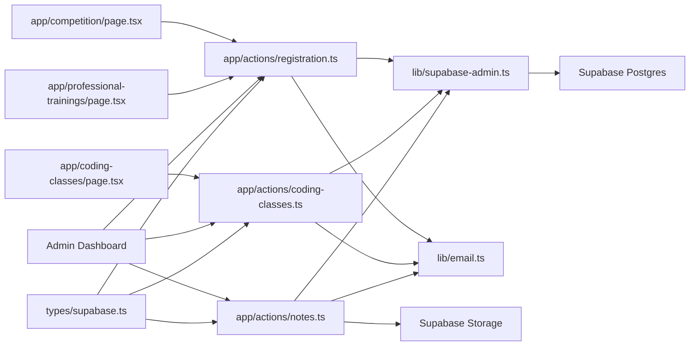

# Database Schema

<cite>
**Referenced Files in This Document**
- [supabase_schema.sql](file://supabase_schema.sql)
- [supabase_migration_add_coding_classes.sql](file://supabase_migration_add_coding_classes.sql)
- [supabase_migration_add_school_phone.sql](file://supabase_migration_add_school_phone.sql)
- [supabase_migration_add_staff_notes.sql](file://supabase_migration_add_staff_notes.sql)
- [supabase_migration_professional_trainings.sql](file://supabase_migration_professional_trainings.sql)
- [types/supabase.ts](file://types/supabase.ts)
- [lib/supabase.ts](file://lib/supabase.ts)
- [lib/supabase-admin.ts](file://lib/supabase-admin.ts)
- [app/actions/registration.ts](file://app/actions/registration.ts)
- [app/actions/coding-classes.ts](file://app/actions/coding-classes.ts)
- [app/actions/notes.ts](file://app/actions/notes.ts)
- [lib/email.ts](file://lib/email.ts)
- [app/competition/page.tsx](file://app/competition/page.tsx)
- [app/coding-classes/page.tsx](file://app/coding-classes/page.tsx)
- [app/professional-trainings/page.tsx](file://app/professional-trainings/page.tsx)
- [app/admin/dashboard/page.tsx](file://app/admin/dashboard/page.tsx)
</cite>

## Update Summary
**Changes Made**
- Added comprehensive documentation for the new `rhema_professional_trainings` table with complete participant information schema
- Updated architecture diagrams to include professional training system integration
- Added detailed section covering professional training features including participant details, program preferences, and enrollment tracking
- Enhanced type mappings to include RhemaProfessionalTraining interface
- Updated server actions documentation to cover professional training CRUD operations and email notifications
- Integrated professional training data into admin dashboard management system

## Table of Contents
1. [Introduction](#introduction)
2. [Project Structure](#project-structure)
3. [Core Components](#core-components)
4. [Architecture Overview](#architecture-overview)
5. [Detailed Component Analysis](#detailed-component-analysis)
6. [Dependency Analysis](#dependency-analysis)
7. [Performance Considerations](#performance-considerations)
8. [Troubleshooting Guide](#troubleshooting-guide)
9. [Conclusion](#conclusion)

## Introduction
This document describes the database schema design for Rhema Expert Solutions, focusing on competition registration, online coding class registration, professional training registration, and staff e-note management tables. It documents table structures, data types, defaults, constraints, and Row Level Security (RLS) policies. It also explains the migration files that define and evolve the schema, and how the frontend and backend interact with the database via Supabase clients and server actions.

## Project Structure
The schema is defined and evolved through SQL migration files and consumed by TypeScript interfaces and Next.js server actions. The Supabase client configuration supports both public and admin access modes.

**Diagram sources**
- [supabase_schema.sql:1-33](file://supabase_schema.sql#L1-L33)
- [supabase_migration_add_coding_classes.sql:1-30](file://supabase_migration_add_coding_classes.sql#L1-L30)
- [supabase_migration_add_school_phone.sql:1-4](file://supabase_migration_add_school_phone.sql#L1-L4)
- [supabase_migration_add_staff_notes.sql:1-44](file://supabase_migration_add_staff_notes.sql#L1-L44)
- [supabase_migration_professional_trainings.sql:1-34](file://supabase_migration_professional_trainings.sql#L1-L34)
- [types/supabase.ts:56-132](file://types/supabase.ts#L56-L132)
- [lib/supabase.ts:1-25](file://lib/supabase.ts#L1-L25)
- [lib/supabase-admin.ts:1-19](file://lib/supabase-admin.ts#L1-L19)
- [app/actions/registration.ts:22-84](file://app/actions/registration.ts#L22-L84)
- [app/actions/coding-classes.ts:20-76](file://app/actions/coding-classes.ts#L20-L76)
- [app/actions/notes.ts:1-147](file://app/actions/notes.ts#L1-147)
- [lib/email.ts:46-86](file://lib/email.ts#L46-86)
- [app/professional-trainings/page.tsx:1-400](file://app/professional-trainings/page.tsx#L1-400)
- [app/admin/dashboard/page.tsx:1-1910](file://app/admin/dashboard/page.tsx#L1-1910)

**Section sources**
- [supabase_schema.sql:1-33](file://supabase_schema.sql#L1-L33)
- [supabase_migration_add_coding_classes.sql:1-30](file://supabase_migration_add_coding_classes.sql#L1-L30)
- [supabase_migration_add_school_phone.sql:1-4](file://supabase_migration_add_school_phone.sql#L1-L4)
- [supabase_migration_add_staff_notes.sql:1-44](file://supabase_migration_add_staff_notes.sql#L1-L44)
- [supabase_migration_professional_trainings.sql:1-34](file://supabase_migration_professional_trainings.sql#L1-L34)
- [types/supabase.ts:56-132](file://types/supabase.ts#L56-L132)
- [lib/supabase.ts:1-25](file://lib/supabase.ts#L1-L25)
- [lib/supabase-admin.ts:1-19](file://lib/supabase-admin.ts#L1-L19)

## Core Components
- **rhema_registrations**: Stores competition registration records with school and parent/guardian contact details, plus optional school phone.
- **rhema_coding_class_registrations**: Stores online coding class registration records with course selections, payment plan, and status.
- **rhema_staff_notes**: Manages staff e-notes with title, content, author, category, priority, status, tags, file attachments, and pinning functionality.
- **rhema_professional_trainings**: Handles professional training registration with comprehensive participant details, program preferences, experience levels, and enrollment status tracking.
- **Types**: TypeScript interfaces mirror the schema for compile-time safety and IDE support.
- **Clients**: Public client for read/write via RLS; Admin client for bypassing RLS using a service role key.
- **Actions**: Server actions encapsulate inserts, updates, and deletes for all registration and note tables.

**Section sources**
- [supabase_schema.sql:1-33](file://supabase_schema.sql#L1-L33)
- [supabase_migration_add_coding_classes.sql:1-30](file://supabase_migration_add_coding_classes.sql#L1-L30)
- [supabase_migration_add_staff_notes.sql:1-44](file://supabase_migration_add_staff_notes.sql#L1-L44)
- [supabase_migration_professional_trainings.sql:1-34](file://supabase_migration_professional_trainings.sql#L1-L34)
- [types/supabase.ts:56-132](file://types/supabase.ts#L56-L132)
- [lib/supabase.ts:1-25](file://lib/supabase.ts#L1-L25)
- [lib/supabase-admin.ts:1-19](file://lib/supabase-admin.ts#L1-L19)
- [app/actions/registration.ts:22-84](file://app/actions/registration.ts#L22-L84)
- [app/actions/coding-classes.ts:20-76](file://app/actions/coding-classes.ts#L20-L76)
- [app/actions/notes.ts:1-147](file://app/actions/notes.ts#L1-147)

## Architecture Overview
The system uses Supabase as the database and authentication provider. Two clients are used:
- Public client (NEXT_PUBLIC_SUPABASE_URL + NEXT_PUBLIC_SUPABASE_ANON_KEY): Used by frontend for read/write operations governed by RLS policies.
- Admin client (NEXT_PUBLIC_SUPABASE_URL + SUPABASE_SERVICE_ROLE_KEY): Used by server actions to bypass RLS for administrative tasks.

**Diagram sources**
- [app/professional-trainings/page.tsx:32-64](file://app/professional-trainings/page.tsx#L32-64)
- [app/actions/registration.ts:147-207](file://app/actions/registration.ts#L147-207)
- [lib/supabase.ts:16-19](file://lib/supabase.ts#L16-19)

## Detailed Component Analysis

### Table: rhema_registrations
- Purpose: Capture competition registration entries with student, school, and parent/guardian details.
- Primary key: id (UUID, default gen_random_uuid)
- Timestamps: created_at (timestamptz, default now())
- Required fields: full_name, gender, age, school_name, class_level, category, parent_name, parent_phone
- Optional fields: date_of_birth, school_address, school_phone, parent_email, competition_name (default), status (default)
- RLS: Enabled; public insert policy; admin access via service role key
- Indexes/constraints: Primary key index; no explicit indexes defined in migration

Data types and defaults
- id: UUID, default gen_random_uuid(), PK
- created_at: timestamptz, default now()
- full_name: text, not null
- gender: text, not null
- date_of_birth: date
- age: int, not null
- school_name: text, not null
- school_address: text
- school_phone: text
- class_level: text, not null
- category: text, not null
- parent_name: text, not null
- parent_phone: text, not null
- parent_email: text
- competition_name: text, default
- status: text, default

Constraints and validation
- Not-null constraints enforced at insert
- Default values applied for timestamps and enumerations
- RLS policies restrict reads/writes based on roles

**Diagram sources**
- [supabase_schema.sql:2-18](file://supabase_schema.sql#L2-L18)
- [types/supabase.ts:56-73](file://types/supabase.ts#L56-L73)

**Section sources**
- [supabase_schema.sql:1-33](file://supabase_schema.sql#L1-L33)
- [supabase_migration_add_school_phone.sql:1-4](file://supabase_migration_add_school_phone.sql#L1-L4)
- [types/supabase.ts:56-73](file://types/supabase.ts#L56-L73)

### Table: rhema_coding_class_registrations
- Purpose: Capture online coding class registration entries with course preferences, payment plan, and status.
- Primary key: id (UUID, default gen_random_uuid)
- Timestamps: created_at (timestamptz, default now())
- Required fields: full_name, phone, courses (array), payment_plan
- Optional fields: email, age, gender, experience_level (default), preferred_start_date, notes
- RLS: Enabled; public insert and select by id policies; admin access via service role key

Data types and defaults
- id: UUID, default gen_random_uuid(), PK
- created_at: timestamptz, default now()
- full_name: text, not null
- email: text
- phone: text, not null
- age: int
- gender: text
- courses: text[], not null, default empty array
- payment_plan: text, not null
- experience_level: text, default "beginner"
- preferred_start_date: date
- notes: text
- status: text, default "pending"

Constraints and validation
- Not-null constraints enforced at insert
- Default values applied for arrays and enumerations
- RLS policies restrict reads/writes based on roles

**Diagram sources**
- [supabase_migration_add_coding_classes.sql:2-16](file://supabase_migration_add_coding_classes.sql#L2-L16)
- [types/supabase.ts:83-97](file://types/supabase.ts#L83-L97)

**Section sources**
- [supabase_migration_add_coding_classes.sql:1-30](file://supabase_migration_add_coding_classes.sql#L1-L30)
- [types/supabase.ts:83-97](file://types/supabase.ts#L83-L97)

### Table: rhema_staff_notes
- Purpose: Manage staff e-notes with comprehensive metadata, categorization, and attachment support.
- Primary key: id (UUID, default gen_random_uuid)
- Timestamps: created_at, updated_at (both timestamptz, default now())
- Required fields: title, author
- Optional fields: content, category (default 'general'), priority (default 'normal'), status (default 'active'), tags (default empty array), file_urls (default empty array), is_pinned (default false)
- RLS: Enabled; service role policy allows all operations
- Storage: Integrated with Supabase Storage bucket 'staff-notes' for file attachments

Data types and defaults
- id: UUID, default gen_random_uuid(), PK
- created_at: timestamptz, default now()
- updated_at: timestamptz, default now()
- title: text, not null
- content: text
- author: text, not null
- category: text, default 'general' (general, student, admin, urgent, announcement)
- priority: text, default 'normal' (low, normal, high, urgent)
- status: text, default 'active' (active, archived)
- tags: text[], default '{}'
- file_urls: text[], default '{}'
- is_pinned: boolean, default false

Indexes and performance optimization
- idx_staff_notes_created_at: Optimizes time-based queries and sorting
- idx_staff_notes_status: Optimizes filtering by status
- idx_staff_notes_category: Optimizes category-based filtering
- idx_staff_notes_priority: Optimizes priority-based filtering

Storage integration
- Dedicated storage bucket 'staff-notes' for e-note attachments
- Public read access for uploaded files
- Authenticated write access for file uploads

**Diagram sources**
- [supabase_migration_add_staff_notes.sql:2-15](file://supabase_migration_add_staff_notes.sql#L2-L15)
- [types/supabase.ts:99-112](file://types/supabase.ts#L99-L112)

**Section sources**
- [supabase_migration_add_staff_notes.sql:1-44](file://supabase_migration_add_staff_notes.sql#L1-L44)
- [types/supabase.ts:99-112](file://types/supabase.ts#L99-L112)

### Table: rhema_professional_trainings
- Purpose: Capture professional training registration entries with comprehensive participant details, program preferences, and enrollment status.
- Primary key: id (UUID, default gen_random_uuid)
- Timestamps: created_at, updated_at (both timestamptz, default now())
- Required fields: full_name, email, phone, gender, training_program, preferred_schedule, experience_level, payment_preference
- Optional fields: date_of_birth, organization, job_title, additional_info, status (default 'pending')
- RLS: Enabled; service role policy allows all operations

Data types and defaults
- id: UUID, default gen_random_uuid(), PK
- created_at: timestamptz, default now()
- updated_at: timestamptz, default now()
- full_name: text, not null
- email: text, not null
- phone: text, not null
- gender: text, not null
- date_of_birth: date
- organization: text
- job_title: text
- training_program: text, not null
- preferred_schedule: text, not null
- experience_level: text, not null
- payment_preference: text, not null
- additional_info: text
- status: text, default 'pending' (pending, contacted, enrolled, cancelled)

Indexes and performance optimization
- idx_professional_trainings_created_at: Optimizes time-based queries
- idx_professional_trainings_status: Optimizes status filtering
- idx_professional_trainings_program: Optimizes program-based queries
- idx_professional_trainings_email: Optimizes email lookups

**Diagram sources**
- [supabase_migration_professional_trainings.sql:2-19](file://supabase_migration_professional_trainings.sql#L2-L19)
- [types/supabase.ts:114-131](file://types/supabase.ts#L114-L131)

**Section sources**
- [supabase_migration_professional_trainings.sql:1-34](file://supabase_migration_professional_trainings.sql#L1-L34)
- [types/supabase.ts:114-131](file://types/supabase.ts#L114-L131)

### Type Mappings
TypeScript interfaces mirror the schema for runtime safety and autocomplete.

- RhemaRegistration: Maps to rhema_registrations
- RhemaCodingClassRegistration: Maps to rhema_coding_class_registrations
- RhemaStaffNote: Maps to rhema_staff_notes with enhanced file URL support
- RhemaProfessionalTraining: Maps to rhema_professional_trainings with comprehensive participant information

**Section sources**
- [types/supabase.ts:56-132](file://types/supabase.ts#L56-L132)

### Client Configuration
- Public client: Uses NEXT_PUBLIC_SUPABASE_URL and NEXT_PUBLIC_SUPABASE_ANON_KEY; suitable for frontend operations under RLS.
- Admin client: Uses NEXT_PUBLIC_SUPABASE_URL and SUPABASE_SERVICE_ROLE_KEY; bypasses RLS for server actions.

**Section sources**
- [lib/supabase.ts:1-25](file://lib/supabase.ts#L1-L25)
- [lib/supabase-admin.ts:1-19](file://lib/supabase-admin.ts#L1-L19)

### Server Actions and Data Access Patterns
- Competition registration:
  - Validation of required fields
  - Insert into rhema_registrations
  - Optional email notification to administrators
- Coding class registration:
  - Validation of required fields and course selection
  - Insert into rhema_coding_class_registrations
  - Optional email notification to administrators
- Professional training registration:
  - Comprehensive validation of participant information and training preferences
  - Insert into rhema_professional_trainings with status tracking
  - Email notification with detailed participant information and program details
  - Integration with admin dashboard for management and status updates
- Staff notes management:
  - Authentication check before any operation
  - CRUD operations with pagination and search capabilities
  - File upload/download with dedicated storage bucket
  - Email notifications for new e-notes
  - Pinned notes prioritized in query results

**Diagram sources**
- [app/professional-trainings/page.tsx:32-64](file://app/professional-trainings/page.tsx#L32-64)
- [app/actions/registration.ts:147-207](file://app/actions/registration.ts#L147-207)
- [lib/email.ts:193-236](file://lib/email.ts#L193-236)

**Section sources**
- [app/actions/registration.ts:22-84](file://app/actions/registration.ts#L22-84)
- [app/actions/coding-classes.ts:20-76](file://app/actions/coding-classes.ts#L20-76)
- [app/actions/notes.ts:1-147](file://app/actions/notes.ts#L1-147)
- [lib/email.ts:46-86](file://lib/email.ts#L46-86)

## Dependency Analysis
- Frontend pages depend on server actions for data mutations.
- Server actions depend on Supabase admin client for database operations.
- Email notifications are triggered after successful inserts.
- Type interfaces ensure consistent field names and types across the stack.
- Staff notes system integrates with Supabase Storage for file attachments.
- Professional training system includes comprehensive admin dashboard integration for management and reporting.

**Diagram sources**
- [app/competition/page.tsx:32-64](file://app/competition/page.tsx#L32-64)
- [app/coding-classes/page.tsx:56-86](file://app/coding-classes/page.tsx#L56-86)
- [app/professional-trainings/page.tsx:1-400](file://app/professional-trainings/page.tsx#L1-400)
- [app/actions/registration.ts:22-84](file://app/actions/registration.ts#L22-84)
- [app/actions/coding-classes.ts:20-76](file://app/actions/coding-classes.ts#L20-76)
- [app/actions/notes.ts:1-147](file://app/actions/notes.ts#L1-147)
- [lib/supabase-admin.ts:1-19](file://lib/supabase-admin.ts#L1-L19)
- [lib/email.ts:46-86](file://lib/email.ts#L46-86)
- [types/supabase.ts:56-132](file://types/supabase.ts#L56-L132)

**Section sources**
- [app/competition/page.tsx:32-64](file://app/competition/page.tsx#L32-64)
- [app/coding-classes/page.tsx:56-86](file://app/coding-classes/page.tsx#L56-86)
- [app/professional-trainings/page.tsx:1-400](file://app/professional-trainings/page.tsx#L1-400)
- [app/actions/registration.ts:22-84](file://app/actions/registration.ts#L22-84)
- [app/actions/coding-classes.ts:20-76](file://app/actions/coding-classes.ts#L20-76)
- [app/actions/notes.ts:1-147](file://app/actions/notes.ts#L1-147)
- [lib/supabase-admin.ts:1-19](file://lib/supabase-admin.ts#L1-L19)
- [lib/email.ts:46-86](file://lib/email.ts#L46-86)
- [types/supabase.ts:56-132](file://types/supabase.ts#L56-L132)

## Performance Considerations
- **Indexes**: Strategic indexing implemented across all tables for optimal query performance:
  - rhema_registrations: No explicit indexes (simple queries)
  - rhema_coding_class_registrations: No explicit indexes (simple queries)
  - rhema_staff_notes: Created indexes on created_at, status, category, and priority for efficient filtering and sorting
  - rhema_professional_trainings: Created indexes on created_at, status, training_program, and email for comprehensive query optimization
- **RLS overhead**: RLS adds minimal overhead; ensure policies remain simple to avoid query slowdowns.
- **Data volume**: For high-volume inserts, batch operations where feasible and monitor replication lag.
- **Network latency**: Server actions reduce client-side logic and minimize repeated round-trips.
- **Storage optimization**: Staff notes use dedicated storage bucket with appropriate access policies.
- **Professional training optimization**: Email lookups and program-based queries are optimized through dedicated indexes for better admin dashboard performance.

[No sources needed since this section provides general guidance]

## Troubleshooting Guide
Common issues and resolutions:
- Missing environment variables:
  - NEXT_PUBLIC_SUPABASE_URL or NEXT_PUBLIC_SUPABASE_ANON_KEY: Public client initialization logs a warning; dynamic content may not load.
  - SUPABASE_SERVICE_ROLE_KEY: Admin client warns if missing; write operations may fail if RLS is enabled.
- Authentication failures:
  - Admin dashboard requires a valid admin password stored in rhema_content; if not found, the system creates a default password and stores it.
- RLS policy errors:
  - Public client cannot bypass policies; use admin client for server-side operations requiring admin privileges.
- Email notifications:
  - SMTP_USER or SMTP_PASS missing disables email notifications; verify environment variables and transport configuration.
- Staff notes specific issues:
  - File upload failures: Check storage bucket permissions and file size limits
  - Search functionality: Ensure full-text search patterns are properly escaped
  - Pinning functionality: Verify boolean field handling in frontend components
- Professional training specific issues:
  - Registration form validation: Ensure all required fields (full_name, email, phone, gender, training_program, preferred_schedule, experience_level, payment_preference) are properly validated
  - Program dropdown options: Verify training programs list matches database expectations
  - Status updates: Confirm admin dashboard status changes persist correctly in database

**Section sources**
- [lib/supabase.ts:10-13](file://lib/supabase.ts#L10-L13)
- [lib/supabase-admin.ts:7-9](file://lib/supabase-admin.ts#L7-L9)
- [app/actions/auth.ts:8-29](file://app/actions/auth.ts#L8-L29)
- [lib/email.ts:24-27](file://lib/email.ts#L24-L27)

## Conclusion
The database schema for Rhema Expert Solutions consists of four comprehensive tables supporting competition registrations, coding class registrations, professional training registrations, and staff e-note management. The design emphasizes simplicity, clear defaults, and RLS for controlled access. Migrations define the evolving schema with strategic indexing for performance optimization, while server actions and typed interfaces ensure robust, type-safe data access. 

The newly added professional training system provides comprehensive participant information management with detailed program preferences, experience level tracking, and payment option handling. The system includes advanced features like automated email notifications, admin dashboard integration for management and reporting, and optimized database indexes for efficient querying. The modular architecture supports future scalability and maintains consistency with existing registration systems while providing specialized functionality for professional development programs.

For production, the existing indexes provide good query performance across all tables, and the comprehensive type safety ensures reliable data operations throughout the application stack.