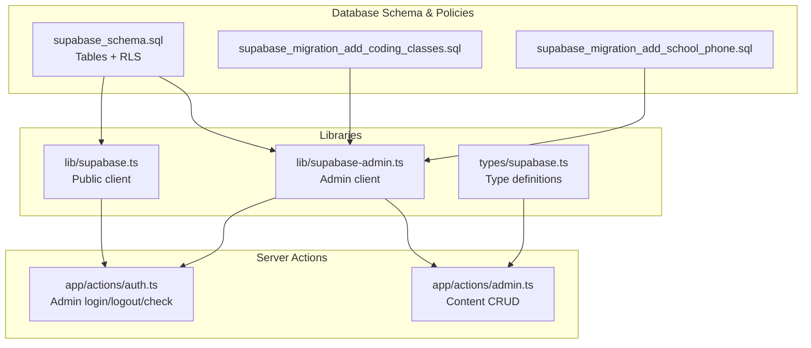
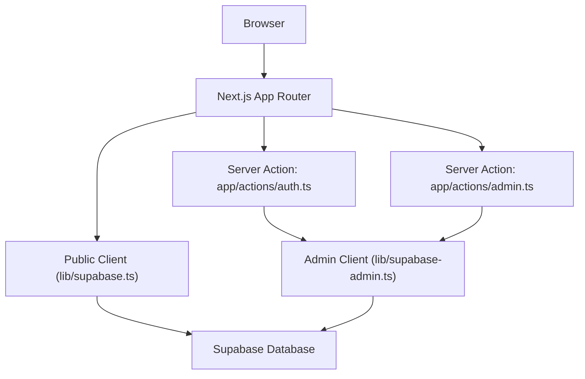
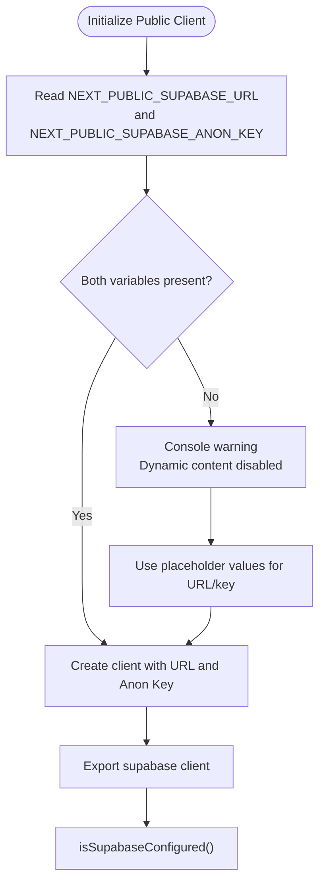
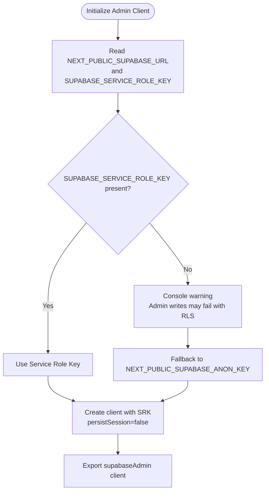
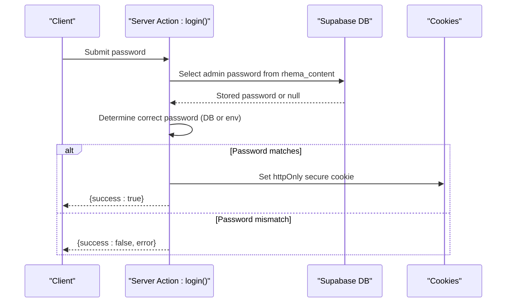
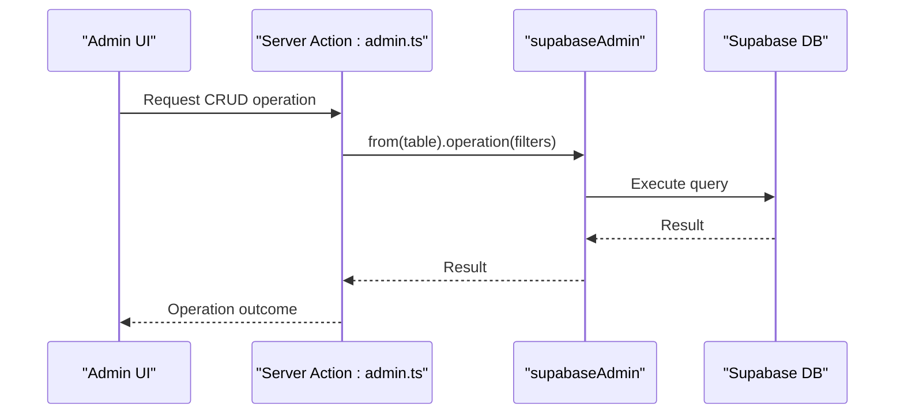
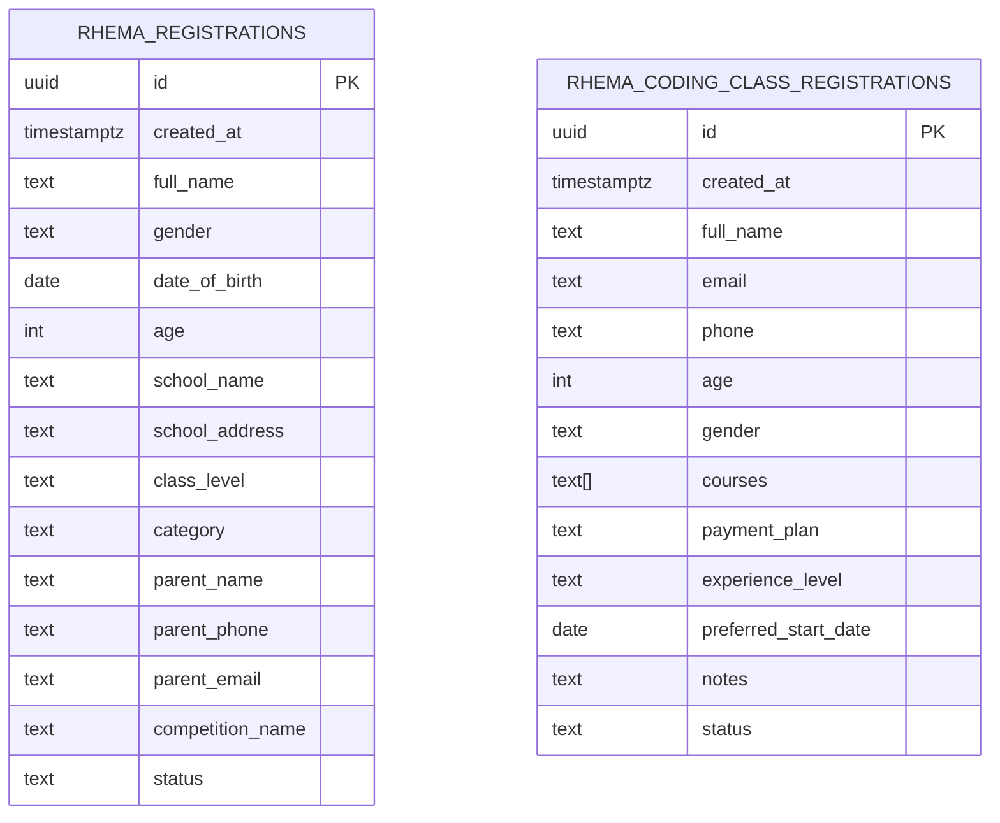
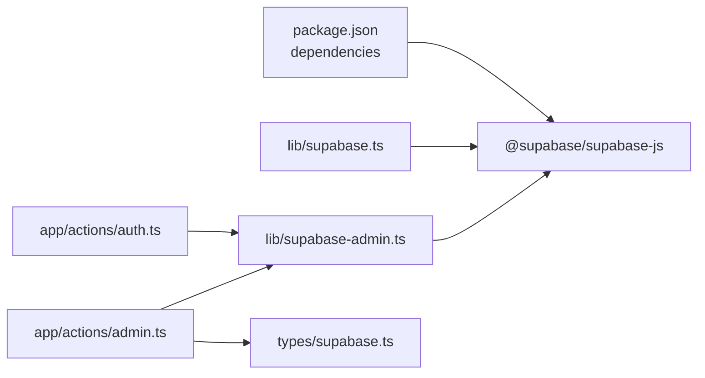

# Supabase Configuration

<cite>
**Referenced Files in This Document**
- [lib/supabase.ts](file://lib/supabase.ts)
- [lib/supabase-admin.ts](file://lib/supabase-admin.ts)
- [types/supabase.ts](file://types/supabase.ts)
- [app/actions/auth.ts](file://app/actions/auth.ts)
- [app/actions/admin.ts](file://app/actions/admin.ts)
- [supabase_schema.sql](file://supabase_schema.sql)
- [supabase_migration_add_coding_classes.sql](file://supabase_migration_add_coding_classes.sql)
- [supabase_migration_add_school_phone.sql](file://supabase_migration_add_school_phone.sql)
- [package.json](file://package.json)
</cite>

## Table of Contents
1. [Introduction](#introduction)
2. [Project Structure](#project-structure)
3. [Core Components](#core-components)
4. [Architecture Overview](#architecture-overview)
5. [Detailed Component Analysis](#detailed-component-analysis)
6. [Dependency Analysis](#dependency-analysis)
7. [Performance Considerations](#performance-considerations)
8. [Troubleshooting Guide](#troubleshooting-guide)
9. [Conclusion](#conclusion)

## Introduction
This document explains how Supabase is configured and used in Rhema Expert Solutions. It covers client initialization, environment variable setup, authentication configuration, the differences between public and admin clients, security considerations for API keys, production deployment requirements, and runtime validation via the isSupabaseConfigured helper. It also documents fallback mechanisms, error handling for missing credentials, and best practices for storing sensitive credentials and controlling access.

## Project Structure
Supabase configuration is centralized in two library modules:
- Public client for frontend reads and public operations
- Admin client for server-side writes and privileged operations

Supporting types define database table shapes for TypeScript usage. Server actions consume these clients for authenticated admin operations and content management.

**Diagram sources**
- [lib/supabase.ts:1-25](file://lib/supabase.ts#L1-L25)
- [lib/supabase-admin.ts:1-19](file://lib/supabase-admin.ts#L1-L19)
- [types/supabase.ts:1-113](file://types/supabase.ts#L1-L113)
- [app/actions/auth.ts:1-55](file://app/actions/auth.ts#L1-L55)
- [app/actions/admin.ts](file://app/actions/admin.ts)
- [supabase_schema.sql:1-33](file://supabase_schema.sql#L1-L33)
- [supabase_migration_add_coding_classes.sql:1-30](file://supabase_migration_add_coding_classes.sql#L1-L30)
- [supabase_migration_add_school_phone.sql:1-4](file://supabase_migration_add_school_phone.sql#L1-L4)

**Section sources**
- [lib/supabase.ts:1-25](file://lib/supabase.ts#L1-L25)
- [lib/supabase-admin.ts:1-19](file://lib/supabase-admin.ts#L1-L19)
- [types/supabase.ts:1-113](file://types/supabase.ts#L1-L113)
- [app/actions/auth.ts:1-55](file://app/actions/auth.ts#L1-L55)
- [app/actions/admin.ts](file://app/actions/admin.ts)
- [supabase_schema.sql:1-33](file://supabase_schema.sql#L1-L33)
- [supabase_migration_add_coding_classes.sql:1-30](file://supabase_migration_add_coding_classes.sql#L1-L30)
- [supabase_migration_add_school_phone.sql:1-4](file://supabase_migration_add_school_phone.sql#L1-L4)

## Core Components
- Public client (frontend): Initializes with NEXT_PUBLIC_SUPABASE_URL and NEXT_PUBLIC_SUPABASE_ANON_KEY. Warns if either is missing and falls back to placeholder values for local development.
- Admin client (server): Initializes with NEXT_PUBLIC_SUPABASE_URL and SUPABASE_SERVICE_ROLE_KEY. Falls back to NEXT_PUBLIC_SUPABASE_ANON_KEY if the service role key is missing, but writes will fail if Row Level Security (RLS) is enabled.
- Runtime validation: isSupabaseConfigured checks for presence and validity of environment variables to gate dynamic content loading.
- Types: Strongly typed interfaces for database tables used across server actions.

**Section sources**
- [lib/supabase.ts:7-24](file://lib/supabase.ts#L7-L24)
- [lib/supabase-admin.ts:4-18](file://lib/supabase-admin.ts#L4-L18)
- [types/supabase.ts:5-113](file://types/supabase.ts#L5-L113)

## Architecture Overview
The application uses separate clients to enforce least privilege:
- Public client: read-mostly access constrained by RLS
- Admin client: server-side writes with optional bypass via service role key

**Diagram sources**
- [lib/supabase.ts:16-19](file://lib/supabase.ts#L16-L19)
- [lib/supabase-admin.ts:14-18](file://lib/supabase-admin.ts#L14-L18)
- [app/actions/auth.ts:5](file://app/actions/auth.ts#L5)
- [app/actions/admin.ts](file://app/actions/admin.ts)
- [supabase_schema.sql:20-32](file://supabase_schema.sql#L20-L32)

## Detailed Component Analysis

### Public Client Initialization and Validation
- Environment variables:
  - NEXT_PUBLIC_SUPABASE_URL
  - NEXT_PUBLIC_SUPABASE_ANON_KEY
- Behavior:
  - Validates presence at startup; warns if missing
  - Creates a client with URL and anonymous key
  - Uses placeholders in absence of environment variables
- Helper:
  - isSupabaseConfigured returns true only when both variables are present and URL is not a placeholder

**Diagram sources**
- [lib/supabase.ts:7-24](file://lib/supabase.ts#L7-L24)

**Section sources**
- [lib/supabase.ts:7-24](file://lib/supabase.ts#L7-L24)

### Admin Client Initialization and Fallback
- Environment variables:
  - NEXT_PUBLIC_SUPABASE_URL
  - SUPABASE_SERVICE_ROLE_KEY (preferred)
- Behavior:
  - Validates service role key presence; warns if missing
  - Falls back to NEXT_PUBLIC_SUPABASE_ANON_KEY if service role key is absent
  - Writes will fail under RLS if only anon key is used
- Configuration:
  - Disables session persistence for server-side operations

**Diagram sources**
- [lib/supabase-admin.ts:4-18](file://lib/supabase-admin.ts#L4-L18)

**Section sources**
- [lib/supabase-admin.ts:4-18](file://lib/supabase-admin.ts#L4-L18)

### Authentication Configuration
- Admin login uses server action to fetch a stored password from the database or fall back to an environment variable, then sets a secure httpOnly cookie upon successful authentication.
- Logout deletes the cookie and redirects to the admin page.
- checkAuth verifies the presence of the admin cookie.

**Diagram sources**
- [app/actions/auth.ts:7-43](file://app/actions/auth.ts#L7-L43)

**Section sources**
- [app/actions/auth.ts:7-43](file://app/actions/auth.ts#L7-L43)

### Content Management via Admin Client
- Server actions use supabaseAdmin to perform CRUD operations across multiple tables (services, clients, team, competitions, newsletter, content).
- Operations are executed server-side, ensuring service role privileges and avoiding exposure of secret keys in the client.

**Diagram sources**
- [app/actions/admin.ts](file://app/actions/admin.ts)
- [lib/supabase-admin.ts:14-18](file://lib/supabase-admin.ts#L14-L18)

**Section sources**
- [app/actions/admin.ts](file://app/actions/admin.ts)
- [lib/supabase-admin.ts:14-18](file://lib/supabase-admin.ts#L14-L18)

### Database Schema and Access Controls
- Tables:
  - rhema_registrations: public registration form with RLS enabled
  - rhema_coding_class_registrations: coding class registrations with RLS and public insert/select policies
- Policies:
  - RLS enabled on both tables
  - Public insert allowed; admin operations require service role via supabaseAdmin

**Diagram sources**
- [supabase_schema.sql:2-18](file://supabase_schema.sql#L2-L18)
- [supabase_migration_add_coding_classes.sql:2-16](file://supabase_migration_add_coding_classes.sql#L2-L16)

**Section sources**
- [supabase_schema.sql:20-32](file://supabase_schema.sql#L20-L32)
- [supabase_migration_add_coding_classes.sql:18-29](file://supabase_migration_add_coding_classes.sql#L18-L29)
- [supabase_migration_add_school_phone.sql:1-4](file://supabase_migration_add_school_phone.sql#L1-L4)

## Dependency Analysis
- Dependencies:
  - @supabase/supabase-js is included as a runtime dependency
- Internal dependencies:
  - app/actions/auth.ts and app/actions/admin.ts import supabaseAdmin
  - app/actions/admin.ts imports types/supabase.ts for strong typing

**Diagram sources**
- [package.json:11-17](file://package.json#L11-L17)
- [lib/supabase.ts:1](file://lib/supabase.ts#L1)
- [lib/supabase-admin.ts:1](file://lib/supabase-admin.ts#L1)
- [app/actions/auth.ts:5](file://app/actions/auth.ts#L5)
- [app/actions/admin.ts](file://app/actions/admin.ts)
- [types/supabase.ts:1-113](file://types/supabase.ts#L1-L113)

**Section sources**
- [package.json:11-17](file://package.json#L11-L17)
- [app/actions/auth.ts:5](file://app/actions/auth.ts#L5)
- [app/actions/admin.ts](file://app/actions/admin.ts)
- [types/supabase.ts:1-113](file://types/supabase.ts#L1-L113)

## Performance Considerations
- Client initialization occurs once per module load; avoid re-initializing clients unnecessarily.
- Admin client disables session persistence to reduce overhead in server actions.
- Keep queries targeted and use appropriate filters to minimize payload sizes.

## Troubleshooting Guide
Common issues and resolutions:
- Missing environment variables:
  - Symptom: Console warnings during initialization and dynamic content not loading.
  - Resolution: Set NEXT_PUBLIC_SUPABASE_URL and NEXT_PUBLIC_SUPABASE_ANON_KEY in your environment.
- Admin write failures under RLS:
  - Symptom: Write operations fail when using the public client or anon key.
  - Resolution: Provide SUPABASE_SERVICE_ROLE_KEY to supabaseAdmin; ensure RLS policies permit service role operations.
- Runtime validation:
  - Use isSupabaseConfigured to guard dynamic content rendering and feature availability.
- Cookie security:
  - Ensure cookies are set with secure flag in production and httpOnly for protection against XSS.

**Section sources**
- [lib/supabase.ts:10-13](file://lib/supabase.ts#L10-L13)
- [lib/supabase-admin.ts:7-9](file://lib/supabase-admin.ts#L7-L9)
- [lib/supabase.ts:21-24](file://lib/supabase.ts#L21-L24)
- [app/actions/auth.ts:33-38](file://app/actions/auth.ts#L33-L38)

## Conclusion
Rhema Expert Solutions separates Supabase access into a public client for read-mostly frontend operations and an admin client for server-side writes. The admin client leverages a service role key when available to bypass RLS for privileged operations, with sensible fallbacks and warnings when keys are missing. The isSupabaseConfigured helper enables runtime validation to prevent broken functionality in development or misconfigured environments. Adhering to the security practices outlined—storing secrets securely, using service role keys for admin tasks, and setting secure cookies—ensures robust and safe operation in production.