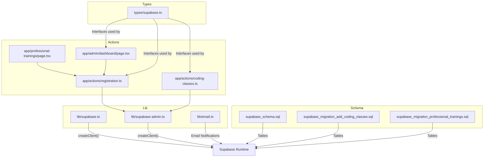
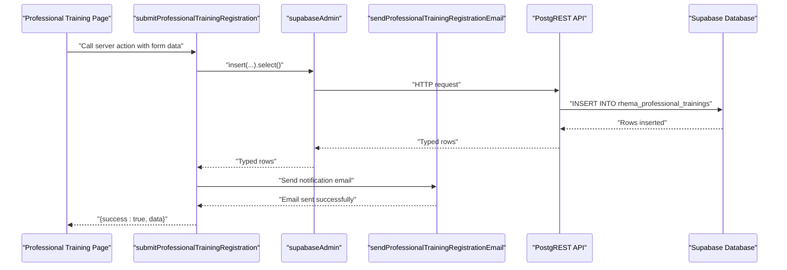
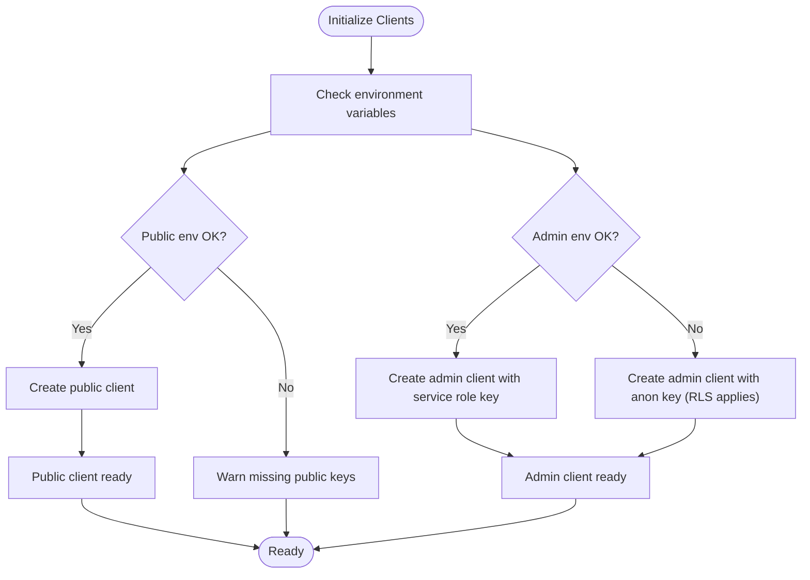
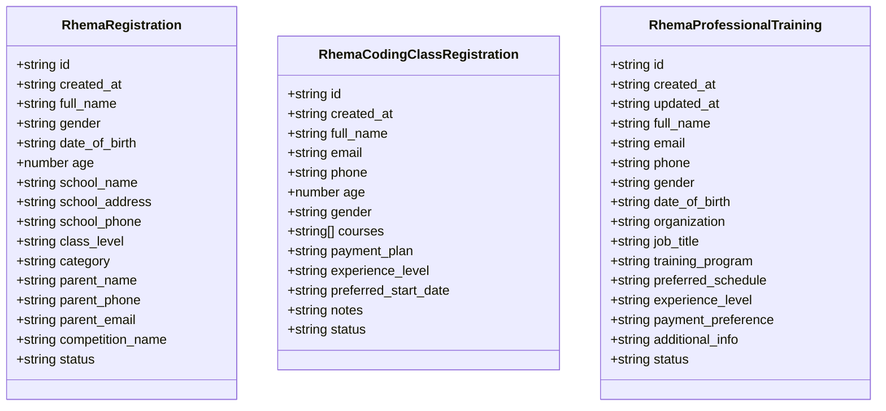
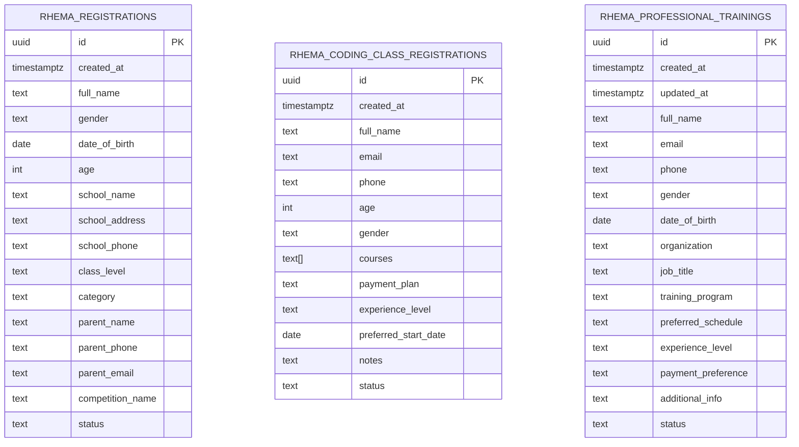
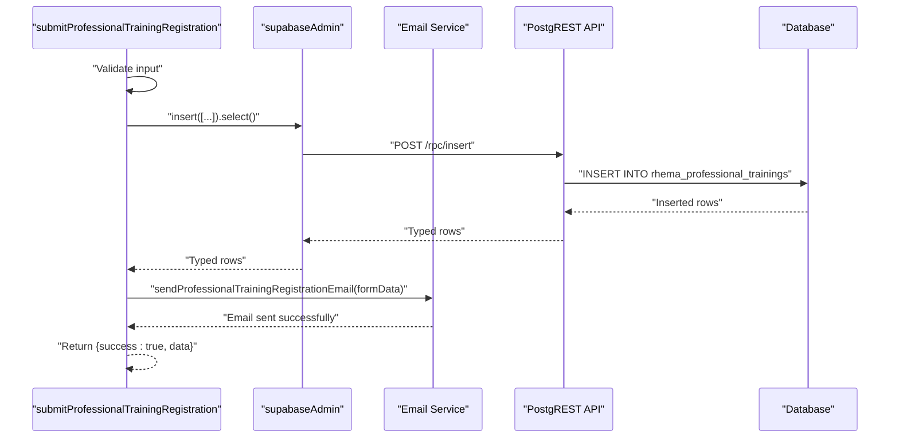
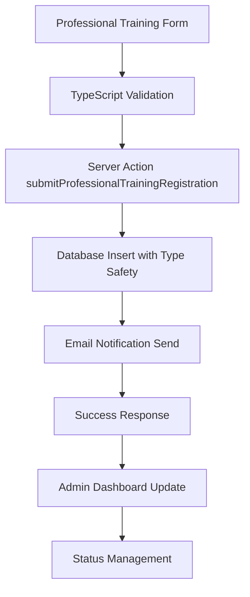
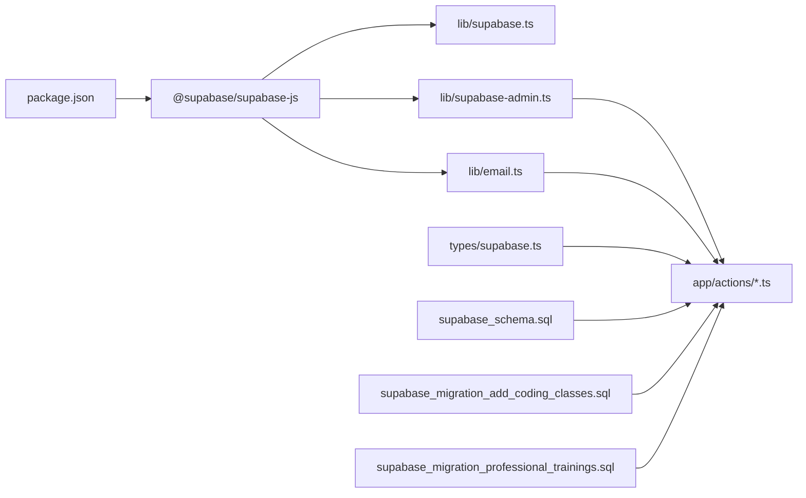

# TypeScript Type Definitions

<cite>
**Referenced Files in This Document**
- [types/supabase.ts](file://types/supabase.ts)
- [lib/supabase.ts](file://lib/supabase.ts)
- [lib/supabase-admin.ts](file://lib/supabase-admin.ts)
- [supabase_schema.sql](file://supabase_schema.sql)
- [supabase_migration_add_coding_classes.sql](file://supabase_migration_add_coding_classes.sql)
- [supabase_migration_professional_trainings.sql](file://supabase_migration_professional_trainings.sql)
- [app/actions/registration.ts](file://app/actions/registration.ts)
- [app/actions/coding-classes.ts](file://app/actions/coding-classes.ts)
- [app/professional-trainings/page.tsx](file://app/professional-trainings/page.tsx)
- [app/admin/dashboard/page.tsx](file://app/admin/dashboard/page.tsx)
- [lib/email.ts](file://lib/email.ts)
- [package.json](file://package.json)
</cite>

## Update Summary
**Changes Made**
- Added comprehensive documentation for the new RhemaProfessionalTraining TypeScript interface
- Updated schema and column constraints section to include professional trainings table
- Enhanced type-safe query operations section with professional training examples
- Added professional training email notification system documentation
- Updated admin dashboard integration for professional training management
- Expanded relationship between database columns and TypeScript interfaces section

## Table of Contents
1. [Introduction](#introduction)
2. [Project Structure](#project-structure)
3. [Core Components](#core-components)
4. [Architecture Overview](#architecture-overview)
5. [Detailed Component Analysis](#detailed-component-analysis)
6. [Dependency Analysis](#dependency-analysis)
7. [Performance Considerations](#performance-considerations)
8. [Troubleshooting Guide](#troubleshooting-guide)
9. [Conclusion](#conclusion)
10. [Appendices](#appendices)

## Introduction
This document explains how TypeScript type definitions are generated from Supabase and how they are used across the project. It covers:
- The type generation process using the Supabase CLI and where generated types belong
- How manually maintained interfaces mirror database tables and column constraints
- Type-safe query operations via Supabase client helpers
- Maintaining and updating types when schema changes occur
- Best practices for using generated types in server actions and client components
- Examples of typed queries, result typing, and error handling patterns
- Common type-related issues and debugging strategies

## Project Structure
The project organizes Supabase-related concerns into a few focused areas:
- Supabase client initialization and helpers live under lib/
- Manually authored TypeScript interfaces for domain entities live under types/
- Server actions that perform type-safe database operations live under app/actions/
- Database schemas and migrations live at the repository root

**Diagram sources**
- [lib/supabase.ts:16-24](file://lib/supabase.ts#L16-L24)
- [lib/supabase-admin.ts:14-18](file://lib/supabase-admin.ts#L14-18)
- [lib/email.ts:193-236](file://lib/email.ts#L193-L236)
- [types/supabase.ts:1-132](file://types/supabase.ts#L1-L132)
- [app/actions/registration.ts:1-252](file://app/actions/registration.ts#L1-L252)
- [app/actions/coding-classes.ts:1-156](file://app/actions/coding-classes.ts#L1-L156)
- [app/professional-trainings/page.tsx:1-400](file://app/professional-trainings/page.tsx#L1-L400)
- [app/admin/dashboard/page.tsx:1-1911](file://app/admin/dashboard/page.tsx#L1-L1911)
- [supabase_schema.sql:1-33](file://supabase_schema.sql#L1-L33)
- [supabase_migration_add_coding_classes.sql:1-29](file://supabase_migration_add_coding_classes.sql#L1-L29)
- [supabase_migration_professional_trainings.sql:1-33](file://supabase_migration_professional_trainings.sql#L1-L33)

**Section sources**
- [lib/supabase.ts:1-25](file://lib/supabase.ts#L1-L25)
- [lib/supabase-admin.ts:1-19](file://lib/supabase-admin.ts#L1-L19)
- [lib/email.ts:1-237](file://lib/email.ts#L1-L237)
- [types/supabase.ts:1-132](file://types/supabase.ts#L1-L132)
- [supabase_schema.sql:1-33](file://supabase_schema.sql#L1-L33)
- [supabase_migration_add_coding_classes.sql:1-29](file://supabase_migration_add_coding_classes.sql#L1-L29)
- [supabase_migration_professional_trainings.sql:1-33](file://supabase_migration_professional_trainings.sql#L1-L33)

## Core Components
- Supabase client initialization and configuration:
  - Public client for read/write operations depending on Row Level Security (RLS)
  - Admin client using a Service Role Key for bypassing RLS during server-side operations
- Manually authored TypeScript interfaces that define shapes for domain entities
- Server actions that encapsulate type-safe database operations and error handling
- Email notification system for registration confirmations and administrative alerts

Key responsibilities:
- lib/supabase.ts: Creates the public client and exposes a configuration checker
- lib/supabase-admin.ts: Creates the admin client with optional Service Role Key fallback
- lib/email.ts: Handles email notifications including professional training registration emails
- types/supabase.ts: Defines TypeScript interfaces mirroring database tables and columns
- app/actions/registration.ts and app/actions/coding-classes.ts: Demonstrate typed inserts, selects, updates, deletes, and partial updates
- app/professional-trainings/page.tsx: Professional training registration form with type safety
- app/admin/dashboard/page.tsx: Administrative interface for managing all registrations including professional trainings

**Section sources**
- [lib/supabase.ts:1-25](file://lib/supabase.ts#L1-L25)
- [lib/supabase-admin.ts:1-19](file://lib/supabase-admin.ts#L1-L19)
- [lib/email.ts:1-237](file://lib/email.ts#L1-L237)
- [types/supabase.ts:1-132](file://types/supabase.ts#L1-L132)
- [app/actions/registration.ts:1-252](file://app/actions/registration.ts#L1-L252)
- [app/actions/coding-classes.ts:1-156](file://app/actions/coding-classes.ts#L1-L156)
- [app/professional-trainings/page.tsx:1-400](file://app/professional-trainings/page.tsx#L1-L400)
- [app/admin/dashboard/page.tsx:1-1911](file://app/admin/dashboard/page.tsx#L1-L1911)

## Architecture Overview
The runtime architecture ties together Supabase clients, database schemas, and typed actions:

**Diagram sources**
- [app/professional-trainings/page.tsx:32-64](file://app/professional-trainings/page.tsx#L32-L64)
- [app/actions/registration.ts:147-207](file://app/actions/registration.ts#L147-L207)
- [lib/email.ts:193-236](file://lib/email.ts#L193-L236)
- [lib/supabase-admin.ts:14-18](file://lib/supabase-admin.ts#L14-18)
- [supabase_migration_professional_trainings.sql:1-33](file://supabase_migration_professional_trainings.sql#L1-L33)

## Detailed Component Analysis

### Supabase Clients
- Public client:
  - Initializes with NEXT_PUBLIC_SUPABASE_URL and NEXT_PUBLIC_SUPABASE_ANON_KEY
  - Warns if environment variables are missing
  - Used for read-mostly operations constrained by RLS
- Admin client:
  - Initializes with NEXT_PUBLIC_SUPABASE_URL and SUPABASE_SERVICE_ROLE_KEY
  - Falls back to anon key if service role key is missing
  - Used for server-side operations requiring bypass of RLS

**Diagram sources**
- [lib/supabase.ts:7-24](file://lib/supabase.ts#L7-L24)
- [lib/supabase-admin.ts:4-18](file://lib/supabase-admin.ts#L4-L18)

**Section sources**
- [lib/supabase.ts:1-25](file://lib/supabase.ts#L1-L25)
- [lib/supabase-admin.ts:1-19](file://lib/supabase-admin.ts#L1-L19)

### Generated Types vs Manual Interfaces
- The project includes a comment indicating that types can be generated using the Supabase CLI and placed in types/supabase.ts
- The current manual interfaces in types/supabase.ts define shapes for domain entities such as registrations, coding-class registrations, and professional trainings
- These interfaces reflect database columns, optionality, arrays, and defaults visible in the schema files

**Diagram sources**
- [types/supabase.ts:56-131](file://types/supabase.ts#L56-L131)

**Section sources**
- [types/supabase.ts:1-132](file://types/supabase.ts#L1-L132)

### Schema and Column Constraints
- Primary table: rhema_registrations
  - UUID primary key, timestamptz created_at, required text fields, integer age, optional fields, default status and competition name
- Secondary table: rhema_coding_class_registrations
  - UUID primary key, timestamptz created_at, arrays (courses), optional fields, defaults for experience_level and status
- Professional trainings table: rhema_professional_trainings
  - UUID primary key, timestamptz timestamps, required text fields for personal and professional information, optional fields for additional details, default status
- All tables enable Row Level Security and include policies for service role access

**Diagram sources**
- [supabase_schema.sql:2-18](file://supabase_schema.sql#L2-L18)
- [supabase_migration_add_coding_classes.sql:2-16](file://supabase_migration_add_coding_classes.sql#L2-L16)
- [supabase_migration_professional_trainings.sql:2-19](file://supabase_migration_professional_trainings.sql#L2-L19)

**Section sources**
- [supabase_schema.sql:1-33](file://supabase_schema.sql#L1-L33)
- [supabase_migration_add_coding_classes.sql:1-29](file://supabase_migration_add_coding_classes.sql#L1-L29)
- [supabase_migration_professional_trainings.sql:1-33](file://supabase_migration_professional_trainings.sql#L1-L33)

### Type-Safe Query Operations in Actions
- Insert with select:
  - Server actions insert records and immediately select them to return typed data
  - Partial fields are handled by explicit null/default assignments
- Select with ordering:
  - Fetch lists ordered by created_at for consistent presentation
- Update with Partial<T>:
  - Use Partial to accept subsets of fields for updates
- Delete:
  - Remove records by id
- Professional training specific operations:
  - Comprehensive validation for required fields
  - Email notification integration upon successful registration
  - Status management (pending, contacted, enrolled, cancelled)

**Diagram sources**
- [app/actions/registration.ts:147-207](file://app/actions/registration.ts#L147-L207)
- [lib/email.ts:193-236](file://lib/email.ts#L193-L236)
- [app/actions/coding-classes.ts:48-76](file://app/actions/coding-classes.ts#L48-L76)

**Section sources**
- [app/actions/registration.ts:1-252](file://app/actions/registration.ts#L1-L252)
- [app/actions/coding-classes.ts:1-156](file://app/actions/coding-classes.ts#L1-L156)

### Relationship Between Database Columns and TypeScript Interfaces
- Required vs optional fields:
  - Optional fields in interfaces match nullable or defaultable columns in SQL
  - Non-nullable fields in SQL map to required fields in interfaces
- Arrays:
  - PostgreSQL arrays map to TypeScript string[] or number[] in interfaces
- Defaults:
  - SQL defaults are reflected in interface defaults or handled in actions
- Optionality and nullability:
  - Prefer explicit null handling in actions when optional fields are omitted
  - Use union types or Partial for updates to avoid sending undefined
- Professional training specific mappings:
  - Date fields use string type for flexibility
  - Organization and job title are optional professional information
  - Status field supports workflow states (pending, contacted, enrolled, cancelled)

**Section sources**
- [types/supabase.ts:56-131](file://types/supabase.ts#L56-L131)
- [supabase_schema.sql:2-18](file://supabase_schema.sql#L2-L18)
- [supabase_migration_add_coding_classes.sql:2-16](file://supabase_migration_add_coding_classes.sql#L2-L16)
- [supabase_migration_professional_trainings.sql:2-19](file://supabase_migration_professional_trainings.sql#L2-L19)

### Maintaining and Updating Type Definitions
- Generation process:
  - Use the Supabase CLI to generate types from your project
  - Redirect output to types/supabase.ts
- When to regenerate:
  - After schema changes (tables, columns, defaults, arrays)
  - After adding/removing policies or enabling/disabling RLS
- Migration-driven updates:
  - Review migration files to confirm schema changes
  - Regenerate types and reconcile differences with manual interfaces
- Validation:
  - Run TypeScript compiler to catch mismatches
  - Compare generated types with existing manual interfaces to spot drift

**Section sources**
- [lib/supabase.ts:4-5](file://lib/supabase.ts#L4-L5)
- [supabase_schema.sql:1-33](file://supabase_schema.sql#L1-L33)
- [supabase_migration_add_coding_classes.sql:1-29](file://supabase_migration_add_coding_classes.sql#L1-L29)
- [supabase_migration_professional_trainings.sql:1-33](file://supabase_migration_professional_trainings.sql#L1-L33)

### Best Practices for Using Generated Types
- Server actions:
  - Accept strongly typed inputs and transform to match database constraints
  - Use Partial for updates to avoid sending unnecessary fields
  - Return typed results and handle errors consistently
- Client components:
  - Use generated types for props and state derived from server actions
  - Avoid casting unknown data; prefer defensive parsing
- Environment safety:
  - Guard against missing environment variables and log warnings
  - Ensure admin client uses a service role key for privileged operations
- Professional training specific practices:
  - Form validation ensures all required fields are present before submission
  - Email notifications provide immediate feedback for administrative workflows
  - Status management enables clear tracking of registration lifecycle

**Section sources**
- [app/actions/registration.ts:6-20](file://app/actions/registration.ts#L6-L20)
- [app/actions/registration.ts:102-115](file://app/actions/registration.ts#L102-L115)
- [app/actions/registration.ts:147-207](file://app/actions/registration.ts#L147-L207)
- [lib/supabase-admin.ts:7-9](file://lib/supabase-admin.ts#L7-L9)
- [app/professional-trainings/page.tsx:10-25](file://app/professional-trainings/page.tsx#L10-L25)

### Professional Training System Integration
The professional training system demonstrates advanced type safety patterns:

- **Form Handling**: Client-side form with complete type safety using the RhemaProfessionalTraining interface
- **Server-Side Processing**: Comprehensive validation and database insertion with automatic email notifications
- **Administrative Interface**: Full CRUD operations with status management and detailed viewing capabilities
- **Email Integration**: Automated notifications for new registrations with formatted HTML templates

**Diagram sources**
- [app/professional-trainings/page.tsx:32-64](file://app/professional-trainings/page.tsx#L32-L64)
- [app/actions/registration.ts:147-207](file://app/actions/registration.ts#L147-L207)
- [lib/email.ts:193-236](file://lib/email.ts#L193-L236)
- [app/admin/dashboard/page.tsx:1800-1911](file://app/admin/dashboard/page.tsx#L1800-L1911)

**Section sources**
- [app/professional-trainings/page.tsx:1-400](file://app/professional-trainings/page.tsx#L1-L400)
- [app/actions/registration.ts:132-252](file://app/actions/registration.ts#L132-L252)
- [lib/email.ts:193-236](file://lib/email.ts#L193-L236)
- [app/admin/dashboard/page.tsx:1800-1911](file://app/admin/dashboard/page.tsx#L1800-L1911)

## Dependency Analysis
- Runtime dependencies:
  - @supabase/supabase-js is included in dependencies
- Internal dependencies:
  - Server actions depend on lib/supabase-admin.ts for privileged operations
  - Public client from lib/supabase.ts supports read-mostly scenarios
  - Email service provides notification functionality for various registration types
- Schema dependencies:
  - Database tables and policies drive the shape and behavior of typed operations

**Diagram sources**
- [package.json:11-18](file://package.json#L11-L18)
- [lib/supabase.ts:1-25](file://lib/supabase.ts#L1-L25)
- [lib/supabase-admin.ts:1-19](file://lib/supabase-admin.ts#L1-L19)
- [lib/email.ts:1-237](file://lib/email.ts#L1-L237)
- [types/supabase.ts:1-132](file://types/supabase.ts#L1-L132)
- [app/actions/registration.ts:1-252](file://app/actions/registration.ts#L1-L252)
- [app/actions/coding-classes.ts:1-156](file://app/actions/coding-classes.ts#L1-L156)
- [supabase_schema.sql:1-33](file://supabase_schema.sql#L1-L33)
- [supabase_migration_add_coding_classes.sql:1-29](file://supabase_migration_add_coding_classes.sql#L1-L29)
- [supabase_migration_professional_trainings.sql:1-33](file://supabase_migration_professional_trainings.sql#L1-L33)

**Section sources**
- [package.json:1-32](file://package.json#L1-L32)
- [lib/supabase.ts:1-25](file://lib/supabase.ts#L1-L25)
- [lib/supabase-admin.ts:1-19](file://lib/supabase-admin.ts#L1-L19)
- [lib/email.ts:1-237](file://lib/email.ts#L1-L237)
- [types/supabase.ts:1-132](file://types/supabase.ts#L1-L132)
- [app/actions/registration.ts:1-252](file://app/actions/registration.ts#L1-L252)
- [app/actions/coding-classes.ts:1-156](file://app/actions/coding-classes.ts#L1-L156)
- [supabase_schema.sql:1-33](file://supabase_schema.sql#L1-L33)
- [supabase_migration_add_coding_classes.sql:1-29](file://supabase_migration_add_coding_classes.sql#L1-L29)
- [supabase_migration_professional_trainings.sql:1-33](file://supabase_migration_professional_trainings.sql#L1-L33)

## Performance Considerations
- Minimize payload sizes by selecting only required columns in selects
- Use server actions to centralize transformations and reduce client-side work
- Batch operations when feasible to reduce round-trips
- Keep environment variable checks early to fail fast and avoid unnecessary requests
- Professional training optimizations:
  - Efficient indexing on frequently queried fields (created_at, status, training_program, email)
  - Optimized email sending with proper error handling to prevent blocking operations

## Troubleshooting Guide
Common type-related issues and debugging strategies:
- Missing environment variables:
  - The public client warns when keys are missing; ensure NEXT_PUBLIC_SUPABASE_URL and NEXT_PUBLIC_SUPABASE_ANON_KEY are set
  - The admin client warns when SUPABASE_SERVICE_ROLE_KEY is missing; set it for privileged operations
- Type mismatch after schema change:
  - Regenerate types using the Supabase CLI and compare with manual interfaces
  - Confirm that optional fields, arrays, and defaults align with schema
- Unexpected nulls or undefined:
  - Explicitly handle optional fields in actions (e.g., pass null for omitted optional fields)
  - Use Partial for updates to avoid sending undefined
- Error handling patterns:
  - Distinguish between typed errors returned by Supabase and unexpected exceptions
  - Log structured errors and return consistent response shapes
- Professional training specific issues:
  - Email delivery failures should not block registration completion
  - Status transitions should be validated and logged appropriately
  - Form validation errors should provide clear user feedback

**Section sources**
- [lib/supabase.ts:10-13](file://lib/supabase.ts#L10-L13)
- [lib/supabase-admin.ts:7-9](file://lib/supabase-admin.ts#L7-L9)
- [app/actions/registration.ts:67-83](file://app/actions/registration.ts#L67-L83)
- [app/actions/registration.ts:190-206](file://app/actions/registration.ts#L190-L206)
- [app/actions/coding-classes.ts:59-75](file://app/actions/coding-classes.ts#L59-L75)

## Conclusion
The project demonstrates a pragmatic approach to type-safe Supabase interactions:
- Use the Supabase CLI to generate types and keep them synchronized with schema changes
- Maintain manual interfaces for domain entities when convenient, but align them with schema constraints
- Encapsulate database operations in server actions with strong typing and robust error handling
- Leverage the admin client for privileged operations and the public client for read-mostly scenarios
- Implement comprehensive email notification systems for enhanced user experience
- Support complex business workflows like professional training registration with status management

## Appendices
- Example references:
  - Type-safe insert and select: [app/actions/registration.ts:45-65](file://app/actions/registration.ts#L45-L65)
  - Partial update pattern: [app/actions/registration.ts:102-115](file://app/actions/registration.ts#L102-L115)
  - Typed coding class registration operations: [app/actions/coding-classes.ts:48-76](file://app/actions/coding-classes.ts#L48-L76)
  - Professional training registration with email notifications: [app/actions/registration.ts:147-207](file://app/actions/registration.ts#L147-L207)
  - Professional training email template: [lib/email.ts:193-236](file://lib/email.ts#L193-L236)
  - Professional training form implementation: [app/professional-trainings/page.tsx:287-384](file://app/professional-trainings/page.tsx#L287-L384)
  - Admin dashboard professional training management: [app/admin/dashboard/page.tsx:1800-1911](file://app/admin/dashboard/page.tsx#L1800-L1911)
  - Schema definitions: [supabase_schema.sql:1-33](file://supabase_schema.sql#L1-L33), [supabase_migration_add_coding_classes.sql:1-29](file://supabase_migration_add_coding_classes.sql#L1-L29), [supabase_migration_professional_trainings.sql:1-33](file://supabase_migration_professional_trainings.sql#L1-L33)