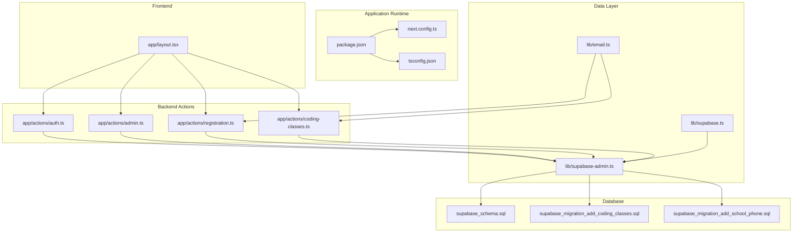
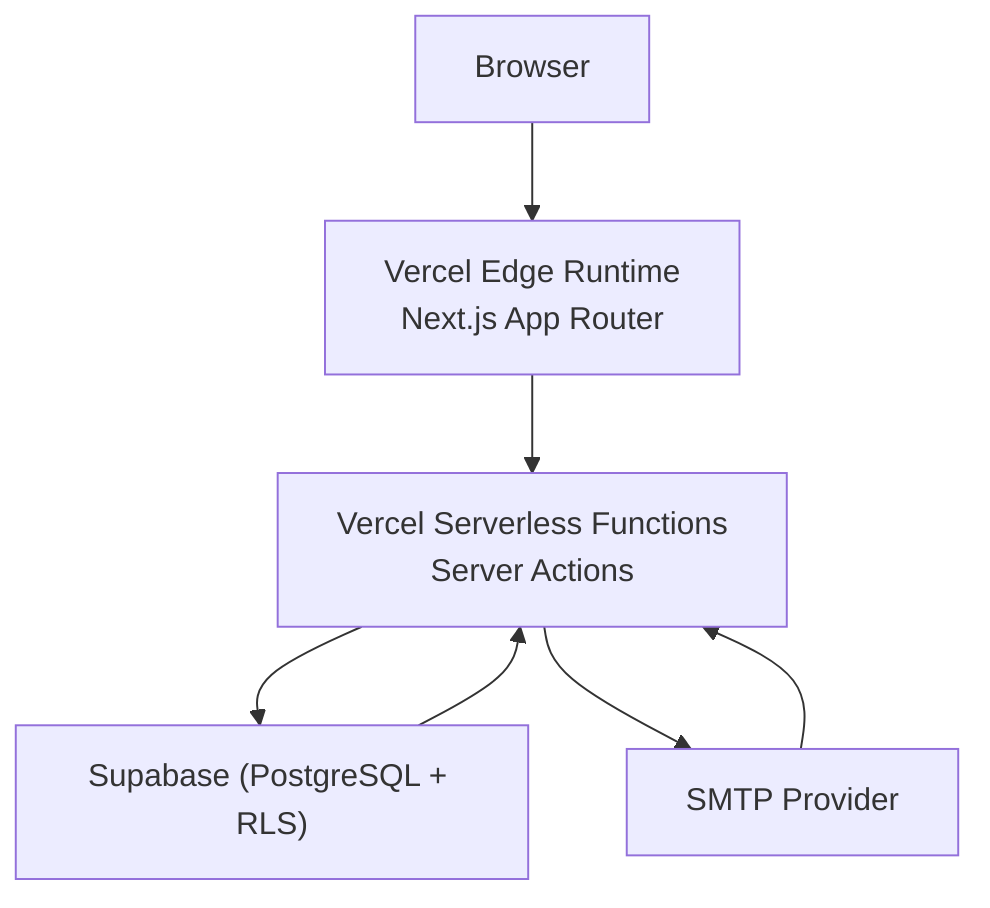
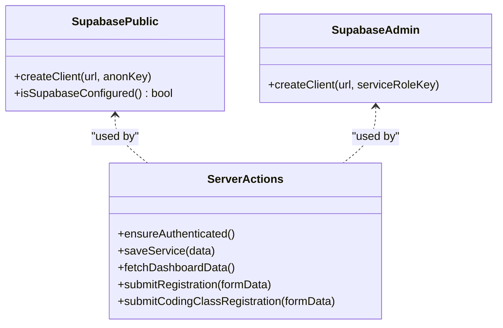
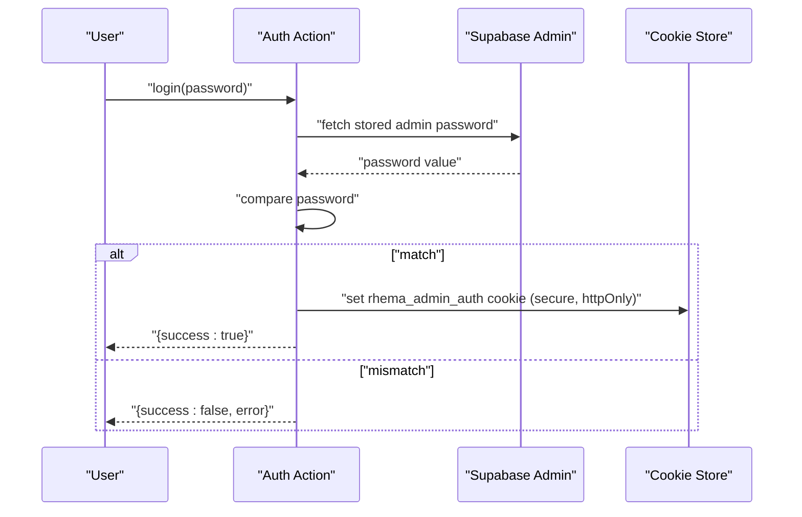
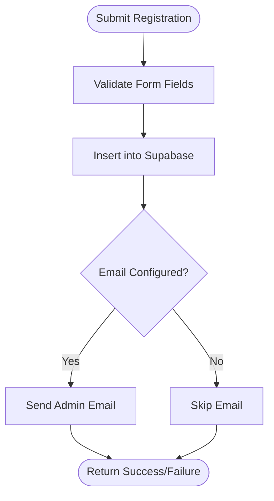
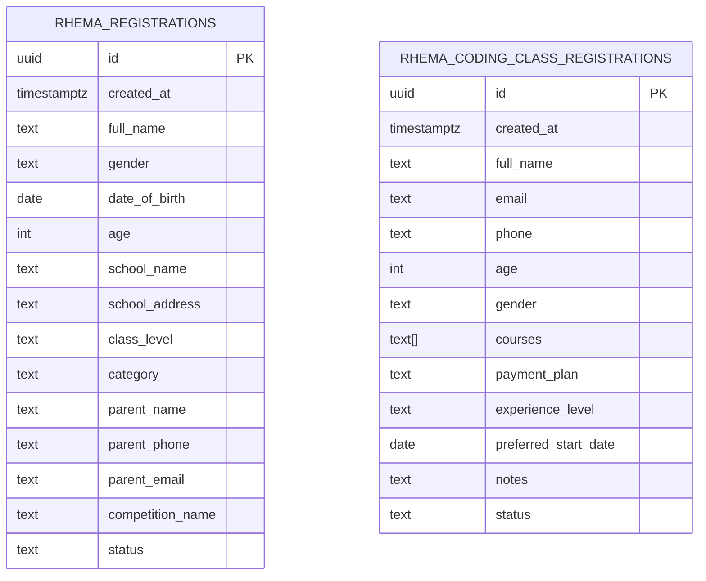
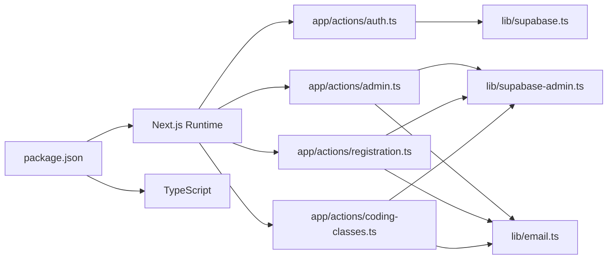

# Deployment and Production

<cite>
**Referenced Files in This Document**
- [package.json](file://package.json)
- [next.config.ts](file://next.config.ts)
- [tsconfig.json](file://tsconfig.json)
- [README.md](file://README.md)
- [lib/supabase.ts](file://lib/supabase.ts)
- [lib/supabase-admin.ts](file://lib/supabase-admin.ts)
- [lib/email.ts](file://lib/email.ts)
- [app/layout.tsx](file://app/layout.tsx)
- [app/actions/auth.ts](file://app/actions/auth.ts)
- [app/actions/admin.ts](file://app/actions/admin.ts)
- [app/actions/registration.ts](file://app/actions/registration.ts)
- [app/actions/coding-classes.ts](file://app/actions/coding-classes.ts)
- [supabase_schema.sql](file://supabase_schema.sql)
- [supabase_migration_add_coding_classes.sql](file://supabase_migration_add_coding_classes.sql)
- [supabase_migration_add_school_phone.sql](file://supabase_migration_add_school_phone.sql)
</cite>

## Table of Contents
1. [Introduction](#introduction)
2. [Project Structure](#project-structure)
3. [Core Components](#core-components)
4. [Architecture Overview](#architecture-overview)
5. [Detailed Component Analysis](#detailed-component-analysis)
6. [Dependency Analysis](#dependency-analysis)
7. [Performance Considerations](#performance-considerations)
8. [Troubleshooting Guide](#troubleshooting-guide)
9. [Conclusion](#conclusion)
10. [Appendices](#appendices)

## Introduction
This document provides comprehensive guidance for deploying and operating Rhema Expert Solutions in production. It covers deployment via Vercel, environment variable configuration, build optimization, continuous deployment setup, production environment requirements, performance monitoring, scaling considerations, security configurations, SSL and access control, maintenance and update strategies, monitoring and logging, backup and disaster recovery, troubleshooting, and cost optimization for Next.js applications.

## Project Structure
The application is a Next.js 16 App Router project with TypeScript. Key areas relevant to deployment and production:
- Application runtime and build scripts are defined in the package manifest.
- Next.js configuration is minimal and can be extended for production optimization.
- Supabase client initialization and admin client setup define backend connectivity and access control.
- Action modules encapsulate server-side logic for authentication, administration, and form submissions.
- Database schema and migrations define the data model and Row Level Security (RLS) policies.

**Diagram sources**
- [package.json:1-32](file://package.json#L1-L32)
- [next.config.ts:1-8](file://next.config.ts#L1-L8)
- [tsconfig.json:1-35](file://tsconfig.json#L1-L35)
- [app/layout.tsx:1-43](file://app/layout.tsx#L1-L43)
- [app/actions/auth.ts:1-55](file://app/actions/auth.ts#L1-L55)
- [app/actions/admin.ts:1-198](file://app/actions/admin.ts#L1-L198)
- [app/actions/registration.ts:1-131](file://app/actions/registration.ts#L1-L131)
- [app/actions/coding-classes.ts:1-157](file://app/actions/coding-classes.ts#L1-L157)
- [lib/supabase.ts:1-25](file://lib/supabase.ts#L1-L25)
- [lib/supabase-admin.ts:1-19](file://lib/supabase-admin.ts#L1-L19)
- [lib/email.ts:1-134](file://lib/email.ts#L1-L134)
- [supabase_schema.sql:1-33](file://supabase_schema.sql#L1-L33)
- [supabase_migration_add_coding_classes.sql:1-30](file://supabase_migration_add_coding_classes.sql#L1-L30)
- [supabase_migration_add_school_phone.sql:1-4](file://supabase_migration_add_school_phone.sql#L1-L4)

**Section sources**
- [package.json:1-32](file://package.json#L1-L32)
- [next.config.ts:1-8](file://next.config.ts#L1-L8)
- [tsconfig.json:1-35](file://tsconfig.json#L1-L35)
- [README.md:1-37](file://README.md#L1-L37)

## Core Components
- Build and runtime scripts: Development, build, start, and lint commands are defined for local and CI environments.
- Next.js configuration: Minimal configuration file ready for extension with production-specific settings.
- TypeScript configuration: Strict compiler options and module resolution suitable for Next.js App Router projects.
- Supabase client initialization: Public client for frontend reads and admin client for server-side writes using a service role key.
- Authentication and access control: Admin authentication via server action with cookie-based session and secure flags in production.
- Email notifications: Nodemailer transport configured via environment variables for administrative notifications.
- Database schema and RLS: Tables for registrations and coding class registrations with Row Level Security and public insert policies.

**Section sources**
- [package.json:5-10](file://package.json#L5-L10)
- [next.config.ts:3-5](file://next.config.ts#L3-L5)
- [tsconfig.json:2-24](file://tsconfig.json#L2-L24)
- [lib/supabase.ts:7-24](file://lib/supabase.ts#L7-L24)
- [lib/supabase-admin.ts:4-18](file://lib/supabase-admin.ts#L4-L18)
- [app/actions/auth.ts:31-42](file://app/actions/auth.ts#L31-L42)
- [lib/email.ts:3-12](file://lib/email.ts#L3-L12)
- [supabase_schema.sql:1-33](file://supabase_schema.sql#L1-L33)
- [supabase_migration_add_coding_classes.sql:1-30](file://supabase_migration_add_coding_classes.sql#L1-L30)

## Architecture Overview
The production architecture centers on a Next.js frontend deployed on Vercel, communicating with Supabase for data persistence and RLS enforcement. Server actions handle sensitive operations server-side, while the admin dashboard uses cookie-based authentication. Emails are sent via Nodemailer using environment credentials.

**Diagram sources**
- [app/actions/auth.ts:1-55](file://app/actions/auth.ts#L1-L55)
- [app/actions/admin.ts:1-198](file://app/actions/admin.ts#L1-L198)
- [app/actions/registration.ts:1-131](file://app/actions/registration.ts#L1-L131)
- [app/actions/coding-classes.ts:1-157](file://app/actions/coding-classes.ts#L1-L157)
- [lib/supabase.ts:1-25](file://lib/supabase.ts#L1-L25)
- [lib/supabase-admin.ts:1-19](file://lib/supabase-admin.ts#L1-L19)
- [lib/email.ts:1-134](file://lib/email.ts#L1-L134)

## Detailed Component Analysis

### Supabase Clients and Environment Variables
- Public client reads: Uses NEXT_PUBLIC_SUPABASE_URL and NEXT_PUBLIC_SUPABASE_ANON_KEY. Falls back gracefully if missing.
- Admin client writes: Uses SUPABASE_SERVICE_ROLE_KEY for bypassing RLS in server actions. Warns if missing.
- Environment variable usage: Centralized in client modules; server actions depend on admin client for protected operations.

**Diagram sources**
- [lib/supabase.ts:16-24](file://lib/supabase.ts#L16-L24)
- [lib/supabase-admin.ts:14-18](file://lib/supabase-admin.ts#L14-L18)
- [app/actions/admin.ts:14-19](file://app/actions/admin.ts#L14-L19)
- [app/actions/registration.ts:22-84](file://app/actions/registration.ts#L22-L84)
- [app/actions/coding-classes.ts:20-76](file://app/actions/coding-classes.ts#L20-L76)

**Section sources**
- [lib/supabase.ts:7-24](file://lib/supabase.ts#L7-L24)
- [lib/supabase-admin.ts:4-18](file://lib/supabase-admin.ts#L4-L18)
- [app/actions/admin.ts:14-19](file://app/actions/admin.ts#L14-L19)

### Authentication and Access Control
- Login flow: Validates against stored admin password (defaults to environment or built-in value), sets a secure, httpOnly cookie in production.
- Logout and check: Deletes cookie and redirects; checks cookie presence for protected routes.
- Authorization guard: Ensures authenticated requests before performing admin operations.

**Diagram sources**
- [app/actions/auth.ts:7-43](file://app/actions/auth.ts#L7-L43)
- [lib/supabase-admin.ts:14-18](file://lib/supabase-admin.ts#L14-L18)

**Section sources**
- [app/actions/auth.ts:31-42](file://app/actions/auth.ts#L31-L42)
- [app/actions/auth.ts:50-54](file://app/actions/auth.ts#L50-L54)

### Email Notifications
- Transport: Nodemailer configured with SMTP_USER and SMTP_PASS.
- Notifications: Admin emails for competition and coding class registrations.
- Failure handling: Logs warnings and errors; returns structured results.

**Diagram sources**
- [app/actions/registration.ts:22-84](file://app/actions/registration.ts#L22-L84)
- [app/actions/coding-classes.ts:20-76](file://app/actions/coding-classes.ts#L20-L76)
- [lib/email.ts:23-44](file://lib/email.ts#L23-L44)

**Section sources**
- [lib/email.ts:3-12](file://lib/email.ts#L3-L12)
- [lib/email.ts:23-44](file://lib/email.ts#L23-L44)

### Database Schema and Policies
- Registrations table: Includes student, school, and parent details with status tracking and RLS enabled.
- Coding class registrations table: Stores course selections, payment plans, and status with public insert and select policies.
- School phone addition: Migration adds optional school phone field.

**Diagram sources**
- [supabase_schema.sql:1-33](file://supabase_schema.sql#L1-L33)
- [supabase_migration_add_coding_classes.sql:1-30](file://supabase_migration_add_coding_classes.sql#L1-L30)
- [supabase_migration_add_school_phone.sql:1-4](file://supabase_migration_add_school_phone.sql#L1-L4)

**Section sources**
- [supabase_schema.sql:1-33](file://supabase_schema.sql#L1-L33)
- [supabase_migration_add_coding_classes.sql:1-30](file://supabase_migration_add_coding_classes.sql#L1-L30)
- [supabase_migration_add_school_phone.sql:1-4](file://supabase_migration_add_school_phone.sql#L1-L4)

## Dependency Analysis
- Next.js runtime and App Router: Defined in package manifest and TypeScript configuration.
- Supabase client libraries: Public and admin clients imported in dedicated modules.
- Email transport: Nodemailer configured via environment variables.
- Action modules: Depend on Supabase admin client and email utilities.

**Diagram sources**
- [package.json:11-18](file://package.json#L11-L18)
- [app/actions/auth.ts:1-55](file://app/actions/auth.ts#L1-L55)
- [app/actions/admin.ts:1-198](file://app/actions/admin.ts#L1-L198)
- [app/actions/registration.ts:1-131](file://app/actions/registration.ts#L1-L131)
- [app/actions/coding-classes.ts:1-157](file://app/actions/coding-classes.ts#L1-L157)
- [lib/supabase.ts:1-25](file://lib/supabase.ts#L1-L25)
- [lib/supabase-admin.ts:1-19](file://lib/supabase-admin.ts#L1-L19)
- [lib/email.ts:1-134](file://lib/email.ts#L1-L134)

**Section sources**
- [package.json:11-18](file://package.json#L11-L18)
- [tsconfig.json:2-24](file://tsconfig.json#L2-L24)

## Performance Considerations
- Build optimization: Leverage Next.js automatic optimizations; consider enabling output traces and profiling during builds.
- Static generation and ISR: Use static generation for content-heavy pages where feasible; implement incremental static regeneration for dynamic content.
- Asset optimization: Utilize Next.js image optimization and CDN caching; ensure proper cache headers.
- Database queries: Batch reads/writes in server actions; avoid unnecessary revalidation; use indexes on frequently queried columns.
- Email delivery: Asynchronous notifications reduce latency; monitor provider quotas and rate limits.
- Monitoring: Track build times, serverless function durations, and database query performance.

[No sources needed since this section provides general guidance]

## Troubleshooting Guide
- Supabase client not configured:
  - Symptom: Console warnings about missing environment variables.
  - Resolution: Set NEXT_PUBLIC_SUPABASE_URL and NEXT_PUBLIC_SUPABASE_ANON_KEY; ensure admin operations set SUPABASE_SERVICE_ROLE_KEY.
- Admin authentication failures:
  - Symptom: Unauthorized responses when accessing admin endpoints.
  - Resolution: Verify cookie presence and secure flags; confirm admin password exists in settings and is not default.
- Email notifications disabled:
  - Symptom: Warning logs indicating missing SMTP credentials.
  - Resolution: Configure SMTP_USER and SMTP_PASS; verify provider settings.
- Database policy errors:
  - Symptom: Write failures when RLS is enabled and service role key is missing.
  - Resolution: Provide SUPABASE_SERVICE_ROLE_KEY to admin client; review RLS policies.

**Section sources**
- [lib/supabase.ts:10-13](file://lib/supabase.ts#L10-L13)
- [lib/supabase-admin.ts:7-9](file://lib/supabase-admin.ts#L7-L9)
- [app/actions/auth.ts:50-54](file://app/actions/auth.ts#L50-L54)
- [lib/email.ts:24-27](file://lib/email.ts#L24-L27)
- [supabase_schema.sql:20-32](file://supabase_schema.sql#L20-L32)

## Conclusion
Deploying Rhema Expert Solutions on Vercel requires careful configuration of environment variables, secure access control via Supabase RLS and admin keys, and robust monitoring and logging. By following the outlined deployment, security, and operational practices, the application can achieve reliable performance, scalability, and maintainability in production.

[No sources needed since this section summarizes without analyzing specific files]

## Appendices

### Deployment on Vercel
- Prerequisites: Git repository connected to Vercel; environment variables configured per production requirements.
- Build command: Use the build script defined in the package manifest.
- Output directory: Next.js default output; no custom output path required.
- Environment variables: Configure all required variables in Vercel project settings.

**Section sources**
- [README.md:32-36](file://README.md#L32-L36)
- [package.json:7](file://package.json#L7)

### Environment Variables Inventory
- Supabase:
  - NEXT_PUBLIC_SUPABASE_URL
  - NEXT_PUBLIC_SUPABASE_ANON_KEY
  - SUPABASE_SERVICE_ROLE_KEY
- Email:
  - SMTP_USER
  - SMTP_PASS
- Admin:
  - ADMIN_PASSWORD (fallback/default for admin dashboard)
- Optional:
  - NODE_ENV (set to production for HTTPS cookie flags)

**Section sources**
- [lib/supabase.ts:7-8](file://lib/supabase.ts#L7-L8)
- [lib/supabase-admin.ts:4-5](file://lib/supabase-admin.ts#L4-L5)
- [lib/email.ts:3-4](file://lib/email.ts#L3-L4)
- [app/actions/auth.ts:20](file://app/actions/auth.ts#L20)

### Production Security Checklist
- Enforce HTTPS cookies for admin sessions.
- Restrict Supabase RLS policies and use service role key for server actions.
- Rotate secrets regularly; limit access to service role key.
- Monitor and audit admin actions and database changes.

**Section sources**
- [app/actions/auth.ts:35](file://app/actions/auth.ts#L35)
- [lib/supabase-admin.ts:14-18](file://lib/supabase-admin.ts#L14-L18)
- [supabase_schema.sql:20-32](file://supabase_schema.sql#L20-L32)

### Monitoring and Logging
- Frontend: Use Vercel Analytics and Next.js telemetry where applicable.
- Backend: Log errors and warnings in server actions and email utilities.
- Database: Track query performance and policy violations via Supabase logs.

**Section sources**
- [lib/email.ts:39-43](file://lib/email.ts#L39-L43)
- [app/actions/registration.ts:67-70](file://app/actions/registration.ts#L67-L70)
- [app/actions/coding-classes.ts:64-68](file://app/actions/coding-classes.ts#L64-L68)

### Backup and Disaster Recovery
- Database backups: Enable automated backups in Supabase; test restoration procedures.
- Version control: Maintain migrations and schema definitions in the repository.
- Secrets management: Store environment variables securely in Vercel and rotate periodically.

**Section sources**
- [supabase_schema.sql:1-33](file://supabase_schema.sql#L1-L33)
- [supabase_migration_add_coding_classes.sql:1-30](file://supabase_migration_add_coding_classes.sql#L1-L30)
- [supabase_migration_add_school_phone.sql:1-4](file://supabase_migration_add_school_phone.sql#L1-L4)

### Cost Optimization Strategies
- Reduce serverless function cold starts by minimizing dependencies and bundling efficiently.
- Optimize database queries and use indexing to lower compute costs.
- Use Vercel’s edge network and caching to minimize origin requests.
- Monitor email provider usage to avoid overages.

**Section sources**
- [package.json:11-18](file://package.json#L11-L18)
- [lib/email.ts:3-12](file://lib/email.ts#L3-L12)