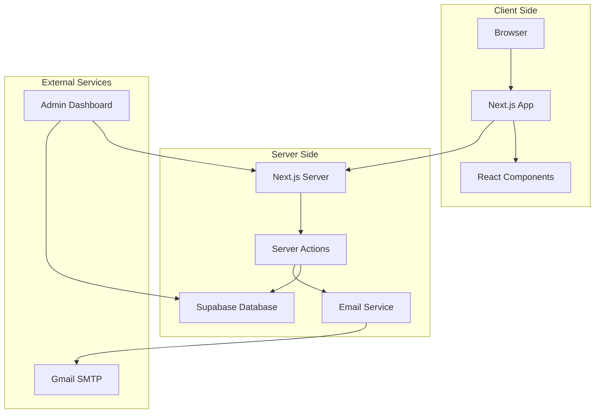
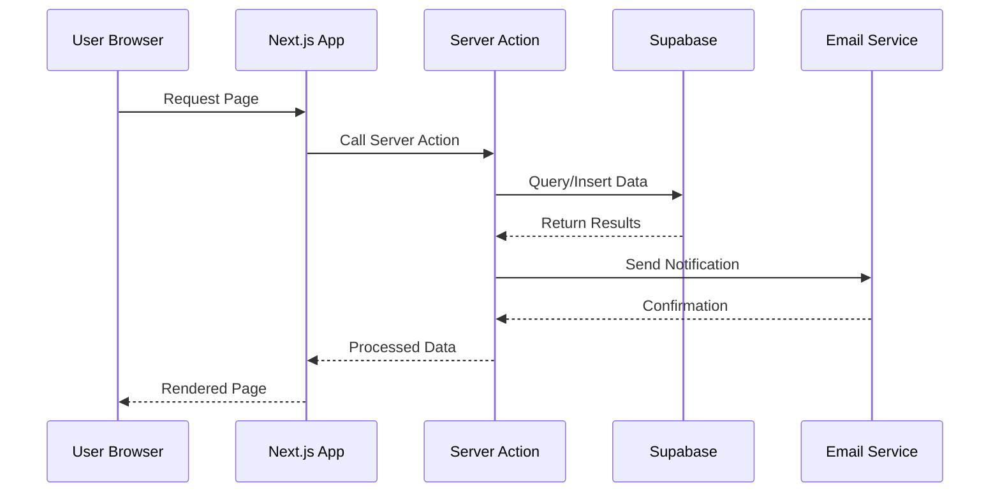
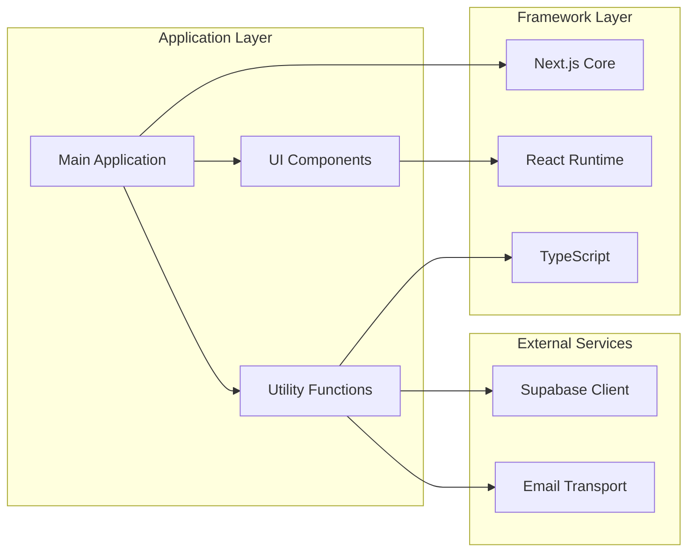

# Getting Started

<cite>
**Referenced Files in This Document**
- [README.md](file://README.md)
- [package.json](file://package.json)
- [next.config.ts](file://next.config.ts)
- [tsconfig.json](file://tsconfig.json)
- [eslint.config.mjs](file://eslint.config.mjs)
- [postcss.config.mjs](file://postcss.config.mjs)
- [app/layout.tsx](file://app/layout.tsx)
- [app/page.tsx](file://app/page.tsx)
- [components/Header.tsx](file://components/Header.tsx)
- [app/globals.css](file://app/globals.css)
- [lib/supabase.ts](file://lib/supabase.ts)
- [lib/email.ts](file://lib/email.ts)
- [types/supabase.ts](file://types/supabase.ts)
- [app/actions/auth.ts](file://app/actions/auth.ts)
- [app/actions/registration.ts](file://app/actions/registration.ts)
- [app/admin/dashboard/page.tsx](file://app/admin/dashboard/page.tsx)
</cite>

## Table of Contents
1. [Introduction](#introduction)
2. [Prerequisites](#prerequisites)
3. [Development Environment Setup](#development-environment-setup)
4. [Step-by-Step Installation](#step-by-step-installation)
5. [Local Development Server](#local-development-server)
6. [Environment Variables](#environment-variables)
7. [Initial Project Exploration](#initial-project-our-project-exploration)
8. [Practical Examples](#practical-examples)
9. [Architecture Overview](#architecture-overview)
10. [Dependency Analysis](#dependency-analysis)
11. [Performance Considerations](#performance-considerations)
12. [Troubleshooting Guide](#troubleshooting-guide)
13. [Verification Checklist](#verification-checklist)
14. [Conclusion](#conclusion)

## Introduction
Rhema Expert Solutions is a modern Next.js application built with TypeScript, featuring dynamic content management, email notifications, and administrative dashboards. The project showcases professional technology services including coding classes, competitions, and various tech domains. This guide will help you set up the development environment, understand the project structure, and run the application locally.

## Prerequisites
Before you begin, ensure you have the following installed:
- Node.js 18.x or later
- npm 8.x or later
- Git for version control
- Basic understanding of React and TypeScript fundamentals
- Familiarity with Next.js concepts (pages, components, server actions)

## Development Environment Setup
### System Requirements
- Operating System: Windows, macOS, or Linux
- RAM: Minimum 8GB recommended
- Storage: 500MB+ free space
- Network: Stable internet connection for dependency downloads

### Recommended Tools
- Code Editor: VS Code with TypeScript extensions
- Browser: Latest Chrome/Firefox for testing
- Terminal: PowerShell (Windows) or Terminal (macOS/Linux)

## Step-by-Step Installation
### 1. Clone the Repository
```bash
git clone https://github.com/rhemaexpertsolutions/rhemaexpertsolutions.git
cd rhemaexpertsolutions
```

### 2. Install Dependencies
Choose one of the following package managers:

Using npm:
```bash
npm install
```

Using yarn:
```bash
yarn install
```

Using pnpm:
```bash
pnpm install
```

Using bun:
```bash
bun install
```

### 3. Verify Installation
Check that all dependencies are properly installed:
```bash
npm run build
```

If the build completes successfully, your environment is ready.

**Section sources**
- [README.md:3-37](file://README.md#L3-L37)
- [package.json:1-32](file://package.json#L1-L32)

## Local Development Server
### Starting the Development Server
Navigate to the project root directory and run:

Using npm:
```bash
npm run dev
```

Using yarn:
```bash
yarn dev
```

Using pnpm:
```bash
pnpm dev
```

Using bun:
```bash
bun dev
```

### Access the Application
Once the server starts successfully, open your browser and navigate to:
```
http://localhost:3000
```

You should see the main homepage with dynamic content loading from Supabase.

### Development Features
- Hot reloading enabled for instant code updates
- Type checking during development
- ESLint integration for code quality
- Tailwind CSS for styling

**Section sources**
- [README.md:5-17](file://README.md#L5-L17)

## Environment Variables
### Required Variables
The application requires the following environment variables:

For Supabase integration:
```env
NEXT_PUBLIC_SUPABASE_URL=your_supabase_project_url
NEXT_PUBLIC_SUPABASE_ANON_KEY=your_anon_key
```

For email functionality:
```env
SMTP_USER=your_gmail_account
SMTP_PASS=your_app_password
```

For admin authentication:
```env
ADMIN_PASSWORD=your_desired_admin_password
```

### Optional Variables
Additional variables for enhanced functionality:
```env
NODE_ENV=development
```

### Variable Configuration Steps
1. Create a `.env.local` file in the project root
2. Add the required variables with your actual values
3. Save the file and restart the development server

**Section sources**
- [lib/supabase.ts:7-24](file://lib/supabase.ts#L7-L24)
- [lib/email.ts:3-12](file://lib/email.ts#L3-L12)
- [app/actions/auth.ts:19-29](file://app/actions/auth.ts#L19-L29)

## Initial Project Exploration
### Project Structure Overview
The application follows Next.js App Router conventions with the following key directories:

```
app/                 # Next.js App Router pages and layouts
├── actions/         # Server actions for data operations
├── admin/           # Administrative dashboard
├── coding-classes/  # Coding classes page
├── competition/     # Competition registration page
├── verification-success/ # Verification success page
├── layout.tsx       # Root layout component
├── page.tsx         # Main homepage
└── globals.css      # Global styles
```

### Key Components
- **Header Component**: Responsive navigation with mobile menu
- **Hero Section**: Dynamic slideshow with promotional content
- **Services Section**: Dynamic service listings from database
- **Admin Dashboard**: Full CRUD operations for content management

### Understanding the Data Flow
The application uses Supabase for data persistence and email notifications for user registrations.

**Section sources**
- [app/layout.tsx:1-43](file://app/layout.tsx#L1-L43)
- [app/page.tsx:12-42](file://app/page.tsx#L12-L42)
- [components/Header.tsx:1-136](file://components/Header.tsx#L1-L136)

## Practical Examples
### Running the Application Locally
1. Ensure all dependencies are installed
2. Start the development server
3. Open `http://localhost:3000` in your browser
4. Explore different sections:
   - Home page with dynamic content
   - Coding classes page (`/coding-classes`)
   - Competition page (`/competition`)
   - Admin dashboard (`/admin`)

### Accessing Different Pages
- **Homepage**: `http://localhost:3000`
- **Coding Classes**: `http://localhost:3000/coding-classes`
- **Competition**: `http://localhost:3000/competition`
- **Admin Login**: `http://localhost:3000/admin`
- **Admin Dashboard**: `http://localhost:3000/admin/dashboard`

### Understanding Project Structure
1. **app/**: Contains all Next.js App Router files
2. **components/**: Reusable React components
3. **lib/**: Utility libraries and configurations
4. **types/**: TypeScript type definitions
5. **public/**: Static assets and media files

**Section sources**
- [app/page.tsx:224-787](file://app/page.tsx#L224-L787)
- [app/admin/dashboard/page.tsx:27-102](file://app/admin/dashboard/page.tsx#L27-L102)

## Architecture Overview
### System Architecture


### Data Flow Architecture


**Diagram sources**
- [app/page.tsx:21-42](file://app/page.tsx#L21-L42)
- [lib/supabase.ts:16-19](file://lib/supabase.ts#L16-L19)
- [lib/email.ts:23-44](file://lib/email.ts#L23-L44)

## Dependency Analysis
### Core Dependencies
The project uses modern web development technologies:

**Runtime Dependencies:**
- `next`: Framework for production and development
- `react` & `react-dom`: UI library
- `@supabase/supabase-js`: Database and authentication
- `nodemailer`: Email sending functionality

**Development Dependencies:**
- `typescript`: Type safety
- `eslint`: Code linting
- `tailwindcss`: CSS framework
- `@types/*`: Type definitions

### Dependency Management


**Diagram sources**
- [package.json:11-18](file://package.json#L11-L18)
- [package.json:19-30](file://package.json#L19-L30)

**Section sources**
- [package.json:1-32](file://package.json#L1-L32)
- [tsconfig.json:2-24](file://tsconfig.json#L2-L24)

## Performance Considerations
### Optimization Strategies
1. **Code Splitting**: Next.js automatically handles route-based code splitting
2. **Image Optimization**: Uses Next.js Image component for optimized images
3. **CSS Optimization**: Tailwind CSS with purge configuration
4. **Lazy Loading**: Components are loaded on demand

### Monitoring Performance
- Use browser developer tools to monitor bundle sizes
- Check network tab for optimization opportunities
- Monitor console for runtime errors

## Troubleshooting Guide
### Common Issues and Solutions

#### Development Server Won't Start
**Problem**: Server fails to start with port conflicts
**Solution**: Change port in `next.config.ts` or kill existing processes
```typescript
const nextConfig = {
  // Add port configuration
  serverRuntimeConfig: {
    port: 3001,
  },
};
```

#### Supabase Connection Issues
**Problem**: Dynamic content not loading
**Solution**: Verify environment variables are correctly set
```bash
# Check if variables are loaded
echo $NEXT_PUBLIC_SUPABASE_URL
echo $NEXT_PUBLIC_SUPABASE_ANON_KEY
```

#### Email Functionality Not Working
**Problem**: Registration emails not being sent
**Solution**: Configure Gmail SMTP properly
1. Enable 2-factor authentication on Gmail
2. Generate app-specific password
3. Update `.env.local` with correct credentials

#### Build Errors
**Problem**: TypeScript compilation errors
**Solution**: Run type checking separately
```bash
npx tsc --noEmit
```

#### Hot Reload Not Working
**Problem**: Changes not reflecting in browser
**Solution**: Clear Next.js cache
```bash
rm -rf .next
npm run dev
```

**Section sources**
- [lib/supabase.ts:10-13](file://lib/supabase.ts#L10-L13)
- [lib/email.ts:24-27](file://lib/email.ts#L24-L27)
- [app/actions/auth.ts:31-43](file://app/actions/auth.ts#L31-L43)

## Verification Checklist
### Post-Installation Verification
Complete these steps to ensure proper setup:

1. **Dependencies Installation**
   - [ ] All packages installed without errors
   - [ ] No peer dependency warnings

2. **Development Server**
   - [ ] Server starts on `localhost:3000`
   - [ ] No compilation errors in terminal
   - [ ] Browser opens automatically

3. **Environment Variables**
   - [ ] `.env.local` file exists
   - [ ] Supabase variables configured
   - [ ] Email variables configured (optional)

4. **Application Functionality**
   - [ ] Homepage loads successfully
   - [ ] Navigation works correctly
   - [ ] Admin dashboard accessible
   - [ ] Email functionality testable

5. **Build Process**
   - [ ] Production build succeeds
   - [ ] No type errors
   - [ ] Bundle analysis shows reasonable size

### Quick Tests
Run these commands to verify setup:

```bash
# Test development server
npm run dev

# Test type checking
npx tsc --noEmit

# Test linting
npm run lint

# Test production build
npm run build
```

## Conclusion
You now have a comprehensive understanding of the Rhema Expert Solutions project setup and operation. The application leverages modern web technologies including Next.js, TypeScript, Supabase, and Tailwind CSS to deliver a professional technology services website with dynamic content management capabilities.

### Next Steps
1. Explore the admin dashboard for content management
2. Test email functionality with real registrations
3. Customize the design using Tailwind CSS classes
4. Extend functionality by adding new routes in the `app/` directory
5. Implement additional Supabase tables as needed

### Learning Resources
- [Next.js Documentation](https://nextjs.org/docs)
- [TypeScript Documentation](https://www.typescriptlang.org/docs/)
- [Supabase Documentation](https://supabase.com/docs)
- [Tailwind CSS Documentation](https://tailwindcss.com/docs)

The project provides a solid foundation for building scalable web applications with modern development practices and can serve as a template for similar technology-focused websites.