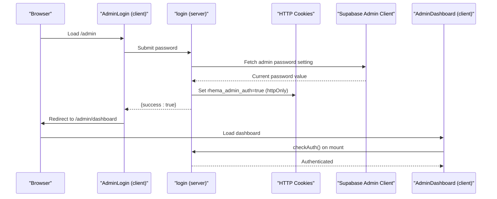
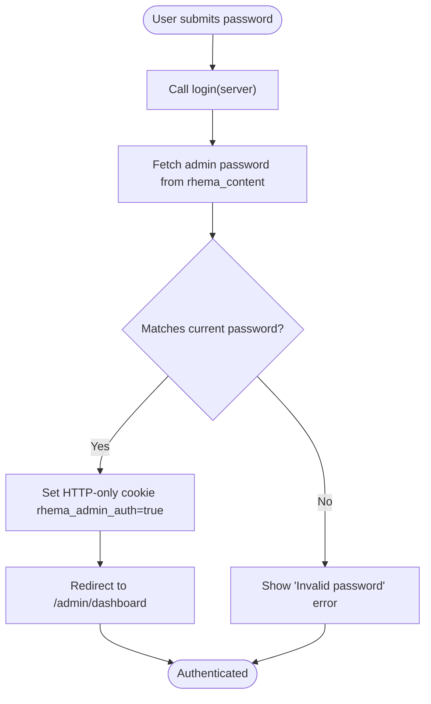
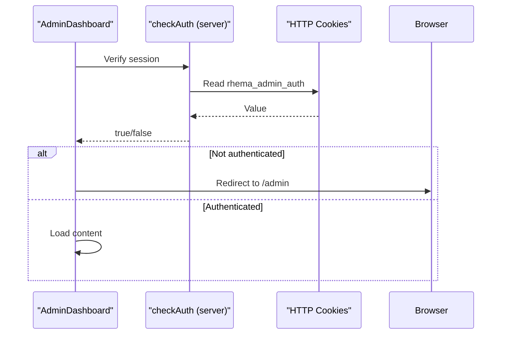
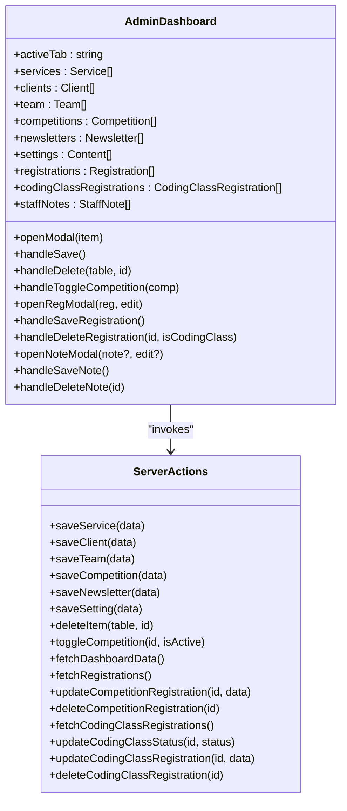
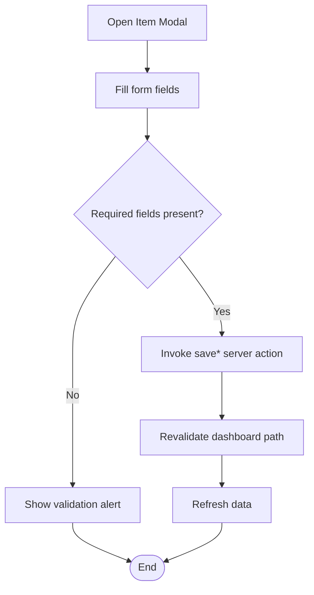
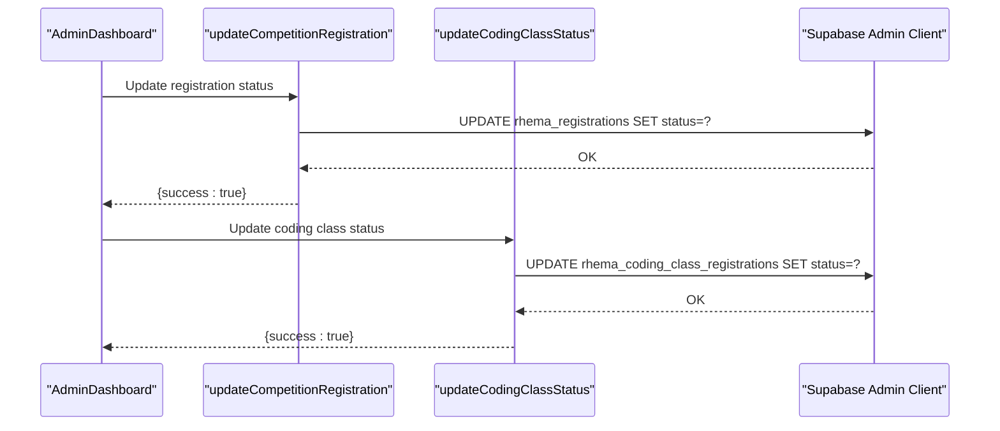
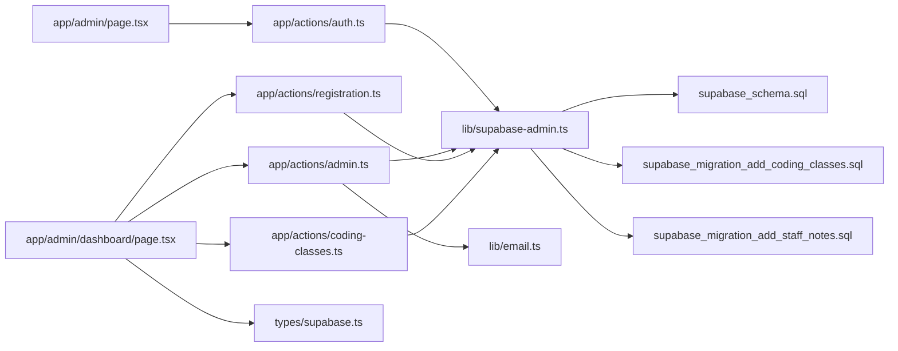

# Admin Interface

<cite>
**Referenced Files in This Document**
- [app/admin/page.tsx](file://app/admin/page.tsx)
- [app/admin/dashboard/page.tsx](file://app/admin/dashboard/page.tsx)
- [app/actions/auth.ts](file://app/actions/auth.ts)
- [app/actions/admin.ts](file://app/actions/admin.ts)
- [app/actions/registration.ts](file://app/actions/registration.ts)
- [app/actions/coding-classes.ts](file://app/actions/coding-classes.ts)
- [lib/supabase-admin.ts](file://lib/supabase-admin.ts)
- [lib/email.ts](file://lib/email.ts)
- [types/supabase.ts](file://types/supabase.ts)
- [supabase_schema.sql](file://supabase_schema.sql)
- [supabase_migration_add_coding_classes.sql](file://supabase_migration_add_coding_classes.sql)
- [supabase_migration_add_staff_notes.sql](file://supabase_migration_add_staff_notes.sql)
</cite>

## Table of Contents
1. [Introduction](#introduction)
2. [Project Structure](#project-structure)
3. [Core Components](#core-components)
4. [Architecture Overview](#architecture-overview)
5. [Detailed Component Analysis](#detailed-component-analysis)
6. [Dependency Analysis](#dependency-analysis)
7. [Performance Considerations](#performance-considerations)
8. [Security and Access Control](#security-and-access-control)
9. [Administrative Workflows](#administrative-workflows)
10. [Troubleshooting Guide](#troubleshooting-guide)
11. [Conclusion](#conclusion)

## Introduction
This document provides comprehensive documentation for the administrative interface of Rhema Expert Solutions. It covers the admin login and authentication flow, protected routes, session management, and the admin dashboard. The dashboard enables administrators to manage services, clients, team members, competitions, newsletter posts, general settings, student registrations for competitions and coding classes, and internal staff notes. It also documents the integration with server actions for data manipulation, the underlying Supabase schema, and operational guidelines for security, monitoring, and performance.

## Project Structure
The admin interface is organized under the Next.js app directory structure with dedicated client and server components:
- Authentication and admin pages: app/admin/*
- Admin dashboard: app/admin/dashboard/page.tsx
- Server actions: app/actions/*
- Supabase client for admin operations: lib/supabase-admin.ts
- Type definitions: types/supabase.ts
- Database migrations: supabase_*.sql files

```mermaid
graph TB
subgraph "Client Pages"
AdminLogin["app/admin/page.tsx"]
Dashboard["app/admin/dashboard/page.tsx"]
end
subgraph "Server Actions"
AuthActions["app/actions/auth.ts"]
AdminActions["app/actions/admin.ts"]
RegActions["app/actions/registration.ts"]
CodingActions["app/actions/coding-classes.ts"]
end
subgraph "Libraries"
SupabaseAdmin["lib/supabase-admin.ts"]
EmailLib["lib/email.ts"]
end
subgraph "Types"
Types["types/supabase.ts"]
end
subgraph "Database"
Schema["supabase_schema.sql"]
CodingSchema["supabase_migration_add_coding_classes.sql"]
NotesSchema["supabase_migration_add_staff_notes.sql"]
end
AdminLogin --> AuthActions
Dashboard --> AdminActions
Dashboard --> RegActions
Dashboard --> CodingActions
AuthActions --> SupabaseAdmin
AdminActions --> SupabaseAdmin
RegActions --> SupabaseAdmin
CodingActions --> SupabaseAdmin
AdminActions --> EmailLib
Dashboard --> Types
SupabaseAdmin --> Schema
SupabaseAdmin --> CodingSchema
SupabaseAdmin --> NotesSchema
```

**Diagram sources**
- [app/admin/page.tsx:1-52](file://app/admin/page.tsx#L1-L52)
- [app/admin/dashboard/page.tsx:1-1524](file://app/admin/dashboard/page.tsx#L1-L1524)
- [app/actions/auth.ts:1-55](file://app/actions/auth.ts#L1-L55)
- [app/actions/admin.ts:1-198](file://app/actions/admin.ts#L1-L198)
- [app/actions/registration.ts:1-131](file://app/actions/registration.ts#L1-L131)
- [app/actions/coding-classes.ts:1-157](file://app/actions/coding-classes.ts#L1-L157)
- [lib/supabase-admin.ts:1-19](file://lib/supabase-admin.ts#L1-L19)
- [lib/email.ts:1-134](file://lib/email.ts#L1-L134)
- [types/supabase.ts:1-113](file://types/supabase.ts#L1-L113)
- [supabase_schema.sql:1-33](file://supabase_schema.sql#L1-L33)
- [supabase_migration_add_coding_classes.sql:1-30](file://supabase_migration_add_coding_classes.sql#L1-L30)
- [supabase_migration_add_staff_notes.sql:1-44](file://supabase_migration_add_staff_notes.sql#L1-L44)

**Section sources**
- [app/admin/page.tsx:1-52](file://app/admin/page.tsx#L1-L52)
- [app/admin/dashboard/page.tsx:1-1524](file://app/admin/dashboard/page.tsx#L1-L1524)
- [app/actions/auth.ts:1-55](file://app/actions/auth.ts#L1-L55)
- [app/actions/admin.ts:1-198](file://app/actions/admin.ts#L1-L198)
- [lib/supabase-admin.ts:1-19](file://lib/supabase-admin.ts#L1-L19)
- [types/supabase.ts:1-113](file://types/supabase.ts#L1-L113)
- [supabase_schema.sql:1-33](file://supabase_schema.sql#L1-L33)
- [supabase_migration_add_coding_classes.sql:1-30](file://supabase_migration_add_coding_classes.sql#L1-L30)
- [supabase_migration_add_staff_notes.sql:1-44](file://supabase_migration_add_staff_notes.sql#L1-L44)

## Core Components
- Admin Login Page: Provides a password-based login form that triggers a server action for authentication.
- Admin Dashboard: A comprehensive management interface with tabs for services, clients, team, competitions, newsletter, general settings, registrations, coding class registrations, and staff notes.
- Server Actions: Encapsulate all admin operations including CRUD for content, registration management, and settings updates.
- Supabase Admin Client: Uses a service role key to bypass Row Level Security for privileged operations.
- Email Notifications: Automated emails for new competition and coding class registrations.

**Section sources**
- [app/admin/page.tsx:7-51](file://app/admin/page.tsx#L7-L51)
- [app/admin/dashboard/page.tsx:28-1523](file://app/admin/dashboard/page.tsx#L28-L1523)
- [app/actions/admin.ts:21-197](file://app/actions/admin.ts#L21-L197)
- [lib/supabase-admin.ts:3-18](file://lib/supabase-admin.ts#L3-L18)
- [lib/email.ts:46-133](file://lib/email.ts#L46-L133)

## Architecture Overview
The admin interface follows a client-server architecture with Next.js App Router:
- Client-side pages render UI and trigger server actions.
- Server actions perform authentication checks, interact with Supabase using the admin client, and manage data.
- Session management relies on HTTP-only cookies set after successful authentication.
- Real-time-like updates leverage Next.js revalidation after mutations.



**Diagram sources**
- [app/admin/page.tsx:12-23](file://app/admin/page.tsx#L12-L23)
- [app/actions/auth.ts:7-43](file://app/actions/auth.ts#L7-L43)
- [lib/supabase-admin.ts:14-18](file://lib/supabase-admin.ts#L14-L18)
- [app/admin/dashboard/page.tsx:67-77](file://app/admin/dashboard/page.tsx#L67-L77)

## Detailed Component Analysis

### Admin Login Page
- Purpose: Secure entry point requiring a password stored in Supabase settings.
- Behavior: On submit, invokes the login server action which validates the password against the stored value, sets an HTTP-only session cookie, and redirects to the dashboard.
- Error Handling: Displays invalid password errors and prevents navigation on failure.



**Diagram sources**
- [app/admin/page.tsx:12-23](file://app/admin/page.tsx#L12-L23)
- [app/actions/auth.ts:7-43](file://app/actions/auth.ts#L7-L43)

**Section sources**
- [app/admin/page.tsx:7-51](file://app/admin/page.tsx#L7-L51)
- [app/actions/auth.ts:7-43](file://app/actions/auth.ts#L7-L43)

### Protected Routes and Session Management
- Authentication Guard: The dashboard verifies authentication on mount using checkAuth, redirecting unauthenticated users to the login page.
- Session Cookie: A secure, HTTP-only cookie named rhema_admin_auth maintains the session for up to seven days.
- Logout: Clears the session cookie and redirects to the login page.



**Diagram sources**
- [app/admin/dashboard/page.tsx:67-77](file://app/admin/dashboard/page.tsx#L67-L77)
- [app/actions/auth.ts:50-54](file://app/actions/auth.ts#L50-L54)

**Section sources**
- [app/admin/dashboard/page.tsx:67-77](file://app/admin/dashboard/page.tsx#L67-L77)
- [app/actions/auth.ts:45-54](file://app/actions/auth.ts#L45-L54)

### Admin Dashboard Functionality
- Tabs and Sections:
  - Services: Manage service entries with title and description.
  - Clients: Manage client organizations.
  - Team: Manage team member profiles with roles.
  - Competitions: Manage competition details and toggle activity status.
  - Newsletter: Create and manage posts.
  - General Settings: Edit site content settings.
  - Competition Registrations: View, edit, and delete registration records.
  - Coding Class Registrations: View, edit, update status, and delete records.
  - Staff E-Notes: Internal note-taking with categories, priorities, statuses, tags, and file attachments.
- Modals: Unified modal for adding/editing items across most sections; separate modals for viewing/editing registrations and staff notes.
- Data Fetching: On mount, fetches dashboard data and dependent registration lists; supports pagination and filtering for staff notes.



**Diagram sources**
- [app/admin/dashboard/page.tsx:28-1523](file://app/admin/dashboard/page.tsx#L28-L1523)
- [app/actions/admin.ts:21-197](file://app/actions/admin.ts#L21-L197)
- [app/actions/registration.ts:86-130](file://app/actions/registration.ts#L86-L130)
- [app/actions/coding-classes.ts:78-156](file://app/actions/coding-classes.ts#L78-L156)

**Section sources**
- [app/admin/dashboard/page.tsx:1022-1523](file://app/admin/dashboard/page.tsx#L1022-L1523)
- [app/actions/admin.ts:38-98](file://app/actions/admin.ts#L38-L98)
- [app/actions/registration.ts:86-130](file://app/actions/registration.ts#L86-L130)
- [app/actions/coding-classes.ts:78-156](file://app/actions/coding-classes.ts#L78-L156)

### Course Management Features
- CRUD Operations: Add, edit, and delete services, clients, team members, competitions, and newsletter posts.
- Bulk Operations: Toggle competition activity status; update coding class registration status via dropdown selection.
- Validation: Form-level validation ensures required fields are present before saving.



**Diagram sources**
- [app/admin/dashboard/page.tsx:151-202](file://app/admin/dashboard/page.tsx#L151-L202)
- [app/actions/admin.ts:21-197](file://app/actions/admin.ts#L21-L197)

**Section sources**
- [app/admin/dashboard/page.tsx:1062-1156](file://app/admin/dashboard/page.tsx#L1062-L1156)
- [app/actions/admin.ts:21-197](file://app/actions/admin.ts#L21-L197)

### Student Enrollment Tracking
- Competition Registrations: View student details, school info, parent contact, and status; edit or delete records; open detailed modal for comprehensive editing.
- Coding Class Registrations: View student profile, selected courses, payment plans, experience level, preferred start date, and status; update status directly from the table.



**Diagram sources**
- [app/admin/dashboard/page.tsx:243-278](file://app/admin/dashboard/page.tsx#L243-L278)
- [app/actions/registration.ts:102-115](file://app/actions/registration.ts#L102-L115)
- [app/actions/coding-classes.ts:98-116](file://app/actions/coding-classes.ts#L98-L116)

**Section sources**
- [app/admin/dashboard/page.tsx:1203-1369](file://app/admin/dashboard/page.tsx#L1203-L1369)
- [app/actions/registration.ts:102-115](file://app/actions/registration.ts#L102-L115)
- [app/actions/coding-classes.ts:98-116](file://app/actions/coding-classes.ts#L98-L116)

### Administrative Reporting Capabilities
- Registration Reports: Comprehensive tables for competition and coding class registrations with sorting and filtering.
- Staff E-Notes: Paginated list with search and filters by status, category, and priority; supports pinning and file attachments.

**Section sources**
- [app/admin/dashboard/page.tsx:1203-1518](file://app/admin/dashboard/page.tsx#L1203-L1518)

### Dashboard Layout and Data Visualization
- Layout: Responsive two-column design with a sidebar navigation and main content area.
- Visual Indicators: Color-coded status badges for registration records; category/priority tags for staff notes; pinned notes highlighted.
- Interactive Elements: Inline status updates for coding class registrations; modal-based editing for all content types.

**Section sources**
- [app/admin/dashboard/page.tsx:1027-1523](file://app/admin/dashboard/page.tsx#L1027-L1523)

### Integration Between Admin Pages and Server Actions
- Data Manipulation: All modifications are performed via server actions that validate authentication and interact with Supabase using the admin client.
- Email Notifications: New registrations trigger automated emails to administrators.
- Revalidation: After mutations, dashboard data is revalidated to reflect changes immediately.

**Section sources**
- [app/actions/admin.ts:14-19](file://app/actions/admin.ts#L14-L19)
- [lib/email.ts:46-133](file://lib/email.ts#L46-L133)
- [app/admin/dashboard/page.tsx:198-202](file://app/admin/dashboard/page.tsx#L198-L202)

## Dependency Analysis
The admin interface exhibits clear separation of concerns:
- Client pages depend on server actions for all data operations.
- Server actions depend on the Supabase admin client and email library.
- Supabase admin client depends on environment variables for credentials.
- Dashboard types define the shape of data exchanged between client and server.



**Diagram sources**
- [app/admin/page.tsx:5](file://app/admin/page.tsx#L5)
- [app/admin/dashboard/page.tsx:6-10](file://app/admin/dashboard/page.tsx#L6-L10)
- [app/actions/auth.ts:5](file://app/actions/auth.ts#L5)
- [app/actions/admin.ts:3](file://app/actions/admin.ts#L3)
- [app/actions/registration.ts:3](file://app/actions/registration.ts#L3)
- [app/actions/coding-classes.ts:4](file://app/actions/coding-classes.ts#L4)
- [lib/supabase-admin.ts:14-18](file://lib/supabase-admin.ts#L14-L18)
- [lib/email.ts:1-134](file://lib/email.ts#L1-L134)
- [types/supabase.ts:1-113](file://types/supabase.ts#L1-L113)
- [supabase_schema.sql:1-33](file://supabase_schema.sql#L1-L33)
- [supabase_migration_add_coding_classes.sql:1-30](file://supabase_migration_add_coding_classes.sql#L1-L30)
- [supabase_migration_add_staff_notes.sql:1-44](file://supabase_migration_add_staff_notes.sql#L1-L44)

**Section sources**
- [app/admin/page.tsx:5](file://app/admin/page.tsx#L5)
- [app/admin/dashboard/page.tsx:6-10](file://app/admin/dashboard/page.tsx#L6-L10)
- [app/actions/auth.ts:5](file://app/actions/auth.ts#L5)
- [app/actions/admin.ts:3](file://app/actions/admin.ts#L3)
- [lib/supabase-admin.ts:14-18](file://lib/supabase-admin.ts#L14-L18)

## Performance Considerations
- Parallel Data Fetching: The dashboard fetches multiple datasets concurrently to reduce total loading time.
- Revalidation Strategy: Mutations trigger targeted revalidation to keep the UI fresh without full-page reloads.
- Pagination: Staff notes support pagination to manage large lists efficiently.
- Recommendations:
  - Consider caching strategies for frequently accessed static content.
  - Implement virtualized lists for very large registration tables.
  - Optimize database queries with appropriate indexes (already present in migrations).

**Section sources**
- [app/admin/dashboard/page.tsx:89-126](file://app/admin/dashboard/page.tsx#L89-L126)
- [app/actions/admin.ts:49-56](file://app/actions/admin.ts#L49-L56)
- [supabase_migration_add_staff_notes.sql:17-21](file://supabase_migration_add_staff_notes.sql#L17-L21)

## Security and Access Control
- Authentication: Password-based login with dynamic retrieval of the admin password from Supabase settings; falls back to environment variable if not found.
- Session Management: HTTP-only, secure cookies with a seven-day expiration; logout clears the cookie.
- Authorization: All server actions enforce authentication via a helper that checks the session cookie.
- Supabase Client: Uses a service role key to bypass RLS for admin operations; warns if the key is missing.
- Data Protection:
  - Email configuration is optional; missing credentials prevent email notifications.
  - RLS policies are defined for registration and coding class tables to restrict public access except for inserts.

**Section sources**
- [app/actions/auth.ts:7-43](file://app/actions/auth.ts#L7-L43)
- [app/actions/auth.ts:45-54](file://app/actions/auth.ts#L45-L54)
- [lib/supabase-admin.ts:7-9](file://lib/supabase-admin.ts#L7-L9)
- [supabase_schema.sql:20-32](file://supabase_schema.sql#L20-L32)
- [supabase_migration_add_coding_classes.sql:18-29](file://supabase_migration_add_coding_classes.sql#L18-L29)

## Administrative Workflows
- Admin User Management:
  - Change the admin password via General Settings; the system persists the new value for future logins.
- Course Administration:
  - Manage services, clients, team members, and competitions; toggle competition activity status.
- System Monitoring:
  - Monitor new registrations via email notifications and track progress in the dashboard tables.
  - Use staff notes for internal coordination and announcements.

**Section sources**
- [app/actions/admin.ts:65-81](file://app/actions/admin.ts#L65-L81)
- [lib/email.ts:14-133](file://lib/email.ts#L14-L133)
- [app/admin/dashboard/page.tsx:1132-1156](file://app/admin/dashboard/page.tsx#L1132-L1156)

## Troubleshooting Guide
- Login Issues:
  - Ensure the admin password setting exists in the database; the system creates it automatically if missing.
  - Confirm the session cookie is being set and not blocked by browser privacy settings.
- Database Connectivity:
  - Verify the service role key is configured; missing keys will cause write failures.
  - Check that required tables exist and RLS policies match the intended access patterns.
- Email Notifications:
  - Configure SMTP_USER and SMTP_PASS; missing credentials will disable email notifications.
- Dashboard Loading Errors:
  - The dashboard displays an error state with a retry button if data fetch fails; check network connectivity and server logs.

**Section sources**
- [app/actions/auth.ts:18-29](file://app/actions/auth.ts#L18-L29)
- [lib/supabase-admin.ts:7-9](file://lib/supabase-admin.ts#L7-L9)
- [lib/email.ts:23-44](file://lib/email.ts#L23-L44)
- [app/admin/dashboard/page.tsx:374-391](file://app/admin/dashboard/page.tsx#L374-L391)

## Conclusion
The Rhema Expert Solutions admin interface provides a robust, secure, and efficient management platform. It leverages Next.js server actions for safe data operations, Supabase for backend persistence with RLS, and a well-structured dashboard for content and registration management. The implementation emphasizes security through session cookies, authentication guards, and controlled admin privileges, while offering practical tools for course administration, enrollment tracking, and internal communication via staff notes.