# Admin Interface

<cite>
**Referenced Files in This Document**
- [app/admin/page.tsx](file://app/admin/page.tsx)
- [app/admin/dashboard/page.tsx](file://app/admin/dashboard/page.tsx)
- [app/actions/auth.ts](file://app/actions/auth.ts)
- [app/actions/admin.ts](file://app/actions/admin.ts)
- [app/actions/registration.ts](file://app/actions/registration.ts)
- [app/actions/coding-classes.ts](file://app/actions/coding-classes.ts)
- [app/actions/notes.ts](file://app/actions/notes.ts)
- [lib/supabase-admin.ts](file://lib/supabase-admin.ts)
- [lib/email.ts](file://lib/email.ts)
- [types/supabase.ts](file://types/supabase.ts)
- [supabase_schema.sql](file://supabase_schema.sql)
- [supabase_migration_add_coding_classes.sql](file://supabase_migration_add_coding_classes.sql)
- [supabase_migration_add_staff_notes.sql](file://supabase_migration_add_staff_notes.sql)
</cite>

## Update Summary
**Changes Made**
- Enhanced mobile responsiveness with slide-out sidebar menu and hamburger button functionality
- Implemented overlay support for mobile navigation
- Added adaptive padding and text sizes for various screen sizes
- Integrated sticky navigation bars for improved mobile usability
- Enhanced responsive modals with mobile-friendly interfaces
- Replaced alert dialogs with toast notifications for better user experience
- Implemented confirmation dialog modal system for delete actions
- Optimized search and filter state management for mobile devices

## Table of Contents
1. [Introduction](#introduction)
2. [Project Structure](#project-structure)
3. [Core Components](#core-components)
4. [Architecture Overview](#architecture-overview)
5. [Detailed Component Analysis](#detailed-component-analysis)
6. [Mobile Responsiveness Enhancements](#mobile-responsiveness-enhancements)
7. [Professional Trainings Management System](#professional-trainings-management-system)
8. [Staff Notes Management System](#staff-notes-management-system)
9. [Dependency Analysis](#dependency-analysis)
10. [Performance Considerations](#performance-considerations)
11. [Security and Access Control](#security-and-access-control)
12. [Administrative Workflows](#administrative-workflows)
13. [Troubleshooting Guide](#troubleshooting-guide)
14. [Conclusion](#conclusion)

## Introduction
This document provides comprehensive documentation for the administrative interface of Rhema Expert Solutions. It covers the admin login and authentication flow, protected routes, session management, and the admin dashboard. The dashboard enables administrators to manage services, clients, team members, competitions, newsletter posts, general settings, student registrations for competitions and coding classes, professional trainings, and internal staff notes with advanced file attachment capabilities. It also documents the integration with server actions for data manipulation, the underlying Supabase schema, and operational guidelines for security, monitoring, and performance. **Updated** The interface now features enhanced mobile responsiveness with slide-out navigation, adaptive layouts, and improved touch interactions for optimal mobile device usage.

## Project Structure
The admin interface is organized under the Next.js app directory structure with dedicated client and server components:
- Authentication and admin pages: app/admin/*
- Admin dashboard: app/admin/dashboard/page.tsx
- Server actions: app/actions/*
- Supabase client for admin operations: lib/supabase-admin.ts
- Type definitions: types/supabase.ts
- Database migrations: supabase_*.sql files

```mermaid
graph TB
subgraph "Client Pages"
AdminLogin["app/admin/page.tsx"]
Dashboard["app/admin/dashboard/page.tsx"]
end
subgraph "Server Actions"
AuthActions["app/actions/auth.ts"]
AdminActions["app/actions/admin.ts"]
RegActions["app/actions/registration.ts"]
CodingActions["app/actions/coding-classes.ts"]
NoteActions["app/actions/notes.ts"]
end
subgraph "Libraries"
SupabaseAdmin["lib/supabase-admin.ts"]
EmailLib["lib/email.ts"]
end
subgraph "Types"
Types["types/supabase.ts"]
end
subgraph "Database"
Schema["supabase_schema.sql"]
CodingSchema["supabase_migration_add_coding_classes.sql"]
NotesSchema["supabase_migration_add_staff_notes.sql"]
end
AdminLogin --> AuthActions
Dashboard --> AdminActions
Dashboard --> RegActions
Dashboard --> CodingActions
Dashboard --> NoteActions
AuthActions --> SupabaseAdmin
AdminActions --> SupabaseAdmin
RegActions --> SupabaseAdmin
CodingActions --> SupabaseAdmin
NoteActions --> SupabaseAdmin
AdminActions --> EmailLib
NoteActions --> EmailLib
Dashboard --> Types
SupabaseAdmin --> Schema
SupabaseAdmin --> CodingSchema
SupabaseAdmin --> NotesSchema
```

**Diagram sources**
- [app/admin/page.tsx:1-52](file://app/admin/page.tsx#L1-L52)
- [app/admin/dashboard/page.tsx:1-1911](file://app/admin/dashboard/page.tsx#L1-L1911)
- [app/actions/auth.ts:1-55](file://app/actions/auth.ts#L1-L55)
- [app/actions/admin.ts:1-198](file://app/actions/admin.ts#L1-L198)
- [app/actions/registration.ts:1-253](file://app/actions/registration.ts#L1-L253)
- [app/actions/coding-classes.ts:1-157](file://app/actions/coding-classes.ts#L1-L157)
- [app/actions/notes.ts:1-147](file://app/actions/notes.ts#L1-L147)
- [lib/supabase-admin.ts:1-19](file://lib/supabase-admin.ts#L1-L19)
- [lib/email.ts:1-237](file://lib/email.ts#L1-L237)
- [types/supabase.ts:1-132](file://types/supabase.ts#L1-L132)
- [supabase_schema.sql:1-33](file://supabase_schema.sql#L1-L33)
- [supabase_migration_add_coding_classes.sql:1-30](file://supabase_migration_add_coding_classes.sql#L1-L30)
- [supabase_migration_add_staff_notes.sql:1-44](file://supabase_migration_add_staff_notes.sql#L1-L44)

**Section sources**
- [app/admin/page.tsx:1-52](file://app/admin/page.tsx#L1-L52)
- [app/admin/dashboard/page.tsx:1-1911](file://app/admin/dashboard/page.tsx#L1-L1911)
- [app/actions/auth.ts:1-55](file://app/actions/auth.ts#L1-L55)
- [app/actions/admin.ts:1-198](file://app/actions/admin.ts#L1-L198)
- [app/actions/notes.ts:1-147](file://app/actions/notes.ts#L1-L147)
- [lib/supabase-admin.ts:1-19](file://lib/supabase-admin.ts#L1-L19)
- [types/supabase.ts:1-132](file://types/supabase.ts#L1-L132)
- [supabase_schema.sql:1-33](file://supabase_schema.sql#L1-L33)
- [supabase_migration_add_coding_classes.sql:1-30](file://supabase_migration_add_coding_classes.sql#L1-L30)
- [supabase_migration_add_staff_notes.sql:1-44](file://supabase_migration_add_staff_notes.sql#L1-L44)

## Core Components
- Admin Login Page: Provides a password-based login form that triggers a server action for authentication.
- Admin Dashboard: A comprehensive management interface with tabs for services, clients, team, competitions, newsletter, general settings, registrations, coding class registrations, professional trainings, and staff e-notes. **Updated** Now features mobile-responsive design with slide-out navigation and touch-friendly interfaces.
- Server Actions: Encapsulate all admin operations including CRUD for content, registration management, settings updates, and staff notes management.
- Supabase Admin Client: Uses a service role key to bypass Row Level Security for privileged operations.
- Email Notifications: Automated emails for new competition, coding class, professional training registrations, and staff notes.

**Section sources**
- [app/admin/page.tsx:7-51](file://app/admin/page.tsx#L7-L51)
- [app/admin/dashboard/page.tsx:28-1910](file://app/admin/dashboard/page.tsx#L28-L1910)
- [app/actions/admin.ts:21-197](file://app/actions/admin.ts#L21-L197)
- [app/actions/notes.ts:61-112](file://app/actions/notes.ts#L61-L112)
- [lib/supabase-admin.ts:3-18](file://lib/supabase-admin.ts#L3-L18)
- [lib/email.ts:46-237](file://lib/email.ts#L46-L237)

## Architecture Overview
The admin interface follows a client-server architecture with Next.js App Router:
- Client-side pages render UI and trigger server actions.
- Server actions perform authentication checks, interact with Supabase using the admin client, and manage data.
- Session management relies on HTTP-only cookies set after successful authentication.
- Real-time-like updates leverage Next.js revalidation after mutations.

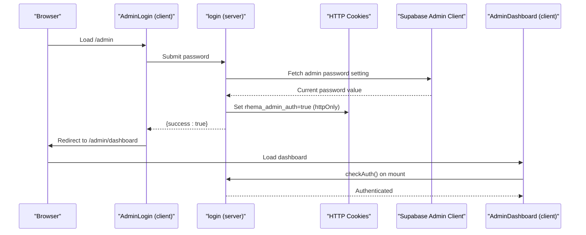

**Diagram sources**
- [app/admin/page.tsx:12-23](file://app/admin/page.tsx#L12-L23)
- [app/actions/auth.ts:7-43](file://app/actions/auth.ts#L7-L43)
- [lib/supabase-admin.ts:14-18](file://lib/supabase-admin.ts#L14-L18)
- [app/admin/dashboard/page.tsx:71-81](file://app/admin/dashboard/page.tsx#L71-L81)

## Detailed Component Analysis

### Admin Login Page
- Purpose: Secure entry point requiring a password stored in Supabase settings.
- Behavior: On submit, invokes the login server action which validates the password against the stored value, sets an HTTP-only session cookie, and redirects to the dashboard.
- Error Handling: Displays invalid password errors and prevents navigation on failure.


**Diagram sources**
- [app/admin/page.tsx:12-23](file://app/admin/page.tsx#L12-L23)
- [app/actions/auth.ts:7-43](file://app/actions/auth.ts#L7-L43)

**Section sources**
- [app/admin/page.tsx:7-51](file://app/admin/page.tsx#L7-L51)
- [app/actions/auth.ts:7-43](file://app/actions/auth.ts#L7-L43)

### Protected Routes and Session Management
- Authentication Guard: The dashboard verifies authentication on mount using checkAuth, redirecting unauthenticated users to the login page.
- Session Cookie: A secure, HTTP-only cookie named rhema_admin_auth maintains the session for up to seven days.
- Logout: Clears the session cookie and redirects to the login page.

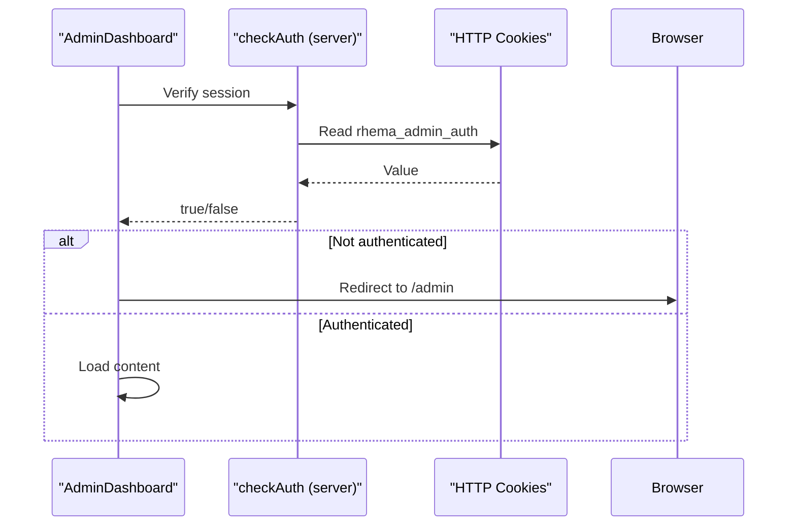

**Diagram sources**
- [app/admin/dashboard/page.tsx:71-81](file://app/admin/dashboard/page.tsx#L71-L81)
- [app/actions/auth.ts:50-54](file://app/actions/auth.ts#L50-L54)

**Section sources**
- [app/admin/dashboard/page.tsx:71-81](file://app/admin/dashboard/page.tsx#L71-L81)
- [app/actions/auth.ts:45-54](file://app/actions/auth.ts#L45-L54)

### Admin Dashboard Functionality
- Tabs and Sections:
  - Services: Manage service entries with title and description.
  - Clients: Manage client organizations.
  - Team: Manage team member profiles with roles.
  - Competitions: Manage competition details and toggle activity status.
  - Newsletter: Create and manage posts.
  - General Settings: Edit site content settings.
  - Competition Registrations: View, edit, and delete registration records.
  - Coding Class Registrations: View, edit, update status, and delete records.
  - Professional Trainings: Complete table view with status management, detailed information modal, and deletion capabilities.
  - Staff E-Notes: Internal note-taking with categories, priorities, statuses, tags, and file attachments.
- Modals: Unified modal for adding/editing items across most sections; separate modals for viewing/editing registrations and staff notes. **Updated** All modals are now responsive with mobile-friendly interfaces and touch interactions.
- Data Fetching: On mount, fetches dashboard data and dependent registration lists; supports pagination and filtering for staff notes.
- Navigation: **Updated** Features slide-out sidebar menu for mobile devices with hamburger button toggle and overlay support.

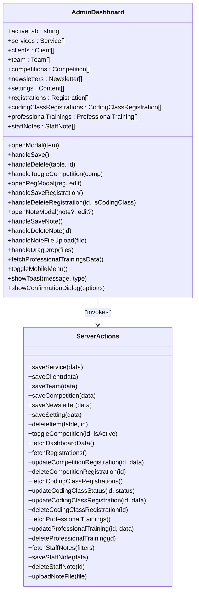

**Diagram sources**
- [app/admin/dashboard/page.tsx:28-1910](file://app/admin/dashboard/page.tsx#L28-L1910)
- [app/actions/admin.ts:21-197](file://app/actions/admin.ts#L21-L197)
- [app/actions/registration.ts:86-252](file://app/actions/registration.ts#L86-L252)
- [app/actions/coding-classes.ts:78-156](file://app/actions/coding-classes.ts#L78-L156)
- [app/actions/notes.ts:20-147](file://app/actions/notes.ts#L20-L147)

**Section sources**
- [app/admin/dashboard/page.tsx:1200-1910](file://app/admin/dashboard/page.tsx#L1200-L1910)
- [app/actions/admin.ts:38-98](file://app/actions/admin.ts#L38-L98)
- [app/actions/registration.ts:86-252](file://app/actions/registration.ts#L86-L252)
- [app/actions/coding-classes.ts:78-156](file://app/actions/coding-classes.ts#L78-L156)
- [app/actions/notes.ts:20-147](file://app/actions/notes.ts#L20-L147)

### Course Management Features
- CRUD Operations: Add, edit, and delete services, clients, team members, competitions, and newsletter posts.
- Bulk Operations: Toggle competition activity status; update coding class registration status via dropdown selection.
- Validation: Form-level validation ensures required fields are present before saving.
- User Feedback: **Updated** Toast notifications replace traditional alert dialogs for better user experience across all devices.

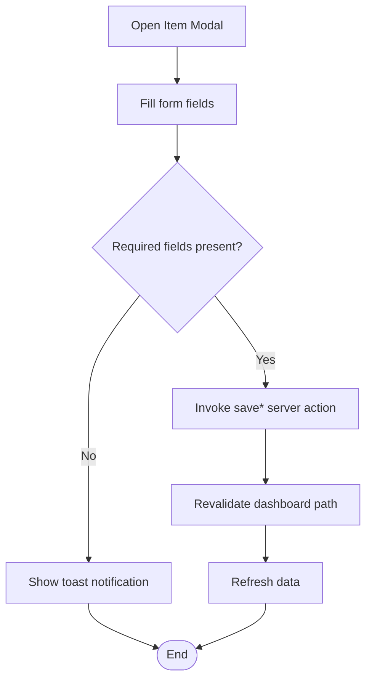

**Diagram sources**
- [app/admin/dashboard/page.tsx:165-216](file://app/admin/dashboard/page.tsx#L165-L216)
- [app/actions/admin.ts:21-197](file://app/actions/admin.ts#L21-L197)

**Section sources**
- [app/admin/dashboard/page.tsx:1234-1373](file://app/admin/dashboard/page.tsx#L1234-L1373)
- [app/actions/admin.ts:21-197](file://app/actions/admin.ts#L21-L197)

### Student Enrollment Tracking
- Competition Registrations: View student details, school info, parent contact, and status; edit or delete records; open detailed modal for comprehensive editing.
- Coding Class Registrations: View student profile, selected courses, payment plans, experience level, preferred start date, and status; update status directly from the table.
- Professional Training Registrations: Complete table view with participant information, training program details, schedule preferences, experience levels, and inline status management with color-coded indicators.
- Mobile Optimization: **Updated** Tables are now responsive with horizontal scrolling on mobile devices and touch-friendly action buttons.

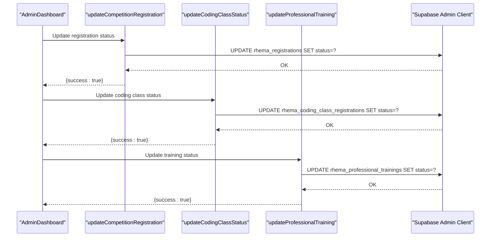

**Diagram sources**
- [app/admin/dashboard/page.tsx:257-292](file://app/admin/dashboard/page.tsx#L257-L292)
- [app/actions/registration.ts:102-115](file://app/actions/registration.ts#L102-L115)
- [app/actions/coding-classes.ts:98-116](file://app/actions/coding-classes.ts#L98-L116)
- [app/actions/registration.ts:224-236](file://app/actions/registration.ts#L224-L236)

**Section sources**
- [app/admin/dashboard/page.tsx:1375-1905](file://app/admin/dashboard/page.tsx#L1375-L1905)
- [app/actions/registration.ts:102-115](file://app/actions/registration.ts#L102-L115)
- [app/actions/coding-classes.ts:98-116](file://app/actions/coding-classes.ts#L98-L116)
- [app/actions/registration.ts:224-236](file://app/actions/registration.ts#L224-L236)

### Administrative Reporting Capabilities
- Registration Reports: Comprehensive tables for competition, coding class, and professional training registrations with sorting and filtering.
- Professional Training Reports: Enhanced table view with inline status management, detailed information modal, and comprehensive participant tracking.
- Staff E-Notes: Paginated list with search and filters by status, category, and priority; supports pinning and file attachments.
- Mobile Search: **Updated** Search and filter functionality optimized for mobile devices with touch-friendly controls and adaptive layouts.

**Section sources**
- [app/admin/dashboard/page.tsx:1375-1905](file://app/admin/dashboard/page.tsx#L1375-L1905)

### Dashboard Layout and Data Visualization
- Layout: **Updated** Responsive two-column design with collapsible sidebar navigation and main content area. Desktop displays full sidebar while mobile shows slide-out menu with hamburger toggle.
- Visual Indicators: Color-coded status badges for registration records; category/priority tags for staff notes; pinned notes highlighted with yellow background.
- Interactive Elements: Inline status updates for coding class and professional training registrations; modal-based editing for all content types.
- Professional Training Enhancements: Complete table view with responsive design, color-coded status indicators, and comprehensive action buttons.
- Touch Interactions: **Updated** All interactive elements support touch gestures and provide appropriate feedback for mobile users.
- Sticky Navigation: **Updated** Navigation bars remain visible during scrolling for improved accessibility on mobile devices.

**Section sources**
- [app/admin/dashboard/page.tsx:1193-1910](file://app/admin/dashboard/page.tsx#L1193-L1910)

### Integration Between Admin Pages and Server Actions
- Data Manipulation: All modifications are performed via server actions that validate authentication and interact with Supabase using the admin client.
- Email Notifications: New registrations and staff notes trigger automated emails to administrators.
- Revalidation: After mutations, dashboard data is revalidated to reflect changes immediately.
- User Feedback: **Updated** Toast notifications provide immediate feedback for all server action results.

**Section sources**
- [app/actions/admin.ts:14-19](file://app/actions/admin.ts#L14-L19)
- [app/actions/notes.ts:79-94](file://app/actions/notes.ts#L79-L94)
- [lib/email.ts:134-191](file://lib/email.ts#L134-L191)
- [app/admin/dashboard/page.tsx:212-216](file://app/admin/dashboard/page.tsx#L212-L216)

## Mobile Responsiveness Enhancements

### Overview
The admin interface has been significantly enhanced with comprehensive mobile responsiveness features to ensure optimal user experience across all device sizes. These enhancements include slide-out navigation, adaptive layouts, touch-friendly interactions, and improved mobile-specific UI components.

### Slide-Out Sidebar Menu
- **Hamburger Button**: Prominent menu toggle button positioned in the top-left corner for easy access on mobile devices
- **Slide Animation**: Smooth sliding animation when opening and closing the sidebar menu
- **Overlay Support**: Semi-transparent overlay appears behind the sidebar to focus attention on navigation
- **Touch Gestures**: Swipe-to-close gesture support for intuitive mobile interaction
- **Auto-Close**: Sidebar automatically closes when clicking outside or selecting a menu item

### Adaptive Layout System
- **Responsive Breakpoints**: Optimized layouts for mobile (< 768px), tablet (768px - 1024px), and desktop (> 1024px) screens
- **Adaptive Padding**: Dynamic padding adjustments based on screen size to maximize content visibility
- **Flexible Grid System**: CSS Grid and Flexbox implementations that adapt to available screen space
- **Text Scaling**: Relative font sizing using viewport units for optimal readability across devices

### Mobile-Friendly Modals
- **Full-Screen Mode**: Modals expand to full screen on mobile devices for better usability
- **Touch-Optimized Controls**: Larger touch targets and swipe gestures for modal interactions
- **Sticky Headers**: Modal headers remain fixed at the top during scrolling for easy access to close buttons
- **Keyboard Navigation**: Proper focus management and keyboard shortcuts for accessibility

### Toast Notification System
- **Non-Intrusive Alerts**: Toast notifications appear at the bottom of the screen without blocking user interaction
- **Auto-Dismiss**: Automatic dismissal after a configurable time period
- **Positioning**: Smart positioning to avoid overlapping with other UI elements
- **Animation**: Smooth slide-in and slide-out animations for better visual feedback

### Confirmation Dialog System
- **Consistent UX**: Standardized confirmation dialogs for destructive actions like deletions
- **Mobile Optimization**: Full-screen confirmation dialogs on mobile devices
- **Accessibility**: Proper ARIA labels and keyboard navigation support
- **Customizable**: Configurable message content and action buttons

### Optimized Search and Filter State Management
- **State Persistence**: Search and filter states persist across page navigation on mobile devices
- **Touch-Friendly Controls**: Larger input fields and buttons for easier mobile interaction
- **Real-time Filtering**: Instant search results as users type on mobile keyboards
- **Memory Optimization**: Efficient state management to prevent memory leaks on mobile browsers

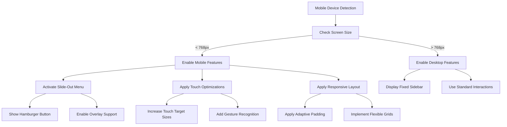

**Diagram sources**
- [app/admin/dashboard/page.tsx:1-1910](file://app/admin/dashboard/page.tsx#L1-L1910)

### Performance Optimizations for Mobile
- **Lazy Loading**: Deferred loading of non-critical resources on mobile devices
- **Image Optimization**: Responsive images with appropriate compression for mobile networks
- **Memory Management**: Efficient cleanup of event listeners and timers to prevent memory leaks
- **Network Optimization**: Reduced API calls and data payload sizes for mobile connections

### Accessibility Improvements
- **Screen Reader Support**: Proper ARIA labels and semantic HTML structure
- **Keyboard Navigation**: Full keyboard navigation support for all interactive elements
- **Focus Management**: Logical tab order and focus indicators
- **Color Contrast**: WCAG-compliant color contrast ratios for better visibility

**Section sources**
- [app/admin/dashboard/page.tsx:1-1910](file://app/admin/dashboard/page.tsx#L1-L1910)

## Professional Trainings Management System

### Overview
The Professional Trainings tab provides a comprehensive management interface for professional training program registrations. It features a complete table view with inline status management, detailed information modal, and full CRUD operations integrated seamlessly with the existing dashboard architecture. **Updated** Enhanced with mobile-responsive design and touch-friendly interactions.

### Core Features

#### Complete Table View Implementation
- **Responsive Design**: Fully responsive table layout optimized for various screen sizes with horizontal scrolling on mobile devices
- **Comprehensive Data Display**: Shows participant name, email, phone, training program, preferred schedule, experience level, and status
- **Organization Information**: Displays organization details when available for each participant
- **Training Program Badges**: Color-coded purple badges for training program identification
- **Experience Level Indicators**: Color-coded badges showing beginner (green), intermediate (blue), and advanced (purple) levels
- **Touch-Friendly Actions**: **Updated** Larger action buttons and touch targets for mobile devices

#### Inline Status Management
- **Color-Coded Dropdown Selectors**: Status dropdowns with dynamic color coding based on current status
- **Real-time Updates**: Immediate status updates without page refresh
- **Visual Feedback**: Clear visual distinction between different status states (pending, contacted, enrolled, cancelled)
- **Seamless Integration**: Status updates integrate with existing dashboard revalidation system
- **Mobile Optimization**: **Updated** Touch-friendly dropdown selectors with larger tap targets

#### Detailed Information Modal
- **Comprehensive Participant Details**: Full participant information including personal details, organizational context, and training preferences
- **Rich Data Presentation**: Well-organized grid layout with labeled fields and formatted dates
- **Training Program Highlighting**: Prominent display of selected training program with purple badge styling
- **Experience Level Visualization**: Color-coded experience level badges for quick assessment
- **Payment Preference Display**: Clear indication of payment method preferences
- **Mobile-Friendly Layout**: **Updated** Full-screen modal presentation on mobile devices with scrollable content

#### Advanced Management Capabilities
- **Deletion Functionality**: Safe deletion with confirmation prompts using the new confirmation dialog system
- **View and Edit Options**: Comprehensive action buttons for each registration record
- **Empty State Handling**: User-friendly messaging when no registrations exist
- **Total Count Display**: Live count of total professional training registrations
- **Mobile Navigation**: **Updated** Touch-optimized action buttons and swipe gestures

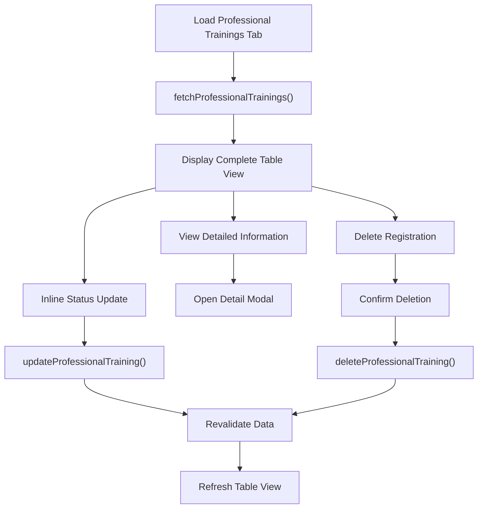

**Diagram sources**
- [app/admin/dashboard/page.tsx:92-97](file://app/admin/dashboard/page.tsx#L92-L97)
- [app/admin/dashboard/page.tsx:1792-1905](file://app/admin/dashboard/page.tsx#L1792-L1905)
- [app/actions/registration.ts:209-252](file://app/actions/registration.ts#L209-L252)

### Database Schema Integration
The professional training system integrates with the existing `rhema_professional_trainings` table through comprehensive server actions:

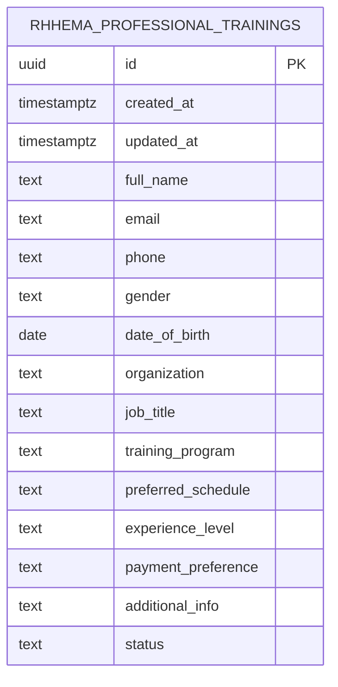

**Diagram sources**
- [types/supabase.ts:114-131](file://types/supabase.ts#L114-L131)

### Email Notifications
When new professional training registrations are submitted, automated email notifications are sent to administrators with:
- Complete participant information including name, email, phone, and organizational details
- Training program specifics and scheduling preferences
- Experience level and payment preference information
- Rich HTML formatting for professional presentation

**Section sources**
- [app/actions/registration.ts:195-199](file://app/actions/registration.ts#L195-L199)
- [lib/email.ts:134-191](file://lib/email.ts#L134-L191)

### User Interface Components

#### Professional Training Table Interface
The professional training table provides a comprehensive management interface:
- **Responsive Header**: Clear section title with total count badge
- **Structured Column Layout**: Organized columns for all essential participant information
- **Interactive Status Management**: Inline dropdown selectors with color-coded feedback
- **Action Buttons**: Consistent View and Delete buttons for each record
- **Empty State Handling**: Friendly messaging when no registrations exist
- **Mobile Optimization**: **Updated** Horizontal scrolling and touch-friendly interface elements

#### Detail Modal Interface
The detail modal offers comprehensive participant information:
- **Grid Layout**: Two-column layout for efficient information display
- **Rich Data Formatting**: Properly formatted dates, structured text, and visual badges
- **Training Program Emphasis**: Prominent display of selected training programs
- **Experience Level Visualization**: Color-coded badges for quick assessment
- **Organizational Context**: Clear display of company and job title information
- **Mobile Adaptation**: **Updated** Full-screen presentation on mobile devices

#### Status Management System
- **Dynamic Color Coding**: Automatic color changes based on status values
- **Inline Editing**: No modal required for simple status updates
- **Real-time Feedback**: Immediate visual confirmation of status changes
- **Consistent Styling**: Matches overall dashboard design language
- **Touch Optimization**: **Updated** Larger touch targets and improved mobile interaction

**Section sources**
- [app/admin/dashboard/page.tsx:1792-1905](file://app/admin/dashboard/page.tsx#L1792-L1905)
- [app/admin/dashboard/page.tsx:798-878](file://app/admin/dashboard/page.tsx#L798-L878)

## Staff Notes Management System

### Overview
The Staff E-Notes system provides a comprehensive internal communication platform for administrative staff. It supports creating, editing, viewing, and organizing notes with rich metadata, file attachments, and advanced filtering capabilities. **Updated** Enhanced with mobile-responsive design and touch-friendly interfaces.

### Core Features

#### Note Creation and Editing
- **Modal-Based Interface**: Full-screen modal with sticky header for easy access to note fields
- **Rich Metadata Support**: Title, content, author, category, priority, status, tags, and pinning options
- **Real-time Validation**: Required field validation with user-friendly error messages
- **Auto-save State**: Maintains form state during editing sessions
- **Mobile Optimization**: **Updated** Full-screen modal presentation on mobile devices with touch-friendly input fields

#### File Attachment System
- **Drag-and-Drop Upload**: Intuitive drag-and-drop interface with visual feedback
- **Multiple File Support**: Upload multiple files simultaneously with individual progress tracking
- **File Size Validation**: 10MB maximum file size per attachment
- **Supported Formats**: PDF, DOC, DOCX, PNG, JPG, GIF, TXT, XLS, XLSX, PPT, PPTX
- **Real-time Progress Indicators**: Animated loading states during file uploads
- **File Management**: Remove uploaded files before saving notes
- **Mobile Upload**: **Updated** Touch-optimized file upload interface with camera integration support

#### Advanced Filtering and Search
- **Full-text Search**: Search across note titles and content
- **Category Filtering**: Filter by general, student, admin, urgent, or announcement categories
- **Priority Filtering**: Filter by low, normal, high, or urgent priorities
- **Status Filtering**: Filter by active or archived status
- **Pagination**: Efficient handling of large note collections with 50 notes per page
- **Mobile Search**: **Updated** Touch-friendly search interface with real-time filtering

#### Visual Organization
- **Color-coded Categories**: Distinct visual indicators for different note categories
- **Priority Badges**: Priority levels displayed with appropriate color schemes
- **Pinned Notes**: Special highlighting for important pinned notes
- **Attachment Previews**: Quick access to attached files directly from note cards
- **Mobile Layout**: **Updated** Responsive card layout optimized for mobile viewing

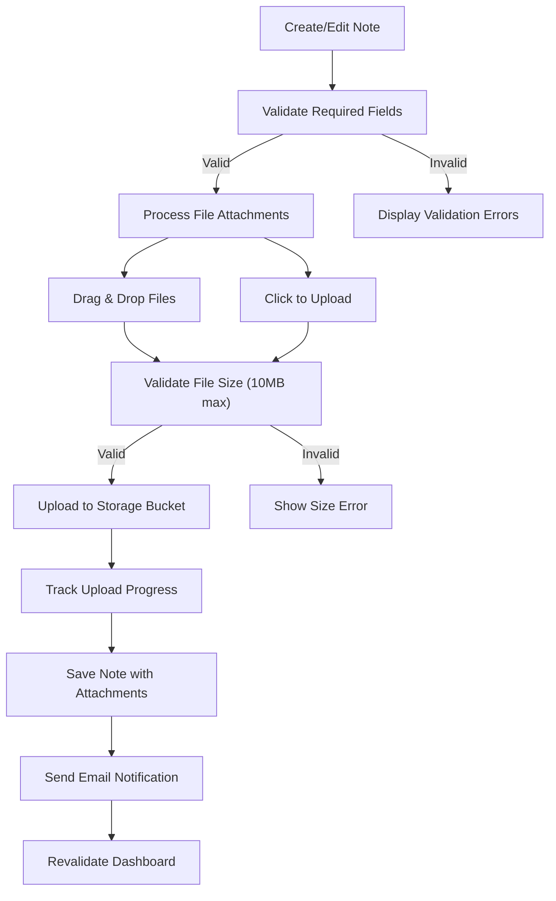

**Diagram sources**
- [app/admin/dashboard/page.tsx:448-472](file://app/admin/dashboard/page.tsx#L448-L472)
- [app/admin/dashboard/page.tsx:341-435](file://app/admin/dashboard/page.tsx#L341-L435)
- [app/actions/notes.ts:61-98](file://app/actions/notes.ts#L61-L98)

### Database Schema
The staff notes system uses a dedicated table with comprehensive indexing for optimal performance:

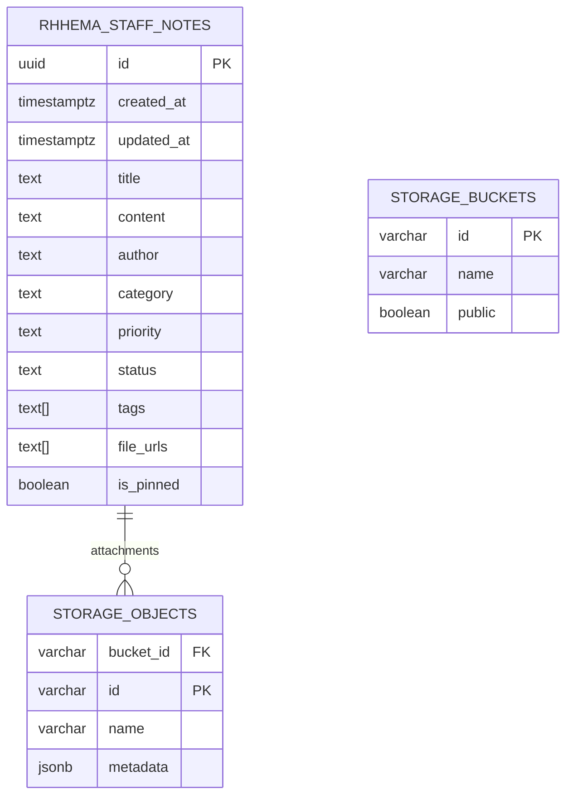

**Diagram sources**
- [supabase_migration_add_staff_notes.sql:2-15](file://supabase_migration_add_staff_notes.sql#L2-L15)
- [supabase_migration_add_staff_notes.sql:31-44](file://supabase_migration_add_staff_notes.sql#L31-L44)

### Email Notifications
When new staff notes are created, automated email notifications are sent to administrators with:
- Complete note details including title, author, category, and priority
- Rich HTML formatting with color-coded metadata
- Links to attached files
- Direct link to view the note in the admin dashboard

**Section sources**
- [app/actions/notes.ts:79-94](file://app/actions/notes.ts#L79-L94)
- [lib/email.ts:134-191](file://lib/email.ts#L134-L191)

### User Interface Components

#### Note Modal Interface
The note modal provides a comprehensive interface for managing staff notes:
- **Sticky Header**: Always visible title and close button
- **Responsive Layout**: Adapts to different screen sizes
- **Field Organization**: Logical grouping of related fields
- **Visual Feedback**: Clear indication of required fields and validation states
- **Mobile Adaptation**: **Updated** Full-screen modal presentation with touch-optimized controls

#### File Upload Interface
- **Drag Zone**: Large drop zone with clear visual instructions
- **Progress Indicators**: Individual progress bars for each file upload
- **File List**: Display of successfully uploaded files with remove functionality
- **Format Hints**: Clear indication of supported file formats and size limits
- **Mobile Upload**: **Updated** Touch-optimized upload interface with camera integration

#### Note Cards
- **Compact Display**: Essential information at a glance
- **Attachment Previews**: Quick access to attached files
- **Action Buttons**: View, edit, and delete operations
- **Visual Hierarchy**: Clear distinction between pinned and regular notes
- **Mobile Layout**: **Updated** Responsive card layout optimized for mobile devices

**Section sources**
- [app/admin/dashboard/page.tsx:921-1191](file://app/admin/dashboard/page.tsx#L921-L1191)
- [app/admin/dashboard/page.tsx:1624-1789](file://app/admin/dashboard/page.tsx#L1624-L1789)

## Dependency Analysis
The admin interface exhibits clear separation of concerns:
- Client pages depend on server actions for all data operations.
- Server actions depend on the Supabase admin client and email library.
- Supabase admin client depends on environment variables for credentials.
- Dashboard types define the shape of data exchanged between client and server.

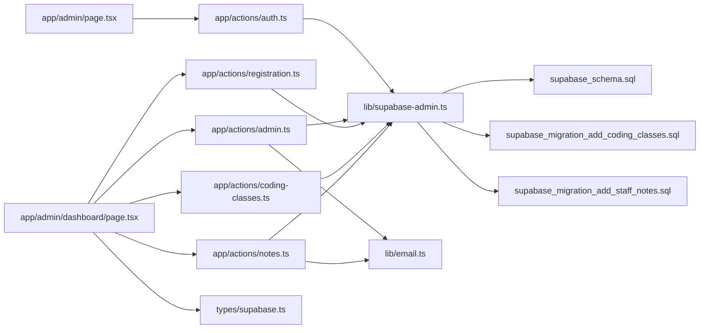

**Diagram sources**
- [app/admin/page.tsx:5](file://app/admin/page.tsx#L5)
- [app/admin/dashboard/page.tsx:6-11](file://app/admin/dashboard/page.tsx#L6-L11)
- [app/actions/auth.ts:5](file://app/actions/auth.ts#L5)
- [app/actions/admin.ts:3](file://app/actions/admin.ts#L3)
- [app/actions/registration.ts:3](file://app/actions/registration.ts#L3)
- [app/actions/coding-classes.ts:4](file://app/actions/coding-classes.ts#L4)
- [app/actions/notes.ts:3](file://app/actions/notes.ts#L3)
- [lib/supabase-admin.ts:14-18](file://lib/supabase-admin.ts#L14-L18)
- [lib/email.ts:1-237](file://lib/email.ts#L1-L237)
- [types/supabase.ts:1-132](file://types/supabase.ts#L1-L132)
- [supabase_schema.sql:1-33](file://supabase_schema.sql#L1-L33)
- [supabase_migration_add_coding_classes.sql:1-30](file://supabase_migration_add_coding_classes.sql#L1-L30)
- [supabase_migration_add_staff_notes.sql:1-44](file://supabase_migration_add_staff_notes.sql#L1-L44)

**Section sources**
- [app/admin/page.tsx:5](file://app/admin/page.tsx#L5)
- [app/admin/dashboard/page.tsx:6-11](file://app/admin/dashboard/page.tsx#L6-L11)
- [app/actions/auth.ts:5](file://app/actions/auth.ts#L5)
- [app/actions/admin.ts:3](file://app/actions/admin.ts#L3)
- [app/actions/notes.ts:3](file://app/actions/notes.ts#L3)
- [lib/supabase-admin.ts:14-18](file://lib/supabase-admin.ts#L14-L18)

## Performance Considerations
- Parallel Data Fetching: The dashboard fetches multiple datasets concurrently to reduce total loading time.
- Revalidation Strategy: Mutations trigger targeted revalidation to keep the UI fresh without full-page reloads.
- Pagination: Staff notes support pagination to manage large lists efficiently.
- File Upload Optimization: Sequential file processing with individual progress tracking prevents UI blocking.
- Professional Training Enhancements: Optimized table rendering with efficient state management and minimal re-renders.
- Mobile Performance: **Updated** Lazy loading of mobile-specific resources and optimized image delivery for mobile networks.
- Memory Management: **Updated** Efficient cleanup of event listeners and timers to prevent memory leaks on mobile devices.
- Recommendations:
  - Consider caching strategies for frequently accessed static content.
  - Implement virtualized lists for very large registration tables.
  - Optimize database queries with appropriate indexes (already present in migrations).
  - Use lazy loading for note content to improve initial page load times.
  - Implement progressive web app features for enhanced mobile experience.

**Section sources**
- [app/admin/dashboard/page.tsx:99-140](file://app/admin/dashboard/page.tsx#L99-L140)
- [app/actions/admin.ts:49-56](file://app/actions/admin.ts#L49-L56)
- [app/actions/notes.ts:20-59](file://app/actions/notes.ts#L20-L59)
- [supabase_migration_add_staff_notes.sql:17-21](file://supabase_migration_add_staff_notes.sql#L17-L21)

## Security and Access Control
- Authentication: Password-based login with dynamic retrieval of the admin password from Supabase settings; falls back to environment variable if not found.
- Session Management: HTTP-only, secure cookies with a seven-day expiration; logout clears the cookie.
- Authorization: All server actions enforce authentication via a helper that checks the session cookie.
- Supabase Client: Uses a service role key to bypass RLS for admin operations; warns if the key is missing.
- Data Protection:
  - Email configuration is optional; missing credentials prevent email notifications.
  - RLS policies are defined for registration, coding class, and staff notes tables to restrict public access except for inserts.
  - File upload permissions are controlled through storage bucket policies.
- Mobile Security: **Updated** Enhanced security measures for mobile devices including secure cookie handling and input validation.

**Section sources**
- [app/actions/auth.ts:7-43](file://app/actions/auth.ts#L7-L43)
- [app/actions/auth.ts:45-54](file://app/actions/auth.ts#L45-L54)
- [app/actions/notes.ts:35-36](file://app/actions/notes.ts#L35-L36)
- [lib/supabase-admin.ts:7-9](file://lib/supabase-admin.ts#L7-L9)
- [supabase_schema.sql:20-32](file://supabase_schema.sql#L20-L32)
- [supabase_migration_add_coding_classes.sql:18-29](file://supabase_migration_add_coding_classes.sql#L18-L29)
- [supabase_migration_add_staff_notes.sql:23-44](file://supabase_migration_add_staff_notes.sql#L23-L44)

## Administrative Workflows
- Admin User Management:
  - Change the admin password via General Settings; the system persists the new value for future logins.
- Course Administration:
  - Manage services, clients, team members, and competitions; toggle competition activity status.
- System Monitoring:
  - Monitor new registrations via email notifications and track progress in the dashboard tables.
  - Use staff notes for internal coordination and announcements with file attachments.
- Professional Training Management:
  - Monitor professional training registrations with comprehensive table view
  - Update participant status through inline dropdown selectors
  - View detailed participant information through modal dialogs
  - Manage training program enrollments and cancellations
  - **Updated** Mobile-friendly management interface with touch-optimized controls
- Staff Communication:
  - Create categorized and prioritized notes for different audiences.
  - Pin important announcements for immediate visibility.
  - Attach supporting documents and reference materials.
  - Filter and search through historical notes for context.
  - **Updated** Mobile-responsive note creation and management interface
- Mobile Administration: **New** Dedicated mobile workflows optimized for touch interactions and smaller screen sizes

**Section sources**
- [app/actions/admin.ts:65-81](file://app/actions/admin.ts#L65-L81)
- [lib/email.ts:14-237](file://lib/email.ts#L14-L237)
- [app/admin/dashboard/page.tsx:1624-1789](file://app/admin/dashboard/page.tsx#L1624-L1789)
- [app/admin/dashboard/page.tsx:1792-1905](file://app/admin/dashboard/page.tsx#L1792-L1905)

## Troubleshooting Guide
- Login Issues:
  - Ensure the admin password setting exists in the database; the system creates it automatically if missing.
  - Confirm the session cookie is being set and not blocked by browser privacy settings.
- Database Connectivity:
  - Verify the service role key is configured; missing keys will cause write failures.
  - Check that required tables exist and RLS policies match the intended access patterns.
- Email Notifications:
  - Configure SMTP_USER and SMTP_PASS; missing credentials will disable email notifications.
  - Check email delivery logs for failed sends.
- Dashboard Loading Errors:
  - The dashboard displays an error state with a retry button if data fetch fails; check network connectivity and server logs.
- Staff Notes Issues:
  - Verify storage bucket permissions for file uploads.
  - Check file size limits and supported formats.
  - Ensure proper indexing for search and filter operations.
- Professional Training Issues:
  - Verify database connectivity for professional training table operations.
  - Check server action responses for status update failures.
  - Ensure proper type definitions for professional training data structures.
- File Upload Problems:
  - Confirm storage bucket exists and has correct policies.
  - Check file format compatibility and size constraints.
  - Verify network connectivity for large file uploads.
- Mobile Responsiveness Issues: **New**
  - Clear browser cache and cookies if mobile layout appears incorrect.
  - Test on multiple devices and screen sizes to identify specific issues.
  - Check console for JavaScript errors that may affect mobile functionality.
  - Verify responsive breakpoints are working correctly in browser developer tools.
- Toast Notification Issues: **New**
  - Check browser notification permissions if toast notifications are not appearing.
  - Verify CSS animations are not being blocked by browser settings.
  - Test toast positioning on different screen sizes.
- Mobile Menu Issues: **New**
  - Ensure hamburger button is visible and clickable on mobile devices.
  - Check overlay z-index values if sidebar appears behind other elements.
  - Verify touch events are properly handled on mobile browsers.

**Section sources**
- [app/actions/auth.ts:18-29](file://app/actions/auth.ts#L18-L29)
- [lib/supabase-admin.ts:7-9](file://lib/supabase-admin.ts#L7-L9)
- [lib/email.ts:23-44](file://lib/email.ts#L23-L44)
- [app/admin/dashboard/page.tsx:476-491](file://app/admin/dashboard/page.tsx#L476-L491)
- [app/actions/notes.ts:114-133](file://app/actions/notes.ts#L114-L133)

## Conclusion
The Rhema Expert Solutions admin interface provides a robust, secure, and efficient management platform with extensive enhancements for professional training management and staff communication. **Updated** The recent mobile responsiveness enhancements have significantly improved the user experience across all devices, featuring slide-out navigation, adaptive layouts, touch-friendly interactions, and optimized mobile workflows. The newly enhanced Professional Trainings tab offers a comprehensive solution for managing professional training program registrations with complete table view, inline status management, detailed information modal, and seamless integration with the existing dashboard architecture. The implementation leverages Next.js server actions for safe data operations, Supabase for backend persistence with RLS, and a well-structured dashboard for content and registration management. The system emphasizes security through session cookies, authentication guards, and controlled admin privileges, while offering practical tools for course administration, enrollment tracking, professional training management, and internal communication via staff notes with file sharing capabilities. The enhanced mobile responsiveness demonstrates the system's commitment to providing accessible administrative tools across all devices, ensuring administrators can effectively manage operations whether on desktop or mobile platforms. The combination of advanced functionality with mobile-first design principles makes this admin interface both powerful and user-friendly for modern administrative workflows.