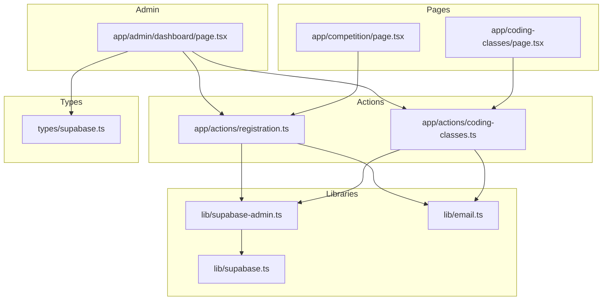
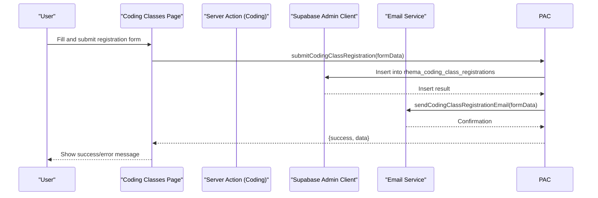
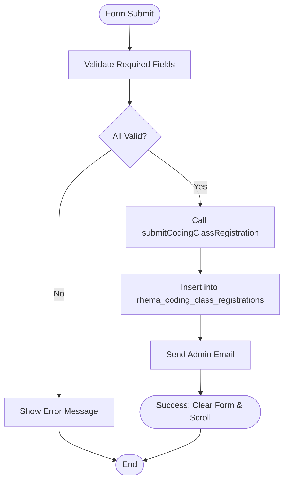
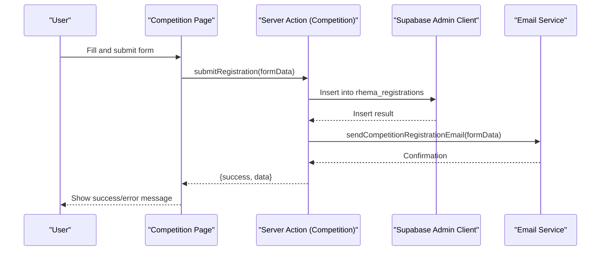
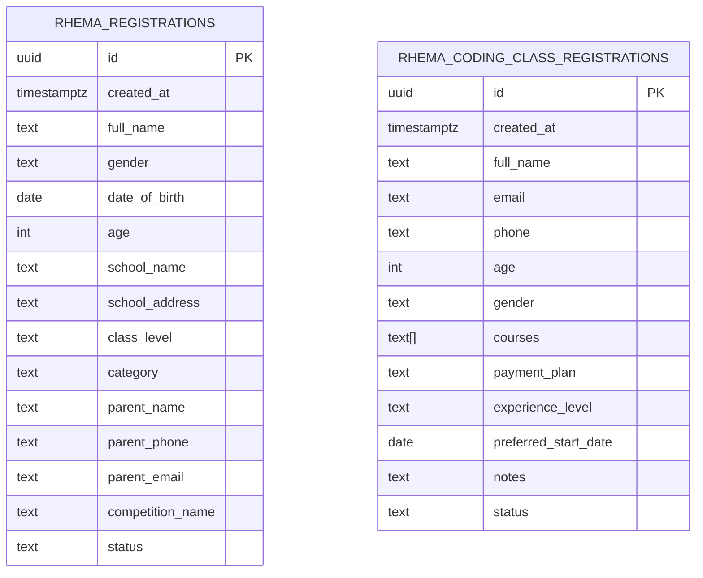
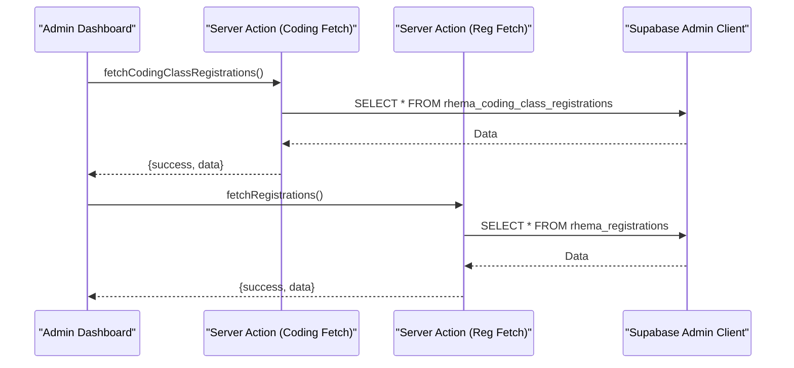
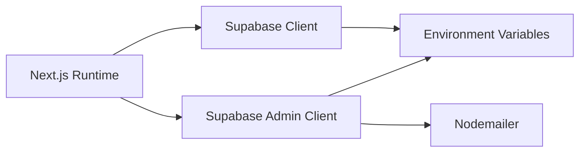

# Course Pages

<cite>
**Referenced Files in This Document**
- [coding-classes/page.tsx](file://app/coding-classes/page.tsx)
- [competition/page.tsx](file://app/competition/page.tsx)
- [coding-classes/actions.ts](file://app/actions/coding-classes.ts)
- [registration/actions.ts](file://app/actions/registration.ts)
- [supabase.ts](file://lib/supabase.ts)
- [supabase-admin.ts](file://lib/supabase-admin.ts)
- [email.ts](file://lib/email.ts)
- [supabase_schema.sql](file://supabase_schema.sql)
- [supabase_migration_add_coding_classes.sql](file://supabase_migration_add_coding_classes.sql)
- [types/supabase.ts](file://types/supabase.ts)
- [admin/dashboard/page.tsx](file://app/admin/dashboard/page.tsx)
- [Header.tsx](file://components/Header.tsx)
- [ImageWithSkeleton.tsx](file://components/ImageWithSkeleton.tsx)
- [layout.tsx](file://app/layout.tsx)
- [package.json](file://package.json)
</cite>

## Table of Contents
1. [Introduction](#introduction)
2. [Project Structure](#project-structure)
3. [Core Components](#core-components)
4. [Architecture Overview](#architecture-overview)
5. [Detailed Component Analysis](#detailed-component-analysis)
6. [Dependency Analysis](#dependency-analysis)
7. [Performance Considerations](#performance-considerations)
8. [Troubleshooting Guide](#troubleshooting-guide)
9. [Conclusion](#conclusion)
10. [Appendices](#appendices)

## Introduction
This document describes the course catalog pages for Rhema Expert Solutions, focusing on the Coding Classes page and the Competition page. It explains the layouts, content structures, data fetching strategies, enrollment status handling, and integration with the registration system. It also covers responsive design, mobile navigation patterns, and practical guidelines for maintaining and extending the course pages.

## Project Structure
The course pages are implemented as Next.js app router pages under the app directory, with dedicated server actions for data persistence and email notifications. The admin dashboard integrates with the same data model to manage registrations and statuses.

**Diagram sources**
- [coding-classes/page.tsx:1-390](file://app/coding-classes/page.tsx#L1-L390)
- [competition/page.tsx:1-316](file://app/competition/page.tsx#L1-L316)
- [coding-classes/actions.ts:1-157](file://app/actions/coding-classes.ts#L1-L157)
- [registration/actions.ts:1-131](file://app/actions/registration.ts#L1-L131)
- [supabase.ts:1-25](file://lib/supabase.ts#L1-L25)
- [supabase-admin.ts:1-19](file://lib/supabase-admin.ts#L1-L19)
- [email.ts:1-134](file://lib/email.ts#L1-L134)
- [types/supabase.ts:1-113](file://types/supabase.ts#L1-L113)
- [admin/dashboard/page.tsx:1-1524](file://app/admin/dashboard/page.tsx#L1-L1524)

**Section sources**
- [coding-classes/page.tsx:1-390](file://app/coding-classes/page.tsx#L1-L390)
- [competition/page.tsx:1-316](file://app/competition/page.tsx#L1-L316)
- [coding-classes/actions.ts:1-157](file://app/actions/coding-classes.ts#L1-L157)
- [registration/actions.ts:1-131](file://app/actions/registration.ts#L1-L131)
- [supabase.ts:1-25](file://lib/supabase.ts#L1-L25)
- [supabase-admin.ts:1-19](file://lib/supabase-admin.ts#L1-L19)
- [email.ts:1-134](file://lib/email.ts#L1-L134)
- [types/supabase.ts:1-113](file://types/supabase.ts#L1-L113)
- [admin/dashboard/page.tsx:1-1524](file://app/admin/dashboard/page.tsx#L1-L1524)

## Core Components
- Coding Classes Page: Presents course offerings, flexible payment plans, and a registration form. Uses local state for form handling and submits via a server action.
- Competition Page: Provides competition details, stages, selection criteria, and a free registration form. Submits via a server action.
- Server Actions: Persist registrations to Supabase, validate inputs, and send admin notifications via email.
- Admin Dashboard: Lists and manages registrations, updates statuses, and supports bulk operations.

Key responsibilities:
- Data fetching: Public pages rely on Supabase client for read-only access; admin uses admin client with service role key.
- Email notifications: On successful registration, admin emails are sent.
- Types: Strongly typed interfaces define database records for both registration types.

**Section sources**
- [coding-classes/page.tsx:26-86](file://app/coding-classes/page.tsx#L26-L86)
- [competition/page.tsx:8-64](file://app/competition/page.tsx#L8-L64)
- [coding-classes/actions.ts:20-76](file://app/actions/coding-classes.ts#L20-L76)
- [registration/actions.ts:22-84](file://app/actions/registration.ts#L22-L84)
- [supabase.ts:16-24](file://lib/supabase.ts#L16-L24)
- [supabase-admin.ts:14-18](file://lib/supabase-admin.ts#L14-L18)
- [email.ts:23-44](file://lib/email.ts#L23-L44)
- [types/supabase.ts:56-97](file://types/supabase.ts#L56-L97)

## Architecture Overview
The pages are client components that trigger server actions. Server actions use the admin client to bypass RLS for write operations and send email notifications. The admin dashboard uses server actions to fetch and update data.

**Diagram sources**
- [coding-classes/page.tsx:56-86](file://app/coding-classes/page.tsx#L56-L86)
- [coding-classes/actions.ts:20-76](file://app/actions/coding-classes.ts#L20-L76)
- [supabase-admin.ts:14-18](file://lib/supabase-admin.ts#L14-L18)
- [email.ts:88-133](file://lib/email.ts#L88-L133)

## Detailed Component Analysis

### Coding Classes Page
- Layout and Sections:
  - Hero header with gradient background and anchor to registration form.
  - Left column: About section, available courses grid, payment plans grid, “How It Works” steps.
  - Right column: Sticky registration form with validation and submission feedback.
- Form Fields:
  - Personal: full_name, email, phone, age, gender.
  - Academic: experience_level, preferred_start_date.
  - Selection: multiple courses (checkboxes), single payment plan (radio).
  - Additional: notes.
- Behavior:
  - Local state tracks form data; checkbox toggles courses; radio selects payment plan.
  - Submission triggers server action with validation; success clears form and scrolls to top.

**Diagram sources**
- [coding-classes/page.tsx:56-86](file://app/coding-classes/page.tsx#L56-L86)
- [coding-classes/actions.ts:20-76](file://app/actions/coding-classes.ts#L20-L76)
- [email.ts:88-133](file://lib/email.ts#L88-L133)

**Section sources**
- [coding-classes/page.tsx:26-390](file://app/coding-classes/page.tsx#L26-L390)
- [coding-classes/actions.ts:20-76](file://app/actions/coding-lasses.ts#L20-L76)

### Competition Page
- Layout and Sections:
  - Hero header with competition title and tagline.
  - Left column: About competition, aims/objectives, competition details (principles, categories, stages, selection criteria, prizes).
  - Right column: Sticky registration form with parent/guardian details.
- Form Fields:
  - Student: full_name, gender, age, date_of_birth, school_name, school_address, school_phone, class_level, category.
  - Parent/Guardian: parent_name, parent_phone, parent_email.
- Behavior:
  - Local state tracks form data; submission validates required fields and calls server action.

**Diagram sources**
- [competition/page.tsx:32-64](file://app/competition/page.tsx#L32-L64)
- [registration/actions.ts:22-84](file://app/actions/registration.ts#L22-L84)
- [supabase-admin.ts:14-18](file://lib/supabase-admin.ts#L14-L18)
- [email.ts:46-86](file://lib/email.ts#L46-L86)

**Section sources**
- [competition/page.tsx:8-316](file://app/competition/page.tsx#L8-L316)
- [registration/actions.ts:22-84](file://app/actions/registration.ts#L22-L84)

### Data Model and Persistence
- Tables:
  - rhema_registrations: Competition registrations with status tracking.
  - rhema_coding_class_registrations: Coding class registrations with array of selected courses and status.
- Policies:
  - Public insert allowed; admin operations via service role key bypass RLS.
- Types:
  - Strongly typed interfaces define record shapes for admin UI and server actions.

**Diagram sources**
- [supabase_schema.sql:1-33](file://supabase_schema.sql#L1-L33)
- [supabase_migration_add_coding_classes.sql:1-30](file://supabase_migration_add_coding_classes.sql#L1-L30)
- [types/supabase.ts:56-97](file://types/supabase.ts#L56-L97)

**Section sources**
- [supabase_schema.sql:1-33](file://supabase_schema.sql#L1-L33)
- [supabase_migration_add_coding_classes.sql:1-30](file://supabase_migration_add_coding_classes.sql#L1-L30)
- [types/supabase.ts:56-97](file://types/supabase.ts#L56-L97)

### Admin Dashboard Integration
- Tabs:
  - Registrations (Competition), Coding Class Registrations.
- Features:
  - View, edit, delete registrations.
  - Update status with dropdowns.
  - Bulk operations and filtering/search in other sections.
- Data Access:
  - Uses server actions to fetch and mutate data; admin client ensures permissions.

**Diagram sources**
- [admin/dashboard/page.tsx:85-126](file://app/admin/dashboard/page.tsx#L85-L126)
- [coding-classes/actions.ts:78-96](file://app/actions/coding-classes.ts#L78-L96)
- [registration/actions.ts:86-100](file://app/actions/registration.ts#L86-L100)
- [supabase-admin.ts:14-18](file://lib/supabase-admin.ts#L14-L18)

**Section sources**
- [admin/dashboard/page.tsx:85-126](file://app/admin/dashboard/page.tsx#L85-L126)
- [coding-classes/actions.ts:78-96](file://app/actions/coding-classes.ts#L78-L96)
- [registration/actions.ts:86-100](file://app/actions/registration.ts#L86-L100)

## Dependency Analysis
- Runtime dependencies include Next.js, Supabase client, Nodemailer, and Tailwind CSS.
- Supabase client configuration warns when environment variables are missing; admin client requires service role key for write operations.
- Email transport depends on SMTP credentials.

**Diagram sources**
- [package.json:11-31](file://package.json#L11-L31)
- [supabase.ts:7-24](file://lib/supabase.ts#L7-L24)
- [supabase-admin.ts:4-18](file://lib/supabase-admin.ts#L4-L18)
- [email.ts:3-12](file://lib/email.ts#L3-L12)

**Section sources**
- [package.json:11-31](file://package.json#L11-L31)
- [supabase.ts:7-24](file://lib/supabase.ts#L7-L24)
- [supabase-admin.ts:4-18](file://lib/supabase-admin.ts#L4-L18)
- [email.ts:3-12](file://lib/email.ts#L3-L12)

## Performance Considerations
- Client-side rendering: Pages are client components; keep heavy computations server-side via actions.
- Images: Use Next.js Image with skeleton loader for perceived performance; consider lazy loading and appropriate sizes.
- Network:
  - Prefer server actions for mutations to reduce client-side logic.
  - Batch admin operations where possible.
- Email:
  - Ensure SMTP credentials are configured to avoid runtime warnings.
- Accessibility:
  - Use semantic labels and proper focus order for forms.
  - Provide visible error messages and success indicators.

[No sources needed since this section provides general guidance]

## Troubleshooting Guide
Common issues and resolutions:
- Supabase environment variables missing:
  - Symptom: Warning about missing Supabase environment variables; dynamic content may not load.
  - Resolution: Set NEXT_PUBLIC_SUPABASE_URL and NEXT_PUBLIC_SUPABASE_ANON_KEY.
- Admin write failures:
  - Symptom: Admin operations fail when RLS is enabled.
  - Resolution: Provide SUPABASE_SERVICE_ROLE_KEY to use admin client with service role key.
- Email notifications disabled:
  - Symptom: Warning about missing SMTP_USER or SMTP_PASS.
  - Resolution: Configure SMTP credentials or disable email notifications in development.
- Registration validation errors:
  - Symptom: Form submission fails with validation messages.
  - Resolution: Ensure required fields are filled; review server action validation logic.

**Section sources**
- [supabase.ts:10-13](file://lib/supabase.ts#L10-L13)
- [supabase-admin.ts:7-9](file://lib/supabase-admin.ts#L7-L9)
- [email.ts:24-27](file://lib/email.ts#L24-L27)
- [coding-classes/actions.ts:35-38](file://app/actions/coding-classes.ts#L35-L38)
- [registration/actions.ts:40-43](file://app/actions/registration.ts#L40-L43)

## Conclusion
The Coding Classes and Competition pages are built with a clear separation of concerns: client-side UI with server actions for persistence and notifications. The admin dashboard complements the system by providing robust management capabilities. Following the guidelines herein will help maintain performance, reliability, and usability as the course catalog evolves.

[No sources needed since this section summarizes without analyzing specific files]

## Appendices

### Responsive Design and Mobile Navigation
- Mobile navigation:
  - Header component implements a slide-in sidebar drawer with overlay and close controls.
  - Closes automatically on navigation item click.
- Course grids:
  - Use responsive grid classes to adapt to small screens.
  - Keep form fields stacked on smaller devices for readability.
- Touch-friendly interactions:
  - Adequate spacing around buttons and inputs.
  - Large tap targets for checkboxes and radios.

**Section sources**
- [Header.tsx:7-136](file://components/Header.tsx#L7-L136)
- [layout.tsx:24-42](file://app/layout.tsx#L24-L42)

### Adding New Course Categories and Managing Content
- To add new coding courses:
  - Update the available courses list in the Coding Classes page component.
  - Ensure corresponding icons and descriptions are maintained.
- To add new competition categories:
  - Update the category options in the Competition page form and server action validation.
- Content management:
  - Use the admin dashboard to manage general settings and content blocks if applicable.
  - For dynamic content, consider extending the content management section in the admin.

**Section sources**
- [coding-classes/page.tsx:7-18](file://app/coding-classes/page.tsx#L7-L18)
- [competition/page.tsx:19-27](file://app/competition/page.tsx#L19-L27)

### Updating Course Availability and Registration Workflows
- Course availability:
  - Use the admin dashboard to update statuses (e.g., pending, contacted, enrolled, cancelled) for coding class registrations.
- Registration workflows:
  - Competition registrations support pending/approved/rejected statuses.
  - Emails are sent on successful submissions to notify administrators.

**Section sources**
- [admin/dashboard/page.tsx:1320-1344](file://app/admin/dashboard/page.tsx#L1320-L1344)
- [types/supabase.ts:56-73](file://types/supabase.ts#L56-L73)
- [types/supabase.ts:83-97](file://types/supabase.ts#L83-L97)
- [email.ts:46-86](file://lib/email.ts#L46-L86)
- [email.ts:88-133](file://lib/email.ts#L88-L133)

### Performance Optimization Guidelines
- Lazy loading:
  - Use Next.js Image with appropriate sizes and lazy loading attributes.
  - Skeleton loaders improve perceived performance during image loads.
- Image optimization:
  - Prefer modern formats and compress assets.
  - Use aspect ratios and fixed dimensions to prevent layout shifts.
- Data fetching:
  - Keep client components lean; delegate heavy queries to server actions.
  - Use admin client for privileged reads/writes in admin contexts.

**Section sources**
- [ImageWithSkeleton.tsx:10-121](file://components/ImageWithSkeleton.tsx#L10-L121)
- [supabase-admin.ts:14-18](file://lib/supabase-admin.ts#L14-L18)