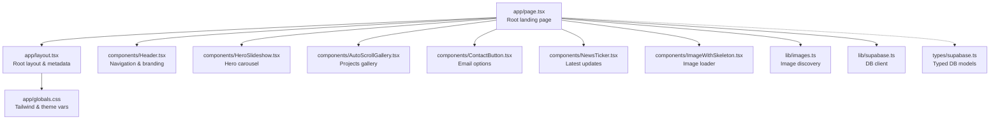
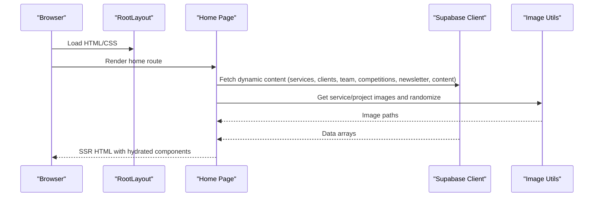
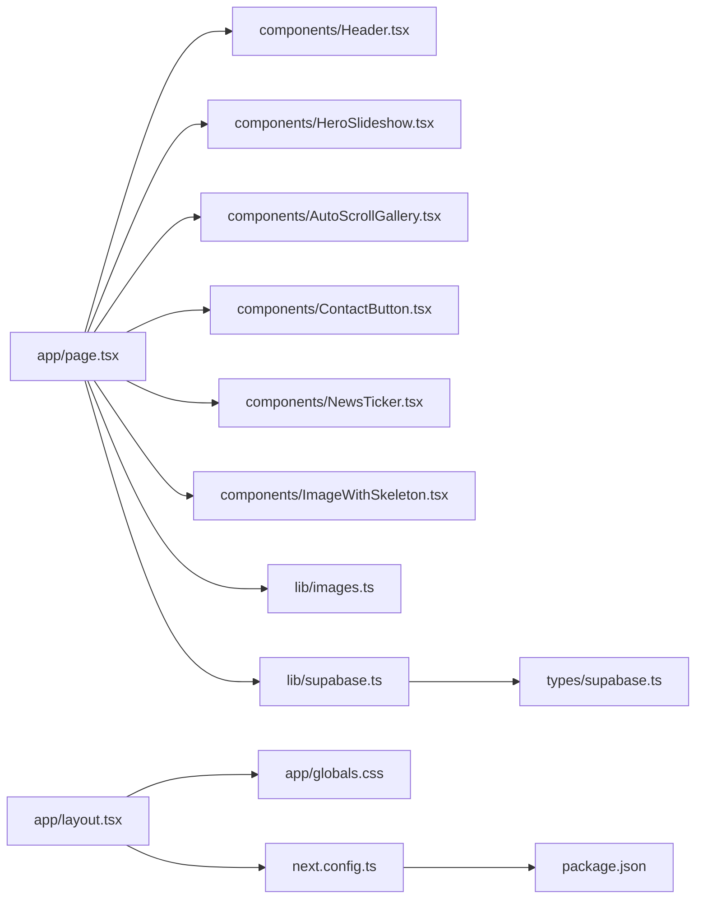

# Landing Page

<cite>
**Referenced Files in This Document**
- [app/page.tsx](file://app/page.tsx)
- [app/layout.tsx](file://app/layout.tsx)
- [components/Header.tsx](file://components/Header.tsx)
- [components/HeroSlideshow.tsx](file://components/HeroSlideshow.tsx)
- [components/AutoScrollGallery.tsx](file://components/AutoScrollGallery.tsx)
- [components/ContactButton.tsx](file://components/ContactButton.tsx)
- [components/NewsTicker.tsx](file://components/NewsTicker.tsx)
- [components/ImageWithSkeleton.tsx](file://components/ImageWithSkeleton.tsx)
- [lib/images.ts](file://lib/images.ts)
- [lib/supabase.ts](file://lib/supabase.ts)
- [types/supabase.ts](file://types/supabase.ts)
- [app/globals.css](file://app/globals.css)
- [next.config.ts](file://next.config.ts)
- [package.json](file://package.json)
</cite>

## Table of Contents
1. [Introduction](#introduction)
2. [Project Structure](#project-structure)
3. [Core Components](#core-components)
4. [Architecture Overview](#architecture-overview)
5. [Detailed Component Analysis](#detailed-component-analysis)
6. [Dependency Analysis](#dependency-analysis)
7. [Performance Considerations](#performance-considerations)
8. [Troubleshooting Guide](#troubleshooting-guide)
9. [Conclusion](#conclusion)
10. [Appendices](#appendices)

## Introduction
This document describes the landing page implementation for Rhema Expert Solutions. It covers the homepage structure, hero section design, and overall user experience flow. It documents the integration of UI components including the header, hero slideshow, auto-scroll gallery, and contact button. It explains the page layout architecture, responsive design patterns, and mobile-first approach. Implementation details for main content sections, call-to-action elements, and navigation integration are included. SEO optimization strategies, meta tag configuration, and performance considerations are addressed. Guidelines for content management, image optimization, and maintaining consistent branding are provided, along with accessibility features, cross-browser compatibility, and loading performance optimization.

## Project Structure
The landing page is implemented as a Next.js App Router application. The main page is defined in the root route, with reusable UI components under the components directory. Global styles and fonts are configured in the root layout. Dynamic content is fetched from Supabase and images are served from the public directory.

**Diagram sources**
- [app/page.tsx:12-787](file://app/page.tsx#L12-L787)
- [app/layout.tsx:16-42](file://app/layout.tsx#L16-L42)
- [components/Header.tsx:1-136](file://components/Header.tsx#L1-L136)
- [components/HeroSlideshow.tsx:11-95](file://components/HeroSlideshow.tsx#L11-L95)
- [components/AutoScrollGallery.tsx:86-100](file://components/AutoScrollGallery.tsx#L86-L100)
- [components/ContactButton.tsx:5-57](file://components/ContactButton.tsx#L5-L57)
- [components/NewsTicker.tsx:11-91](file://components/NewsTicker.tsx#L11-L91)
- [components/ImageWithSkeleton.tsx:10-120](file://components/ImageWithSkeleton.tsx#L10-L120)
- [lib/images.ts:28-50](file://lib/images.ts#L28-L50)
- [lib/supabase.ts:7-24](file://lib/supabase.ts#L7-L24)
- [types/supabase.ts:5-54](file://types/supabase.ts#L5-L54)
- [app/globals.css:1-31](file://app/globals.css#L1-L31)

**Section sources**
- [app/page.tsx:12-787](file://app/page.tsx#L12-L787)
- [app/layout.tsx:16-42](file://app/layout.tsx#L16-L42)
- [app/globals.css:1-31](file://app/globals.css#L1-L31)
- [next.config.ts:1-8](file://next.config.ts#L1-L8)
- [package.json:1-32](file://package.json#L1-L32)

## Core Components
- Header: Provides desktop and mobile navigation, branding, and quick links including a CBT exam button.
- HeroSlideshow: Displays a rotating hero carousel with navigation controls and dots.
- AutoScrollGallery: Renders three synchronized auto-scrolling rows of project images with pause on interaction.
- ContactButton: Offers multiple contact options (default mail app, Gmail web, copy email).
- NewsTicker: Rotates latest newsletter items with hover pause and dot navigation.
- ImageWithSkeleton: Optimistic image loading with skeleton placeholders and lightbox preview.
- Image utilities: Discover images from public directories and randomize selections.

**Section sources**
- [components/Header.tsx:7-136](file://components/Header.tsx#L7-L136)
- [components/HeroSlideshow.tsx:11-95](file://components/HeroSlideshow.tsx#L11-L95)
- [components/AutoScrollGallery.tsx:86-100](file://components/AutoScrollGallery.tsx#L86-L100)
- [components/ContactButton.tsx:5-57](file://components/ContactButton.tsx#L5-L57)
- [components/NewsTicker.tsx:11-91](file://components/NewsTicker.tsx#L11-L91)
- [components/ImageWithSkeleton.tsx:10-120](file://components/ImageWithSkeleton.tsx#L10-L120)
- [lib/images.ts:28-50](file://lib/images.ts#L28-L50)

## Architecture Overview
The landing page composes multiple client-side components to deliver a modern, responsive experience. The root page orchestrates data fetching from Supabase, prepares image sets, and renders sections. Components are self-contained and rely on shared utilities for images and DB access.

**Diagram sources**
- [app/layout.tsx:24-42](file://app/layout.tsx#L24-L42)
- [app/page.tsx:12-42](file://app/page.tsx#L12-L42)
- [lib/supabase.ts:7-24](file://lib/supabase.ts#L7-L24)
- [lib/images.ts:28-50](file://lib/images.ts#L28-L50)

## Detailed Component Analysis

### Header Component
Responsibilities:
- Renders logo and brand name.
- Provides desktop navigation links to key sections.
- Includes a prominent CBT exam link.
- Implements a mobile hamburger menu with overlay and sidebar drawer.
- Integrates social link (Facebook).

Responsive behavior:
- Desktop: Horizontal nav list.
- Mobile: Hamburger icon toggles a slide-in sidebar with overlay.

Accessibility:
- Uses semantic buttons with aria-labels.
- Focus management and keyboard-friendly interactions.

Integration:
- Links use hash fragments for smooth scrolling within the page.
- External links open in new tabs with appropriate attributes.

**Section sources**
- [components/Header.tsx:18-136](file://components/Header.tsx#L18-L136)

### Hero Section and Slideshow
Structure:
- Two-column layout: content on the left, hero carousel on the right.
- Content area includes headline, subtitle, dual CTAs, and a newsletter ticker.
- Hero carousel displays randomized project images with fade transitions.

HeroSlideshow behavior:
- Auto-rotates every 5 seconds.
- Manual controls: arrows and dots.
- Priority loading for the first image.
- Hover effects reveal controls.

Responsive design:
- Stacked layout on small screens, side-by-side on medium+.
- Carousel adapts height for different breakpoints.

**Section sources**
- [app/page.tsx:229-269](file://app/page.tsx#L229-L269)
- [components/HeroSlideshow.tsx:11-95](file://components/HeroSlideshow.tsx#L11-L95)

### Online Training Section
Highlights:
- Dual-column layout: benefits list and promotional card.
- Prominent CTAs for preview and registration.
- Placeholder preview image with play button overlay.

Design:
- Soft background and glass-like cards.
- Consistent typography and spacing.

**Section sources**
- [app/page.tsx:271-351](file://app/page.tsx#L271-L351)

### Coding Competition Section
Highlights:
- Immersive gradient background with animated blobs.
- Glass-morphism content panel with backdrop blur.
- Prominent CTA buttons and timing notice.
- Decorative award presentation with glow effects.

Branding:
- Consistent color scheme and typography.
- Logo placement with hover reveal.

**Section sources**
- [app/page.tsx:353-457](file://app/page.tsx#L353-L457)

### About Section
Highlights:
- Split layout: company profile and contact info.
- Grid of randomized “about” images.
- Contact details with icons.

Design:
- Clean, readable typography.
- Subtle animations and hover effects.

**Section sources**
- [app/page.tsx:459-538](file://app/page.tsx#L459-L538)

### Services Section
Highlights:
- Responsive grid of service cards.
- Each card includes a numbered badge and up to three service images.
- Hover animations and subtle shadows.

Data handling:
- Prefers dynamic services from DB; falls back to static list when DB is unavailable.
- Ensures no stale static data is shown when DB fetch succeeds but returns empty.

**Section sources**
- [app/page.tsx:540-582](file://app/page.tsx#L540-L582)
- [lib/supabase.ts:7-24](file://lib/supabase.ts#L7-L24)
- [types/supabase.ts:13-20](file://types/supabase.ts#L13-L20)

### Projects Section
Highlights:
- Full-width gallery container with rounded borders and inner shadow.
- Auto-scrolling rows of project images with pause on hover/touch.
- Three rows scrolling in alternating directions for visual depth.

Implementation:
- Images are split into three chunks and rendered in separate rows.
- Infinite scroll achieved by duplicating content within each row.

**Section sources**
- [app/page.tsx:584-610](file://app/page.tsx#L584-L610)
- [components/AutoScrollGallery.tsx:86-100](file://components/AutoScrollGallery.tsx#L86-L100)

### Clients and Team Sections
- Clients: Grid of client names with numbering badges.
- Team: Centered cards with avatar images, names, and roles.
- Both sections emphasize clean layouts and hover interactions.

**Section sources**
- [app/page.tsx:612-635](file://app/page.tsx#L612-L635)
- [app/page.tsx:637-677](file://app/page.tsx#L637-L677)

### Contact Section
Highlights:
- Centralized contact card with email icon and descriptive text.
- ContactButton component provides multiple contact options.
- Displays contact phone numbers.

**Section sources**
- [app/page.tsx:679-716](file://app/page.tsx#L679-L716)
- [components/ContactButton.tsx:5-57](file://components/ContactButton.tsx#L5-L57)

### Footer
Highlights:
- Multi-column layout with logo, quick links, services, and contact info.
- Social link to Facebook.
- Copyright notice.

**Section sources**
- [app/page.tsx:718-784](file://app/page.tsx#L718-L784)

### Image Loading and Skeleton
Features:
- Optimistic loading with skeleton spinner.
- Graceful error state for broken images.
- Click-to-enlarge lightbox modal.
- Smooth transitions on load/error.

**Section sources**
- [components/ImageWithSkeleton.tsx:10-120](file://components/ImageWithSkeleton.tsx#L10-L120)

### Newsletter Ticker
Features:
- Rotating news items with automatic cycling.
- Hover pause and dot navigation.
- Timestamp and title/content display.

**Section sources**
- [components/NewsTicker.tsx:11-91](file://components/NewsTicker.tsx#L11-L91)

### Image Utilities
Capabilities:
- Recursively discovers images from public directories.
- Returns web-accessible paths for Next.js Image.
- Randomly shuffles image lists for varied hero and about sections.

**Section sources**
- [lib/images.ts:28-50](file://lib/images.ts#L28-L50)

## Dependency Analysis
External libraries and integrations:
- Next.js App Router for routing and SSR.
- Tailwind CSS for styling and responsive utilities.
- Supabase client for read-only access to dynamic content.
- Next.js Image for optimized image rendering.
- Google AdSense integration via head script injection.

**Diagram sources**
- [app/page.tsx:1-11](file://app/page.tsx#L1-L11)
- [app/layout.tsx:16-42](file://app/layout.tsx#L16-L42)
- [lib/supabase.ts:7-24](file://lib/supabase.ts#L7-L24)
- [types/supabase.ts:5-54](file://types/supabase.ts#L5-L54)
- [next.config.ts:1-8](file://next.config.ts#L1-L8)
- [package.json:11-18](file://package.json#L11-L18)

**Section sources**
- [package.json:11-18](file://package.json#L11-L18)
- [lib/supabase.ts:7-24](file://lib/supabase.ts#L7-L24)
- [types/supabase.ts:5-54](file://types/supabase.ts#L5-L54)

## Performance Considerations
- Image optimization:
  - Next.js Image is used consistently with fill and aspect ratios.
  - Skeleton loading reduces layout shift and improves perceived performance.
  - Lightbox modal loads full-size images on demand.
- Lazy loading:
  - Non-priority images avoid blocking render.
- Client-side hydration:
  - Components with timers and scroll interactions are marked client-only.
- CSS and fonts:
  - Tailwind is configured via PostCSS; theme variables reduce duplication.
  - Next/font provides optimized font loading.
- Data fetching:
  - Parallel DB queries minimize latency.
  - Graceful fallbacks when DB is unavailable.
- Ads and external scripts:
  - AdSense script injected in head; ensure it does not block critical rendering.

[No sources needed since this section provides general guidance]

## Troubleshooting Guide
Common issues and resolutions:
- Missing Supabase credentials:
  - Symptom: Dynamic content not loading; fallback to static content.
  - Resolution: Set NEXT_PUBLIC_SUPABASE_URL and NEXT_PUBLIC_SUPABASE_ANON_KEY.
- Empty dynamic services:
  - Behavior: Static services render instead of nothing.
  - Guidance: Ensure DB returns data or leave dynamicServices null to fall back to static.
- Hero or gallery images not appearing:
  - Verify image paths exist under public/img and match folder names.
  - Confirm image extensions are supported (jpg, jpeg, png, gif, webp).
- Mobile menu not closing:
  - Ensure overlay click handler triggers close and prevents event propagation.
- Scroll performance on gallery:
  - On low-end devices, consider reducing speed or disabling auto-scroll.

**Section sources**
- [lib/supabase.ts:10-13](file://lib/supabase.ts#L10-L13)
- [lib/images.ts:37-45](file://lib/images.ts#L37-L45)
- [components/Header.tsx:84-133](file://components/Header.tsx#L84-L133)
- [components/AutoScrollGallery.tsx:24-59](file://components/AutoScrollGallery.tsx#L24-L59)

## Conclusion
The landing page combines a modern, mobile-first design with robust client-side components and dynamic content from Supabase. The hero carousel, auto-scroll gallery, and contact options provide engaging user pathways, while responsive layouts and image optimization ensure good performance across devices. The modular component architecture supports maintainability and future enhancements.

[No sources needed since this section summarizes without analyzing specific files]

## Appendices

### SEO and Meta Tags
- Title and description are defined in the root layout metadata.
- Google AdSense account is declared in metadata.other.
- Consider adding canonical URLs, Open Graph tags, and Twitter Card tags for richer social previews.

**Section sources**
- [app/layout.tsx:16-22](file://app/layout.tsx#L16-L22)

### Accessibility Features
- Semantic HTML and proper heading hierarchy.
- ARIA labels on interactive elements (buttons, menus).
- Keyboard navigable components (focus states, tab order).
- Sufficient color contrast and readable font sizes.
- Skip links for keyboard navigation (recommended addition).

[No sources needed since this section provides general guidance]

### Cross-Browser Compatibility
- Next.js builds use modern JavaScript; ensure polyfills if supporting legacy browsers.
- Test carousel and gallery interactions on Safari, Firefox, and Edge.
- Validate SVG icons and CSS animations across browsers.

[No sources needed since this section provides general guidance]

### Content Management Guidelines
- Dynamic content keys:
  - Hero: title, subtitle.
  - Contact: phone1, phone2, email.
- Keep image directories organized under public/img with clear naming.
- Use supported image formats for optimal compression and rendering.
- Maintain consistent alt text for images.

**Section sources**
- [app/page.tsx:44-48](file://app/page.tsx#L44-L48)
- [lib/images.ts:28-50](file://lib/images.ts#L28-L50)

### Image Optimization Checklist
- Prefer WebP where supported; ensure fallbacks.
- Use appropriate widths/heights for Next.js Image.
- Compress images before upload; leverage sharp-cli if needed.
- Serve appropriately sized images for different breakpoints.

**Section sources**
- [components/ImageWithSkeleton.tsx:68-86](file://components/ImageWithSkeleton.tsx#L68-L86)
- [package.json:17-17](file://package.json#L17-L17)