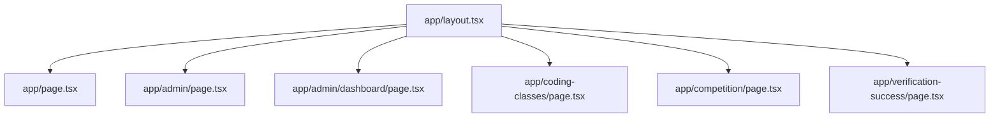
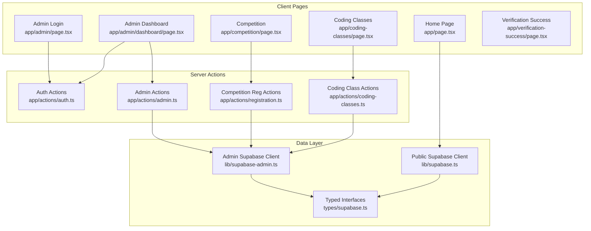
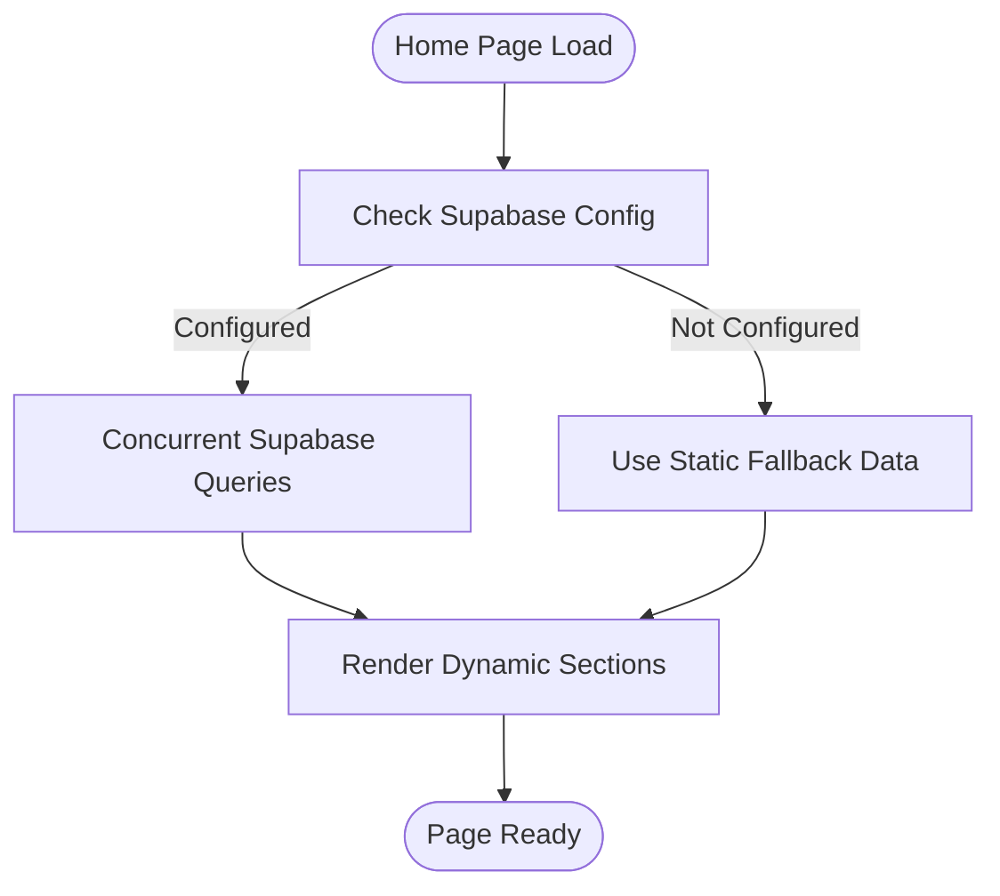
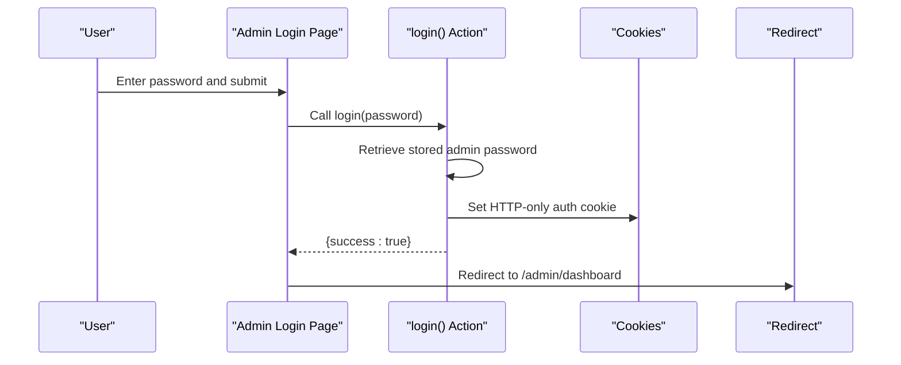
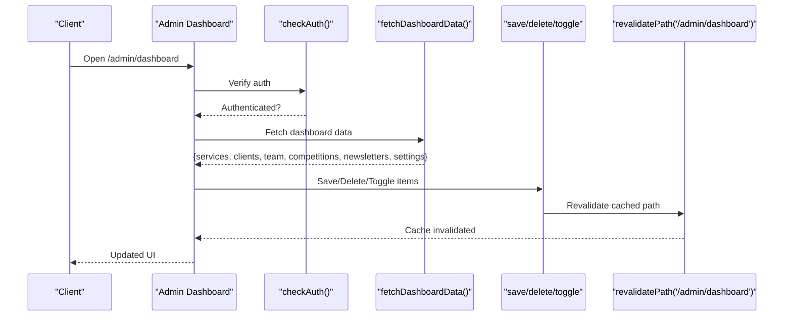
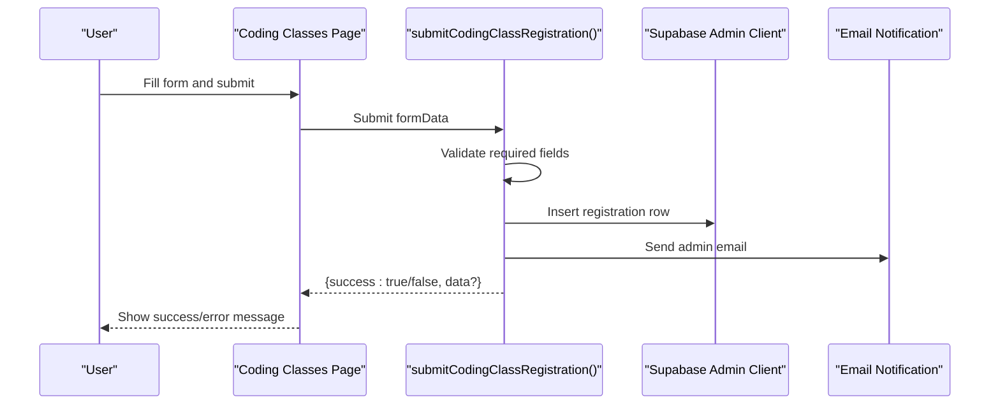
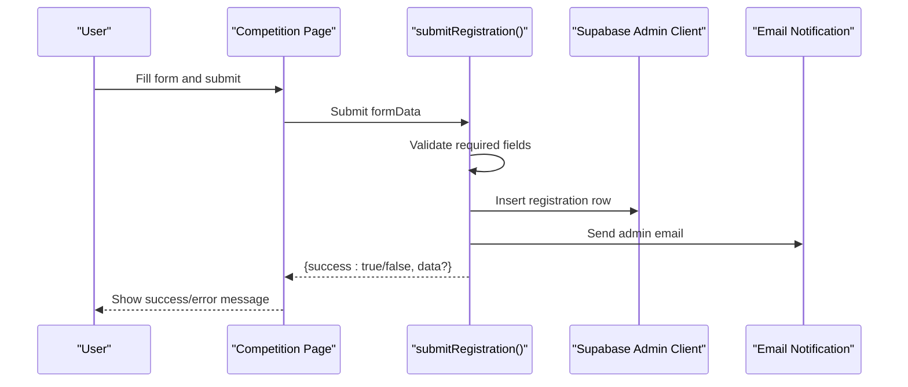
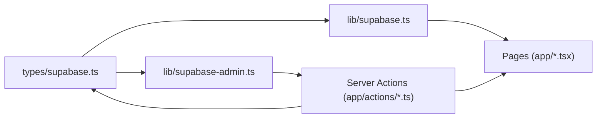

# Pages and Routing

<cite>
**Referenced Files in This Document**
- [app/layout.tsx](file://app/layout.tsx)
- [app/page.tsx](file://app/page.tsx)
- [app/admin/page.tsx](file://app/admin/page.tsx)
- [app/admin/dashboard/page.tsx](file://app/admin/dashboard/page.tsx)
- [app/coding-classes/page.tsx](file://app/coding-classes/page.tsx)
- [app/competition/page.tsx](file://app/competition/page.tsx)
- [app/verification-success/page.tsx](file://app/verification-success/page.tsx)
- [app/actions/auth.ts](file://app/actions/auth.ts)
- [app/actions/admin.ts](file://app/actions/admin.ts)
- [app/actions/registration.ts](file://app/actions/registration.ts)
- [app/actions/coding-classes.ts](file://app/actions/coding-classes.ts)
- [lib/supabase.ts](file://lib/supabase.ts)
- [lib/supabase-admin.ts](file://lib/supabase-admin.ts)
- [types/supabase.ts](file://types/supabase.ts)
</cite>

## Table of Contents
1. [Introduction](#introduction)
2. [Project Structure](#project-structure)
3. [Core Components](#core-components)
4. [Architecture Overview](#architecture-overview)
5. [Detailed Component Analysis](#detailed-component-analysis)
6. [Dependency Analysis](#dependency-analysis)
7. [Performance Considerations](#performance-considerations)
8. [Troubleshooting Guide](#troubleshooting-guide)
9. [Conclusion](#conclusion)
10. [Appendices](#appendices)

## Introduction
This document explains the Next.js pages and routing system used by Rhema Expert Solutions. It covers the file-based routing model, page organization, navigation patterns, page-level data fetching, SEO and meta tag management, protected routes and authentication, server actions and form handling, state management, and guidelines for extending the system with new pages. It also addresses responsive design and mobile-first routing strategies.

## Project Structure
The application follows Next.js App Router conventions with a strict file-based routing hierarchy under the app directory. Each route corresponds to a page.tsx file, enabling automatic route generation. Shared layout and metadata are centralized in layout.tsx and the root page.tsx serves as the home page.

**Diagram sources**
- [app/layout.tsx:1-43](file://app/layout.tsx#L1-L43)
- [app/page.tsx:1-788](file://app/page.tsx#L1-L788)
- [app/admin/page.tsx:1-52](file://app/admin/page.tsx#L1-L52)
- [app/admin/dashboard/page.tsx:1-1055](file://app/admin/dashboard/page.tsx#L1-L1055)
- [app/coding-classes/page.tsx:1-390](file://app/coding-classes/page.tsx#L1-L390)
- [app/competition/page.tsx:1-316](file://app/competition/page.tsx#L1-L316)
- [app/verification-success/page.tsx:1-80](file://app/verification-success/page.tsx#L1-L80)

**Section sources**
- [app/layout.tsx:1-43](file://app/layout.tsx#L1-L43)
- [app/page.tsx:1-788](file://app/page.tsx#L1-L788)

## Core Components
- Root Layout and Metadata: Defines global fonts, favicon, and site metadata for SEO.
- Home Page: Implements page-level data fetching from Supabase, dynamic content management, and responsive sections.
- Admin Authentication: Provides a password-protected login page backed by server actions.
- Admin Dashboard: Central administrative interface with CRUD operations, modal forms, and protected access.
- Course Catalog (Coding Classes): Client-side form handling and server action submission for registrations.
- Competition Registration: Client-side form handling and server action submission for competition entries.
- Verification Success: Static success page for verification flows.

**Section sources**
- [app/layout.tsx:16-22](file://app/layout.tsx#L16-L22)
- [app/page.tsx:12-788](file://app/page.tsx#L12-L788)
- [app/admin/page.tsx:7-52](file://app/admin/page.tsx#L7-L52)
- [app/admin/dashboard/page.tsx:27-1055](file://app/admin/dashboard/page.tsx#L27-L1055)
- [app/coding-classes/page.tsx:26-390](file://app/coding-classes/page.tsx#L26-L390)
- [app/competition/page.tsx:8-316](file://app/competition/page.tsx#L8-L316)
- [app/verification-success/page.tsx:6-80](file://app/verification-success/page.tsx#L6-L80)

## Architecture Overview
The routing system leverages Next.js App Router’s file-based structure. Pages are rendered client-side (with the exception of server actions) and communicate with Supabase via dedicated clients. Authentication is enforced via cookies and server actions. Server actions encapsulate form submissions and admin operations, ensuring type safety and revalidation.

**Diagram sources**
- [app/page.tsx:8-42](file://app/page.tsx#L8-L42)
- [app/admin/page.tsx:5](file://app/admin/page.tsx#L5)
- [app/admin/dashboard/page.tsx:6-9](file://app/admin/dashboard/page.tsx#L6-L9)
- [app/coding-classes/page.tsx:5](file://app/coding-classes/page.tsx#L5)
- [app/competition/page.tsx:5](file://app/competition/page.tsx#L5)
- [app/actions/auth.ts:7-43](file://app/actions/auth.ts#L7-L43)
- [app/actions/admin.ts:38-98](file://app/actions/admin.ts#L38-L98)
- [app/actions/registration.ts:22-84](file://app/actions/registration.ts#L22-L84)
- [app/actions/coding-classes.ts:20-76](file://app/actions/coding-classes.ts#L20-L76)
- [lib/supabase.ts:16-24](file://lib/supabase.ts#L16-L24)
- [lib/supabase-admin.ts:14-18](file://lib/supabase-admin.ts#L14-L18)
- [types/supabase.ts:5-98](file://types/supabase.ts#L5-L98)

## Detailed Component Analysis

### Home Page (app/page.tsx)
- Purpose: Marketing and informational hub with dynamic content from Supabase and fallback static content.
- Data Fetching: Uses a single-page async function to fetch multiple datasets concurrently, with graceful fallbacks when Supabase is unavailable.
- Dynamic Content Management: Content keys are resolved via a helper that reads from a content table, allowing editors to manage hero, contact, and other copy.
- Sections: Hero slideshow, training preview, competition banner, about, services, projects gallery, clients, team, contact, and footer.
- Navigation: Internal anchor links and external links to course catalog and competitions.

**Diagram sources**
- [app/page.tsx:21-42](file://app/page.tsx#L21-L42)
- [app/page.tsx:44-48](file://app/page.tsx#L44-L48)
- [app/page.tsx:125-138](file://app/page.tsx#L125-L138)

**Section sources**
- [app/page.tsx:12-788](file://app/page.tsx#L12-L788)
- [lib/supabase.ts:16-24](file://lib/supabase.ts#L16-L24)
- [types/supabase.ts:5-54](file://types/supabase.ts#L5-L54)

### Admin Authentication (app/admin/page.tsx)
- Purpose: Secure login for administrators using a server action.
- Implementation: Client-side form submits to a server action that validates against a stored admin password and sets an HTTP-only cookie.
- Navigation: On success, redirects to the admin dashboard.

**Diagram sources**
- [app/admin/page.tsx:12-23](file://app/admin/page.tsx#L12-L23)
- [app/actions/auth.ts:7-43](file://app/actions/auth.ts#L7-L43)

**Section sources**
- [app/admin/page.tsx:7-52](file://app/admin/page.tsx#L7-L52)
- [app/actions/auth.ts:7-43](file://app/actions/auth.ts#L7-L43)

### Admin Dashboard (app/admin/dashboard/page.tsx)
- Purpose: Central administrative interface for managing services, clients, team members, competitions, newsletter posts, general settings, and registrations.
- Protected Routes: Uses a client-side guard to verify authentication via a server action and redirects unauthenticated users to the login page.
- Data Fetching: Server action aggregates data from multiple tables and ensures the admin password exists in settings.
- Forms and Modals: Unified modal handles creation/editing across multiple entities; separate modal for viewing/editing registrations.
- State Management: React state manages active tab, loading, errors, and form data; server actions trigger cache revalidation.

**Diagram sources**
- [app/admin/dashboard/page.tsx:54-102](file://app/admin/dashboard/page.tsx#L54-L102)
- [app/actions/admin.ts:38-98](file://app/actions/admin.ts#L38-L98)
- [app/actions/admin.ts:21-36](file://app/actions/admin.ts#L21-L36)
- [app/actions/admin.ts:179-187](file://app/actions/admin.ts#L179-L187)
- [app/actions/admin.ts:189-197](file://app/actions/admin.ts#L189-L197)

**Section sources**
- [app/admin/dashboard/page.tsx:27-1055](file://app/admin/dashboard/page.tsx#L27-L1055)
- [app/actions/admin.ts:14-19](file://app/actions/admin.ts#L14-L19)
- [app/actions/admin.ts:38-98](file://app/actions/admin.ts#L38-L98)

### Course Catalog (Coding Classes) (app/coding-classes/page.tsx)
- Purpose: Registration page for online coding classes with course selection and flexible payment plans.
- Form Handling: Client-side form collects student details, course preferences, and payment plan; submits to a server action.
- Validation: Basic client-side required field enforcement; server action performs robust validation and inserts records.
- Feedback: Displays success/error messages and resets form upon successful submission.

**Diagram sources**
- [app/coding-classes/page.tsx:56-86](file://app/coding-classes/page.tsx#L56-L86)
- [app/actions/coding-classes.ts:20-76](file://app/actions/coding-classes.ts#L20-L76)

**Section sources**
- [app/coding-classes/page.tsx:26-390](file://app/coding-classes/page.tsx#L26-L390)
- [app/actions/coding-classes.ts:20-76](file://app/actions/coding-classes.ts#L20-L76)

### Competition Registration (app/competition/page.tsx)
- Purpose: Registration page for the national coding competition with student and parent/guardian details.
- Form Handling: Client-side form collects required fields; submits to a server action.
- Validation: Client-side required fields; server action validates and inserts records.
- Feedback: Displays success/error messages and resets form upon successful submission.

**Diagram sources**
- [app/competition/page.tsx:32-64](file://app/competition/page.tsx#L32-L64)
- [app/actions/registration.ts:22-84](file://app/actions/registration.ts#L22-L84)

**Section sources**
- [app/competition/page.tsx:8-316](file://app/competition/page.tsx#L8-L316)
- [app/actions/registration.ts:22-84](file://app/actions/registration.ts#L22-L84)

### Verification Success (app/verification-success/page.tsx)
- Purpose: Confirmation page after account verification, guiding users to dashboard or home.
- Navigation: Provides links to dashboard and home; includes social media link.

**Section sources**
- [app/verification-success/page.tsx:6-80](file://app/verification-success/page.tsx#L6-L80)

## Dependency Analysis
- Supabase Clients:
  - Public client for read-only access in pages.
  - Admin client for authenticated writes and bypassing Row Level Security.
- Typed Interfaces: Strongly typed Supabase records ensure safer data handling across pages and actions.
- Server Actions: Encapsulate all mutations and enforce authentication and revalidation.

**Diagram sources**
- [types/supabase.ts:5-98](file://types/supabase.ts#L5-L98)
- [lib/supabase.ts:16-24](file://lib/supabase.ts#L16-L24)
- [lib/supabase-admin.ts:14-18](file://lib/supabase-admin.ts#L14-L18)
- [app/actions/admin.ts:3-5](file://app/actions/admin.ts#L3-L5)
- [app/actions/registration.ts:3-4](file://app/actions/registration.ts#L3-L4)
- [app/actions/coding-classes.ts:3-5](file://app/actions/coding-classes.ts#L3-L5)

**Section sources**
- [lib/supabase.ts:16-24](file://lib/supabase.ts#L16-L24)
- [lib/supabase-admin.ts:14-18](file://lib/supabase-admin.ts#L14-L18)
- [types/supabase.ts:5-98](file://types/supabase.ts#L5-L98)

## Performance Considerations
- Concurrent Data Fetching: Home page uses concurrent queries to reduce total fetch time.
- Graceful Degradation: When Supabase is unavailable, the page falls back to static content to avoid blank screens.
- Client-Side Rendering: Admin pages and course pages rely on client-side state and server action calls, minimizing unnecessary SSR overhead.
- Cache Revalidation: Server actions call revalidatePath to keep admin dashboards fresh without full page reloads.

[No sources needed since this section provides general guidance]

## Troubleshooting Guide
- Supabase Not Configured:
  - Symptom: Dynamic content missing on home page.
  - Cause: Missing environment variables for Supabase public client.
  - Resolution: Ensure NEXT_PUBLIC_SUPABASE_URL and NEXT_PUBLIC_SUPABASE_ANON_KEY are set; otherwise, static fallbacks will be used.
- Admin Login Fails:
  - Symptom: Invalid password error.
  - Cause: Incorrect password or missing admin password in settings.
  - Resolution: Confirm stored admin password; the system auto-creates a default if missing.
- Unauthorized Access to Admin Dashboard:
  - Symptom: Redirect to admin login.
  - Cause: Missing or invalid auth cookie.
  - Resolution: Log in again; ensure cookies are enabled.
- Registration Submissions Fail:
  - Symptom: Error messages on course or competition pages.
  - Cause: Missing required fields or database errors.
  - Resolution: Validate form inputs; check server action logs for detailed errors.

**Section sources**
- [lib/supabase.ts:10-13](file://lib/supabase.ts#L10-L13)
- [app/actions/auth.ts:19-29](file://app/actions/auth.ts#L19-L29)
- [app/actions/auth.ts:50-54](file://app/actions/auth.ts#L50-L54)
- [app/actions/registration.ts:40-43](file://app/actions/registration.ts#L40-L43)
- [app/actions/coding-classes.ts:35-38](file://app/actions/coding-classes.ts#L35-L38)

## Conclusion
Rhema Expert Solutions employs a clean, file-based Next.js routing structure with robust server actions for authentication and data mutations. The home page demonstrates efficient concurrent data fetching and graceful fallbacks. The admin system enforces protection via cookies and server actions, while client pages provide streamlined form handling with immediate feedback. Extending the system requires adding new pages under app/, implementing server actions for mutations, and ensuring proper typing and caching.

[No sources needed since this section summarizes without analyzing specific files]

## Appendices

### Route Parameters and Dynamic Routing
- Current Implementation: No dynamic route parameters are used. Routes are static and correspond to file paths under app/.
- Adding Dynamic Segments: To introduce dynamic routing (e.g., /competition/[slug]), create a nested folder with a page.tsx and access parameters via the useParams hook in Next.js.

[No sources needed since this section provides general guidance]

### Navigation Patterns
- Internal Navigation: Use Next.js Link for client-side navigations to improve perceived performance.
- External Links: Use standard anchor tags for external resources.
- Programmatic Navigation: Use useRouter for redirects after successful actions (e.g., admin login).

**Section sources**
- [app/admin/page.tsx:19](file://app/admin/page.tsx#L19)
- [app/competition/page.tsx:73](file://app/competition/page.tsx#L73)
- [app/coding-classes/page.tsx:94](file://app/coding-classes/page.tsx#L94)

### SEO and Meta Tag Management
- Global Metadata: Defined in the root layout for title, description, and other metadata.
- Page-Level Metadata: Pages can augment metadata using metadata exports; ensure canonical URLs and Open Graph tags are set consistently.

**Section sources**
- [app/layout.tsx:16-22](file://app/layout.tsx#L16-L22)

### Protected Routes and Access Control
- Authentication Cookie: Admin login sets an HTTP-only cookie; server actions check for this cookie to authorize operations.
- Client Guard: Admin dashboard verifies authentication on mount and redirects if unauthorized.

**Section sources**
- [app/actions/auth.ts:32-38](file://app/actions/auth.ts#L32-L38)
- [app/actions/auth.ts:50-54](file://app/actions/auth.ts#L50-L54)
- [app/admin/dashboard/page.tsx:54-63](file://app/admin/dashboard/page.tsx#L54-L63)

### Relationship Between Pages and Server Actions
- Pages call server actions for all mutations, ensuring type safety and centralized validation.
- Server actions use the admin client to bypass RLS and insert/update/delete records, then revalidate cached paths.

**Section sources**
- [app/coding-classes/page.tsx:62](file://app/coding-classes/page.tsx#L62)
- [app/competition/page.tsx:38](file://app/competition/page.tsx#L38)
- [app/actions/admin.ts:34](file://app/actions/admin.ts#L34)
- [app/actions/admin.ts:185](file://app/actions/admin.ts#L185)

### Guidelines for Adding New Pages
- Create a new page.tsx under app/<route>/.
- Implement client-side logic and server actions for mutations.
- Use typed interfaces from types/supabase.ts for data consistency.
- Add navigation links in relevant components (e.g., header, footer).
- Ensure SEO metadata is set appropriately in the new page or layout.
- For protected areas, add a client-side auth check similar to the admin dashboard.

[No sources needed since this section provides general guidance]

### Responsive Design and Mobile-First Routing
- Mobile-First Components: Components like HeroSlideshow, AutoScrollGallery, and ImageWithSkeleton are designed to adapt across screen sizes.
- Navigation: Use responsive layouts and consider mobile-friendly form fields and buttons.
- Routing: Keep routes shallow and intuitive; avoid deep nesting that complicates mobile navigation.

[No sources needed since this section provides general guidance]