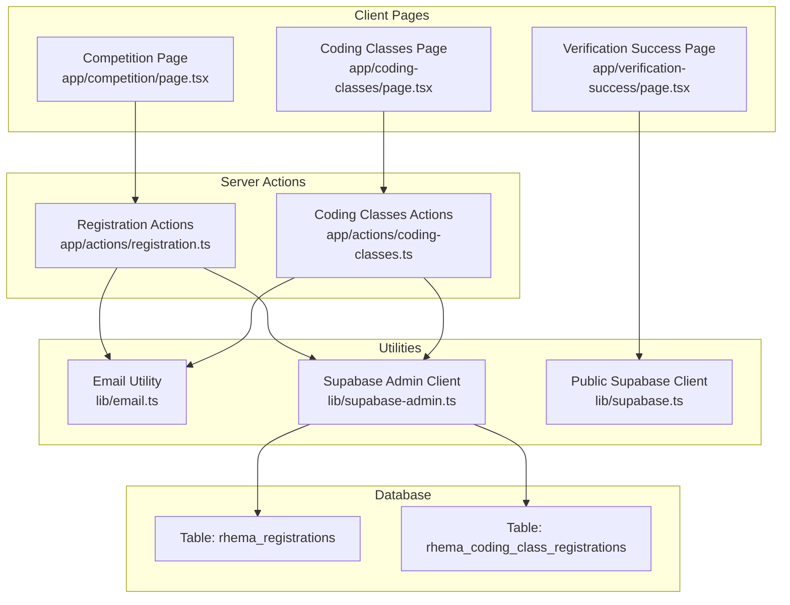
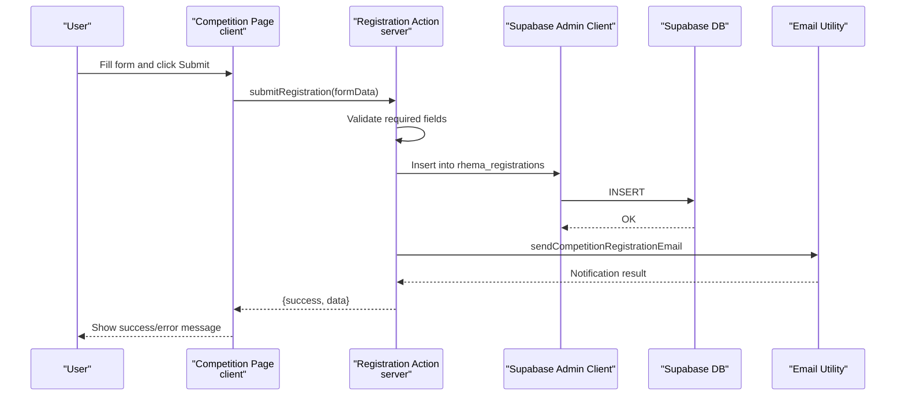
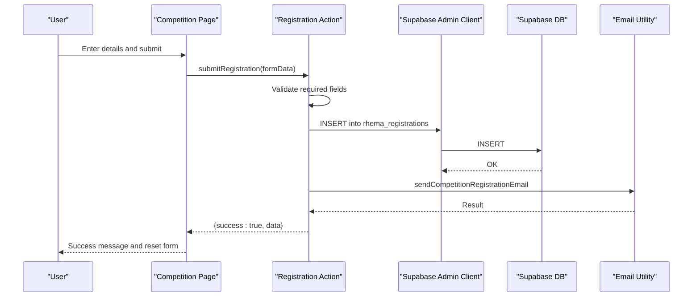
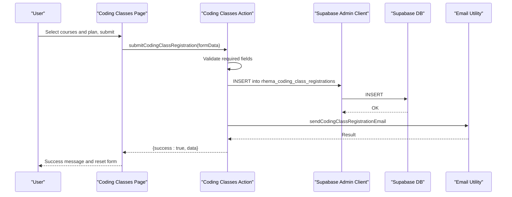
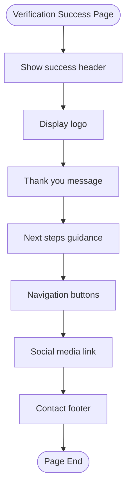
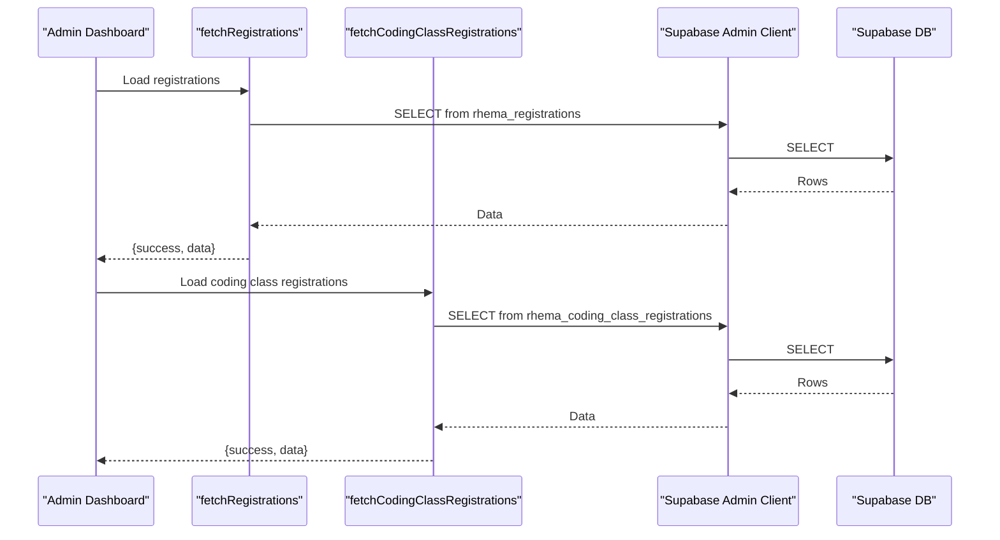
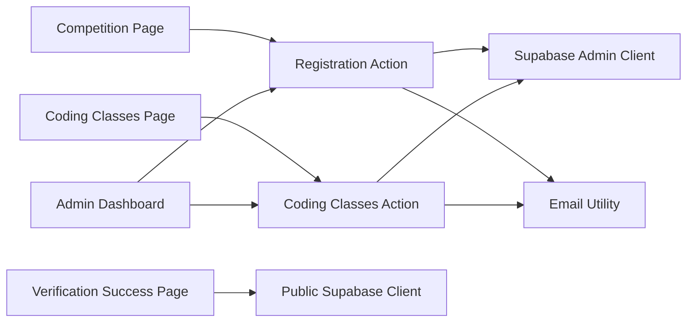

# Registration Flow

<cite>
**Referenced Files in This Document**
- [app/competition/page.tsx](file://app/competition/page.tsx)
- [app/coding-classes/page.tsx](file://app/coding-classes/page.tsx)
- [app/actions/registration.ts](file://app/actions/registration.ts)
- [app/actions/coding-classes.ts](file://app/actions/coding-classes.ts)
- [lib/email.ts](file://lib/email.ts)
- [lib/supabase-admin.ts](file://lib/supabase-admin.ts)
- [lib/supabase.ts](file://lib/supabase.ts)
- [app/verification-success/page.tsx](file://app/verification-success/page.tsx)
- [app/admin/dashboard/page.tsx](file://app/admin/dashboard/page.tsx)
- [types/supabase.ts](file://types/supabase.ts)
- [supabase_migration_add_school_phone.sql](file://supabase_migration_add_school_phone.sql)
</cite>

## Table of Contents
1. [Introduction](#introduction)
2. [Project Structure](#project-structure)
3. [Core Components](#core-components)
4. [Architecture Overview](#architecture-overview)
5. [Detailed Component Analysis](#detailed-component-analysis)
6. [Dependency Analysis](#dependency-analysis)
7. [Performance Considerations](#performance-considerations)
8. [Troubleshooting Guide](#troubleshooting-guide)
9. [Conclusion](#conclusion)
10. [Appendices](#appendices)

## Introduction
This document explains the student registration and verification flow for Rhema Expert Solutions, focusing on the Smart Coders National Competition registration and the Online Coding Classes registration. It covers the step-by-step registration process, form validation, user feedback mechanisms, server action integration, email notifications, database operations, and the user experience from initial registration to successful verification. It also outlines security considerations, data privacy compliance, mobile responsiveness, accessibility features, and cross-platform compatibility, and describes the relationship between registration pages and the broader course enrollment system.

## Project Structure
The registration flow spans client-side pages, server actions, email utilities, and Supabase integrations:
- Client pages collect user input and manage local state and user feedback.
- Server actions encapsulate validation, persistence, and notifications.
- Email utilities send administrative notifications.
- Supabase clients handle database operations with appropriate roles.

**Diagram sources**
- [app/competition/page.tsx:1-316](file://app/competition/page.tsx#L1-L316)
- [app/coding-classes/page.tsx:1-390](file://app/coding-classes/page.tsx#L1-L390)
- [app/actions/registration.ts:1-131](file://app/actions/registration.ts#L1-L131)
- [app/actions/coding-classes.ts:1-157](file://app/actions/coding-classes.ts#L1-L157)
- [lib/email.ts:1-134](file://lib/email.ts#L1-L134)
- [lib/supabase-admin.ts:1-19](file://lib/supabase-admin.ts#L1-L19)
- [lib/supabase.ts:1-25](file://lib/supabase.ts#L1-L25)

**Section sources**
- [app/competition/page.tsx:1-316](file://app/competition/page.tsx#L1-L316)
- [app/coding-classes/page.tsx:1-390](file://app/coding-classes/page.tsx#L1-L390)
- [app/actions/registration.ts:1-131](file://app/actions/registration.ts#L1-L131)
- [app/actions/coding-classes.ts:1-157](file://app/actions/coding-classes.ts#L1-L157)
- [lib/email.ts:1-134](file://lib/email.ts#L1-L134)
- [lib/supabase-admin.ts:1-19](file://lib/supabase-admin.ts#L1-L19)
- [lib/supabase.ts:1-25](file://lib/supabase.ts#L1-L25)

## Core Components
- Competition Registration Page: Collects student and parent/guardian details, validates required fields, submits via server action, and displays user feedback.
- Coding Classes Registration Page: Collects student profile, course selections, payment plan, and optional metadata; validates required fields; submits via server action; displays user feedback.
- Registration Actions: Validate inputs, insert records into respective tables, and dispatch administrative emails.
- Coding Classes Actions: Validate inputs, insert records into the coding class registrations table, and dispatch administrative emails.
- Email Utility: Sends HTML emails to administrators upon new registrations.
- Supabase Admin Client: Uses a service role key to bypass Row-Level Security for write operations.
- Public Supabase Client: Used for read-only operations and content rendering on public pages.
- Verification Success Page: Confirms successful verification and provides navigation and social links.

**Section sources**
- [app/competition/page.tsx:8-315](file://app/competition/page.tsx#L8-L315)
- [app/coding-classes/page.tsx:26-389](file://app/coding-classes/page.tsx#L26-L389)
- [app/actions/registration.ts:22-84](file://app/actions/registration.ts#L22-L84)
- [app/actions/coding-classes.ts:20-76](file://app/actions/coding-classes.ts#L20-L76)
- [lib/email.ts:46-86](file://lib/email.ts#L46-L86)
- [lib/supabase-admin.ts:14-18](file://lib/supabase-admin.ts#L14-L18)
- [lib/supabase.ts:16-24](file://lib/supabase.ts#L16-L24)
- [app/verification-success/page.tsx:6-79](file://app/verification-success/page.tsx#L6-L79)

## Architecture Overview
The registration flow follows a client-server pattern:
- Client pages capture user input and manage UI state.
- Server actions validate and sanitize inputs, persist to Supabase, and send notifications.
- Administrative dashboards consume server actions to manage registrations.

**Diagram sources**
- [app/competition/page.tsx:32-64](file://app/competition/page.tsx#L32-L64)
- [app/actions/registration.ts:22-84](file://app/actions/registration.ts#L22-L84)
- [lib/supabase-admin.ts:14-18](file://lib/supabase-admin.ts#L14-L18)
- [lib/email.ts:46-86](file://lib/email.ts#L46-L86)

## Detailed Component Analysis

### Competition Registration Flow
- Form fields include student details, school information, class level, category, and parent/guardian contact.
- Required fields enforced on the client and server.
- Submission triggers a server action that inserts a record with status pending and sends an administrative email.
- On success, the page clears the form and scrolls to the top to show a success message.

**Diagram sources**
- [app/competition/page.tsx:32-64](file://app/competition/page.tsx#L32-L64)
- [app/actions/registration.ts:40-84](file://app/actions/registration.ts#L40-L84)
- [lib/email.ts:46-86](file://lib/email.ts#L46-L86)

**Section sources**
- [app/competition/page.tsx:10-64](file://app/competition/page.tsx#L10-L64)
- [app/actions/registration.ts:22-84](file://app/actions/registration.ts#L22-L84)

### Coding Classes Registration Flow
- Form collects student profile, course selections, payment plan, experience level, preferred start date, and notes.
- Required validations ensure at least one course and a payment plan are selected.
- Submission persists to the coding class registrations table and sends an administrative email.

**Diagram sources**
- [app/coding-classes/page.tsx:56-86](file://app/coding-classes/page.tsx#L56-L86)
- [app/actions/coding-classes.ts:20-76](file://app/actions/coding-classes.ts#L20-L76)
- [lib/email.ts:88-133](file://lib/email.ts#L88-L133)

**Section sources**
- [app/coding-classes/page.tsx:27-86](file://app/coding-classes/page.tsx#L27-L86)
- [app/actions/coding-classes.ts:20-76](file://app/actions/coding-classes.ts#L20-L76)

### Verification Success Page
- Provides a success header, logo, thank-you message, next steps guidance, and navigation links.
- Includes social media and contact information for support.

**Diagram sources**
- [app/verification-success/page.tsx:6-79](file://app/verification-success/page.tsx#L6-L79)

**Section sources**
- [app/verification-success/page.tsx:6-79](file://app/verification-success/page.tsx#L6-L79)

### Admin Dashboard Integration
- The admin dashboard fetches registrations from server actions and presents them for management.
- It supports viewing, editing, updating status, and deleting registrations for both competition and coding classes.

**Diagram sources**
- [app/admin/dashboard/page.tsx:85-126](file://app/admin/dashboard/page.tsx#L85-L126)
- [app/actions/registration.ts:86-100](file://app/actions/registration.ts#L86-L100)
- [app/actions/coding-classes.ts:78-96](file://app/actions/coding-classes.ts#L78-L96)
- [lib/supabase-admin.ts:14-18](file://lib/supabase-admin.ts#L14-L18)

**Section sources**
- [app/admin/dashboard/page.tsx:85-126](file://app/admin/dashboard/page.tsx#L85-L126)
- [app/actions/registration.ts:86-100](file://app/actions/registration.ts#L86-L100)
- [app/actions/coding-classes.ts:78-96](file://app/actions/coding-classes.ts#L78-L96)

## Dependency Analysis
- Client pages depend on server actions for submission and feedback.
- Server actions depend on the Supabase admin client for database writes and the email utility for notifications.
- The public Supabase client is used for read-only content rendering on public pages.
- The admin dashboard depends on server actions to fetch and manage registrations.

**Diagram sources**
- [app/competition/page.tsx](file://app/competition/page.tsx#L5)
- [app/coding-classes/page.tsx](file://app/coding-classes/page.tsx#L5)
- [app/actions/registration.ts](file://app/actions/registration.ts#L3)
- [app/actions/coding-classes.ts](file://app/actions/coding-classes.ts#L3)
- [lib/supabase-admin.ts:14-18](file://lib/supabase-admin.ts#L14-L18)
- [lib/email.ts:1-134](file://lib/email.ts#L1-L134)
- [lib/supabase.ts:16-24](file://lib/supabase.ts#L16-L24)
- [app/admin/dashboard/page.tsx:8-11](file://app/admin/dashboard/page.tsx#L8-L11)

**Section sources**
- [app/competition/page.tsx](file://app/competition/page.tsx#L5)
- [app/coding-classes/page.tsx](file://app/coding-classes/page.tsx#L5)
- [app/actions/registration.ts](file://app/actions/registration.ts#L3)
- [app/actions/coding-classes.ts](file://app/actions/coding-classes.ts#L3)
- [lib/supabase-admin.ts:14-18](file://lib/supabase-admin.ts#L14-L18)
- [lib/email.ts:1-134](file://lib/email.ts#L1-L134)
- [lib/supabase.ts:16-24](file://lib/supabase.ts#L16-L24)
- [app/admin/dashboard/page.tsx:8-11](file://app/admin/dashboard/page.tsx#L8-L11)

## Performance Considerations
- Minimize network requests by batching reads on the home page and avoiding unnecessary re-renders in forms.
- Use optimistic UI patterns carefully; ensure server action responses are handled to revert UI on failure.
- Keep email sending asynchronous to avoid blocking form submissions.
- Optimize database queries with appropriate ordering and selection strategies.

## Troubleshooting Guide
- Registration fails with validation errors:
  - Ensure required fields are filled on both client and server sides.
  - Check server action logs for explicit error messages.
- Email notifications not received:
  - Verify SMTP credentials are configured; the email utility returns a specific error when missing.
  - Confirm administrative email addresses are correctly set.
- Database insertion errors:
  - Review Supabase service role key configuration; the admin client warns if the service role key is missing.
  - Check table schemas and migrations for required columns.
- Admin dashboard unauthorized:
  - Authentication checks are performed before fetching sensitive data; ensure proper login flow.

**Section sources**
- [app/actions/registration.ts:40-84](file://app/actions/registration.ts#L40-L84)
- [app/actions/coding-classes.ts:35-76](file://app/actions/coding-classes.ts#L35-L76)
- [lib/email.ts:23-44](file://lib/email.ts#L23-L44)
- [lib/supabase-admin.ts:7-9](file://lib/supabase-admin.ts#L7-L9)
- [app/admin/dashboard/page.tsx:80-103](file://app/admin/dashboard/page.tsx#L80-L103)

## Conclusion
The registration system integrates client-side forms, server actions, email notifications, and Supabase storage to deliver a robust and user-friendly experience. Validation occurs on both client and server, feedback is immediate, and administrative oversight is supported through the dashboard. The architecture supports scalability and maintainability while ensuring secure and compliant data handling.

## Appendices

### Form Field Validation Guidelines
- Competition Registration:
  - Required: full_name, gender, age, school_name, class_level, category, parent_name, parent_phone.
  - Optional: date_of_birth, school_address, school_phone.
- Coding Classes Registration:
  - Required: full_name, phone, courses (non-empty), payment_plan.
  - Optional: email, age, gender, experience_level, preferred_start_date, notes.

**Section sources**
- [app/competition/page.tsx:224-290](file://app/competition/page.tsx#L224-L290)
- [app/actions/registration.ts:40-43](file://app/actions/registration.ts#L40-L43)
- [app/coding-classes/page.tsx:200-375](file://app/coding-classes/page.tsx#L200-L375)
- [app/actions/coding-classes.ts:35-38](file://app/actions/coding-classes.ts#L35-L38)

### Security and Privacy Considerations
- Use HTTPS and secure cookies for authentication.
- Sanitize and validate all inputs server-side.
- Limit stored personal data to what is necessary for the competition or course enrollment.
- Configure Supabase RLS appropriately; the admin client uses a service role key to bypass RLS for administrative operations.
- Store sensitive environment variables outside the repository and restrict access.

**Section sources**
- [lib/supabase-admin.ts:4-9](file://lib/supabase-admin.ts#L4-L9)
- [app/actions/registration.ts:22-84](file://app/actions/registration.ts#L22-L84)
- [app/actions/coding-classes.ts:20-76](file://app/actions/coding-classes.ts#L20-L76)

### Mobile Responsiveness and Accessibility
- Forms use responsive layouts with appropriate spacing and typography.
- Inputs are labeled clearly; required fields are indicated.
- Buttons provide sufficient touch targets and visual feedback.
- Color contrast meets accessibility guidelines for readability.

**Section sources**
- [app/competition/page.tsx:223-300](file://app/competition/page.tsx#L223-L300)
- [app/coding-classes/page.tsx:200-375](file://app/coding-classes/page.tsx#L200-L375)
- [app/verification-success/page.tsx:8-79](file://app/verification-success/page.tsx#L8-L79)

### Cross-Platform Compatibility
- Client pages rely on standard browser APIs and Next.js routing.
- Server actions ensure compatibility across platforms by centralizing logic.
- Email templates use basic HTML for broad client compatibility.

**Section sources**
- [app/competition/page.tsx:1-316](file://app/competition/page.tsx#L1-L316)
- [app/coding-classes/page.tsx:1-390](file://app/coding-classes/page.tsx#L1-L390)
- [lib/email.ts:61-86](file://lib/email.ts#L61-L86)

### Relationship to Course Enrollment System
- Competition registration feeds the competition management workflow with pending statuses for follow-up.
- Coding classes registration integrates with the broader course enrollment system by capturing course preferences, payment plans, and learner metadata.
- Both flows support administrative review and status updates through the admin dashboard.

**Section sources**
- [app/actions/registration.ts:102-115](file://app/actions/registration.ts#L102-L115)
- [app/actions/coding-classes.ts:98-116](file://app/actions/coding-classes.ts#L98-L116)
- [app/admin/dashboard/page.tsx:472-721](file://app/admin/dashboard/page.tsx#L472-L721)

### Database Schema Notes
- The migration script adds a nullable school_phone column to the competition registrations table, aligning with the form and action definitions.

**Section sources**
- [supabase_migration_add_school_phone.sql:1-3](file://supabase_migration_add_school_phone.sql#L1-L3)
- [app/actions/registration.ts:10-19](file://app/actions/registration.ts#L10-L19)
- [app/competition/page.tsx:15-22](file://app/competition/page.tsx#L15-L22)