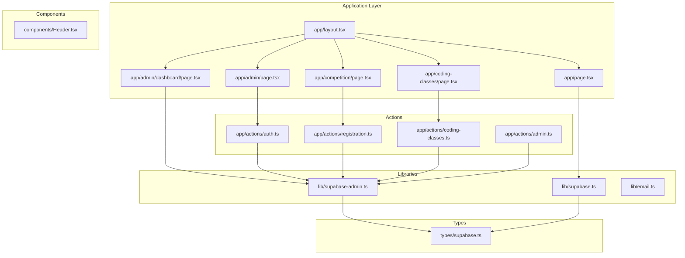
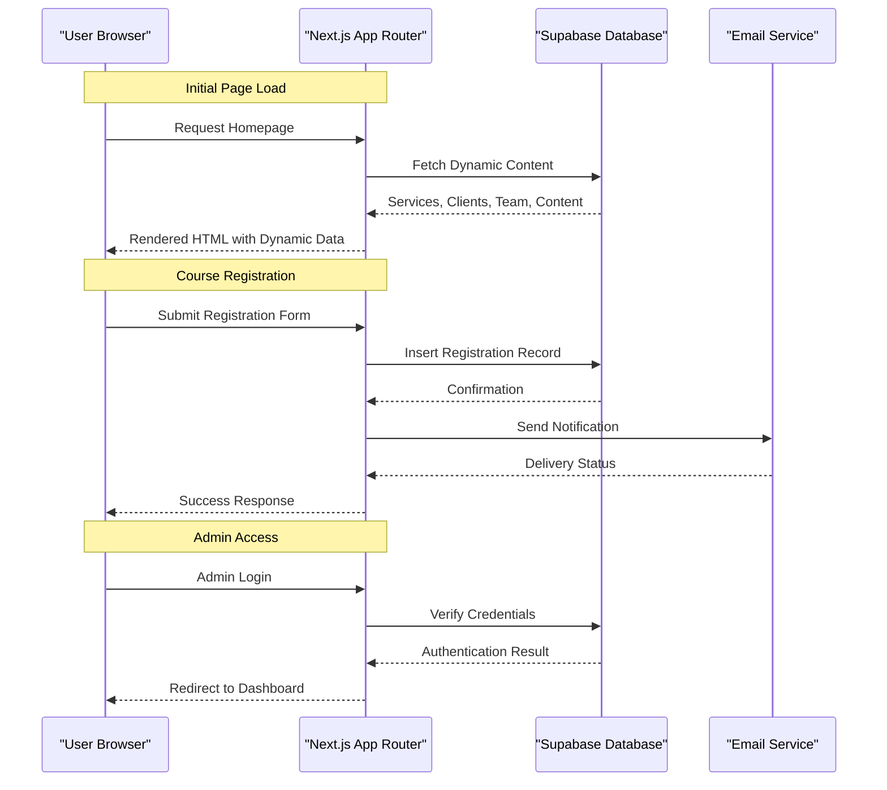
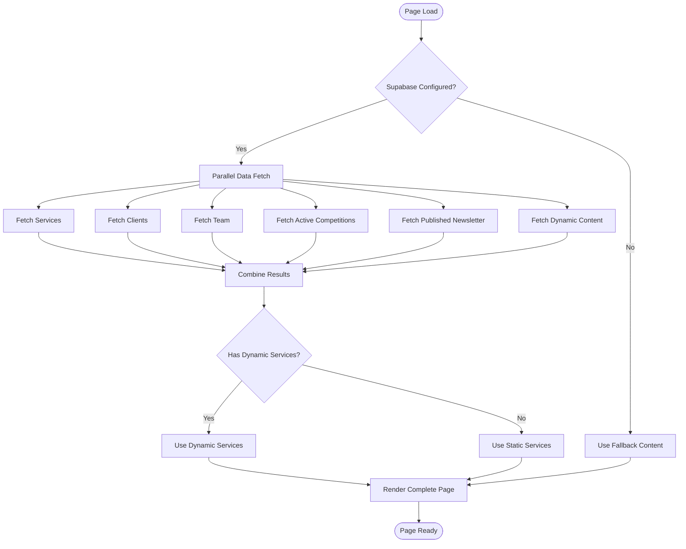
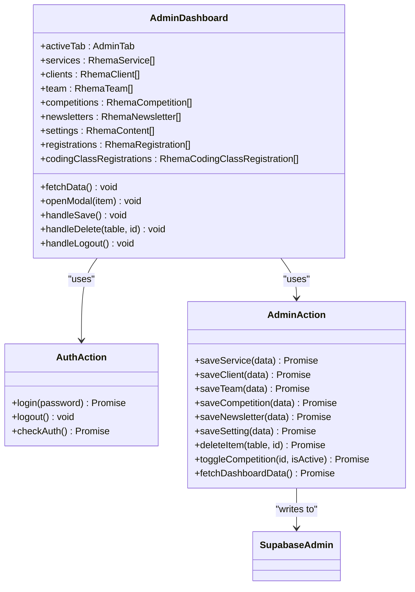
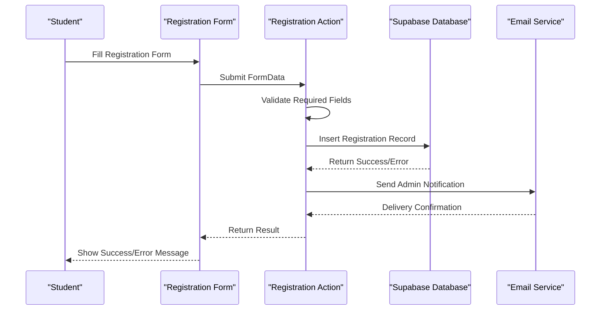

# Project Overview

<cite>
**Referenced Files in This Document**
- [README.md](file://README.md)
- [package.json](file://package.json)
- [next.config.ts](file://next.config.ts)
- [app/layout.tsx](file://app/layout.tsx)
- [app/page.tsx](file://app/page.tsx)
- [app/admin/page.tsx](file://app/admin/page.tsx)
- [app/admin/dashboard/page.tsx](file://app/admin/dashboard/page.tsx)
- [app/coding-classes/page.tsx](file://app/coding-classes/page.tsx)
- [app/competition/page.tsx](file://app/competition/page.tsx)
- [app/actions/auth.ts](file://app/actions/auth.ts)
- [app/actions/registration.ts](file://app/actions/registration.ts)
- [app/actions/coding-classes.ts](file://app/actions/coding-classes.ts)
- [app/actions/admin.ts](file://app/actions/admin.ts)
- [lib/supabase.ts](file://lib/supabase.ts)
- [lib/supabase-admin.ts](file://lib/supabase-admin.ts)
- [lib/email.ts](file://lib/email.ts)
- [types/supabase.ts](file://types/supabase.ts)
- [components/Header.tsx](file://components/Header.tsx)
</cite>

## Table of Contents
1. [Introduction](#introduction)
2. [Project Structure](#project-structure)
3. [Core Components](#core-components)
4. [Architecture Overview](#architecture-overview)
5. [Detailed Component Analysis](#detailed-component-analysis)
6. [Dependency Analysis](#dependency-analysis)
7. [Performance Considerations](#performance-considerations)
8. [Troubleshooting Guide](#troubleshooting-guide)
9. [Conclusion](#conclusion)

## Introduction
Rhema Expert Solutions is an educational technology platform designed to showcase technical courses and serve as both a marketing website and a functional application for course registration and administration. The platform focuses on AI & IoT, cybersecurity, robotics, and software development, targeting students, institutions, and administrators. It leverages modern web technologies to deliver a responsive, dynamic, and scalable solution for technical education.

Key value propositions:
- Unified showcase and registration system for technical courses
- Dynamic content management via Supabase
- Integrated competition and coding class registration workflows
- Administrative dashboard for content and registration management
- Automated email notifications for administrative workflows

## Project Structure
The project follows Next.js App Router conventions with a clear separation of concerns:
- app/: Application routes and page components
- components/: Reusable UI components
- lib/: Utility libraries (Supabase clients, email)
- types/: TypeScript type definitions
- public/: Static assets and media



**Diagram sources**
- [app/layout.tsx:1-43](file://app/layout.tsx#L1-L43)
- [app/page.tsx:1-788](file://app/page.tsx#L1-L788)
- [app/admin/page.tsx:1-52](file://app/admin/page.tsx#L1-L52)
- [app/admin/dashboard/page.tsx:1-800](file://app/admin/dashboard/page.tsx#L1-L800)
- [app/coding-classes/page.tsx:1-390](file://app/coding-classes/page.tsx#L1-L390)
- [app/competition/page.tsx:1-316](file://app/competition/page.tsx#L1-L316)
- [lib/supabase.ts:1-25](file://lib/supabase.ts#L1-L25)
- [lib/supabase-admin.ts:1-19](file://lib/supabase-admin.ts#L1-L19)
- [lib/email.ts:1-134](file://lib/email.ts#L1-L134)
- [types/supabase.ts:1-98](file://types/supabase.ts#L1-L98)

**Section sources**
- [README.md:1-37](file://README.md#L1-L37)
- [package.json:1-32](file://package.json#L1-L32)
- [next.config.ts:1-8](file://next.config.ts#L1-L8)

## Core Components
The platform consists of several interconnected components that work together to deliver a comprehensive educational technology experience:

### Marketing Website Components
- **Homepage**: Dynamic content presentation with hero sections, services, projects, clients, and team showcases
- **Header Navigation**: Responsive navigation with mobile sidebar and external links
- **Training Section**: Prominent display of online coding classes with preview and registration links
- **Competition Section**: Eye-catching presentation of the SMART CODERS national competition

### Functional Application Components
- **Admin Authentication**: Secure login system with password management
- **Admin Dashboard**: Comprehensive content management interface
- **Registration Forms**: Structured forms for competition and coding class registrations
- **Email Notifications**: Automated email alerts for administrative workflows

### Data Management
- **Supabase Integration**: Real-time database operations with both public and admin clients
- **Type Safety**: Comprehensive TypeScript interfaces for all data models
- **Dynamic Content**: Configurable content sections for marketing copy and contact information

**Section sources**
- [app/page.tsx:1-788](file://app/page.tsx#L1-L788)
- [components/Header.tsx:1-136](file://components/Header.tsx#L1-L136)
- [app/admin/page.tsx:1-52](file://app/admin/page.tsx#L1-L52)
- [app/admin/dashboard/page.tsx:1-800](file://app/admin/dashboard/page.tsx#L1-L800)
- [app/coding-classes/page.tsx:1-390](file://app/coding-classes/page.tsx#L1-L390)
- [app/competition/page.tsx:1-316](file://app/competition/page.tsx#L1-L316)
- [types/supabase.ts:1-98](file://types/supabase.ts#L1-L98)

## Architecture Overview
The platform employs a modern full-stack architecture built on Next.js 14+ with server-side rendering and static generation capabilities:



**Diagram sources**
- [app/page.tsx:12-42](file://app/page.tsx#L12-L42)
- [app/actions/registration.ts:22-84](file://app/actions/registration.ts#L22-L84)
- [lib/email.ts:23-44](file://lib/email.ts#L23-L44)
- [app/actions/auth.ts:7-43](file://app/actions/auth.ts#L7-L43)

The architecture follows these key patterns:
- **Server Actions**: Secure server-side operations for database writes and email notifications
- **Static Generation**: Optimized page rendering with dynamic content hydration
- **Real-time Data**: Supabase-powered real-time updates and caching
- **Type Safety**: Comprehensive TypeScript integration across the entire stack

**Section sources**
- [lib/supabase.ts:1-25](file://lib/supabase.ts#L1-L25)
- [lib/supabase-admin.ts:1-19](file://lib/supabase-admin.ts#L1-L19)
- [app/actions/admin.ts:38-98](file://app/actions/admin.ts#L38-L98)

## Detailed Component Analysis

### Homepage Component Analysis
The homepage serves as the primary marketing vehicle while maintaining functional capabilities:



**Diagram sources**
- [app/page.tsx:12-42](file://app/page.tsx#L12-L42)
- [app/page.tsx:119-138](file://app/page.tsx#L119-L138)

Key features:
- **Dynamic Content Management**: Content sections can be edited through the admin interface
- **Multi-source Data**: Combines database content with static fallbacks
- **Responsive Design**: Mobile-first approach with adaptive layouts
- **Performance Optimization**: Parallel data fetching and skeleton loading

**Section sources**
- [app/page.tsx:1-788](file://app/page.tsx#L1-L788)

### Admin Dashboard Component Analysis
The admin dashboard provides comprehensive content management capabilities:



**Diagram sources**
- [app/admin/dashboard/page.tsx:27-102](file://app/admin/dashboard/page.tsx#L27-L102)
- [app/actions/auth.ts:7-55](file://app/actions/auth.ts#L7-L55)
- [app/actions/admin.ts:21-98](file://app/actions/admin.ts#L21-L98)

**Section sources**
- [app/admin/dashboard/page.tsx:1-800](file://app/admin/dashboard/page.tsx#L1-L800)
- [app/actions/admin.ts:1-198](file://app/actions/admin.ts#L1-L198)

### Registration System Component Analysis
The registration system handles both competition and coding class enrollments:



**Diagram sources**
- [app/competition/page.tsx:32-64](file://app/competition/page.tsx#L32-L64)
- [app/actions/registration.ts:22-84](file://app/actions/registration.ts#L22-L84)
- [app/coding-classes/page.tsx:56-86](file://app/coding-classes/page.tsx#L56-L86)
- [app/actions/coding-classes.ts:20-76](file://app/actions/coding-classes.ts#L20-L76)

**Section sources**
- [app/competition/page.tsx:1-316](file://app/competition/page.tsx#L1-L316)
- [app/coding-classes/page.tsx:1-390](file://app/coding-classes/page.tsx#L1-L390)
- [app/actions/registration.ts:1-131](file://app/actions/registration.ts#L1-L131)
- [app/actions/coding-classes.ts:1-157](file://app/actions/coding-classes.ts#L1-L157)

### Technology Stack Overview
The platform utilizes a modern, enterprise-grade technology stack:

**Frontend Framework**
- Next.js 14+ with App Router for server-side rendering and static generation
- React 19 for component-based UI development
- TypeScript 5 for type safety and developer experience

**Styling and Performance**
- Tailwind CSS 4 for utility-first styling
- Next/font for optimized font loading
- Sharp CLI for image processing and optimization

**Backend and Data**
- Supabase for database, authentication, and real-time features
- Nodemailer for email notifications
- Environment-based configuration management

**Development Tools**
- ESLint 9 for code quality
- PostCSS for advanced CSS processing
- Git for version control

**Section sources**
- [package.json:1-32](file://package.json#L1-L32)
- [next.config.ts:1-8](file://next.config.ts#L1-L8)

## Dependency Analysis
The platform exhibits clean architectural boundaries with minimal coupling between components:

```mermaid
graph LR
subgraph "External Dependencies"
Next[Next.js 16.1.6]
React[React 19.2.4]
Supabase[@supabase/supabase-js 2.98.0]
Nodemailer[nodemailer 8.0.5]
Tailwind[tailwindcss 4]
Typescript[typescript 5]
end
subgraph "Internal Modules"
Layout[app/layout.tsx]
Pages[app/*.tsx]
Components[components/*.tsx]
Lib[lib/*.ts]
Actions[app/actions/*.ts]
Types[types/*.ts]
end
Next --> Layout
React --> Components
Supabase --> Lib
Nodemailer --> Lib
Tailwind --> Components
Typescript --> Types
Layout --> Pages
Pages --> Components
Pages --> Actions
Actions --> Lib
Components --> Types
Lib --> Types
```

**Diagram sources**
- [package.json:11-30](file://package.json#L11-L30)
- [app/layout.tsx:1-43](file://app/layout.tsx#L1-L43)
- [lib/supabase.ts:1-25](file://lib/supabase.ts#L1-L25)
- [lib/email.ts:1-134](file://lib/email.ts#L1-L134)

Key dependency characteristics:
- **Low Coupling**: Components communicate primarily through well-defined interfaces
- **Clear Separation**: Business logic encapsulated in server actions
- **Type Safety**: Comprehensive TypeScript integration prevents runtime errors
- **Environment Isolation**: External dependencies managed through environment variables

**Section sources**
- [package.json:1-32](file://package.json#L1-L32)
- [types/supabase.ts:1-98](file://types/supabase.ts#L1-L98)

## Performance Considerations
The platform implements several performance optimization strategies:

### Data Fetching Optimization
- **Parallel Data Loading**: Multiple data sources fetched concurrently using Promise.all
- **Selective Rendering**: Dynamic content only when Supabase is properly configured
- **Caching Strategy**: Next.js automatic caching with manual revalidation triggers

### Frontend Performance
- **Skeleton Loading**: Progressive enhancement with skeleton screens during data fetch
- **Image Optimization**: Next.js Image component with automatic optimization
- **Code Splitting**: Route-based code splitting through App Router
- **Font Optimization**: Self-hosted fonts with preloading

### Database Performance
- **Efficient Queries**: Targeted SELECT operations with appropriate filters
- **Batch Operations**: Concurrent database operations where safe
- **Connection Management**: Separate clients for public and admin operations

## Troubleshooting Guide

### Common Issues and Solutions

**Supabase Configuration Problems**
- **Issue**: Missing environment variables cause dynamic content to fail
- **Solution**: Verify NEXT_PUBLIC_SUPABASE_URL and NEXT_PUBLIC_SUPABASE_ANON_KEY are set
- **Prevention**: Use .env.local file with proper credentials

**Authentication Failures**
- **Issue**: Admin login redirects to login page
- **Solution**: Check ADMIN_PASSWORD environment variable and verify cookie settings
- **Debugging**: Inspect browser cookies and network requests

**Email Notification Issues**
- **Issue**: Registration emails not being sent
- **Solution**: Verify SMTP_USER and SMTP_PASS environment variables
- **Monitoring**: Check console logs for email transport errors

**Registration Form Validation**
- **Issue**: Form submissions fail validation
- **Solution**: Ensure required fields are populated and phone numbers are valid
- **User Experience**: Clear error messages indicate missing required fields

**Section sources**
- [lib/supabase.ts:10-13](file://lib/supabase.ts#L10-L13)
- [app/actions/auth.ts:31-43](file://app/actions/auth.ts#L31-L43)
- [lib/email.ts:24-27](file://lib/email.ts#L24-L27)
- [app/competition/page.tsx:36-64](file://app/competition/page.tsx#L36-L64)

## Conclusion
Rhema Expert Solutions represents a comprehensive educational technology platform that successfully balances marketing effectiveness with functional capability. The platform's architecture demonstrates modern web development best practices, including:

**Technical Excellence**
- Clean separation of concerns with well-defined component boundaries
- Type-safe development throughout the entire stack
- Efficient data management through Supabase integration
- Responsive design principles for diverse user access

**Business Value**
- Dual-purpose design serving both promotional and operational needs
- Streamlined registration processes for students and administrators
- Automated workflows reducing administrative overhead
- Scalable architecture supporting future growth

**Educational Impact**
- Comprehensive coverage of AI, IoT, cybersecurity, robotics, and software development
- Accessible pathways for students from beginner to advanced levels
- Structured learning progression through coding classes
- Competitive opportunities through organized challenges

The platform provides an excellent foundation for expanding technical education offerings while maintaining high standards for user experience, performance, and maintainability. Its modular architecture ensures continued evolution as educational technology requirements advance.