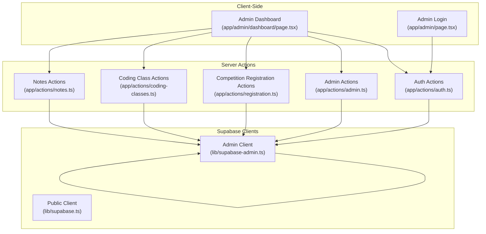
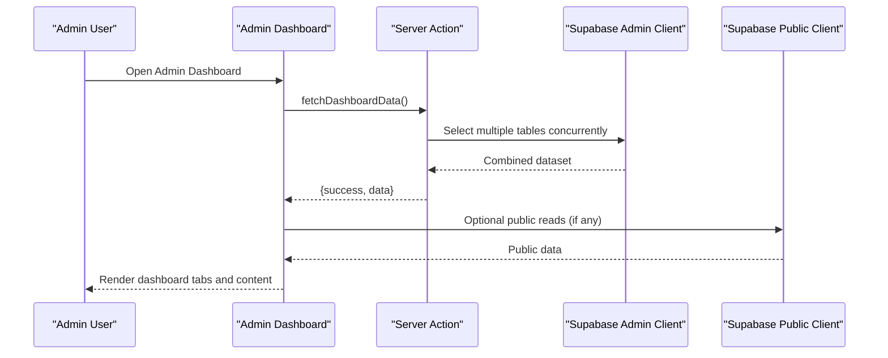
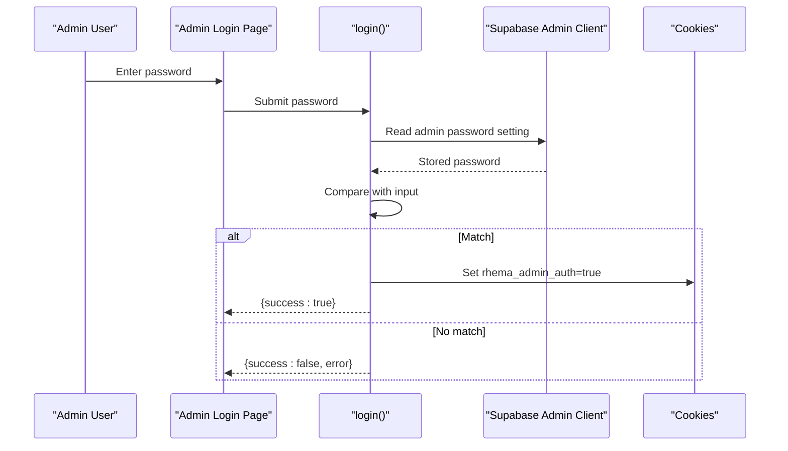
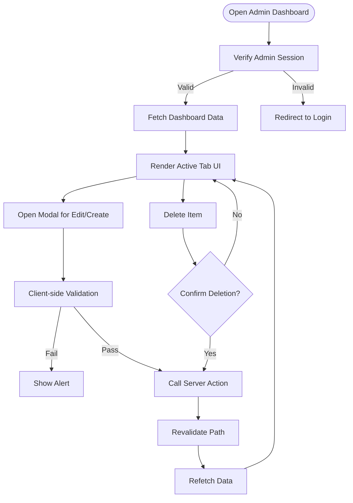
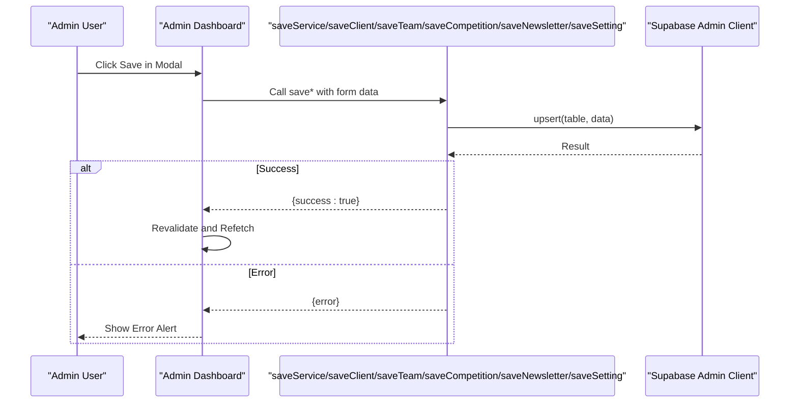
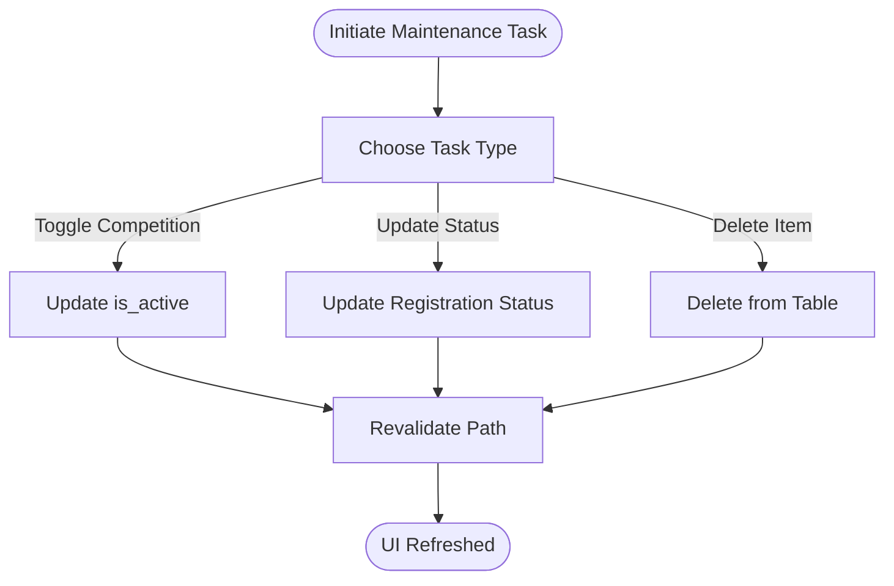
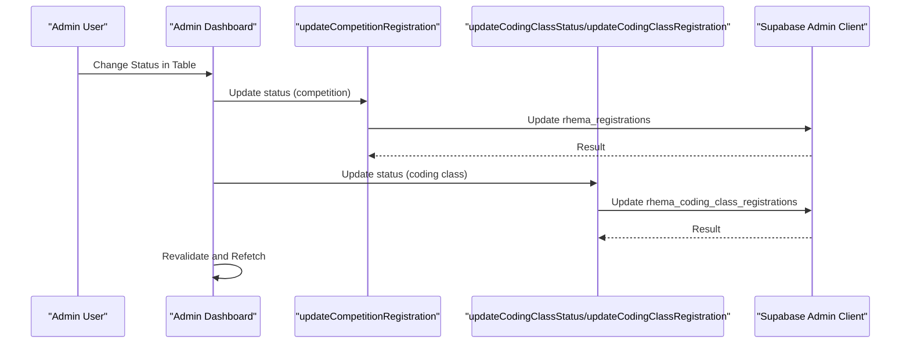
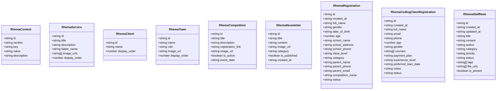
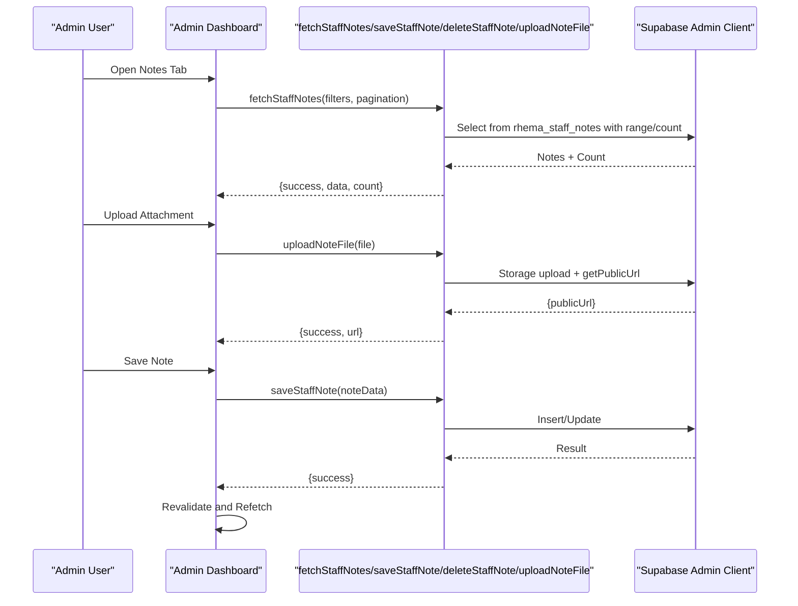
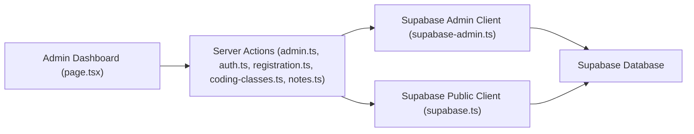

# Administrative Operations

<cite>
**Referenced Files in This Document**
- [app/admin/page.tsx](file://app/admin/page.tsx)
- [app/admin/dashboard/page.tsx](file://app/admin/dashboard/page.tsx)
- [app/actions/auth.ts](file://app/actions/auth.ts)
- [app/actions/admin.ts](file://app/actions/admin.ts)
- [app/actions/registration.ts](file://app/actions/registration.ts)
- [app/actions/coding-classes.ts](file://app/actions/coding-classes.ts)
- [app/actions/notes.ts](file://app/actions/notes.ts)
- [lib/supabase-admin.ts](file://lib/supabase-admin.ts)
- [lib/supabase.ts](file://lib/supabase.ts)
- [types/supabase.ts](file://types/supabase.ts)
</cite>

## Table of Contents
1. [Introduction](#introduction)
2. [Project Structure](#project-structure)
3. [Core Components](#core-components)
4. [Architecture Overview](#architecture-overview)
5. [Detailed Component Analysis](#detailed-component-analysis)
6. [Dependency Analysis](#dependency-analysis)
7. [Performance Considerations](#performance-considerations)
8. [Troubleshooting Guide](#troubleshooting-guide)
9. [Conclusion](#conclusion)
10. [Appendices](#appendices)

## Introduction
This document explains the administrative operations and dashboard functionality of the application. It covers admin panel data management, user administration tasks, and system configuration operations. It also documents administrative workflows for managing course catalogs, student records, and system content. Examples include implementing administrative CRUD operations, bulk data management, and system maintenance tasks. The integration between administrative functions and Supabase database operations is explained, including data validation and security controls. Administrative access patterns, permission systems, and audit trails for admin activities are addressed, along with guidance on extending administrative capabilities and implementing custom admin workflows.

## Project Structure
The administrative system is organized around a client-side dashboard that orchestrates server actions. Authentication is enforced via a cookie-based session validated by server actions. Supabase is accessed through two clients:
- Public client for read-only access (RLS-based)
- Admin client using a Service Role Key for privileged operations

**Diagram sources**
- [app/admin/dashboard/page.tsx:1-120](file://app/admin/dashboard/page.tsx#L1-L120)
- [app/admin/page.tsx:1-52](file://app/admin/page.tsx#L1-L52)
- [app/actions/auth.ts:1-55](file://app/actions/auth.ts#L1-L55)
- [app/actions/admin.ts:1-198](file://app/actions/admin.ts#L1-L198)
- [app/actions/registration.ts:1-130](file://app/actions/registration.ts#L1-L130)
- [app/actions/coding-classes.ts:1-156](file://app/actions/coding-classes.ts#L1-L156)
- [app/actions/notes.ts:1-127](file://app/actions/notes.ts#L1-L127)
- [lib/supabase-admin.ts:1-19](file://lib/supabase-admin.ts#L1-L19)
- [lib/supabase.ts:1-25](file://lib/supabase.ts#L1-L25)

**Section sources**
- [app/admin/page.tsx:1-52](file://app/admin/page.tsx#L1-L52)
- [app/admin/dashboard/page.tsx:1-120](file://app/admin/dashboard/page.tsx#L1-L120)
- [lib/supabase-admin.ts:1-19](file://lib/supabase-admin.ts#L1-L19)
- [lib/supabase.ts:1-25](file://lib/supabase.ts#L1-L25)

## Core Components
- Admin Login and Session Management: Validates credentials against stored admin password and sets a session cookie.
- Admin Dashboard: Central UI for managing services, clients, team members, competitions, newsletter posts, general settings, registrations, coding class registrations, and staff notes.
- Server Actions: Encapsulate CRUD operations and orchestrate Supabase queries, enforce authentication, and trigger cache revalidation.
- Supabase Clients: Separate clients for public reads and admin writes, enabling controlled access and RLS bypass when necessary.

Key responsibilities:
- Authentication: Enforce admin session via cookie checks.
- Data Management: CRUD for multiple domains (services, clients, team, competitions, newsletter, settings).
- Student Records: Manage competition and coding class registrations.
- System Content: General settings and content management.
- Staff Notes: Rich note management with search, filters, pagination, and file attachments.
- Cache Revalidation: Trigger revalidation after mutations to keep UI consistent.

**Section sources**
- [app/actions/auth.ts:1-55](file://app/actions/auth.ts#L1-L55)
- [app/actions/admin.ts:1-198](file://app/actions/admin.ts#L1-L198)
- [app/admin/dashboard/page.tsx:1-120](file://app/admin/dashboard/page.tsx#L1-L120)
- [lib/supabase-admin.ts:1-19](file://lib/supabase-admin.ts#L1-L19)

## Architecture Overview
The admin architecture follows a layered pattern:
- UI Layer: Client components render forms and lists, manage modals, and trigger actions.
- Action Layer: Server actions encapsulate business logic, enforce permissions, and call Supabase.
- Data Layer: Supabase clients provide typed access to tables and storage.

**Diagram sources**
- [app/admin/dashboard/page.tsx:85-126](file://app/admin/dashboard/page.tsx#L85-L126)
- [app/actions/admin.ts:38-98](file://app/actions/admin.ts#L38-L98)
- [lib/supabase-admin.ts:1-19](file://lib/supabase-admin.ts#L1-L19)
- [lib/supabase.ts:1-25](file://lib/supabase.ts#L1-L25)

## Detailed Component Analysis

### Admin Login and Access Control
- Purpose: Authenticate admin and establish a session cookie.
- Mechanism:
  - Reads admin password from Supabase settings or environment variable.
  - On successful login, sets a secure, HTTP-only cookie.
  - Subsequent requests validate the cookie via a dedicated check action.
- Security Controls:
  - Cookie attributes include secure flag in production and a 7-day expiry.
  - All admin actions enforce authentication via a shared guard.

**Diagram sources**
- [app/admin/page.tsx:12-23](file://app/admin/page.tsx#L12-L23)
- [app/actions/auth.ts:7-43](file://app/actions/auth.ts#L7-L43)
- [lib/supabase-admin.ts:1-19](file://lib/supabase-admin.ts#L1-L19)

**Section sources**
- [app/admin/page.tsx:1-52](file://app/admin/page.tsx#L1-L52)
- [app/actions/auth.ts:1-55](file://app/actions/auth.ts#L1-L55)

### Admin Dashboard UI and Workflows
- Tabs: Services, Clients, Team, Competitions, Newsletter, Settings, Registrations, Coding Classes, Staff Notes.
- Modals: Unified modal for creating/editing items across domains with field validation.
- Data Fetching: Concurrently fetches multiple datasets and handles errors gracefully.
- Mutations: Save, delete, toggle, and status updates with immediate UI refresh.

**Diagram sources**
- [app/admin/dashboard/page.tsx:67-126](file://app/admin/dashboard/page.tsx#L67-L126)
- [app/admin/dashboard/page.tsx:151-214](file://app/admin/dashboard/page.tsx#L151-L214)

**Section sources**
- [app/admin/dashboard/page.tsx:1-120](file://app/admin/dashboard/page.tsx#L1-L120)
- [app/admin/dashboard/page.tsx:120-295](file://app/admin/dashboard/page.tsx#L120-L295)

### Administrative CRUD Operations
- Services, Clients, Team, Competitions, Newsletter, Settings:
  - Insert or update based on presence of ID.
  - Validation ensures required fields are present before saving.
  - On success, revalidate the dashboard path to refresh cached data.
- Delete Items:
  - Generic delete handler accepts table name and ID.
  - Confirmation dialog precedes deletion.
- Toggle Competitions:
  - Switch active/inactive state atomically.

**Diagram sources**
- [app/actions/admin.ts:21-36](file://app/actions/admin.ts#L21-L36)
- [app/actions/admin.ts:100-115](file://app/actions/admin.ts#L100-L115)
- [app/actions/admin.ts:117-132](file://app/actions/admin.ts#L117-L132)
- [app/actions/admin.ts:134-149](file://app/actions/admin.ts#L134-L149)
- [app/actions/admin.ts:151-166](file://app/actions/admin.ts#L151-L166)
- [app/actions/admin.ts:168-177](file://app/actions/admin.ts#L168-L177)
- [app/admin/dashboard/page.tsx:151-202](file://app/admin/dashboard/page.tsx#L151-L202)

**Section sources**
- [app/actions/admin.ts:1-198](file://app/actions/admin.ts#L1-L198)
- [app/admin/dashboard/page.tsx:146-202](file://app/admin/dashboard/page.tsx#L146-L202)

### Bulk Data Management and System Maintenance
- Fetch Dashboard Data:
  - Concurrently selects from multiple tables and orders results appropriately.
  - Ensures admin password setting exists and seeds it if missing.
- Cache Revalidation:
  - After mutations, the dashboard path is revalidated to reflect changes instantly.
- Maintenance Tasks:
  - Toggle competition activity.
  - Update registration statuses.
  - Delete registrations and items.

**Diagram sources**
- [app/actions/admin.ts:38-98](file://app/actions/admin.ts#L38-L98)
- [app/actions/admin.ts:179-197](file://app/actions/admin.ts#L179-L197)
- [app/actions/coding-classes.ts:98-116](file://app/actions/coding-classes.ts#L98-L116)
- [app/admin/dashboard/page.tsx:216-221](file://app/admin/dashboard/page.tsx#L216-L221)

**Section sources**
- [app/actions/admin.ts:38-98](file://app/actions/admin.ts#L38-L98)
- [app/actions/admin.ts:179-197](file://app/actions/admin.ts#L179-L197)
- [app/actions/coding-classes.ts:98-116](file://app/actions/coding-classes.ts#L98-L116)
- [app/admin/dashboard/page.tsx:216-221](file://app/admin/dashboard/page.tsx#L216-L221)

### Student Records Management
- Competition Registrations:
  - View, edit, and delete competition entries.
  - Update status via dropdown with immediate backend persistence.
- Coding Class Registrations:
  - View, edit, and delete coding class entries.
  - Update status via dropdown with immediate backend persistence.
  - Supports multi-course selection and flexible fields.

**Diagram sources**
- [app/admin/dashboard/page.tsx:1320-1344](file://app/admin/dashboard/page.tsx#L1320-L1344)
- [app/actions/registration.ts:102-115](file://app/actions/registration.ts#L102-L115)
- [app/actions/coding-classes.ts:98-136](file://app/actions/coding-classes.ts#L98-L136)

**Section sources**
- [app/admin/dashboard/page.tsx:1203-1368](file://app/admin/dashboard/page.tsx#L1203-L1368)
- [app/actions/registration.ts:86-130](file://app/actions/registration.ts#L86-L130)
- [app/actions/coding-classes.ts:78-156](file://app/actions/coding-classes.ts#L78-L156)

### System Content and Settings
- General Settings:
  - Managed as key-value pairs under the admin section.
  - Values are editable via the settings tab.
- Content Types:
  - Strongly typed interfaces define shapes for content, services, clients, team, competitions, newsletter, registrations, coding class registrations, and staff notes.

**Diagram sources**
- [types/supabase.ts:5-113](file://types/supabase.ts#L5-L113)

**Section sources**
- [app/actions/admin.ts:168-177](file://app/actions/admin.ts#L168-L177)
- [types/supabase.ts:1-113](file://types/supabase.ts#L1-L113)

### Staff Notes Management
- Features:
  - Create, edit, delete notes.
  - Search by title/content and filter by status, category, priority.
  - Pagination support.
  - File uploads via Supabase Storage with public URL generation.
- UI:
  - Modal-based editor with rich metadata (author, category, priority, tags, pinned).
  - List view with pinning, categories, priorities, and attachments.

**Diagram sources**
- [app/admin/dashboard/page.tsx:281-372](file://app/admin/dashboard/page.tsx#L281-L372)
- [app/actions/notes.ts:19-58](file://app/actions/notes.ts#L19-L58)
- [app/actions/notes.ts:60-93](file://app/actions/notes.ts#L60-L93)
- [app/actions/notes.ts:95-127](file://app/actions/notes.ts#L95-L127)

**Section sources**
- [app/admin/dashboard/page.tsx:281-372](file://app/admin/dashboard/page.tsx#L281-L372)
- [app/actions/notes.ts:1-127](file://app/actions/notes.ts#L1-L127)

### Supabase Integration and Data Validation
- Admin Client:
  - Uses Service Role Key to bypass RLS for admin operations.
  - Falls back to Anon Key if Service Role Key is unavailable (write operations will fail if RLS is enabled).
- Public Client:
  - Used for read-only access to public data.
- Data Validation:
  - Client-side validation in the dashboard prevents empty submissions.
  - Server actions validate inputs and enforce authentication.
- Cache Revalidation:
  - After mutations, the dashboard path is revalidated to ensure UI consistency.

**Section sources**
- [lib/supabase-admin.ts:1-19](file://lib/supabase-admin.ts#L1-L19)
- [lib/supabase.ts:1-25](file://lib/supabase.ts#L1-L25)
- [app/admin/dashboard/page.tsx:146-196](file://app/admin/dashboard/page.tsx#L146-L196)
- [app/actions/admin.ts:14-19](file://app/actions/admin.ts#L14-L19)

### Administrative Access Patterns and Permission Systems
- Session-Based Access:
  - Admin login sets a session cookie validated by a dedicated check action.
  - All server actions enforcing admin access call the shared check function.
- Permission Model:
  - Admin actions require authenticated sessions; unauthorized calls return errors.
  - Public client remains read-only and respects RLS policies.

**Section sources**
- [app/actions/auth.ts:50-54](file://app/actions/auth.ts#L50-L54)
- [app/actions/admin.ts:14-19](file://app/actions/admin.ts#L14-L19)

### Audit Trails for Admin Activities
- Current Implementation:
  - No explicit audit trail is implemented in the reviewed files.
  - Admin actions return success/error messages; no logging of who performed which operation.
- Recommendations:
  - Introduce an audit log table storing admin actions, timestamps, and affected records.
  - Capture session identifiers and IP addresses for traceability.
  - Add server-side logging for sensitive operations.

[No sources needed since this section provides recommendations without analyzing specific files]

## Dependency Analysis
The admin system exhibits clear separation of concerns:
- UI depends on server actions for all data operations.
- Server actions depend on Supabase clients and authentication guards.
- Supabase clients encapsulate environment-specific configuration.

**Diagram sources**
- [app/admin/dashboard/page.tsx:1-120](file://app/admin/dashboard/page.tsx#L1-L120)
- [app/actions/admin.ts:1-198](file://app/actions/admin.ts#L1-L198)
- [app/actions/auth.ts:1-55](file://app/actions/auth.ts#L1-L55)
- [app/actions/registration.ts:1-130](file://app/actions/registration.ts#L1-L130)
- [app/actions/coding-classes.ts:1-156](file://app/actions/coding-classes.ts#L1-L156)
- [app/actions/notes.ts:1-127](file://app/actions/notes.ts#L1-L127)
- [lib/supabase-admin.ts:1-19](file://lib/supabase-admin.ts#L1-L19)
- [lib/supabase.ts:1-25](file://lib/supabase.ts#L1-L25)

**Section sources**
- [app/admin/dashboard/page.tsx:1-120](file://app/admin/dashboard/page.tsx#L1-L120)
- [app/actions/admin.ts:1-198](file://app/actions/admin.ts#L1-L198)
- [lib/supabase-admin.ts:1-19](file://lib/supabase-admin.ts#L1-L19)
- [lib/supabase.ts:1-25](file://lib/supabase.ts#L1-L25)

## Performance Considerations
- Concurrent Data Fetching:
  - Dashboard uses concurrent queries to reduce latency when loading multiple datasets.
- Cache Revalidation:
  - Revalidating the dashboard path ensures minimal stale data while keeping the UI responsive.
- Pagination and Filtering:
  - Notes support pagination and filtering to manage large datasets efficiently.
- Recommendations:
  - Consider adding server-side caching for frequently accessed static content.
  - Optimize queries with appropriate indexes on frequently filtered columns.

[No sources needed since this section provides general guidance]

## Troubleshooting Guide
Common issues and resolutions:
- Missing Environment Variables:
  - Missing Supabase keys cause warnings; admin write operations may fail if Service Role Key is absent.
- Authentication Failures:
  - Invalid admin password leads to login failure; ensure the admin password setting exists and matches input.
- Unauthorized Access:
  - Calls to protected server actions without a valid session return unauthorized errors.
- Mutation Errors:
  - Errors during insert/update/delete are surfaced to the UI; check network logs and Supabase response messages.
- Cache Stale Data:
  - If UI appears outdated after edits, confirm revalidation occurs and the page reloads.

**Section sources**
- [lib/supabase-admin.ts:7-9](file://lib/supabase-admin.ts#L7-L9)
- [app/actions/auth.ts:31-43](file://app/actions/auth.ts#L31-L43)
- [app/actions/admin.ts:14-19](file://app/actions/admin.ts#L14-L19)
- [app/admin/dashboard/page.tsx:376-391](file://app/admin/dashboard/page.tsx#L376-L391)

## Conclusion
The administrative system provides a comprehensive, session-secured dashboard for managing diverse content and records. It leverages Supabase for data operations, enforces strict access control, and maintains UI consistency through cache revalidation. While current implementations lack explicit audit trails, the modular design supports straightforward extensions for audit logging and advanced administrative features.

## Appendices

### Extending Administrative Capabilities
- Add New Admin Domains:
  - Define TypeScript interfaces for new tables.
  - Implement server actions for CRUD and toggles.
  - Integrate UI components in the dashboard with validation and error handling.
- Implement Audit Logging:
  - Create an audit log table and append entries on significant admin actions.
  - Include contextual metadata such as timestamps, user agent, and affected records.
- Bulk Operations:
  - Introduce batch delete and status update endpoints for registrations and notes.
  - Add progress indicators and confirmation dialogs for destructive operations.
- Enhanced Security:
  - Enforce rate limiting on login attempts.
  - Add IP allowlisting or MFA for admin accounts.
- Observability:
  - Add structured logging for server actions.
  - Monitor Supabase query performance and error rates.

[No sources needed since this section provides general guidance]