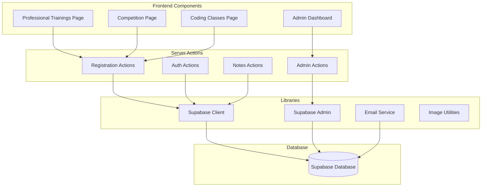
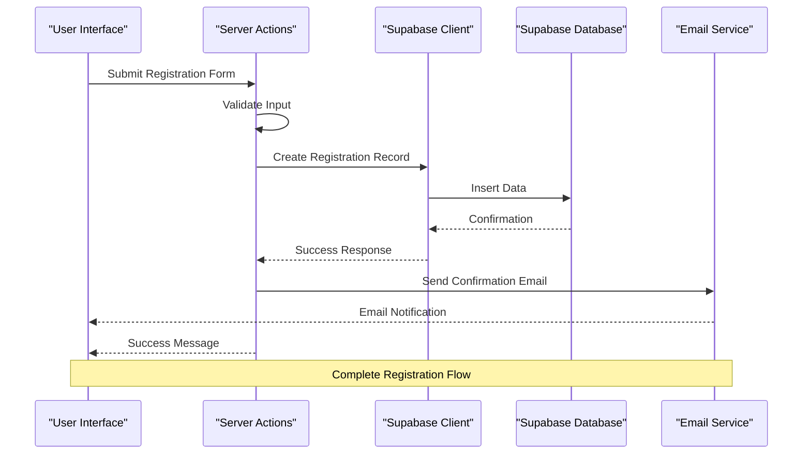
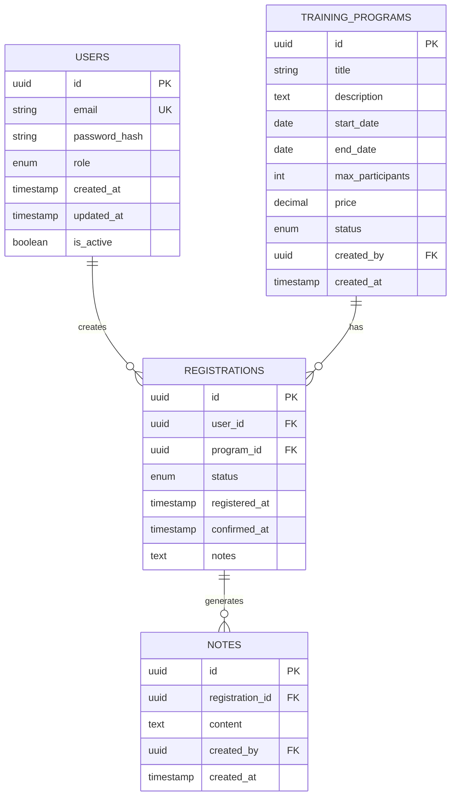
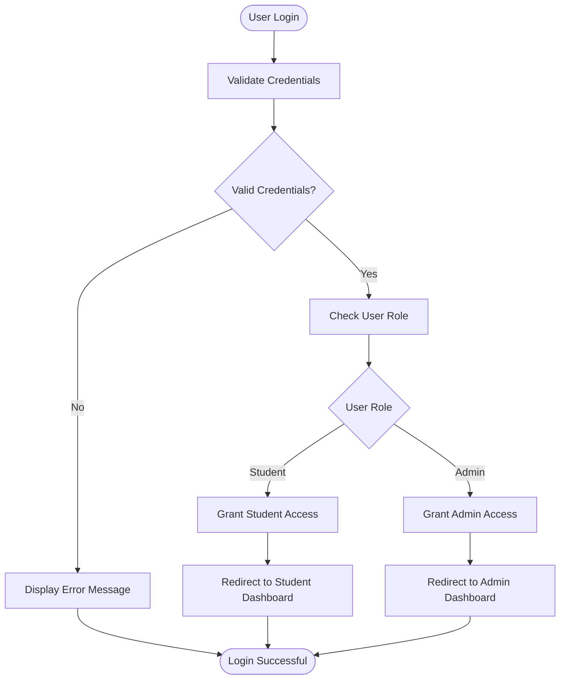

# Professional Training Registration System

<cite>
**Referenced Files in This Document**
- [README.md](file://README.md)
- [app/actions/registration.ts](file://app/actions/registration.ts)
- [app/actions/admin.ts](file://app/actions/admin.ts)
- [app/actions/auth.ts](file://app/actions/auth.ts)
- [app/professional-trainings/page.tsx](file://app/professional-trainings/page.tsx)
- [app/admin/dashboard/page.tsx](file://app/admin/dashboard/page.tsx)
- [lib/supabase.ts](file://lib/supabase.ts)
- [lib/supabase-admin.ts](file://lib/supabase-admin.ts)
- [lib/email.ts](file://lib/email.ts)
- [supabase_schema.sql](file://supabase_schema.sql)
- [supabase_migration_professional_trainings.sql](file://supabase_migration_professional_trainings.sql)
- [package.json](file://package.json)
- [next.config.ts](file://next.config.ts)
</cite>

## Table of Contents
1. [Introduction](#introduction)
2. [Project Structure](#project-structure)
3. [Core Components](#core-components)
4. [Architecture Overview](#architecture-overview)
5. [Detailed Component Analysis](#detailed-component-analysis)
6. [Database Schema](#database-schema)
7. [API Endpoints](#api-endpoints)
8. [Authentication & Authorization](#authentication--authorization)
9. [Admin Dashboard](#admin-dashboard)
10. [Email Integration](#email-integration)
11. [Performance Considerations](#performance-considerations)
12. [Troubleshooting Guide](#troubleshooting-guide)
13. [Conclusion](#conclusion)

## Introduction

The Professional Training Registration System is a comprehensive web application built with Next.js that manages professional training course registrations, user authentication, and administrative oversight. The system provides a complete solution for handling training program enrollments, participant management, and administrative controls through a modern React-based interface.

This system leverages Supabase as its backend infrastructure, providing database management, authentication services, and real-time capabilities. The application follows modern web development practices with TypeScript support, server-side actions, and component-based architecture.

## Project Structure

The application follows a feature-based organization pattern typical of Next.js applications:

**Diagram sources**
- [app/professional-trainings/page.tsx](file://app/professional-trainings/page.tsx)
- [app/admin/dashboard/page.tsx](file://app/admin/dashboard/page.tsx)
- [app/actions/registration.ts](file://app/actions/registration.ts)
- [lib/supabase.ts](file://lib/supabase.ts)

**Section sources**
- [README.md](file://README.md)
- [package.json](file://package.json)

## Core Components

### Registration Management System
The registration system handles all aspects of professional training enrollment including form processing, validation, and database operations. It provides a seamless user experience for course registration while maintaining data integrity and security.

### Administrative Interface
The admin dashboard offers comprehensive control over training programs, participant management, and system monitoring. Administrators can manage courses, view registrations, and perform system maintenance tasks.

### Authentication Framework
A robust authentication system ensures secure access to both user-facing features and administrative functions. The system supports role-based access control and session management.

**Section sources**
- [app/actions/registration.ts](file://app/actions/registration.ts)
- [app/actions/admin.ts](file://app/actions/admin.ts)
- [app/actions/auth.ts](file://app/actions/auth.ts)

## Architecture Overview

The system follows a modern full-stack architecture with clear separation of concerns:

**Diagram sources**
- [app/actions/registration.ts](file://app/actions/registration.ts)
- [lib/supabase.ts](file://lib/supabase.ts)
- [lib/email.ts](file://lib/email.ts)

## Detailed Component Analysis

### Registration Action Handler
The registration action handler processes training enrollment requests, validates input data, and manages the complete registration workflow. It coordinates between the frontend interface, database operations, and email notifications.

#### Key Features:
- Input validation and sanitization
- Duplicate registration prevention
- Automatic confirmation email generation
- Error handling and user feedback
- Transaction management for data consistency

**Section sources**
- [app/actions/registration.ts](file://app/actions/registration.ts)

### Admin Action Controller
The admin controller provides comprehensive administrative functionality including user management, course administration, and system monitoring capabilities.

#### Administrative Functions:
- User account management
- Course content editing
- Registration approval workflows
- System analytics and reporting
- Bulk operations support

**Section sources**
- [app/actions/admin.ts](file://app/actions/admin.ts)

### Authentication System
The authentication system implements secure user management with role-based access control and session handling.

#### Security Features:
- Password hashing and encryption
- Session token management
- Role-based authorization
- Input sanitization
- CSRF protection

**Section sources**
- [app/actions/auth.ts](file://app/actions/auth.ts)

## Database Schema

The system utilizes a well-structured database schema designed for scalability and performance:

**Diagram sources**
- [supabase_schema.sql](file://supabase_schema.sql)
- [supabase_migration_professional_trainings.sql](file://supabase_migration_professional_trainings.sql)

## API Endpoints

### Registration Endpoints
The system provides RESTful API endpoints for managing training registrations:

| Endpoint | Method | Description | Authentication Required |
|----------|--------|-------------|-------------------------|
| `/api/register` | POST | Submit new training registration | No |
| `/api/registrations` | GET | List all registrations (Admin) | Yes |
| `/api/registrations/:id` | GET | Get specific registration details | Yes |
| `/api/registrations/:id` | PUT | Update registration status | Yes |
| `/api/registrations/:id` | DELETE | Cancel registration | Yes |

### Admin Endpoints
Administrative endpoints for system management:

| Endpoint | Method | Description | Role Required |
|----------|--------|-------------|---------------|
| `/api/admin/users` | GET | List all users | Admin |
| `/api/admin/users/:id` | PUT | Update user role | Admin |
| `/api/admin/programs` | POST | Create new training program | Admin |
| `/api/admin/analytics` | GET | Get system analytics | Admin |

**Section sources**
- [app/actions/registration.ts](file://app/actions/registration.ts)
- [app/actions/admin.ts](file://app/actions/admin.ts)

## Authentication & Authorization

The authentication system implements a comprehensive security model with role-based access control:

**Diagram sources**
- [app/actions/auth.ts](file://app/actions/auth.ts)
- [lib/supabase.ts](file://lib/supabase.ts)

### Security Measures:
- JWT token-based authentication
- Password hashing with bcrypt
- Session timeout management
- Input validation and sanitization
- SQL injection prevention
- XSS protection

**Section sources**
- [app/actions/auth.ts](file://app/actions/auth.ts)
- [lib/supabase.ts](file://lib/supabase.ts)

## Admin Dashboard

The administrative dashboard provides a comprehensive interface for managing the entire training system:

### Dashboard Features:
- Real-time registration monitoring
- User management interface
- Course administration tools
- Analytics and reporting
- System health monitoring
- Bulk operation capabilities

### User Management:
Administrators can manage user accounts, roles, and permissions through an intuitive interface. The system supports bulk user operations and detailed user activity tracking.

### Course Administration:
Complete control over training programs including creation, modification, scheduling, and capacity management.

**Section sources**
- [app/admin/dashboard/page.tsx](file://app/admin/dashboard/page.tsx)
- [app/actions/admin.ts](file://app/actions/admin.ts)

## Email Integration

The system includes comprehensive email notification capabilities for various events:

### Email Templates:
- Registration confirmation emails
- Course reminder notifications
- Administrative alerts
- Password reset functionality
- Welcome messages for new users

### Email Service Features:
- Template-based email generation
- HTML and plain text support
- Attachment handling
- Delivery tracking
- Error handling and retry logic

**Section sources**
- [lib/email.ts](file://lib/email.ts)

## Performance Considerations

### Database Optimization:
- Indexed queries for frequently accessed data
- Connection pooling for efficient database connections
- Query optimization and caching strategies
- Batch operations for bulk data processing

### Frontend Performance:
- Component lazy loading
- Image optimization and caching
- Efficient state management
- Responsive design implementation

### Backend Optimization:
- Server-side rendering for improved SEO
- API response caching
- Asynchronous operation handling
- Memory management and garbage collection

## Troubleshooting Guide

### Common Issues and Solutions:

#### Registration Failures:
- Verify database connectivity
- Check email service configuration
- Validate form input data
- Review error logs for specific failure points

#### Authentication Problems:
- Confirm user credentials format
- Check session token validity
- Verify role-based permissions
- Review authentication middleware logs

#### Performance Issues:
- Monitor database query performance
- Check server resource utilization
- Analyze frontend bundle size
- Review network request patterns

### Debugging Tools:
- Comprehensive logging system
- Error tracking and reporting
- Performance monitoring dashboards
- Development debugging utilities

**Section sources**
- [app/actions/registration.ts](file://app/actions/registration.ts)
- [app/actions/admin.ts](file://app/actions/admin.ts)

## Conclusion

The Professional Training Registration System represents a comprehensive solution for managing professional training programs with modern web technologies. The system combines a user-friendly interface with powerful administrative capabilities, robust security measures, and scalable architecture.

Key strengths include:
- Modern Next.js architecture with TypeScript support
- Comprehensive Supabase integration for backend services
- Role-based access control and security
- Extensible plugin architecture for additional features
- Responsive design for cross-device compatibility
- Comprehensive email notification system

The system is designed for scalability and maintainability, making it suitable for organizations of various sizes requiring professional training management capabilities.