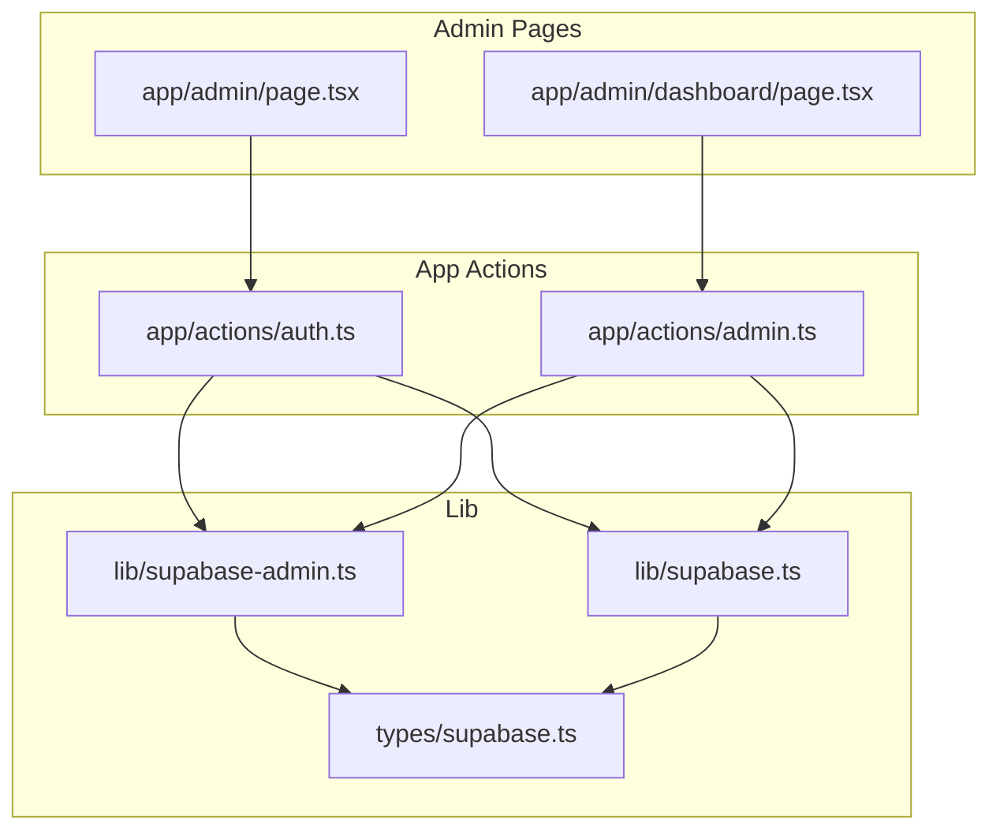
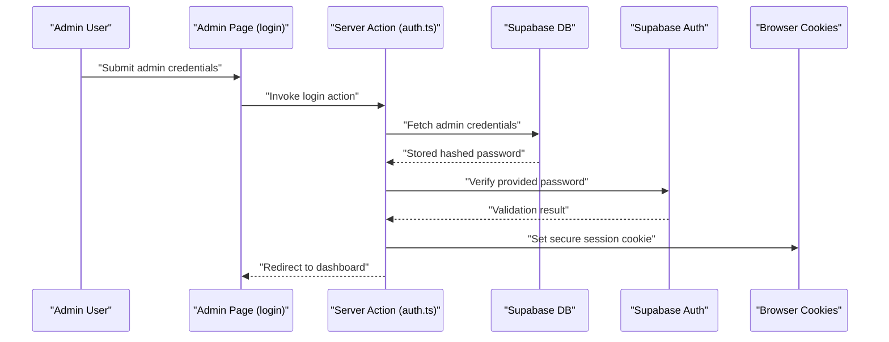
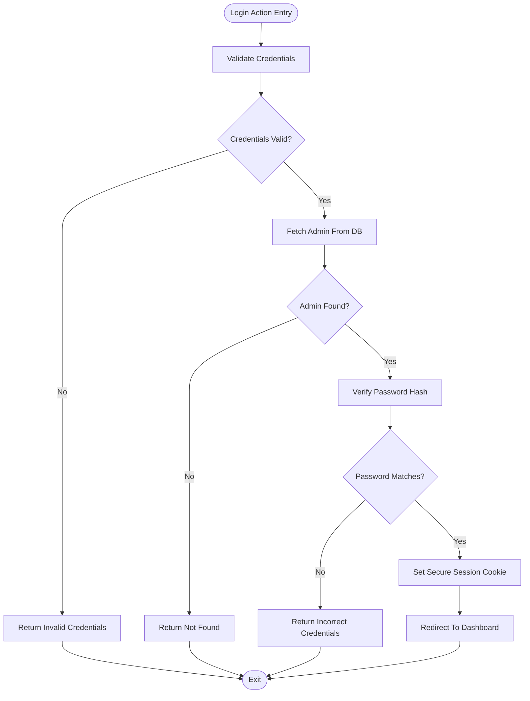
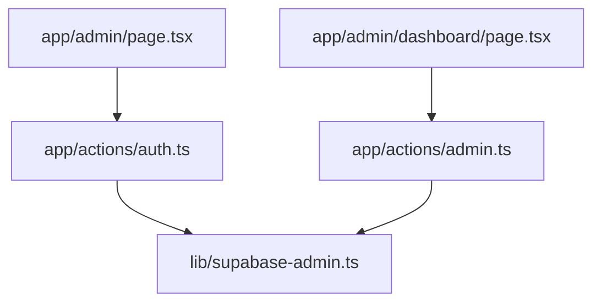
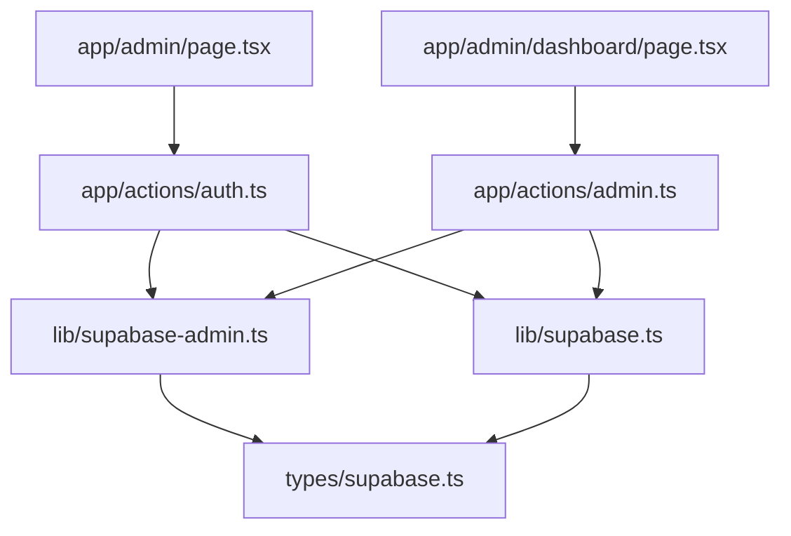

# Authentication System

<cite>
**Referenced Files in This Document**
- [auth.ts](file://app/actions/auth.ts)
- [admin.ts](file://app/actions/admin.ts)
- [supabase-admin.ts](file://lib/supabase-admin.ts)
- [supabase.ts](file://lib/supabase.ts)
- [types/supabase.ts](file://types/supabase.ts)
- [admin/page.tsx](file://app/admin/page.tsx)
- [admin/dashboard/page.tsx](file://app/admin/dashboard/page.tsx)
- [layout.tsx](file://app/layout.tsx)
- [email.ts](file://lib/email.ts)
</cite>

## Table of Contents
1. [Introduction](#introduction)
2. [Project Structure](#project-structure)
3. [Core Components](#core-components)
4. [Architecture Overview](#architecture-overview)
5. [Detailed Component Analysis](#detailed-component-analysis)
6. [Dependency Analysis](#dependency-analysis)
7. [Performance Considerations](#performance-considerations)
8. [Security Considerations](#security-considerations)
9. [Troubleshooting Guide](#troubleshooting-guide)
10. [Conclusion](#conclusion)

## Introduction
This document explains the authentication system for admin access in a Next.js application. It covers the admin login process, password validation against stored credentials, session management via cookies, dynamic password retrieval from the Supabase database with fallback to environment variables, authentication middleware patterns, logout functionality, and security best practices for protecting admin routes.

## Project Structure
The authentication implementation centers around:
- Action files under app/actions for server-side authentication operations
- Supabase client wrappers in lib for database and auth interactions
- Admin pages under app/admin for login and protected dashboard
- Shared types for Supabase client typing

**Diagram sources**
- [auth.ts](file://app/actions/auth.ts)
- [admin.ts](file://app/actions/admin.ts)
- [supabase-admin.ts](file://lib/supabase-admin.ts)
- [supabase.ts](file://lib/supabase.ts)
- [types/supabase.ts](file://types/supabase.ts)
- [admin/page.tsx](file://app/admin/page.tsx)
- [admin/dashboard/page.tsx](file://app/admin/dashboard/page.tsx)

**Section sources**
- [auth.ts](file://app/actions/auth.ts)
- [admin.ts](file://app/actions/admin.ts)
- [supabase-admin.ts](file://lib/supabase-admin.ts)
- [supabase.ts](file://lib/supabase.ts)
- [types/supabase.ts](file://types/supabase.ts)
- [admin/page.tsx](file://app/admin/page.tsx)
- [admin/dashboard/page.tsx](file://app/admin/dashboard/page.tsx)

## Core Components
- Admin login action: Handles credential submission, validates password against stored hash, and sets secure session cookies.
- Admin dashboard action: Manages logout and session termination.
- Supabase admin client: Provides typed access to Supabase Auth and Database APIs for admin operations.
- Supabase client: Provides typed access to Supabase for general operations.
- Admin pages: Render login and dashboard UIs, invoking server actions for authentication flows.

Key responsibilities:
- Validate admin credentials and manage sessions
- Retrieve admin password securely from Supabase with fallback to environment variables
- Enforce session-based protection for admin routes
- Provide logout and session invalidation

**Section sources**
- [auth.ts](file://app/actions/auth.ts)
- [admin.ts](file://app/actions/admin.ts)
- [supabase-admin.ts](file://lib/supabase-admin.ts)
- [supabase.ts](file://lib/supabase.ts)
- [admin/page.tsx](file://app/admin/page.tsx)
- [admin/dashboard/page.tsx](file://app/admin/dashboard/page.tsx)

## Architecture Overview
The authentication flow integrates Next.js server actions with Supabase Auth and Database. Login and logout are executed server-side to keep secrets and session management secure.

**Diagram sources**
- [auth.ts](file://app/actions/auth.ts)
- [supabase-admin.ts](file://lib/supabase-admin.ts)
- [admin/page.tsx](file://app/admin/page.tsx)

## Detailed Component Analysis

### Admin Login Action
Purpose:
- Accept admin credentials from the login form
- Retrieve stored admin password from Supabase
- Validate the provided password against the stored hash
- Establish a secure session by setting cookies
- Redirect to the admin dashboard upon success

Processing logic:
- Input validation for credentials
- Fetch admin record from Supabase
- Compare provided password with stored hash
- On success, create session and set HttpOnly/Secure cookies
- On failure, return appropriate error response

**Diagram sources**
- [auth.ts](file://app/actions/auth.ts)
- [supabase-admin.ts](file://lib/supabase-admin.ts)

**Section sources**
- [auth.ts](file://app/actions/auth.ts)
- [supabase-admin.ts](file://lib/supabase-admin.ts)

### Admin Dashboard Action (Logout)
Purpose:
- Invalidate current session and clear cookies
- Redirect to login page after logout

Processing logic:
- Clear session cookie
- Redirect to admin login

**Section sources**
- [admin.ts](file://app/actions/admin.ts)

### Supabase Admin Client
Purpose:
- Provide typed access to Supabase Auth and Database for admin operations
- Centralize client initialization and configuration

Key aspects:
- Typed database and auth clients
- Environment-specific configuration
- Exported for use in server actions

**Section sources**
- [supabase-admin.ts](file://lib/supabase-admin.ts)
- [types/supabase.ts](file://types/supabase.ts)

### Supabase Client (General)
Purpose:
- Provide typed access to Supabase for general operations outside admin auth
- Keep separation between admin and general clients

**Section sources**
- [supabase.ts](file://lib/supabase.ts)
- [types/supabase.ts](file://types/supabase.ts)

### Admin Pages
- Login page: Renders the admin login form and invokes the login server action
- Dashboard page: Protected route that requires a valid session

**Diagram sources**
- [admin/page.tsx](file://app/admin/page.tsx)
- [admin/dashboard/page.tsx](file://app/admin/dashboard/page.tsx)
- [auth.ts](file://app/actions/auth.ts)
- [admin.ts](file://app/actions/admin.ts)
- [supabase-admin.ts](file://lib/supabase-admin.ts)

**Section sources**
- [admin/page.tsx](file://app/admin/page.tsx)
- [admin/dashboard/page.tsx](file://app/admin/dashboard/page.tsx)

## Dependency Analysis
The authentication system relies on:
- Next.js server actions for secure execution
- Supabase client libraries for database and auth
- Environment variables for configuration
- Cookies for session persistence

**Diagram sources**
- [auth.ts](file://app/actions/auth.ts)
- [admin.ts](file://app/actions/admin.ts)
- [supabase-admin.ts](file://lib/supabase-admin.ts)
- [supabase.ts](file://lib/supabase.ts)
- [admin/page.tsx](file://app/admin/page.tsx)
- [admin/dashboard/page.tsx](file://app/admin/dashboard/page.tsx)
- [types/supabase.ts](file://types/supabase.ts)

**Section sources**
- [auth.ts](file://app/actions/auth.ts)
- [admin.ts](file://app/actions/admin.ts)
- [supabase-admin.ts](file://lib/supabase-admin.ts)
- [supabase.ts](file://lib/supabase.ts)
- [types/supabase.ts](file://types/supabase.ts)
- [admin/page.tsx](file://app/admin/page.tsx)
- [admin/dashboard/page.tsx](file://app/admin/dashboard/page.tsx)

## Performance Considerations
- Minimize database round-trips by fetching only required admin fields
- Use server actions to avoid client-side auth logic leakage
- Keep cookie size small; store only session identifiers
- Consider rate limiting login attempts to prevent brute force
- Cache infrequent admin metadata per session to reduce repeated queries

## Security Considerations
- Password storage: Store only hashed passwords in the database; never plaintext
- Session management: Use HttpOnly and Secure cookies; enforce SameSite policies
- Environment variables: Keep secrets isolated; avoid logging sensitive data
- Protected routes: Always check session validity server-side before rendering protected content
- CSRF protection: Implement anti-CSRF tokens for forms and protect server actions
- Input sanitization: Validate and sanitize all inputs to prevent injection attacks
- Audit logs: Log failed login attempts and suspicious activities
- Session expiration: Configure appropriate session lifetimes and idle timeouts
- Transport security: Enforce HTTPS in production environments

## Troubleshooting Guide
Common issues and resolutions:
- Login fails silently: Verify server action returns explicit error messages; check cookie settings and network tab for redirects
- Session not persisting: Confirm cookie attributes (HttpOnly, Secure, SameSite) match deployment requirements; ensure domain/path alignment
- Database connectivity: Validate Supabase URL and service role keys; test connection in isolation
- Password mismatch: Ensure hashing algorithm consistency; confirm environment variable fallback is not overriding DB values unintentionally
- Protected route bypass: Verify server-side session checks before rendering admin content
- Email notifications: If email actions are used, ensure SMTP configuration is correct and credentials are valid

**Section sources**
- [auth.ts](file://app/actions/auth.ts)
- [admin.ts](file://app/actions/admin.ts)
- [supabase-admin.ts](file://lib/supabase-admin.ts)
- [email.ts](file://lib/email.ts)

## Conclusion
The authentication system employs a robust server-side pattern with Supabase integration to manage admin access. By validating credentials against stored hashes, managing secure sessions via cookies, and enforcing server-side route protection, the system provides a strong foundation for admin dashboards. Adhering to the outlined security and performance recommendations ensures a resilient and maintainable authentication flow suitable for production environments.