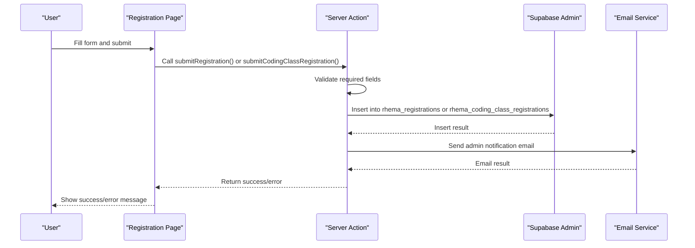
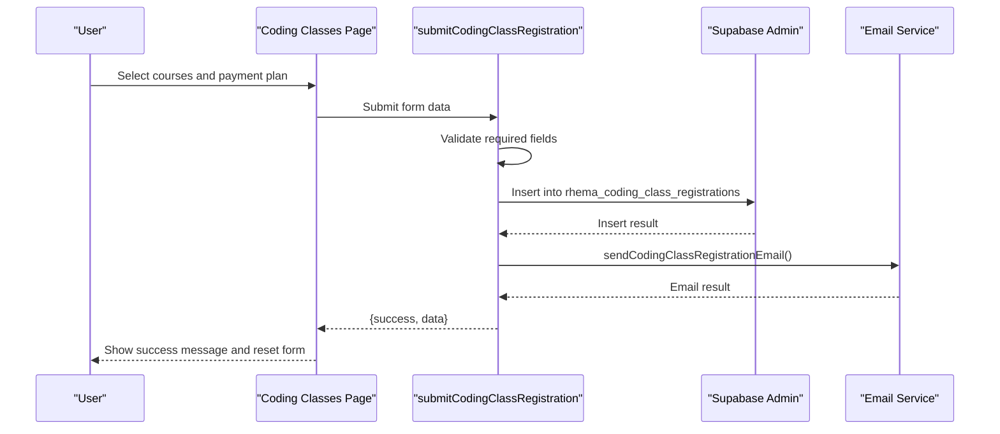
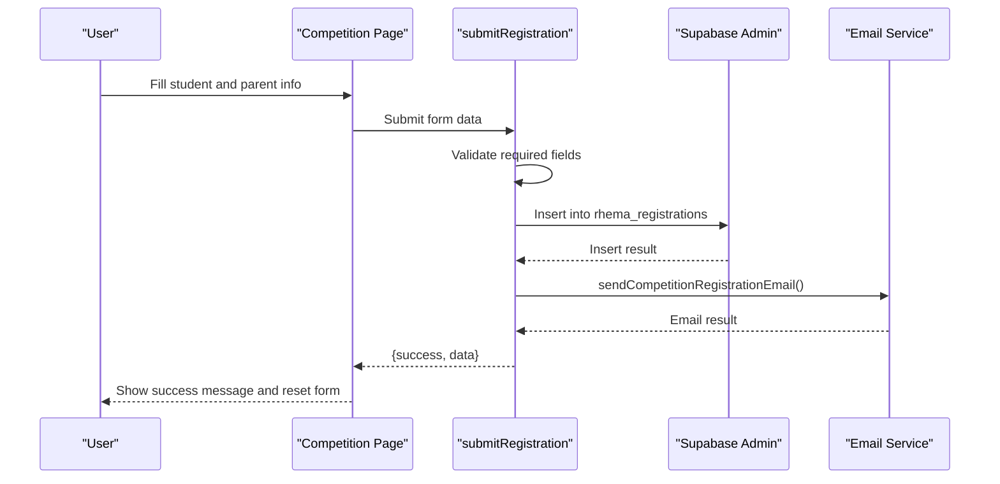
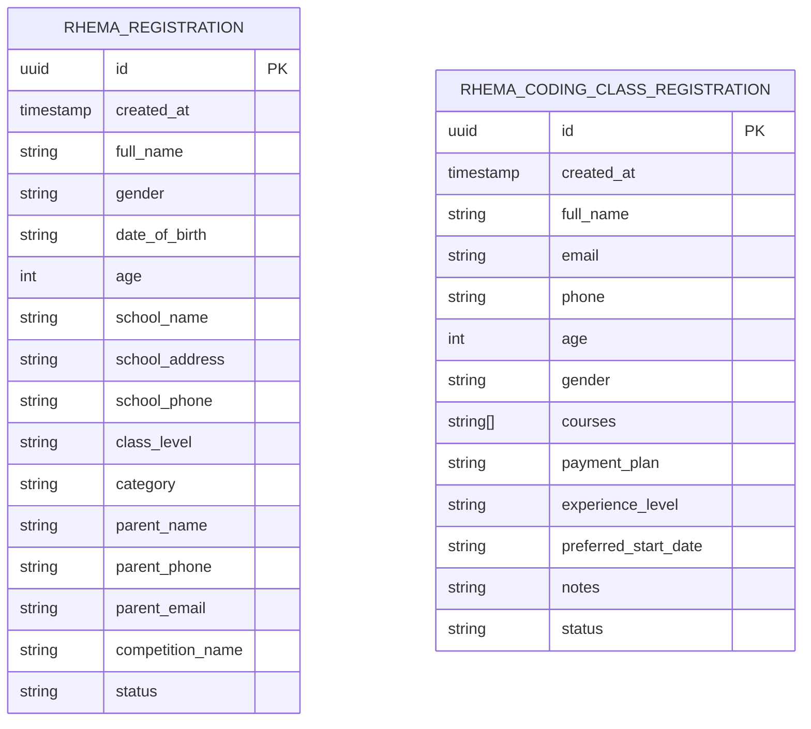
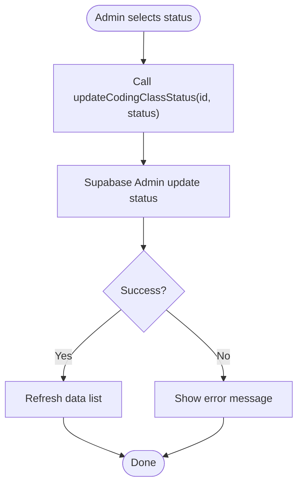
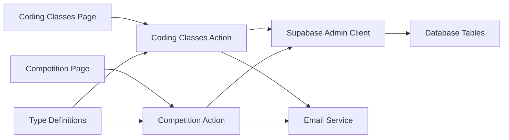

# Course Management

<cite>
**Referenced Files in This Document**
- [coding-classes.ts](file://app/actions/coding-classes.ts)
- [registration.ts](file://app/actions/registration.ts)
- [page.tsx (Coding Classes)](file://app/coding-classes/page.tsx)
- [page.tsx (Competition)](file://app/competition/page.tsx)
- [email.ts](file://lib/email.ts)
- [supabase.ts](file://lib/supabase.ts)
- [supabase-admin.ts](file://lib/supabase-admin.ts)
- [supabase.ts (types)](file://types/supabase.ts)
- [supabase_schema.sql](file://supabase_schema.sql)
- [supabase_migration_add_coding_classes.sql](file://supabase_migration_add_coding_classes.sql)
- [supabase_migration_add_school_phone.sql](file://supabase_migration_add_school_phone.sql)
</cite>

## Table of Contents
1. [Introduction](#introduction)
2. [Project Structure](#project-structure)
3. [Core Components](#core-components)
4. [Architecture Overview](#architecture-overview)
5. [Detailed Component Analysis](#detailed-component-analysis)
6. [Dependency Analysis](#dependency-analysis)
7. [Performance Considerations](#performance-considerations)
8. [Troubleshooting Guide](#troubleshooting-guide)
9. [Conclusion](#conclusion)
10. [Appendices](#appendices)

## Introduction
This document explains the course management and registration workflows implemented in the project. It focuses on:
- Coding classes registration and enrollment processing
- Competition registration handling
- Data validation patterns
- Registration form handling and student information collection
- Course availability checks and enrollment status management
- Relationship between data models, registration records, and user enrollment status
- Examples of implementing enrollment flows, handling conflicts, and managing capacity limits
- Data consistency, transaction handling, and error scenarios
- Guidance for extending the system for additional course types and implementing course management features

## Project Structure
The registration system is composed of:
- Frontend pages that render forms and collect user input
- Server actions that validate and persist registrations
- Email notifications to administrators
- Supabase clients for database access (public and admin)
- Type definitions for database tables

```mermaid
graph TB
subgraph "Frontend"
CC_Page["Coding Classes Page<br/>Collects student info and course selections"]
Comp_Page["Competition Page<br/>Collects student and parent info"]
end
subgraph "Server Actions"
CC_Action["Coding Classes Action<br/>submitCodingClassRegistration()"]
Reg_Action["Competition Action<br/>submitRegistration()"]
end
subgraph "Email"
Email["Email Service<br/>sendEmail(), sendCompetitionRegistrationEmail(), sendCodingClassRegistrationEmail()"]
end
subgraph "Database"
Types["Type Definitions<br/>RhemaRegistration, RhemaCodingClassRegistration"]
Supabase_Admin["Supabase Admin Client<br/>supabaseAdmin"]
Tables["Tables<br/>rhema_registrations<br/>rhema_coding_class_registrations"]
end
CC_Page --> CC_Action
Comp_Page --> Reg_Action
CC_Action --> Supabase_Admin
Reg_Action --> Supabase_Admin
CC_Action --> Email
Reg_Action --> Email
Supabase_Admin --> Tables
Types --> CC_Action
Types --> Reg_Action
```

**Diagram sources**
- [page.tsx (Coding Classes):1-390](file://app/coding-classes/page.tsx#L1-L390)
- [page.tsx (Competition):1-316](file://app/competition/page.tsx#L1-L316)
- [coding-classes.ts:1-157](file://app/actions/coding-classes.ts#L1-L157)
- [registration.ts:1-131](file://app/actions/registration.ts#L1-L131)
- [email.ts:1-134](file://lib/email.ts#L1-L134)
- [supabase-admin.ts:1-19](file://lib/supabase-admin.ts#L1-L19)
- [supabase.ts (types):56-97](file://types/supabase.ts#L56-L97)
- [supabase_schema.sql](file://supabase_schema.sql)

**Section sources**
- [page.tsx (Coding Classes):1-390](file://app/coding-classes/page.tsx#L1-L390)
- [page.tsx (Competition):1-316](file://app/competition/page.tsx#L1-L316)
- [coding-classes.ts:1-157](file://app/actions/coding-classes.ts#L1-L157)
- [registration.ts:1-131](file://app/actions/registration.ts#L1-L131)
- [email.ts:1-134](file://lib/email.ts#L1-L134)
- [supabase-admin.ts:1-19](file://lib/supabase-admin.ts#L1-L19)
- [supabase.ts (types):56-97](file://types/supabase.ts#L56-L97)
- [supabase_schema.sql](file://supabase_schema.sql)

## Core Components
- Coding Classes Registration Action
  - Validates required fields and inserts a record into rhema_coding_class_registrations with status pending
  - Sends an email notification to administrators
  - Provides admin helpers to fetch, update status, update fields, and delete registrations
- Competition Registration Action
  - Validates required fields and inserts a record into rhema_registrations with status pending
  - Sends an email notification to administrators
  - Provides admin helpers to fetch, update fields, and delete registrations
- Email Service
  - Sends HTML emails to administrators upon new registrations
- Supabase Clients
  - Public client for read-only access
  - Admin client using Service Role Key for write operations and bypassing Row Level Security
- Type Definitions
  - Strongly typed interfaces for registration records

**Section sources**
- [coding-classes.ts:20-76](file://app/actions/coding-lasses.ts#L20-L76)
- [registration.ts:22-84](file://app/actions/registration.ts#L22-L84)
- [email.ts:23-86](file://lib/email.ts#L23-L86)
- [supabase-admin.ts:1-19](file://lib/supabase-admin.ts#L1-L19)
- [supabase.ts (types):56-97](file://types/supabase.ts#L56-L97)

## Architecture Overview
The registration architecture follows a clear separation of concerns:
- UI collects data and triggers server actions
- Server actions validate input, insert records, and notify administrators
- Admin operations use the admin client to manage statuses and records
- Type-safe models ensure data consistency



**Diagram sources**
- [page.tsx (Coding Classes):56-86](file://app/coding-classes/page.tsx#L56-L86)
- [page.tsx (Competition):32-64](file://app/competition/page.tsx#L32-L64)
- [coding-classes.ts:20-76](file://app/actions/coding-classes.ts#L20-L76)
- [registration.ts:22-84](file://app/actions/registration.ts#L22-L84)
- [email.ts:23-86](file://lib/email.ts#L23-L86)
- [supabase-admin.ts:1-19](file://lib/supabase-admin.ts#L1-L19)

## Detailed Component Analysis

### Coding Classes Registration Flow
- Data model: RhemaCodingClassRegistration
- Validation: full_name, phone, courses array (non-empty), payment_plan are required
- Persistence: inserts a record with status pending
- Notification: sends an HTML email to administrators with selected courses and payment plan
- Admin operations: fetch, update status, update fields, delete



**Diagram sources**
- [page.tsx (Coding Classes):26-86](file://app/coding-classes/page.tsx#L26-L86)
- [coding-classes.ts:20-76](file://app/actions/coding-classes.ts#L20-L76)
- [email.ts:88-133](file://lib/email.ts#L88-L133)
- [supabase-admin.ts:1-19](file://lib/supabase-admin.ts#L1-L19)

**Section sources**
- [coding-classes.ts:7-18](file://app/actions/coding-classes.ts#L7-L18)
- [coding-classes.ts:20-76](file://app/actions/coding-classes.ts#L20-L76)
- [page.tsx (Coding Classes):26-86](file://app/coding-classes/page.tsx#L26-L86)
- [email.ts:88-133](file://lib/email.ts#L88-L133)
- [supabase.ts (types):83-97](file://types/supabase.ts#L83-L97)

### Competition Registration Flow
- Data model: RhemaRegistration
- Validation: full_name, gender, age, school_name, class_level, category, parent_name, parent_phone are required
- Persistence: inserts a record with status pending
- Notification: sends an HTML email to administrators with student and parent details



**Diagram sources**
- [page.tsx (Competition):8-64](file://app/competition/page.tsx#L8-L64)
- [registration.ts:22-84](file://app/actions/registration.ts#L22-L84)
- [email.ts:46-86](file://lib/email.ts#L46-L86)
- [supabase-admin.ts:1-19](file://lib/supabase-admin.ts#L1-L19)

**Section sources**
- [registration.ts:6-20](file://app/actions/registration.ts#L6-L20)
- [registration.ts:22-84](file://app/actions/registration.ts#L22-L84)
- [page.tsx (Competition):8-64](file://app/competition/page.tsx#L8-L64)
- [email.ts:46-86](file://lib/email.ts#L46-L86)
- [supabase.ts (types):56-73](file://types/supabase.ts#L56-L73)

### Data Models and Relationships
The system defines strongly typed interfaces for registration records. These models map to database tables and inform validation and persistence logic.



**Diagram sources**
- [supabase.ts (types):56-73](file://types/supabase.ts#L56-L73)
- [supabase.ts (types):83-97](file://types/supabase.ts#L83-L97)

**Section sources**
- [supabase.ts (types):56-97](file://types/supabase.ts#L56-L97)

### Admin Status Management (Coding Classes)
Administrators can update the enrollment status of coding class registrations. The UI allows changing status via a dropdown, triggering an update action.



**Diagram sources**
- [coding-classes.ts:98-116](file://app/actions/coding-classes.ts#L98-L116)
- [page.tsx (Coding Classes):640-660](file://app/coding-classes/page.tsx#L640-L660)

**Section sources**
- [coding-classes.ts:98-116](file://app/actions/coding-classes.ts#L98-L116)
- [page.tsx (Coding Classes):640-660](file://app/coding-classes/page.tsx#L640-L660)

## Dependency Analysis
- Frontend pages depend on server actions for submission
- Server actions depend on the admin Supabase client for database writes
- Email service depends on environment variables for SMTP configuration
- Type definitions provide shared contracts between frontend and backend



**Diagram sources**
- [page.tsx (Coding Classes):1-390](file://app/coding-classes/page.tsx#L1-L390)
- [page.tsx (Competition):1-316](file://app/competition/page.tsx#L1-L316)
- [coding-classes.ts:1-157](file://app/actions/coding-classes.ts#L1-L157)
- [registration.ts:1-131](file://app/actions/registration.ts#L1-L131)
- [email.ts:1-134](file://lib/email.ts#L1-L134)
- [supabase-admin.ts:1-19](file://lib/supabase-admin.ts#L1-L19)
- [supabase.ts (types):56-97](file://types/supabase.ts#L56-L97)

**Section sources**
- [supabase-admin.ts:1-19](file://lib/supabase-admin.ts#L1-L19)
- [supabase.ts:1-25](file://lib/supabase.ts#L1-L25)
- [email.ts:1-134](file://lib/email.ts#L1-L134)
- [supabase.ts (types):56-97](file://types/supabase.ts#L56-L97)

## Performance Considerations
- Minimize payload sizes by validating early in server actions
- Use batch operations where appropriate (currently single inserts)
- Email sending is asynchronous; errors are logged and do not block submission
- Keep UI responsive by disabling submit buttons during network requests

## Troubleshooting Guide
Common issues and resolutions:
- Missing environment variables
  - Symptom: Email notifications disabled or admin writes failing
  - Resolution: Set SUPABASE_SERVICE_ROLE_KEY and ensure NEXT_PUBLIC_SUPABASE_URL/NEXT_PUBLIC_SUPABASE_ANON_KEY are configured
- Unauthorized access
  - Symptom: Admin operations return unauthorized
  - Resolution: Ensure authentication middleware is invoked before admin actions
- Validation failures
  - Symptom: Submission returns an error indicating missing required fields
  - Resolution: Verify required fields are present in the form data
- Database errors
  - Symptom: Insert fails with an error message
  - Resolution: Check table schema and row-level security policies

**Section sources**
- [supabase-admin.ts:7-9](file://lib/supabase-admin.ts#L7-L9)
- [email.ts:24-27](file://lib/email.ts#L24-L27)
- [coding-classes.ts:35-38](file://app/actions/coding-classes.ts#L35-L38)
- [registration.ts:40-43](file://app/actions/registration.ts#L40-L43)

## Conclusion
The registration system provides robust, type-safe workflows for both coding classes and competition registrations. It enforces validation, persists records atomically, notifies administrators, and exposes admin endpoints for status management. Extending the system to support additional course types involves adding new server actions, updating UI forms, and aligning database migrations and type definitions.

## Appendices

### Database Schema and Migrations
- Base schema and initial tables
- Migration to add coding classes table
- Migration to add school phone field

These files define the underlying structure and evolution of the registration tables.

**Section sources**
- [supabase_schema.sql](file://supabase_schema.sql)
- [supabase_migration_add_coding_classes.sql](file://supabase_migration_add_coding_classes.sql)
- [supabase_migration_add_school_phone.sql](file://supabase_migration_add_school_phone.sql)

### Implementing Enrollment Flows and Capacity Management
- Enrollment flow example
  - Collect student info and course preferences
  - Validate required fields
  - Insert registration with status pending
  - Notify administrators
  - Admin updates status to enrolled after confirming availability
- Handling registration conflicts
  - Prevent duplicate registrations by checking existing records before insert
  - Enforce uniqueness constraints at the database level
- Managing capacity limits
  - Track seat availability per course and date
  - Reject enrollments when capacity is reached
  - Provide waitlist functionality if applicable

[No sources needed since this section provides general guidance]

### Extending the Registration System
- Adding a new course type
  - Define a new server action similar to existing ones
  - Add UI form fields and validation
  - Extend type definitions and database schema
  - Update admin UI to manage new records
- Implementing course management features
  - Course catalog CRUD
  - Availability scheduling
  - Instructor assignment
  - Reporting and analytics

[No sources needed since this section provides general guidance]