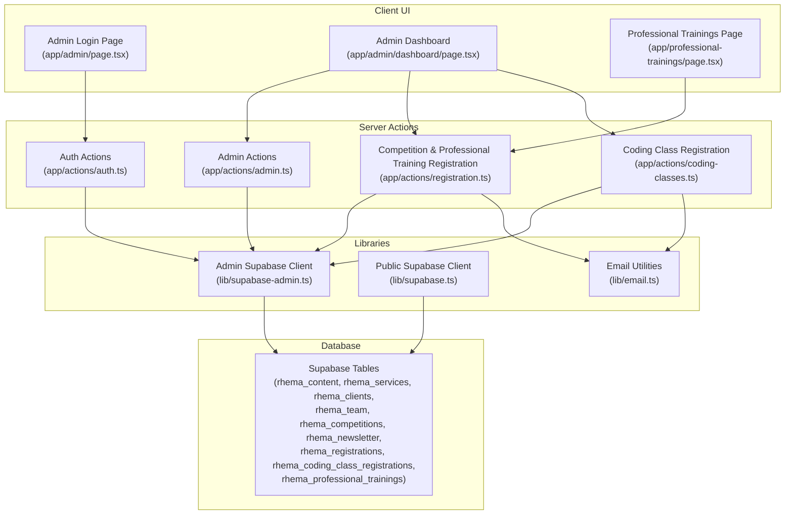
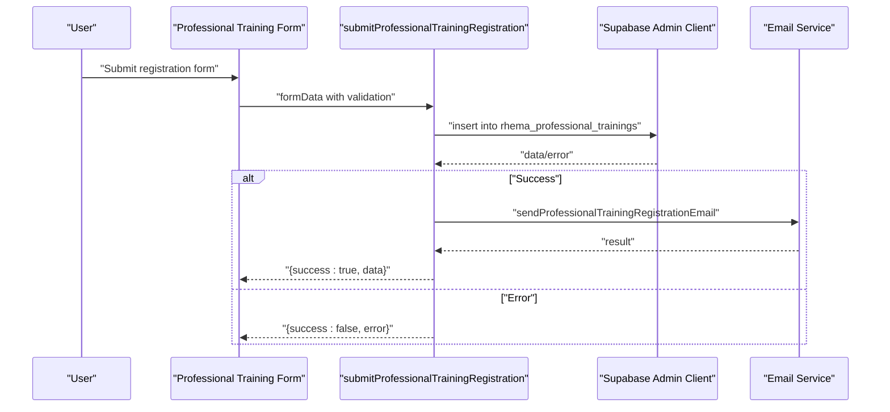
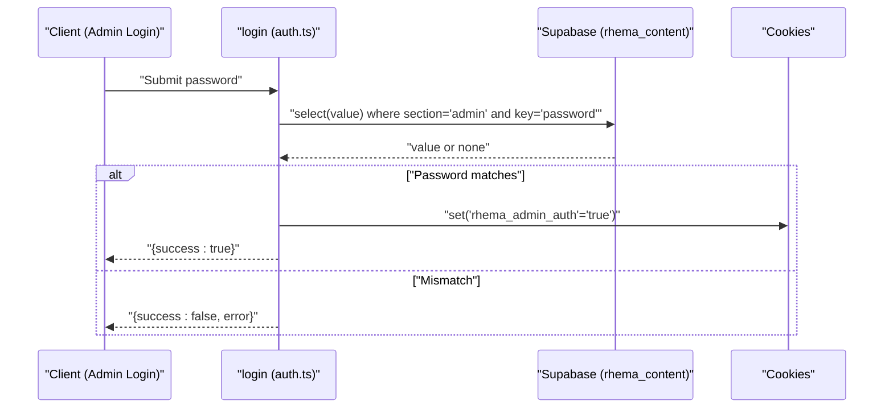
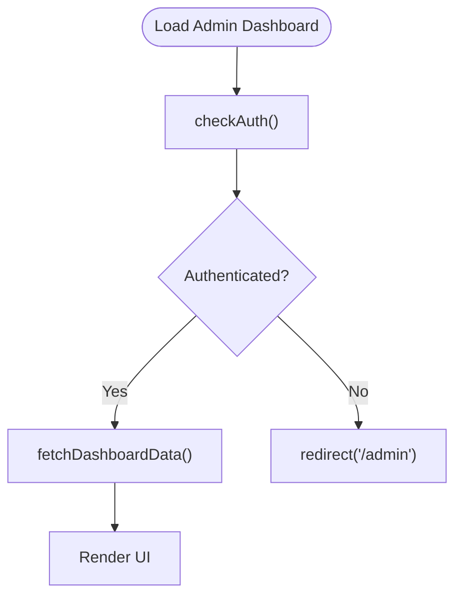
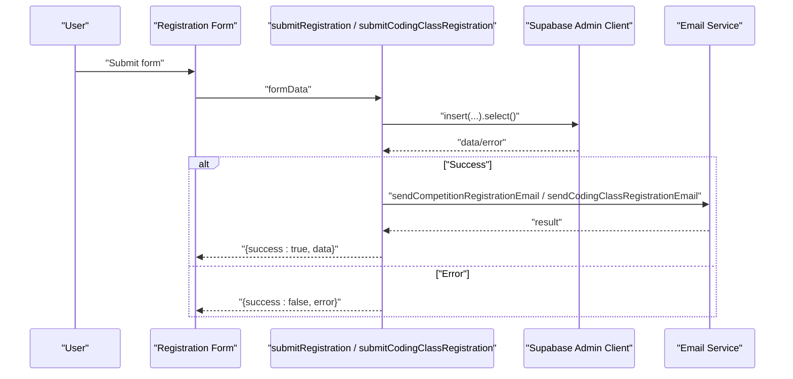
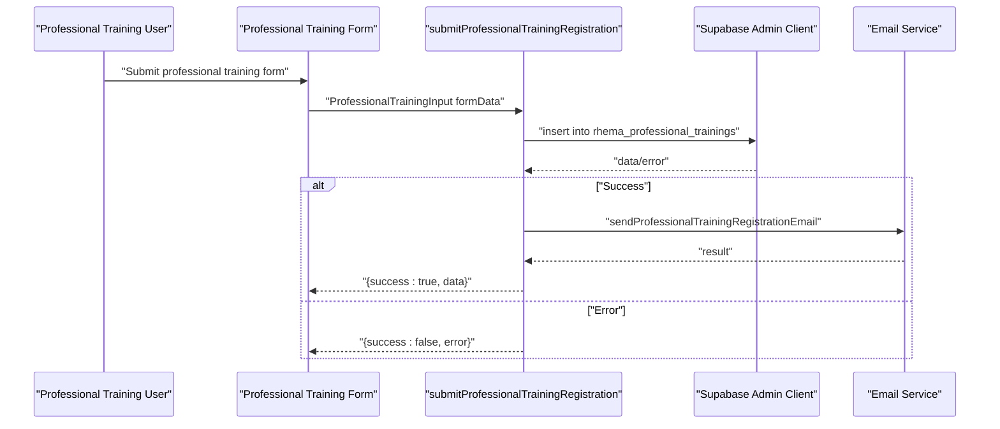
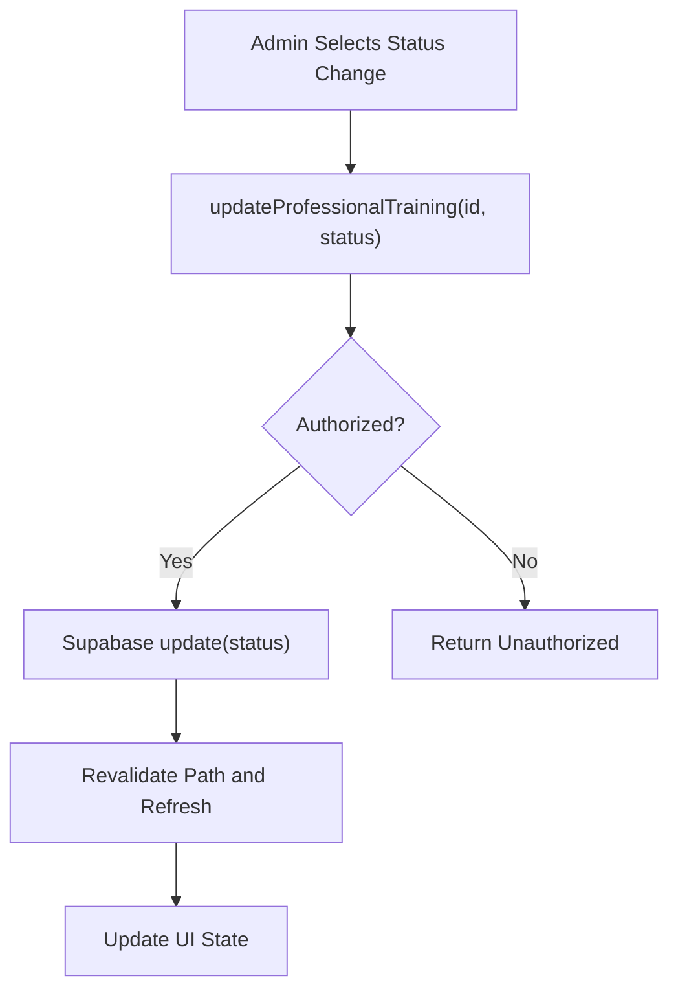
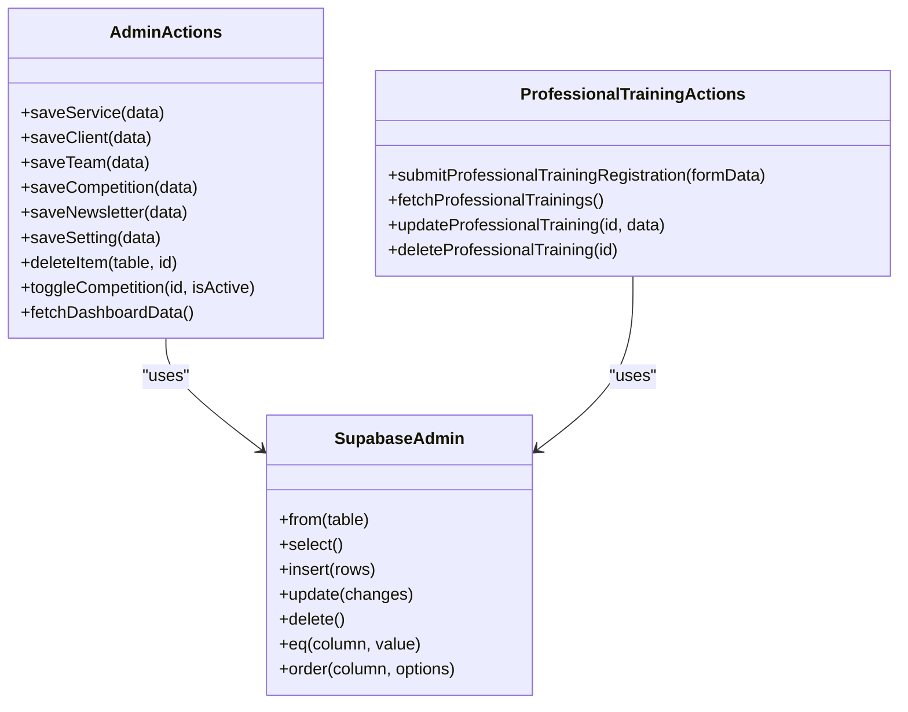
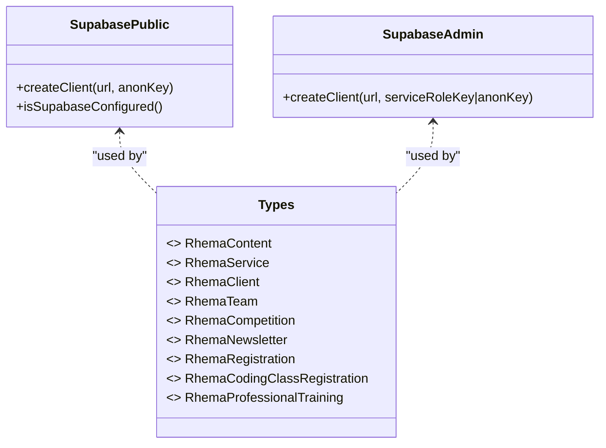
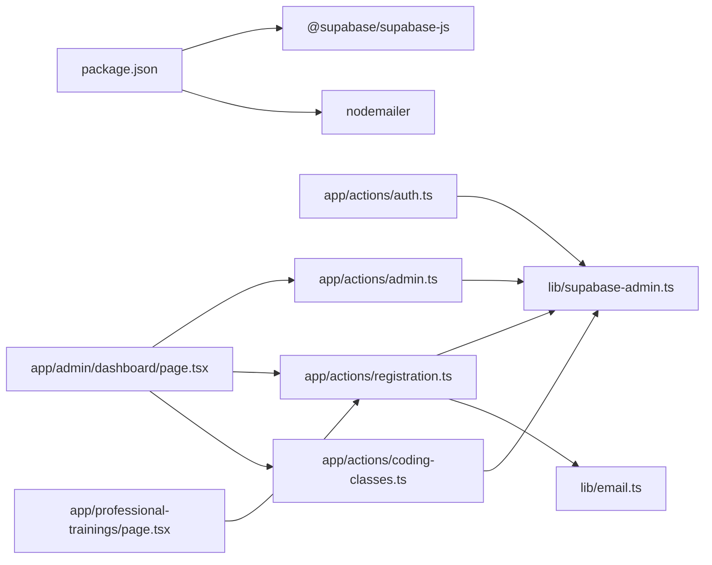

# Server Actions and Data Management

<cite>
**Referenced Files in This Document**
- [auth.ts](file://app/actions/auth.ts)
- [registration.ts](file://app/actions/registration.ts)
- [admin.ts](file://app/actions/admin.ts)
- [coding-classes.ts](file://app/actions/coding-classes.ts)
- [email.ts](file://lib/email.ts)
- [supabase.ts](file://lib/supabase.ts)
- [supabase-admin.ts](file://lib/supabase-admin.ts)
- [supabase.ts](file://types/supabase.ts)
- [admin-login-page.tsx](file://app/admin/page.tsx)
- [admin-dashboard-page.tsx](file://app/admin/dashboard/page.tsx)
- [professional-trainings-page.tsx](file://app/professional-trainings/page.tsx)
- [package.json](file://package.json)
</cite>

## Update Summary
**Changes Made**
- Added comprehensive documentation for the new Professional Training Registration system
- Updated Course Registration System section to include professional training functionality
- Enhanced Enrollment Processing and Status Updates section with professional training operations
- Added new Professional Training Registration subsection with detailed API documentation
- Updated architecture diagrams to reflect the new professional training workflow
- Expanded email notification system documentation to include professional training emails

## Table of Contents
1. [Introduction](#introduction)
2. [Project Structure](#project-structure)
3. [Core Components](#core-components)
4. [Architecture Overview](#architecture-overview)
5. [Detailed Component Analysis](#detailed-component-analysis)
6. [Dependency Analysis](#dependency-analysis)
7. [Performance Considerations](#performance-considerations)
8. [Troubleshooting Guide](#troubleshooting-guide)
9. [Conclusion](#conclusion)
10. [Appendices](#appendices)

## Introduction
This document explains the server actions and data management architecture for the Rhema Expert Solutions platform. It covers authentication and session management, protected routes, course registration systems including professional training programs, administrative workflows, and the integration with Supabase. It also documents error handling, security considerations, and provides practical guidance for extending the system with new server actions while maintaining data consistency and performance.

## Project Structure
The platform organizes server-side logic under app/actions and integrates with Supabase via dedicated client libraries. Administrative UI is implemented in app/admin/dashboard/page.tsx, which orchestrates server actions for CRUD operations and displays real-time data. The professional training system includes a dedicated public-facing registration page at app/professional-trainings/page.tsx.

**Diagram sources**
- [admin-login-page.tsx:1-52](file://app/admin/page.tsx#L1-L52)
- [admin-dashboard-page.tsx:1-1055](file://app/admin/dashboard/page.tsx#L1-L1055)
- [professional-trainings-page.tsx:1-400](file://app/professional-trainings/page.tsx#L1-L400)
- [auth.ts:1-55](file://app/actions/auth.ts#L1-L55)
- [registration.ts:1-253](file://app/actions/registration.ts#L1-L253)
- [coding-classes.ts:1-157](file://app/actions/coding-classes.ts#L1-L157)
- [admin.ts:1-198](file://app/actions/admin.ts#L1-L198)
- [email.ts:1-237](file://lib/email.ts#L1-L237)
- [supabase.ts:1-25](file://lib/supabase.ts#L1-L25)
- [supabase-admin.ts:1-19](file://lib/supabase-admin.ts#L1-L19)

**Section sources**
- [admin-login-page.tsx:1-52](file://app/admin/page.tsx#L1-L52)
- [admin-dashboard-page.tsx:1-1055](file://app/admin/dashboard/page.tsx#L1-L1055)
- [professional-trainings-page.tsx:1-400](file://app/professional-trainings/page.tsx#L1-L400)
- [auth.ts:1-55](file://app/actions/auth.ts#L1-L55)
- [registration.ts:1-253](file://app/actions/registration.ts#L1-L253)
- [coding-classes.ts:1-157](file://app/actions/coding-classes.ts#L1-L157)
- [admin.ts:1-198](file://app/actions/admin.ts#L1-L198)
- [email.ts:1-237](file://lib/email.ts#L1-L237)
- [supabase.ts:1-25](file://lib/supabase.ts#L1-L25)
- [supabase-admin.ts:1-19](file://lib/supabase-admin.ts#L1-L19)

## Core Components
- Authentication and Session Management: Secure login, session cookie, and auth checks.
- Course Registration Systems: Competition and coding class registration with validation and email notifications.
- **Professional Training Registration System**: Complete registration workflow with form validation, database operations, and email notifications.
- Administrative Functions: CRUD operations for services, clients, team, competitions, newsletter, and general settings.
- Supabase Integration: Public client for read-only access and admin client for privileged operations.
- Email Notifications: Automated admin alerts for new registrations including professional training enrollments.

**Section sources**
- [auth.ts:7-43](file://app/actions/auth.ts#L7-L43)
- [registration.ts:22-84](file://app/actions/registration.ts#L22-L84)
- [registration.ts:147-207](file://app/actions/registration.ts#L147-L207)
- [coding-classes.ts:20-76](file://app/actions/coding-classes.ts#L20-L76)
- [admin.ts:21-36](file://app/actions/admin.ts#L21-L36)
- [email.ts:23-44](file://lib/email.ts#L23-L44)
- [email.ts:193-236](file://lib/email.ts#L193-L236)
- [supabase-admin.ts:14-18](file://lib/supabase-admin.ts#L14-L18)

## Architecture Overview
The system uses Next.js Server Actions to encapsulate data mutations and protect routes via cookie-based sessions. Admin pages call server actions that interact with Supabase using an admin client bypassing Row Level Security for privileged operations. Public-facing data retrieval uses a separate public client. The professional training system follows the same pattern as other registration systems but with specialized fields and workflows.

**Diagram sources**
- [professional-trainings-page.tsx:32-64](file://app/professional-trainings/page.tsx#L32-L64)
- [registration.ts:147-207](file://app/actions/registration.ts#L147-L207)
- [email.ts:193-236](file://lib/email.ts#L193-L236)

## Detailed Component Analysis

### Authentication and Session Management
- Login validates against stored admin password (retrieved from rhema_content or environment variable), sets a secure httpOnly cookie upon success, and returns structured results.
- Logout deletes the session cookie and redirects to the admin landing page.
- checkAuth reads the session cookie to enforce protected routes.

**Diagram sources**
- [auth.ts:7-43](file://app/actions/auth.ts#L7-L43)
- [admin-login-page.tsx:12-23](file://app/admin/page.tsx#L12-L23)

**Section sources**
- [auth.ts:7-43](file://app/actions/auth.ts#L7-L43)
- [admin-login-page.tsx:12-23](file://app/admin/page.tsx#L12-L23)

### Protected Route Configuration
- The dashboard verifies authentication on mount and redirects unauthenticated users to the login page.
- Server actions enforce authentication internally for sensitive operations.

**Diagram sources**
- [admin-dashboard-page.tsx:54-64](file://app/admin/dashboard/page.tsx#L54-L64)
- [admin.ts:14-19](file://app/actions/admin.ts#L14-L19)

**Section sources**
- [admin-dashboard-page.tsx:54-64](file://app/admin/dashboard/page.tsx#L54-L64)
- [admin.ts:14-19](file://app/actions/admin.ts#L14-L19)

### Course Registration System
- Competition Registration:
  - Validates required fields, inserts a pending registration, selects the inserted row, sends an admin email, and returns structured results.
- Coding Class Registration:
  - Validates required fields (including course selections), inserts a pending registration, selects the inserted row, sends an admin email, and returns structured results.

**Diagram sources**
- [registration.ts:22-84](file://app/actions/registration.ts#L22-L84)
- [coding-classes.ts:20-76](file://app/actions/coding-classes.ts#L20-L76)
- [email.ts:46-86](file://lib/email.ts#L46-L86)

**Section sources**
- [registration.ts:22-84](file://app/actions/registration.ts#L22-L84)
- [coding-classes.ts:20-76](file://app/actions/coding-classes.ts#L20-L76)
- [email.ts:46-86](file://lib/email.ts#L46-L86)

### Professional Training Registration System
**Updated** Added comprehensive professional training registration functionality with complete CRUD operations.

- **Form Submission**: `submitProfessionalTrainingRegistration()` validates required fields (full_name, email, phone, gender, training_program, preferred_schedule, experience_level, payment_preference), inserts data into rhema_professional_trainings table, sends email notifications, and returns structured results.
- **Data Retrieval**: `fetchProfessionalTrainings()` retrieves all professional training registrations ordered by creation date.
- **Status Updates**: `updateProfessionalTraining()` allows administrators to modify registration details and status.
- **Deletion**: `deleteProfessionalTraining()` removes training registrations from the database.

**Diagram sources**
- [professional-trainings-page.tsx:32-64](file://app/professional-trainings/page.tsx#L32-L64)
- [registration.ts:147-207](file://app/actions/registration.ts#L147-L207)
- [email.ts:193-236](file://lib/email.ts#L193-L236)

**Section sources**
- [registration.ts:147-207](file://app/actions/registration.ts#L147-L207)
- [registration.ts:209-222](file://app/actions/registration.ts#L209-L222)
- [registration.ts:224-237](file://app/actions/registration.ts#L224-L237)
- [registration.ts:239-252](file://app/actions/registration.ts#L239-L252)
- [professional-trainings-page.tsx:32-64](file://app/professional-trainings/page.tsx#L32-L64)
- [email.ts:193-236](file://lib/email.ts#L193-L236)

### Enrollment Processing and Status Updates
- Competition Registrations:
  - Admin can update status and delete entries.
- Coding Class Registrations:
  - Admin can update status via a dropdown and edit registration details; deletion supported.
- **Professional Training Registrations**:
  - Admin can update status through dropdown interface, view detailed information, and delete registrations.
  - Integrated into admin dashboard with dedicated tab and full CRUD operations.

**Diagram sources**
- [admin-dashboard-page.tsx:1849-1851](file://app/admin/dashboard/page.tsx#L1849-L1851)
- [registration.ts:224-237](file://app/actions/registration.ts#L224-L237)

**Section sources**
- [admin-dashboard-page.tsx:1849-1851](file://app/admin/dashboard/page.tsx#L1849-L1851)
- [registration.ts:224-237](file://app/actions/registration.ts#L224-L237)

### Administrative Functions
- Dashboard Data Fetch:
  - Concurrently loads services, clients, team, competitions, newsletter, and settings; ensures admin password exists in settings.
  - **Enhanced** to include professional training registrations data loading.
- CRUD Operations:
  - Save/edit services, clients, team members, competitions, newsletter posts, and general settings.
  - Delete arbitrary items by table and ID.
  - Toggle competition activity flag.
  - **New** Professional training registration management with status updates and deletions.
- Revalidation:
  - Uses Next.js revalidatePath after mutations to keep UI in sync.

**Diagram sources**
- [admin.ts:21-198](file://app/actions/admin.ts#L21-L198)
- [registration.ts:147-252](file://app/actions/registration.ts#L147-L252)
- [supabase-admin.ts:14-18](file://lib/supabase-admin.ts#L14-L18)

**Section sources**
- [admin.ts:21-198](file://app/actions/admin.ts#L21-L198)
- [registration.ts:147-252](file://app/actions/registration.ts#L147-L252)

### Supabase Integration and Data Models
- Public Client:
  - Designed for read-only access with runtime checks for environment configuration.
- Admin Client:
  - Uses Service Role Key to bypass RLS for privileged operations; falls back to Anon Key with warnings.
- Data Types:
  - Strongly typed interfaces for tables including content, services, clients, team, competitions, newsletter, registrations, coding class registrations, and **new professional training registrations**.

**Diagram sources**
- [supabase.ts:16-24](file://lib/supabase.ts#L16-L24)
- [supabase-admin.ts:14-18](file://lib/supabase-admin.ts#L14-L18)
- [supabase.ts:114-131](file://types/supabase.ts#L114-L131)

**Section sources**
- [supabase.ts:16-24](file://lib/supabase.ts#L16-L24)
- [supabase-admin.ts:14-18](file://lib/supabase-admin.ts#L14-L18)
- [supabase.ts:114-131](file://types/supabase.ts#L114-L131)

### Email Notifications
- Sends HTML emails to administrators for new competition and coding class registrations.
- **Enhanced** to include professional training registration notifications with detailed participant information.
- Gracefully handles missing SMTP credentials with warnings and structured errors.

**Section sources**
- [email.ts:23-44](file://lib/email.ts#L23-L44)
- [email.ts:46-86](file://lib/email.ts#L46-L86)
- [email.ts:88-133](file://lib/email.ts#L88-L133)
- [email.ts:193-236](file://lib/email.ts#L193-L236)

## Dependency Analysis
- Runtime Dependencies:
  - @supabase/supabase-js for database operations.
  - nodemailer for email delivery.
- Internal Dependencies:
  - Server actions depend on Supabase admin client and email utilities.
  - Admin dashboard depends on server actions for all data operations.
  - **New** Professional training page depends on registration server actions.

**Diagram sources**
- [package.json:11-18](file://package.json#L11-L18)
- [auth.ts:1-55](file://app/actions/auth.ts#L1-L55)
- [registration.ts:1-253](file://app/actions/registration.ts#L1-L253)
- [coding-classes.ts:1-157](file://app/actions/coding-classes.ts#L1-L157)
- [admin.ts:1-198](file://app/actions/admin.ts#L1-L198)
- [email.ts:1-237](file://lib/email.ts#L1-L237)
- [supabase-admin.ts:1-19](file://lib/supabase-admin.ts#L1-L19)
- [admin-dashboard-page.tsx:1-1055](file://app/admin/dashboard/page.tsx#L1-L1055)
- [professional-trainings-page.tsx:1-400](file://app/professional-trainings/page.tsx#L1-L400)

**Section sources**
- [package.json:11-18](file://package.json#L11-L18)
- [auth.ts:1-55](file://app/actions/auth.ts#L1-L55)
- [registration.ts:1-253](file://app/actions/registration.ts#L1-L253)
- [coding-classes.ts:1-157](file://app/actions/coding-classes.ts#L1-L157)
- [admin.ts:1-198](file://app/actions/admin.ts#L1-L198)
- [email.ts:1-237](file://lib/email.ts#L1-L237)
- [supabase-admin.ts:1-19](file://lib/supabase-admin.ts#L1-L19)
- [admin-dashboard-page.tsx:1-1055](file://app/admin/dashboard/page.tsx#L1-L1055)
- [professional-trainings-page.tsx:1-400](file://app/professional-trainings/page.tsx#L1-L400)

## Performance Considerations
- Concurrency:
  - Use Promise.all for fetching related datasets in admin dashboard to minimize round trips.
- Caching:
  - Leverage Next.js automatic caching and revalidation via revalidatePath after mutations.
- Network Efficiency:
  - Prefer single insert/select operations and batch updates where possible.
- Environment Safety:
  - Ensure SUPABASE_SERVICE_ROLE_KEY is present to avoid RLS bypass failures and degraded performance due to retries.
- **Professional Training Optimization**:
  - Indexed queries on created_at, status, training_program, and email columns for efficient filtering and sorting.

[No sources needed since this section provides general guidance]

## Troubleshooting Guide
- Authentication Failures:
  - Verify admin password exists in rhema_content or environment variable; confirm cookie is set with correct attributes.
- Supabase Client Issues:
  - Confirm NEXT_PUBLIC_SUPABASE_URL and NEXT_PUBLIC_SUPABASE_ANON_KEY are configured; check SUPABASE_SERVICE_ROLE_KEY presence for admin operations.
- Email Delivery Problems:
  - Ensure SMTP_USER and SMTP_PASS are set; review logs for transport errors.
- **Professional Training Issues**:
  - Verify rhema_professional_trainings table exists and has proper schema; check email template formatting for professional training notifications.
- Unexpected Errors:
  - Server actions return structured {success, error} responses; log and surface user-friendly messages.

**Section sources**
- [auth.ts:7-43](file://app/actions/auth.ts#L7-L43)
- [supabase.ts:10-13](file://lib/supabase.ts#L10-L13)
- [supabase-admin.ts:7-9](file://lib/supabase-admin.ts#L7-L9)
- [email.ts:24-27](file://lib/email.ts#L24-L27)
- [registration.ts:79-83](file://app/actions/registration.ts#L79-L83)
- [registration.ts:202-206](file://app/actions/registration.ts#L202-L206)
- [coding-classes.ts:71-75](file://app/actions/coding-classes.ts#L71-L75)

## Conclusion
The platform implements a robust server-action-driven architecture with clear separation of concerns between authentication, data operations, and presentation. The addition of the professional training registration system demonstrates the scalability of the existing architecture, following established patterns for form validation, database operations, and email notifications. Supabase integration is handled via dedicated clients, and administrative workflows are protected and efficient. Extending the system requires adding new server actions, integrating with Supabase, and ensuring proper validation, error handling, and revalidation.

[No sources needed since this section summarizes without analyzing specific files]

## Appendices

### Practical Examples

- Implementing a New Server Action
  - Define a new action in app/actions/<resource>.ts with 'use server'.
  - Use supabaseAdmin for privileged operations; wrap in try/catch and return {success, data?} or {success, error}.
  - Invoke from client components and revalidate as needed.
  - **Example**: Follow the pattern established by submitProfessionalTrainingRegistration() for new registration types.

- Handling Asynchronous Operations
  - Use Promise.all for concurrent reads.
  - Use async/await for write operations and propagate errors.

- Managing Data Consistency
  - Perform insert/select in sequence to return created records.
  - Use transactions where supported by Supabase or orchestrate multiple operations atomically in actions.
  - **Professional Training Pattern**: Validate input, insert with default status, send notifications, return structured response.

**Section sources**
- [admin.ts:49-56](file://app/actions/admin.ts#L49-L56)
- [admin-dashboard-page.tsx:66-102](file://app/admin/dashboard/page.tsx#L66-L102)
- [registration.ts:147-207](file://app/actions/registration.ts#L147-L207)