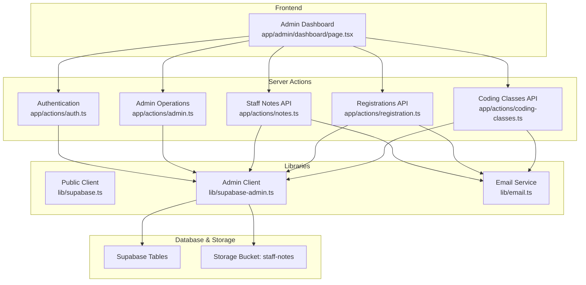
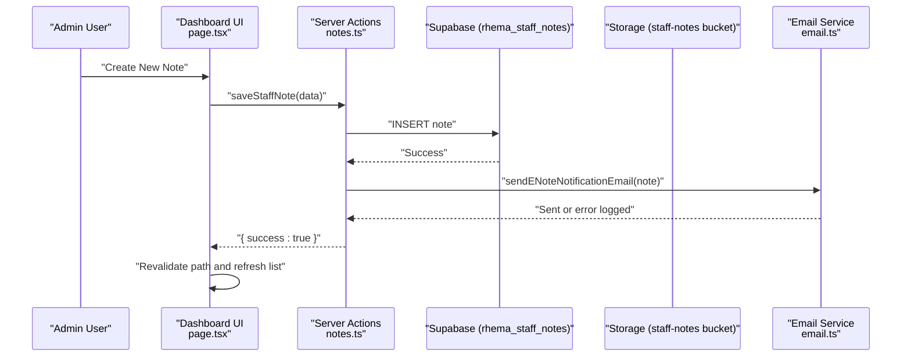
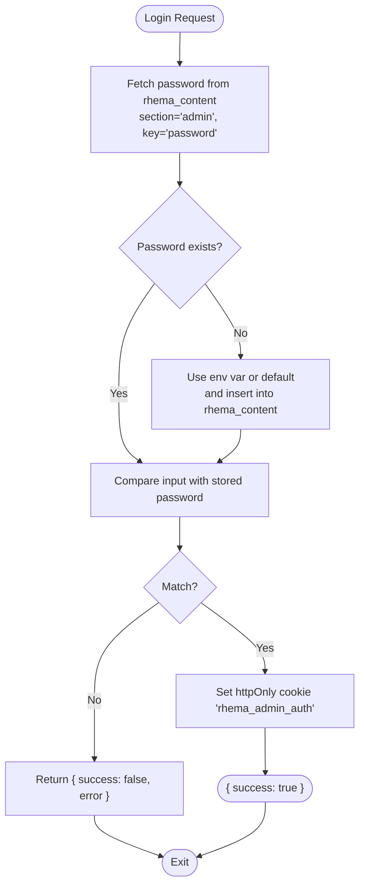
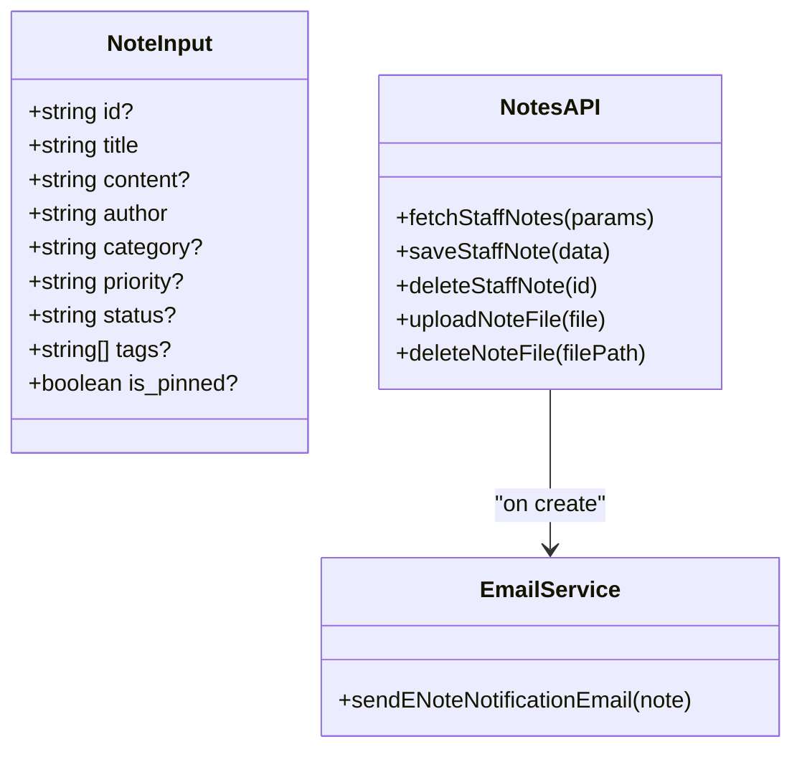
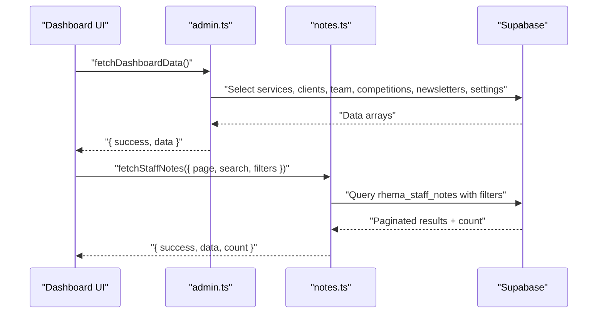
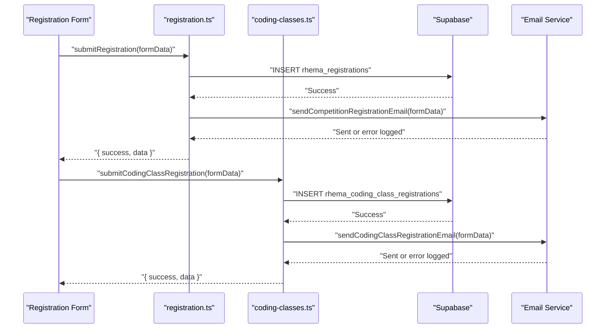
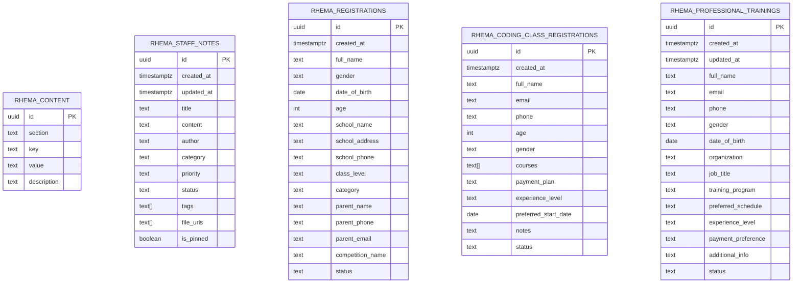
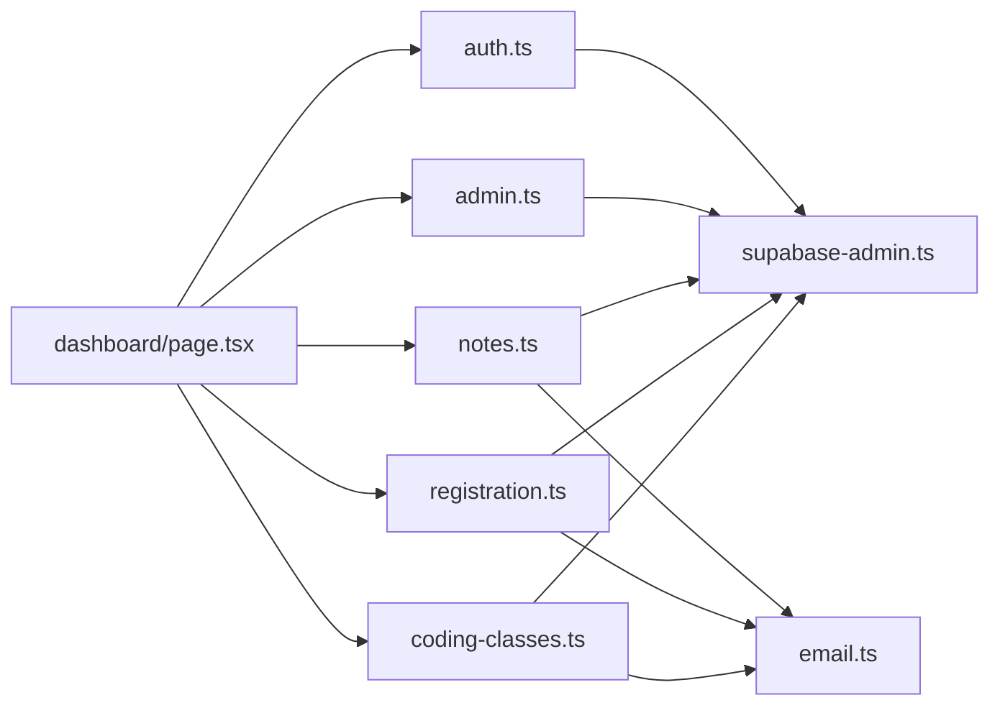

# Staff E-Notes System

<cite>
**Referenced Files in This Document**
- [README.md](file://README.md)
- [package.json](file://package.json)
- [app/actions/auth.ts](file://app/actions/auth.ts)
- [app/actions/admin.ts](file://app/actions/admin.ts)
- [app/actions/notes.ts](file://app/actions/notes.ts)
- [app/actions/registration.ts](file://app/actions/registration.ts)
- [app/actions/coding-classes.ts](file://app/actions/coding-classes.ts)
- [lib/supabase.ts](file://lib/supabase.ts)
- [lib/supabase-admin.ts](file://lib/supabase-admin.ts)
- [lib/email.ts](file://lib/email.ts)
- [types/supabase.ts](file://types/supabase.ts)
- [supabase_schema.sql](file://supabase_schema.sql)
- [supabase_migration_add_staff_notes.sql](file://supabase_migration_add_staff_notes.sql)
- [app/admin/dashboard/page.tsx](file://app/admin/dashboard/page.tsx)
</cite>

## Table of Contents
1. [Introduction](#introduction)
2. [Project Structure](#project-structure)
3. [Core Components](#core-components)
4. [Architecture Overview](#architecture-overview)
5. [Detailed Component Analysis](#detailed-component-analysis)
6. [Dependency Analysis](#dependency-analysis)
7. [Performance Considerations](#performance-considerations)
8. [Troubleshooting Guide](#troubleshooting-guide)
9. [Conclusion](#conclusion)
10. [Appendices](#appendices)

## Introduction
This document describes the Staff E-Notes System, a Next.js application that provides an admin dashboard for managing staff e-notes and related content. The system includes:
- Authentication via a simple password stored in the database or environment variable
- CRUD operations for staff notes with search, filtering, pagination, and file attachments
- Email notifications when new notes are created
- A unified admin dashboard to manage services, clients, team members, competitions, newsletters, settings, registrations, coding class registrations, professional trainings, and staff notes

The project is built on Next.js App Router, Supabase for data storage and storage buckets, and Nodemailer for email notifications.

## Project Structure
The repository follows a feature-based structure under app/actions for server actions, lib for shared utilities (Supabase clients and email), types for TypeScript interfaces, and SQL migrations for database schema.

**Diagram sources**
- [app/admin/dashboard/page.tsx:1-120](file://app/admin/dashboard/page.tsx#L1-L120)
- [app/actions/auth.ts:1-55](file://app/actions/auth.ts#L1-L55)
- [app/actions/admin.ts:1-198](file://app/actions/admin.ts#L1-L198)
- [app/actions/notes.ts:1-147](file://app/actions/notes.ts#L1-L147)
- [app/actions/registration.ts:1-253](file://app/actions/registration.ts#L1-L253)
- [app/actions/coding-classes.ts:1-157](file://app/actions/coding-classes.ts#L1-L157)
- [lib/supabase-admin.ts:1-19](file://lib/supabase-admin.ts#L1-L19)
- [lib/email.ts:1-237](file://lib/email.ts#L1-L237)
- [supabase_migration_add_staff_notes.sql:1-44](file://supabase_migration_add_staff_notes.sql#L1-L44)

**Section sources**
- [README.md:1-37](file://README.md#L1-L37)
- [package.json:1-32](file://package.json#L1-L32)

## Core Components
- Authentication: Server-side login/logout using a cookie and a password stored in rhema_content or environment variable.
- Admin Operations: Generic save/delete/toggle functions for services, clients, team, competitions, newsletter, and settings.
- Staff Notes API: Fetch, create/update/delete notes; upload/delete files; send email notifications on creation.
- Registrations APIs: Competition and coding class registration submission and management.
- Email Service: Nodemailer-based service sending formatted HTML emails for various events.
- Supabase Clients: Public client for read-only access and admin client with service role key for write operations.

Key responsibilities and interactions:
- The admin dashboard orchestrates all server actions and UI state.
- Server actions enforce authentication and interact with Supabase tables and storage.
- Email notifications are sent asynchronously after successful writes.

**Section sources**
- [app/actions/auth.ts:1-55](file://app/actions/auth.ts#L1-L55)
- [app/actions/admin.ts:1-198](file://app/actions/admin.ts#L1-L198)
- [app/actions/notes.ts:1-147](file://app/actions/notes.ts#L1-L147)
- [app/actions/registration.ts:1-253](file://app/actions/registration.ts#L1-L253)
- [app/actions/coding-classes.ts:1-157](file://app/actions/coding-classes.ts#L1-L157)
- [lib/email.ts:1-237](file://lib/email.ts#L1-L237)
- [lib/supabase-admin.ts:1-19](file://lib/supabase-admin.ts#L1-L19)
- [lib/supabase.ts:1-25](file://lib/supabase.ts#L1-L25)

## Architecture Overview
The system uses a layered architecture:
- Presentation Layer: React components in the admin dashboard.
- Application Layer: Server actions encapsulating business logic and validation.
- Integration Layer: Supabase clients for database and storage operations.
- External Services: SMTP email provider via Nodemailer.

**Diagram sources**
- [app/actions/notes.ts:61-98](file://app/actions/notes.ts#L61-L98)
- [lib/email.ts:135-191](file://lib/email.ts#L135-L191)
- [app/admin/dashboard/page.tsx:448-472](file://app/admin/dashboard/page.tsx#L448-L472)

## Detailed Component Analysis

### Authentication Flow
- Login retrieves the admin password from rhema_content section=admin, key=password. If missing, it falls back to environment variable or default and persists it into the database.
- On success, sets a secure httpOnly cookie for session persistence.
- Logout deletes the cookie and redirects to /admin.
- checkAuth validates the presence of the auth cookie.

**Diagram sources**
- [app/actions/auth.ts:7-43](file://app/actions/auth.ts#L7-L43)

**Section sources**
- [app/actions/auth.ts:1-55](file://app/actions/auth.ts#L1-L55)

### Staff Notes Management
- fetchStaffNotes supports pagination, search across title/content, and filters by status, category, priority. Results are ordered by pinned then created_at descending.
- saveStaffNote handles both create and update flows. On create, sends an email notification. Updates updated_at timestamp. Revalidates the admin dashboard path.
- deleteStaffNote removes a note by id and revalidates the dashboard.
- File handling: uploadNoteFile uploads to storage bucket staff-notes and returns public URL; deleteNoteFile removes a file by path.

**Diagram sources**
- [app/actions/notes.ts:8-18](file://app/actions/notes.ts#L8-L18)
- [app/actions/notes.ts:20-59](file://app/actions/notes.ts#L20-L59)
- [app/actions/notes.ts:61-98](file://app/actions/notes.ts#L61-L98)
- [app/actions/notes.ts:100-112](file://app/actions/notes.ts#L100-L112)
- [app/actions/notes.ts:114-146](file://app/actions/notes.ts#L114-L146)
- [lib/email.ts:135-191](file://lib/email.ts#L135-L191)

**Section sources**
- [app/actions/notes.ts:1-147](file://app/actions/notes.ts#L1-L147)
- [lib/email.ts:135-191](file://lib/email.ts#L135-L191)

### Admin Dashboard Orchestration
- Loads initial data via fetchDashboardData which queries multiple tables concurrently and ensures admin password setting exists.
- Manages tabbed UI for services, clients, team, competitions, newsletter, settings, registrations, coding classes, staff notes, and professional trainings.
- For staff notes, manages modal forms, file drag-and-drop upload, pagination, and filtering.

**Diagram sources**
- [app/actions/admin.ts:38-98](file://app/actions/admin.ts#L38-L98)
- [app/actions/notes.ts:20-59](file://app/actions/notes.ts#L20-L59)
- [app/admin/dashboard/page.tsx:99-140](file://app/admin/dashboard/page.tsx#L99-L140)
- [app/admin/dashboard/page.tsx:295-309](file://app/admin/dashboard/page.tsx#L295-L309)

**Section sources**
- [app/actions/admin.ts:1-198](file://app/actions/admin.ts#L1-L198)
- [app/admin/dashboard/page.tsx:1-120](file://app/admin/dashboard/page.tsx#L1-L120)

### Registration Workflows
- Competition registration: submitRegistration inserts into rhema_registrations and sends an email notification.
- Coding class registration: submitCodingClassRegistration inserts into rhema_coding_class_registrations and sends an email notification.
- Professional training registration: submitProfessionalTrainingRegistration inserts into rhema_professional_trainings and sends an email notification.

**Diagram sources**
- [app/actions/registration.ts:22-84](file://app/actions/registration.ts#L22-L84)
- [app/actions/coding-classes.ts:20-76](file://app/actions/coding-classes.ts#L20-L76)
- [lib/email.ts:46-86](file://lib/email.ts#L46-L86)
- [lib/email.ts:88-133](file://lib/email.ts#L88-L133)

**Section sources**
- [app/actions/registration.ts:1-253](file://app/actions/registration.ts#L1-L253)
- [app/actions/coding-classes.ts:1-157](file://app/actions/coding-classes.ts#L1-L157)
- [lib/email.ts:46-133](file://lib/email.ts#L46-L133)

### Data Models
The following entities are modeled in TypeScript and used across server actions and UI:
- RhemaContent: Key-value settings including admin password.
- RhemaService, RhemaClient, RhemaTeam, RhemaCompetition, RhemaNewsletter: Content management entities.
- RhemaRegistration: Competition registration records.
- RhemaCodingClassRegistration: Coding class registration records.
- RhemaStaffNote: Staff e-note records with optional attachments and metadata.
- RhemaProfessionalTraining: Professional training registration records.

**Diagram sources**
- [types/supabase.ts:5-131](file://types/supabase.ts#L5-L131)
- [supabase_schema.sql:1-33](file://supabase_schema.sql#L1-L33)
- [supabase_migration_add_staff_notes.sql:1-44](file://supabase_migration_add_staff_notes.sql#L1-L44)

**Section sources**
- [types/supabase.ts:1-132](file://types/supabase.ts#L1-L132)
- [supabase_schema.sql:1-33](file://supabase_schema.sql#L1-L33)
- [supabase_migration_add_staff_notes.sql:1-44](file://supabase_migration_add_staff_notes.sql#L1-L44)

## Dependency Analysis
- Server actions depend on Supabase admin client for database and storage operations.
- Email service depends on Nodemailer configured with SMTP credentials.
- Admin dashboard composes multiple server actions and manages local UI state.

**Diagram sources**
- [app/actions/auth.ts:1-55](file://app/actions/auth.ts#L1-L55)
- [app/actions/admin.ts:1-198](file://app/actions/admin.ts#L1-L198)
- [app/actions/notes.ts:1-147](file://app/actions/notes.ts#L1-L147)
- [app/actions/registration.ts:1-253](file://app/actions/registration.ts#L1-L253)
- [app/actions/coding-classes.ts:1-157](file://app/actions/coding-classes.ts#L1-L157)
- [lib/supabase-admin.ts:1-19](file://lib/supabase-admin.ts#L1-L19)
- [lib/email.ts:1-237](file://lib/email.ts#L1-L237)
- [app/admin/dashboard/page.tsx:1-120](file://app/admin/dashboard/page.tsx#L1-L120)

**Section sources**
- [package.json:11-18](file://package.json#L11-L18)

## Performance Considerations
- Pagination and indexing: Staff notes use range queries and indexes on created_at, status, category, and priority to optimize filtering and sorting.
- Concurrent reads: Dashboard fetches multiple datasets in parallel to reduce latency.
- File uploads: Enforce size limits and handle errors gracefully; avoid blocking note saves if email fails.
- Cache revalidation: Use Next.js revalidatePath to keep UI consistent without full reloads.

[No sources needed since this section provides general guidance]

## Troubleshooting Guide
Common issues and resolutions:
- Missing Supabase configuration:
  - Symptom: Console warning about missing environment variables; dynamic content may not load.
  - Resolution: Ensure NEXT_PUBLIC_SUPABASE_URL and NEXT_PUBLIC_SUPABASE_ANON_KEY are set.
- Admin write failures due to RLS:
  - Symptom: Errors when writing via admin client.
  - Resolution: Provide SUPABASE_SERVICE_ROLE_KEY so the admin client bypasses RLS.
- Email notifications disabled:
  - Symptom: Warning logs indicating SMTP_USER or SMTP_PASS not configured.
  - Resolution: Configure SMTP_USER and SMTP_PASS environment variables.
- Unauthorized access:
  - Symptom: Server actions return unauthorized.
  - Resolution: Verify rhema_admin_auth cookie is present and valid; ensure login succeeded.

**Section sources**
- [lib/supabase.ts:10-13](file://lib/supabase.ts#L10-L13)
- [lib/supabase-admin.ts:7-9](file://lib/supabase-admin.ts#L7-L9)
- [lib/email.ts:23-27](file://lib/email.ts#L23-L27)
- [app/actions/auth.ts:50-55](file://app/actions/auth.ts#L50-L55)

## Conclusion
The Staff E-Notes System provides a robust admin interface for managing internal communications and operational data. It leverages Next.js server actions for secure server-side logic, Supabase for scalable data and storage, and Nodemailer for timely notifications. The modular design separates concerns between UI orchestration, business logic, and external integrations, making it maintainable and extensible.

[No sources needed since this section summarizes without analyzing specific files]

## Appendices

### Environment Variables Reference
- NEXT_PUBLIC_SUPABASE_URL: Supabase project URL.
- NEXT_PUBLIC_SUPABASE_ANON_KEY: Public anon key for read operations.
- SUPABASE_SERVICE_ROLE_KEY: Service role key for admin write operations.
- SMTP_USER: SMTP username for email notifications.
- SMTP_PASS: SMTP password for email notifications.
- ADMIN_PASSWORD: Fallback admin password if not present in database.
- NEXT_PUBLIC_SITE_URL: Base site URL used in email links.

[No sources needed since this section provides general guidance]