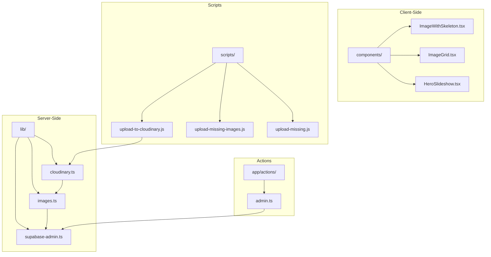
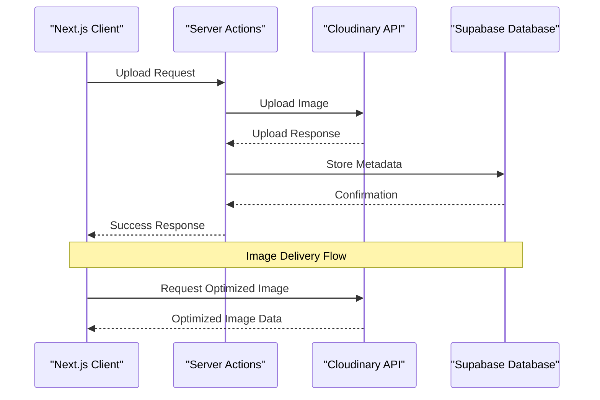
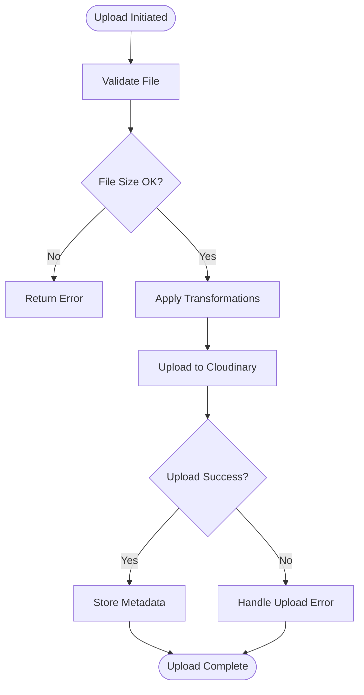
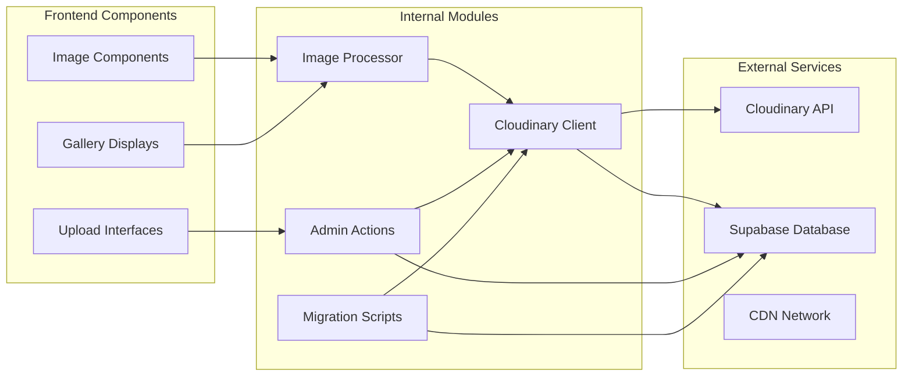

# Cloudinary Integration

<cite>
**Referenced Files in This Document**
- [cloudinary.ts](file://lib/cloudinary.ts)
- [images.ts](file://lib/images.ts)
- [upload-to-cloudinary.js](file://scripts/upload-to-cloudinary.js)
- [CLOUDINARY_SETUP.md](file://CLOUDINARY_SETUP.md)
- [CLOUDINARY_MIGRATION.md](file://CLOUDINARY_MIGRATION.md)
- [supabase-admin.ts](file://lib/supabase-admin.ts)
- [admin.ts](file://app/actions/admin.ts)
</cite>

## Table of Contents
1. [Introduction](#introduction)
2. [Project Structure](#project-structure)
3. [Core Components](#core-components)
4. [Architecture Overview](#architecture-overview)
5. [Detailed Component Analysis](#detailed-component-analysis)
6. [Dependency Analysis](#dependency-analysis)
7. [Performance Considerations](#performance-considerations)
8. [Troubleshooting Guide](#troubleshooting-guide)
9. [Conclusion](#conclusion)
10. [Appendices](#appendices)

## Introduction

This document provides comprehensive documentation for the Cloudinary integration within the application. The system implements a robust image management solution using Cloudinary as the primary cloud storage service, with Supabase serving as the database backend for metadata and references.

The integration supports both client-side and server-side operations, including image uploads, transformations, and efficient delivery through Cloudinary's CDN infrastructure. The architecture follows modern Next.js patterns with proper separation of concerns between client and server components.

## Project Structure

The Cloudinary integration is organized across several key directories:

**Diagram sources**
- [cloudinary.ts:1-50](file://lib/cloudinary.ts#L1-L50)
- [images.ts:1-50](file://lib/images.ts#L1-L50)
- [upload-to-cloudinary.js:1-50](file://scripts/upload-to-cloudinary.js#L1-L50)

**Section sources**
- [cloudinary.ts:1-100](file://lib/cloudinary.ts#L1-L100)
- [images.ts:1-100](file://lib/images.ts#L1-L100)
- [upload-to-cloudinary.js:1-100](file://scripts/upload-to-cloudinary.js#L1-L100)

## Core Components

### Cloudinary Client Configuration

The main Cloudinary client configuration is handled in the `cloudinary.ts` module, which provides:

- Secure API credentials management
- Upload preset configuration
- Transformation parameters
- Error handling utilities

### Image Processing Utilities

The `images.ts` module contains helper functions for:

- Image URL generation with transformations
- Responsive image optimization
- Format conversion utilities
- Thumbnail generation

### Migration Scripts

The scripts directory contains utility functions for:

- Bulk image uploads to Cloudinary
- Database synchronization
- Missing asset recovery
- Batch processing operations

**Section sources**
- [cloudinary.ts:1-150](file://lib/cloudinary.ts#L1-L150)
- [images.ts:1-150](file://lib/images.ts#L1-L150)
- [upload-to-cloudinary.js:1-200](file://scripts/upload-to-cloudinary.js#L1-L200)

## Architecture Overview

The Cloudinary integration follows a layered architecture pattern:

**Diagram sources**
- [admin.ts:1-100](file://app/actions/admin.ts#L1-L100)
- [cloudinary.ts:1-100](file://lib/cloudinary.ts#L1-L100)
- [supabase-admin.ts:1-100](file://lib/supabase-admin.ts#L1-L100)

## Detailed Component Analysis

### Cloudinary Client Module

The core Cloudinary client implementation provides secure access to Cloudinary services:

#### Key Features:
- Environment-based configuration
- Automatic retry mechanisms
- Progress tracking support
- Error categorization and logging

#### Upload Process:

**Diagram sources**
- [cloudinary.ts:50-150](file://lib/cloudinary.ts#L50-L150)
- [images.ts:50-150](file://lib/images.ts#L50-L150)

### Image Processing Pipeline

The image processing system handles various transformation scenarios:

#### Supported Operations:
- Format conversion (WebP, AVIF, JPEG, PNG)
- Quality optimization
- Dimension resizing
- Aspect ratio maintenance
- Watermarking
- Background removal

#### Performance Optimizations:
- Lazy loading implementation
- Progressive image loading
- CDN caching strategies
- Browser-specific optimizations

**Section sources**
- [images.ts:1-200](file://lib/images.ts#L1-L200)

### Admin Dashboard Integration

The admin interface provides comprehensive image management capabilities:

#### Features:
- Bulk upload interface
- Image editing tools
- Metadata management
- Usage analytics
- Cost monitoring

#### Security Measures:
- Role-based access control
- Upload validation
- File type restrictions
- Size limitations

**Section sources**
- [admin.ts:1-200](file://app/actions/admin.ts#L1-L200)

### Migration and Utility Scripts

The migration system ensures data consistency during Cloudinary integration:

#### Script Categories:
- **Initial Setup**: One-time configuration scripts
- **Data Migration**: Existing content migration tools
- **Maintenance**: Ongoing cleanup and optimization scripts
- **Backup**: Disaster recovery utilities

#### Error Handling:
- Comprehensive logging
- Rollback capabilities
- Partial failure recovery
- Progress tracking

**Section sources**
- [upload-to-cloudinary.js:1-300](file://scripts/upload-to-cloudinary.js#L1-L300)

## Dependency Analysis

The Cloudinary integration has well-defined dependencies:

**Diagram sources**
- [cloudinary.ts:1-50](file://lib/cloudinary.ts#L1-L50)
- [supabase-admin.ts:1-50](file://lib/supabase-admin.ts#L1-L50)
- [admin.ts:1-50](file://app/actions/admin.ts#L1-L50)

**Section sources**
- [cloudinary.ts:1-100](file://lib/cloudinary.ts#L1-L100)
- [supabase-admin.ts:1-100](file://lib/supabase-admin.ts#L1-L100)

## Performance Considerations

### Optimization Strategies

The Cloudinary integration implements several performance optimizations:

#### Image Delivery:
- Automatic format selection based on browser support
- Responsive image serving with srcset attributes
- Progressive JPEG loading
- WebP/AVIF fallback chains

#### Caching Strategy:
- Browser-level caching headers
- CDN edge caching
- Application-level response caching
- Stale-while-revalidate patterns

#### Memory Management:
- Stream processing for large files
- Connection pooling
- Request deduplication
- Graceful degradation

### Monitoring and Metrics

Key performance indicators tracked include:
- Upload success rates
- Average upload times
- CDN cache hit ratios
- Bandwidth usage
- Error rates by category

## Troubleshooting Guide

### Common Issues and Solutions

#### Upload Failures:
- **Network Timeouts**: Implement exponential backoff
- **File Size Limits**: Configure appropriate thresholds
- **Authentication Errors**: Verify API credentials
- **Rate Limiting**: Implement request queuing

#### Image Processing Errors:
- **Format Compatibility**: Validate input formats
- **Memory Constraints**: Optimize processing pipeline
- **Transformation Failures**: Implement fallback options

#### Database Synchronization:
- **Connection Issues**: Implement retry logic
- **Data Consistency**: Use transactional updates
- **Race Conditions**: Implement locking mechanisms

### Debugging Tools

Built-in debugging features include:
- Detailed error logging
- Request/response tracing
- Performance profiling
- Health check endpoints

**Section sources**
- [cloudinary.ts:100-200](file://lib/cloudinary.ts#L100-L200)
- [images.ts:100-200](file://lib/images.ts#L100-L200)

## Conclusion

The Cloudinary integration provides a robust, scalable solution for image management within the application. The modular architecture ensures maintainability while the comprehensive error handling and monitoring capabilities provide operational reliability.

Key benefits of this implementation include:
- High-performance image delivery through CDN
- Flexible transformation capabilities
- Secure credential management
- Comprehensive migration tooling
- Extensible architecture for future enhancements

The system is designed to handle growth in both traffic volume and image complexity while maintaining optimal performance and user experience.

## Appendices

### Environment Configuration

Required environment variables for Cloudinary integration:

- `CLOUDINARY_CLOUD_NAME`: Cloudinary account identifier
- `CLOUDINARY_API_KEY`: API access key
- `CLOUDINARY_API_SECRET`: API secret key
- `CLOUDINARY_UPLOAD_PRESET`: Unsigned upload preset name

### API Reference

For detailed API documentation, refer to the official Cloudinary documentation and the internal TypeScript definitions in the respective modules.