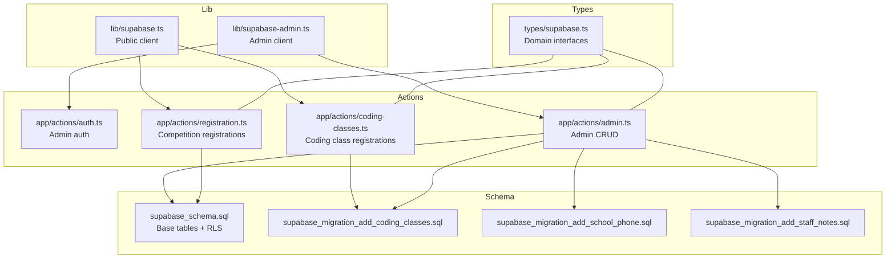
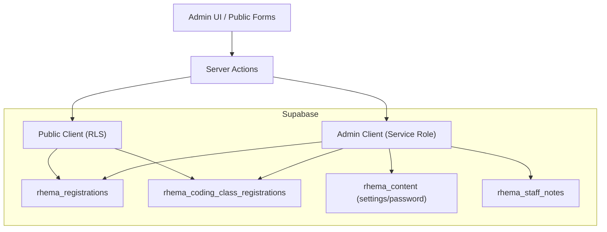
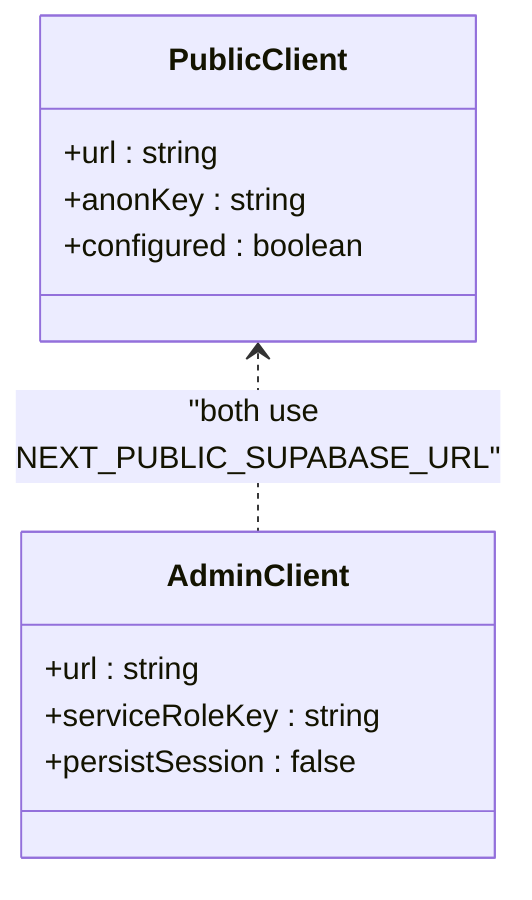
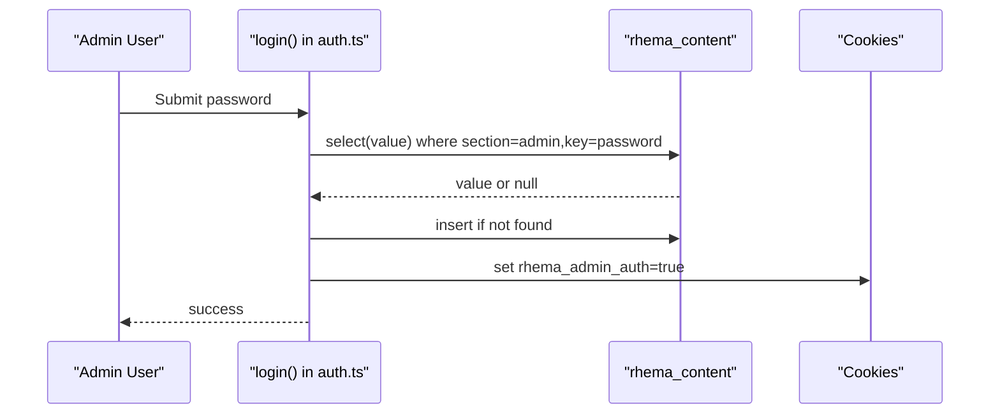
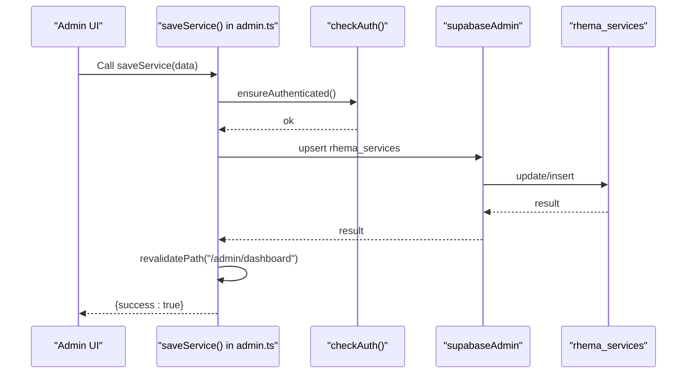
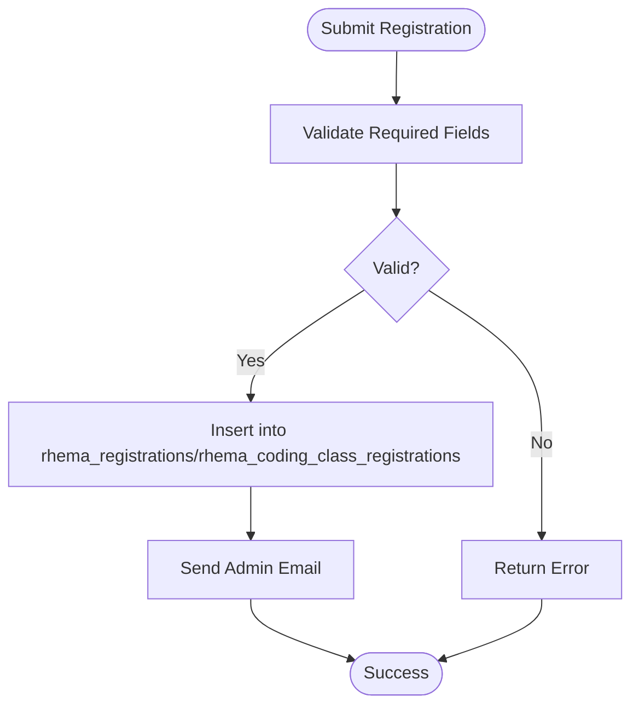
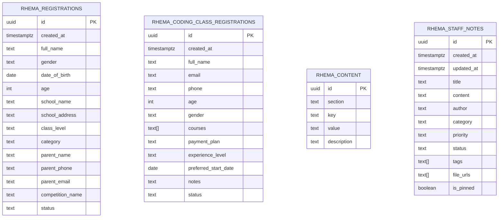
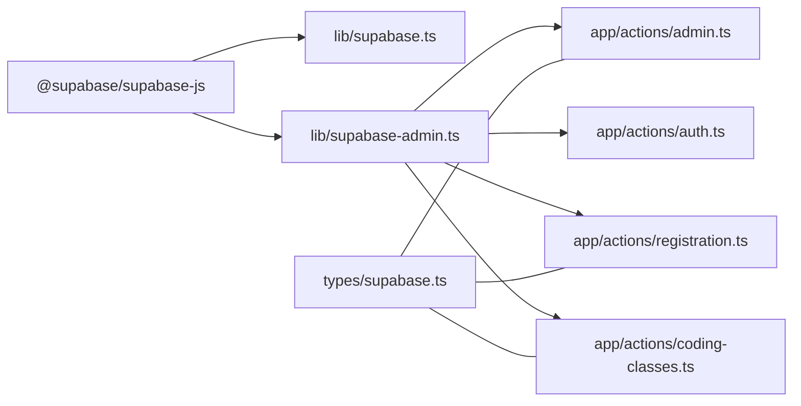

# Database Services

<cite>
**Referenced Files in This Document**
- [supabase.ts](file://lib/supabase.ts)
- [supabase-admin.ts](file://lib/supabase-admin.ts)
- [supabase.ts](file://types/supabase.ts)
- [admin.ts](file://app/actions/admin.ts)
- [auth.ts](file://app/actions/auth.ts)
- [coding-classes.ts](file://app/actions/coding-classes.ts)
- [registration.ts](file://app/actions/registration.ts)
- [supabase_schema.sql](file://supabase_schema.sql)
- [supabase_migration_add_coding_classes.sql](file://supabase_migration_add_coding_classes.sql)
- [supabase_migration_add_school_phone.sql](file://supabase_migration_add_school_phone.sql)
- [supabase_migration_add_staff_notes.sql](file://supabase_migration_add_staff_notes.sql)
- [package.json](file://package.json)
</cite>

## Table of Contents
1. [Introduction](#introduction)
2. [Project Structure](#project-structure)
3. [Core Components](#core-components)
4. [Architecture Overview](#architecture-overview)
5. [Detailed Component Analysis](#detailed-component-analysis)
6. [Dependency Analysis](#dependency-analysis)
7. [Performance Considerations](#performance-considerations)
8. [Troubleshooting Guide](#troubleshooting-guide)
9. [Conclusion](#conclusion)
10. [Appendices](#appendices)

## Introduction
This document explains the database service implementations powering Rhema Expert Solutions. It focuses on Supabase client configurations for standard user access and administrative operations, the separation between client and admin connections, authentication and permission models, environment variable requirements, service abstractions, error handling, and practical guidance for extending functionality, managing transactions, and evolving the schema safely.

## Project Structure
The database layer is organized around two Supabase clients and a set of server actions that encapsulate CRUD operations against Supabase tables. Type definitions model the domain entities. Migrations define the evolving schema and Row Level Security (RLS) policies.

**Diagram sources**
- [supabase.ts:1-25](file://lib/supabase.ts#L1-L25)
- [supabase-admin.ts:1-19](file://lib/supabase-admin.ts#L1-L19)
- [supabase.ts:1-113](file://types/supabase.ts#L1-L113)
- [admin.ts:1-198](file://app/actions/admin.ts#L1-L198)
- [auth.ts:1-55](file://app/actions/auth.ts#L1-L55)
- [registration.ts:1-131](file://app/actions/registration.ts#L1-L131)
- [coding-classes.ts:1-157](file://app/actions/coding-classes.ts#L1-L157)
- [supabase_schema.sql:1-33](file://supabase_schema.sql#L1-L33)
- [supabase_migration_add_coding_classes.sql:1-30](file://supabase_migration_add_coding_classes.sql#L1-L30)
- [supabase_migration_add_school_phone.sql:1-4](file://supabase_migration_add_school_phone.sql#L1-L4)
- [supabase_migration_add_staff_notes.sql:1-44](file://supabase_migration_add_staff_notes.sql#L1-L44)

**Section sources**
- [supabase.ts:1-25](file://lib/supabase.ts#L1-L25)
- [supabase-admin.ts:1-19](file://lib/supabase-admin.ts#L1-L19)
- [supabase.ts:1-113](file://types/supabase.ts#L1-L113)
- [admin.ts:1-198](file://app/actions/admin.ts#L1-L198)
- [auth.ts:1-55](file://app/actions/auth.ts#L1-L55)
- [registration.ts:1-131](file://app/actions/registration.ts#L1-L131)
- [coding-classes.ts:1-157](file://app/actions/coding-classes.ts#L1-L157)
- [supabase_schema.sql:1-33](file://supabase_schema.sql#L1-L33)
- [supabase_migration_add_coding_classes.sql:1-30](file://supabase_migration_add_coding_classes.sql#L1-L30)
- [supabase_migration_add_school_phone.sql:1-4](file://supabase_migration_add_school_phone.sql#L1-L4)
- [supabase_migration_add_staff_notes.sql:1-44](file://supabase_migration_add_staff_notes.sql#L1-L44)

## Core Components
- Public client for read/write operations constrained by RLS:
  - Initializes with NEXT_PUBLIC_SUPABASE_URL and NEXT_PUBLIC_SUPABASE_ANON_KEY.
  - Intended for public-facing forms and read-only access patterns.
- Admin client for privileged operations:
  - Initializes with NEXT_PUBLIC_SUPABASE_URL and SUPABASE_SERVICE_ROLE_KEY.
  - Disables session persistence; bypasses RLS for administrative tasks.
- Domain types:
  - Strongly typed interfaces for content, services, clients, team, competitions, newsletter, registrations, projects, coding class registrations, and staff notes.
- Server actions:
  - Admin actions orchestrate authenticated admin operations and cache revalidation.
  - Auth actions manage admin login, logout, and session checks.
  - Registration and coding-class actions handle form submissions, validations, and notifications.

**Section sources**
- [supabase.ts:1-25](file://lib/supabase.ts#L1-L25)
- [supabase-admin.ts:1-19](file://lib/supabase-admin.ts#L1-L19)
- [supabase.ts:1-113](file://types/supabase.ts#L1-L113)
- [admin.ts:1-198](file://app/actions/admin.ts#L1-L198)
- [auth.ts:1-55](file://app/actions/auth.ts#L1-L55)
- [registration.ts:1-131](file://app/actions/registration.ts#L1-L131)
- [coding-classes.ts:1-157](file://app/actions/coding-classes.ts#L1-L157)

## Architecture Overview
The system separates concerns between public and admin pathways:
- Public pathways use the public client and rely on RLS policies.
- Admin pathways use the admin client and bypass RLS for full CRUD operations after authentication.

**Diagram sources**
- [supabase.ts:1-25](file://lib/supabase.ts#L1-L25)
- [supabase-admin.ts:1-19](file://lib/supabase-admin.ts#L1-L19)
- [admin.ts:1-198](file://app/actions/admin.ts#L1-L198)
- [registration.ts:1-131](file://app/actions/registration.ts#L1-L131)
- [coding-classes.ts:1-157](file://app/actions/coding-classes.ts#L1-L157)
- [supabase_schema.sql:1-33](file://supabase_schema.sql#L1-L33)
- [supabase_migration_add_coding_classes.sql:1-30](file://supabase_migration_add_coding_classes.sql#L1-L30)
- [supabase_migration_add_staff_notes.sql:1-44](file://supabase_migration_add_staff_notes.sql#L1-L44)

## Detailed Component Analysis

### Supabase Clients
- Public client:
  - Environment variables: NEXT_PUBLIC_SUPABASE_URL, NEXT_PUBLIC_SUPABASE_ANON_KEY.
  - Behavior: constrained by RLS; suitable for read-mostly and controlled inserts via policies.
- Admin client:
  - Environment variables: NEXT_PUBLIC_SUPABASE_URL, SUPABASE_SERVICE_ROLE_KEY.
  - Behavior: bypasses RLS; disables session persistence; intended for server-side admin operations.

**Diagram sources**
- [supabase.ts:1-25](file://lib/supabase.ts#L1-L25)
- [supabase-admin.ts:1-19](file://lib/supabase-admin.ts#L1-L19)

**Section sources**
- [supabase.ts:1-25](file://lib/supabase.ts#L1-L25)
- [supabase-admin.ts:1-19](file://lib/supabase-admin.ts#L1-L19)

### Authentication and Authorization
- Admin login retrieves the stored admin password from rhema_content or falls back to ADMIN_PASSWORD, sets a session cookie, and redirects to the admin dashboard.
- Admin actions enforce authentication via a helper that checks the session cookie.
- RLS policies permit public inserts for registration tables and selective reads; admin client bypasses RLS for privileged operations.

**Diagram sources**
- [auth.ts:1-55](file://app/actions/auth.ts#L1-L55)
- [admin.ts:1-198](file://app/actions/admin.ts#L1-L198)

**Section sources**
- [auth.ts:1-55](file://app/actions/auth.ts#L1-L55)
- [admin.ts:1-198](file://app/actions/admin.ts#L1-L198)
- [supabase_schema.sql:1-33](file://supabase_schema.sql#L1-L33)
- [supabase_migration_add_coding_classes.sql:1-30](file://supabase_migration_add_coding_classes.sql#L1-L30)

### Admin CRUD Operations
- Admin actions support create, read, update, delete, and toggling competition activity.
- Parallel reads consolidate multiple queries for dashboard data.
- Cache invalidation triggers revalidation of the admin dashboard route after mutations.

**Diagram sources**
- [admin.ts:1-198](file://app/actions/admin.ts#L1-L198)
- [supabase-admin.ts:1-19](file://lib/supabase-admin.ts#L1-L19)

**Section sources**
- [admin.ts:1-198](file://app/actions/admin.ts#L1-L198)

### Registration Workflows
- Competition registrations:
  - Validates required fields, inserts into rhema_registrations, and sends admin notifications.
- Coding class registrations:
  - Validates required fields, inserts into rhema_coding_class_registrations, transforms numeric fields, and sends admin notifications.

**Diagram sources**
- [registration.ts:1-131](file://app/actions/registration.ts#L1-L131)
- [coding-classes.ts:1-157](file://app/actions/coding-classes.ts#L1-L157)

**Section sources**
- [registration.ts:1-131](file://app/actions/registration.ts#L1-L131)
- [coding-classes.ts:1-157](file://app/actions/coding-classes.ts#L1-L157)

### Schema Evolution and Policies
- Base schema defines rhema_registrations with RLS allowing public inserts and admin access.
- Additional migrations introduce rhema_coding_class_registrations, optional school_phone, and rhema_staff_notes with indexes and storage policies.
- RLS policies ensure safe access patterns for public and admin roles.

**Diagram sources**
- [supabase_schema.sql:1-33](file://supabase_schema.sql#L1-L33)
- [supabase_migration_add_coding_classes.sql:1-30](file://supabase_migration_add_coding_classes.sql#L1-L30)
- [supabase_migration_add_school_phone.sql:1-4](file://supabase_migration_add_school_phone.sql#L1-L4)
- [supabase_migration_add_staff_notes.sql:1-44](file://supabase_migration_add_staff_notes.sql#L1-L44)

**Section sources**
- [supabase_schema.sql:1-33](file://supabase_schema.sql#L1-L33)
- [supabase_migration_add_coding_classes.sql:1-30](file://supabase_migration_add_coding_classes.sql#L1-L30)
- [supabase_migration_add_school_phone.sql:1-4](file://supabase_migration_add_school_phone.sql#L1-L4)
- [supabase_migration_add_staff_notes.sql:1-44](file://supabase_migration_add_staff_notes.sql#L1-L44)

## Dependency Analysis
- Runtime dependencies include @supabase/supabase-js for client connectivity.
- Server actions depend on the admin client for privileged operations and on the public client for read-only or policy-governed operations.
- Types define the contract between actions and database tables.

**Diagram sources**
- [package.json:11-18](file://package.json#L11-L18)
- [supabase.ts:1-25](file://lib/supabase.ts#L1-L25)
- [supabase-admin.ts:1-19](file://lib/supabase-admin.ts#L1-L19)
- [admin.ts:1-198](file://app/actions/admin.ts#L1-L198)
- [auth.ts:1-55](file://app/actions/auth.ts#L1-L55)
- [registration.ts:1-131](file://app/actions/registration.ts#L1-L131)
- [coding-classes.ts:1-157](file://app/actions/coding-classes.ts#L1-L157)
- [supabase.ts:1-113](file://types/supabase.ts#L1-L113)

**Section sources**
- [package.json:11-18](file://package.json#L11-L18)
- [supabase.ts:1-25](file://lib/supabase.ts#L1-L25)
- [supabase-admin.ts:1-19](file://lib/supabase-admin.ts#L1-L19)
- [admin.ts:1-198](file://app/actions/admin.ts#L1-L198)
- [auth.ts:1-55](file://app/actions/auth.ts#L1-L55)
- [registration.ts:1-131](file://app/actions/registration.ts#L1-L131)
- [coding-classes.ts:1-157](file://app/actions/coding-classes.ts#L1-L157)
- [supabase.ts:1-113](file://types/supabase.ts#L1-L113)

## Performance Considerations
- Prefer batched reads using Promise.all for dashboard data to reduce latency.
- Use indexes on frequently filtered columns (e.g., created_at, status, category, priority in staff notes).
- Minimize payload sizes by selecting only required columns.
- Avoid unnecessary revalidation; scope revalidatePath to affected routes.
- Keep admin operations server-side to prevent client-side exposure of sensitive keys.

## Troubleshooting Guide
- Missing environment variables:
  - Public client warns when NEXT_PUBLIC_SUPABASE_URL or NEXT_PUBLIC_SUPABASE_ANON_KEY are missing.
  - Admin client warns when SUPABASE_SERVICE_ROLE_KEY is missing; operations may fail if RLS is enforced.
- Authentication failures:
  - Ensure the admin password exists in rhema_content or relies on ADMIN_PASSWORD fallback; verify cookie presence after login.
- Transaction-like operations:
  - Use single-table operations for atomicity; for cross-table updates, implement idempotent steps and handle partial failures.
- Error handling patterns:
  - Actions return structured { success, data?, error? } objects; log errors and surface user-friendly messages.

**Section sources**
- [supabase.ts:1-25](file://lib/supabase.ts#L1-L25)
- [supabase-admin.ts:1-19](file://lib/supabase-admin.ts#L1-L19)
- [auth.ts:1-55](file://app/actions/auth.ts#L1-L55)
- [admin.ts:1-198](file://app/actions/admin.ts#L1-L198)
- [registration.ts:1-131](file://app/actions/registration.ts#L1-L131)
- [coding-classes.ts:1-157](file://app/actions/coding-classes.ts#L1-L157)

## Conclusion
Rhema Expert Solutions employs a clean separation between public and admin database access through distinct Supabase clients and RLS policies. Server actions encapsulate business logic, enforce authentication, and manage data transformations. The schema evolves via migrations with explicit RLS policies and indexes. Following the guidance herein ensures secure, maintainable, and scalable database operations.

## Appendices

### Environment Variables
- NEXT_PUBLIC_SUPABASE_URL: Supabase project URL.
- NEXT_PUBLIC_SUPABASE_ANON_KEY: Public anonymous key for read-mostly and policy-governed operations.
- SUPABASE_SERVICE_ROLE_KEY: Service role key enabling admin operations and bypassing RLS.
- ADMIN_PASSWORD: Fallback admin password if not present in rhema_content.

**Section sources**
- [supabase.ts:7-8](file://lib/supabase.ts#L7-L8)
- [supabase-admin.ts:4-5](file://lib/supabase-admin.ts#L4-L5)
- [auth.ts:18-29](file://app/actions/auth.ts#L18-L29)

### Implementing New Database Service Methods
- Choose the appropriate client:
  - Use the public client for read-mostly or policy-governed operations.
  - Use the admin client for privileged operations requiring RLS bypass.
- Enforce authentication:
  - Wrap server actions with an auth check before proceeding.
- Validate and transform inputs:
  - Normalize numeric fields and arrays; set defaults for optional fields.
- Handle errors:
  - Return structured results with success/error fields; log underlying errors.
- Revalidate cache:
  - Invalidate affected routes after mutations to keep the UI fresh.

**Section sources**
- [admin.ts:14-19](file://app/actions/admin.ts#L14-L19)
- [registration.ts:40-43](file://app/actions/registration.ts#L40-L43)
- [coding-classes.ts:35-38](file://app/actions/coding-classes.ts#L35-L38)
- [auth.ts:50-54](file://app/actions/auth.ts#L50-L54)

### Managing Transactions
- Single-table atomic operations are supported by Supabase client methods.
- For multi-table updates, apply idempotent steps and handle partial failures gracefully.
- Use consistent status fields and timestamps to track progress.

**Section sources**
- [admin.ts:27-31](file://app/actions/admin.ts#L27-L31)
- [registration.ts:45-64](file://app/actions/registration.ts#L45-L64)
- [coding-classes.ts:40-57](file://app/actions/coding-classes.ts#L40-L57)

### Security Considerations
- Never expose SUPABASE_SERVICE_ROLE_KEY to the browser; keep it server-only.
- Use RLS policies to restrict access; admin client bypasses RLS intentionally.
- Store secrets like admin passwords in rhema_content for centralized management.
- Limit cookie scope and lifetime; set secure flags in production.

**Section sources**
- [supabase-admin.ts:4-12](file://lib/supabase-admin.ts#L4-L12)
- [auth.ts:31-42](file://app/actions/auth.ts#L31-L42)
- [supabase_schema.sql:20-32](file://supabase_schema.sql#L20-L32)
- [supabase_migration_add_coding_classes.sql:18-29](file://supabase_migration_add_coding_classes.sql#L18-L29)

### Schema Evolution and Monitoring
- Apply migrations incrementally; add indexes for frequent filters.
- Monitor RLS policy effectiveness and adjust as access patterns evolve.
- Track performance using Supabase metrics and logs; optimize queries and indexes accordingly.

**Section sources**
- [supabase_migration_add_school_phone.sql:1-4](file://supabase_migration_add_school_phone.sql#L1-L4)
- [supabase_migration_add_staff_notes.sql:17-22](file://supabase_migration_add_staff_notes.sql#L17-L22)