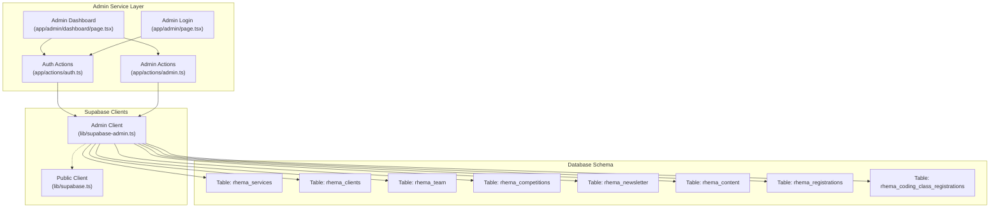
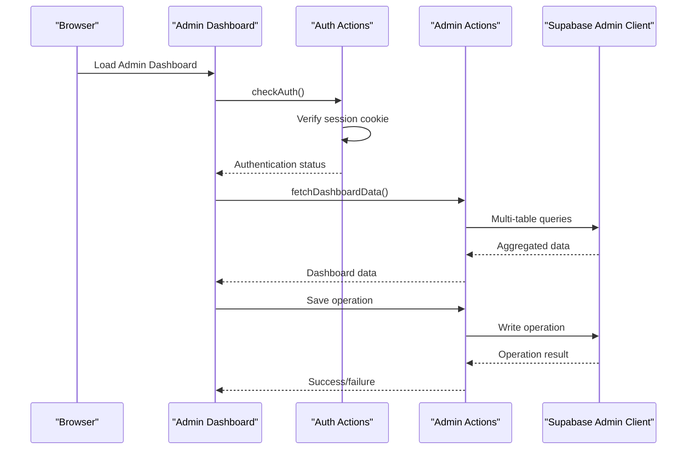
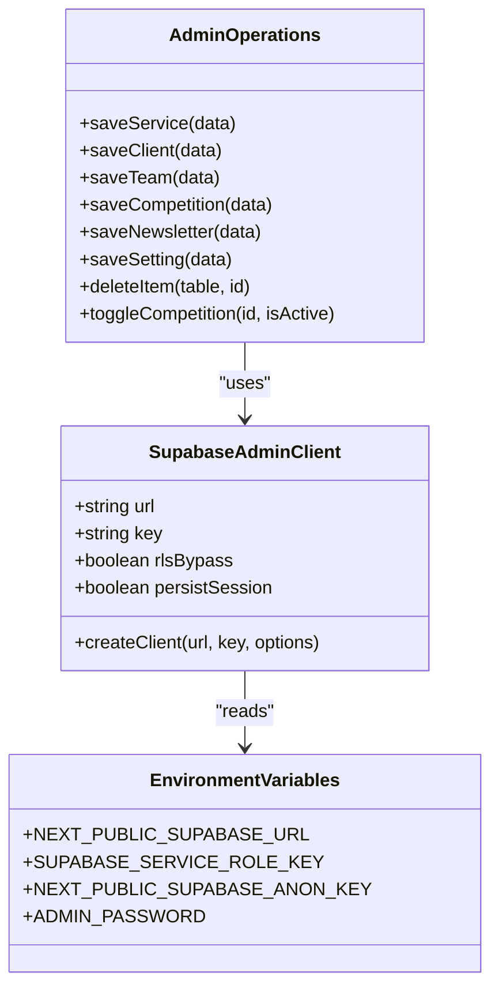
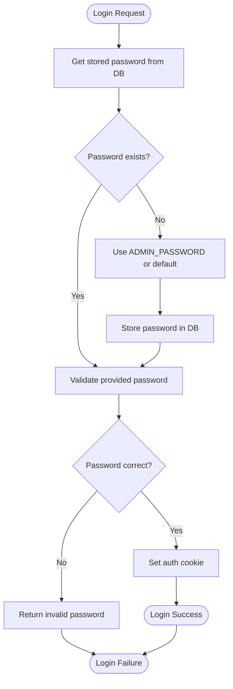
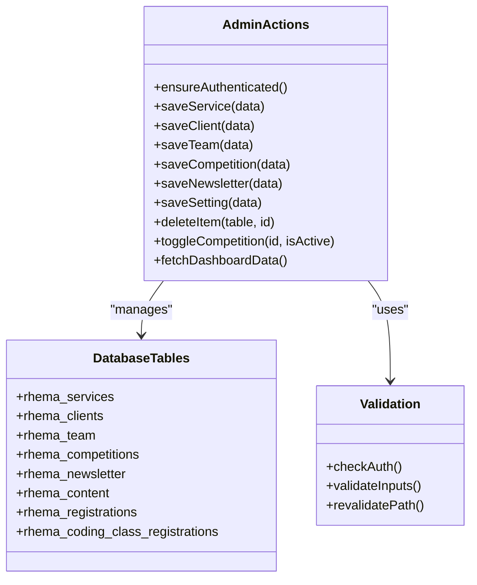
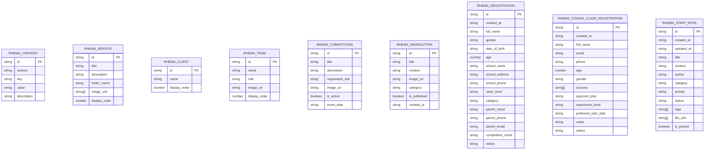
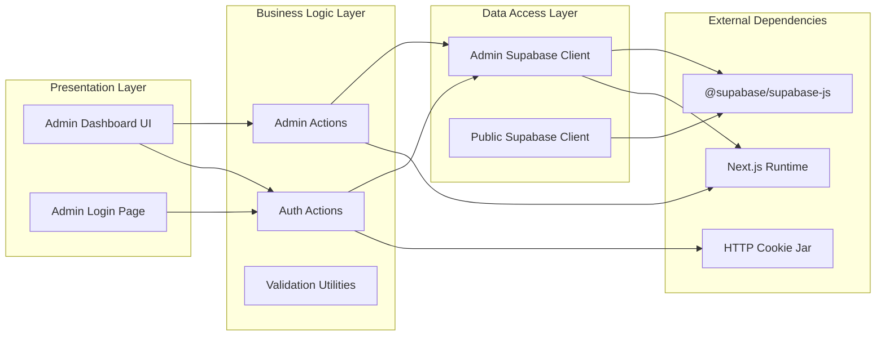
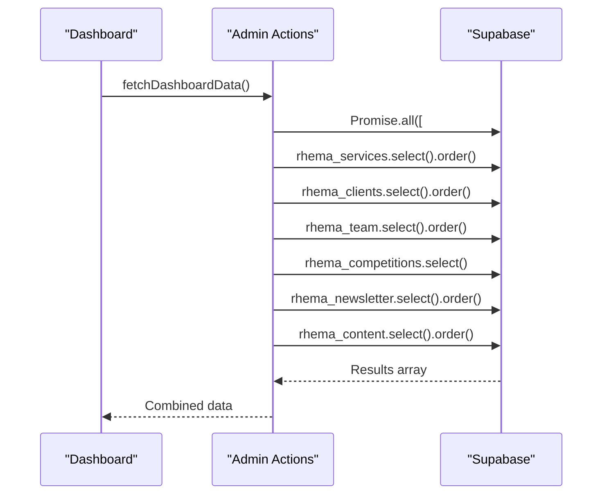
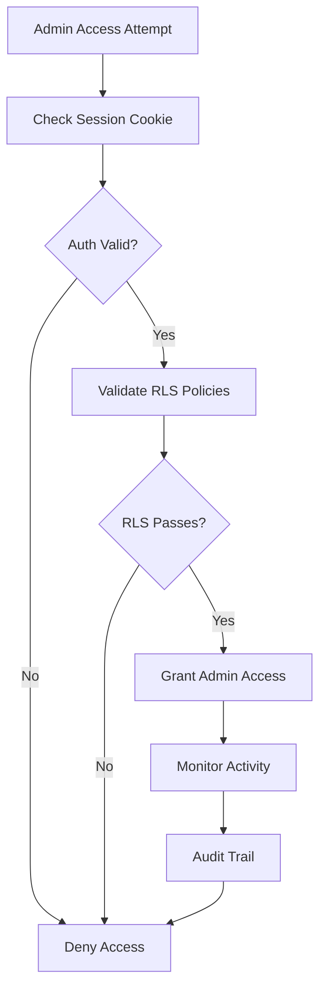

# Supabase Admin Service

<cite>
**Referenced Files in This Document**
- [supabase-admin.ts](file://lib/supabase-admin.ts)
- [supabase.ts](file://lib/supabase.ts)
- [admin.ts](file://app/actions/admin.ts)
- [auth.ts](file://app/actions/auth.ts)
- [page.tsx](file://app/admin/page.tsx)
- [dashboard/page.tsx](file://app/admin/dashboard/page.tsx)
- [supabase.ts](file://types/supabase.ts)
</cite>

## Table of Contents
1. [Introduction](#introduction)
2. [Project Structure](#project-structure)
3. [Core Components](#core-components)
4. [Architecture Overview](#architecture-overview)
5. [Detailed Component Analysis](#detailed-component-analysis)
6. [Dependency Analysis](#dependency-analysis)
7. [Performance Considerations](#performance-considerations)
8. [Security Considerations](#security-considerations)
9. [Administrative Operations](#administrative-operations)
10. [Troubleshooting Guide](#troubleshooting-guide)
11. [Conclusion](#conclusion)

## Introduction
This document provides comprehensive documentation for the Supabase admin service configuration and administrative database operations. It explains how the admin client is configured with elevated privileges, how authentication is handled, and how administrative tasks are executed. The documentation covers the service's role in managing user data, system settings, and content, along with security considerations, audit logging patterns, and access control mechanisms.

## Project Structure
The admin service is organized around three primary areas:
- Supabase client configuration for admin operations
- Authentication and session management for admin access
- Administrative action handlers for CRUD operations and system maintenance

**Diagram sources**
- [admin.ts:1-198](file://app/actions/admin.ts#L1-L198)
- [auth.ts:1-55](file://app/actions/auth.ts#L1-L55)
- [supabase-admin.ts:1-19](file://lib/supabase-admin.ts#L1-L19)
- [supabase.ts:1-25](file://lib/supabase.ts#L1-L25)

**Section sources**
- [supabase-admin.ts:1-19](file://lib/supabase-admin.ts#L1-L19)
- [supabase.ts:1-25](file://lib/supabase.ts#L1-L25)

## Core Components
The admin service consists of several core components that work together to provide secure administrative capabilities:

### Admin Supabase Client
The admin client is configured with a Service Role Key to bypass Row-Level Security (RLS) and enable full administrative access. It includes fallback logic to handle missing keys gracefully.

### Authentication System
The authentication system uses cookie-based sessions stored server-side, with password validation against database-stored credentials that can be managed through the admin interface.

### Administrative Actions
Administrative actions handle CRUD operations across multiple content types including services, clients, team members, competitions, newsletter posts, and system settings.

**Section sources**
- [supabase-admin.ts:1-19](file://lib/supabase-admin.ts#L1-L19)
- [auth.ts:1-55](file://app/actions/auth.ts#L1-L55)
- [admin.ts:1-198](file://app/actions/admin.ts#L1-L198)

## Architecture Overview
The admin service follows a layered architecture with clear separation between presentation, business logic, and data access:

**Diagram sources**
- [dashboard/page.tsx:67-126](file://app/admin/dashboard/page.tsx#L67-L126)
- [auth.ts:50-54](file://app/actions/auth.ts#L50-L54)
- [admin.ts:38-98](file://app/actions/admin.ts#L38-L98)

## Detailed Component Analysis

### Admin Supabase Client Configuration
The admin client is configured with elevated privileges through the Service Role Key, enabling bypass of RLS policies for administrative operations.

**Diagram sources**
- [supabase-admin.ts:3-18](file://lib/supabase-admin.ts#L3-L18)
- [admin.ts:21-198](file://app/actions/admin.ts#L21-L198)

The client configuration includes:
- Service Role Key for bypassing RLS
- Fallback to Anon Key for read-only operations
- Disabled session persistence for security
- Warning mechanism for missing Service Role Key

**Section sources**
- [supabase-admin.ts:1-19](file://lib/supabase-admin.ts#L1-L19)

### Authentication and Session Management
Authentication is handled through server actions with cookie-based session storage:

**Diagram sources**
- [auth.ts:7-43](file://app/actions/auth.ts#L7-L43)

Key security features:
- HttpOnly cookies prevent XSS attacks
- Secure flag enabled in production
- 7-day session timeout
- Server-side password validation
- Automatic password provisioning from environment

**Section sources**
- [auth.ts:1-55](file://app/actions/auth.ts#L1-L55)
- [page.tsx:1-52](file://app/admin/page.tsx#L1-L52)

### Administrative Operations Handler
The admin actions handler provides comprehensive CRUD operations across multiple content types:

**Diagram sources**
- [admin.ts:14-198](file://app/actions/admin.ts#L14-L198)

Operational patterns:
- Unified authentication enforcement
- Generic delete operation with table parameter
- Batch data fetching for dashboard
- Automatic Next.js cache revalidation
- Error handling with descriptive messages

**Section sources**
- [admin.ts:1-198](file://app/actions/admin.ts#L1-L198)

### Data Models and Types
The application defines TypeScript interfaces for all database entities:

**Diagram sources**
- [supabase.ts:5-113](file://types/supabase.ts#L5-L113)

**Section sources**
- [supabase.ts:1-113](file://types/supabase.ts#L1-L113)

## Dependency Analysis
The admin service has clear dependency relationships that ensure proper separation of concerns:

**Diagram sources**
- [dashboard/page.tsx:1-10](file://app/admin/dashboard/page.tsx#L1-L10)
- [admin.ts:1-5](file://app/actions/admin.ts#L1-L5)
- [auth.ts:1-5](file://app/actions/auth.ts#L1-L5)
- [supabase-admin.ts:1-2](file://lib/supabase-admin.ts#L1-L2)

Key dependency characteristics:
- Admin actions depend on admin client for database operations
- Authentication actions depend on admin client for credential validation
- UI components depend on server actions for data management
- No circular dependencies between layers
- Clear separation between admin and public clients

**Section sources**
- [dashboard/page.tsx:1-10](file://app/admin/dashboard/page.tsx#L1-L10)
- [admin.ts:1-5](file://app/actions/admin.ts#L1-L5)
- [auth.ts:1-5](file://app/actions/auth.ts#L1-L5)
- [supabase-admin.ts:1-2](file://lib/supabase-admin.ts#L1-L2)

## Performance Considerations
The admin service implements several performance optimizations:

### Concurrent Data Fetching
The dashboard uses concurrent promises to fetch data from multiple tables, reducing total response time:

**Diagram sources**
- [admin.ts:42-56](file://app/actions/admin.ts#L42-L56)

### Cache Management
Automatic cache revalidation ensures data consistency while maintaining performance:
- Individual table updates trigger targeted revalidation
- Bulk operations refresh the entire dashboard
- Next.js cache optimization reduces redundant requests

### Connection Management
- Single admin client instance per request lifecycle
- Disabled session persistence reduces overhead
- Graceful fallback to read-only operations when keys are missing

## Security Considerations

### Elevated Privileges and Risk Mitigation
The admin client operates with Service Role Key privileges, requiring strict access controls:

**Diagram sources**
- [auth.ts:50-54](file://app/actions/auth.ts#L50-L54)
- [supabase-admin.ts:3-9](file://lib/supabase-admin.ts#L3-L9)

### Authentication Security Features
- HttpOnly cookies prevent JavaScript access
- Secure flag enabled in production environments
- 7-day session timeout reduces exposure windows
- Server-side password validation prevents brute force
- Automatic credential provisioning from environment variables

### Authorization Patterns
- Centralized authentication enforcement in admin actions
- Session-based access control with cookie verification
- Immediate rejection of unauthorized requests
- Comprehensive error handling without information leakage

**Section sources**
- [auth.ts:31-43](file://app/actions/auth.ts#L31-L43)
- [supabase-admin.ts:7-9](file://lib/supabase-admin.ts#L7-L9)

## Administrative Operations

### CRUD Operations Implementation
The admin actions provide comprehensive CRUD functionality across multiple content types:

#### Service Management
- Create/update services with title and description
- Automatic display order management
- Image URL support for visual content

#### Client and Team Administration
- Client company management
- Team member profiles with roles
- Display ordering for presentation

#### Competition and Newsletter Management
- Competition listings with registration links
- Newsletter publishing workflow
- Status toggling for active/inactive content

#### System Settings
- Centralized configuration management
- Section/key/value pattern for organization
- Automatic provisioning of default settings

### Bulk Operations and Maintenance
The admin service supports efficient bulk operations:
- Concurrent data fetching for dashboard performance
- Generic delete operations with table parameter
- Batch updates for status changes
- Automatic cache invalidation for data consistency

**Section sources**
- [admin.ts:21-198](file://app/actions/admin.ts#L21-L198)

## Troubleshooting Guide

### Common Issues and Solutions

#### Missing Service Role Key
**Symptoms**: Admin write operations fail when RLS is enabled
**Solution**: Configure SUPABASE_SERVICE_ROLE_KEY environment variable
**Prevention**: Monitor warning logs during startup

#### Authentication Failures
**Symptoms**: Users cannot log into admin dashboard
**Diagnosis**: Check admin password storage and cookie configuration
**Resolution**: Verify rhema_content table has admin password entry

#### Database Connectivity Issues
**Symptoms**: Dashboard fails to load or shows connection errors
**Diagnosis**: Verify Supabase URL and key environment variables
**Resolution**: Check network connectivity and Supabase service status

#### Performance Degradation
**Symptoms**: Slow dashboard loading or API response times
**Diagnosis**: Monitor concurrent query patterns and cache effectiveness
**Optimization**: Review database indexing and query optimization

**Section sources**
- [supabase-admin.ts:7-9](file://lib/supabase-admin.ts#L7-L9)
- [auth.ts:18-29](file://app/actions/auth.ts#L18-L29)
- [admin.ts:94-97](file://app/actions/admin.ts#L94-L97)

## Conclusion
The Supabase admin service provides a robust foundation for administrative operations with strong security controls and efficient performance characteristics. The layered architecture ensures clear separation of concerns while the authentication system maintains strict access controls. The implementation demonstrates best practices for elevated privilege management, session security, and operational reliability. Regular monitoring of authentication logs, database performance, and security configurations will help maintain system integrity and optimal performance.