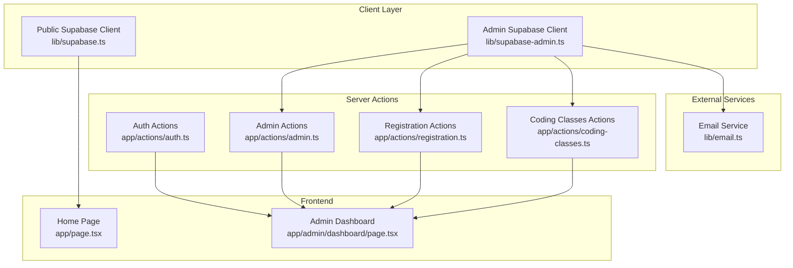
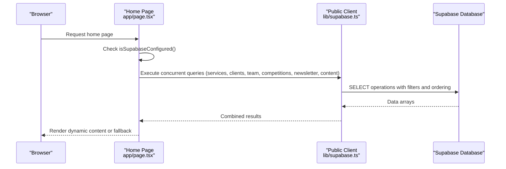
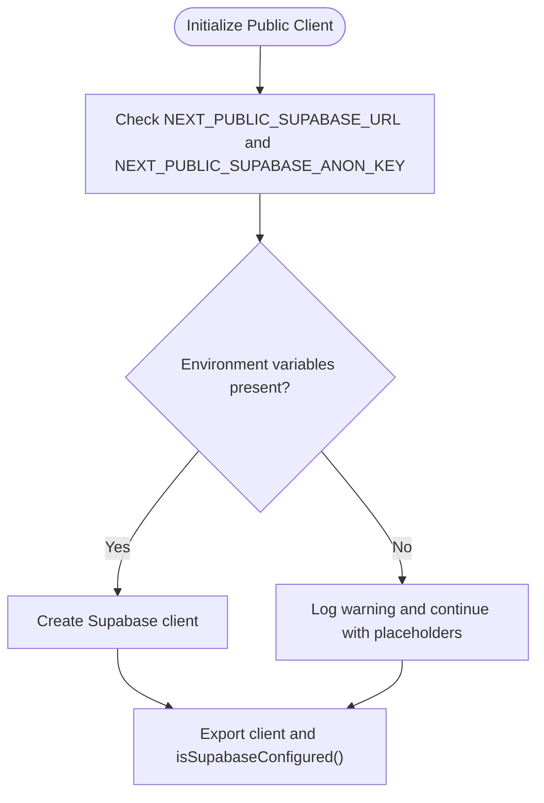
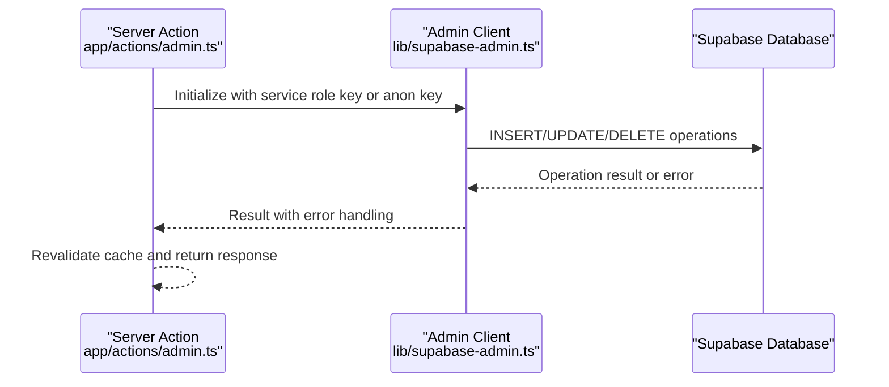
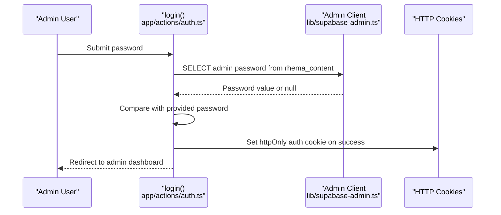
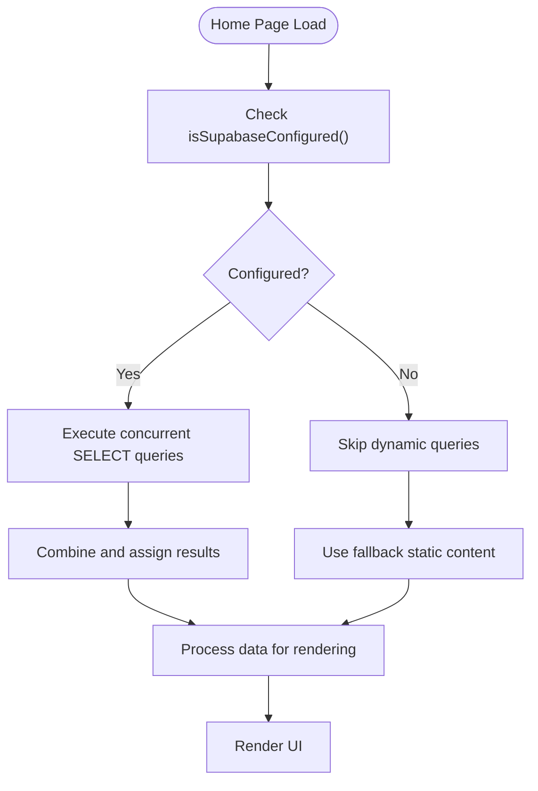
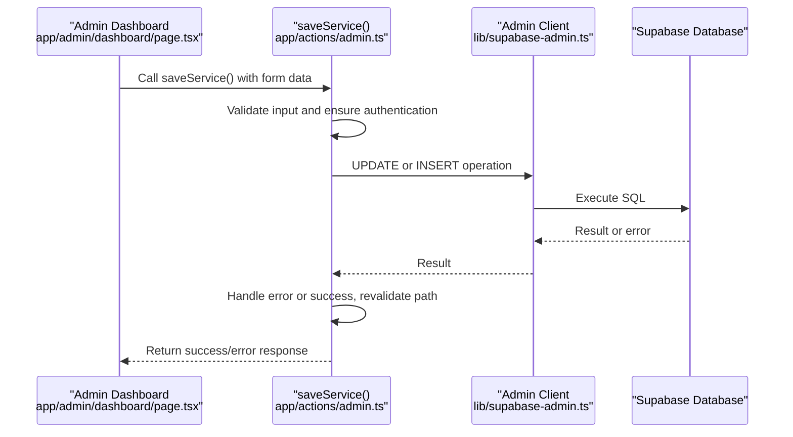
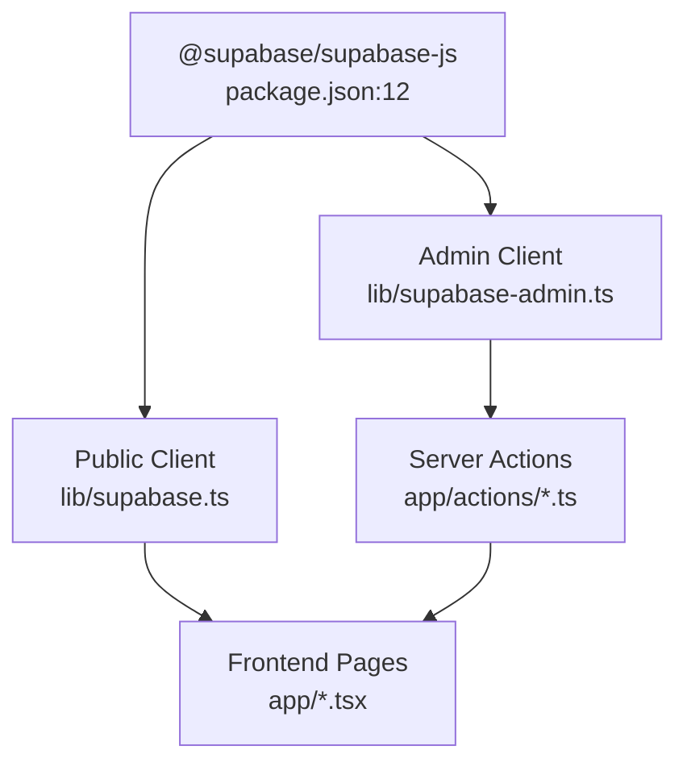

# Supabase Client Service

<cite>
**Referenced Files in This Document**
- [supabase.ts](file://lib/supabase.ts)
- [supabase-admin.ts](file://lib/supabase-admin.ts)
- [supabase.ts](file://types/supabase.ts)
- [auth.ts](file://app/actions/auth.ts)
- [admin.ts](file://app/actions/admin.ts)
- [coding-classes.ts](file://app/actions/coding-classes.ts)
- [registration.ts](file://app/actions/registration.ts)
- [page.tsx](file://app/page.tsx)
- [dashboard/page.tsx](file://app/admin/dashboard/page.tsx)
- [email.ts](file://lib/email.ts)
- [package.json](file://package.json)
</cite>

## Table of Contents
1. [Introduction](#introduction)
2. [Project Structure](#project-structure)
3. [Core Components](#core-components)
4. [Architecture Overview](#architecture-overview)
5. [Detailed Component Analysis](#detailed-component-analysis)
6. [Dependency Analysis](#dependency-analysis)
7. [Performance Considerations](#performance-considerations)
8. [Security Considerations](#security-considerations)
9. [Troubleshooting Guide](#troubleshooting-guide)
10. [Conclusion](#conclusion)

## Introduction
This document provides comprehensive documentation for the Supabase client service configuration and usage patterns within the Rhema Expert Solutions Next.js application. It covers standard database connection setup, authentication methods, client initialization, service roles, and error handling strategies. It also explains how the service handles user-facing database operations and data retrieval, details connection parameters and environment variable configuration, and outlines security considerations for client-side database access, Row-Level Security (RLS) policies, and data validation. Additionally, it documents performance optimization techniques, caching strategies, and monitoring approaches for database operations.

## Project Structure
The Supabase integration is organized around two primary client configurations:
- Public client for read-only operations and public-facing data retrieval
- Admin client for privileged operations requiring bypassing RLS

Key files:
- Client initialization and configuration: [supabase.ts](file://lib/supabase.ts), [supabase-admin.ts](file://lib/supabase-admin.ts)
- Type definitions for database tables: [supabase.ts](file://types/supabase.ts)
- Server actions orchestrating database operations: [auth.ts](file://app/actions/auth.ts), [admin.ts](file://app/actions/admin.ts), [coding-classes.ts](file://app/actions/coding-classes.ts), [registration.ts](file://app/actions/registration.ts)
- Frontend integration and data fetching: [page.tsx](file://app/page.tsx), [dashboard/page.tsx](file://app/admin/dashboard/page.tsx)
- Email notifications triggered by database operations: [email.ts](file://lib/email.ts)
- Dependencies: [package.json](file://package.json)

**Diagram sources**
- [supabase.ts:1-25](file://lib/supabase.ts#L1-L25)
- [supabase-admin.ts:1-19](file://lib/supabase-admin.ts#L1-L19)
- [auth.ts:1-55](file://app/actions/auth.ts#L1-L55)
- [admin.ts:1-198](file://app/actions/admin.ts#L1-L198)
- [coding-classes.ts:1-157](file://app/actions/coding-classes.ts#L1-L157)
- [registration.ts:1-131](file://app/actions/registration.ts#L1-L131)
- [page.tsx:1-788](file://app/page.tsx#L1-L788)
- [dashboard/page.tsx:1-800](file://app/admin/dashboard/page.tsx#L1-L800)
- [email.ts:1-134](file://lib/email.ts#L1-L134)

**Section sources**
- [supabase.ts:1-25](file://lib/supabase.ts#L1-L25)
- [supabase-admin.ts:1-19](file://lib/supabase-admin.ts#L1-L19)
- [package.json:11-18](file://package.json#L11-L18)

## Core Components
This section details the core Supabase components and their responsibilities.

- Public Supabase Client
  - Purpose: Enables read-only access for public-facing pages and components
  - Initialization: Creates a client using NEXT_PUBLIC_SUPABASE_URL and NEXT_PUBLIC_SUPABASE_ANON_KEY
  - Environment validation: Warns if environment variables are missing
  - Exported helpers: Provides isSupabaseConfigured() to guard data fetching
  - Usage: Home page performs concurrent reads across multiple tables

- Admin Supabase Client
  - Purpose: Enables privileged operations for administrative tasks
  - Initialization: Uses SUPABASE_SERVICE_ROLE_KEY when available; falls back to NEXT_PUBLIC_SUPABASE_ANON_KEY if service role key is missing
  - Session handling: Disables session persistence for server-side admin operations
  - Usage: Server actions perform inserts, updates, deletes, and bulk reads for admin dashboards

- Type Definitions
  - Purpose: Defines TypeScript interfaces for database tables used across the application
  - Coverage: Includes tables for services, clients, team members, competitions, newsletter, content settings, registrations, coding class registrations, and staff notes

**Section sources**
- [supabase.ts:7-24](file://lib/supabase.ts#L7-L24)
- [supabase-admin.ts:4-18](file://lib/supabase-admin.ts#L4-L18)
- [supabase.ts:5-113](file://types/supabase.ts#L5-L113)

## Architecture Overview
The application follows a layered architecture:
- Client Layer: Public and Admin Supabase clients
- Server Actions Layer: Encapsulates database operations with authentication and validation
- Frontend Layer: Pages and components that consume server actions and display data
- External Services: Email notifications triggered by administrative actions

**Diagram sources**
- [page.tsx:21-42](file://app/page.tsx#L21-L42)
- [supabase.ts:21-24](file://lib/supabase.ts#L21-L24)

**Section sources**
- [page.tsx:12-42](file://app/page.tsx#L12-L42)
- [supabase.ts:16-19](file://lib/supabase.ts#L16-L19)

## Detailed Component Analysis

### Public Client Configuration and Usage
The public client is designed for read-only operations and public data retrieval. It validates environment variables and provides a helper to check configuration status.

Key behaviors:
- Environment variable validation: Logs warnings if NEXT_PUBLIC_SUPABASE_URL or NEXT_PUBLIC_SUPABASE_ANON_KEY are missing
- Client creation: Initializes with URL and anonymous key, using placeholders if variables are absent
- Configuration helper: Returns true only if both URL and key are present and valid

Usage patterns:
- Home page performs concurrent SELECT operations across multiple tables
- Data is processed and rendered conditionally based on availability

**Diagram sources**
- [supabase.ts:10-13](file://lib/supabase.ts#L10-L13)
- [supabase.ts:16-19](file://lib/supabase.ts#L16-L19)
- [supabase.ts:21-24](file://lib/supabase.ts#L21-L24)

**Section sources**
- [supabase.ts:7-24](file://lib/supabase.ts#L7-L24)
- [page.tsx:21-42](file://app/page.tsx#L21-L42)

### Admin Client Configuration and Usage
The admin client enables privileged operations and bypasses RLS when using the service role key. It disables session persistence for server-side operations.

Key behaviors:
- Service role key preference: Uses SUPABASE_SERVICE_ROLE_KEY when available
- Fallback mechanism: Falls back to NEXT_PUBLIC_SUPABASE_ANON_KEY if service role key is missing
- Session handling: Sets persistSession to false for server-side admin operations
- Error handling: Logs warnings when service role key is missing

Usage patterns:
- Server actions perform CRUD operations on administrative tables
- Bulk reads combine multiple table queries using Promise.all
- Authentication middleware ensures only authorized users can access admin features

**Diagram sources**
- [supabase-admin.ts:14-18](file://lib/supabase-admin.ts#L14-L18)
- [admin.ts:38-98](file://app/actions/admin.ts#L38-L98)

**Section sources**
- [supabase-admin.ts:4-18](file://lib/supabase-admin.ts#L4-L18)
- [admin.ts:14-19](file://app/actions/admin.ts#L14-L19)

### Authentication and Authorization
The application implements server-side authentication for admin access using cookies and server actions.

Key components:
- Login action: Retrieves admin password from database or environment, sets a secure httpOnly cookie upon successful authentication
- Logout action: Deletes the authentication cookie and redirects to the admin landing page
- Auth check: Verifies the presence of the authentication cookie to authorize admin operations

**Diagram sources**
- [auth.ts:7-43](file://app/actions/auth.ts#L7-L43)
- [supabase-admin.ts:14-18](file://lib/supabase-admin.ts#L14-L18)

**Section sources**
- [auth.ts:7-54](file://app/actions/auth.ts#L7-L54)

### Data Retrieval and Transformations
The application performs concurrent data retrieval and applies transformations for rendering.

Key patterns:
- Concurrent queries: Home page executes multiple SELECT operations in parallel using Promise.all
- Data filtering and ordering: Queries apply filters (e.g., is_active, is_published) and ordering (e.g., display_order, created_at)
- Conditional rendering: Uses isSupabaseConfigured() to decide between dynamic content and fallback static content
- Data transformations: Processes raw database results into UI-friendly structures

**Diagram sources**
- [page.tsx:21-42](file://app/page.tsx#L21-L42)
- [supabase.ts:21-24](file://lib/supabase.ts#L21-L24)

**Section sources**
- [page.tsx:21-42](file://app/page.tsx#L21-L42)

### Server Actions for Database Operations
Server actions encapsulate database operations with validation, authentication, and error handling.

Key actions:
- Admin dashboard data: fetchDashboardData() performs bulk reads across multiple tables and ensures admin password exists in settings
- CRUD operations: saveService(), saveClient(), saveTeam(), saveCompetition(), saveNewsletter(), saveSetting(), deleteItem(), toggleCompetition()
- Registration management: submitRegistration(), fetchRegistrations(), updateCompetitionRegistration(), deleteCompetitionRegistration()
- Coding class registration: submitCodingClassRegistration(), fetchCodingClassRegistrations(), updateCodingClassStatus(), updateCodingClassRegistration(), deleteCodingClassRegistration()

Error handling patterns:
- Validation: Checks required fields and returns structured errors
- Database errors: Propagates error messages from Supabase operations
- Unexpected errors: Catches unknown errors and returns user-friendly messages
- Side effects: Sends email notifications on successful registrations

**Diagram sources**
- [admin.ts:21-36](file://app/actions/admin.ts#L21-L36)
- [supabase-admin.ts:14-18](file://lib/supabase-admin.ts#L14-L18)

**Section sources**
- [admin.ts:21-98](file://app/actions/admin.ts#L21-L98)
- [registration.ts:22-84](file://app/actions/registration.ts#L22-L84)
- [coding-classes.ts:20-76](file://app/actions/coding-classes.ts#L20-L76)

### Email Notifications Integration
Email notifications are triggered by database operations to inform administrators about new registrations.

Key components:
- Email transport: Nodemailer configured with SMTP credentials
- Notification triggers: sendCompetitionRegistrationEmail() and sendCodingClassRegistrationEmail()
- Error handling: Logs warnings when SMTP credentials are missing and handles send failures gracefully

**Section sources**
- [email.ts:3-44](file://lib/email.ts#L3-L44)
- [registration.ts:72-77](file://app/actions/registration.ts#L72-L77)
- [coding-classes.ts:64-69](file://app/actions/coding-classes.ts#L64-L69)

## Dependency Analysis
The Supabase integration relies on the @supabase/supabase-js library and supports server-side email notifications via nodemailer.

**Diagram sources**
- [package.json:11-18](file://package.json#L11-L18)
- [supabase.ts](file://lib/supabase.ts#L1)
- [supabase-admin.ts](file://lib/supabase-admin.ts#L1)

**Section sources**
- [package.json:11-18](file://package.json#L11-L18)

## Performance Considerations
- Concurrent data fetching: The home page uses Promise.all to execute multiple SELECT queries concurrently, reducing total latency
- Minimal client-side logic: Database operations are performed server-side via server actions, minimizing client-side computation
- Conditional rendering: Uses isSupabaseConfigured() to avoid unnecessary network requests when environment variables are missing
- Cache invalidation: Server actions call revalidatePath after mutations to keep cached data fresh
- Bulk operations: Admin dashboard fetches multiple tables in parallel to reduce round trips

## Security Considerations
- Client-side vs server-side access:
  - Public client operates with read-only access and is intended for client-side consumption
  - Admin client uses a service role key when available to bypass RLS for privileged operations
- Environment variable protection:
  - NEXT_PUBLIC_SUPABASE_URL and NEXT_PUBLIC_SUPABASE_ANON_KEY are exposed to the client
  - SUPABASE_SERVICE_ROLE_KEY is kept server-side and should remain secret
- Row-Level Security (RLS):
  - Public client operations are governed by RLS policies
  - Admin client bypasses RLS using the service role key for administrative tasks
- Authentication:
  - Admin access is protected by a server-side cookie with httpOnly flag
  - Authenticated routes enforce session validation before allowing admin operations
- Data validation:
  - Server actions validate required fields and return structured error messages
  - Email notifications are guarded by SMTP credential checks

## Troubleshooting Guide
Common issues and resolutions:

- Missing environment variables:
  - Symptom: Warning logs about missing Supabase environment variables; dynamic content not loading
  - Resolution: Ensure NEXT_PUBLIC_SUPABASE_URL and NEXT_PUBLIC_SUPABASE_ANON_KEY are set in the environment
  - Related code: [supabase.ts:10-13](file://lib/supabase.ts#L10-L13)

- Service role key missing:
  - Symptom: Admin write operations may fail if RLS is enabled
  - Resolution: Set SUPABASE_SERVICE_ROLE_KEY in the server environment
  - Related code: [supabase-admin.ts:7-9](file://lib/supabase-admin.ts#L7-L9)

- Authentication failures:
  - Symptom: Admin pages redirect to login or unauthorized errors
  - Resolution: Verify admin password exists in rhema_content and that the auth cookie is properly set
  - Related code: [auth.ts:31-43](file://app/actions/auth.ts#L31-L43), [admin.ts:14-19](file://app/actions/admin.ts#L14-L19)

- Database operation errors:
  - Symptom: Server actions return error messages from Supabase
  - Resolution: Check table permissions, RLS policies, and input validation
  - Related code: [admin.ts:33-35](file://app/actions/admin.ts#L33-L35), [registration.ts:67-70](file://app/actions/registration.ts#L67-L70)

- Email notification failures:
  - Symptom: Email logs indicate missing SMTP credentials or send failures
  - Resolution: Configure SMTP_USER and SMTP_PASS environment variables
  - Related code: [email.ts:24-27](file://lib/email.ts#L24-L27), [email.ts:40-43](file://lib/email.ts#L40-L43)

**Section sources**
- [supabase.ts:10-13](file://lib/supabase.ts#L10-L13)
- [supabase-admin.ts:7-9](file://lib/supabase-admin.ts#L7-L9)
- [auth.ts:31-43](file://app/actions/auth.ts#L31-L43)
- [admin.ts:14-19](file://app/actions/admin.ts#L14-L19)
- [registration.ts:67-70](file://app/actions/registration.ts#L67-L70)
- [email.ts:24-27](file://lib/email.ts#L24-L27)

## Conclusion
The Supabase client service configuration in this application provides a robust foundation for both public and administrative data access. The public client enables safe, read-only operations for frontend rendering, while the admin client leverages a service role key to perform privileged operations securely. Server actions encapsulate database logic with validation, authentication, and error handling, ensuring reliable data management. The architecture emphasizes performance through concurrent queries, minimal client-side logic, and cache invalidation. Security is addressed through environment variable protection, RLS policies, and authenticated admin access. By following the documented patterns and troubleshooting steps, developers can maintain and extend the Supabase integration effectively.