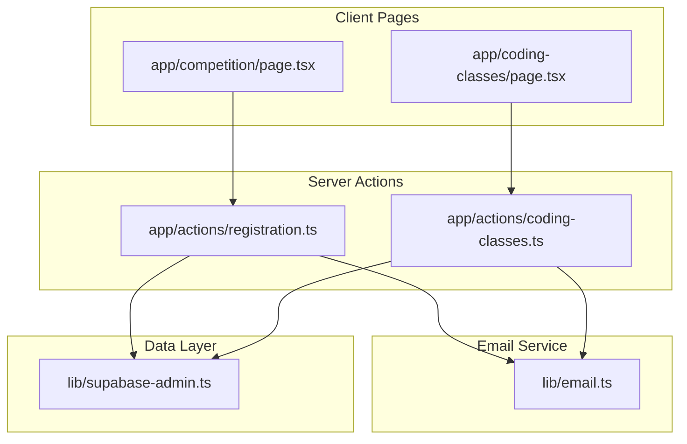
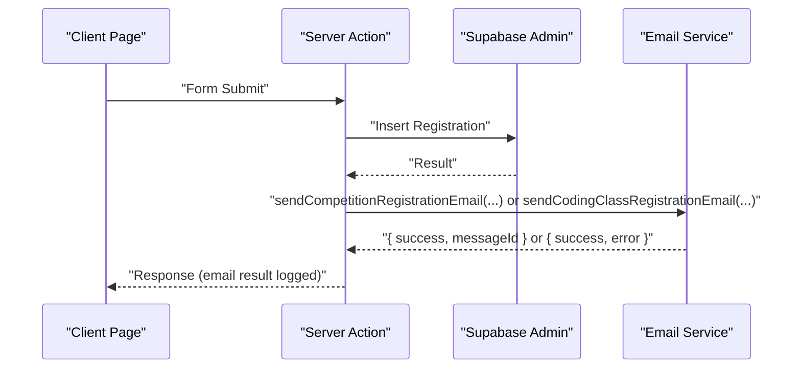
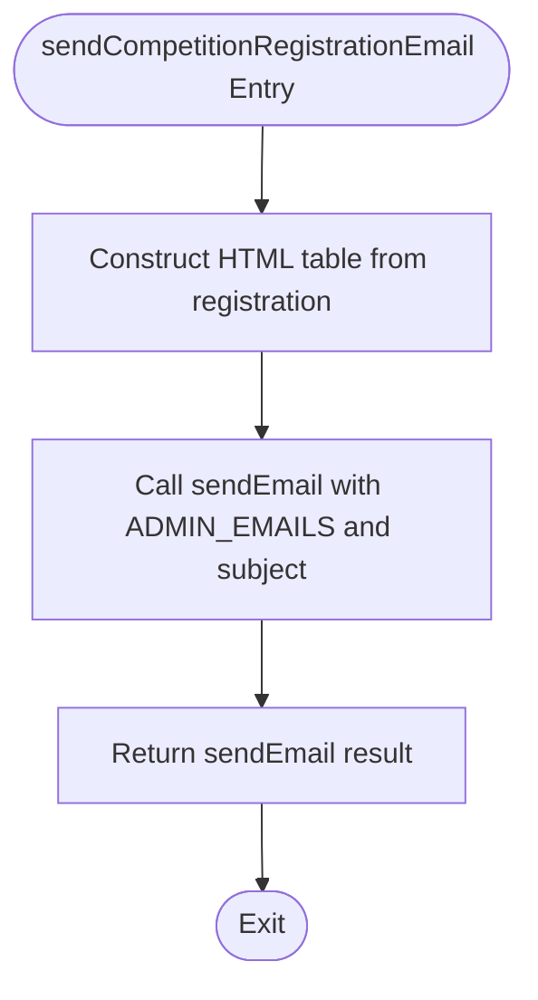
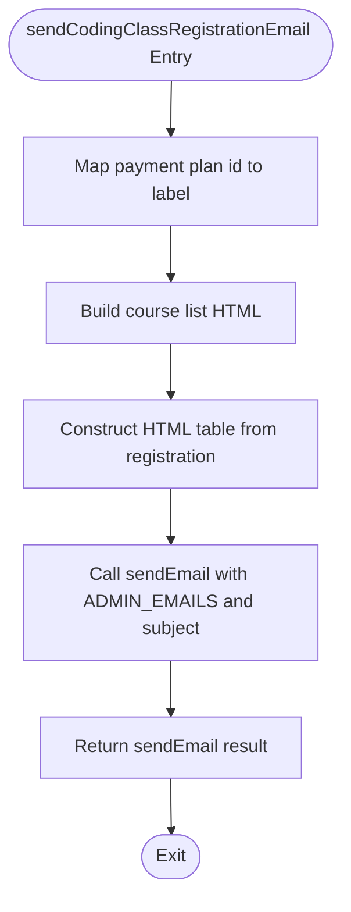
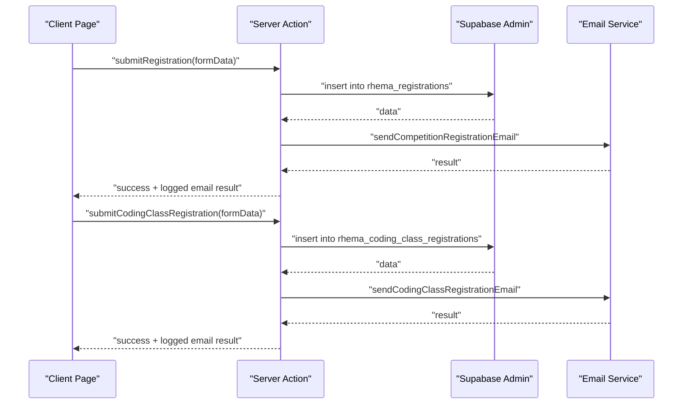
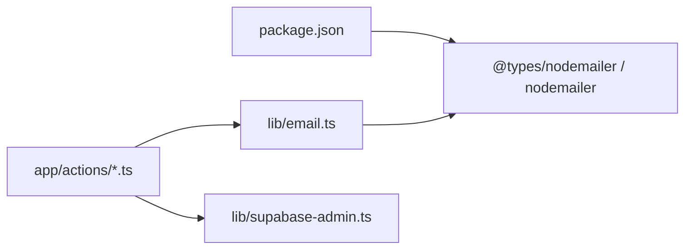

# Email Service

<cite>
**Referenced Files in This Document**
- [email.ts](file://lib/email.ts)
- [registration.ts](file://app/actions/registration.ts)
- [coding-classes.ts](file://app/actions/coding-classes.ts)
- [page.tsx (Competition)](file://app/competition/page.tsx)
- [page.tsx (Coding Classes)](file://app/coding-classes/page.tsx)
- [supabase-admin.ts](file://lib/supabase-admin.ts)
- [package.json](file://package.json)
</cite>

## Table of Contents
1. [Introduction](#introduction)
2. [Project Structure](#project-structure)
3. [Core Components](#core-components)
4. [Architecture Overview](#architecture-overview)
5. [Detailed Component Analysis](#detailed-component-analysis)
6. [Dependency Analysis](#dependency-analysis)
7. [Performance Considerations](#performance-considerations)
8. [Troubleshooting Guide](#troubleshooting-guide)
9. [Conclusion](#conclusion)
10. [Appendices](#appendices)

## Introduction
This document describes the email service implementation used by Rhema Expert Solutions. It covers the Nodemailer integration, SMTP configuration, transport setup, and the email sending pipeline. It also documents the generic sendEmail function and specialized registration email handlers for competition and coding classes, including the HTML template structure, recipient management, error handling, logging, and fallback behaviors. Guidance is included for adding new email templates, customizing content, and extending the service for additional notification types. Security considerations, rate limiting, and delivery monitoring are addressed.

## Project Structure
The email service is implemented as a reusable library module and consumed by server action modules that handle form submissions. The relevant parts of the project structure are:
- lib/email.ts: Nodemailer transport setup and email functions
- app/actions/registration.ts: Competition registration server action invoking email notifications
- app/actions/coding-classes.ts: Coding class registration server action invoking email notifications
- app/competition/page.tsx and app/coding-classes/page.tsx: Client components that trigger server actions
- lib/supabase-admin.ts: Supabase admin client used alongside email notifications
- package.json: Dependencies including nodemailer

**Diagram sources**
- [email.ts:1-134](file://lib/email.ts#L1-L134)
- [registration.ts:1-131](file://app/actions/registration.ts#L1-L131)
- [coding-classes.ts:1-157](file://app/actions/coding-classes.ts#L1-L157)
- [page.tsx (Competition):1-316](file://app/competition/page.tsx#L1-L316)
- [page.tsx (Coding Classes):1-390](file://app/coding-classes/page.tsx#L1-L390)
- [supabase-admin.ts:1-19](file://lib/supabase-admin.ts#L1-L19)

**Section sources**
- [email.ts:1-134](file://lib/email.ts#L1-L134)
- [registration.ts:1-131](file://app/actions/registration.ts#L1-L131)
- [coding-classes.ts:1-157](file://app/actions/coding-classes.ts#L1-L157)
- [page.tsx (Competition):1-316](file://app/competition/page.tsx#L1-L316)
- [page.tsx (Coding Classes):1-390](file://app/coding-classes/page.tsx#L1-L390)
- [supabase-admin.ts:1-19](file://lib/supabase-admin.ts#L1-L19)
- [package.json:11-14](file://package.json#L11-L14)

## Core Components
- Nodemailer Transport Setup
  - SMTP_USER and SMTP_PASS are loaded from environment variables.
  - Transport is configured for a mail service provider with basic authentication.
  - ADMIN_EMAILS defines the recipients for administrative notifications.

- Generic Email Function
  - sendEmail accepts recipients, subject, HTML body, and optional text body.
  - Validates presence of SMTP credentials; returns failure with warning if missing.
  - Sends via Nodemailer and logs success with messageId or error details.

- Specialized Registration Handlers
  - sendCompetitionRegistrationEmail builds an HTML table with registration details and sends to ADMIN_EMAILS.
  - sendCodingClassRegistrationEmail builds a course list and payment plan mapping, then sends to ADMIN_EMAILS.

- Server Action Integration
  - Registration actions insert data into Supabase and then call the appropriate email handler.
  - Results from email sending are logged as warnings without failing the registration flow.

**Section sources**
- [email.ts:3-44](file://lib/email.ts#L3-L44)
- [email.ts:46-86](file://lib/email.ts#L46-L86)
- [email.ts:88-133](file://lib/email.ts#L88-L133)
- [registration.ts:22-84](file://app/actions/registration.ts#L22-L84)
- [coding-classes.ts:20-76](file://app/actions/coding-classes.ts#L20-L76)

## Architecture Overview
The email service is invoked from server actions after data persistence. The flow ensures that failures in email sending do not block the primary operation (data insertion).

**Diagram sources**
- [registration.ts:45-76](file://app/actions/registration.ts#L45-L76)
- [coding-classes.ts:40-68](file://app/actions/coding-classes.ts#L40-L68)
- [email.ts:23-44](file://lib/email.ts#L23-L44)

## Detailed Component Analysis

### Nodemailer Transport and Generic Email Function
- Transport initialization uses environment variables for authentication.
- sendEmail validates credentials and returns early with a warning if missing.
- On success, it logs the messageId; on error, it logs the error and returns a failure result.

**Diagram sources**
- [email.ts:23-44](file://lib/email.ts#L23-L44)

**Section sources**
- [email.ts:3-12](file://lib/email.ts#L3-L12)
- [email.ts:23-44](file://lib/email.ts#L23-L44)

### Competition Registration Email Handler
- Accepts a typed registration object and constructs an HTML table with student, school, and parent/guardian details.
- Uses ADMIN_EMAILS as recipients and sets a subject indicating the student’s name.
- Returns the result of sendEmail for logging in the server action.

**Diagram sources**
- [email.ts:46-86](file://lib/email.ts#L46-L86)

**Section sources**
- [email.ts:46-86](file://lib/email.ts#L46-L86)

### Coding Class Registration Email Handler
- Accepts a typed registration object and constructs an HTML table including course selections and payment plan mapping.
- Uses ADMIN_EMAILS as recipients and sets a subject indicating the student’s name.
- Returns the result of sendEmail for logging in the server action.

**Diagram sources**
- [email.ts:88-133](file://lib/email.ts#L88-L133)

**Section sources**
- [email.ts:88-133](file://lib/email.ts#L88-L133)

### Server Actions and Client Integration
- Competition registration server action inserts data into the competition registrations table and then invokes the competition email handler.
- Coding class registration server action inserts data into the coding class registrations table and then invokes the coding class email handler.
- Both actions log email errors as warnings and still return success for the primary operation.

**Diagram sources**
- [registration.ts:45-76](file://app/actions/registration.ts#L45-L76)
- [coding-classes.ts:40-68](file://app/actions/coding-classes.ts#L40-L68)
- [email.ts:46-86](file://lib/email.ts#L46-L86)
- [email.ts:88-133](file://lib/email.ts#L88-L133)

**Section sources**
- [registration.ts:22-84](file://app/actions/registration.ts#L22-L84)
- [coding-classes.ts:20-76](file://app/actions/coding-classes.ts#L20-L76)
- [page.tsx (Competition):32-64](file://app/competition/page.tsx#L32-L64)
- [page.tsx (Coding Classes):56-86](file://app/coding-classes/page.tsx#L56-L86)

## Dependency Analysis
- Nodemailer is a runtime dependency used for SMTP transport and sending emails.
- Supabase admin client is used for database operations in server actions; it is separate from email but part of the same workflow.

**Diagram sources**
- [package.json:11-14](file://package.json#L11-L14)
- [email.ts:1](file://lib/email.ts#L1)
- [registration.ts:3-4](file://app/actions/registration.ts#L3-L4)
- [coding-classes.ts:3-5](file://app/actions/coding-classes.ts#L3-L5)
- [supabase-admin.ts:1](file://lib/supabase-admin.ts#L1)

**Section sources**
- [package.json:11-14](file://package.json#L11-L14)
- [email.ts:1](file://lib/email.ts#L1)
- [registration.ts:3-4](file://app/actions/registration.ts#L3-L4)
- [coding-classes.ts:3-5](file://app/actions/coding-classes.ts#L3-L5)
- [supabase-admin.ts:1](file://lib/supabase-admin.ts#L1)

## Performance Considerations
- Asynchronous email sending: The email functions are async and use promises, avoiding blocking the main thread.
- Minimal overhead: Email sending occurs after data persistence, ensuring the primary operation completes first.
- Logging: Console logs provide visibility into success and error outcomes without impacting performance significantly.
- Recommendations:
  - Introduce retry logic with exponential backoff for transient failures.
  - Add circuit breaker behavior to temporarily halt email sending during sustained failures.
  - Consider queuing emails for batch processing if volume increases.

## Troubleshooting Guide
Common issues and resolutions:
- Missing SMTP credentials
  - Symptom: Warning logged and email result indicates configuration missing.
  - Resolution: Set SMTP_USER and SMTP_PASS environment variables and redeploy.
  - Reference: [email.ts:24-26](file://lib/email.ts#L24-L26)

- Email sending failure
  - Symptom: Error logged and email result includes error message.
  - Resolution: Verify network connectivity, credentials, and provider limits; check provider logs.
  - Reference: [email.ts:40-43](file://lib/email.ts#L40-L43)

- Server action continues despite email failure
  - Behavior: Email failures are logged as warnings; registration remains successful.
  - Reference: [registration.ts:72-76](file://app/actions/registration.ts#L72-L76), [coding-classes.ts:64-68](file://app/actions/coding-classes.ts#L64-L68)

- Recipient management
  - ADMIN_EMAILS is centralized; modify to add or remove recipients.
  - Reference: [email.ts:14](file://lib/email.ts#L14)

**Section sources**
- [email.ts:24-26](file://lib/email.ts#L24-L26)
- [email.ts:40-43](file://lib/email.ts#L40-L43)
- [registration.ts:72-76](file://app/actions/registration.ts#L72-L76)
- [coding-classes.ts:64-68](file://app/actions/coding-classes.ts#L64-L68)
- [email.ts:14](file://lib/email.ts#L14)

## Conclusion
The email service is a focused, modular component built on Nodemailer with clear separation of concerns. It provides a generic sendEmail function and specialized handlers for registration notifications, integrates cleanly with server actions, and gracefully handles missing or failing configurations. The current design prioritizes robustness by not blocking primary operations on email failures while maintaining clear logs for observability.

## Appendices

### Configuration Requirements
- Environment Variables
  - SMTP_USER: Sender email address used for authentication.
  - SMTP_PASS: Sender password or app-specific password.
  - Reference: [email.ts:3-12](file://lib/email.ts#L3-L12)

- Administrative Recipients
  - ADMIN_EMAILS: Array of recipient addresses for registration notifications.
  - Reference: [email.ts:14](file://lib/email.ts#L14)

### Extending the Service
- Adding a New Email Template
  - Steps:
    1. Define a new handler function similar to existing ones, accepting a typed payload and returning sendEmail.
    2. Construct HTML content tailored to the new notification type.
    3. Invoke the handler from the relevant server action after data persistence.
  - References:
    - [email.ts:46-86](file://lib/email.ts#L46-L86)
    - [email.ts:88-133](file://lib/email.ts#L88-L133)

- Customizing Content
  - Modify HTML strings within handlers to adjust styles, sections, or data inclusion.
  - Keep HTML self-contained within the handler for portability.
  - Reference: [email.ts:61-79](file://lib/email.ts#L61-L79), [email.ts:108-126](file://lib/email.ts#L108-L126)

- Integrating with Additional Notification Types
  - Follow the pattern: server action persists data → call email handler → log result.
  - Reference: [registration.ts:72-76](file://app/actions/registration.ts#L72-L76), [coding-classes.ts:64-68](file://app/actions/coding-classes.ts#L64-L68)

### Security Considerations
- Credentials
  - Store SMTP_USER and SMTP_PASS in environment variables; avoid committing secrets to source control.
  - Reference: [email.ts:3-12](file://lib/email.ts#L3-L12)

- Rate Limiting
  - Implement provider-side rate limits and consider application-level throttling to prevent bursts.
  - Reference: [email.ts:29-43](file://lib/email.ts#L29-L43)

- Monitoring Delivery Status
  - Use returned messageId for correlation with provider logs.
  - Reference: [email.ts:38](file://lib/email.ts#L38)