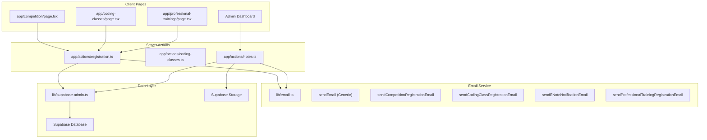
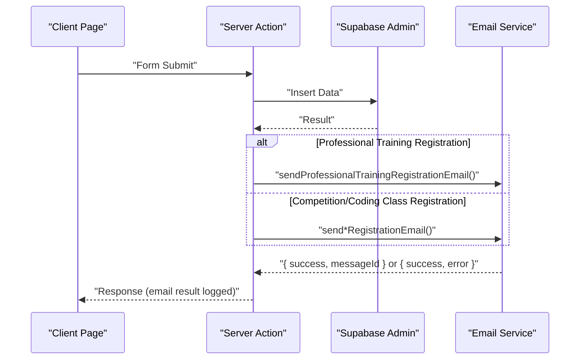
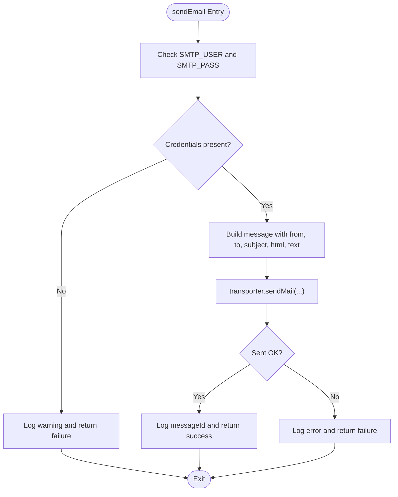
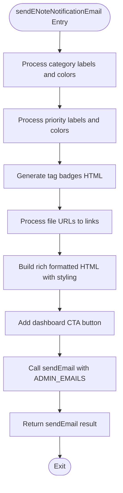
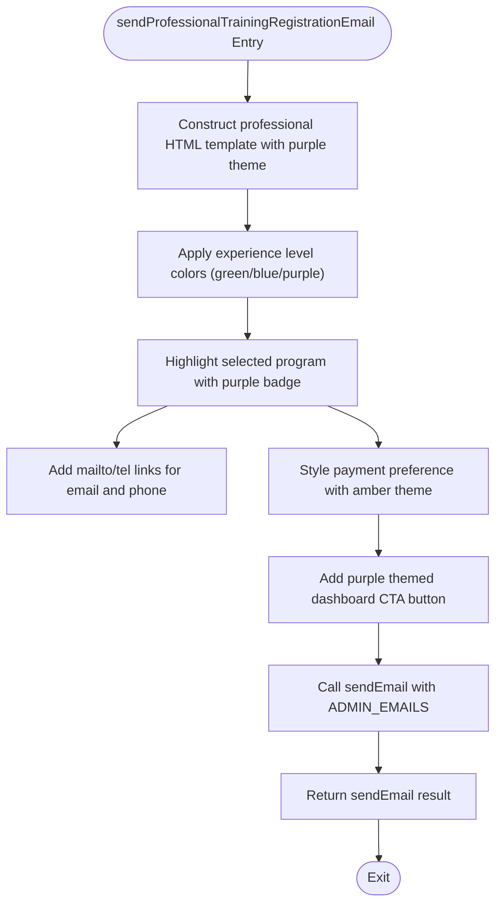
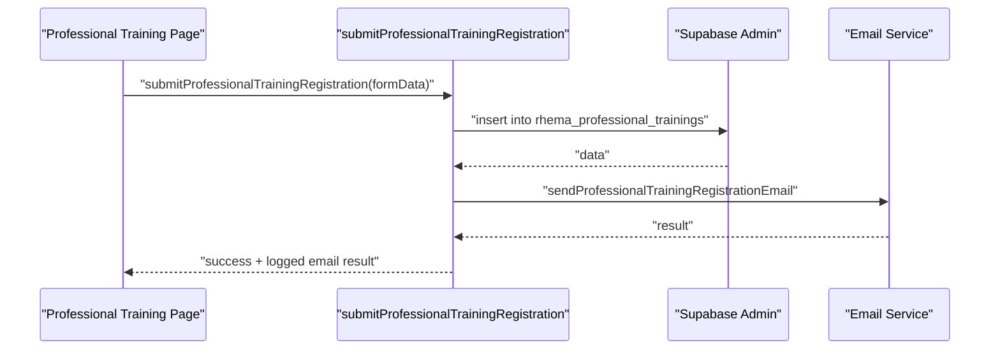
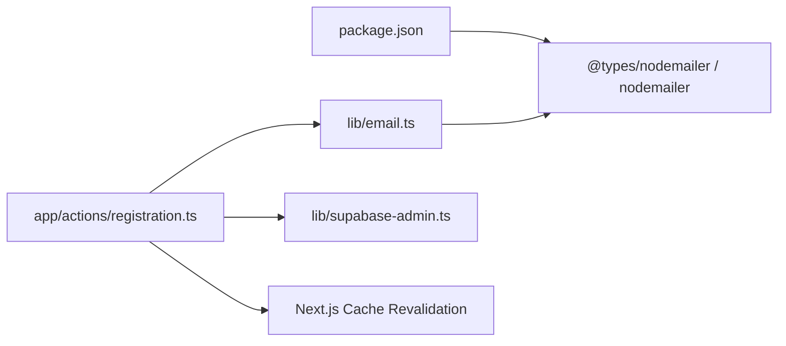

# Email Service

<cite>
**Referenced Files in This Document**
- [email.ts](file://lib/email.ts)
- [registration.ts](file://app/actions/registration.ts)
- [page.tsx (Professional Trainings)](file://app/professional-trainings/page.tsx)
- [supabase_migration_professional_trainings.sql](file://supabase_migration_professional_trainings.sql)
- [package.json](file://package.json)
</cite>

## Update Summary
**Changes Made**
- Updated Professional Training Registration Email Handler section with detailed purple-themed HTML formatting specifications
- Enhanced architecture diagrams to include professional training registration workflow
- Added comprehensive coverage of the new `sendProfessionalTrainingRegistrationEmail()` function implementation
- Updated troubleshooting guide with professional training specific scenarios
- Expanded appendices with examples for extending the email service with additional notification types

## Table of Contents
1. [Introduction](#introduction)
2. [Project Structure](#project-structure)
3. [Core Components](#core-components)
4. [Architecture Overview](#architecture-overview)
5. [Detailed Component Analysis](#detailed-component-analysis)
6. [Dependency Analysis](#dependency-analysis)
7. [Performance Considerations](#performance-considerations)
8. [Troubleshooting Guide](#troubleshooting-guide)
9. [Conclusion](#conclusion)
10. [Appendices](#appendices)

## Introduction
This document describes the comprehensive email service implementation used by Rhema Expert Solutions. It covers the Nodemailer integration, SMTP configuration, transport setup, and the complete email sending pipeline. The service provides multiple specialized email handlers including generic email functionality, competition registration notifications, coding class registration alerts, staff e-note notifications with rich formatting, and professional training registration emails with purple-themed styling. Each handler features sophisticated HTML templating, recipient management, error handling, logging mechanisms, and graceful fallback behaviors when email services are unavailable.

## Project Structure
The email service is implemented as a reusable library module consumed by various server action modules that handle different types of form submissions and administrative operations. The relevant parts of the project structure are:
- lib/email.ts: Nodemailer transport setup and all email functions including the new professional training registration system
- app/actions/registration.ts: Competition and professional training registration server actions invoking email notifications
- app/professional-trainings/page.tsx: Client component for professional training registration form
- supabase_migration_professional_trainings.sql: Database schema for professional training registrations
- package.json: Dependencies including nodemailer

**Diagram sources**
- [email.ts:1-237](file://lib/email.ts#L1-L237)
- [registration.ts:1-253](file://app/actions/registration.ts#L1-L253)
- [page.tsx (Professional Trainings):1-400](file://app/professional-trainings/page.tsx#L1-L400)
- [supabase_migration_professional_trainings.sql:1-33](file://supabase_migration_professional_trainings.sql#L1-L33)
- [package.json:11-14](file://package.json#L11-L14)

**Section sources**
- [email.ts:1-237](file://lib/email.ts#L1-L237)
- [registration.ts:1-253](file://app/actions/registration.ts#L1-L253)
- [page.tsx (Professional Trainings):1-400](file://app/professional-trainings/page.tsx#L1-L400)
- [supabase_migration_professional_trainings.sql:1-33](file://supabase_migration_professional_trainings.sql#L1-L33)
- [package.json:11-14](file://package.json#L11-L14)

## Core Components
- **Nodemailer Transport Setup**
  - SMTP_USER and SMTP_PASS are loaded from environment variables for secure authentication.
  - Transport is configured for Gmail service provider with basic authentication.
  - ADMIN_EMAILS defines the recipients for all administrative notifications.

- **Generic Email Function**
  - sendEmail accepts recipients, subject, HTML body, and optional text body.
  - Validates presence of SMTP credentials; returns failure with warning if missing.
  - Sends via Nodemailer and logs success with messageId or error details.

- **Specialized Email Handlers**
  - sendCompetitionRegistrationEmail builds an HTML table with registration details and sends to ADMIN_EMAILS.
  - sendCodingClassRegistrationEmail builds a course list and payment plan mapping, then sends to ADMIN_EMAILS.
  - sendENoteNotificationEmail creates rich formatted HTML emails with color-coded categories, priority indicators, tag badges, and attachment links for staff e-notes.
  - **Enhanced**: sendProfessionalTrainingRegistrationEmail generates professional-looking emails with purple gradient theme, comprehensive participant information display, and interactive elements.

- **Server Action Integration**
  - Registration actions insert data into Supabase and then call the appropriate email handler.
  - Results from email sending are logged as warnings without failing the primary operation.

**Section sources**
- [email.ts:3-44](file://lib/email.ts#L3-L44)
- [email.ts:46-86](file://lib/email.ts#L46-L86)
- [email.ts:88-133](file://lib/email.ts#L88-L133)
- [email.ts:135-191](file://lib/email.ts#L135-L191)
- [email.ts:193-236](file://lib/email.ts#L193-L236)
- [registration.ts:22-84](file://app/actions/registration.ts#L22-L84)
- [registration.ts:147-207](file://app/actions/registration.ts#L147-L207)

## Architecture Overview
The email service is invoked from server actions after data persistence. The flow ensures that failures in email sending do not block the primary operation (data insertion). The architecture supports both simple registration notifications and complex professional training registrations with rich formatting and comprehensive participant information.

**Diagram sources**
- [registration.ts:147-207](file://app/actions/registration.ts#L147-L207)
- [email.ts:193-236](file://lib/email.ts#L193-L236)

## Detailed Component Analysis

### Nodemailer Transport and Generic Email Function
- Transport initialization uses environment variables for authentication.
- sendEmail validates credentials and returns early with a warning if missing.
- On success, it logs the messageId; on error, it logs the error and returns a failure result.

**Diagram sources**
- [email.ts:23-44](file://lib/email.ts#L23-L44)

**Section sources**
- [email.ts:3-12](file://lib/email.ts#L3-L12)
- [email.ts:23-44](file://lib/email.ts#L23-L44)

### Competition Registration Email Handler
- Accepts a typed registration object and constructs an HTML table with student, school, and parent/guardian details.
- Uses ADMIN_EMAILS as recipients and sets a subject indicating the student's name.
- Returns the result of sendEmail for logging in the server action.

**Diagram sources**
- [email.ts:46-86](file://lib/email.ts#L46-L86)

**Section sources**
- [email.ts:46-86](file://lib/email.ts#L46-L86)

### Coding Class Registration Email Handler
- Accepts a typed registration object and constructs an HTML table including course selections and payment plan mapping.
- Uses ADMIN_EMAILS as recipients and sets a subject indicating the student's name.
- Returns the result of sendEmail for logging in the server action.

**Diagram sources**
- [email.ts:88-133](file://lib/email.ts#L88-L133)

**Section sources**
- [email.ts:88-133](file://lib/email.ts#L88-L133)

### E-Note Notification Email Handler
- Accepts a typed note object with title, content, author, category, priority, tags, and file_urls.
- Creates rich formatted HTML with dynamic styling based on category and priority levels.
- Supports color-coded badges: urgent (red), announcement (purple), general (green), normal (blue), high (orange).
- Generates interactive tag badges with rounded styling and background colors.
- Handles file attachments by creating clickable links to uploaded files.
- Includes a prominent "View in Dashboard" call-to-action button.
- Uses ADMIN_EMAILS as recipients with emoji-enhanced subject line.

**Diagram sources**
- [email.ts:135-191](file://lib/email.ts#L135-L191)

**Section sources**
- [email.ts:135-191](file://lib/email.ts#L135-L191)

### Professional Training Registration Email Handler (Enhanced)
**Updated** Features professional-grade styling with purple theme, comprehensive participant information display, and interactive elements.

- Accepts a typed registration object with comprehensive professional training data including full_name, email, phone, gender, date_of_birth, organization, job_title, training_program, preferred_schedule, experience_level, payment_preference, and additional_info.
- Creates visually appealing HTML with purple gradient theme (#7c3aed) and professional styling throughout.
- Displays participant information in structured table format with contact links (mailto: and tel: protocols).
- Shows experience level with color-coded badges (beginner=green, intermediate=blue, advanced=purple).
- Highlights training program selection with prominent purple badge styling.
- Includes payment preference display with distinct visual treatment using amber/yellow theme.
- Provides "View in Dashboard" call-to-action with purple theme styling matching the overall design.
- Uses ADMIN_EMAILS as recipients with emoji-enhanced subject line including graduation cap emoji.
- Maintains consistency with existing email templates while introducing professional branding elements.

**Diagram sources**
- [email.ts:193-236](file://lib/email.ts#L193-L236)

**Section sources**
- [email.ts:193-236](file://lib/email.ts#L193-L236)

### Server Actions and Client Integration
- Competition registration server action inserts data into the competition registrations table and then invokes the competition email handler.
- **Enhanced**: Professional training registration server action handles comprehensive participant data validation and sends professional-formatted emails with purple theming.
- All actions log email errors as warnings and still return success for the primary operation.
- Client components provide user-friendly forms with proper validation and feedback.

**Diagram sources**
- [registration.ts:147-207](file://app/actions/registration.ts#L147-L207)
- [email.ts:193-236](file://lib/email.ts#L193-L236)
- [page.tsx (Professional Trainings):32-64](file://app/professional-trainings/page.tsx#L32-L64)

**Section sources**
- [registration.ts:22-84](file://app/actions/registration.ts#L22-L84)
- [registration.ts:147-207](file://app/actions/registration.ts#L147-L207)
- [page.tsx (Professional Trainings):32-64](file://app/professional-trainings/page.tsx#L32-L64)

## Dependency Analysis
- Nodemailer is a runtime dependency used for SMTP transport and sending emails.
- Supabase admin client is used for database operations in server actions; it is separate from email but part of the same workflow.
- Next.js cache revalidation is integrated for real-time dashboard updates after note creation.

**Diagram sources**
- [package.json:11-14](file://package.json#L11-L14)
- [email.ts:1](file://lib/email.ts#L1)
- [registration.ts:3-4](file://app/actions/registration.ts#L3-L4)

**Section sources**
- [package.json:11-14](file://package.json#L11-L14)
- [email.ts:1](file://lib/email.ts#L1)
- [registration.ts:3-4](file://app/actions/registration.ts#L3-L4)

## Performance Considerations
- Asynchronous email sending: All email functions are async and use promises, avoiding blocking the main thread.
- Minimal overhead: Email sending occurs after data persistence, ensuring the primary operation completes first.
- Logging: Console logs provide visibility into success and error outcomes without impacting performance significantly.
- Recommendations:
  - Introduce retry logic with exponential backoff for transient failures.
  - Add circuit breaker behavior to temporarily halt email sending during sustained failures.
  - Consider queuing emails for batch processing if volume increases.
  - Implement email size limits for attachment-heavy notifications.

## Troubleshooting Guide
Common issues and resolutions:
- Missing SMTP credentials
  - Symptom: Warning logged and email result indicates configuration missing.
  - Resolution: Set SMTP_USER and SMTP_PASS environment variables and redeploy.
  - Reference: [email.ts:24-26](file://lib/email.ts#L24-L26)

- Email sending failure
  - Symptom: Error logged and email result includes error message.
  - Resolution: Verify network connectivity, credentials, and provider limits; check provider logs.
  - Reference: [email.ts:40-43](file://lib/email.ts#L40-L43)

- Server action continues despite email failure
  - Behavior: Email failures are logged as warnings; registration remains successful.
  - Reference: [registration.ts:72-76](file://app/actions/registration.ts#L72-L76), [registration.ts:195-199](file://app/actions/registration.ts#L195-L199)

- Recipient management
  - ADMIN_EMAILS is centralized; modify to add or remove recipients.
  - Reference: [email.ts:14](file://lib/email.ts#L14)

- Professional training registration issues
  - Form validation errors: Check required fields and data type matching.
  - Email template rendering: Verify special characters and long text handling in purple-themed emails.
  - Database schema mismatch: Ensure rhema_professional_trainings table exists with correct columns.
  - Reference: [registration.ts:165-167](file://app/actions/registration.ts#L165-167), [supabase_migration_professional_trainings.sql:1-33](file://supabase_migration_professional_trainings.sql#L1-33)

**Section sources**
- [email.ts:24-26](file://lib/email.ts#L24-L26)
- [email.ts:40-43](file://lib/email.ts#L40-L43)
- [registration.ts:72-76](file://app/actions/registration.ts#L72-L76)
- [registration.ts:195-199](file://app/actions/registration.ts#L195-L199)
- [email.ts:14](file://lib/email.ts#L14)
- [supabase_migration_professional_trainings.sql:1-33](file://supabase_migration_professional_trainings.sql#L1-33)

## Conclusion
The email service is a comprehensive, modular component built on Nodemailer with clear separation of concerns. It provides a generic sendEmail function and specialized handlers for various notification types including competition registrations, coding class enrollments, staff e-notes with rich formatting, and professional training registrations with purple-themed styling. The service integrates cleanly with server actions, gracefully handles missing or failing configurations, and maintains robust error handling while preserving primary operation success. The recent enhancements with professional training registration demonstrate the service's extensibility and ability to handle complex, professionally-branded email requirements.

## Appendices

### Configuration Requirements
- Environment Variables
  - SMTP_USER: Sender email address used for authentication.
  - SMTP_PASS: Sender password or app-specific password.
  - NEXT_PUBLIC_SITE_URL: Base URL for dashboard links in email templates.
  - Reference: [email.ts:3-12](file://lib/email.ts#L3-L12)

- Administrative Recipients
  - ADMIN_EMAILS: Array of recipient addresses for all notification emails.
  - Reference: [email.ts:14](file://lib/email.ts#L14)

### Extending the Service
- Adding a New Email Template
  - Steps:
    1. Define a new handler function similar to existing ones, accepting a typed payload and returning sendEmail.
    2. Construct HTML content tailored to the new notification type with appropriate styling.
    3. Invoke the handler from the relevant server action after data persistence.
    4. Test with sample data to ensure proper rendering across email clients.
  - References:
    - [email.ts:46-86](file://lib/email.ts#L46-L86)
    - [email.ts:88-133](file://lib/email.ts#L88-L133)
    - [email.ts:135-191](file://lib/email.ts#L135-L191)
    - [email.ts:193-236](file://lib/email.ts#L193-L236)

- Customizing Content
  - Modify HTML strings within handlers to adjust styles, sections, or data inclusion.
  - Keep HTML self-contained within the handler for portability.
  - Use CSS-in-JS patterns for consistent styling across email templates.
  - Reference: [email.ts:61-79](file://lib/email.ts#L61-L79), [email.ts:108-126](file://lib/email.ts#L108-L126), [email.ts:167-184](file://lib/email.ts#L167-L184), [email.ts:207-229](file://lib/email.ts#L207-L229)

- Integrating with Additional Notification Types
  - Follow the pattern: server action persists data → call email handler → log result.
  - Handle file uploads separately for attachment-heavy notifications.
  - Implement proper error handling that doesn't block primary operations.
  - Reference: [registration.ts:72-76](file://app/actions/registration.ts#L72-L76), [registration.ts:195-199](file://app/actions/registration.ts#L195-L199)

### Security Considerations
- Credentials
  - Store SMTP_USER and SMTP_PASS in environment variables; avoid committing secrets to source control.
  - Use app-specific passwords for Gmail accounts instead of regular passwords.
  - Reference: [email.ts:3-12](file://lib/email.ts#L3-L12)

- Rate Limiting
  - Implement provider-side rate limits and consider application-level throttling to prevent bursts.
  - Monitor email sending frequency and implement cooldown periods if needed.
  - Reference: [email.ts:29-43](file://lib/email.ts#L29-L43)

- Monitoring Delivery Status
  - Use returned messageId for correlation with provider logs.
  - Implement delivery tracking and bounce handling for critical notifications.
  - Reference: [email.ts:38](file://lib/email.ts#L38)

### Advanced Features
- Rich HTML Formatting
  - Support for inline CSS styling and responsive design patterns.
  - Color-coded status indicators and badge systems.
  - Interactive elements like buttons and links.
  - Purple-themed professional branding for training notifications.
  - Reference: [email.ts:167-184](file://lib/email.ts#L167-L184), [email.ts:207-229](file://lib/email.ts#L207-L229)

- Dynamic Content Generation
  - Conditional rendering based on data availability.
  - Template variables and data mapping for consistent formatting.
  - Support for arrays and lists in email content.
  - Reference: [email.ts:159-165](file://lib/email.ts#L159-L165)

- Integration Patterns
  - Async/await patterns for non-blocking email operations.
  - Error boundaries and fallback behaviors.
  - Logging and monitoring integration points.
  - Reference: [registration.ts:195-199](file://app/actions/registration.ts#L195-L199)