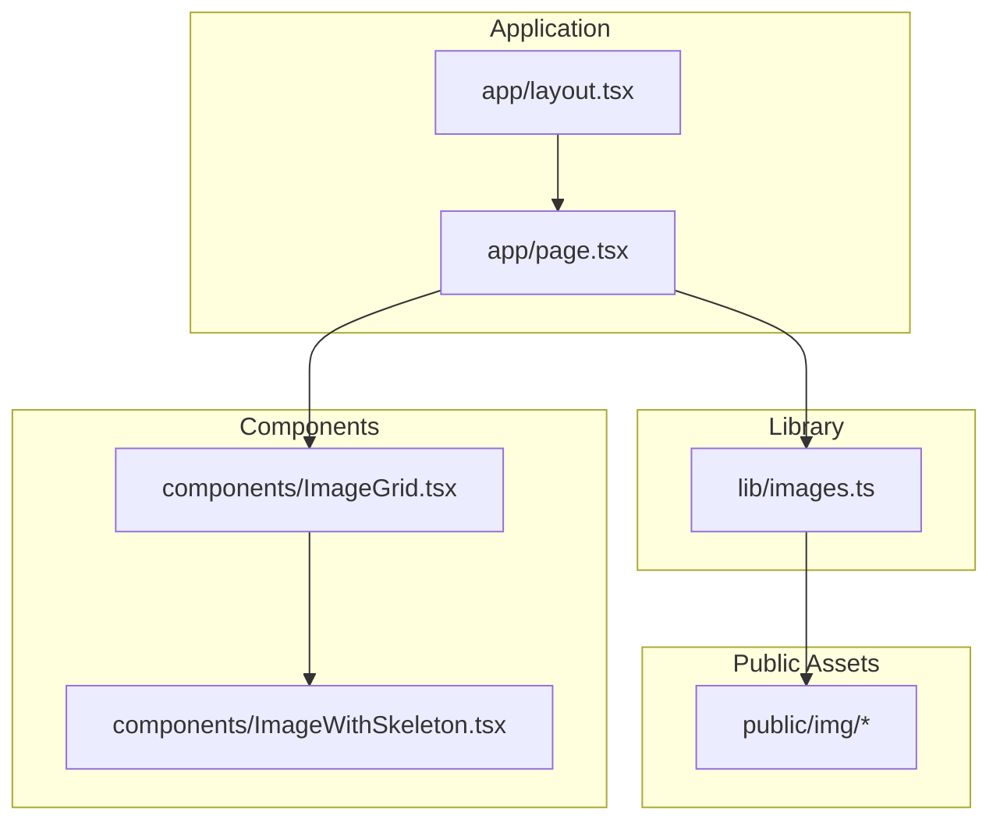
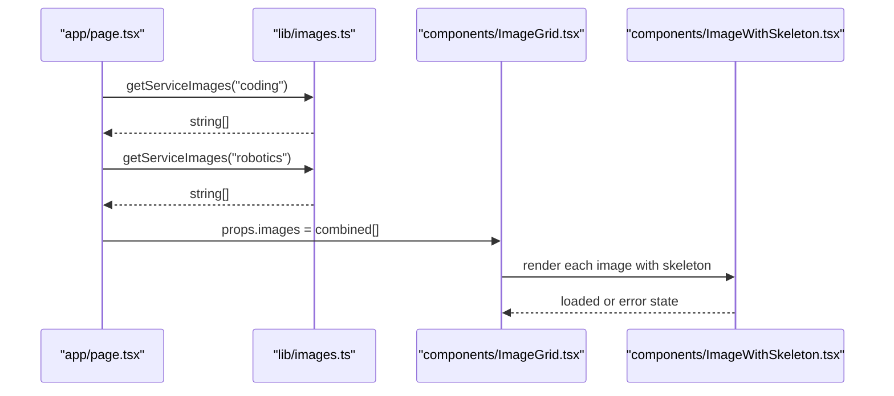
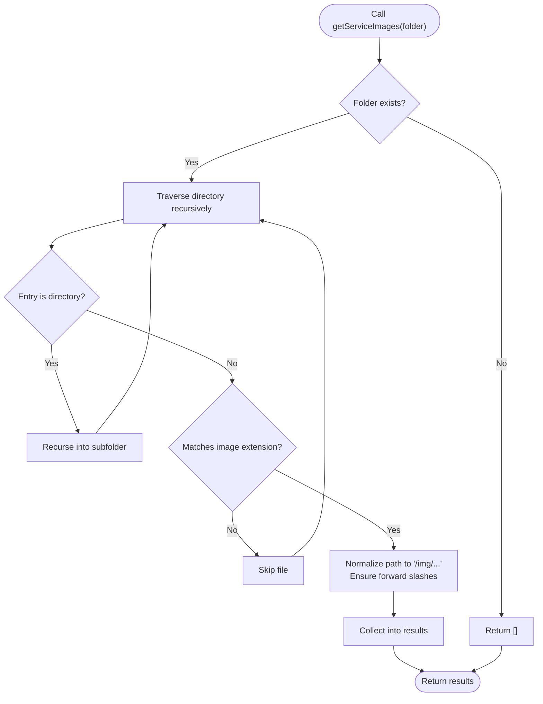
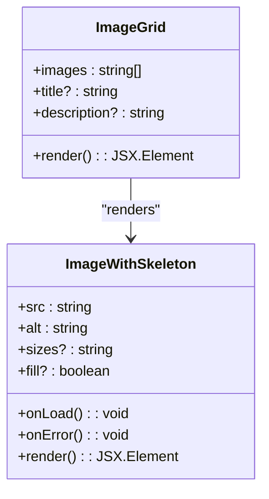
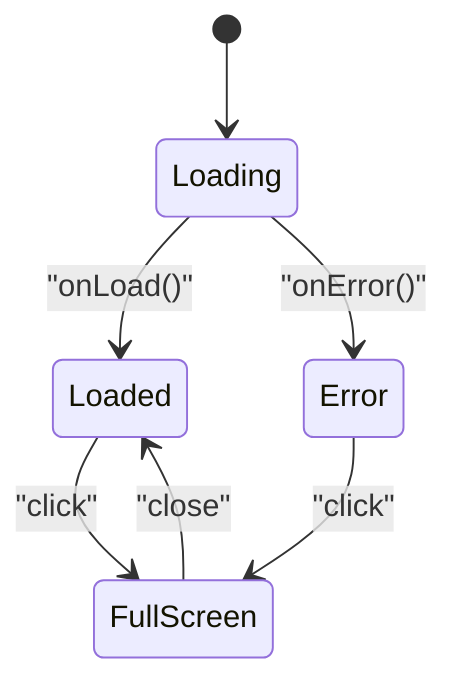
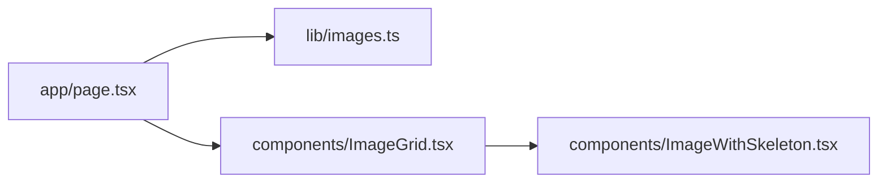

# Image Processing Service

<cite>
**Referenced Files in This Document**
- [images.ts](file://lib/images.ts)
- [ImageGrid.tsx](file://components/ImageGrid.tsx)
- [ImageWithSkeleton.tsx](file://components/ImageWithSkeleton.tsx)
- [page.tsx](file://app/page.tsx)
- [layout.tsx](file://app/layout.tsx)
- [next.config.ts](file://next.config.ts)
</cite>

## Table of Contents
1. [Introduction](#introduction)
2. [Project Structure](#project-structure)
3. [Core Components](#core-components)
4. [Architecture Overview](#architecture-overview)
5. [Detailed Component Analysis](#detailed-component-analysis)
6. [Dependency Analysis](#dependency-analysis)
7. [Performance Considerations](#performance-considerations)
8. [Troubleshooting Guide](#troubleshooting-guide)
9. [Conclusion](#conclusion)
10. [Appendices](#appendices)

## Introduction
This document describes the image processing service used by Rhema Expert Solutions. It focuses on how images are discovered from the public asset tree, prepared for rendering, and optimized for performance using Next.js features. The service integrates with UI components that render galleries and handle loading states, while leveraging Next.js Image component for responsive sizing and lazy loading. The current implementation does not apply server-side compression or format conversion; instead, it relies on Next.js’s built-in optimization pipeline and client-side image delivery.

## Project Structure
The image processing service is implemented in a small set of focused modules:
- A library module that scans the public image directory and returns normalized image paths.
- UI components that render images with skeleton loaders and lightbox behavior.
- Application pages that orchestrate image discovery and pass images to UI components.

**Diagram sources**
- [images.ts:1-52](file://lib/images.ts#L1-L52)
- [ImageGrid.tsx:1-64](file://components/ImageGrid.tsx#L1-L64)
- [ImageWithSkeleton.tsx:1-121](file://components/ImageWithSkeleton.tsx#L1-L121)
- [page.tsx:1-150](file://app/page.tsx#L1-L150)
- [layout.tsx:1-43](file://app/layout.tsx#L1-L43)

**Section sources**
- [images.ts:1-52](file://lib/images.ts#L1-L52)
- [ImageGrid.tsx:1-64](file://components/ImageGrid.tsx#L1-L64)
- [ImageWithSkeleton.tsx:1-121](file://components/ImageWithSkeleton.tsx#L1-L121)
- [page.tsx:1-150](file://app/page.tsx#L1-L150)
- [layout.tsx:1-43](file://app/layout.tsx#L1-L43)

## Core Components
- Image discovery and normalization:
  - Recursively enumerates supported image files under public/img.
  - Returns web-accessible paths prefixed with the asset route.
  - Provides convenience functions to fetch images for specific service folders and to shuffle/randomize lists.
- UI rendering and UX:
  - ImageGrid renders a responsive grid of images with click-to-lightbox behavior.
  - ImageWithSkeleton provides skeleton placeholders, fade-in transitions, and a full-screen viewer.

Key responsibilities:
- images.ts: Scans filesystem and normalizes paths for consumption by the UI.
- ImageGrid.tsx: Presents images in a gallery with responsive layout and modal preview.
- ImageWithSkeleton.tsx: Handles loading states, error fallbacks, and full-screen viewing.

**Section sources**
- [images.ts:28-50](file://lib/images.ts#L28-L50)
- [ImageGrid.tsx:13-62](file://components/ImageGrid.tsx#L13-L62)
- [ImageWithSkeleton.tsx:10-120](file://components/ImageWithSkeleton.tsx#L10-L120)

## Architecture Overview
The image processing pipeline is straightforward:
- Discovery: The library reads the public image directory and produces a list of asset URLs.
- Composition: Pages assemble image sets for different sections (hero, about, projects).
- Rendering: UI components render images using Next.js Image for responsive behavior and skeleton loaders for perceived performance.

**Diagram sources**
- [page.tsx:51-63](file://app/page.tsx#L51-L63)
- [images.ts:37-45](file://lib/images.ts#L37-L45)
- [ImageGrid.tsx:21-36](file://components/ImageGrid.tsx#L21-L36)
- [ImageWithSkeleton.tsx:68-87](file://components/ImageWithSkeleton.tsx#L68-L87)

## Detailed Component Analysis

### Image Discovery Library (lib/images.ts)
Responsibilities:
- Traverse public/img recursively and match supported image extensions.
- Normalize paths to web-accessible URLs.
- Provide functions to fetch images for a given service folder and to randomly select images.

Implementation highlights:
- Recursive directory traversal with stat checks to distinguish files from directories.
- Extension filtering for jpg, jpeg, png, gif, webp.
- Path normalization to ensure forward slashes for URLs.
- Convenience functions for combining and shuffling image lists.

**Diagram sources**
- [images.ts:5-26](file://lib/images.ts#L5-L26)
- [images.ts:37-45](file://lib/images.ts#L37-L45)

**Section sources**
- [images.ts:5-26](file://lib/images.ts#L5-L26)
- [images.ts:37-45](file://lib/images.ts#L37-L45)

### Image Gallery Component (components/ImageGrid.tsx)
Responsibilities:
- Render a responsive grid of images.
- Provide click-to-enlarge modal experience.
- Support optional title and description.

Rendering behavior:
- Uses Next.js Image for responsive sizing via sizes prop.
- Wraps each image in ImageWithSkeleton for loading UX.
- Implements a lightbox modal with full-screen preview.

**Diagram sources**
- [ImageGrid.tsx:7-11](file://components/ImageGrid.tsx#L7-L11)
- [ImageWithSkeleton.tsx:6-20](file://components/ImageWithSkeleton.tsx#L6-L20)

**Section sources**
- [ImageGrid.tsx:13-62](file://components/ImageGrid.tsx#L13-L62)
- [ImageWithSkeleton.tsx:10-120](file://components/ImageWithSkeleton.tsx#L10-L120)

### Skeleton Loader Component (components/ImageWithSkeleton.tsx)
Responsibilities:
- Show a skeleton placeholder while the image loads.
- Transition to the loaded image with a smooth opacity effect.
- Display an error fallback if the image fails to load.
- Enable full-screen modal viewing on click.

UX features:
- Conditional wrapper styles for fill vs fixed-size rendering.
- Animated skeleton spinner.
- Error state with icon.
- Full-screen overlay with close controls.

**Diagram sources**
- [ImageWithSkeleton.tsx:21-87](file://components/ImageWithSkeleton.tsx#L21-L87)
- [ImageWithSkeleton.tsx:90-117](file://components/ImageWithSkeleton.tsx#L90-L117)

**Section sources**
- [ImageWithSkeleton.tsx:10-120](file://components/ImageWithSkeleton.tsx#L10-L120)

### Page Orchestration (app/page.tsx)
Responsibilities:
- Discover images for specific sections using the library.
- Randomize image sets for hero and about sections.
- Pass image arrays to ImageGrid for rendering.

Integration points:
- Imports library functions to discover and shuffle images.
- Builds image sets for hero, about, and project gallery sections.

**Section sources**
- [page.tsx:1-10](file://app/page.tsx#L1-L10)
- [page.tsx:51-63](file://app/page.tsx#L51-L63)

## Dependency Analysis
The system exhibits low coupling and clear separation of concerns:
- app/page.tsx depends on lib/images.ts for image discovery.
- components/ImageGrid.tsx depends on components/ImageWithSkeleton.tsx for rendering.
- No external image processing libraries are used; Next.js handles optimization.

**Diagram sources**
- [page.tsx:1-10](file://app/page.tsx#L1-L10)
- [images.ts:1-52](file://lib/images.ts#L1-L52)
- [ImageGrid.tsx:1-64](file://components/ImageGrid.tsx#L1-L64)
- [ImageWithSkeleton.tsx:1-121](file://components/ImageWithSkeleton.tsx#L1-L121)

**Section sources**
- [page.tsx:1-10](file://app/page.tsx#L1-L10)
- [images.ts:1-52](file://lib/images.ts#L1-L52)
- [ImageGrid.tsx:1-64](file://components/ImageGrid.tsx#L1-L64)
- [ImageWithSkeleton.tsx:1-121](file://components/ImageWithSkeleton.tsx#L1-L121)

## Performance Considerations
Current implementation leverages Next.js Image for:
- Responsive image selection via sizes prop.
- Lazy loading behavior by default.
- Automatic format hints when serving optimized assets.

Optimization opportunities (future enhancements):
- Server-side resizing and format conversion using a dedicated image processing service.
- Pre-computation of multiple sizes per image to reduce client-side work.
- CDN integration for global distribution of optimized assets.
- Caching strategies at the edge to minimize origin requests.

[No sources needed since this section provides general guidance]

## Troubleshooting Guide
Common issues and resolutions:
- Missing images in UI:
  - Verify that images exist under public/img with supported extensions.
  - Confirm folder names passed to service functions match the directory structure.
- Incorrect paths or 404 errors:
  - Ensure paths returned by the library are used as-is; they are already normalized to web-accessible URLs.
- Skeleton loader not transitioning:
  - Check that onLoad/onError handlers are firing and that the component state updates accordingly.
- Lightbox not opening:
  - Confirm click handlers are not being blocked and that the selected image state is toggled.

**Section sources**
- [images.ts:37-45](file://lib/images.ts#L37-L45)
- [ImageWithSkeleton.tsx:68-87](file://components/ImageWithSkeleton.tsx#L68-L87)
- [ImageGrid.tsx:40-60](file://components/ImageGrid.tsx#L40-L60)

## Conclusion
The image processing service in Rhema Expert Solutions is intentionally lightweight, focusing on discovering and exposing images from the public asset directory. It integrates seamlessly with Next.js Image and UI components to deliver responsive, accessible galleries with improved perceived performance. While the current implementation does not apply server-side compression or format conversion, the architecture is ready to incorporate advanced optimization and CDN strategies as the application scales.

[No sources needed since this section summarizes without analyzing specific files]

## Appendices

### Next.js Configuration
The Next.js configuration file is currently minimal. Future enhancements could include:
- Image optimization settings for default quality and formats.
- Remote pattern configurations for external image sources.
- CDN-related settings for production deployments.

**Section sources**
- [next.config.ts:1-8](file://next.config.ts#L1-L8)

### Supported Image Formats
The discovery library filters for the following formats:
- jpg, jpeg, png, gif, webp

These are the formats recognized during scanning and returned as asset URLs.

**Section sources**
- [images.ts:16-16](file://lib/images.ts#L16-L16)

### Example Workflows

- Fetching images for a service section:
  - Use the service function to enumerate images from a specific folder.
  - Pass the resulting array to ImageGrid for rendering.

- Randomizing images for hero or about sections:
  - Use the randomization function to shuffle the combined image list.
  - Limit the count to desired values for each section.

- Adding a new service section:
  - Place images under public/img/<folder>.
  - Call the service function with the new folder name.
  - Render the images using ImageGrid.

**Section sources**
- [images.ts:37-50](file://lib/images.ts#L37-L50)
- [ImageGrid.tsx:13-36](file://components/ImageGrid.tsx#L13-L36)
- [page.tsx:51-63](file://app/page.tsx#L51-L63)