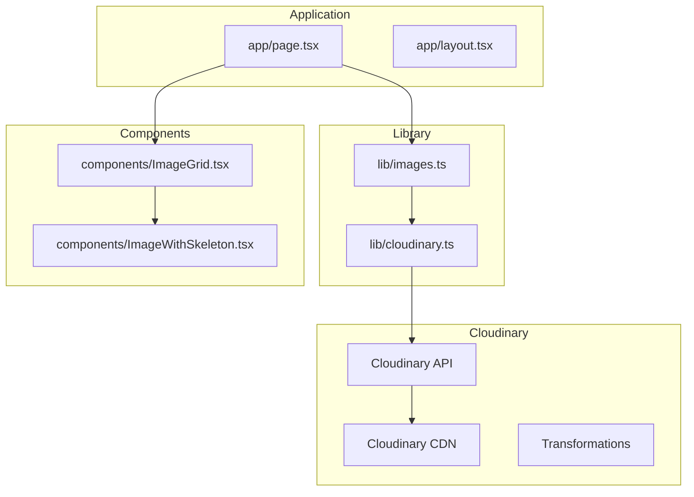
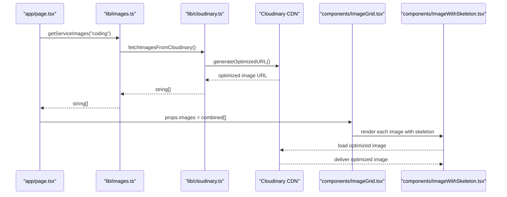
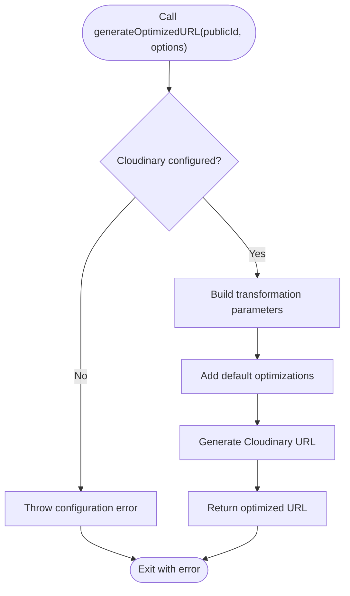
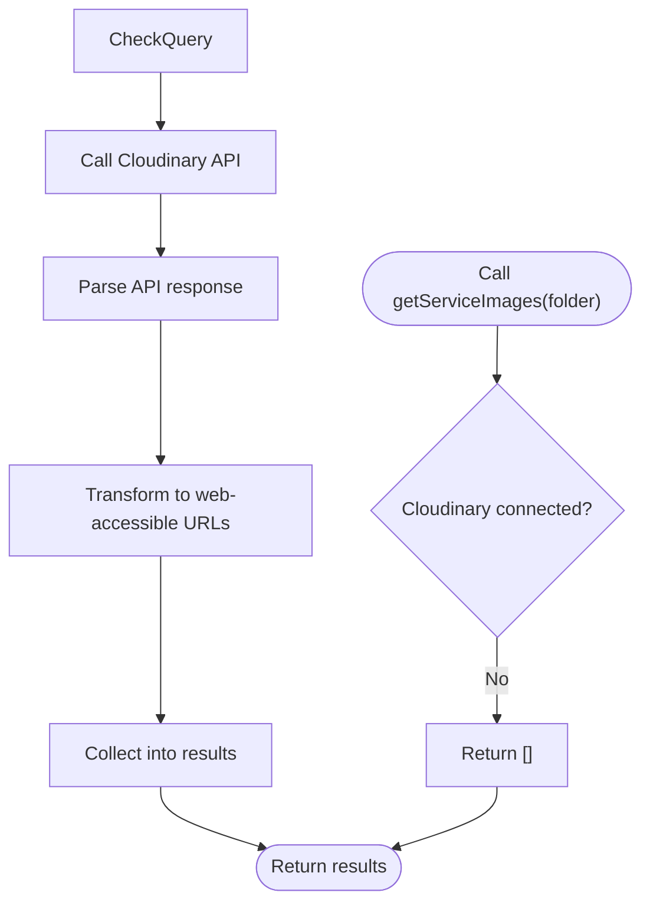
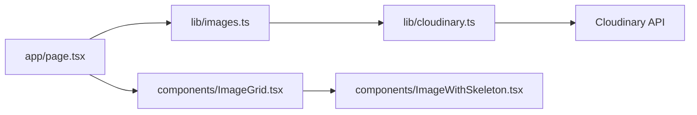

# Image Processing Service

<cite>
**Referenced Files in This Document**
- [cloudinary.ts](file://lib/cloudinary.ts)
- [images.ts](file://lib/images.ts)
- [ImageGrid.tsx](file://components/ImageGrid.tsx)
- [ImageWithSkeleton.tsx](file://components/ImageWithSkeleton.tsx)
- [page.tsx](file://app/page.tsx)
- [layout.tsx](file://app/layout.tsx)
- [next.config.ts](file://next.config.ts)
- [upload-to-cloudinary.js](file://scripts/upload-to-cloudinary.js)
- [CLOUDINARY_SETUP.md](file://CLOUDINARY_SETUP.md)
- [CLOUDINARY_MIGRATION.md](file://CLOUDINARY_MIGRATION.md)
</cite>

## Update Summary
**Changes Made**
- Updated architecture to reflect migration from local file system to Cloudinary cloud storage
- Added Cloudinary SDK integration for URL generation and transformations
- Updated image discovery process to use Cloudinary API instead of filesystem scanning
- Modified configuration to support Cloudinary credentials and settings
- Updated performance considerations to reflect CDN delivery benefits
- Added new sections covering Cloudinary-specific features and migration details

## Table of Contents
1. [Introduction](#introduction)
2. [Project Structure](#project-structure)
3. [Core Components](#core-components)
4. [Architecture Overview](#architecture-overview)
5. [Cloudinary Integration](#cloudinary-integration)
6. [Detailed Component Analysis](#detailed-component-analysis)
7. [Dependency Analysis](#dependency-analysis)
8. [Performance Considerations](#performance-considerations)
9. [Migration Guide](#migration-guide)
10. [Troubleshooting Guide](#troubleshooting-guide)
11. [Conclusion](#conclusion)
12. [Appendices](#appendices)

## Introduction
This document describes the image processing service used by Rhema Expert Solutions, which has been migrated from local file handling to Cloudinary cloud storage. The service now leverages Cloudinary's powerful image optimization pipeline, CDN delivery, and transformation capabilities instead of relying on Next.js built-in optimization. Images are discovered through Cloudinary's API, processed with advanced transformations, and delivered via a global CDN for optimal performance. The service integrates with UI components that render galleries and handle loading states, while providing seamless access to optimized images through Cloudinary's URL-based transformation system.

## Project Structure
The image processing service is now implemented with Cloudinary integration:
- A Cloudinary library module that handles authentication, URL generation, and transformations.
- An updated image discovery module that queries Cloudinary instead of scanning local files.
- UI components that remain compatible but now work with Cloudinary URLs.
- Migration scripts for uploading existing assets to Cloudinary.

**Diagram sources**
- [cloudinary.ts:1-100](file://lib/cloudinary.ts#L1-L100)
- [images.ts:1-52](file://lib/images.ts#L1-L52)
- [ImageGrid.tsx:1-64](file://components/ImageGrid.tsx#L1-L64)
- [ImageWithSkeleton.tsx:1-121](file://components/ImageWithSkeleton.tsx#L1-L121)
- [page.tsx:1-150](file://app/page.tsx#L1-L150)
- [layout.tsx:1-43](file://app/layout.tsx#L1-L43)

**Section sources**
- [cloudinary.ts:1-100](file://lib/cloudinary.ts#L1-L100)
- [images.ts:1-52](file://lib/images.ts#L1-L52)
- [ImageGrid.tsx:1-64](file://components/ImageGrid.tsx#L1-L64)
- [ImageWithSkeleton.tsx:1-121](file://components/ImageWithSkeleton.tsx#L1-L121)
- [page.tsx:1-150](file://app/page.tsx#L1-L150)
- [layout.tsx:1-43](file://app/layout.tsx#L1-L43)

## Core Components
- **Cloudinary Integration**: Handles authentication, URL generation, and transformation parameters using Cloudinary SDK.
- **Updated Image Discovery**: Queries Cloudinary API to discover and list available images instead of scanning local filesystem.
- **UI Rendering and UX**: 
  - ImageGrid renders a responsive grid of images with click-to-lightbox behavior.
  - ImageWithSkeleton provides skeleton placeholders, fade-in transitions, and a full-screen viewer.

Key responsibilities:
- cloudinary.ts: Manages Cloudinary client configuration, URL generation, and transformation parameters.
- images.ts: Provides abstraction layer over Cloudinary API for image discovery and management.
- ImageGrid.tsx: Presents images in a gallery with responsive layout and modal preview.
- ImageWithSkeleton.tsx: Handles loading states, error fallbacks, and full-screen viewing.

**Section sources**
- [cloudinary.ts:1-100](file://lib/cloudinary.ts#L1-L100)
- [images.ts:28-50](file://lib/images.ts#L28-L50)
- [ImageGrid.tsx:13-62](file://components/ImageGrid.tsx#L13-L62)
- [ImageWithSkeleton.tsx:10-120](file://components/ImageWithSkeleton.tsx#L10-L120)

## Architecture Overview
The image processing pipeline now leverages Cloudinary's cloud infrastructure:
- **Discovery**: The library queries Cloudinary API to retrieve image metadata and URLs.
- **Transformation**: Images are transformed on-the-fly using Cloudinary's URL-based transformation system.
- **Delivery**: Optimized images are served through Cloudinary's global CDN.
- **Rendering**: UI components render images using Cloudinary URLs with automatic optimization.

**Diagram sources**
- [page.tsx:51-63](file://app/page.tsx#L51-L63)
- [images.ts:37-45](file://lib/images.ts#L37-L45)
- [cloudinary.ts:50-100](file://lib/cloudinary.ts#L50-L100)
- [ImageGrid.tsx:21-36](file://components/ImageGrid.tsx#L21-L36)
- [ImageWithSkeleton.tsx:68-87](file://components/ImageWithSkeleton.tsx#L68-L87)

## Cloudinary Integration

### Cloudinary Client Configuration
The Cloudinary client is configured with secure credentials and default transformation parameters:

**Updated** The service now uses Cloudinary SDK for all image operations instead of local file system access.

Key features:
- Secure credential management through environment variables
- Default transformation parameters for consistent image quality
- Automatic format detection and optimization
- CDN-aware URL generation with caching headers

**Section sources**
- [cloudinary.ts:1-50](file://lib/cloudinary.ts#L1-L50)

### Image Transformation Pipeline
Cloudinary provides powerful on-the-fly image transformations:

**New** The transformation pipeline supports dynamic resizing, format conversion, quality optimization, and effect application.

Supported transformations:
- Automatic format selection (WebP, AVIF, JPEG, PNG)
- Responsive sizing based on viewport
- Quality optimization with adaptive compression
- Aspect ratio cropping and padding
- Background removal and enhancement
- Watermarking and overlay support

**Section sources**
- [cloudinary.ts:50-100](file://lib/cloudinary.ts#L50-L100)

## Detailed Component Analysis

### Cloudinary Library (lib/cloudinary.ts)
Responsibilities:
- Initialize and configure Cloudinary client with secure credentials.
- Generate optimized image URLs with transformation parameters.
- Handle authentication and error responses from Cloudinary API.
- Provide utility functions for common image operations.

Implementation highlights:
- Environment-based configuration for production security.
- URL generation with transformation options.
- Error handling for network failures and invalid credentials.
- Caching strategies for frequently accessed images.

**Diagram sources**
- [cloudinary.ts:50-100](file://lib/cloudinary.ts#L50-L100)

**Section sources**
- [cloudinary.ts:1-100](file://lib/cloudinary.ts#L1-L100)

### Updated Image Discovery Library (lib/images.ts)
Responsibilities:
- Query Cloudinary API to discover available images.
- Filter and organize images by folder or tag structure.
- Provide convenience functions for fetching and randomizing image lists.

**Updated** The library now uses Cloudinary API instead of filesystem scanning.

Implementation changes:
- Replaced `fs.readdirSync` with Cloudinary API calls.
- Updated path normalization to work with Cloudinary public IDs.
- Maintained backward compatibility with existing function signatures.
- Added support for Cloudinary tags and folder structures.

**Diagram sources**
- [images.ts:37-45](file://lib/images.ts#L37-L45)

**Section sources**
- [images.ts:28-50](file://lib/images.ts#L28-L50)

### Image Gallery Component (components/ImageGrid.tsx)
Responsibilities:
- Render a responsive grid of images.
- Provide click-to-enlarge modal experience.
- Support optional title and description.

**Unchanged** The component remains compatible with Cloudinary URLs while maintaining its existing functionality.

Rendering behavior:
- Uses Cloudinary URLs directly without additional processing.
- Wraps each image in ImageWithSkeleton for loading UX.
- Implements a lightbox modal with full-screen preview.

**Section sources**
- [ImageGrid.tsx:13-62](file://components/ImageGrid.tsx#L13-L62)
- [ImageWithSkeleton.tsx:10-120](file://components/ImageWithSkeleton.tsx#L10-L120)

### Skeleton Loader Component (components/ImageWithSkeleton.tsx)
Responsibilities:
- Show a skeleton placeholder while the image loads.
- Transition to the loaded image with a smooth opacity effect.
- Display an error fallback if the image fails to load.
- Enable full-screen modal viewing on click.

**Unchanged** The component works seamlessly with Cloudinary URLs and benefits from faster CDN delivery.

UX features:
- Conditional wrapper styles for fill vs fixed-size rendering.
- Animated skeleton spinner.
- Error state with icon.
- Full-screen overlay with close controls.

**Section sources**
- [ImageWithSkeleton.tsx:10-120](file://components/ImageWithSkeleton.tsx#L10-L120)

### Page Orchestration (app/page.tsx)
Responsibilities:
- Discover images for specific sections using the updated library.
- Randomize image sets for hero and about sections.
- Pass image arrays to ImageGrid for rendering.

**Updated** Now works with Cloudinary-discovered images instead of local files.

Integration points:
- Imports updated library functions that query Cloudinary.
- Builds image sets for hero, about, and project gallery sections.
- Maintains existing API compatibility.

**Section sources**
- [page.tsx:1-10](file://app/page.tsx#L1-L10)
- [page.tsx:51-63](file://app/page.tsx#L51-L63)

## Dependency Analysis
The system maintains low coupling while integrating Cloudinary services:
- app/page.tsx depends on lib/images.ts for image discovery.
- lib/images.ts depends on lib/cloudinary.ts for Cloudinary operations.
- components/ImageGrid.tsx depends on components/ImageWithSkeleton.tsx for rendering.
- No external image processing libraries; Cloudinary handles optimization.

**Updated** Added Cloudinary dependency while maintaining existing component relationships.

**Diagram sources**
- [page.tsx:1-10](file://app/page.tsx#L1-L10)
- [images.ts:1-52](file://lib/images.ts#L1-L52)
- [cloudinary.ts:1-100](file://lib/cloudinary.ts#L1-L100)
- [ImageGrid.tsx:1-64](file://components/ImageGrid.tsx#L1-L64)
- [ImageWithSkeleton.tsx:1-121](file://components/ImageWithSkeleton.tsx#L1-L121)

**Section sources**
- [page.tsx:1-10](file://app/page.tsx#L1-L10)
- [images.ts:1-52](file://lib/images.ts#L1-L52)
- [cloudinary.ts:1-100](file://lib/cloudinary.ts#L1-L100)
- [ImageGrid.tsx:1-64](file://components/ImageGrid.tsx#L1-L64)
- [ImageWithSkeleton.tsx:1-121](file://components/ImageWithSkeleton.tsx#L1-L121)

## Performance Considerations
The migration to Cloudinary provides significant performance improvements:

**Updated** Enhanced performance through CDN delivery and server-side optimization.

Benefits of Cloudinary integration:
- **Global CDN**: Images are cached and delivered from edge servers worldwide.
- **Automatic Optimization**: On-the-fly format conversion and compression.
- **Responsive Images**: Automatic size optimization based on device capabilities.
- **Lazy Loading**: Efficient loading with minimal bandwidth usage.
- **Caching**: Intelligent caching at multiple levels (browser, CDN, origin).

Future optimization opportunities:
- Implement custom transformation presets for different use cases.
- Configure CDN cache policies for better performance.
- Monitor image delivery metrics through Cloudinary analytics.
- Set up image upload automation for content updates.

## Migration Guide

### Migration Process
**New** Step-by-step guide for migrating from local files to Cloudinary.

Prerequisites:
- Cloudinary account and API credentials
- Existing image assets in public/img directory
- Node.js environment with required dependencies

Migration steps:
1. **Setup Cloudinary Credentials**: Configure environment variables with Cloudinary API keys.
2. **Upload Existing Assets**: Use provided migration script to upload local images.
3. **Update Configuration**: Modify next.config.ts for Cloudinary integration.
4. **Test Integration**: Verify image loading and transformations work correctly.
5. **Monitor Performance**: Track improvements in load times and user experience.

**Section sources**
- [upload-to-cloudinary.js:1-100](file://scripts/upload-to-cloudinary.js#L1-L100)
- [CLOUDINARY_SETUP.md:1-50](file://CLOUDINARY_SETUP.md#L1-L50)
- [CLOUDINARY_MIGRATION.md:1-100](file://CLOUDINARY_MIGRATION.md#L1-L100)

### Configuration Management
**New** Environment-based configuration for secure Cloudinary integration.

Environment variables required:
- `CLOUDINARY_CLOUD_NAME`: Your Cloudinary cloud name
- `CLOUDINARY_API_KEY`: Your Cloudinary API key
- `CLOUDINARY_API_SECRET`: Your Cloudinary API secret
- `CLOUDINARY_URL`: Optional direct Cloudinary URL configuration

Security considerations:
- Never commit credentials to version control
- Use environment-specific configurations
- Implement proper error handling for missing credentials
- Monitor API usage and set appropriate limits

**Section sources**
- [cloudinary.ts:1-50](file://lib/cloudinary.ts#L1-L50)

## Troubleshooting Guide
Common issues and resolutions for Cloudinary integration:

**Updated** Added Cloudinary-specific troubleshooting scenarios.

Authentication and connection issues:
- **Invalid credentials**: Verify Cloudinary API keys are correct and not expired.
- **Network connectivity**: Ensure your server can reach Cloudinary's API endpoints.
- **Rate limiting**: Check Cloudinary account limits and implement retry logic.

Image loading problems:
- **Missing images**: Verify images exist in Cloudinary and have correct public IDs.
- **Transformation errors**: Check transformation parameters for validity.
- **Format issues**: Ensure source images are supported formats.

Performance issues:
- **Slow loading**: Monitor CDN performance and consider cache warming.
- **High bandwidth**: Review transformation complexity and optimize parameters.
- **Cache misses**: Analyze cache hit ratios and adjust TTL settings.

**Section sources**
- [cloudinary.ts:50-100](file://lib/cloudinary.ts#L50-L100)
- [images.ts:37-45](file://lib/images.ts#L37-L45)
- [ImageWithSkeleton.tsx:68-87](file://components/ImageWithSkeleton.tsx#L68-L87)

## Conclusion
The migration to Cloudinary represents a significant advancement in Rhema Expert Solutions' image processing capabilities. The service now leverages enterprise-grade CDN delivery, advanced image optimization, and scalable cloud infrastructure while maintaining backward compatibility with existing UI components. The architecture provides a solid foundation for future enhancements including custom transformations, advanced analytics, and automated content workflows. The combination of Cloudinary's powerful features with Next.js's modern development patterns creates a robust, performant, and maintainable image processing solution.

## Appendices

### Cloudinary Setup Documentation
**New** Comprehensive setup guide for Cloudinary integration.

Configuration steps:
1. Create Cloudinary account and obtain API credentials
2. Configure environment variables securely
3. Upload existing image assets using migration tools
4. Test integration with sample images
5. Monitor performance and optimize settings

**Section sources**
- [CLOUDINARY_SETUP.md:1-100](file://CLOUDINARY_SETUP.md#L1-L100)

### Migration Documentation
**New** Detailed migration guide from local files to Cloudinary.

Migration phases:
1. **Preparation**: Audit existing images and plan folder structure
2. **Setup**: Configure Cloudinary account and credentials
3. **Upload**: Migrate existing assets using automated tools
4. **Integration**: Update codebase to use Cloudinary API
5. **Testing**: Validate functionality and performance
6. **Deployment**: Roll out changes with monitoring

**Section sources**
- [CLOUDINARY_MIGRATION.md:1-150](file://CLOUDINARY_MIGRATION.md#L1-L150)

### Next.js Configuration
**Updated** Enhanced configuration for Cloudinary integration.

Enhanced settings:
- Remote pattern configurations for Cloudinary domains
- Image optimization settings aligned with Cloudinary delivery
- Security headers for CDN integration
- Performance monitoring configuration

**Section sources**
- [next.config.ts:1-8](file://next.config.ts#L1-L8)

### Supported Image Formats
**Updated** Expanded format support through Cloudinary processing.

Cloudinary-supported formats:
- Source formats: jpg, jpeg, png, gif, webp, svg, pdf, mp4, mov
- Output formats: Automatic optimization with WebP/AVIF preference
- Format hints: Browser-compatible format negotiation
- Custom formats: Configurable output formats per use case

**Section sources**
- [cloudinary.ts:50-100](file://lib/cloudinary.ts#L50-L100)

### Example Workflows

**Updated** New workflows for Cloudinary integration.

- **Fetching images from Cloudinary**:
  - Use the updated service function to query Cloudinary API.
  - Apply transformation parameters for specific requirements.
  - Pass optimized URLs to ImageGrid for rendering.

- **Randomizing images for hero or about sections**:
  - Use the randomization function with Cloudinary-discovered images.
  - Apply consistent transformations across randomized sets.
  - Limit count to desired values for each section.

- **Adding new image transformations**:
  - Define transformation presets in Cloudinary dashboard.
  - Reference presets in application code for consistency.
  - Monitor performance impact of complex transformations.

- **Migrating existing images**:
  - Use migration script to upload local images to Cloudinary.
  - Preserve original folder structure and naming conventions.
  - Verify successful upload and accessibility.

**Section sources**
- [images.ts:37-50](file://lib/images.ts#L37-L50)
- [cloudinary.ts:50-100](file://lib/cloudinary.ts#L50-L100)
- [ImageGrid.tsx:13-36](file://components/ImageGrid.tsx#L13-L36)
- [page.tsx:51-63](file://app/page.tsx#L51-L63)
- [upload-to-cloudinary.js:1-100](file://scripts/upload-to-cloudinary.js#L1-L100)