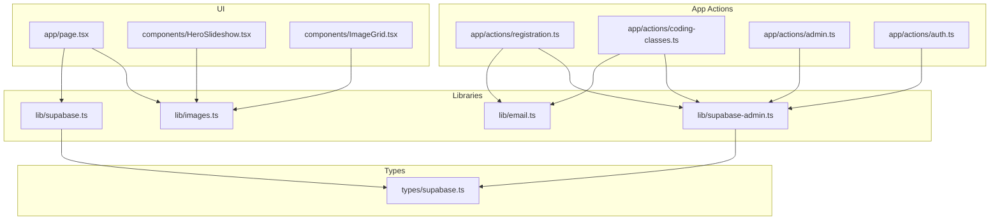
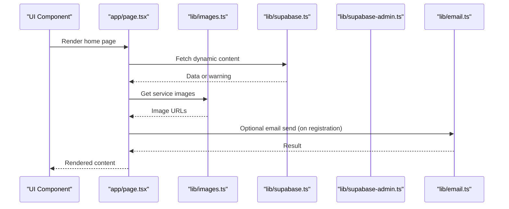
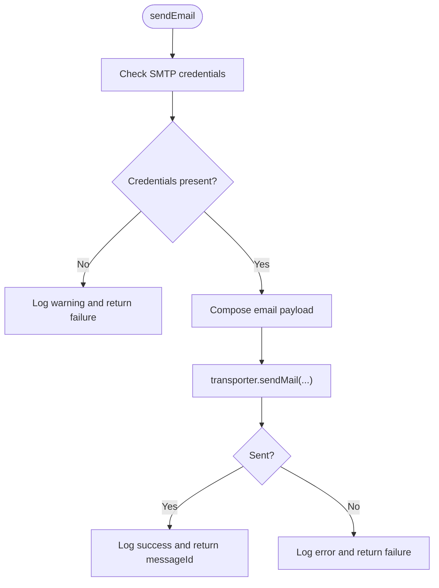
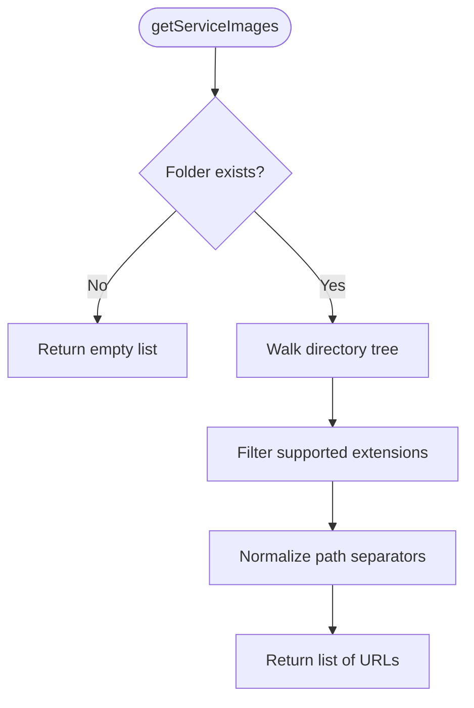
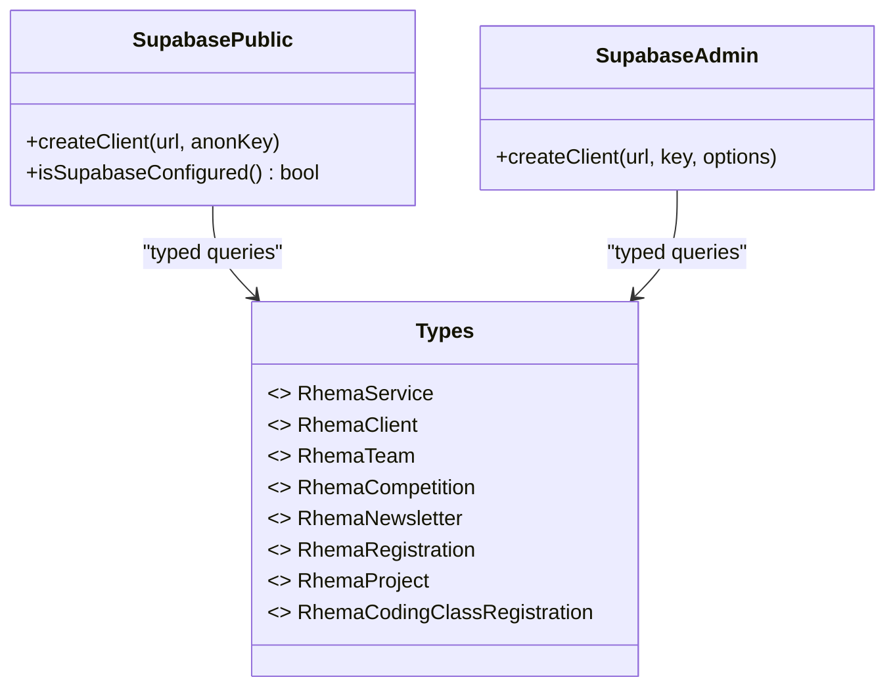
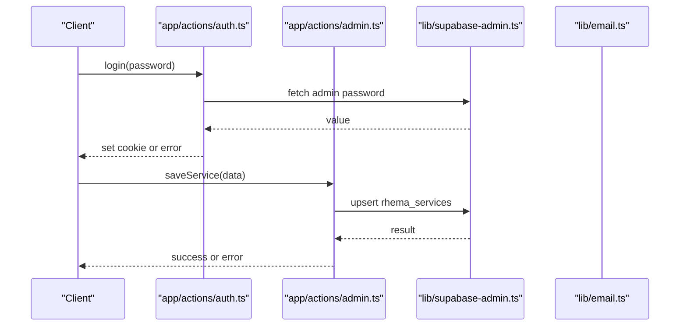
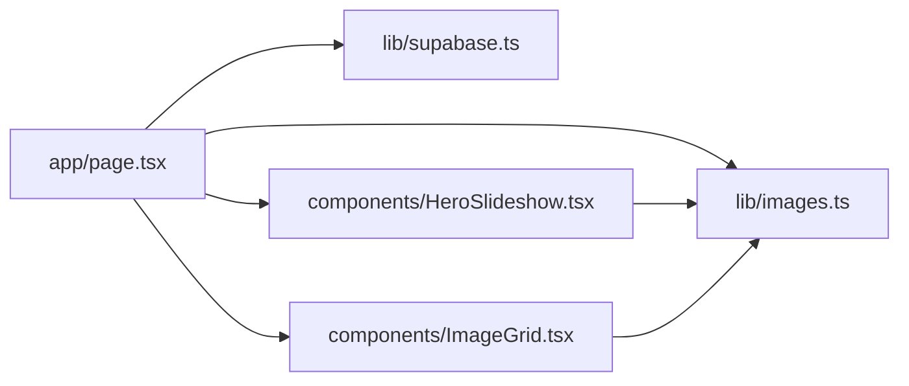
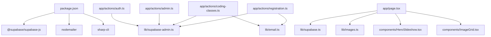

# Service Layer

<cite>
**Referenced Files in This Document**
- [email.ts](file://lib/email.ts)
- [images.ts](file://lib/images.ts)
- [supabase.ts](file://lib/supabase.ts)
- [supabase-admin.ts](file://lib/supabase-admin.ts)
- [supabase.ts](file://types/supabase.ts)
- [admin.ts](file://app/actions/admin.ts)
- [auth.ts](file://app/actions/auth.ts)
- [coding-classes.ts](file://app/actions/coding-classes.ts)
- [registration.ts](file://app/actions/registration.ts)
- [page.tsx](file://app/page.tsx)
- [HeroSlideshow.tsx](file://components/HeroSlideshow.tsx)
- [ImageGrid.tsx](file://components/ImageGrid.tsx)
- [package.json](file://package.json)
</cite>

## Table of Contents
1. [Introduction](#introduction)
2. [Project Structure](#project-structure)
3. [Core Components](#core-components)
4. [Architecture Overview](#architecture-overview)
5. [Detailed Component Analysis](#detailed-component-analysis)
6. [Dependency Analysis](#dependency-analysis)
7. [Performance Considerations](#performance-considerations)
8. [Troubleshooting Guide](#troubleshooting-guide)
9. [Conclusion](#conclusion)
10. [Appendices](#appendices)

## Introduction
This document describes the service layer for Rhema Expert Solutions, focusing on:
- Email notification system: templates, delivery configuration, and integration patterns
- Image processing pipeline and asset storage integration
- Supabase service implementations for client and administrative access
- Service abstractions, dependency injection patterns, and error handling strategies
- Relationships between services and components, data transformation workflows, and external API integrations
- Practical examples for implementing new services, configuring dependencies, and managing lifecycles
- Performance optimization, caching strategies, and monitoring approaches
- Security considerations, rate limiting, and scalability patterns

## Project Structure
The service layer is organized around three primary modules:
- Email service: asynchronous email dispatch and prebuilt templates for registrations
- Image service: filesystem-based asset discovery and selection helpers
- Supabase service: client and admin clients for database access with RLS-aware separation

**Diagram sources**
- [registration.ts:1-131](file://app/actions/registration.ts#L1-L131)
- [coding-classes.ts:1-157](file://app/actions/coding-classes.ts#L1-L157)
- [admin.ts:1-198](file://app/actions/admin.ts#L1-L198)
- [auth.ts:1-55](file://app/actions/auth.ts#L1-L55)
- [email.ts:1-134](file://lib/email.ts#L1-L134)
- [images.ts:1-52](file://lib/images.ts#L1-L52)
- [supabase.ts:1-25](file://lib/supabase.ts#L1-L25)
- [supabase-admin.ts:1-19](file://lib/supabase-admin.ts#L1-L19)
- [supabase.ts:1-98](file://types/supabase.ts#L1-L98)
- [page.tsx:1-788](file://app/page.tsx#L1-L788)
- [HeroSlideshow.tsx:1-96](file://components/HeroSlideshow.tsx#L1-L96)
- [ImageGrid.tsx:1-64](file://components/ImageGrid.tsx#L1-L64)

**Section sources**
- [email.ts:1-134](file://lib/email.ts#L1-L134)
- [images.ts:1-52](file://lib/images.ts#L1-L52)
- [supabase.ts:1-25](file://lib/supabase.ts#L1-L25)
- [supabase-admin.ts:1-19](file://lib/supabase-admin.ts#L1-L19)
- [supabase.ts:1-98](file://types/supabase.ts#L1-L98)
- [admin.ts:1-198](file://app/actions/admin.ts#L1-L198)
- [auth.ts:1-55](file://app/actions/auth.ts#L1-L55)
- [coding-classes.ts:1-157](file://app/actions/coding-classes.ts#L1-L157)
- [registration.ts:1-131](file://app/actions/registration.ts#L1-L131)
- [page.tsx:1-788](file://app/page.tsx#L1-L788)
- [HeroSlideshow.tsx:1-96](file://components/HeroSlideshow.tsx#L1-L96)
- [ImageGrid.tsx:1-64](file://components/ImageGrid.tsx#L1-L64)

## Core Components
- Email service
  - Provides transport configuration via environment variables and a unified send function
  - Offers prebuilt HTML templates for competition and coding class registrations
  - Returns structured results with success flags and error messages
- Image service
  - Recursively discovers images under public/img and filters by supported extensions
  - Supports retrieving images for specific service folders and random sampling
- Supabase service
  - Public client for read-only access with RLS-aware defaults
  - Admin client with service role key for bypassing RLS and performing privileged operations
  - Type-safe interfaces for database entities

**Section sources**
- [email.ts:1-134](file://lib/email.ts#L1-L134)
- [images.ts:1-52](file://lib/images.ts#L1-L52)
- [supabase.ts:1-25](file://lib/supabase.ts#L1-L25)
- [supabase-admin.ts:1-19](file://lib/supabase-admin.ts#L1-L19)
- [supabase.ts:1-98](file://types/supabase.ts#L1-L98)

## Architecture Overview
The service layer follows a clean separation of concerns:
- Action modules orchestrate workflows, enforce authentication, and coordinate service calls
- Service modules encapsulate cross-cutting concerns (email, images, database)
- UI components consume service outputs and present data to users
- Types define the contract between services and the database

**Diagram sources**
- [page.tsx:1-788](file://app/page.tsx#L1-L788)
- [images.ts:1-52](file://lib/images.ts#L1-L52)
- [supabase.ts:1-25](file://lib/supabase.ts#L1-L25)
- [supabase-admin.ts:1-19](file://lib/supabase-admin.ts#L1-L19)
- [email.ts:1-134](file://lib/email.ts#L1-L134)

## Detailed Component Analysis

### Email Service
The email service encapsulates SMTP configuration and provides:
- Unified send function with structured return values
- Prebuilt HTML templates for competition and coding class registrations
- Admin recipient list management
- Graceful degradation when credentials are missing

Key behaviors:
- Validates presence of SMTP credentials before attempting to send
- Uses Nodemailer with Gmail service configuration
- Emits logs for successful sends and errors for failures
- Templates are constructed from registration payloads and injected into HTML tables

**Diagram sources**
- [email.ts:23-44](file://lib/email.ts#L23-L44)

**Section sources**
- [email.ts:1-134](file://lib/email.ts#L1-L134)

### Image Service
The image service provides:
- Recursive discovery of images under public/img with filtering by extension
- Selection of images for specific service folders
- Randomized selection for hero and gallery views
- URL normalization for web accessibility

**Diagram sources**
- [images.ts:37-45](file://lib/images.ts#L37-L45)

**Section sources**
- [images.ts:1-52](file://lib/images.ts#L1-L52)

### Supabase Service Implementations
Public client:
- Reads environment variables for URL and anonymous key
- Emits warnings if configuration is missing
- Exposes a helper to detect configuration state

Admin client:
- Uses service role key when available to bypass RLS
- Falls back to anonymous key if service role key is missing (with warnings)
- Disables session persistence for admin operations

**Diagram sources**
- [supabase.ts:1-25](file://lib/supabase.ts#L1-L25)
- [supabase-admin.ts:1-19](file://lib/supabase-admin.ts#L1-L19)
- [supabase.ts:1-98](file://types/supabase.ts#L1-L98)

**Section sources**
- [supabase.ts:1-25](file://lib/supabase.ts#L1-L25)
- [supabase-admin.ts:1-19](file://lib/supabase-admin.ts#L1-L19)
- [supabase.ts:1-98](file://types/supabase.ts#L1-L98)

### Action Layer Integrations
- Authentication and admin operations
  - Login validates against stored or environment-provided admin password
  - Session maintained via HTTP-only cookie
  - Admin actions enforce authentication before mutations

- Registration workflows
  - Competition registration inserts into rhema_registrations and triggers email notification
  - Coding class registration inserts into rhema_coding_class_registrations and triggers email notification
  - Both include robust error handling and status updates

- Admin dashboard operations
  - Bulk reads for services, clients, team, competitions, newsletter, and settings
  - CRUD operations for content management
  - Automatic creation of admin password setting if missing

**Diagram sources**
- [auth.ts:1-55](file://app/actions/auth.ts#L1-L55)
- [admin.ts:1-198](file://app/actions/admin.ts#L1-L198)
- [supabase-admin.ts:1-19](file://lib/supabase-admin.ts#L1-L19)
- [email.ts:1-134](file://lib/email.ts#L1-L134)

**Section sources**
- [auth.ts:1-55](file://app/actions/auth.ts#L1-L55)
- [admin.ts:1-198](file://app/actions/admin.ts#L1-L198)
- [coding-classes.ts:1-157](file://app/actions/coding-classes.ts#L1-L157)
- [registration.ts:1-131](file://app/actions/registration.ts#L1-L131)

### UI Integration Patterns
- Home page orchestrates dynamic content fetching, image discovery, and rendering
- Hero slideshow and image grid components consume image lists from the image service
- Content placeholders fall back to static data when Supabase is unavailable

**Diagram sources**
- [page.tsx:1-788](file://app/page.tsx#L1-L788)
- [HeroSlideshow.tsx:1-96](file://components/HeroSlideshow.tsx#L1-L96)
- [ImageGrid.tsx:1-64](file://components/ImageGrid.tsx#L1-L64)
- [images.ts:1-52](file://lib/images.ts#L1-L52)
- [supabase.ts:1-25](file://lib/supabase.ts#L1-L25)

**Section sources**
- [page.tsx:1-788](file://app/page.tsx#L1-L788)
- [HeroSlideshow.tsx:1-96](file://components/HeroSlideshow.tsx#L1-L96)
- [ImageGrid.tsx:1-64](file://components/ImageGrid.tsx#L1-L64)

## Dependency Analysis
External dependencies:
- @supabase/supabase-js: Database client for both public and admin operations
- nodemailer: Email transport for SMTP-based notifications
- sharp-cli: Image processing tooling (CLI wrapper)

Internal dependencies:
- Action modules depend on Supabase admin client for mutations and on email service for notifications
- UI components depend on image service for asset discovery and Supabase client for dynamic content
- Types module defines shared interfaces for database entities

**Diagram sources**
- [package.json:1-32](file://package.json#L1-L32)
- [registration.ts:1-131](file://app/actions/registration.ts#L1-L131)
- [coding-classes.ts:1-157](file://app/actions/coding-classes.ts#L1-L157)
- [admin.ts:1-198](file://app/actions/admin.ts#L1-L198)
- [auth.ts:1-55](file://app/actions/auth.ts#L1-L55)
- [page.tsx:1-788](file://app/page.tsx#L1-L788)
- [HeroSlideshow.tsx:1-96](file://components/HeroSlideshow.tsx#L1-L96)
- [ImageGrid.tsx:1-64](file://components/ImageGrid.tsx#L1-L64)
- [supabase.ts:1-25](file://lib/supabase.ts#L1-L25)
- [supabase-admin.ts:1-19](file://lib/supabase-admin.ts#L1-L19)
- [email.ts:1-134](file://lib/email.ts#L1-L134)
- [images.ts:1-52](file://lib/images.ts#L1-L52)

**Section sources**
- [package.json:1-32](file://package.json#L1-L32)
- [registration.ts:1-131](file://app/actions/registration.ts#L1-L131)
- [coding-classes.ts:1-157](file://app/actions/coding-classes.ts#L1-L157)
- [admin.ts:1-198](file://app/actions/admin.ts#L1-L198)
- [auth.ts:1-55](file://app/actions/auth.ts#L1-L55)
- [page.tsx:1-788](file://app/page.tsx#L1-L788)

## Performance Considerations
- Email delivery
  - Use environment variables for credentials to avoid in-memory secrets
  - Batch operations where possible; currently, emails are sent per registration
- Image service
  - Directory traversal is synchronous; consider async alternatives for large asset sets
  - Randomization is in-memory; cache shuffled lists if reused frequently
- Supabase client
  - Public client uses RLS; ensure policies minimize unnecessary scans
  - Admin client bypasses RLS; restrict usage to server actions and authenticated routes
- UI rendering
  - Lazy-load images and use Next.js Image with appropriate sizes
  - Debounce or throttle slideshow transitions to reduce DOM churn

[No sources needed since this section provides general guidance]

## Troubleshooting Guide
Common issues and resolutions:
- Missing SMTP credentials
  - Symptom: Email disabled warning and failure returns
  - Resolution: Set SMTP_USER and SMTP_PASS environment variables
- Missing Supabase configuration
  - Symptom: Warning about missing environment variables and dynamic content not loading
  - Resolution: Configure NEXT_PUBLIC_SUPABASE_URL and NEXT_PUBLIC_SUPABASE_ANON_KEY
- Admin operations failing with RLS
  - Symptom: Writes blocked when SUPABASE_SERVICE_ROLE_KEY is missing
  - Resolution: Provide SUPABASE_SERVICE_ROLE_KEY or adjust RLS policies
- Authentication failures
  - Symptom: Unauthorized errors on admin actions
  - Resolution: Verify admin password setting and cookie presence

**Section sources**
- [email.ts:23-44](file://lib/email.ts#L23-L44)
- [supabase.ts:10-13](file://lib/supabase.ts#L10-L13)
- [supabase-admin.ts:7-9](file://lib/supabase-admin.ts#L7-L9)
- [auth.ts:31-42](file://app/actions/auth.ts#L31-L42)

## Conclusion
The service layer cleanly separates concerns across email, image, and database services. It leverages environment-driven configuration, typed interfaces, and action-layer orchestration to deliver a maintainable and extensible architecture. Future enhancements could include email batching, async image discovery, and centralized logging/metrics for improved observability.

[No sources needed since this section summarizes without analyzing specific files]

## Appendices

### Implementing New Services
- Define a new service module under lib/
  - Export pure functions with explicit inputs and structured outputs
  - Centralize side effects (external APIs, filesystem) behind the service
- Add types if needed in types/supabase.ts
- Integrate in action modules:
  - Import the service and call it from server actions
  - Handle errors and return consistent shapes
- Update UI:
  - Consume service outputs in page components
  - Provide graceful fallbacks when services are unavailable

**Section sources**
- [email.ts:1-134](file://lib/email.ts#L1-L134)
- [images.ts:1-52](file://lib/images.ts#L1-L52)
- [supabase.ts:1-25](file://lib/supabase.ts#L1-L25)
- [supabase-admin.ts:1-19](file://lib/supabase-admin.ts#L1-L19)
- [supabase.ts:1-98](file://types/supabase.ts#L1-L98)

### Configuring Service Dependencies
- Environment variables
  - SMTP_USER, SMTP_PASS for email
  - NEXT_PUBLIC_SUPABASE_URL, NEXT_PUBLIC_SUPABASE_ANON_KEY for public client
  - SUPABASE_SERVICE_ROLE_KEY for admin client
  - ADMIN_PASSWORD for initial admin setup
- Package dependencies
  - Ensure @supabase/supabase-js, nodemailer, and sharp-cli are installed

**Section sources**
- [email.ts:3-12](file://lib/email.ts#L3-L12)
- [supabase.ts:7-18](file://lib/supabase.ts#L7-L18)
- [supabase-admin.ts:4-12](file://lib/supabase-admin.ts#L4-L12)
- [auth.ts:19-29](file://app/actions/auth.ts#L19-L29)
- [package.json:11-17](file://package.json#L11-L17)

### Managing Service Lifecycles
- Initialization
  - Load environment variables at module import
  - Validate configuration and log warnings for missing keys
- Runtime
  - Reuse clients across requests where appropriate
  - Avoid persisting sessions for admin operations
- Shutdown
  - No explicit teardown required for these services

**Section sources**
- [supabase.ts:10-13](file://lib/supabase.ts#L10-L13)
- [supabase-admin.ts:14-18](file://lib/supabase-admin.ts#L14-L18)

### Security Considerations
- Email
  - Store credentials in environment variables; never commit secrets
  - Sanitize inputs when constructing HTML templates
- Supabase
  - Use service role key for admin operations; keep it secret
  - Enforce RLS policies; avoid broad permissions
- Authentication
  - Use HTTP-only cookies for admin sessions
  - Validate passwords against stored values

**Section sources**
- [email.ts:3-12](file://lib/email.ts#L3-L12)
- [supabase-admin.ts:4-12](file://lib/supabase-admin.ts#L4-L12)
- [auth.ts:31-42](file://app/actions/auth.ts#L31-L42)

### Rate Limiting and Scalability
- Email
  - Implement retry/backoff for transient failures
  - Consider queuing for high-volume scenarios
- Images
  - Cache discovered image lists for repeated renders
  - Serve images via CDN for global distribution
- Supabase
  - Use connection pooling and limit concurrent writes
  - Scale read replicas for heavy read loads

[No sources needed since this section provides general guidance]