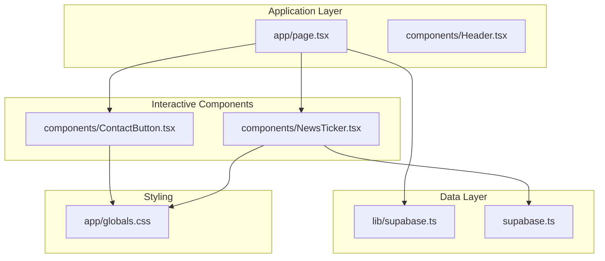
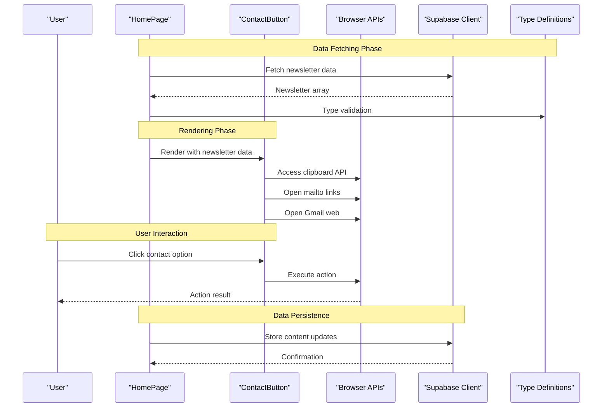
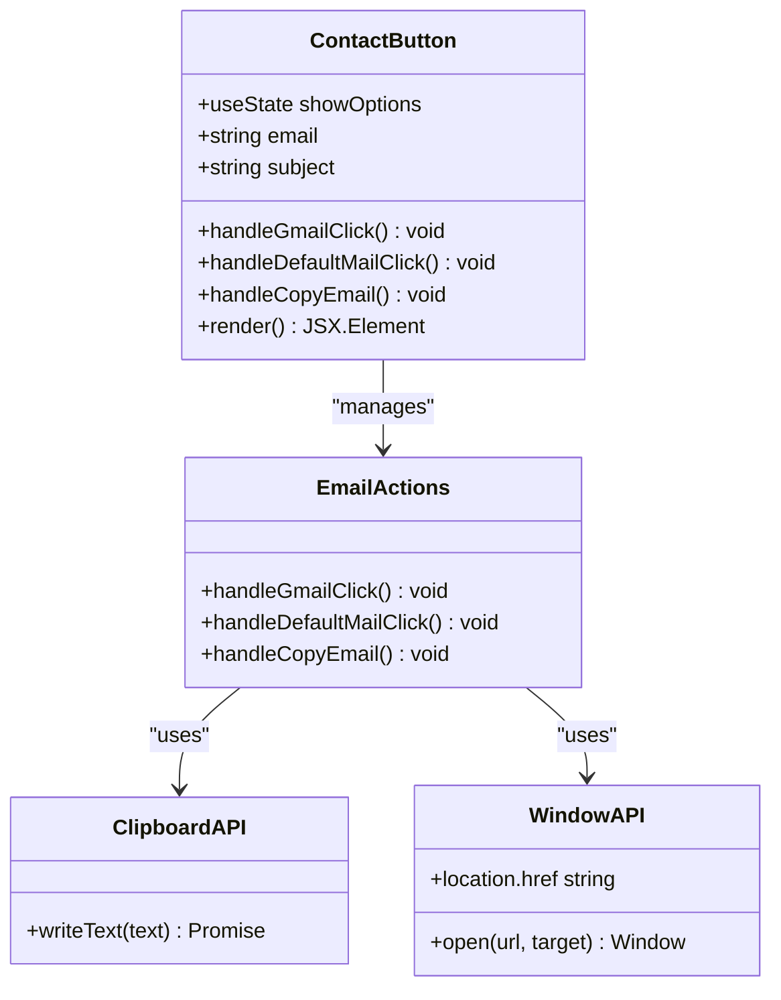
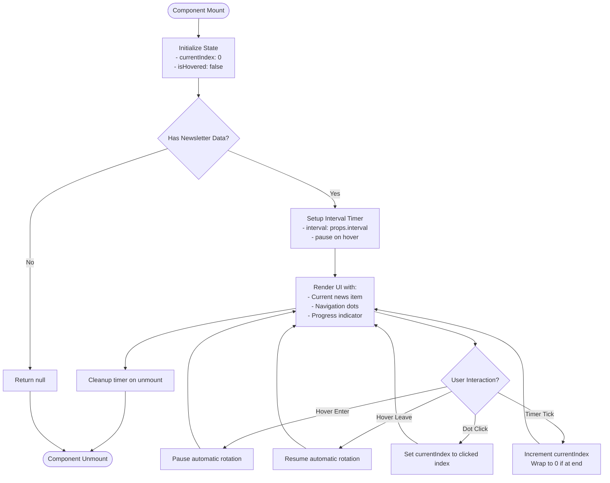
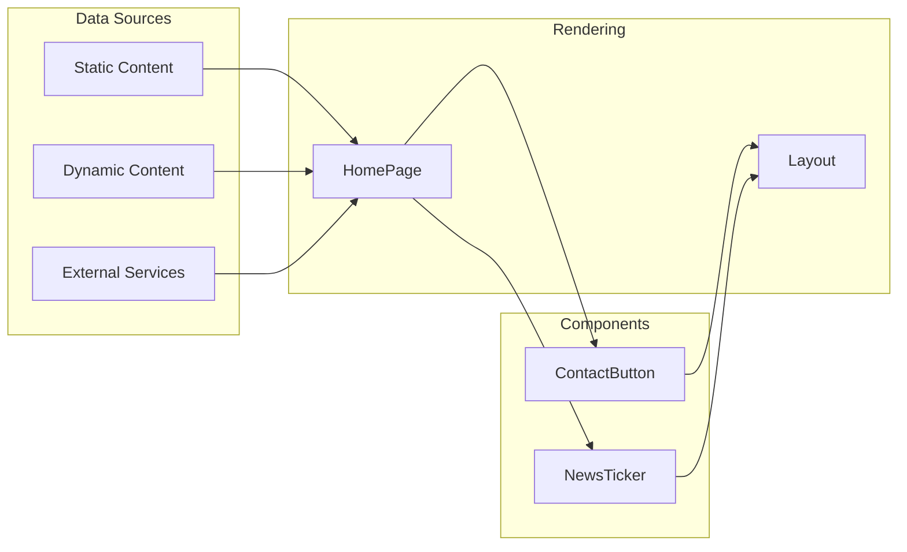
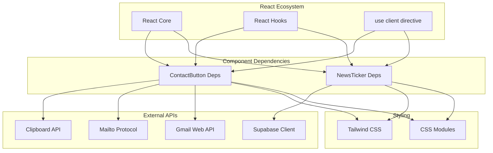

# Interactive Components

<cite>
**Referenced Files in This Document**
- [ContactButton.tsx](file://components/ContactButton.tsx)
- [NewsTicker.tsx](file://components/NewsTicker.tsx)
- [page.tsx](file://app/page.tsx)
- [supabase.ts](file://lib/supabase.ts)
- [email.ts](file://lib/email.ts)
- [supabase.ts](file://types/supabase.ts)
- [globals.css](file://app/globals.css)
</cite>

## Table of Contents
1. [Introduction](#introduction)
2. [Project Structure](#project-structure)
3. [Core Components](#core-components)
4. [Architecture Overview](#architecture-overview)
5. [Detailed Component Analysis](#detailed-component-analysis)
6. [Dependency Analysis](#dependency-analysis)
7. [Performance Considerations](#performance-considerations)
8. [Troubleshooting Guide](#troubleshooting-guide)
9. [Conclusion](#conclusion)

## Introduction
This document provides comprehensive documentation for two interactive UI components: ContactButton and NewsTicker. These components are designed to enhance user engagement by enabling quick contact actions and presenting dynamic content updates. The documentation covers functionality, props, event handling, styling customization, accessibility features, responsive behavior, and integration patterns with external services.

## Project Structure
The components are part of a Next.js application that integrates with Supabase for dynamic content and uses Tailwind CSS for styling. The ContactButton component is rendered on the homepage within the contact section, while the NewsTicker component appears alongside the hero slideshow to showcase newsletter updates.

**Diagram sources**
- [page.tsx:224-256](file://app/page.tsx#L224-L256)
- [ContactButton.tsx:1-58](file://components/ContactButton.tsx#L1-L58)
- [NewsTicker.tsx:1-92](file://components/NewsTicker.tsx#L1-L92)
- [supabase.ts:16-24](file://lib/supabase.ts#L16-L24)
- [globals.css:1-31](file://app/globals.css#L1-L31)

**Section sources**
- [page.tsx:12-42](file://app/page.tsx#L12-L42)
- [globals.css:1-31](file://app/globals.css#L1-L31)

## Core Components
This section documents the primary interactive components and their capabilities.

### ContactButton Component
The ContactButton component provides multiple contact options to users, enabling immediate communication through their preferred email client or by copying contact information.

Key features:
- Opens default mail client with pre-filled recipient and subject
- Opens Gmail web interface with pre-filled recipient and subject
- Copies email address to clipboard with user feedback
- Responsive button layout with hover animations
- Accessible with proper focus states and keyboard navigation

Props:
- None (hardcoded email and subject)

Event handling:
- Click handlers for each contact action
- Clipboard API integration for copy functionality

Styling:
- Tailwind CSS classes for responsive design
- Hover effects with scaling and shadow transitions
- Color scheme aligned with brand identity

Accessibility:
- Proper button semantics
- Focus visibility
- Screen reader friendly labels

Integration:
- Used within the contact section of the homepage
- Leverages browser APIs for native email client integration

### NewsTicker Component
The NewsTicker component displays a rotating list of newsletter updates with smooth transitions and user controls.

Key features:
- Automatic rotation with configurable intervals
- Hover pause functionality
- Navigation dots for manual selection
- Progress indicator during transitions
- Responsive typography with line clamping
- Date formatting for publication timestamps

Props:
- newsletters: Array of RhemaNewsletter objects
- interval?: Number representing transition delay in milliseconds (default: 5000)

Event handling:
- Mouse enter/leave for hover pause
- Click handlers for navigation dots
- useEffect cleanup for timer management

Styling:
- Backdrop blur and transparency effects
- Animated progress indicator
- Responsive typography with line clamping
- Hover states with shadow transitions

Accessibility:
- ARIA labels for navigation controls
- Keyboard navigable dot indicators
- Screen reader compatible content structure

Integration:
- Fetched from Supabase database
- Configurable content through database entries
- Dynamic content management through CMS

**Section sources**
- [ContactButton.tsx:5-58](file://components/ContactButton.tsx#L5-L58)
- [NewsTicker.tsx:6-92](file://components/NewsTicker.tsx#L6-L92)
- [supabase.ts:46-54](file://types/supabase.ts#L46-L54)

## Architecture Overview
The interactive components integrate with the broader application architecture through data fetching, state management, and rendering patterns.

**Diagram sources**
- [page.tsx:21-42](file://app/page.tsx#L21-L42)
- [ContactButton.tsx:10-23](file://components/ContactButton.tsx#L10-L23)
- [supabase.ts:16-24](file://lib/supabase.ts#L16-L24)

The architecture demonstrates a clean separation of concerns:
- Data fetching occurs server-side in the page component
- Component rendering is client-side with interactive behaviors
- External integrations use browser-native APIs
- Type safety ensures data consistency

## Detailed Component Analysis

### ContactButton Component Analysis
The ContactButton component implements a focused interaction pattern for user contact initiation.

**Diagram sources**
- [ContactButton.tsx:5-23](file://components/ContactButton.tsx#L5-L23)

Implementation patterns:
- State management for component state
- Event delegation for click handlers
- Browser API integration for native functionality
- Conditional rendering based on state

Data flow:
- Hardcoded contact information
- User interaction triggers action execution
- Browser handles external application launching

Performance characteristics:
- Minimal state overhead
- Efficient event handler binding
- No external dependencies

Accessibility features:
- Semantic button elements
- Focus management
- Keyboard accessibility
- Screen reader compatibility

### NewsTicker Component Analysis
The NewsTicker component implements a sophisticated carousel pattern with multiple interaction modes.

**Diagram sources**
- [NewsTicker.tsx:11-23](file://components/NewsTicker.tsx#L11-L23)

Implementation patterns:
- React hooks for state and lifecycle management
- useEffect for timer management and cleanup
- Mouse event handlers for hover interactions
- Dynamic styling with CSS-in-JS approach

Animation implementation:
- CSS transitions for opacity changes
- Transform animations for hover effects
- Progress bar animation with duration control
- Smooth content transitions

Data management:
- Props-based newsletter array
- Index-based current item selection
- Dynamic content rendering
- Type-safe data structures

**Section sources**
- [NewsTicker.tsx:11-92](file://components/NewsTicker.tsx#L11-L92)
- [supabase.ts:46-54](file://types/supabase.ts#L46-L54)

### Integration Patterns
Both components demonstrate different integration approaches within the application ecosystem.

**Diagram sources**
- [page.tsx:12-42](file://app/page.tsx#L12-L42)
- [ContactButton.tsx:1-58](file://components/ContactButton.tsx#L1-L58)
- [NewsTicker.tsx:1-92](file://components/NewsTicker.tsx#L1-L92)

## Dependency Analysis
The components have minimal external dependencies, relying primarily on React and browser APIs.

**Diagram sources**
- [ContactButton.tsx:3](file://components/ContactButton.tsx#L3)
- [NewsTicker.tsx:3](file://components/NewsTicker.tsx#L3)
- [supabase.ts:16-24](file://lib/supabase.ts#L16-L24)

Dependency characteristics:
- Zero runtime dependencies beyond React
- Browser API reliance for native functionality
- Supabase integration for data persistence
- Tailwind CSS for styling abstraction

Potential circular dependencies:
- None identified in component dependencies
- Clear separation between data fetching and rendering

## Performance Considerations
Both components are optimized for performance with minimal overhead.

Performance characteristics:
- ContactButton: Single render cycle with efficient event handlers
- NewsTicker: Optimized timer management with proper cleanup
- Both components use client-side rendering for interactivity

Optimization opportunities:
- Memoization for newsletter data arrays
- Debounced event handlers for frequent interactions
- Lazy loading for large content sets
- Virtualization for extensive newsletter collections

Memory management:
- Proper useEffect cleanup prevents memory leaks
- Event listeners are removed on component unmount
- No persistent state beyond necessary component state

## Troubleshooting Guide

### ContactButton Issues
Common problems and solutions:
- **Email client not opening**: Verify browser supports mailto protocol and default email client is configured
- **Gmail web not loading**: Check internet connectivity and Gmail availability
- **Clipboard permission denied**: Ensure site has clipboard permissions enabled
- **Button not responding**: Verify JavaScript is enabled and no ad blockers interfere

Debugging steps:
1. Check browser console for errors
2. Verify email address format
3. Test individual button actions separately
4. Confirm browser supports required APIs

### NewsTicker Issues
Common problems and solutions:
- **Ticker not rotating**: Verify interval prop is set correctly and component has sufficient data
- **Navigation dots not working**: Check newsletter array length and index calculations
- **Hover pause not functioning**: Verify mouse event handlers are attached
- **Progress indicator incorrect**: Review CSS transition timing and interval synchronization

Debugging steps:
1. Log newsletter array length and content
2. Verify useEffect dependencies array
3. Check interval timing calculations
4. Inspect DOM element positioning and styling

### General Troubleshooting
- **Styling issues**: Verify Tailwind CSS is properly configured and compiled
- **Type errors**: Ensure newsletter data matches RhemaNewsletter interface
- **Environment variables**: Check Supabase configuration for data fetching
- **Responsive behavior**: Test component across different viewport sizes

**Section sources**
- [ContactButton.tsx:10-23](file://components/ContactButton.tsx#L10-L23)
- [NewsTicker.tsx:15-23](file://components/NewsTicker.tsx#L15-L23)
- [supabase.ts:16-24](file://lib/supabase.ts#L16-L24)

## Conclusion
The ContactButton and NewsTicker components demonstrate effective patterns for enhancing user interaction and engagement in modern web applications. The ContactButton component provides immediate access to multiple communication channels through native browser integrations, while the NewsTicker component offers an engaging way to present dynamic content updates with smooth animations and intuitive controls.

Both components exhibit strong architectural principles including:
- Clean separation of concerns between data and presentation
- Minimal dependencies for optimal performance
- Comprehensive accessibility support
- Responsive design patterns
- Proper state management and cleanup

The integration with Supabase enables dynamic content management, allowing administrators to update newsletter content without code changes. The components serve as excellent examples of how to implement interactive UI elements that enhance user experience while maintaining code quality and performance standards.

Future enhancements could include:
- Enhanced animation libraries for smoother transitions
- Accessibility improvements for screen readers
- Performance optimizations for large content sets
- Additional customization options for styling
- Analytics integration for user interaction tracking