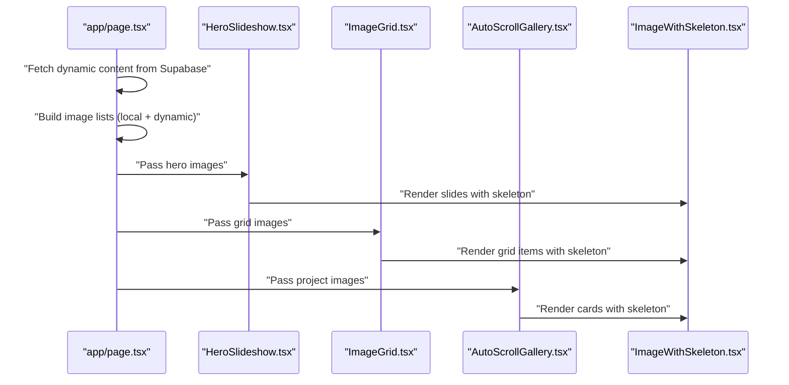
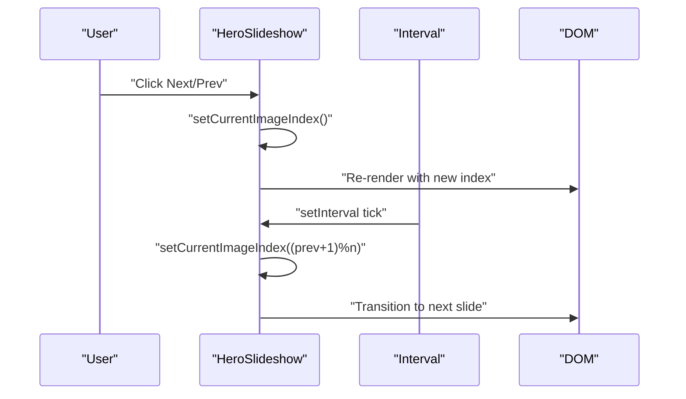
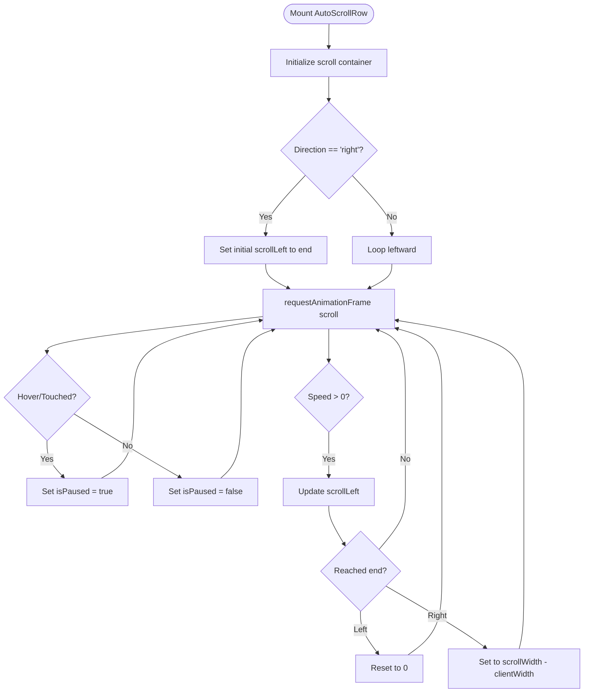
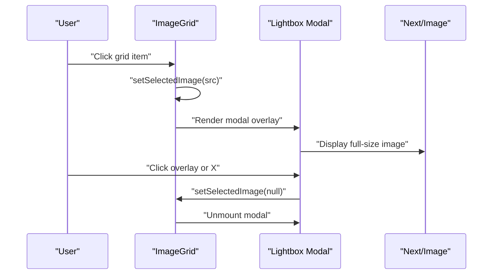
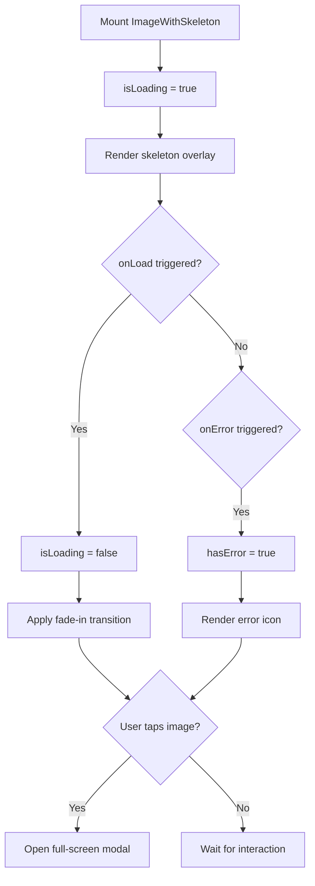
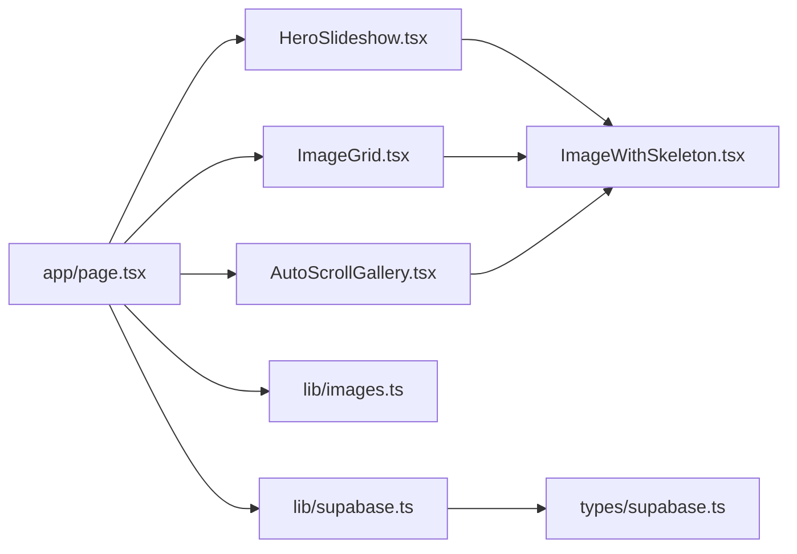

# Media Components

<cite>
**Referenced Files in This Document**
- [HeroSlideshow.tsx](file://components/HeroSlideshow.tsx)
- [AutoScrollGallery.tsx](file://components/AutoScrollGallery.tsx)
- [ImageGrid.tsx](file://components/ImageGrid.tsx)
- [ImageWithSkeleton.tsx](file://components/ImageWithSkeleton.tsx)
- [images.ts](file://lib/images.ts)
- [supabase.ts](file://lib/supabase.ts)
- [page.tsx](file://app/page.tsx)
- [supabase.ts (types)](file://types/supabase.ts)
</cite>

## Table of Contents
1. [Introduction](#introduction)
2. [Project Structure](#project-structure)
3. [Core Components](#core-components)
4. [Architecture Overview](#architecture-overview)
5. [Detailed Component Analysis](#detailed-component-analysis)
6. [Dependency Analysis](#dependency-analysis)
7. [Performance Considerations](#performance-considerations)
8. [Troubleshooting Guide](#troubleshooting-guide)
9. [Conclusion](#conclusion)
10. [Appendices](#appendices)

## Introduction
This document provides comprehensive documentation for media presentation components focused on showcasing visual content effectively. It covers four primary components:
- HeroSlideshow: A responsive hero carousel with automatic rotation, manual controls, and smooth transitions.
- AutoScrollGallery: A three-row gallery with auto-scrolling rows and user interaction support.
- ImageGrid: A responsive grid layout for organizing multiple media items with optional lightbox modal.
- ImageWithSkeleton: A robust image loader with skeleton placeholders, error handling, and full-screen lightbox.

It explains image handling capabilities, responsive design patterns, performance optimizations, accessibility considerations, and integration guidelines with the Supabase image storage system.

## Project Structure
The media components are located under the components directory and are integrated into the main application page. Supporting utilities for local image discovery and Supabase client initialization reside in lib and types directories.

```mermaid
graph TB
subgraph "App Layer"
Page["app/page.tsx"]
end
subgraph "Components"
Hero["HeroSlideshow.tsx"]
Auto["AutoScrollGallery.tsx"]
Grid["ImageGrid.tsx"]
ImgSk["ImageWithSkeleton.tsx"]
end
subgraph "Lib Utilities"
Images["lib/images.ts"]
Supabase["lib/supabase.ts"]
end
subgraph "Types"
Types["types/supabase.ts"]
end
Page --> Hero
Page --> Auto
Page --> Grid
Hero --> ImgSk
Grid --> ImgSk
Page --> Images
Page --> Supabase
Supabase --> Types
```

**Diagram sources**
- [page.tsx:12-788](file://app/page.tsx#L12-L788)
- [HeroSlideshow.tsx:1-96](file://components/HeroSlideshow.tsx#L1-L96)
- [AutoScrollGallery.tsx:1-101](file://components/AutoScrollGallery.tsx#L1-L101)
- [ImageGrid.tsx:1-64](file://components/ImageGrid.tsx#L1-L64)
- [ImageWithSkeleton.tsx:1-121](file://components/ImageWithSkeleton.tsx#L1-L121)
- [images.ts:1-52](file://lib/images.ts#L1-L52)
- [supabase.ts:1-25](file://lib/supabase.ts#L1-L25)
- [supabase.ts (types):1-113](file://types/supabase.ts#L1-L113)

**Section sources**
- [page.tsx:12-788](file://app/page.tsx#L12-L788)
- [HeroSlideshow.tsx:1-96](file://components/HeroSlideshow.tsx#L1-L96)
- [AutoScrollGallery.tsx:1-101](file://components/AutoScrollGallery.tsx#L1-L101)
- [ImageGrid.tsx:1-64](file://components/ImageGrid.tsx#L1-L64)
- [ImageWithSkeleton.tsx:1-121](file://components/ImageWithSkeleton.tsx#L1-L121)
- [images.ts:1-52](file://lib/images.ts#L1-L52)
- [supabase.ts:1-25](file://lib/supabase.ts#L1-L25)
- [supabase.ts (types):1-113](file://types/supabase.ts#L1-L113)

## Core Components
This section summarizes each component’s purpose, props, rendering behavior, and integration points.

- HeroSlideshow
  - Purpose: Displays a hero carousel with automatic rotation and manual controls.
  - Props: images: string[]
  - Behavior: Cycles through images every fixed interval; supports previous/next navigation and dot indicators.
  - Rendering: Uses ImageWithSkeleton for each slide with gradient overlay and priority for the first image.

- AutoScrollGallery
  - Purpose: Presents images in three auto-scrolling rows with alternating directions and hover pause.
  - Props: images: string[]
  - Behavior: Creates three rows; each row scrolls continuously; duplicates images to ensure seamless looping; pauses on hover/touch.
  - Rendering: Uses ImageWithSkeleton inside each card with consistent sizing and shadows.

- ImageGrid
  - Purpose: Responsive grid of media items with click-to-enlarge modal.
  - Props: images: string[], title?: string, description?: string
  - Behavior: Renders a responsive grid; clicking an item opens a full-screen lightbox using Next.js Image.
  - Rendering: Uses ImageWithSkeleton with aspect-video and hover animations.

- ImageWithSkeleton
  - Purpose: Robust image loader with skeleton placeholder, error state, and full-screen lightbox.
  - Props: Extends Next.js ImageProps; adds containerClassName and maintains standard Image props.
  - Behavior: Shows animated pulse skeleton until image loads; displays error icon on failure; supports full-screen preview.
  - Rendering: Conditional overlays and transitions for smooth UX.

**Section sources**
- [HeroSlideshow.tsx:7-32](file://components/HeroSlideshow.tsx#L7-L32)
- [AutoScrollGallery.tsx:6-23](file://components/AutoScrollGallery.tsx#L6-L23)
- [ImageGrid.tsx:7-19](file://components/ImageGrid.tsx#L7-L19)
- [ImageWithSkeleton.tsx:6-20](file://components/ImageWithSkeleton.tsx#L6-L20)

## Architecture Overview
The media components are orchestrated from the main page, which prepares image lists from local assets and integrates dynamic content from Supabase. The HeroSlideshow and ImageGrid components rely on ImageWithSkeleton for consistent image loading behavior. AutoScrollGallery composes multiple AutoScrollRow instances to form a three-row auto-scroll experience.



**Diagram sources**
- [page.tsx:12-788](file://app/page.tsx#L12-L788)
- [HeroSlideshow.tsx:43-49](file://components/HeroSlideshow.tsx#L43-L49)
- [ImageGrid.tsx:28-34](file://components/ImageGrid.tsx#L28-L34)
- [AutoScrollGallery.tsx:74-81](file://components/AutoScrollGallery.tsx#L74-L81)
- [ImageWithSkeleton.tsx:68-87](file://components/ImageWithSkeleton.tsx#L68-L87)

## Detailed Component Analysis

### HeroSlideshow
- Purpose: Hero carousel with automatic rotation and manual controls.
- Props:
  - images: string[] — Array of image URLs or paths.
- Behavior:
  - Automatic rotation: Interval updates the current index cyclically.
  - Manual controls: Previous/next buttons adjust the index; navigation dots jump to specific slides.
  - Transition: Fade transition between slides with opacity easing.
- Accessibility:
  - Buttons include aria-label attributes for screen readers.
- Styling and Responsiveness:
  - Container uses responsive height classes; gradient overlay improves text readability.
  - Controls are visible by default and fade in on hover for desktop.



**Diagram sources**
- [HeroSlideshow.tsx:14-30](file://components/HeroSlideshow.tsx#L14-L30)
- [HeroSlideshow.tsx:59-78](file://components/HeroSlideshow.tsx#L59-L78)
- [HeroSlideshow.tsx:81-92](file://components/HeroSlideshow.tsx#L81-L92)

**Section sources**
- [HeroSlideshow.tsx:7-32](file://components/HeroSlideshow.tsx#L7-L32)
- [HeroSlideshow.tsx:34-96](file://components/HeroSlideshow.tsx#L34-L96)

### AutoScrollGallery
- Purpose: Three-row auto-scrolling gallery with alternating directions and hover pause.
- Props:
  - images: string[]
  - direction?: 'left' | 'right' — Defaults to 'left'.
  - speed?: number — Defaults to 1.
- Behavior:
  - Row composition: Images are split into three roughly equal rows.
  - Auto-scroll: requestAnimationFrame drives horizontal scrolling; wraps around for seamless loop.
  - Interaction: Pauses on mouse enter/touch start; resumes on leave/end.
- Rendering:
  - Cards sized with fixed width and height; shadows and rounded corners for depth.
  - Duplicated images across three copies to ensure continuous looping.



**Diagram sources**
- [AutoScrollGallery.tsx:12-84](file://components/AutoScrollGallery.tsx#L12-L84)
- [AutoScrollGallery.tsx:86-101](file://components/AutoScrollGallery.tsx#L86-L101)

**Section sources**
- [AutoScrollGallery.tsx:6-23](file://components/AutoScrollGallery.tsx#L6-L23)
- [AutoScrollGallery.tsx:86-101](file://components/AutoScrollGallery.tsx#L86-L101)

### ImageGrid
- Purpose: Responsive grid of media items with optional title/description and lightbox modal.
- Props:
  - images: string[]
  - title?: string
  - description?: string
- Behavior:
  - Responsive grid: 1–4 columns depending on viewport.
  - Click-to-enlarge: Opens a full-screen modal with Next.js Image.
- Accessibility:
  - Modal includes close button with aria-label.
- Styling and Responsiveness:
  - aspect-video ensures consistent card proportions.
  - Hover effects enhance interactivity.



**Diagram sources**
- [ImageGrid.tsx:13-64](file://components/ImageGrid.tsx#L13-L64)
- [ImageGrid.tsx:40-61](file://components/ImageGrid.tsx#L40-L61)

**Section sources**
- [ImageGrid.tsx:7-19](file://components/ImageGrid.tsx#L7-L19)
- [ImageGrid.tsx:21-37](file://components/ImageGrid.tsx#L21-L37)
- [ImageGrid.tsx:40-61](file://components/ImageGrid.tsx#L40-L61)

### ImageWithSkeleton
- Purpose: Universal image loader with skeleton, error handling, and full-screen lightbox.
- Props:
  - Extends Next.js ImageProps; adds containerClassName.
- Behavior:
  - Loading state: Animated pulse skeleton overlay until onLoad.
  - Error state: Static error icon overlay on onError.
  - Full-screen preview: Tappable area opens a full-screen modal with Next.js Image.
- Accessibility:
  - Skeleton and error overlays are aria-hidden; full-screen modal includes close button with aria-label.
- Styling and Responsiveness:
  - Supports fill or explicit width/height; transitions for smooth reveal.



**Diagram sources**
- [ImageWithSkeleton.tsx:10-121](file://components/ImageWithSkeleton.tsx#L10-L121)
- [ImageWithSkeleton.tsx:90-118](file://components/ImageWithSkeleton.tsx#L90-L118)

**Section sources**
- [ImageWithSkeleton.tsx:6-20](file://components/ImageWithSkeleton.tsx#L6-L20)
- [ImageWithSkeleton.tsx:42-88](file://components/ImageWithSkeleton.tsx#L42-L88)
- [ImageWithSkeleton.tsx:90-118](file://components/ImageWithSkeleton.tsx#L90-L118)

## Dependency Analysis
- Component dependencies:
  - HeroSlideshow depends on ImageWithSkeleton for individual slides.
  - AutoScrollGallery composes AutoScrollRow and ImageWithSkeleton for each card.
  - ImageGrid depends on ImageWithSkeleton for grid items and Next.js Image for the modal.
  - ImageWithSkeleton is a standalone component used across others.
- Data sources:
  - Local images: Discovered via lib/images.ts from public/img.
  - Dynamic images: Retrieved from Supabase tables (service image URLs and folder-based images).
- Integration points:
  - app/page.tsx orchestrates image preparation and passes arrays to components.
  - lib/supabase.ts initializes the Supabase client and exposes configuration checks.



**Diagram sources**
- [page.tsx:12-788](file://app/page.tsx#L12-L788)
- [HeroSlideshow.tsx:43-49](file://components/HeroSlideshow.tsx#L43-L49)
- [ImageGrid.tsx:28-34](file://components/ImageGrid.tsx#L28-L34)
- [AutoScrollGallery.tsx:74-81](file://components/AutoScrollGallery.tsx#L74-L81)
- [images.ts:28-52](file://lib/images.ts#L28-L52)
- [supabase.ts:16-24](file://lib/supabase.ts#L16-L24)
- [supabase.ts (types):13-20](file://types/supabase.ts#L13-L20)

**Section sources**
- [page.tsx:12-788](file://app/page.tsx#L12-L788)
- [images.ts:28-52](file://lib/images.ts#L28-L52)
- [supabase.ts:16-24](file://lib/supabase.ts#L16-L24)
- [supabase.ts (types):13-20](file://types/supabase.ts#L13-L20)

## Performance Considerations
- Lazy loading and priority:
  - HeroSlideshow sets priority on the first slide to improve Core Web Vitals.
  - ImageWithSkeleton defers rendering until needed and uses efficient skeleton overlays.
- Infinite scrolling and auto-scroll:
  - AutoScrollGallery duplicates images to avoid visible seams; requestAnimationFrame ensures smooth animation.
  - Rows pause on hover/touch to reduce unnecessary computation.
- Responsive sizing:
  - ImageGrid uses sizes prop for appropriate image selection per breakpoint.
  - HeroSlideshow and ImageGrid use aspect ratios and fill-based layouts for consistent rendering.
- Memory and cleanup:
  - HeroSlideshow clears intervals on unmount.
  - AutoScrollGallery cancels animation frames on unmount.
- Asset management:
  - Local images are collected via recursive discovery; dynamic images come from Supabase tables.

[No sources needed since this section provides general guidance]

## Troubleshooting Guide
- Slideshow does not advance automatically:
  - Verify images prop is non-empty and interval is active.
  - Check that the component is mounted client-side and timers are not blocked.
- Auto-scroll stops unexpectedly:
  - Confirm hover/touch events are not persistently pausing the animation.
  - Ensure scroll container references are valid and animation frame is scheduled.
- Grid items not displaying:
  - Confirm image URLs are accessible and ImageWithSkeleton receives valid props.
  - Check for network errors and error overlays.
- Full-screen lightbox not opening:
  - Ensure ImageWithSkeleton is not in error/loading state.
  - Verify click handlers and modal mounting/unmounting.
- Supabase integration warnings:
  - Missing environment variables trigger warnings; confirm NEXT_PUBLIC_SUPABASE_URL and NEXT_PUBLIC_SUPABASE_ANON_KEY are set.

**Section sources**
- [HeroSlideshow.tsx:14-22](file://components/HeroSlideshow.tsx#L14-L22)
- [AutoScrollGallery.tsx:24-59](file://components/AutoScrollGallery.tsx#L24-L59)
- [ImageWithSkeleton.tsx:76-84](file://components/ImageWithSkeleton.tsx#L76-L84)
- [supabase.ts:10-13](file://lib/supabase.ts#L10-L13)

## Conclusion
The media components provide a cohesive, accessible, and performant way to present visual content. They leverage skeleton loaders, responsive layouts, and smooth transitions to deliver an excellent user experience. Integration with local asset discovery and Supabase enables flexible content sourcing for diverse use cases.

[No sources needed since this section summarizes without analyzing specific files]

## Appendices

### Configuration Options and Props
- HeroSlideshow
  - images: string[] — Required.
- AutoScrollGallery
  - images: string[] — Required.
  - direction?: 'left' | 'right' — Optional.
  - speed?: number — Optional.
- ImageGrid
  - images: string[] — Required.
  - title?: string — Optional.
  - description?: string — Optional.
- ImageWithSkeleton
  - Extends Next.js ImageProps; adds containerClassName.

**Section sources**
- [HeroSlideshow.tsx:7-9](file://components/HeroSlideshow.tsx#L7-L9)
- [AutoScrollGallery.tsx:6-10](file://components/AutoScrollGallery.tsx#L6-L10)
- [ImageGrid.tsx:7-11](file://components/ImageGrid.tsx#L7-L11)
- [ImageWithSkeleton.tsx:6-8](file://components/ImageWithSkeleton.tsx#L6-L8)

### Styling Approaches
- HeroSlideshow: Gradient overlays, backdrop blur controls, and responsive heights.
- AutoScrollGallery: Consistent card sizing, shadows, and seamless looping via duplication.
- ImageGrid: Responsive grid classes, aspect ratios, and hover transforms.
- ImageWithSkeleton: Pulse animations, error icons, and full-screen modal layouts.

**Section sources**
- [HeroSlideshow.tsx:34-96](file://components/HeroSlideshow.tsx#L34-L96)
- [AutoScrollGallery.tsx:61-84](file://components/AutoScrollGallery.tsx#L61-L84)
- [ImageGrid.tsx:21-37](file://components/ImageGrid.tsx#L21-L37)
- [ImageWithSkeleton.tsx:42-118](file://components/ImageWithSkeleton.tsx#L42-L118)

### Accessibility Considerations
- Buttons include aria-label attributes for screen readers.
- Modal overlays include close buttons with aria-label.
- Skeleton and error overlays are marked as aria-hidden to avoid confusion.

**Section sources**
- [HeroSlideshow.tsx:61-67](file://components/HeroSlideshow.tsx#L61-L67)
- [HeroSlideshow.tsx:72-78](file://components/HeroSlideshow.tsx#L72-L78)
- [HeroSlideshow.tsx:88-90](file://components/HeroSlideshow.tsx#L88-L90)
- [ImageGrid.tsx:52-57](file://components/ImageGrid.tsx#L52-L57)
- [ImageWithSkeleton.tsx:52](file://components/ImageWithSkeleton.tsx#L52)
- [ImageWithSkeleton.tsx:99](file://components/ImageWithSkeleton.tsx#L99)

### Integration Guidelines with Supabase
- Environment setup:
  - Ensure NEXT_PUBLIC_SUPABASE_URL and NEXT_PUBLIC_SUPABASE_ANON_KEY are configured.
- Data model:
  - Use RhemaService, RhemaClient, RhemaTeam, RhemaCompetition, RhemaNewsletter, and RhemaContent types.
- Dynamic image sources:
  - Combine service.image_urls with folder-based images from lib/images.ts for flexible content assembly.
- Client initialization:
  - Import supabase and isSupabaseConfigured from lib/supabase.ts to conditionally fetch data.

**Section sources**
- [supabase.ts:7-19](file://lib/supabase.ts#L7-L19)
- [supabase.ts:22-24](file://lib/supabase.ts#L22-L24)
- [supabase.ts (types):13-54](file://types/supabase.ts#L13-L54)
- [page.tsx:13-42](file://app/page.tsx#L13-L42)
- [page.tsx:125-138](file://app/page.tsx#L125-L138)
- [images.ts:28-45](file://lib/images.ts#L28-L45)