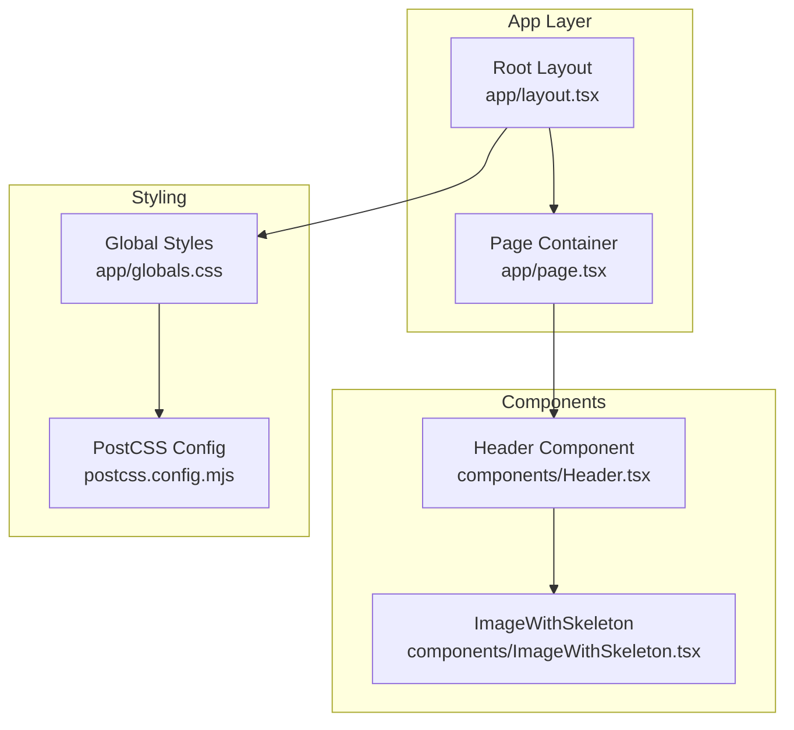
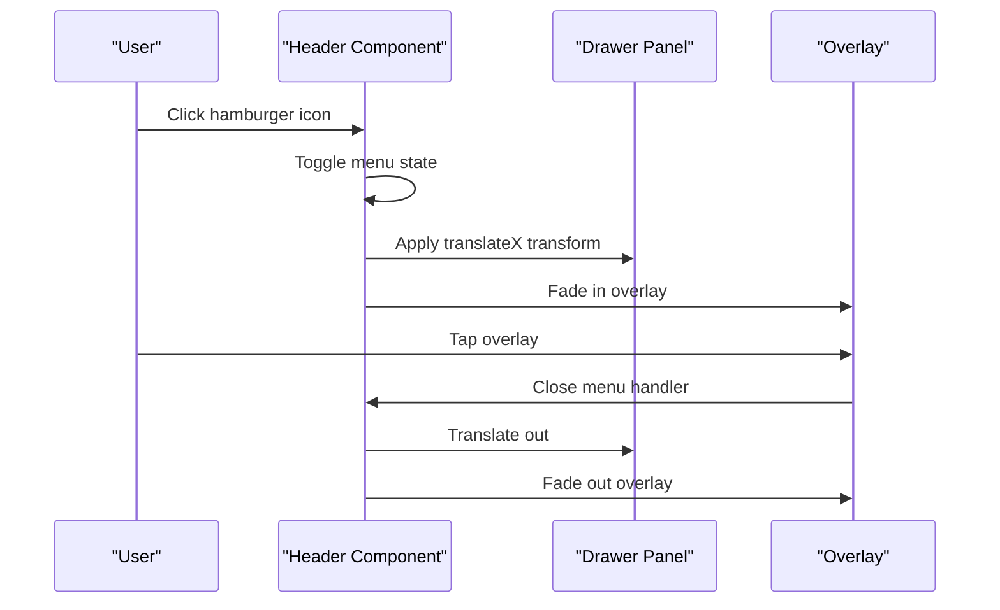
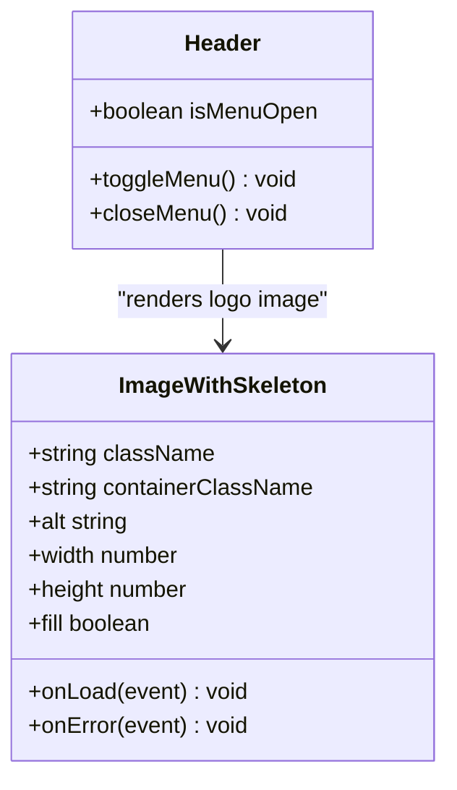
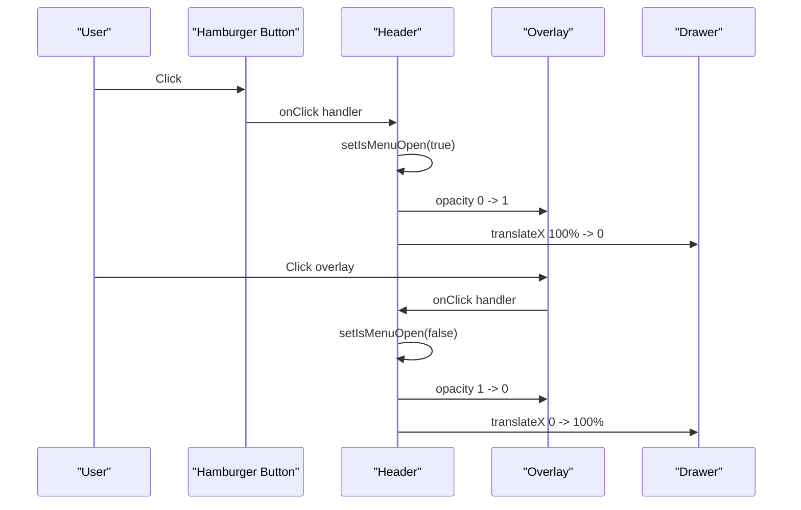
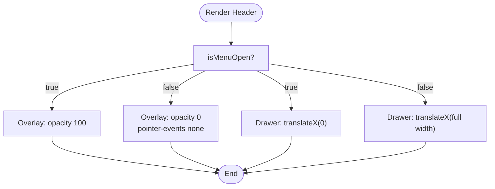
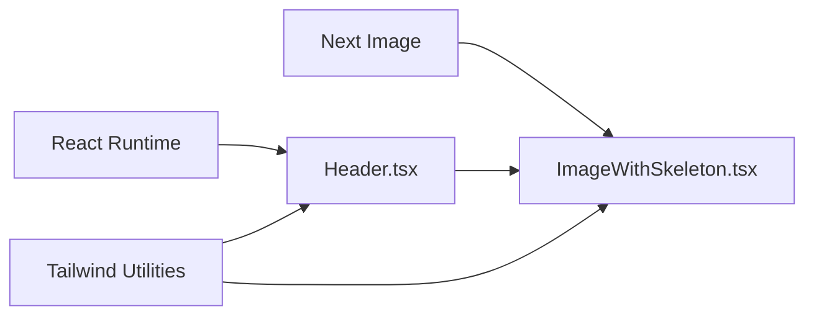

# Navigation Components

<cite>
**Referenced Files in This Document**
- [Header.tsx](file://components/Header.tsx)
- [ImageWithSkeleton.tsx](file://components/ImageWithSkeleton.tsx)
- [layout.tsx](file://app/layout.tsx)
- [globals.css](file://app/globals.css)
- [page.tsx](file://app/page.tsx)
- [package.json](file://package.json)
- [postcss.config.mjs](file://postcss.config.mjs)
</cite>

## Table of Contents
1. [Introduction](#introduction)
2. [Project Structure](#project-structure)
3. [Core Components](#core-components)
4. [Architecture Overview](#architecture-overview)
5. [Detailed Component Analysis](#detailed-component-analysis)
6. [Dependency Analysis](#dependency-analysis)
7. [Performance Considerations](#performance-considerations)
8. [Troubleshooting Guide](#troubleshooting-guide)
9. [Conclusion](#conclusion)
10. [Appendices](#appendices)

## Introduction
This document provides comprehensive documentation for the navigation component system, with a primary focus on the Header component that implements responsive navigation with a mobile hamburger menu. It explains state management for menu toggling, responsive design patterns using Tailwind CSS breakpoints, and the mobile sidebar drawer implementation. It also covers the navigation structure (logo area, desktop navigation links, social media integration), prop configuration, styling approaches, accessibility features (ARIA labels), and integration patterns with other components. Finally, it includes examples of customization options, animation implementations, and responsive behavior across different screen sizes.

## Project Structure
The navigation system centers around the Header component, which integrates with a lightweight image loading component and global styles. The layout composes the Header at the top of the page and applies global Tailwind-based styling.

**Diagram sources**
- [layout.tsx:24-41](file://app/layout.tsx#L24-L41)
- [page.tsx:10](file://app/page.tsx#L10)
- [Header.tsx:1-136](file://components/Header.tsx#L1-L136)
- [ImageWithSkeleton.tsx:1-121](file://components/ImageWithSkeleton.tsx#L1-L121)
- [globals.css:1-31](file://app/globals.css#L1-L31)
- [postcss.config.mjs:1-7](file://postcss.config.mjs#L1-L7)

**Section sources**
- [layout.tsx:24-41](file://app/layout.tsx#L24-L41)
- [page.tsx:10](file://app/page.tsx#L10)
- [Header.tsx:1-136](file://components/Header.tsx#L1-L136)
- [ImageWithSkeleton.tsx:1-121](file://components/ImageWithSkeleton.tsx#L1-L121)
- [globals.css:1-31](file://app/globals.css#L1-L31)
- [postcss.config.mjs:1-7](file://postcss.config.mjs#L1-L7)

## Core Components
- Header: Implements responsive navigation with a mobile hamburger menu, desktop navigation links, social media integration, and a mobile sidebar drawer. Uses React state for menu toggling and Tailwind CSS for responsive styling.
- ImageWithSkeleton: Provides a skeleton loader and lightbox behavior for images, integrated into the logo area.

Key responsibilities:
- Manage mobile menu visibility state and transitions.
- Render desktop navigation links and social media icons.
- Provide a mobile drawer overlay and content panel with animated transitions.
- Integrate with global Tailwind configuration and theme tokens.

**Section sources**
- [Header.tsx:7-136](file://components/Header.tsx#L7-L136)
- [ImageWithSkeleton.tsx:10-121](file://components/ImageWithSkeleton.tsx#L10-L121)

## Architecture Overview
The Header component is a client-side React component that orchestrates:
- State: A boolean flag controls the visibility of the mobile drawer.
- Rendering: Desktop navigation is hidden on small screens; mobile menu button and drawer appear below the medium breakpoint.
- Styling: Tailwind utilities define responsive layouts, transitions, and animations.
- Accessibility: ARIA labels and keyboard-friendly focus states are included.

**Diagram sources**
- [Header.tsx:8-16](file://components/Header.tsx#L8-L16)
- [Header.tsx:85-92](file://components/Header.tsx#L85-L92)

## Detailed Component Analysis

### Header Component
The Header component encapsulates the entire navigation bar, including:
- Logo area with an image placeholder and brand text.
- Desktop navigation links rendered only on medium-sized screens and larger.
- Social media link with an SVG icon.
- Mobile CBT exam link and a hamburger menu button.
- A mobile drawer overlay and drawer content panel with animated transitions.

State management:
- A local state variable tracks whether the mobile drawer is open.
- Two handlers toggle and close the drawer.

Responsive behavior:
- Desktop navigation is hidden on small screens and shown on medium screens and up.
- The mobile drawer appears below the medium breakpoint.
- Breakpoints used: md (medium) and xs (extra small).

Accessibility:
- The hamburger button includes an ARIA label for assistive technologies.
- Drawer content uses semantic headings and links with hover/focus states.

Animation and transitions:
- Overlay opacity transitions smoothly.
- Drawer slides in/out using transforms with easing and duration.
- Links and buttons include hover transitions for color and shadow effects.

Integration:
- The Header is imported and rendered by the page container.
- The logo area uses the ImageWithSkeleton component for improved UX during image loading.

Customization examples:
- Adjust colors by editing Tailwind color classes or theme tokens.
- Modify breakpoint thresholds by changing md/xs utilities.
- Add new navigation items by extending the lists inside the component.
- Change animation timing by adjusting transition durations and easing classes.

**Section sources**
- [Header.tsx:7-136](file://components/Header.tsx#L7-L136)
- [page.tsx:10](file://app/page.tsx#L10)

#### Class Diagram: Header and Dependencies

**Diagram sources**
- [Header.tsx:23-29](file://components/Header.tsx#L23-L29)
- [ImageWithSkeleton.tsx:10-20](file://components/ImageWithSkeleton.tsx#L10-L20)

#### Sequence Diagram: Mobile Drawer Interactions

**Diagram sources**
- [Header.tsx:71-79](file://components/Header.tsx#L71-L79)
- [Header.tsx:85-92](file://components/Header.tsx#L85-L92)

#### Flowchart: Drawer Visibility Logic

**Diagram sources**
- [Header.tsx:85-92](file://components/Header.tsx#L85-L92)

### ImageWithSkeleton Component
The ImageWithSkeleton component enhances the logo area by:
- Showing a skeleton loader while the image loads.
- Handling errors gracefully with an icon.
- Providing a full-screen lightbox on click for larger viewing.

Integration with Header:
- Used in the logo area to improve perceived performance and UX.

**Section sources**
- [ImageWithSkeleton.tsx:10-121](file://components/ImageWithSkeleton.tsx#L10-L121)
- [Header.tsx:23-29](file://components/Header.tsx#L23-L29)

### Global Styling and Tailwind Configuration
- The project uses Tailwind v4 via PostCSS plugin.
- Global CSS defines theme tokens for background, foreground, and brand colors.
- Fonts are configured in the root layout and applied globally.

Responsive patterns:
- md breakpoint hides/shows desktop navigation.
- xs breakpoint reveals the CBT exam link on extra-small screens.

**Section sources**
- [postcss.config.mjs:1-7](file://postcss.config.mjs#L1-7)
- [globals.css:1-31](file://app/globals.css#L1-L31)
- [layout.tsx:6-14](file://app/layout.tsx#L6-L14)

## Dependency Analysis
The navigation system relies on:
- React state hooks for client-side interactivity.
- Next.js Image component for optimized image rendering.
- Tailwind CSS utilities for responsive design and transitions.
- SVG icons for social media and UI affordances.

**Diagram sources**
- [Header.tsx:3-5](file://components/Header.tsx#L3-L5)
- [ImageWithSkeleton.tsx:3-4](file://components/ImageWithSkeleton.tsx#L3-L4)
- [globals.css:1](file://app/globals.css#L1)

**Section sources**
- [Header.tsx:3-5](file://components/Header.tsx#L3-L5)
- [ImageWithSkeleton.tsx:3-4](file://components/ImageWithSkeleton.tsx#L3-L4)
- [globals.css:1](file://app/globals.css#L1)

## Performance Considerations
- Client-side state management keeps the drawer toggling smooth without server round-trips.
- Tailwind utilities are scoped to the component, minimizing global style impact.
- Image optimization via Next.js Image reduces bandwidth and improves load times.
- CSS transitions are hardware-accelerated via transforms and opacity changes.

[No sources needed since this section provides general guidance]

## Troubleshooting Guide
Common issues and resolutions:
- Drawer does not close when clicking links: Ensure the close handler is attached to each link’s click event.
- Overlay not clickable: Verify the overlay element has pointer events enabled when visible.
- ARIA label not announced: Confirm the aria-label attribute is present on the hamburger button.
- Social media icon not visible: Check the SVG path and fill classes are correctly applied.
- Responsive breakpoints not working: Confirm Tailwind’s md/xs utilities are used consistently.

**Section sources**
- [Header.tsx:74](file://components/Header.tsx#L74)
- [Header.tsx:86-88](file://components/Header.tsx#L86-L88)
- [Header.tsx:103-121](file://components/Header.tsx#L103-L121)

## Conclusion
The Header component delivers a robust, accessible, and visually consistent navigation experience across devices. Its state-driven mobile drawer, responsive design with Tailwind breakpoints, and integrated image loading create a polished user interface. The modular architecture allows straightforward customization of colors, content, and animations while maintaining accessibility and performance.

[No sources needed since this section summarizes without analyzing specific files]

## Appendices

### Prop Configuration and Customization
- Logo area: Customize image source, dimensions, and styling by adjusting props passed to ImageWithSkeleton.
- Desktop links: Extend or modify the list of navigation items within the desktop nav container.
- Social media: Add or update external links and icons within the desktop and mobile drawer sections.
- Drawer content: Add new menu entries or adjust styling classes for spacing and typography.
- Animations: Adjust transition durations and easing classes to match brand preferences.

[No sources needed since this section provides general guidance]