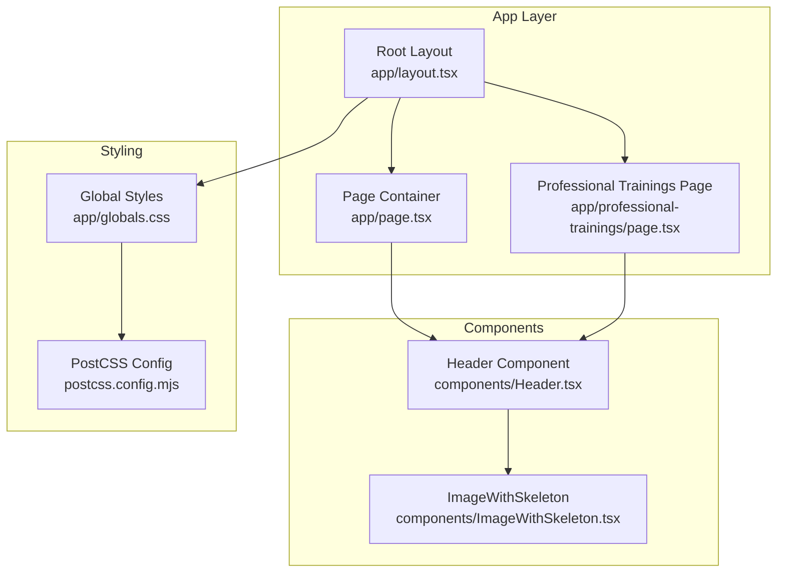
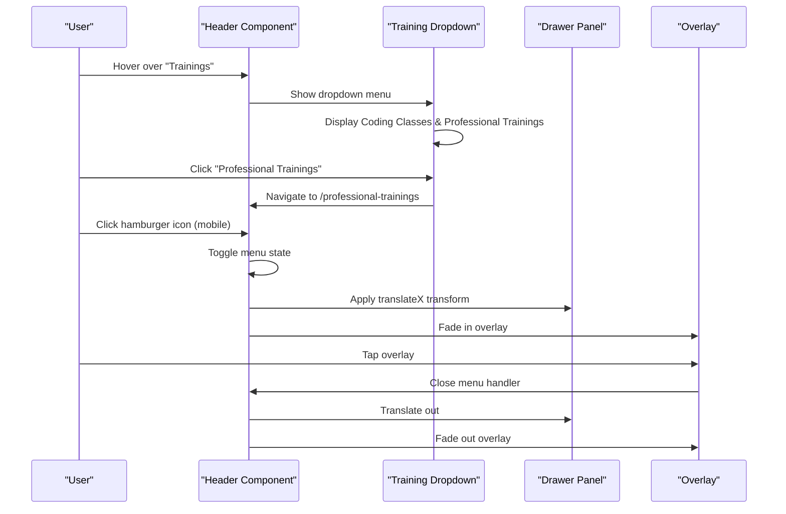
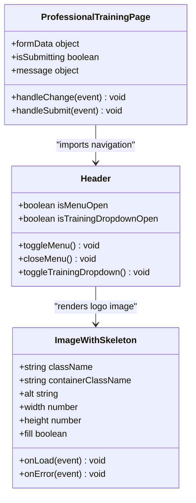
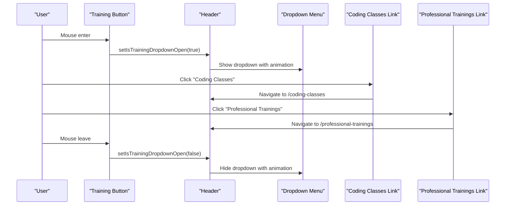
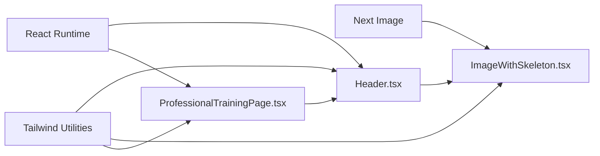

# Navigation Components

<cite>
**Referenced Files in This Document**
- [Header.tsx](file://components/Header.tsx)
- [ImageWithSkeleton.tsx](file://components/ImageWithSkeleton.tsx)
- [layout.tsx](file://app/layout.tsx)
- [page.tsx](file://app/page.tsx)
- [professional-trainings/page.tsx](file://app/professional-trainings/page.tsx)
- [globals.css](file://app/globals.css)
- [postcss.config.mjs](file://postcss.config.mjs)
</cite>

## Update Summary
**Changes Made**
- Updated Header component with enhanced training dropdown menu featuring Professional Trainings link
- Added comprehensive Professional Trainings page with registration functionality
- Enhanced homepage promotional content with direct links to professional training registration
- Expanded navigation structure with categorized training programs (Coding Classes vs Professional Trainings)

## Table of Contents
1. [Introduction](#introduction)
2. [Project Structure](#project-structure)
3. [Core Components](#core-components)
4. [Architecture Overview](#architecture-overview)
5. [Detailed Component Analysis](#detailed-component-analysis)
6. [Dependency Analysis](#dependency-analysis)
7. [Performance Considerations](#performance-considerations)
8. [Troubleshooting Guide](#troubleshooting-guide)
9. [Conclusion](#conclusion)
10. [Appendices](#appendices)

## Introduction
This document provides comprehensive documentation for the navigation component system, with a primary focus on the Header component that implements responsive navigation with a mobile hamburger menu and enhanced training program categorization. It explains state management for menu toggling, responsive design patterns using Tailwind CSS breakpoints, and the mobile sidebar drawer implementation. The system now features a sophisticated training dropdown menu that separates student-focused coding classes from professional development trainings, along with integrated registration capabilities.

## Project Structure
The navigation system centers around the enhanced Header component, which integrates with a lightweight image loading component and global styles. The layout composes the Header at the top of the page and applies global Tailwind-based styling. The system now includes a dedicated Professional Trainings page with comprehensive registration functionality.

**Diagram sources**
- [layout.tsx:24-41](file://app/layout.tsx#L24-L41)
- [page.tsx:10](file://app/page.tsx#L10)
- [Header.tsx:1-189](file://components/Header.tsx#L1-L189)
- [ImageWithSkeleton.tsx:1-121](file://components/ImageWithSkeleton.tsx#L1-L121)
- [professional-trainings/page.tsx:1-400](file://app/professional-trainings/page.tsx#L1-L400)
- [globals.css:1-31](file://app/globals.css#L1-L31)
- [postcss.config.mjs:1-7](file://postcss.config.mjs#L1-7)

**Section sources**
- [layout.tsx:24-41](file://app/layout.tsx#L24-L41)
- [page.tsx:10](file://app/page.tsx#L10)
- [Header.tsx:1-189](file://components/Header.tsx#L1-L189)
- [ImageWithSkeleton.tsx:1-121](file://components/ImageWithSkeleton.tsx#L1-L121)
- [professional-trainings/page.tsx:1-400](file://app/professional-trainings/page.tsx#L1-L400)
- [globals.css:1-31](file://app/globals.css#L1-L31)
- [postcss.config.mjs:1-7](file://postcss.config.mjs#L1-7)

## Core Components
- **Header**: Implements responsive navigation with a mobile hamburger menu, desktop navigation links, social media integration, and an enhanced training dropdown menu. Uses React state for menu toggling and Tailwind CSS for responsive styling.
- **ImageWithSkeleton**: Provides a skeleton loader and lightbox behavior for images, integrated into the logo area.
- **Professional Training Page**: Comprehensive registration interface for professional development programs with form validation and submission handling.

Key responsibilities:
- Manage mobile menu visibility state and transitions.
- Render desktop navigation links with categorized training options.
- Provide a mobile drawer overlay and content panel with animated transitions.
- Handle training dropdown menu interactions with hover states.
- Integrate with global Tailwind configuration and theme tokens.

**Section sources**
- [Header.tsx:7-189](file://components/Header.tsx#L7-L189)
- [ImageWithSkeleton.tsx:10-121](file://components/ImageWithSkeleton.tsx#L10-L121)
- [professional-trainings/page.tsx:8-400](file://app/professional-trainings/page.tsx#L8-L400)

## Architecture Overview
The Header component is a client-side React component that orchestrates:
- **State Management**: Multiple boolean flags control the visibility of the mobile drawer and training dropdown menu.
- **Rendering**: Desktop navigation is hidden on small screens; mobile menu button and drawer appear below the medium breakpoint.
- **Training Dropdown**: Hover-triggered dropdown menu with smooth animations separating student and professional training options.
- **Styling**: Tailwind utilities define responsive layouts, transitions, and animations.
- **Accessibility**: ARIA labels and keyboard-friendly focus states are included throughout.

**Diagram sources**
- [Header.tsx:8-22](file://components/Header.tsx#L8-L22)
- [Header.tsx:47-77](file://components/Header.tsx#L47-L77)
- [Header.tsx:123-126](file://components/Header.tsx#L123-L126)

## Detailed Component Analysis

### Enhanced Header Component
The Header component encapsulates the entire navigation bar with significant enhancements:
- **Logo Area**: Image placeholder with brand text and improved visual hierarchy.
- **Desktop Navigation**: Enhanced with categorized training options through a sophisticated dropdown menu.
- **Training Dropdown Menu**: Hover-triggered menu with two distinct categories:
  - **Coding Classes**: Student-focused programming education (Scratch, Python, HTML/CSS/JS, Roblox, React)
  - **Professional Trainings**: Career advancement programs (AI, Machine Learning, Power BI, Data Science, Cyber Security, IoT)
- **Social Media Integration**: Facebook link with SVG icon and proper accessibility attributes.
- **Mobile CBT Exam Link**: Responsive button visible on extra-small screens.
- **Mobile Drawer**: Enhanced with categorized training sections and improved user experience.

**Enhanced State Management:**
- `isMenuOpen`: Controls mobile drawer visibility
- `isTrainingDropdownOpen`: Manages training dropdown menu state
- `toggleMenu()`: Handles mobile menu toggle
- `closeMenu()`: Closes both mobile menu and training dropdown
- `toggleTrainingDropdown()`: Manages dropdown open/close state

**Responsive Behavior:**
- Desktop navigation hidden on small screens, shown on medium screens and up
- Mobile drawer appears below medium breakpoint
- Training dropdown uses hover events for desktop interaction
- Breakpoints used: md (medium) and xs (extra small)

**Accessibility Features:**
- Hamburger button includes ARIA label for assistive technologies
- Training dropdown maintains semantic structure
- All interactive elements have proper focus states and keyboard navigation support

**Animation and Transitions:**
- Smooth overlay opacity transitions
- Training dropdown with fade-in/out and translate effects
- Drawer slides in/out using transforms with easing and duration
- Links and buttons include hover transitions for color and shadow effects

**Integration Patterns:**
- Header imported and rendered by both home page and professional trainings page
- Logo area uses ImageWithSkeleton component for improved UX during image loading
- Training links navigate to appropriate pages (/coding-classes, /professional-trainings)

**Section sources**
- [Header.tsx:7-189](file://components/Header.tsx#L7-L189)
- [page.tsx:10](file://app/page.tsx#L10)
- [professional-trainings/page.tsx:6](file://app/professional-trainings/page.tsx#L6)

#### Class Diagram: Enhanced Header and Dependencies

**Diagram sources**
- [Header.tsx:8-22](file://components/Header.tsx#L8-L22)
- [ImageWithSkeleton.tsx:10-20](file://components/ImageWithSkeleton.tsx#L10-L20)
- [professional-trainings/page.tsx:10-64](file://app/professional-trainings/page.tsx#L10-L64)

#### Sequence Diagram: Training Dropdown Interactions

**Diagram sources**
- [Header.tsx:48-52](file://components/Header.tsx#L48-L52)
- [Header.tsx:62-76](file://components/Header.tsx#L62-L76)

### Professional Training Registration System
The Professional Training page provides a comprehensive registration interface:

**Form Management:**
- Complete form state management with TypeScript interfaces
- Real-time validation and error handling
- Success and error message display
- Form reset after successful submission

**Training Program Options:**
- AI: Deep Learning
- AI: Machine Learning  
- Power BI
- Data Science
- Data Analytics
- Cyber Security
- IoT (Internet of Things)

**Registration Fields:**
- Personal information (name, email, phone, gender, date of birth)
- Professional details (organization, job title)
- Training preferences (program, schedule, experience level, payment preference)
- Additional information textarea

**UI/UX Features:**
- Sticky registration form for easy access
- Visual program cards with icons and descriptions
- Responsive grid layout
- Gradient backgrounds and modern card designs
- Interactive hover effects and transitions

**Section sources**
- [professional-trainings/page.tsx:8-400](file://app/professional-trainings/page.tsx#L8-L400)

### ImageWithSkeleton Component
The ImageWithSkeleton component enhances the logo area and other image displays by:
- Showing a skeleton loader while the image loads
- Handling errors gracefully with an icon
- Providing a full-screen lightbox on click for larger viewing
- Supporting both fill and fixed-size modes

**Integration with Header:**
- Used in the logo area to improve perceived performance and UX
- Provides smooth fade-in transitions when images load
- Includes accessibility attributes for screen readers

**Section sources**
- [ImageWithSkeleton.tsx:10-121](file://components/ImageWithSkeleton.tsx#L10-L121)
- [Header.tsx:29-35](file://components/Header.tsx#L29-L35)

### Global Styling and Tailwind Configuration
- The project uses Tailwind v4 via PostCSS plugin
- Global CSS defines theme tokens for background, foreground, and brand colors
- Fonts are configured in the root layout and applied globally

**Responsive Patterns:**
- md breakpoint hides/shows desktop navigation
- xs breakpoint reveals the CBT exam link on extra-small screens
- Consistent spacing and typography across all components

**Section sources**
- [postcss.config.mjs:1-7](file://postcss.config.mjs#L1-7)
- [globals.css:1-31](file://app/globals.css#L1-L31)
- [layout.tsx:6-14](file://app/layout.tsx#L6-L14)

## Dependency Analysis
The navigation system relies on:
- React state hooks for client-side interactivity
- Next.js Image component for optimized image rendering
- Tailwind CSS utilities for responsive design and transitions
- SVG icons for social media and UI affordances
- Next.js router for navigation between pages

**Diagram sources**
- [Header.tsx:3-5](file://components/Header.tsx#L3-L5)
- [ImageWithSkeleton.tsx:3-4](file://components/ImageWithSkeleton.tsx#L3-L4)
- [professional-trainings/page.tsx:3-6](file://app/professional-trainings/page.tsx#L3-L6)
- [globals.css:1](file://app/globals.css#L1)

**Section sources**
- [Header.tsx:3-5](file://components/Header.tsx#L3-L5)
- [ImageWithSkeleton.tsx:3-4](file://components/ImageWithSkeleton.tsx#L3-L4)
- [professional-trainings/page.tsx:3-6](file://app/professional-trainings/page.tsx#L3-L6)
- [globals.css:1](file://app/globals.css#L1)

## Performance Considerations
- Client-side state management keeps the drawer and dropdown toggling smooth without server round-trips
- Tailwind utilities are scoped to the component, minimizing global style impact
- Image optimization via Next.js Image reduces bandwidth and improves load times
- CSS transitions are hardware-accelerated via transforms and opacity changes
- Training dropdown uses hover events for better performance than click handlers
- Professional training page form state is managed efficiently with minimal re-renders

## Troubleshooting Guide
Common issues and resolutions:
- **Training dropdown not closing**: Ensure mouseLeave event is properly attached to the training dropdown container
- **Drawer does not close when clicking links**: Verify the close handler is attached to each link's click event
- **Overlay not clickable**: Confirm the overlay element has pointer events enabled when visible
- **ARIA label not announced**: Check the aria-label attribute is present on the hamburger button
- **Social media icon not visible**: Verify the SVG path and fill classes are correctly applied
- **Responsive breakpoints not working**: Confirm Tailwind's md/xs utilities are used consistently
- **Professional training form not submitting**: Check network requests and server response handling
- **Dropdown menu positioning issues**: Verify absolute positioning and z-index values are correct

**Section sources**
- [Header.tsx:48-52](file://components/Header.tsx#L48-L52)
- [Header.tsx:109-117](file://components/Header.tsx#L109-L117)
- [Header.tsx:123-126](file://components/Header.tsx#L123-L126)
- [professional-trainings/page.tsx:32-64](file://app/professional-trainings/page.tsx#L32-L64)

## Conclusion
The enhanced Header component delivers a robust, accessible, and visually consistent navigation experience across devices with sophisticated training program categorization. The addition of the Professional Training registration system provides a complete end-to-end user journey from discovery to enrollment. The state-driven mobile drawer, responsive design with Tailwind breakpoints, enhanced dropdown menus, and integrated registration capabilities create a polished, professional user interface that effectively serves both student and professional audiences.

## Appendices

### Prop Configuration and Customization
- **Logo area**: Customize image source, dimensions, and styling by adjusting props passed to ImageWithSkeleton
- **Desktop links**: Extend or modify the list of navigation items within the desktop nav container
- **Training dropdown**: Add new training categories by extending the dropdown menu structure
- **Social media**: Add or update external links and icons within the desktop and mobile drawer sections
- **Drawer content**: Add new menu entries or adjust styling classes for spacing and typography
- **Animations**: Adjust transition durations and easing classes to match brand preferences
- **Professional training programs**: Modify the trainingPrograms array to add or remove available courses

### Professional Training Registration Customization
- **Form fields**: Add or remove form fields by modifying the formData state and corresponding input elements
- **Training programs**: Update the trainingPrograms array to reflect current course offerings
- **Validation rules**: Customize form validation logic in the handleSubmit function
- **Success messages**: Modify success and error message content and styling
- **Payment options**: Update payment preference options based on business requirements