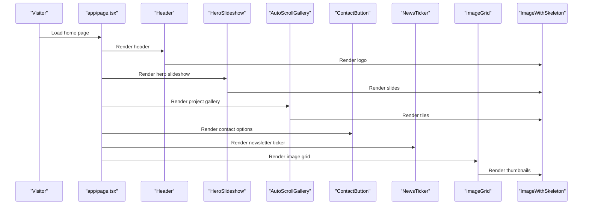
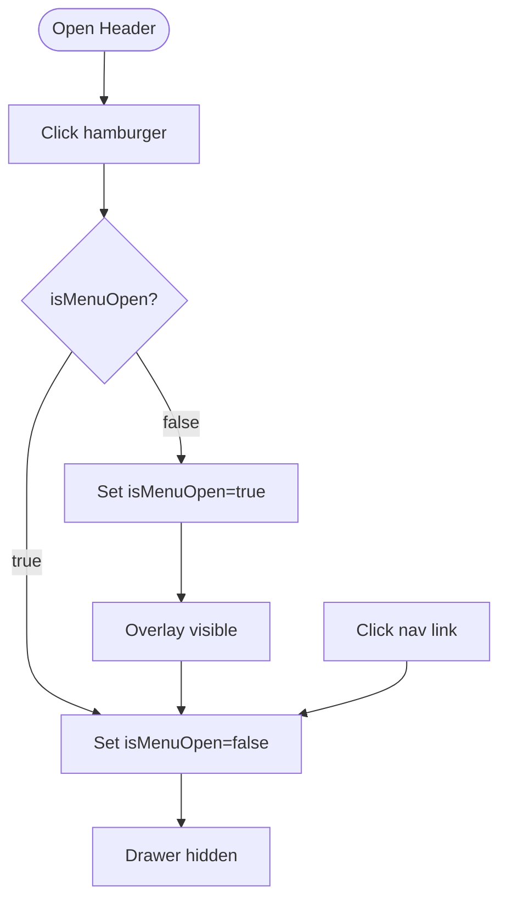
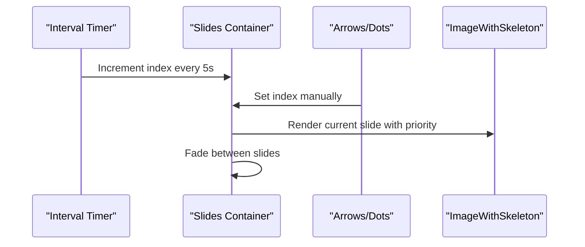
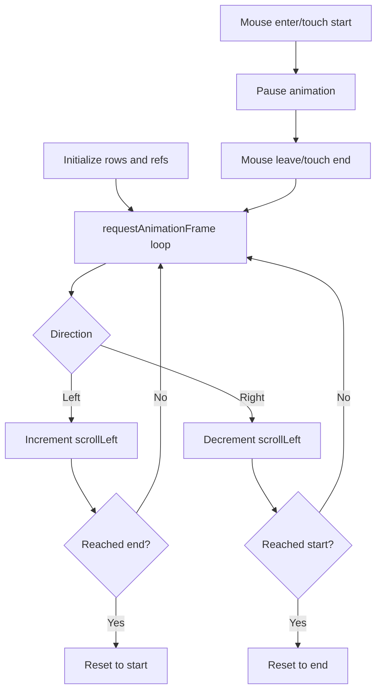
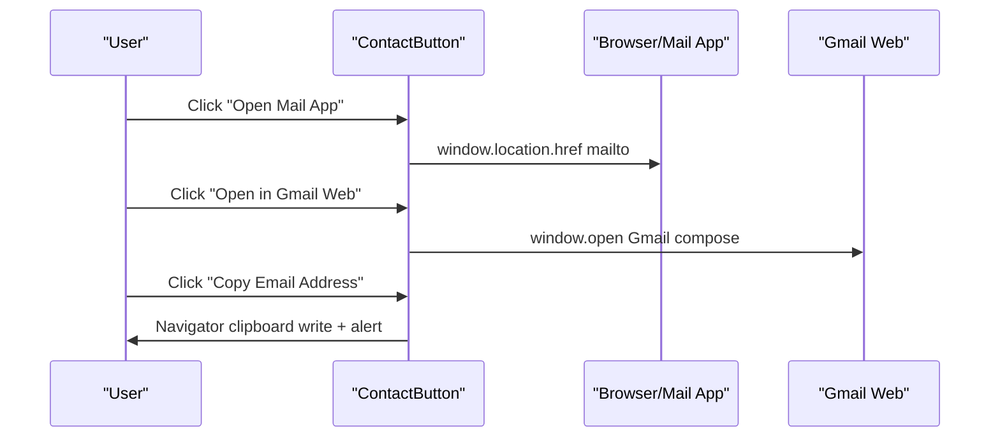
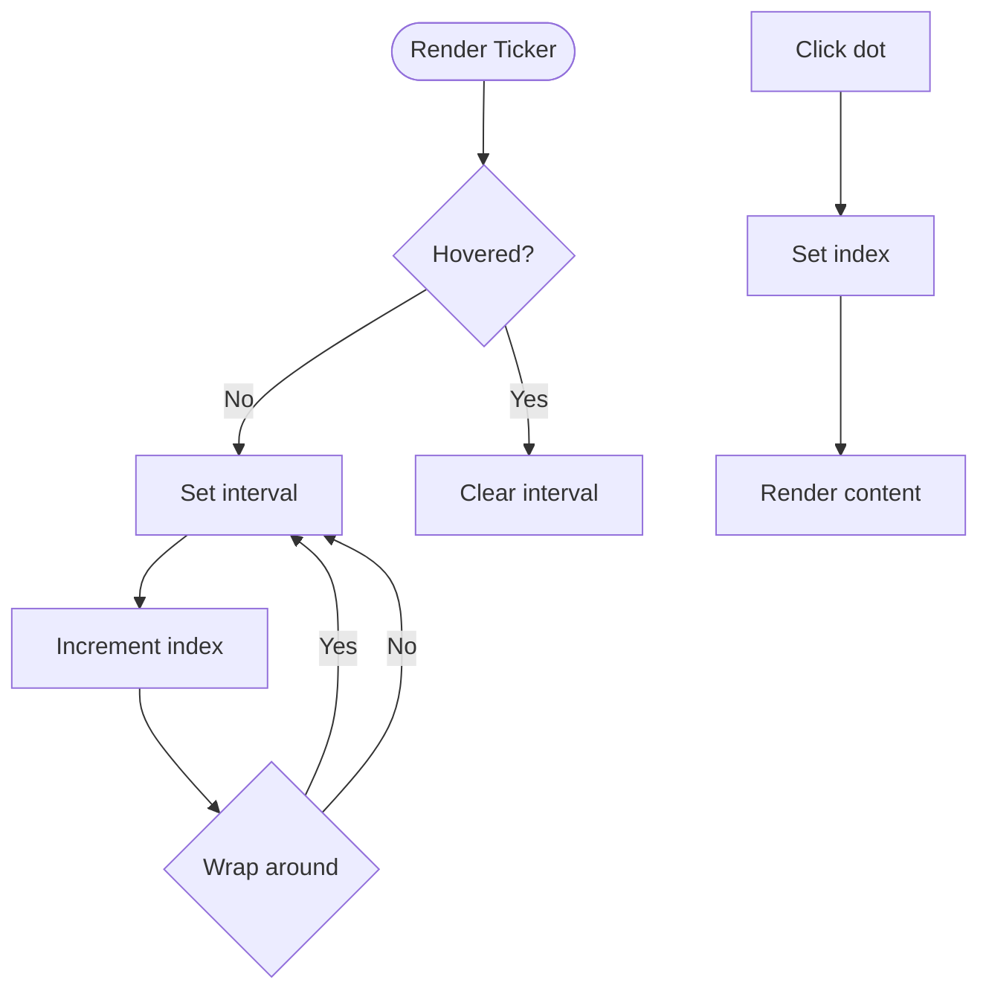
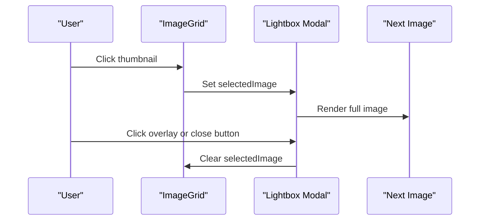
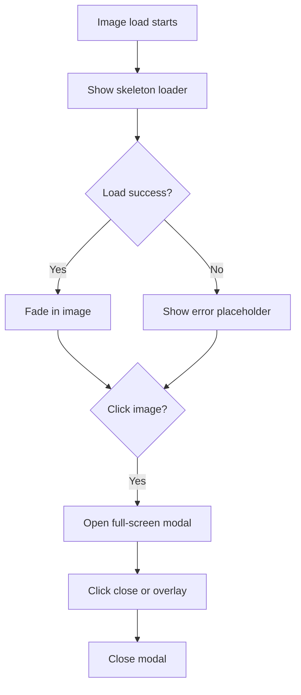
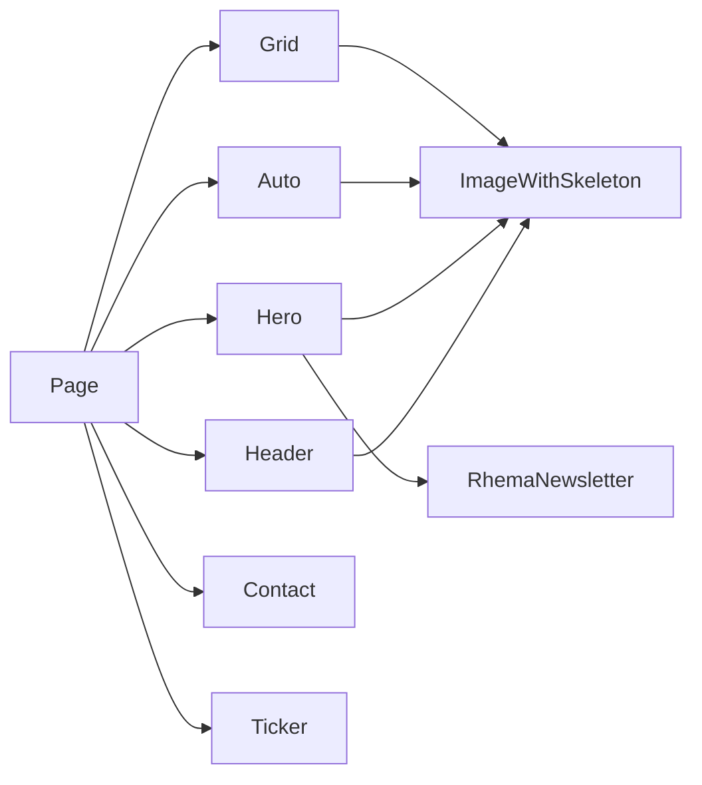

# UI Components

<cite>
**Referenced Files in This Document**
- [Header.tsx](file://components/Header.tsx)
- [HeroSlideshow.tsx](file://components/HeroSlideshow.tsx)
- [AutoScrollGallery.tsx](file://components/AutoScrollGallery.tsx)
- [ContactButton.tsx](file://components/ContactButton.tsx)
- [NewsTicker.tsx](file://components/NewsTicker.tsx)
- [ImageGrid.tsx](file://components/ImageGrid.tsx)
- [ImageWithSkeleton.tsx](file://components/ImageWithSkeleton.tsx)
- [globals.css](file://app/globals.css)
- [layout.tsx](file://app/layout.tsx)
- [page.tsx](file://app/page.tsx)
- [supabase.ts](file://types/supabase.ts)
</cite>

## Table of Contents
1. [Introduction](#introduction)
2. [Project Structure](#project-structure)
3. [Core Components](#core-components)
4. [Architecture Overview](#architecture-overview)
5. [Detailed Component Analysis](#detailed-component-analysis)
6. [Dependency Analysis](#dependency-analysis)
7. [Performance Considerations](#performance-considerations)
8. [Troubleshooting Guide](#troubleshooting-guide)
9. [Conclusion](#conclusion)
10. [Appendices](#appendices)

## Introduction
This document describes the UI component library used in Rhema Expert Solutions. It focuses on reusable components that power the marketing website: Header, HeroSlideshow, AutoScrollGallery, ContactButton, NewsTicker, ImageGrid, and ImageWithSkeleton. For each component, we explain visual appearance, behavior, user interaction patterns, props/attributes, customization options, integration guidelines, responsive design considerations, accessibility compliance, composition patterns, state management, performance optimizations, styling approaches using Tailwind CSS, animations, and cross-browser compatibility. We also show how components work together to create the overall user experience and provide extension/modification guidelines.

## Project Structure
The UI components live under the components directory and are integrated into the Next.js pages router via the root page. Global styles and fonts are configured in the app directory. Dynamic content is fetched from Supabase and passed to components as props.

```mermaid
graph TB
subgraph "App Layer"
Page["app/page.tsx"]
Layout["app/layout.tsx"]
Styles["app/globals.css"]
end
subgraph "Components"
Header["components/Header.tsx"]
Hero["components/HeroSlideshow.tsx"]
Auto["components/AutoScrollGallery.tsx"]
Contact["components/ContactButton.tsx"]
Ticker["components/NewsTicker.tsx"]
Grid["components/ImageGrid.tsx"]
Img["components/ImageWithSkeleton.tsx"]
end
subgraph "Types"
Types["types/supabase.ts"]
end
Page --> Header
Page --> Hero
Page --> Auto
Page --> Contact
Page --> Ticker
Page --> Grid
Hero --> Img
Header --> Img
Grid --> Img
Auto --> Img
Ticker --> Types
Layout --> Styles
```

**Diagram sources**
- [page.tsx:12-787](file://app/page.tsx#L12-L787)
- [layout.tsx:1-43](file://app/layout.tsx#L1-L43)
- [globals.css:1-31](file://app/globals.css#L1-L31)
- [Header.tsx:1-136](file://components/Header.tsx#L1-L136)
- [HeroSlideshow.tsx:1-96](file://components/HeroSlideshow.tsx#L1-L96)
- [AutoScrollGallery.tsx:1-101](file://components/AutoScrollGallery.tsx#L1-L101)
- [ContactButton.tsx:1-58](file://components/ContactButton.tsx#L1-L58)
- [NewsTicker.tsx:1-92](file://components/NewsTicker.tsx#L1-L92)
- [ImageGrid.tsx:1-64](file://components/ImageGrid.tsx#L1-L64)
- [ImageWithSkeleton.tsx:1-121](file://components/ImageWithSkeleton.tsx#L1-L121)
- [supabase.ts:1-98](file://types/supabase.ts#L1-L98)

**Section sources**
- [page.tsx:12-787](file://app/page.tsx#L12-L787)
- [layout.tsx:1-43](file://app/layout.tsx#L1-L43)
- [globals.css:1-31](file://app/globals.css#L1-L31)

## Core Components
- Header: Responsive navigation with logo, desktop links, social icon, and a mobile sidebar drawer. Uses local state for menu visibility and integrates ImageWithSkeleton for the logo.
- HeroSlideshow: Auto-rotating hero carousel with manual controls and navigation dots. Uses ImageWithSkeleton for image loading and skeleton fallback.
- AutoScrollGallery: Three-row auto-scrolling gallery with directional alternation and hover pause. Uses ImageWithSkeleton for each tile.
- ContactButton: Quick contact options with mailto, Gmail web compose, and copy-to-clipboard.
- NewsTicker: Horizontal ticker displaying latest newsletter entries with interval-based rotation and hover pause.
- ImageGrid: Responsive grid of thumbnails with lightbox modal and click-to-enlarge behavior.
- ImageWithSkeleton: Generic image wrapper with skeleton loader, error placeholder, and full-screen lightbox.

**Section sources**
- [Header.tsx:1-136](file://components/Header.tsx#L1-L136)
- [HeroSlideshow.tsx:1-96](file://components/HeroSlideshow.tsx#L1-L96)
- [AutoScrollGallery.tsx:1-101](file://components/AutoScrollGallery.tsx#L1-L101)
- [ContactButton.tsx:1-58](file://components/ContactButton.tsx#L1-L58)
- [NewsTicker.tsx:1-92](file://components/NewsTicker.tsx#L1-L92)
- [ImageGrid.tsx:1-64](file://components/ImageGrid.tsx#L1-L64)
- [ImageWithSkeleton.tsx:1-121](file://components/ImageWithSkeleton.tsx#L1-L121)

## Architecture Overview
The components are designed as client-side React components using Next.js App Router conventions. They rely on:
- Tailwind CSS for styling and responsive breakpoints.
- Next.js Image for optimized image rendering.
- Local state for interactive behaviors.
- Composition patterns: Header composes ImageWithSkeleton; HeroSlideshow composes ImageWithSkeleton; AutoScrollGallery composes ImageWithSkeleton; ImageGrid composes ImageWithSkeleton; NewsTicker consumes typed data from Supabase.



**Diagram sources**
- [page.tsx:12-787](file://app/page.tsx#L12-L787)
- [Header.tsx:1-136](file://components/Header.tsx#L1-L136)
- [HeroSlideshow.tsx:1-96](file://components/HeroSlideshow.tsx#L1-L96)
- [AutoScrollGallery.tsx:1-101](file://components/AutoScrollGallery.tsx#L1-L101)
- [ContactButton.tsx:1-58](file://components/ContactButton.tsx#L1-L58)
- [NewsTicker.tsx:1-92](file://components/NewsTicker.tsx#L1-L92)
- [ImageGrid.tsx:1-64](file://components/ImageGrid.tsx#L1-L64)
- [ImageWithSkeleton.tsx:1-121](file://components/ImageWithSkeleton.tsx#L1-L121)

## Detailed Component Analysis

### Header
- Purpose: Brand identity, navigation, and quick access to external resources.
- Visual appearance: White background with sticky top positioning, centered logo and brand text, desktop horizontal nav, and mobile hamburger menu with overlay and drawer.
- Behavior: Toggle menu via state; overlay closes drawer; mobile drawer links close drawer on click; CBT button opens external exam portal.
- Props/Attributes: None (no props interface).
- Interaction patterns: Click hamburger to open/close; click overlay to close; hover effects on links; animated pulse on competitions link.
- Accessibility: Proper aria-labels for buttons; focusable elements styled appropriately; external links use rel="noopener noreferrer".
- Integration: Used at the top of every page; composes ImageWithSkeleton for logo.
- Customization: Adjust colors via Tailwind utilities; modify breakpoints; update links and icons.



**Diagram sources**
- [Header.tsx:10-16](file://components/Header.tsx#L10-L16)
- [Header.tsx:84-133](file://components/Header.tsx#L84-L133)

**Section sources**
- [Header.tsx:1-136](file://components/Header.tsx#L1-L136)

### HeroSlideshow
- Purpose: Hero carousel showcasing project imagery with auto-rotation and manual controls.
- Visual appearance: Full-width rounded container with gradient overlay and title text; arrows appear on hover; navigation dots indicate current slide.
- Behavior: Auto-advance every 5 seconds; manual next/previous; dot selection; priority loading for first slide.
- Props/Attributes:
  - images: string[] — image URLs to cycle through.
- Interaction patterns: Hover group reveals arrows; click arrows or dots navigates; initial slide prioritized.
- Accessibility: Arrows and dots have aria-labels; keyboard accessible via focus styles.
- Integration: Used in hero section; composes ImageWithSkeleton for each slide.
- Customization: Adjust timing, arrow styles, dot styles, and gradient overlay.



**Diagram sources**
- [HeroSlideshow.tsx:14-22](file://components/HeroSlideshow.tsx#L14-L22)
- [HeroSlideshow.tsx:24-30](file://components/HeroSlideshow.tsx#L24-L30)
- [HeroSlideshow.tsx:34-94](file://components/HeroSlideshow.tsx#L34-L94)

**Section sources**
- [HeroSlideshow.tsx:1-96](file://components/HeroSlideshow.tsx#L1-L96)

### AutoScrollGallery
- Purpose: Three-row auto-scrolling gallery with alternating directions and hover pause.
- Visual appearance: Horizontal scrollers with seamless looping by duplicating content; thumbnails sized 64x48; rounded corners and shadows.
- Behavior: requestAnimationFrame-driven scroll; direction-based wrap-around; hover/touch pause; three rows split evenly.
- Props/Attributes:
  - images: string[] — image URLs to display.
- Interaction patterns: Continuous auto-scroll; pause on hover/touch; manual horizontal scroll.
- Accessibility: No interactive controls; relies on native scroll behavior.
- Integration: Used in “Our Projects” section; composes ImageWithSkeleton for each tile.
- Customization: Adjust speed, direction, and sizing; tune duplication count for seamless loops.



**Diagram sources**
- [AutoScrollGallery.tsx:24-59](file://components/AutoScrollGallery.tsx#L24-L59)
- [AutoScrollGallery.tsx:86-100](file://components/AutoScrollGallery.tsx#L86-L100)

**Section sources**
- [AutoScrollGallery.tsx:1-101](file://components/AutoScrollGallery.tsx#L1-L101)

### ContactButton
- Purpose: Provide quick contact options to users.
- Visual appearance: Two prominent buttons for opening mail app and Gmail web; one for copying email; hover scaling and shadow transitions.
- Behavior: mailto opens default client; Gmail web opens external compose; clipboard write triggers alert.
- Props/Attributes: None.
- Interaction patterns: Click to open mail client or compose; click to copy email.
- Accessibility: Buttons are focusable; icons accompanied by text; alert informs user after copy.
- Integration: Used in “Get In Touch” section.
- Customization: Modify colors, icons, and labels; adjust subject and email via constants.



**Diagram sources**
- [ContactButton.tsx:10-23](file://components/ContactButton.tsx#L10-L23)

**Section sources**
- [ContactButton.tsx:1-58](file://components/ContactButton.tsx#L1-L58)

### NewsTicker
- Purpose: Display latest newsletter updates with interval-based rotation and hover pause.
- Visual appearance: Backdrop blur card with subtle border and rounded corners; animated progress indicator; “LATEST NEWS” badge and date; navigation dots.
- Behavior: Auto-advance when not hovered; hover pauses; click dots jumps to item; interval configurable.
- Props/Attributes:
  - newsletters: RhemaNewsletter[]
  - interval?: number (default 5000)
- Interaction patterns: Mouse enter/leave toggles pause; dot clicks navigate.
- Accessibility: Dot buttons have aria-labels; content transitions smoothly.
- Integration: Used in hero section; consumes typed data from Supabase.
- Customization: Adjust interval, styling, and content truncation.



**Diagram sources**
- [NewsTicker.tsx:15-23](file://components/NewsTicker.tsx#L15-L23)
- [NewsTicker.tsx:11-25](file://components/NewsTicker.tsx#L11-L25)
- [supabase.ts:46-54](file://types/supabase.ts#L46-L54)

**Section sources**
- [NewsTicker.tsx:1-92](file://components/NewsTicker.tsx#L1-L92)
- [supabase.ts:46-54](file://types/supabase.ts#L46-L54)

### ImageGrid
- Purpose: Display a responsive grid of project thumbnails with lightbox modal.
- Visual appearance: Responsive grid (1–4 columns depending on viewport); hover lift and shadow; lightbox overlay with full-size image and close button.
- Behavior: Click thumbnail to open modal; click overlay or close button to dismiss; escape key not bound.
- Props/Attributes:
  - images: string[]
  - title?: string
  - description?: string
- Interaction patterns: Thumbnail click opens modal; overlay click closes; close button exits.
- Accessibility: Modal overlay captures focus; close button is focusable; alt text used for images.
- Integration: Used in sections requiring image previews.
- Customization: Adjust grid columns, modal sizing, and click behavior.



**Diagram sources**
- [ImageGrid.tsx:40-60](file://components/ImageGrid.tsx#L40-L60)

**Section sources**
- [ImageGrid.tsx:1-64](file://components/ImageGrid.tsx#L1-L64)

### ImageWithSkeleton
- Purpose: Optimistic image loading with skeleton and error placeholders; optional full-screen lightbox.
- Visual appearance: Skeleton loader with animated pulse; error placeholder icon; smooth fade-in on load; full-screen modal with close button.
- Behavior: Shows skeleton until load/error; transitions to image; error state displays icon; click to open full-screen; click to close.
- Props/Attributes:
  - Inherits Next.js ImageProps
  - containerClassName?: string
- Interaction patterns: Click image to open full-screen; click anywhere to close; handles load and error callbacks.
- Accessibility: Skeleton and error states are visually indicated; full-screen modal includes close button with label.
- Integration: Used by Header, HeroSlideshow, AutoScrollGallery, ImageGrid, and other components.
- Customization: Adjust animation durations, container styles, and full-screen sizing.



**Diagram sources**
- [ImageWithSkeleton.tsx:21-22](file://components/ImageWithSkeleton.tsx#L21-L22)
- [ImageWithSkeleton.tsx:49-87](file://components/ImageWithSkeleton.tsx#L49-L87)
- [ImageWithSkeleton.tsx:90-117](file://components/ImageWithSkeleton.tsx#L90-L117)

**Section sources**
- [ImageWithSkeleton.tsx:1-121](file://components/ImageWithSkeleton.tsx#L1-L121)

## Dependency Analysis
- Internal dependencies:
  - Header depends on ImageWithSkeleton for logo.
  - HeroSlideshow depends on ImageWithSkeleton for slides.
  - AutoScrollGallery depends on ImageWithSkeleton for tiles.
  - ImageGrid depends on ImageWithSkeleton for thumbnails.
  - NewsTicker depends on typed data from Supabase.
- External dependencies:
  - Next.js Image for optimized image rendering.
  - Tailwind CSS for styling and responsive utilities.
  - React hooks for state and effects.
- Coupling and cohesion:
  - Components are cohesive around a single responsibility and loosely coupled via props and composition.
  - ImageWithSkeleton centralizes image loading behavior, reducing duplication.



**Diagram sources**
- [Header.tsx:23-29](file://components/Header.tsx#L23-L29)
- [HeroSlideshow.tsx:43-49](file://components/HeroSlideshow.tsx#L43-L49)
- [AutoScrollGallery.tsx:74-79](file://components/AutoScrollGallery.tsx#L74-L79)
- [ImageGrid.tsx:28-34](file://components/ImageGrid.tsx#L28-L34)
- [NewsTicker.tsx:4-7](file://components/NewsTicker.tsx#L4-L7)
- [page.tsx:12-787](file://app/page.tsx#L12-L787)

**Section sources**
- [Header.tsx:1-136](file://components/Header.tsx#L1-L136)
- [HeroSlideshow.tsx:1-96](file://components/HeroSlideshow.tsx#L1-L96)
- [AutoScrollGallery.tsx:1-101](file://components/AutoScrollGallery.tsx#L1-L101)
- [ImageGrid.tsx:1-64](file://components/ImageGrid.tsx#L1-L64)
- [NewsTicker.tsx:1-92](file://components/NewsTicker.tsx#L1-L92)
- [page.tsx:12-787](file://app/page.tsx#L12-L787)

## Performance Considerations
- Image optimization:
  - Next.js Image is used everywhere for automatic optimization, lazy loading, and responsive sizing.
  - HeroSlideshow sets priority on the first slide to improve Largest Contentful Paint (LCP).
- Animation and effects:
  - requestAnimationFrame-based auto-scroll avoids blocking the UI thread.
  - CSS transitions and transforms leverage GPU acceleration.
- State and timers:
  - Timers are cleared on unmount to prevent memory leaks.
  - AutoScrollGallery duplicates content to reduce perceived gaps during seamless loops.
- Accessibility and UX:
  - Skeleton loaders improve perceived performance and reduce layout shift.
  - Hover pause prevents motion-induced discomfort.
- Cross-browser compatibility:
  - Tailwind utilities and modern CSS features are widely supported; ensure polyfills if targeting older browsers.

[No sources needed since this section provides general guidance]

## Troubleshooting Guide
- HeroSlideshow does not advance:
  - Verify images prop is an array and not empty; ensure intervals are not blocked by focus/visibility.
- AutoScrollGallery not scrolling:
  - Confirm scroll container exists and direction/speed props are set; check for overflow hidden or fixed widths.
- ContactButton not opening mail client:
  - Ensure browser allows pop-ups; confirm mailto protocol is supported; test on device/emulator.
- NewsTicker not rotating:
  - Check newsletters length and interval; ensure hover state is not preventing advancement.
- ImageWithSkeleton not transitioning:
  - Verify onLoad/onError handlers are not throwing; ensure alt and src are provided.
- Header drawer not closing:
  - Confirm overlay click handler and close button are attached; ensure state updates are reflected.

**Section sources**
- [HeroSlideshow.tsx:14-22](file://components/HeroSlideshow.tsx#L14-L22)
- [AutoScrollGallery.tsx:24-59](file://components/AutoScrollGallery.tsx#L24-L59)
- [ContactButton.tsx:10-23](file://components/ContactButton.tsx#L10-L23)
- [NewsTicker.tsx:15-23](file://components/NewsTicker.tsx#L15-L23)
- [ImageWithSkeleton.tsx:76-84](file://components/ImageWithSkeleton.tsx#L76-L84)
- [Header.tsx:84-133](file://components/Header.tsx#L84-L133)

## Conclusion
The UI component library emphasizes performance, accessibility, and composability. Components share a consistent design language powered by Tailwind CSS and Next.js Image, while local state and timers manage interactivity. Together, they deliver a polished user experience across devices and contexts.

[No sources needed since this section summarizes without analyzing specific files]

## Appendices

### Styling and Theming
- Theme tokens:
  - CSS variables define primary and secondary colors; body adapts to light/dark mode.
- Fonts:
  - Next.js Google Fonts applied globally; variables used in Tailwind theme.
- Tailwind utilities:
  - Extensive use of spacing, colors, shadows, transitions, and responsive modifiers.

**Section sources**
- [globals.css:1-31](file://app/globals.css#L1-L31)
- [layout.tsx:6-14](file://app/layout.tsx#L6-L14)

### Integration Guidelines
- Import components into pages or layouts where needed.
- Pass required props (e.g., images[], newsletters[]) from data sources.
- Compose components to build sections (e.g., HeroSlideshow inside hero area).
- Respect responsive breakpoints and accessibility attributes.

**Section sources**
- [page.tsx:12-787](file://app/page.tsx#L12-L787)
- [Header.tsx:1-136](file://components/Header.tsx#L1-L136)
- [HeroSlideshow.tsx:1-96](file://components/HeroSlideshow.tsx#L1-L96)
- [AutoScrollGallery.tsx:1-101](file://components/AutoScrollGallery.tsx#L1-L101)
- [ContactButton.tsx:1-58](file://components/ContactButton.tsx#L1-L58)
- [NewsTicker.tsx:1-92](file://components/NewsTicker.tsx#L1-L92)
- [ImageGrid.tsx:1-64](file://components/ImageGrid.tsx#L1-L64)
- [ImageWithSkeleton.tsx:1-121](file://components/ImageWithSkeleton.tsx#L1-L121)